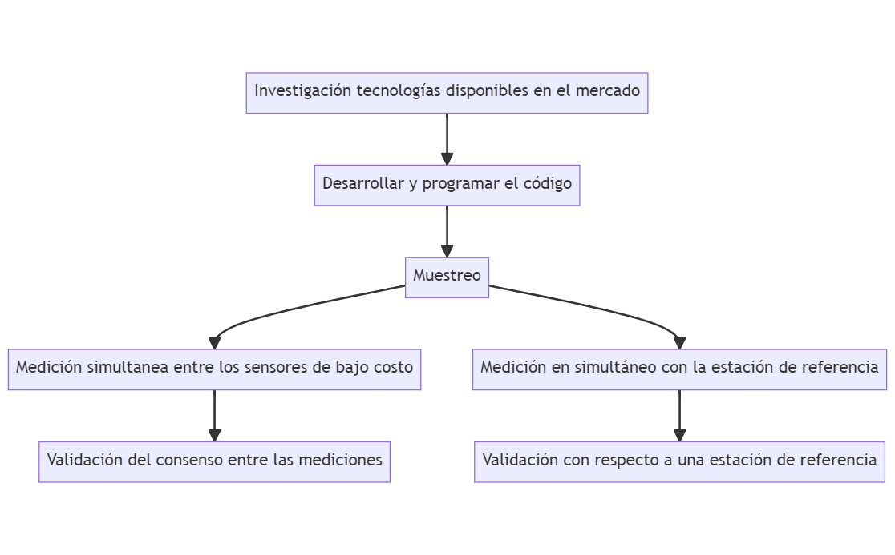
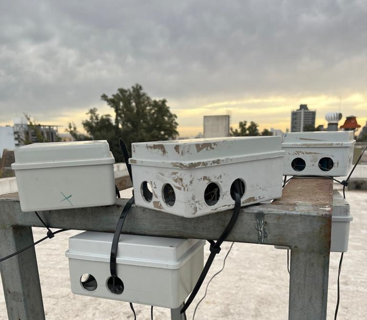
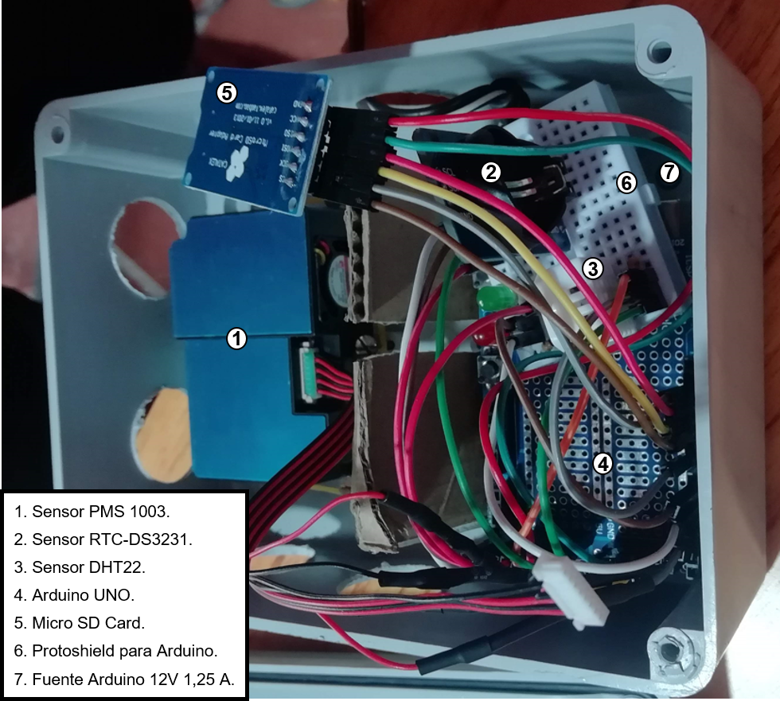
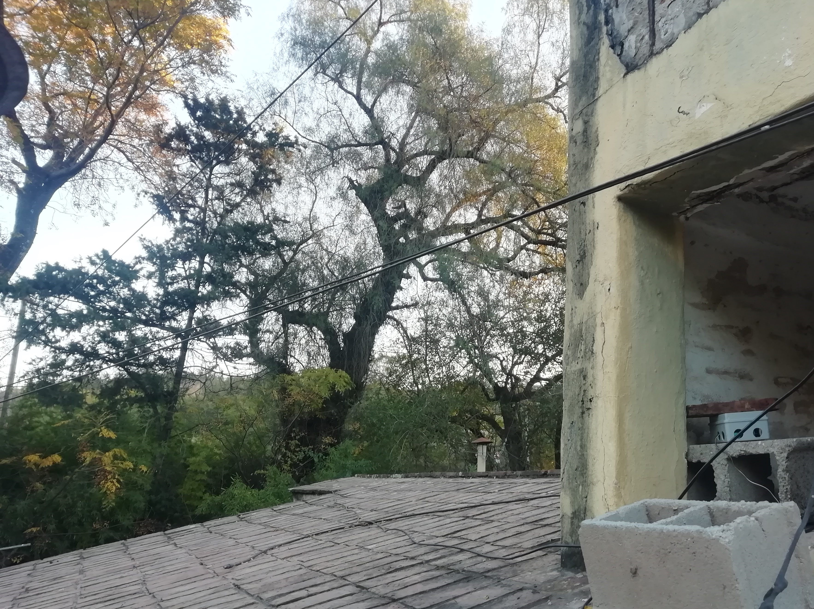
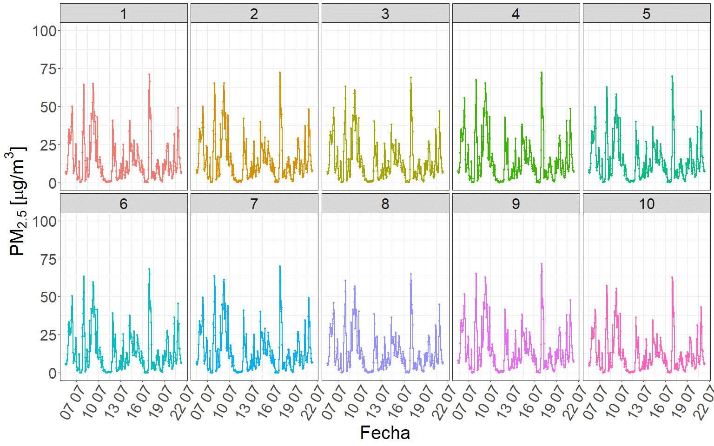
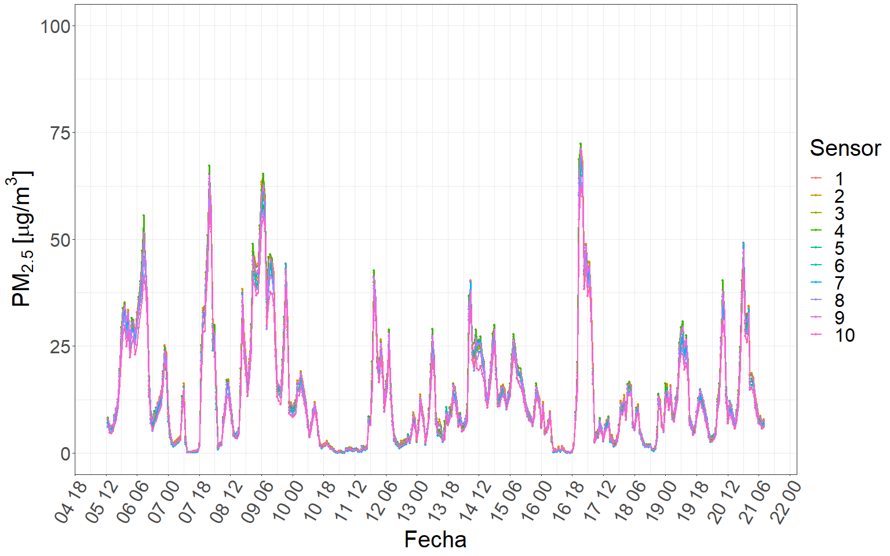
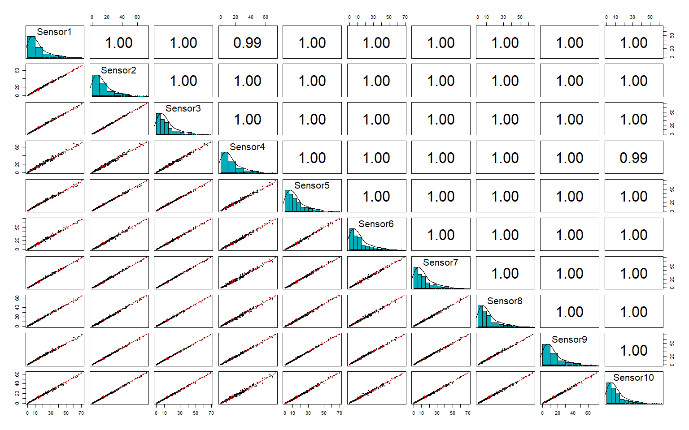
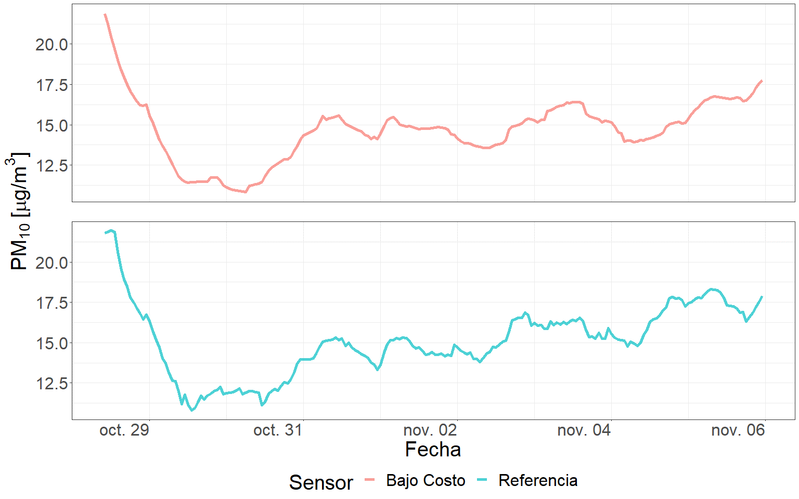
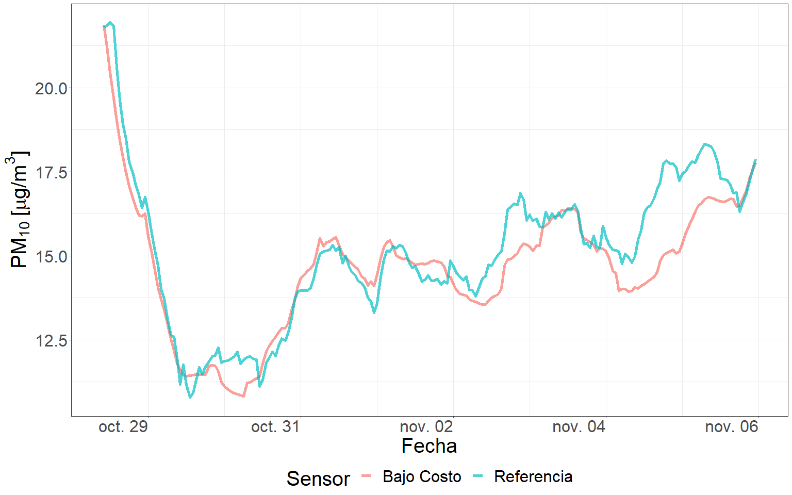
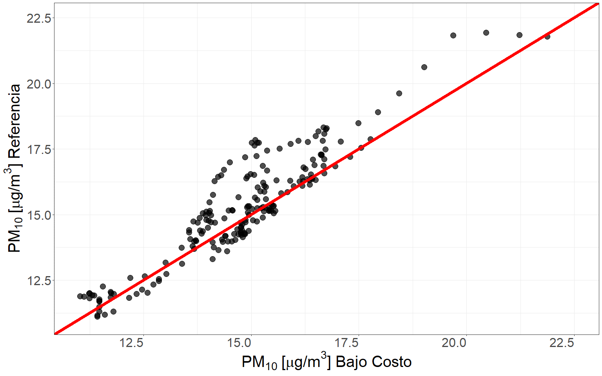

# Sistema de monitoreo basado en sensores de bajo costo {#cap:sens}

## Introducción

  Solo países desarrollados económicamente tienen la capacidad de generar redes de vigilancia de la calidad del aire basadas en equipos certificados de referencia. Un país que marca tendencia en cuanto al seguimiento y control del PM es Estados Unidos, donde se lleva a cabo una vigilancia exhaustiva de este contaminante a nivel del suelo por medio de del Método Federal de Referencia (FRM) y los Métodos Federales Equivalentes (FEM) [@noble2001federal]. Este cuenta con aproximadamente 600 estaciones de referencia en todo el país, las cuales además se complementan con mediciones satelitales y otros métodos alternativos de seguimiento para lograr extrapolar los resultados a todo el territorio nacional [@christopher2010satellite]. A pesar de ser un país que marca tendencia en lo que es el control y gestión de la calidad del aire, establece protocolos y normativas que responden a la realidad de un país sumamente desarrollado económicamente, además de desarrollar tecnologías cuya accesibilidad requiere elevados presupuestos. Estos estándares representan metas inalcanzables para países en vías de desarrollo, motivo por el cual se hace necesario migrar hacia alternativas de bajo costo para la gestión y control de la calidad del aire. En el siguiente texto, se describirán las principales tecnologías de medición y control del PM y sus alternativas de bajo costo. 

  Los instrumentos de medición del FRM son una extensión del método gravimétrico [@noble2001federal]. Estos instrumentos emplean una corriente de aire de 16,67 litros por minuto, permitiendo la succión que garantiza el muestreo [@noble2001federal]. La entrada al instrumento está diseñada con el objetivo de impedir el ingreso de insectos y precipitaciones, además de ser independiente de la velocidad y dirección del viento. Luego del ingreso al instrumento, un separador granulométrico inercial separa partículas en función del diámetro, reteniendo diámetros aerodinámicos superiores a 10 micrómetros. Posteriormente, un segundo separador granulométrico inercial localizado agua abajo es el encargado de separar las partículas con diámetros aerodinámicos superiores a 2.5 micrómetros. Finalmente, las partículas restantes son recogidas en un filtro de politetrafluoroetileno de teflón, el cual es pesado antes y después de su uso para determinar el incremento neto de masa. La regulación del funcionamiento y el mantenimiento de estos instrumentos, así como la interpretación de sus datos, están estandarizadas por el Código de Regulaciones Federales para asegurar buenas prácticas de medición, precisas y consistentes en todas las instituciones, organizaciones y estaciones de monitoreo terrestres [@amaral2015overview].

  Otros instrumentos de medición frecuentemente utilizados en las estaciones de control en tierra se conocen como FEM. Uno de estos es la Microbalanza Oscilante de Elementos Cónicos (TEOM) [@noble2001federal], la cual consta de un tubo de cuarzo hueco y vibrante con una frecuencia de resonancia conocida. Esta pieza se conoce como elemento cónico y es el encargado del muestreo, por medio de un filtro que se halla posicionado en su punta. El circuito del TEOM contiene un sistema de retroalimentación que mantiene la amplitud de oscilación del elemento cónico, a medida que la muestra pasa por el instrumento, el PM es recogido en el filtro cambiando la frecuencia de resonancia del elemento cónico. Este cambio de frecuencia es medido y junto con las especificaciones del filtro y el dato de caudal volumétrico permiten la estimación de la concentración de PM en el aire. 

  El monitor de atenuación beta (BAM), es otro instrumento del FEM [@noble2001federal]. Sus principales componentes son un radiador beta y un detector beta. El radiador es generalmente de Carbono-14 dadas sus características que lo posicionan como una fuente radiativa segura derivada de sus propiedades energéticas, de vida media larga y su abundancia relativa. A partir de esta fuente, se establece un recuento beta de referencia a través de una cinta filtrante fibrosa previo al comienzo de la medición. El detector utilizado en estos instrumentos es generalmente un contador Geiger Muller o un fotodiodo [@gilliam2016reference]. Una vez determinada la línea de base, el área de la cinta filtrante avanza a la etapa de muestreo y una corriente de PM pasa por el filtro [@gilliam2016reference]. Una vez finalizado el muestreo, la misma zona de cinta filtrante es sometida a otra medición beta. La diferencia en estas mediciones permite estimar la masa de PM recogida, esta luego se divide por el volumen total que atravesó el filtro, proporcionando la medición de la concentración de PM promediada en el tiempo. Este proceso debe repetirse cada 15 minutos para cumplir la normativa federal [@gilliam2016reference].

  Cuando se requieren mediciones en tiempo real, el FEM recomienda el uso de sensores de dispersión de luz (OPC), a pesar de su elevado costo. El OPC funciona generando un flujo volumétrico de ingreso constante a una cámara de dispersión, la cual es lo suficientemente pequeña como para suponer que las partículas ingresan de a una a la vez. Dentro de la cámara se emplea un diodo láser como fuente de luz constante, cada vez que una partícula ingresa a la cámara, dispersa parte de la luz, la cual es detectada por un fotodetector. Esta medición es la que permite estimar la concentración de PM por medio de una curva de calibración experimental [@amaral2015overview].

  Como alternativa de menor costo a los sistemas de medición de PM, pueden utilizarse otros dispositivos de dispersión de luz, entre los cuales se destacan los fotómetros de dispersión, los nefelómetros y los contadores de partículas por condensación (CPC). El funcionamiento de los fotómetros de dispersión es similar al de los OPC, la principal diferencia radica en las mayores dimensiones del puerto de entrada y la cámara, permitiendo así el ingreso de un mayor volumen de partículas para su medición. De esta forma se miden nubes de partículas en lugar de partículas individuales [@amaral2015overview], a pesar de que se miden mayores concentraciones de PM, se pierde información relativa a la individualidad de la partícula. Los nefelómetros funcionan de forma similar a los fotómetros de dispersión en el sentido de que miden nubes de partículas, sin embargo, a menudo incluyen múltiples fuentes de luz aumentando así el rango de longitudes de onda y múltiples fotodetectores para recoger la luz en distintos ángulos [@hagan2020assessing]. Estos ofrecen mediciones de mayor concentración, a expensas del diámetro aerodinámico de las partículas individuales.

  En países en vías de desarrollo, frente a la necesidad de control de la calidad del aire y los elevados costos de adquisición y manutención de los FRM y FEM, se recurre a sensores portátiles y de bajo costo. A efectos de esta tesis, se entiende por bajo costo a sensores que cuestan menos de 50 dólares. En esta tesis se evaluó la aplicación de un sensor láser de medición de partículas de bajo costo que sigue el principio de funcionamiento del fotómetro de dispersión. Este proporciona una solución económica para el monitoreo y control de la concentración de PM~2.5~. Sus principales ventajas frente a los FRM y los FEM incluyen mediciones en tiempo real de los valores de concentración, además de su portabilidad y rentabilidad. Estas ventajas son a expensas de la exactitud en la medición e información acerca de la composición e individualidad de la partícula. 
  
  El monitoreo de la calidad del aire es una herramienta fundamental a la hora de identificar y evaluar problemas de contaminación [@organizacion2021global], y junto con modelos predictivos e inventarios de emisión, forman parte integral de los sistemas de gestión y control de la calidad del aire. Su propósito primordial recae en la provisión de información a los científicos, legisladores y planificadores, con el objetivo de fomentar la toma de decisiones para la gestión, mejora del ambiente y preservación de la salud pública. El objetivo del presente capítulo es evaluar la utilidad de sensores de bajo costo para el monitoreo de la concentración de PM~2.5~ en el área metropolitana de la provincia de Córdoba, Argentina. Para abarcar este objetivo fue necesario el diseño y desarrollo de un sistema de monitoreo basado en sensores de bajo costo que permitiesen recopilar datos de concentración de PM~2.5~. Además, resulto indispensable determinar la integridad de las mediciones realizadas, no solo la estabilidad entre sensores, si no que también su validación respecto a una estación de referencia.

## Materiales y métodos

### Resumen gráfico del protocolo analítico

```{r sens, echo=FALSE, out.width="100%", fig.align="center",fig.cap="(ref:sens)"}

```
(ref:sens) Resumen gráfico del protocolo analítico desarrollado en el capítulo 2.

  La figura \@ref(fig:sens) ilustra el protocolo analítico desarrollado en el capítulo 2, proporcionando una visión ordenada de las distintas actividades llevadas a cabo para lograr su objetivo. En primer lugar, se menciona la intensa investigación de las tecnologías disponibles en el mercado vinculadas a los sensores de bajo costo. A continuación, se visualiza el procedimiento de desarrollo de un sistema de monitoreo de bajo costo específicamente diseñado para la medición de la concentración de PM~2.5~. Posteriormente se hace referencia a la evaluación de la calidad del dato, la cual se encuentra dividida en dos partes principales: la primera se centra en determinar el consenso de las mediciones obtenidas por los distintos sensores, mientras que la segunda parte se enfoca en comparar las mediciones con respecto a las de una estación de referencia, evaluando su fiabilidad y precisión en relación con una fuente de datos establecida y confiable.

### Desarrollo del sistema de monitoreo basado en sensores de bajo costo

  En el marco del estudio de sensores de bajo costo para la medición de PM, se llevó a cabo una investigación de las distintas tecnologías disponibles en el mercado. Luego de analizar diferentes aspectos, como precisión de medición, costo, funcionamiento, tamaño, sensibilidad e interfaz de programación, se seleccionó el sensor PMS 1003 de la marca Plantower como la opción más viable. Este sensor utiliza un haz láser para medir las partículas en tres rangos de tamaño diferentes: PM~1.0~, PM~2.5~ y PM~10~. Es importante mencionar que el sensor mide solo PM~2.5~, pero mediante el uso de un algoritmo de estimación, genera datos de concentración para las demás fracciones.

  Para garantizar el correcto funcionamiento del sensor, se procedió a desarrollar y programar el código que permitiría la conexión y comunicación entre los diferentes componentes. Luego de analizar diferentes opciones, se decidió utilizar la plataforma de desarrollo Arduino, junto con una placa Arduino UNO R3 SMD (CH340G) y una de ampliación para facilitar la conexión de los numerosos pines. La información recopilada se registró en una memoria micro SD. Como resultado, el producto final quedó conformado por los siguientes componentes:

  1.	Sensor PMS 1003 Plantower.
  2.	Sensor RTC-DS3231 - con EEPROM I2C.
  3.	Sensor DHT22 - Módulo Sensor Digital de Temperatura y Humedad.
  4.	Arduino UNO R3 SMD (CH340G) comp / ATmega328 16MHz.
  5.	Micro SD Card - Conexión SPI y Reg de Tensión.
  6.	Protoshield para Arduino uno shield y proto 170p unoelectro.
  7.	Fuente Arduino 12V 1,25 A.

  El sensor PMS 1003 es un sensor de calidad del aire basado en el principio de dispersión láser, desarrollado por la compañía Plantower, una empresa de origen Chino con sede en Shenzhen y oficinas en Pekín. Este sensor es el encargado de relevar los datos de PM, además, es capaz de discriminarlo en sus fracciones de PM~1.0~, PM~2.5~ y PM~10~. Este sensor emplea la tecnología de dispersión láser, implementando uno de 660 nm para la medición. El fabricante reporta una precisión de ±10 $\frac{\mu g}{m^3}$ para el PM~2.5~ en el rango de 0 a 500 ±10 $\frac{\mu g}{m^3}$, mientras que para el rango de 500 a 1000 $\frac{\mu g}{m^3}$ el error se estima como ±10 %m.v., lo que significa que el error puede ser de hasta el 10% del valor medido en ese rango de concentración. Es importante tener en cuenta estas especificaciones a la hora de utilizar el sensor, con el objetivo de lograr una correcta interpretación de los datos.
  
  El chip RTC DS3231 en combinación con la EEPROM I2C proporcionan un reloj en tiempo real (RTC) que permite registrar la fecha y hora en que se realizan las  mediciones. Además, cuenta con una interfaz I2C, un oscilador integrado con compensación de temperatura de cristal (TCXO) y un cristal, que mejoran su precisión y la estabilidad del reloj.
  
  El sensor DHT22 es un sensor digital de temperatura y humedad relativa de bajo costo, que permite detectar cualquier anomalía en las condiciones ambientales durante el funcionamiento del sensor. A partir de los datos registrados por este sensor podemos cerciorarnos de las condiciones de funcionamiento, con el objetivo de determinar la calidad de los datos recopilados y llevar a cabo la limpieza de los mismos. Este utiliza un sensor capacitivo de humedad y un termistor que permite medir el aire circundante. Es importante asegurarse de que las condiciones en las que se realiza la medición sean estables y adecuadas para obtener datos confiables.

  Arduino es una plataforma de electrónica abierta para la creación de prototipos basada en software y hardware flexibles. Esta se encuentra diseñada con el objetivo de facilitar la creación de entornos y objetos interactivos. La tarjeta de Arduino que se implementó fue específicamente la UNO R3 SMD, esta es una tarjeta que reduce su costo dado que contiene el chip adaptador USB – SERIAL CH340, a diferencia de las tarjetas más costosas que contienen el FT232. Otra característica que abarata su costo es que emplea ATmega328 en su versión SMD o de montaje superficial. En resumen, se trata de una placa electrónica basada en el microcontrolador ATmega328 que cuenta con 14 pines de entrada y salida digitales (de los cuales 6 pueden ser utilizados como salidas PWM) y 6 entradas analógicas, un conector USB, uno de alimentación y un botón de reinicio.
  
  El módulo micro SD permite incorporar una memoria micro SD, las más utilizadas en el mercado, dada su gran capacidad de almacenamiento en comparación con su reducido tamaño físico. De esta forma, gracias a sus características dan origen a una alternativa sumamente compatible con la plataforma Arduino, sobre todo cuando requerimos almacenar grandes cantidades de información en productos de reducido tamaño.  
  
  La protoshield para Arduino uno junto con el proto unoelectro, permiten duplicar el número de conexiones que podemos realizar en la placa, otorgando mayor espacio para realizar las conexiones. La protoshield, es una placa de expansión analógica y digital que permite la interconexión de múltiples periféricos al estandarizar la disposición de los pines. Esta se acopla al Arduino ampliando las capacidades de la placa de base.
  
  Finalmente, la fuente de alimentación de 12 V es necesaria para garantizar el funcionamiento continuo del sistema de medición. Esta se conecta a una toma eléctrica de pared permitiendo proveer de energía al sistema de monitoreo de bajo costo.

### Base de datos

  En primer lugar, se generó una base de datos de mediciones conjuntas entre los diez sistemas de monitoreo de bajo costo desarrollados, a partir de sus registros en simultáneo. Estas mediciones fueron llevadas a cabo durante un período de 14 días (2 semanas) comprendido entre el 05-07-2022 y el 21-07-2022, en la terraza de la Facultad de Ciencias Exactas, Físicas y Naturales de la Universidad Nacional de Córdoba, Argentina.

```{r MedicionConjunta, echo=FALSE, out.width="100%", fig.align="center", fig.cap="(ref:MedicionConjunta)"}

```
(ref:MedicionConjunta) Medición conjunta simultánea de los sistemas de monitoreo de bajo costo.

  Por otra parte, los datos de la medición en simultáneo con la estación de referencia certificada fueron provistos por el Centro de Investigación y Química Ambiental (CIQA), quienes cuentan con una estación de calidad de aire que emplea equipos de referencia aprobados por la Agencia de Protección Ambiental de Estados Unidos (USEPA). Los datos fueron recopilados desde el 28-10-2021 hasta el 05-11-2021. 
  
  Dado que, la estación de referencia no estima PM~2.5~, la validación fue realizada considerando la variable PM~10~, la cual es estimada por el sensor de bajo costo a partir de la medición de la fracción fina de PM~2.5~.
  
### Protocolo estadístico

#### Validación del consenso entre las mediciones de los sistemas de monitoreo de bajo costo
  
  La determinación del consenso entre las mediciones de los sistemas de monitoreo de bajo costo fue abordada por diversas estrategias. En primer lugar, se llevó a cabo el cálculo y comparación de medidas descriptivas a partir de las series temporales recopiladas. Estas medidas incluyeron la media, la desviación estándar, el primer cuartil, la mediana, el tercer cuartil, el mínimo y el máximo. Esta comparación permitió determinar si existían discrepancias significativas entre los distintos sensores.

  En segundo lugar, se realizaron gráficos exploratorios de las series temporales recopiladas por los sensores. Estos fueron comparados con el objetivo de detectar patrones comunes en los datos y evaluar si los sensores mostraban tendencias similares. Además, se buscó detectar anomalías o fluctuaciones inusuales en los datos.

  Finalmente, se implementó el coeficiente de correlación de Pearson para determinar la semejanza existente entre los datos. Este coeficiente de correlación es una medida estadística que indica el grado de asociación lineal entre dos variables, en este caso, las mediciones de concentración de PM~2.5~ entre los sensores de bajo costo de a pares.
  
#### Comparación con una estación de referencia

  La comparación de los registros de los sistemas de monitoreo de bajo costo con la estación de referencia fue abordada a partir de diversas estrategias. En primer lugar, se procedió a visualizar las series temporales correspondientes a ambas fuentes de datos de forma conjunta. Esta visualización permitió detectar eventuales discrepancias, así como también el grado de similitud entre las mediciones.

  Para mejorar el contraste, se implementó un gráfico de similitud que permitió representar los datos de los sensores en ambos ejes cartesianos, conjuntamente con la recta de similitud ubicada a 45º. La finalidad de este gráfico fue facilitar la identificación de patrones de similitud o discrepancia entre las mediciones. En particular, si los datos de los sensores y la estación de referencia mostrasen coincidencia perfecta, estos se posicionarían sobre la línea diagonal.

  Finalmente, se procedió a calcular el coeficiente de correlación lineal de Pearson, que permitió obtener una medida cuantitativa de la similitud existente entre los datos de los sistemas de monitoreo de bajo costo y los de la estación de referencia. Este coeficiente proporciona información acerca del grado de asociación lineal entre las dos variables.

## Resultados y discusión 

### Producto final

```{r SensorDentroRecorte, echo=FALSE, out.width="100%", fig.align="center", fig.cap="(ref:SensorDentroRecorte)"}

```
(ref:SensorDentroRecorte) Sistema de monitoreo de bajo costo ensamblado en su versión final.

  La figura \@ref(fig:SensorDentroRecorte) presenta una vista detallada de uno de los sistemas de monitoreo de bajo costo en su última versión. En esta, pueden observarse los diferentes componentes, así como las interconexiones que permiten la comunicación entre ellos.

  Puede notarse que el sensor de mayor tamaño, localizado en el frente del dispositivo es el sensor PMS 1003, responsable de la medición la concentración de PM. Por este motivo es que tanto en su frente como en sus alrededores se realizaron perforaciones que garantizan el flujo de aire. 
  
  Por otra parte, puede apreciarse como el resto de los dispositivos se encuentran protegidos y aislados del exterior para garantizar su integridad y correcto funcionamiento.

```{r LaRes, echo=FALSE, out.width="100%", fig.align="center", fig.cap="(ref:LaRes)"}

```
(ref:LaRes) Sistema de monitoreo de bajo costo en funcionamiento durante el muestreo en La Reserva Natural Urbana General San Martín de la Provincia de Córdoba.

  La figura \@ref(fig:LaRes) muestra el sistema de monitoreo de bajo costo dispuesto en La Reserva Natural Urbana General San Martín. En la imagen, puede apreciarse cómo el sensor se encuentra instalado en el exterior del edificio, pero protegido de la lluvia, lo que garantiza su integridad y correcto funcionamiento.

### Consenso de medición de la concentración de PM~2.5~ entre los sistemas de monitoreo de bajo costo

Table: Medidas descriptivas de resumen de los distintos sensores.\label{tab:sensres}
Referencia: Sensor; media; desvió estándar; percentil Q1; mediana; percentil Q3; mínimo y máximo.

| Sensor | Media | Desvió | Q1 | Mediana | Q3 | Mínimo | Máximo |
|:---:|:------:|:------:|:------:|:------:|:------:|:------:|:------:|
| 1   |    14.07 | 13.90 |  3.97 |  9.84 | 19.39 | 0.10 |  70.85 |
| 2   |    15.09 | 14.08 |  4.41 | 11.4  | 20.58 | 0.10  | 72.13 |
| 3   |    13.96 | 13.47 |  4.07  | 9.99 | 19.26 | 0.01 |  68.82 |
| 4   |    14.95 | 14.37 |  4.41 | 10.7 |  20.87 | 0.02  |  72.28 |
| 5   |    14.53 | 13.35 | 4.59 | 10.8  | 19.82 | 0.16   | 69.80 |
| 6   |    13.52 | 13.44 | 3.6   | 9.4 |  18.76 | 0.02 | 68.25 |
| 7   |    14.08 | 13.85 |  3.79 | 10.1 |  19.64 | 0.05 |  69.99 |
| 8   |    13.05 | 12.77 |  3.66  | 9.22 | 17.79 | 0.08 | 64.73 |
| 9   |    14.86 | 13.92 | 4.58  | 10.9 |  20.48 | 0.11 |  71.40 |
| 10  |    12.42 | 12.12 |  3.56  | 8.73 | 17.12 | 0.11  | 62.56 |
| **General** | 14.05 | 13.55 | 4.07  | 10.05 | 19.38 | 0.08  | 69.08 |

  Durante el periodo de calibración se obtuvieron un total de 3360 datos horarios, a partir de los cuales se calcularon medidas de resumen (Tabla \@ref(tab:sensres)). La media general obtenida durante este muestreo fue de 14.05 $\frac{\mu g}{m^3}$, con un desvió estándar promedio de 13.55 $\frac{\mu g}{m^3}$, un valor mínimo promedio registrado de 0.08 $\frac{\mu g}{m^3}$ y un valor máximo de 69.08 $\frac{\mu g}{m^3}$.
  
  Puede apreciarse que el sensor 10 es el que más se aleja de la media general, con una diferencia promedio de 1.63 $\frac{\mu g}{m^3}$ respecto de esta. Sin embargo, esta diferencia es baja en magnitud con respecto al desvió estándar promedio, lo que indica que incluso el sensor más deficiente en medir se desvía poco de las mediciones generales frente al amplio rango de variación de la variable en cuestión. Además, puede notarse que la incapacidad del sensor 10 en la medición se debe a una subestimación de los valores de concentración de PM~2.5~, ya que todas sus medidas descriptivas se encuentran por debajo del promedio general obtenido.
  
  La Tabla \@ref(tab:sensres) refleja la consistencia existente entre las mediciones realizadas por los distintos sensores a lo largo del tiempo, el rango de variación de los valores de las medidas descriptivas obtenidos para los distintos sensores respecto a la media general es acotado, lo cual demuestra que no existen desvíos respecto a las medidas descriptivas generales que indiquen un funcionamiento atípico en ninguno de los sensores.

```{r SeriesFacetWrap, echo=FALSE, out.width="100%", fig.align="center", fig.cap="(ref:SeriesFacetWrap)"}

```
(ref:SeriesFacetWrap) Series de tiempo de concentración de PM~2.5~ generadas durante la medición conjunta de los sistemas de monitoreo de bajo costo.

  Todas las series de tiempo exhiben un patrón general común, identificando de manera similar los momentos en que ocurren picos de concentración y baches mínimos \@ref(fig:SeriesFacetWrap). Es interesante destacar que el pico máximo de concentración y el mínimo fueron registrados de forma simultánea por todos los sensores en el día 2022-07-16 a las 23:00:00 y 15:00:00, respectivamente. Esto demuestra una notable consistencia en las mediciones otorgadas por los sensores, cuyas mediciones reflejan un patrón general que capta de manera similar las variaciones en la concentración. 

  Además, puede observase que a pesar de existir una leve variación en la magnitud de las mediciones registradas en un mismo momento, los valores muestran un consenso y reflejan el patrón de variación de PM~2.5~. En otras palabras, los sensores de bajo costo presentan una capacidad consistente para detectar cambios en la concentración de PM~2.5~ a lo largo del tiempo, lo que sugiere que son una valiosa herramienta para la monitorización continua de la calidad del aire.

```{r SeriesSuperpuestas, echo=FALSE, out.width="100%", fig.align="center", fig.cap="(ref:SeriesSuperpuestas)"}

```
(ref:SeriesSuperpuestas) Series de tiempo de concentración de PM~2.5~ generadas durante la medición conjunta de los sistemas de monitoreo de bajo costo superpuestas.

  En la figura \@ref(fig:SeriesSuperpuestas) puede notarse como a pesar de que las mediciones de los sensores a lo largo del tiempo siguen un patrón general común, pueden variar en magnitud en un mismo instante, dando lugar a pequeñas desviaciones en los registros. A pesar de esto, puede apreciarse que estas diferencias son bajas en comparación con el rango de variación de los valores que toma la variable de interés.
  
  Para evaluar esta deficiencia en el consenso de los sensores, se calculó la métrica de MAE (error absoluto medio), que refleja la media de la suma de las diferencias en valor absoluto de las mediciones entre los sensores, otorgando un resultado máximo de 2.66 entre los sensores. Este valor indica que los dos sensores que mayor discrepancia reflejaron en sus mediciones (sensor 2 y sensor 10) tienen una diferencia promedio en valor absoluto de 2.66 $\frac{\mu g}{m^3}$ en sus mediciones a lo largo del tiempo. Este valor representa el 4% del rango de variación promedio entre las mediciones de todos los sensores, el cual es de 69 $\frac{\mu g}{m^3}$ (Tabla \@ref(tab:sensres)). Además, la media de esta métrica arrojó un valor de 1.17 $\frac{\mu g}{m^3}$, demostrando que esta es la diferencia promedio en valor absoluto entre las mediciones de concentración de PM~2.5~ de los sistemas de monitoreo de bajo costo en promedio a lo largo del tiempo.
  
  De esta manera, puede concluirse que todos los sensores logran capturar el mismo patrón de variación de PM~2.5~ en el tiempo, identificando de manera similar los baches mínimos y los picos máximos. Además, a pesar de que existen variaciones en los valores registrados, estas son bajas en comparación con el rango de variación de la variable de interés.

```{r PairsPlot, echo=FALSE, out.width="100%", fig.align="center", fig.cap="(ref:PairsPlot)"}

```
(ref:PairsPlot) Relación entre las mediciones de concentración de PM~2.5~ de los distintos sistemas de monitoreo de bajo costo, su distribución y coeficientes de correlación.

  La figura \@ref(fig:PairsPlot) confirma el consenso entre las mediciones de los distintos sensores. El diagrama de puntos generado por la combinación de cada par de sensores muestra una estrecha relación con la recta de similitud de 45 grados, demostrando una alta coincidencia en las mediciones a lo largo del tiempo. Además, los coeficientes de correlación calculados para cada par de sensores son siempre mayores a 0.99, indicando una correlación lineal muy fuerte entre las mediciones. En consecuencia, podemos concluir que los sistemas de monitoreo de bajo costo son capaces de medir con precisión el PM~2.5~ en el aire, y que existe un alto grado de acuerdo entre las mediciones obtenidas por cada uno de ellos.

### Validación con respecto a la estación de referencia

```{r reffacet, echo=FALSE, out.width="100%", fig.align="center", fig.cap="(ref:reffacet)"}

```
(ref:reffacet) Series de tiempo generadas durante la medición simultánea de la estación de referencia y el sistema de monitoreo de bajo costo. 

  En la figura \@ref(fig:reffacet) puede apreciarse que la tendencia general de las mediciones es similar para ambos equipos de medición. Ambas series muestran fluctuaciones similares, demostrando acuerdo entre sus registros. A partir de estos resultados, podría establecerse en primera instancia que las mediciones de concentración de PM~2.5~ registradas por los sensores de bajo costo permitirían representar en términos generales los datos obtenidos a partir de una estación de referencia. 

```{r refjuntas, echo=FALSE, out.width="100%", fig.align="center", fig.cap="(ref:refjuntas)"}

```
(ref:refjuntas) Series de tiempo generadas durante la medición simultánea de la estación de referencia y el sistema de monitoreo de bajo costo superpuestas. 

  Ambos equipos de medición registran el mismo patrón de variación de la concentración (Figura \@ref(fig:refjuntas)). Sin embargo, existen sucesivos eventos en los que las mediciones de la estación de referencia se encuentran por encima de las mediciones registradas por los sistemas de monitoreo de bajo costo. Esto indicaría que las mediciones de los sistemas de monitoreo de bajo costo podrían encontrarse ligeramente por debajo de las del sistema de referencia, generando una subestimación de la concentración de PM.
  
```{r 45plot, echo=FALSE, out.width="100%", fig.align="center", fig.cap="(ref:45plot)"}

```
(ref:45plot) Diagrama de puntos de las mediciones registradas por la estación de referencia y el sistema de monitoreo de bajo costo, en rojo puede apreciarse la recta de similitud a 45 grados. 

  Las mediciones de ambos equipos junto con la recta de similitud a 45 grados demuestran una coincidencia total entre las mediciones (Figura \@ref(fig:45plot)). La imagen permite apreciar una alta densidad de puntos que se sitúan por encima de la recta, indicando una completa concordancia entre los datos de ambas estaciones. Sin embargo, también puede apreciarse un conjunto de puntos que se alejan de la recta de similitud y se ubican por encima de la misma, sugiriendo una subestimación de la concentración de PM por parte de los sistemas de monitoreo de bajo costo en el rango de valores entre 13 y 17 $\frac{\mu g}{m^3}$. De todas maneras, la mayor densidad de puntos se observa cercana a la recta de similitud, demostrando consistencia y concordancia entre sus mediciones.

Table: Correlación lineal de Pearson entre las series de tiempo registradas por la estación de referencia y el sistema de monitoreo de bajo costo.\label{tab:corr}

| Sensor | Bajo Costo |
|:----------:|:------:|
| Referencia | 0.93 | 

  La tabla \@ref(tab:corr) muestra un coeficiente de correlación elevado entre las mediciones de concentración de PM de la estación de referencia y las recopiladas por el sensor de bajo costo. Los resultados obtenidos permiten establecer que, a pesar de la subestimación del sistema de monitoreo de bajo costo, existe una notable similitud entre los datos registrados por ambos sistemas de medición.
 
  Esto significa que, aunque los valores registrados por el sensor de bajo costo puedan ser ligeramente inferiores que los obtenidos por la estación de referencia, ambas fuentes de datos presentan patrones similares de variación de la concentración de PM. Por lo tanto, el uso de sistemas de monitoreo basado en sensores de bajo costo podría ser una alternativa viable y económica para la medición de la concentración de PM en el aire, especialmente en áreas donde no se dispone de sistemas de medición de referencia o donde se requiera una mayor densidad de sistemas en la ciudad.

## Conclusión

  Los sistemas de monitoreo basados en sensores de bajo costo presentaron consistencia en sus mediciones de concentración de PM~2.5~, demostrando registros similares independientemente del sensor utilizado. Esta consistencia entre los datos es un indicador de la fiabilidad de los sensores y sugiere que estos dispositivos pueden ser empleados para monitorear la concentración de PM~2.5~ en zonas urbanas del Área Metropolitana de Córdoba.
  
  Se puede afirmar que los datos registrados por los sistemas de monitoreo de bajo costo son también consistentes con los datos recopilados por una estación de referencia, indicando que estos dispositivos proporcionan mediciones representativas de la concentración de PM. Por lo tanto, son una alternativa viable y económica para la medición de la calidad del aire en en zonas urbanas del Área Metropolitana de Córdoba.