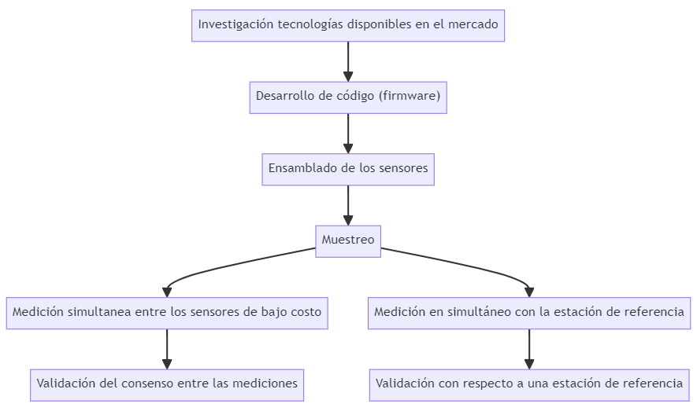

# Sistema de monitoreo basado en sensores de bajo costo {#cap:sens}

## Introducción

  Solo países desarrollados económicamente tienen la capacidad de generar redes de vigilancia de la calidad del aire basadas en equipos certificados de referencia. Un país que marca tendencia en cuanto al seguimiento y control del PM es Estados Unidos, donde se lleva a cabo una vigilancia exhaustiva de este contaminante a nivel del suelo por medio del Método Federal de Referencia (FRM) y los Métodos Federales Equivalentes (FEM) [@noble2001federal]. Cuenta con aproximadamente 600 estaciones de referencia en todo su territorio, que además se complementan con mediciones satelitales y otros métodos alternativos de seguimiento para lograr extrapolar los resultados a toda la nación [@christopher2010satellite]. A pesar de marcar tendencia en el control y gestión de la calidad del aire, establece protocolos y normativas que responden a la realidad de un país con una fuerte economía, y produce tecnologías cuya accesibilidad requiere elevados presupuestos. Estos estándares entonces representan metas inalcanzables para naciones en vías de desarrollo, motivo por el cual se hace necesario migrar hacia alternativas de bajo costo para la gestión y control de la calidad del aire.

  En esta tesis se armaron instrumentos de bajo costo empleando un sensor láser de medición de partículas que sigue el principio de funcionamiento del fotómetro de dispersión, lo cual proporciona una solución económica para el monitoreo y control de la concentración de PM~2.5~. Sus principales ventajas frente a los FRM y los FEM incluyen mediciones en tiempo real de los valores de concentración, además de su portabilidad y rentabilidad. Estas ventajas son a expensas de la exactitud en la medición e información acerca de la composición e individualidad de la partícula. A efectos de esta tesis, se entiende por sensores de bajo costo a aquellos que pueden ser adquiridos a menos de 100 dólares americanos. 
  
  El monitoreo de la calidad del aire es una actividad fundamental a la hora de identificar y evaluar problemas de contaminación [@organizacion2021global]. Esta actividad combinada con herramientas como los modelos predictivos e inventarios de emisión, forman parte integral de los sistemas de gestión y control de la calidad del aire. El propósito principal de estos sistemas recae en la provisión de información a científicos, legisladores y planificadores, fomentando la toma de decisiones para la gestión, mejora del ambiente y preservación de la salud pública. 
  
  El objetivo del presente capítulo es evaluar la utilidad de sensores de bajo costo para el monitoreo de la concentración de PM~2.5~ en el área metropolitana de la provincia de Córdoba, Argentina. Para abarcar este objetivo fue necesario el diseño y desarrollo de sistemas de monitoreo basado en sensores de bajo costo que permitiesen recopilar datos de concentración de PM~2.5~. Además, resultó indispensable determinar la integridad de las mediciones realizadas, no solo la estabilidad entre sensores, si no que también su validación respecto a una estación de referencia.

## Materiales y métodos

### Resumen gráfico del protocolo analítico de desarrollo y validación de sensores de monitoreo basados en tecnologías de bajo costo

```{r sens, echo=FALSE, out.width="100%", fig.align="center",fig.cap="(ref:sens)"}

```
(ref:sens) Resumen gráfico del protocolo analítico desarrollado en el capítulo 2.

  La Figura \@ref(fig:sens) presenta el protocolo analítico desarrollado en el capítulo [2](#cap:sens), ofreciendo una visión ordenada de las distintas actividades llevadas a cabo para alcanzar el objetivo propuesto. En primer lugar, se destaca la intensa investigación de tecnologías disponibles en el mercado referidas a sensores de bajo costo. A continuación, se ilustra el procedimiento de desarrollo del *firmware*, el software embebido en la memoria de lectura de un dispositivo que se encarga de proporcionar las instrucciones sobre el comportamiento del sistema. Posteriormente se hace referencia al armado y ensamblado de los sensores de bajo costo, específicamente diseñado para la medición de concentración de PM~2.5~. Posteriormente se hace referencia a la evaluación de la calidad del dato recopilado, la cual se abordó en dos etapas. La primera se centró en determinar el consenso de las mediciones obtenidas por los diez sistemas de bajo costo ensambladas. Por otra parte, se realizo una comparación de las mediciones obtenidas por un sensor de bajo costo contra las de una estación de referencia, evaluando su fiabilidad y precisión. A pesar del orden en que se menciona el procedimiento, en primer lugar fue realizada la comparación contra una estación de referencia y luego la medición del consenso entre los sistemas de medición de bajo costo, al tratarse de dos procedimientos totalmente independientes decide mantenerse la estructura dual del procedimiento. 

### Desarrollo del sistema de monitoreo basado en sensores de bajo costo

  En la presente tesis, se define un sistema de monitoreo como un conjunto de sensores ensamblados, operando mediante una placa de microcontrolador, junto con el código de base o *firmware* que permite la intercomunicación y protocolo de funcionamiento. Estos sistemas, al basarse en sensores de bajo costo, se unifican bajo el término "sistema de monitoreo de bajo costo". Este sistema permite la medición de diversas variables utilizando tecnologías económicas. El sistema de monitoreo de bajo costo resultante quedó conformado por los siguientes componentes:

  1.	Sensor PMS 1003 Plantower.
  2.	Sensor RTC-DS3231 - con EEPROM I2C.
  3.	Sensor DHT22 - Módulo Sensor Digital de Temperatura y Humedad.
  4.	Arduino UNO R3 SMD (CH340G) comp / ATmega328 16MHz.
  5.	Micro SD Card - Conexión SPI y Reg de Tensión.
  6.	Protoshield para Arduino uno shield y proto 170p unoelectro.
  7.	Fuente Arduino 12V 1,25 A.
  
  En el marco del estudio de sensores de bajo costo para la medición de PM, se llevó a cabo una investigación de las distintas tecnologías disponibles en el mercado. Luego de analizar diferentes aspectos, como precisión de medición, costo, funcionamiento, tamaño, sensibilidad e interfaz de programación, se seleccionó el sensor PMS 1003 como la opción más viable. Este es un sensor de calidad del aire basado en el principio de dispersión láser, desarrollado por la compañía Plantower, una industria de origen chino con sede en Shenzhen y oficinas en Pekín. A partir de un haz láser de 660 nm este sensor mide la concentración de PM~2.5~, un algoritmo de transformación propio del sensor permite la estimación en las fracciones PM~1.0~, y PM~10~. El fabricante reporta una precisión de ±10 $\frac{\mu g}{m^3}$ para el PM~2.5~ en el rango de 0 a 500 ±10 $\frac{\mu g}{m^3}$, mientras que para el rango de 500 a 1000 $\frac{\mu g}{m^3}$ el error se estima como ±10 %m.v., lo que significa que el error puede ser de hasta el 10% del valor medido en ese rango de concentración. Es importante tener en cuenta estas especificaciones a la hora de utilizar el sensor, con el objetivo de lograr una correcta interpretación de los datos.

  Para garantizar el correcto funcionamiento del sensor, se procedió a desarrollar y programar el código (*firmware*) que permitiría la conexión y comunicación entre los diferentes componentes. Se decidió utilizar la plataforma de desarrollo Arduino. Esta es una plataforma de electrónica abierta para la creación de prototipos basada en software y hardware flexibles, diseñada con el objetivo de facilitar la creación de entornos y objetos interactivos. La tarjeta de Arduino que se empleo fue la UNO R3 SMD, esta es una tarjeta que reduce su costo dado que contiene el chip adaptador USB – SERIAL CH340, a diferencia de otras tarjetas más costosas que contienen el FT232. Otra característica que abarata su costo es que emplea ATmega328 en su versión SMD o de montaje superficial. En resumen, se trata de una placa electrónica basada en el microcontrolador ATmega328 que cuenta con 14 pines de entrada y salida digitales (de los cuales 6 pueden ser utilizados como salidas PWM) y 6 entradas analógicas, un conector USB, uno de alimentación y un botón de reinicio. Junto con la placa seleccionada se incorporo una protoshield para Arduino uno junto con el proto unoelectro, permiten duplicar el número de conexiones que podemos realizar en la placa, otorgando mayor espacio para realizar las conexiones. La protoshield, es una placa de expansión analógica y digital que permite la interconexión de múltiples periféricos al estandarizar la disposición de los pines. Esta se acopla al Arduino ampliando las capacidades de la placa de base.

  El chip RTC DS3231 en combinación con la EEPROM I2C proporcionan un reloj en tiempo real (RTC) que permite registrar la fecha y hora en que se realizan las  mediciones. Además, cuenta con una interfaz I2C, un oscilador integrado con compensación de temperatura de cristal (TCXO) y un cristal, que mejoran su precisión y la estabilidad del reloj.
  
  El sensor DHT22 es un sensor digital de temperatura y humedad relativa de bajo costo, que permite detectar cualquier anomalía en las condiciones ambientales durante el funcionamiento del sensor. A partir de los datos registrados por este sensor podemos cerciorarnos de las condiciones de funcionamiento, con el objetivo de determinar la calidad de los datos recopilados. Este módulo utiliza un sensor capacitivo de humedad y un termistor que permite medir el aire circundante. Es importante asegurarse de que las condiciones en las que se realiza la medición sean estables y adecuadas para obtener datos confiables.
  
  El sensor también incorporó un módulo micro SD, permitiendo incorporar una memoria micro SD para almacenar los datos, dada su gran capacidad de almacenamiento en comparación con su reducido tamaño físico lo vuelven la opción más viable para este tipo de sensores. De esta forma, son una alternativa sumamente compatible con la plataforma Arduino, sobre todo cuando se requiere almacenar grandes cantidades de información en productos de reducido tamaño.
  
  Finalmente, la fuente de alimentación de 12 V es necesaria para garantizar el funcionamiento continuo del sistema de medición. Esta se conecta a una toma eléctrica de pared permitiendo la provisión de energía de manera continua al instrumento. 
  
### Base de datos

  Se generó una base de datos de mediciones simultáneas entre los diez sistemas ensambladas. Estas mediciones fueron llevadas a cabo durante un período de 14 días, entre el 05-07-2022 y el 21-07-2022, en la terraza de la Facultad de Ciencias Exactas, Físicas y Naturales de la Universidad Nacional de Córdoba, Argentina.

```{r MedicionConjunta, echo=FALSE, out.width="100%", fig.align="center", fig.cap="(ref:MedicionConjunta)"}

```
(ref:MedicionConjunta) Medición simultánea de los sistemas de monitoreo de bajo costo.

  Por otra parte, para validar los datos de los sensores de bajo costo con datos obtenidos con un equipo de referencia, se obtuvieron datos de la estación de monitoreo instalada por el Centro de Investigación y Química Ambiental (CIQA) en el centro de la ciudad, en la Casona Municipal ubicada en la avenida General Paz y La Rioja. Esta estación de monitoreo cuenta con un equipo atenuador beta (Instrumento FEM) aprobado por la Agencia de Protección Ambiental de Estados Unidos (USEPA), que registra concentración de PM~10~. Los datos fueron recopilados desde el 28-10-2021 hasta el 05-11-2021.
  
  Junto a la estación de monitoreo se colocó un sensor y se compraron datos de PM~10~ de la estación de referencia con los valores de PM~10~ estimados por el sensor de bajo costo a partir de PM~2.5~.
  
### Protocolo estadístico

#### Validación del consenso entre las mediciones de los sistemas de monitoreo de bajo costo
  
  La determinación del consenso entre las mediciones de los sistemas de monitoreo de bajo costo fue abordada por diversas estrategias. En primer lugar, se llevó a cabo el cálculo y comparación de medidas descriptivas a partir de las series temporales recopiladas. Estas medidas incluyeron la media, la desviación estándar, el primer cuartil, la mediana, el tercer cuartil, el mínimo y el máximo de la medición de PM2.5, con frecuencia horaria. Esta comparación permitió determinar si existían discrepancias significativas entre los distintos sensores.

  En segundo lugar, se realizaron gráficos exploratorios de las series temporales recopiladas por los sensores. Estos fueron comparados con el objetivo de detectar patrones comunes en los datos y evaluar si los sensores mostraban tendencias similares. Además, se buscó detectar anomalías o fluctuaciones inusuales en los datos.

  Finalmente, se implementó el coeficiente de correlación de Pearson para determinar la semejanza existente entre los datos. Este coeficiente de correlación es una medida estadística que indica el grado de asociación lineal entre dos variables, en este caso, las mediciones de concentración de PM~2.5~ entre los sensores de bajo costo de a pares.
  
#### Comparación con una estación de referencia

  La comparación de los registros de los sistemas de monitoreo de bajo costo con la estación de referencia fue abordada a partir de diversas estrategias. En primer lugar, se procedió a visualizar las series temporales correspondientes a ambas fuentes de datos de forma conjunta. Esta visualización permitió detectar eventuales discrepancias, así como también el grado de similitud entre las mediciones.

  Para mejorar el contraste, se implementó un gráfico de similitud que permitió representar los datos de los sensores en ambos ejes cartesianos, conjuntamente con la recta de similitud ubicada a 45º. La finalidad de este gráfico fue facilitar la identificación de patrones de similitud o discrepancia entre las mediciones. En particular, si los datos de los sensores y la estación de referencia mostrasen coincidencia perfecta, estos se posicionarían sobre la línea diagonal.

  Finalmente, se procedió a calcular el coeficiente de correlación lineal de Pearson, que permitió obtener una medida cuantitativa de la similitud existente entre los datos de los sistemas de monitoreo de bajo costo y los de la estación de referencia. Este coeficiente proporciona información acerca del grado de asociación lineal entre las dos variables.

## Resultados y discusión 

### Producto final

```{r SensorDentroRecorte, echo=FALSE, out.width="100%", fig.align="center", fig.cap="(ref:SensorDentroRecorte)"}
knitr::include_graphics("images/imagescap2/SensorDentroRecorte.png")
```
(ref:SensorDentroRecorte) Sistema de monitoreo basado en tecnologías de bajo costo ensamblado.

  La Figura \@ref(fig:SensorDentroRecorte) presenta una vista detallada de uno de los sistemas de monitoreo de bajo costo en su última versión, donde pueden observarse los diferentes componentes, así como las interconexiones que permiten la comunicación entre ellos.

  El sensor de mayor tamaño, localizado en el frente del sistema es el sensor PMS 1003, responsable de la medición la concentración de PM. Por este motivo es que tanto en su frente como en sus alrededores se realizaron perforaciones que garantizan el flujo de aire. 
  
  Por otra parte, puede apreciarse como el resto de los dispositivos se encuentran protegidos y aislados del exterior para garantizar su integridad y correcto funcionamiento.

```{r LaRes, echo=FALSE, out.width="100%", fig.align="center", fig.cap="(ref:LaRes)"}
knitr::include_graphics("images/imagescap2/LaReserva_Recorte.jpg")
```
(ref:LaRes) Sistema de monitoreo de bajo costo en funcionamiento durante el muestreo en La Reserva Natural Urbana General San Martín de la Provincia de Córdoba.

  La Figura \@ref(fig:LaRes) muestra el sistema de monitoreo de bajo costo dispuesto en La Reserva Natural Urbana General San Martín. En la imagen, puede apreciarse cómo el sensor se encuentra instalado en el exterior del edificio, pero protegido de la lluvia, lo que garantiza su integridad y correcto funcionamiento.

### Consenso de medición de la concentración de PM~2.5~ entre los sistemas de monitoreo de bajo costo

Table: Medidas descriptivas de resumen de los distintos sensores.\label{tab:sensres}

| Sensor | Media | D.E. | Q1 | Mediana | Q3 | Mínimo | Máximo |
|:---:|:------:|:------:|:------:|:------:|:------:|:------:|:------:|
| 1   |    14.07 | 13.90 |  3.97 |  9.84 | 19.39 | 0.10 |  70.85 |
| 2   |    15.09 | 14.08 |  4.41 | 11.4  | 20.58 | 0.10  | 72.13 |
| 3   |    13.96 | 13.47 |  4.07  | 9.99 | 19.26 | 0.01 |  68.82 |
| 4   |    14.95 | 14.37 |  4.41 | 10.7 |  20.87 | 0.02  |  72.28 |
| 5   |    14.53 | 13.35 | 4.59 | 10.8  | 19.82 | 0.16   | 69.80 |
| 6   |    13.52 | 13.44 | 3.6   | 9.4 |  18.76 | 0.02 | 68.25 |
| 7   |    14.08 | 13.85 |  3.79 | 10.1 |  19.64 | 0.05 |  69.99 |
| 8   |    13.05 | 12.77 |  3.66  | 9.22 | 17.79 | 0.08 | 64.73 |
| 9   |    14.86 | 13.92 | 4.58  | 10.9 |  20.48 | 0.11 |  71.40 |
| 10  |    12.42 | 12.12 |  3.56  | 8.73 | 17.12 | 0.11  | 62.56 |
| **General** | 14.05 | 13.55 | 4.07  | 10.05 | 19.38 | 0.08  | 69.08 |
\begin{flushleft}
\setstretch{1}
{\footnotesize Sensor, media, desvío estándar (D.E.), percentil Q1, mediana, percentil Q3, mínimo y máximo.}
\end{flushleft}

  Durante el periodo de calibración se obtuvieron un total de 3360 datos horarios, a partir de los cuales se calcularon medidas de resumen (Tabla \@ref(tab:sensres)). La media general obtenida durante este muestreo fue de 14.05 $\frac{\mu g}{m^3}$, con un desvío estándar promedio de 13.55 $\frac{\mu g}{m^3}$, un valor mínimo promedio registrado de 0.08 $\frac{\mu g}{m^3}$ y un valor máximo de 69.08 $\frac{\mu g}{m^3}$.
  
  Puede apreciarse que el sensor 10 es el que más se aleja de la media general, con una diferencia promedio de 1.63 $\frac{\mu g}{m^3}$. Sin embargo, esta diferencia es baja en magnitud con respecto al desvío estándar promedio, lo que indica que incluso el sensor más deficiente en medir se desvía poco de las mediciones generales frente al amplio rango de variación de la variable en cuestión. Además, puede notarse que la incapacidad del sensor 10 en la medición se debe a una subestimación de los valores de concentración de PM~2.5~, ya que todas sus medidas descriptivas se encuentran por debajo del promedio general obtenido.
  
  La Tabla \@ref(tab:sensres) refleja la consistencia existente entre las mediciones realizadas por los distintos sensores a lo largo del tiempo. El rango de variación de las medidas descriptivas obtenidos para los distintos sensores respecto a la media general es acotado, lo cual demuestra que no existen desvíos respecto a las medidas descriptivas generales que indiquen un funcionamiento atípico en ninguno de los sensores.

```{r SeriesFacetWrap, echo=FALSE, out.width="100%", fig.align="center", fig.cap="(ref:SeriesFacetWrap)"}
knitr::include_graphics("images/imagescap2/SeriesFacetWrap.png")
```
(ref:SeriesFacetWrap) Series de tiempo de concentración de PM~2.5~ generadas durante la medición conjunta de los sistemas de monitoreo de bajo costo.

  Todas las series de tiempo exhiben un patrón general común, identificando de manera similar los momentos en que ocurren picos de concentración y baches mínimos (Figura \@ref(fig:SeriesFacetWrap)). Es interesante destacar que el pico máximo de concentración y el mínimo fueron registrados de forma simultánea por todos los sensores en el día 2022-07-16 a las 23:00:00 y 15:00:00, respectivamente. Esto demuestra una notable consistencia en las mediciones de los sensores, que consiguen reflejar de manera similar las variaciones en la concentración.

  Además, puede observase que a pesar de existir una leve variación en la magnitud de las mediciones registradas en un mismo momento, los valores muestran un consenso y reflejan el patrón de variación de PM~2.5~. En otras palabras, los sensores de bajo costo presentan una capacidad consistente para detectar cambios en la concentración de PM~2.5~ a lo largo del tiempo, lo que sugiere que son una valiosa herramienta para la monitorización continua de la calidad del aire.

```{r SeriesSuperpuestas, echo=FALSE, out.width="100%", fig.align="center", fig.cap="(ref:SeriesSuperpuestas)"}

```
(ref:SeriesSuperpuestas) Series de tiempo de concentración de PM~2.5~ generadas durante la medición conjunta de los sistemas de monitoreo de bajo costo superpuestas.

  En la Figura \@ref(fig:SeriesSuperpuestas) puede notarse cómo a pesar de que las mediciones de los sensores a lo largo del tiempo siguen un patrón general común, pueden variar en magnitud en un mismo instante, dando lugar a pequeñas desviaciones en los registros. A pesar de esto, puede apreciarse que estas diferencias son bajas en comparación con el rango de variación de los valores que toma la variable de interés.
  
  Para evaluar esta deficiencia en el consenso de los sensores, se calculó la métrica de MAD (desvío absoluto medio), que refleja la media de la suma de las diferencias en valor absoluto de las mediciones entre los sensores, otorgando un resultado máximo de 2.66 entre los sensores. Este valor indica que los dos sensores que mayor discrepancia reflejaron en sus mediciones (sensor 2 y sensor 10) tienen una diferencia promedio en valor absoluto de 2.66 $\frac{\mu g}{m^3}$ en sus mediciones a lo largo del tiempo. Este valor representa el 4% del rango de variación promedio entre las mediciones de todos los sensores, el cual es de 69 $\frac{\mu g}{m^3}$ (Tabla \@ref(tab:sensres)). Además, la media del MAD para todos los sistemas de medición de bajo costo considerados arrojó un valor de 1.17 $\frac{\mu g}{m^3}$, demostrando que esta es la diferencia promedio en valor absoluto entre las mediciones de concentración de PM~2.5~ de los sistemas de monitoreo de bajo costo a lo largo del tiempo.
  
  De esta manera, puede concluirse que todos los sensores logran capturar el mismo patrón de variación de PM~2.5~ en el tiempo, identificando de manera similar los baches mínimos y los picos máximos. Además, a pesar de que existen variaciones en los valores registrados, estas son bajas en comparación con el rango de variación de la variable de interés.

```{r PairsPlot, echo=FALSE, out.width="100%", fig.align="center", fig.cap="(ref:PairsPlot)"}

```
(ref:PairsPlot) Relación entre las mediciones de concentración de PM~2.5~ de los distintos sistemas de monitoreo de bajo costo, su distribución y coeficientes de correlación.

  La Figura \@ref(fig:PairsPlot) confirma el consenso entre las mediciones de los distintos sensores. El diagrama de puntos generado por la combinación de cada par de sensores muestra una estrecha relación con la recta de similitud de 45 grados, demostrando una alta coincidencia en las mediciones a lo largo del tiempo. Además, los coeficientes de correlación calculados para cada par de sensores son siempre mayores a 0.99, indicando una correlación lineal muy fuerte entre las mediciones. En consecuencia, podemos concluir que los sistemas de monitoreo de bajo costo son capaces de medir con precisión el PM~2.5~ en el aire, y que existe un alto grado de acuerdo entre las mediciones obtenidas por cada uno de ellos.

### Validación con respecto a la estación de referencia

```{r reffacet, echo=FALSE, out.width="100%", fig.align="center", fig.cap="(ref:reffacet)"}

```
(ref:reffacet) Series de tiempo generadas durante la medición simultánea de la estación de referencia y el sistema de monitoreo de bajo costo. 

  En la Figura \@ref(fig:reffacet) puede apreciarse que la tendencia general de las mediciones es similar para ambos instrumentos de medición, ya que ambas series muestran fluctuaciones similares, demostrando acuerdo entre sus registros. A partir de estos resultados, podría establecerse en primera instancia, que las mediciones de concentración de PM~2.5~ registradas por los sensores de bajo costo permitirían representar en términos generales los datos obtenidos por una estación de referencia. 

```{r refjuntas, echo=FALSE, out.width="100%", fig.align="center", fig.cap="(ref:refjuntas)"}

```
(ref:refjuntas) Series de tiempo generadas durante la medición simultánea de la estación de referencia y el sistema de monitoreo de bajo costo superpuestas. 

  Ambos equipos de medición registraron el mismo patrón de variación de la concentración de PM~2.5~ (Figura \@ref(fig:refjuntas)). Sin embargo, existen sucesivos eventos en los que las mediciones de la estación de referencia se encuentran por encima de las mediciones registradas por los sistemas de monitoreo de bajo costo. Esto indicaría que las mediciones de los sistemas de monitoreo de bajo costo podrían a subestimar la concentración de PM.
  
```{r 45plot, echo=FALSE, out.width="100%", fig.align="center", fig.cap="(ref:45plot)"}

```
(ref:45plot) Diagrama de puntos de las mediciones registradas por la estación de referencia y el sistema de monitoreo de bajo costo, en rojo puede apreciarse la recta de similitud a 45 grados. 

  Las mediciones de ambos equipos junto con la recta de similitud a 45 grados demuestran una fuerte coincidencia entre las mediciones (Figura \@ref(fig:45plot)). La imagen permite apreciar una alta densidad de puntos que se sitúan por encima de la recta, indicando una completa concordancia entre los datos de ambas estaciones. Sin embargo, también puede apreciarse un conjunto de puntos que se alejan de la recta de similitud y se ubican por encima de la misma, sugiriendo una subestimación de la concentración de PM por parte de los sistemas de monitoreo de bajo costo en el rango de valores entre 13 y 17 $\frac{\mu g}{m^3}$. De todas maneras, la mayor densidad de puntos se observa cercana a la recta de similitud, demostrando consistencia y concordancia entre sus mediciones.

  Esta fuerte coincidencia entre las mediciones de ambas estaciones además se ve reflejada en el valor que otorgó el coeficiente de correlación lineal de Pearson. El coeficiente de 0.93 permite concluir que, a pesar de la subestimación de los sistemas de bajo costo, existe una notable similitud entre ambos sistemas de medición.
 
  Esto significa que, aunque los valores registrados por el sensor de bajo costo puedan ser ligeramente inferiores que los obtenidos por la estación de referencia, ambas fuentes de datos presentan patrones similares de variación de la concentración de PM. Por lo tanto, el uso de sistemas de monitoreo basado en sensores de bajo costo podría ser una alternativa viable y económica para la medición de la concentración de PM en el aire, especialmente en áreas donde no se dispone de sistemas de medición de referencia o donde se requiera una mayor densidad de instrumentos en la ciudad.

### Limitaciones del sensor de bajo costo

  El sensor PMS 1003 de Plantower, al igual que muchos otros sensores de bajo costo, puede enfrentar dificultades al medir las concentraciones de PM~2.5~ en condiciones de elevada humedad relativa. En el estudio de Badura et al. (2018), han señalado que estos sensores pueden registrar micro gotas de agua como partículas de PM~2.5~, especialmente cuando la humedad relativa supera el 80% [@badura2018evaluation]. Este fenómeno puede llevar a una sobreestimación de las concentraciones de PM~2.5~ bajo condiciones de alta humedad. A pesar de la coincidencia descripta entre los múltiples sensores de bajo costo, e inclusive con la estación de referencia, es crucial reconocer que las lecturas pueden desviarse describiendo errores de hasta un 50% en la lecturas, en ambientes con alta humedad relativa [@sayahi2019long; @jayaratne2018influence]. Por este motivo, es esencial considerar estas variaciones al analizar y comparar datos de calidad del aire obtenidos con estos dispositivos.

## Conclusiones

  El ensamblaje de los sistemas de monitoreo de bajo costo implicó procedimientos específicos que aseguraron una integración efectiva y funcional. Para la conexión de los sensores a la placa Arduino, se utilizaron cables pelados que se soldaron empleando mercurio previamente calentado hasta alcanzar estado líquido, lo que garantizó uniones firmes y conductoras al solidificarse. La carga del *firmware* se realizó directamente desde una computadora a la placa Arduino mediante una conexión USB. Este meticuloso proceso de ensamblaje contribuyó a una configuración robusta y fiable del sistema de monitoreo.
  
  Los sistemas de monitoreo basados en sensores de bajo costo presentaron consistencia en las mediciones de concentración de PM~2.5~, demostrando patrones similares independientemente del sistema utilizado. Asimismo,  los datos registrados por los sistemas de bajo costo son también consistentes con los datos recopilados por la estación de referencia de la ciudad, indicando que estos sistemas proporcionan mediciones fiables de la concentración de PM. Esta consistencia de datos entre sistemas entre sí y entre los sistemas y la estación de referencia, sugieren que los sistemas de bajo costo pueden ser empleados para monitorear la concentración de PM~2.5~ en zonas urbanas del Área Metropolitana de Córdoba, constituyendo una alternativa viable y económica para la medición de la calidad del aire, y por lo tanto para la gestión y el control de la calidad del aire de la ciudad. Estos sistemas son el paso inicial para el desarrollo de sistemas de alerta temprana ante condiciones adversas de calidad del aire, paliando la falta de datos de contaminantes y fortaleciendo los pilares sobre los cuales recae la salud publica.