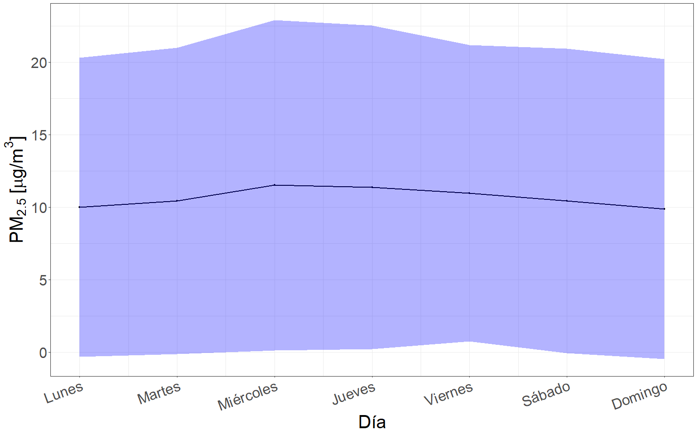
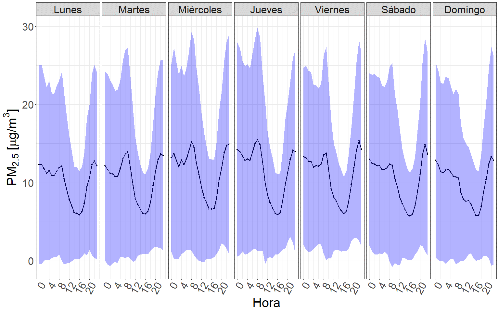
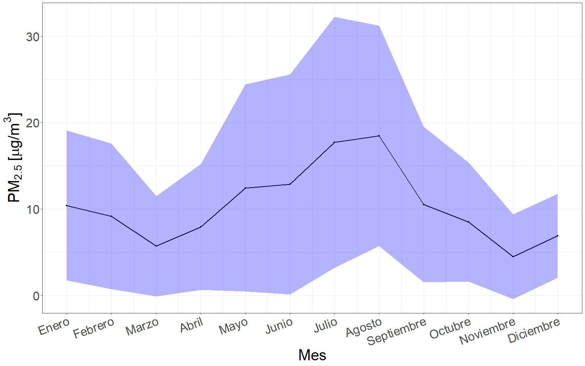
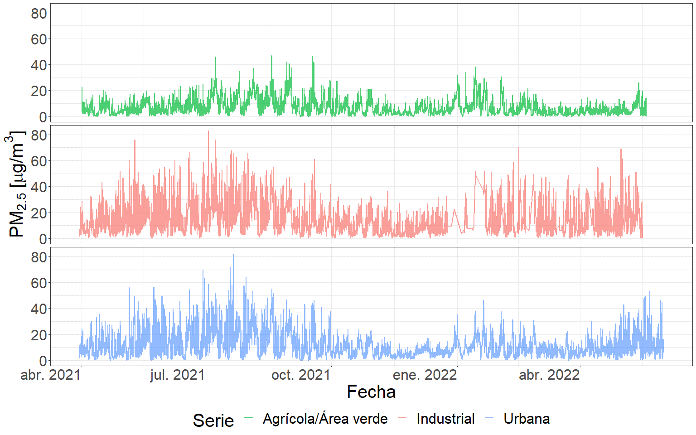

# Variación espacio temporal de la concentración de aerosoles {#cap:expl}
  
## Introducción

  Las partículas en suspensión producidas principalmente por vehículos, industrias y reacciones fotoquímicas, son uno de los contaminantes más preocupantes en entornos urbanos [@seinfeld1998air]. Estas partículas no solo afectan al medio ambiente, sino que también son nocivas para la salud humana. En efecto, las partículas de 2.5 $\mu m$ de diámetro aerodinámico o menos (PM~2.5~) tienen la capacidad de penetrar profundamente en los pulmones, acumulándose en los alvéolos, [@xing8ly] o incorporándose directamente al torrente sanguíneo alcanzando otros órganos. Dado que, las partículas más pequeñas tienen una mayor superficie efectiva en comparación con las de mayor tamaño, su capacidad de adsorber compuestos tóxicos aumenta, al igual que su peligrosidad. A pesar de ello, actualmente la ciudad de Córdoba no cuenta con un sistema de monitoreo que informe a la población acerca de las condiciones ambientales con respecto a este contaminante. Sin embargo, gracias a la investigación científica local se dispone de numerosos antecedentes en esta ciudad, los cuales además de poner en evidencia la concentración de contaminantes, su variación y composición, también proveen información respecto de sus impactos en la salud humana [@amarillo2021exploratory; @mateos2019influence; @mateos2018land; @busso2021modeling].

  Los estándares de emisión que se emplean en la provincia de Córdoba en cuanto a la la concentración del PM son similares a los que emplea la Agencia de Protección Ambiental (EPA – EEUU), basándose en la Norma Nacional de Calidad del Aire Ambiente (del inglés, NAAQS) [@standard2010environmental]. Sin embargo, los lineamientos mas recientes sugeridos por la OMS son más restrictivos y es importante tenerlos presente al analizar los potenciales efectos en la salud de la concentración de PM~2.5~ [@organizacion2021global].

  Está comprobado que el PM muestra importantes variaciones estacionales, dado a su fuerte dependencia de las condiciones ambientales. Su concentración varía considerablemente en el espacio y el tiempo en distintos entornos [@kumar2011dynamics; @hofman2016ultrafine; @peters2014cyclist; @van2013methodology]. En entornos urbanos la variación espacial se encuentra principalmente asociada a la intensidad del tráfico, la topología y la distancia a las fuentes de emisión. Mientras que la variación temporal está asociada al momento en el año, condiciones meteorológicas, dinámica del tráfico y fluctuaciones ambientales [@apparicio2016cyclists; @van2015mobile]. Generalmente, su concentración es mayor durante períodos de bajas temperaturas, tal como fue informado  en ciudades de Austria [@gomivsvcek2004spatial] y Grecia [@chaloulakou2003measurements]. De manera similar en Córdoba, la mayor concentración de partículas se produce en la época invernal dado las frecuentes inversiones térmicas que favorecen la concentración y permanencia de contaminantes en las capas inferiores de la atmósfera, particularmente durante la noche y primeras horas de la mañana [@stein1996street; @olcese1997effects; @amarillo2021exploratory; @mateos2019influence].
  
  Los datos que sustentan el análisis espacio temporal desarrollado en la presente tesis son series temporales condicionadas a una localización específica. Una serie temporal se define como una secuencia de valores observados a lo largo del tiempo, por lo tanto, ordenados cronológicamente, en los cuales se destaca una estructura de dependencia entre observaciones [@chatfield2000time], su condicionante de georreferenciación deriva del aspecto espacial. Si conociendo los valores pasados de la serie, no es posible predecir con total certeza el próximo valor de la variable, decimos que la serie es no determinista o aleatoria [@scotto1998introduction; @hamilton2020time]. Los objetivos del análisis de series de tiempo son diversos, pudiendo destacarse la predicción, la clasificación y la simulación de nuevos datos [@chatfield1994time; @pena2005analisis]. 
  
  El principal objetivo del presente capítulo es describir la variabilidad tanto espacial como temporal, de la concentración de PM~2.5~ en distintas zonas del área metropolitana de la provincia de Córdoba. De esta forma, se describen las principales características de las series disponibles y se identifican sus patrones de variación espacial y temporal. La finalidad de caracterizar tanto espacial como temporalmente la concentración de PM~2.5~ reside en contemplar todas las características derivadas a la hora de desarrollar el modelado predictivo (capítulo [5](#cap:pred)), a fin de obtener resultados de elevada capacidad predictiva.
  
## Materiales y métodos

### Resumen gráfico del protocolo analítico de caracterización de la variación espacio temporal de la concentración de PM~2.5~

```{r expl, echo=FALSE, out.width="100%", fig.align="center",fig.cap="(ref:expl)"}

```
(ref:expl) Resumen gráfico del protocolo analítico desarrollado en el capítulo 3.

  La figura \@ref(fig:expl) ilustra el protocolo analítico desarrollado en este capítulo con la finalidad de caracterizar la variación espacio temporal de la concentración de PM~2.5~ en zonas del Área Metropolitana de Córdoba, Argentina. En primer lugar, se desarrolló un muestreo simultáneo en el tiempo en los sitios con distinto uso de suelo seleccionados dentro del área de interés. Posteriormente, se llevó a cabo un análisis exploratorio de datos, el cual constó de dos etapas, una vinculada a la variabilidad temporal y otra a la espacial. Además, se desarrolló un estudio de la similitud existente en el patrón de emisión de PM~2.5~ a lo largo del periodo de muestreo entre los distintos sitios, el cual terminó en la conformación de grupos homogéneos de los sitios en estudio. Finalmente, y a partir del agrupamiento realizado, se concluyó con un análisis que vinculó tanto la variabilidad espacial, como la temporal.

### Área de estudio

  La ciudad de Córdoba es la capital de la Provincia de Córdoba y la segunda ciudad más importante del país en cuanto a su población, con aproximadamente 1,3 millones de habitantes y una superficie de 576 $km^2$ [@indec2010censo]. Su centro urbano está ubicado a 470 metros sobre el nivel del mar y dado que, la ciudad se encuentra rodeada por un cordón montañoso, durante el invierno ocurren eventos de inversión térmica que producen el estancamiento de los contaminantes del aire en una fina capa (200 metros) sobre la superficie [@stein1996street ; @olcese2002some]. Estudios realizados sobre las fuentes de aerosoles dentro de la ciudad revelan que la principal es el tránsito (85% de la emisión total de partículas), seguido por la re suspensión del polvo de calles y edificios en construcción [@stein1996street ; @achad2013retrieving]. Una gran variedad de industrias se ubican en la periferia de la ciudad, incluyendo metalmecánicas, alimentarias, metalúrgicas, entre otras. El importante crecimiento de la flota vehicular circulante, la falta de control de emisiones y el escaso uso de convertidores catalíticos, ha producido un incremento considerable en las emisiones de partículas [@lopez2011elemental]. A pesar del crecimiento sostenido de la ciudad en las últimas décadas, el microcentro sigue siendo el lugar donde se concentran las actividades económicas, culturales, educativas, financieras, de prestación de servicios y administrativas, lo cual determina una gran demanda de acceso vehicular y transporte público de pasajeros. Se estima que de los aproximadamente 150 millones de pasajeros anuales que transporta el servicio público de transporte, más del 90% desciende/asciende en el centro [@martin2005contaminacion; @serio2020revision]. 

  Para la construcción de la base de datos de PM~2.5~ se llevaron a cabo muestreos simultáneos de concentración en diez sitios seleccionados sobre distintos usos de suelo. Cada sitio se monitoreo durante un periodo de un año y tres meses, desde el 30/03/2021 hasta el 01/06/2022. En total, se recopilaron alrededor de 70.000 datos horarios.

  Cabe destacar que los datos fueron tomados cada 10 segundos, frecuencia temporal que facilitó la limpieza y procesamiento de los mismos, así como la obtención de medias horarias que representan de mejor forma la tendencia a largo plazo de las series.

```{r ubicacion, echo=FALSE, out.width="100%", fig.align="center",fig.cap="(ref:ubicacion)"}

```
(ref:ubicacion) Ubicación específica de los sitios de muestreo dentro del área metropolitana de la provincia de Córdoba.

  Descripción de cada uno de los sitios de muestreo, incorporando la interpretación de los inventarios de emisión de PM~2.5~ publicados por Enrique Puliafito para la Argentina [@puliafito2009gestion] y una comparación con la clasificación de uso de suelo de zonas climáticas locales (LCZ) [@stewart2012local]. La clasificación LCZ (*Land Cover Classification for Urban Zones*) es un sistema exhaustivo diseñado para organizar y describir de manera sistemática el uso del suelo. Cada código LCZ sigue una estructura jerárquica que comienza con un número que representa una categoría principal, abarcando grupos generales de tipos de uso del suelo. Estos números principales se detallan aún más a través de letras de subcategoría, ofreciendo información adicional sobre las características específicas del uso del suelo dentro de esa categoría principal. Esta estructura proporciona una clasificación detallada y precisa de los entornos urbanos, lo que resulta fundamental para una variedad de aplicaciones, desde la planificación urbana hasta la gestión ambiental y el estudio del clima urbano. A continuación, se presenta la descripción detallada de cada uno de los sitios de muestreo.  

  1. Ferreyra: la Empresa Tubos Trans-Electric, se ubica en barrio Ferreyra, polo industrial al sur este de la Ciudad, y se dedica a la producción de bienes y servicios exportables relacionados con el rubro de la energía eléctrica, focalizándose en la producción de transformadores de distribución. La mayoría de las edificaciones vecinas son empresas, las más cercanas se dedican al rubro de la metalurgia, producción de envases de plástico, producción de piezas de automóviles, logística y reparación de vehículos particulares. Además, esta empresa se encuentra situada sobre la avenida Amadeo Sabattini, que es uno de los principales accesos a la Avenida de Circunvalación de Córdoba, facilitando el acceso de camiones y despacho de mercaderías, esta avenida se caracteriza por tener un tráfico vehicular moderado y constante a lo largo de las horas del día. La cobertura de vegetación en la zona es muy escasa. Las principales fuentes de emisión detectadas en el sitio son industrias, tráfico vehicular, residencial y trenes [@puliafito2009gestion]. La estación corresponde al Ferrocarril General Bartolomé Mitre de la red ferroviaria argentina se encuentra actualmente sin operaciones, sin embargo por sus vías transita el servicio Retiro-Córdoba de la empresa estatal Trenes Argentinos Operadora Ferroviaria, aunque no hace parada en esta. El servicio sale desde Retiro San Martín los días miércoles y domingos a las 11:30 horas con llegada Córdoba a las 8:34 horas del día posterior. Dentro de la clasificación LCZ, este sitio sería clasificado como LCZ8~10~, una combinación de las categorías *large low-rise* y *heavy industry*, donde la primera hace referencia a un sitio con una disposición abierta de grandes edificios de baja y mediana altura (1 a 3 pisos), cuya cubierta del suelo se encuentra mayoritariamente pavimentada, con pocos o ningún árbol y donde los materiales de construcción empleados son acero, hormigón, metal y piedra. Mientras que la segunda y menos importante categoría muestra el estilo industrial del sitio, aunque no es una industria pesada debido a la baja densidad de industrias con respecto a lo que establece la clasificación de usos de suelo.

  2. Ciudad Universitaria: la Facultad de Ciencias Exactas, Físicas y Naturales de la Universidad Nacional de Córdoba se encuentra ubicada en la Ciudad Universitaria, en el centro sur de la Ciudad, sitio donde se concentran las principales dependencias de toda la universidad. Su principal característica es el gran número de personas que frecuentan diariamente la zona usando todo tipo de medios de transporte como motocicletas, automóviles y colectivos, además de otros que no generan emisiones como lo son a pie y en bicicleta. Es una zona con una gran cantidad de espacios verdes donde la cobertura del suelo es compartida por la vegetación, el pavimento y la edificación. La principal fuente de emisión detectada en el sitio es el tránsito vehicular [@puliafito2009gestion]. Dentro de la clasificación LCZ, este sitio se clasificaría como LCZ5~8~, una combinación de las categorías *open midrise* y *large low-rise*, la primera hace referencia a una disposición abierta de edificios de mediana altura (3-9 plantas), donde abunda la cubierta de suelo permeable (plantas bajas, árboles dispersos) y cuyos materiales de construcción son principalmente hormigón, acero, piedra y vidrio. Mientras que la segunda y menos importante categoría hace referencia a un uso de suelo urbano con un notable tráfico de vehículos.  

  3. Los Boulevares: esta empresa se ubica en barrio Los Boulevares al norte de la Ciudad y se dedica a la mecánica y puesta a punto de camiones. La mayoría de las edificaciones vecinas cercanas son industrias, del rubro de la electrónica, logística, automóviles, productos de limpieza y productos lácteos. Además, este establecimiento se encuentra situado muy cerca de la Avenida La Voz del Interior (E53) que conecta la Avenida de Circunvalación de Córdoba con otras aglomeraciones urbanas como Villa Allende, Mendiolaza y Río Ceballos, por lo que tiene un tráfico vehicular moderado y constante a lo largo del día. La cobertura de vegetación en la zona es muy escasa con una gran densidad de industrias en sus alrededores. Las principales fuentes de emisión son las industrias, el tráfico vehicular, emisiones residenciales, el tránsito aéreo, emisiones provenientes de rutas y el comercio [@puliafito2009gestion]. Dentro de la clasificación LCZ, este sitio se clasificaría como LCZ8~10~, una combinación de las categorías *large low-rise* y *heavy industry*, donde la primera categoría hace referencia a un sitio con una disposición abierta de grandes edificios de baja y mediana altura (1 a 3 pisos), cuya cubierta del suelo se encuentra mayoritariamente pavimentada, con pocos o ningún árbol y donde principalmente los materiales de construcción empleados son acero, hormigón, metal y piedra. Mientras que la segunda categoría muestra el estilo industrial del sitio.

  4. Casa Radical: la Casa Radical, ubicada en barrio Nueva Córdoba, en el centro de la Ciudad, es la sede del partido radical en Córdoba y por lo tanto aquí se desarrollan actividades políticas. En sus alrededores se encuentran gran cantidad de edificios residenciales con numerosos pisos. Además, este sitio se encuentra frente al Boulevard San Juan, una de las calles más transitadas de la ciudad, donde además de edificios residenciales hay numerosas empresas de servicios y locales comerciales. La vegetación que caracteriza la zona es escasa y las principales fuentes de emisión detectadas son el tráfico vehicular, la residencial y el comercio [@puliafito2009gestion]. Dentro de la clasificación LCZ, este sitio se clasificaría como LCZ2~8~, una combinación de las categorías *compact midrise* y *large low-rise*, donde la primera hace referencia a un sitio que posee una mezcla densa de edificios de mediana altura (3-9 pisos), con muy poca vegetación (pocos o ningún árbol), donde la superficie se encuentra mayoritariamente pavimentada y cuyos materiales de construcción son principalmente roca, ladrillo, teja y hormigón. Mientras que la segunda categoría hace referencia a la disposición abierta de edificios que existe.

  5. Tablada Park: se trata de una residencia miliar ubicado en el barrio Tablada Park, en la zona noroeste de la Ciudad Capital. Este sitio se encuentra muy cercano a la avenida Rodríguez Del Busto, con numerosos locales comerciales y supermercados y posee un alto tránsito vehicular. Los alrededores del sitio se caracterizan por ser viviendas residenciales y comercios. Las principales fuentes de emisión detectadas en el sitio son el tránsito vehicular, la residencial y el comercio [@puliafito2009gestion], además la vegetación en la zona es moderada. Dentro de la clasificación LCZ, este sitio se clasificaría como LCZ3~6~, una combinación de las categorías *compact low rise* y *open low rise*, donde la primera hace referencia a una mezcla densa de edificios de baja altura (1-3 pisos), cuya superficie se encuentra mayoritariamente pavimentada con pocos o ningún árbol y donde los principales materiales de construcción son roca, ladrillo, teja y hormigón. Mientras que la segunda categoría, hace referencia a la presencia de árboles y plantas que caracterizan la zona. 

  6. Alta Córdoba: se trata de una residencia  familiar ubicado en el barrio residencial Alta Córdoba, en la zona centro norte de la Ciudad. Este sitio se encuentra sobre la calle Mariano Fragueiro que aglomera los principales comercios de la zona y posee un alto tránsito vehicular. Los alrededores del sitio se caracterizan por ser casas de familia y locales comerciales. Las principales fuentes de emisión detectadas en el sitio son el tránsito vehicular, la residencial, el comercio y los trenes [@puliafito2009gestion], además la vegetación en la zona es baja. Dentro de la clasificación LCZ, este sitio se clasificaría como LCZ3, una combinación de las categorías *compact low rise* y *open low rise*, la cual hace referencia a una mezcla densa de edificios de baja altura (1-3 pisos), cuya superficie se encuentra mayoritariamente pavimentada con pocos o ningún árbol y donde los principales materiales de construcción son piedra, ladrillo, teja y hormigón.
  
  7. La Reserva: la Reserva Natural Urbana San Martín se ubica en la zona noreste de la de la Ciudad, al margen de la Avenida de Circunvalación de Córdoba; su actividad principal es proteger y preservar alrededor de 115 hectáreas de bosque nativo, además de concientizar acerca de la protección del medio ambiente. A pesar de ser un área verde donde predomina la cobertura de vegetación, existe una gran cantidad de barrios residenciales rodeándola, generando aportes de contaminantes provenientes del tránsito vehicular y residenciales. Además, este sitio cuenta con un camping que promueve las actividades recreativas al aire libre y que es frecuentado por un gran número de personas principalmente durante los fines de semana. Las principales fuentes de emisión detectadas en el sitio son el tránsito vehicular, y la residencial [@puliafito2009gestion]. Dentro de la clasificación LCZ, este sitio se clasificaría como LCZB~A9~, una combinación de las categorías *scattered tres*, *dense trees* y *sparsely built*, donde la primera hace referencia a un sitio con un paisaje ligeramente arbolado de especímenes de hoja caduca y/o de hoja perenne, cuya cobertura del suelo es mayoritariamente permeable (plantas bajas) y su función principal es la de una zona de bosque natural, cultivo de árboles o parque urbano. Mientras que la segunda categoría busca dar información acerca de la gran densidad de árboles que existe en los alrededores y la tercer categoría hace referencia a la disposición dispersa de construcciones de pequeño y mediano tamaño.

  8. Río Ceballos: se trata de un hogar familiar ubicado en las afueras de la Ciudad de Río Ceballos, que se caracteriza por tener un uso de suelo de área verde. Este sitio se encuentra ubicado en una zona de sierras donde predomina la cobertura de vegetación y los principales accesos son calles no pavimentadas. Es un sitio prácticamente prístino, donde las principales fuentes de PM pueden ser consideradas la re suspensión de polvo de las calles e incendios generados como consecuencia de la quema, ya sea de residuos o de biomasa. La principal fuente de emisión detectada en la zona es la ganadería; el tránsito vehicular en los alrededores es muy reducido. Dentro de la clasificación LCZ, este sitio se clasificaría como LCZA~B9~, una combinación de las categorías *dense trees*, *scattered tres* y *sparsely built*, donde la primera hace referencia a un sitio con un paisaje muy arbolado, de especímenes de hoja caduca y/o de hoja perenne, cuya cobertura del suelo es mayoritariamente permeable (plantas bajas) y donde su función principal es de zona de bosque natural, cultivo de árboles o parque urbano. Mientras que la segunda categoría representa las zonas poco arboladas que existen en los alrededores y la tercer categoría hace referencia a la disposición dispersa de construcciones de pequeño y mediano tamaño.
  
  9. Campo Escuela: El Campo Escuela de la Facultad de Ciencias Agropecuarias de la Universidad Nacional de Córdoba, se encuentra ubicado camino a Capilla de los Remedios, al sur este de la de la Ciudad, la población más cercana es Villa Corazón de María y se caracteriza por tener un uso de suelo agrícola. En este sitio se lleva a cabo la formación práctica de los alumnos de la Facultad de Ciencias Agropecuarias por lo cual se desarrollan actividades vinculadas a la agricultura y la ganadería. La cobertura de vegetación es abundante y sus calles no se encuentran pavimentadas. Las principales fuentes emisión de PM detectadas en la zona son la agricultura y la ganadería [@puliafito2009gestion]. Dentro de la clasificación LCZ, este sitio se clasificaría como LCZD~9~, una combinación de las categorías *low plants* y *sparsely built*, donde la primera hace referencia a un sitio con un paisaje principalmente de hierbas, plantas o cultivos, con pocos árboles y cuya función principal es de pasto natural, agrícola o parque urbano. Por otra parte, la segunda categoría refleja disposición dispersa de construcciones de pequeño y mediano tamaño.

  10. Juarez Celman: Se trata de un campo productivo ubicado en la ciudad de Juárez Celman al norte de la Ciudad Capital, caracterizado por tener un uso de suelo agrícola. En él se desarrollan actividades productivas agropecuarias, la cobertura de vegetación es alta y sus calles no se encuentran pavimentadas. Este sitio se encuentra al margen de la Ruta Nacional 9, la cual podría generar un aporte de PM importante debido al tránsito vehicular. Las principales fuentes de PM detectadas en la zona son el tránsito vehicular, la agricultura y la ganadería [@puliafito2009gestion]. Dentro de la clasificación LCZ, este sitio se clasificaría como LCZD~9~, una combinación de las categorías *low plants* y *sparsely built*, donde la primera categoría hace referencia a un sitio con un paisaje principalmente de hierbas, plantas o cultivos, con pocos árboles y cuya función principal es de pasto natural, agrícola o parque urbano. Por otra parte, la segunda categoría refleja disposición dispersa de construcciones de pequeño y mediano tamaño.
  
  A partir de las características mencionadas para cada uno de los sitios de muestreo, puede llevarse a cabo un agrupamiento en función de su parentesco. De esta manera, el uso de suelo agrícola, agruparía los sitios de Campo Escuela y Juárez Celman, el uso de suelo de área verde se conformaría por los sitios de La Reserva y Río Ceballos, el uso de suelo urbano se formaría por los sitios de Casa Radical, Ciudad Universitaria, Tablada Park y Alta Córdoba y, finalmente el uso de suelo industrial por los sitios de Ferreyra y Los Boulevares.

### Normativa

  En la provincia de Córdoba, los niveles guía de partículas están regulados en la Resolución 105/17, la cual establece el límite para el PM~2.5~ de 35 $\frac{\mu g}{m^3}$ solo para la media de 24 horas. Es importante destacar que estos valores límite superan ampliamente aquellos sugeridos por la Organización Mundial de la Salud (OMS) de 15 $\frac{\mu g}{m^3}$ para la media de 24 horas y 5 $\frac{\mu g}{m^3}$ para la media anual [@organizacion2021global]. La brecha existente entre ambos límites se debe a abordajes conceptualmente diferentes. En el caso de la resolución de la provincia se trata de estándares de emisión, mientras que los sugeridos por la OMS son niveles guía, indicando aquellos valores para los cuales no se observan efectos adversos en la salud [@organizacion2021global].

Table: Normativas y estándares de valores guía para la concentración de PM~2.5~.\label{tab:guiapm}

| PM~2.5~ $\frac{\mu g}{m^3}$ | OMS | EPA | Res.105/17 |
|------------|:--------------:|:--------------:|:--------------:
| Promedio 24 horas | 15 | 35 | 35 |
| Promedio anual | 5 | 12 | - |

### Preprocesamiento de datos

  Previo al análisis del patrón promedio de la serie de concentración de PM~2.5~ y la construcción de una base de datos a escala temporal horaria se llevó a cabo un proceso de depuración de datos. Este trabajo busca comprender la variabilidad macro o promedio de la serie de concentración de PM~2.5~ y no la debida a causas atípicas de la micro escala. Por este motivo, se optó por implementar un estricto protocolo de depuración de datos puntuales aberrantes, excluyendo aquellos eventos puntuales atípicos que no representan la variabilidad promedio de la concentración de PM~2.5~. La fundamentación del enfoque de preprocesamiento implementado se halla sustentado en los objetivos específicos de la tesis, donde se refleja la búsqueda de la relación existente entre la variabilidad promedio de la concentración de PM~2.5~ a lo largo del año con distintas variables meteorológicas. Las influencias atípicas de la micro escala no aportan a describir el patrón general o promedio de los datos, a menos que estas se repitan de forma reiterada, entonces dejarían de ser atípicas y formarían parte del patrón general o promedio. Por otra parte, el objetivo final que se persigue es el modelado predictivo de la concentración de PM~2.5~ ante condiciones normales o típicas y no para eventos anómalos. El preprocesamiento de los datos fue dividido en dos etapas, una primera en la que se examinaron valores atípicos globales y otra en la que el estudio se centró en el análisis de datos aberrantes en distintas escalas temporales.
  
  Una vez obtenidos los datos de PM~2.5~ espaciados por un intervalo de tiempo de 10 segundos, se procedió a filtrar aquellos valores que se alejaban en más de 5 desvíos estándares de la media, y que cuyo patrón de incremento de la concentración era en forma de un salto repentino, es decir que el crecimiento de la concentración no fue paulatino y continuo en el tiempo. Siendo la media de toda la base de datos de 14.39 $\frac{\mu g}{m^3}$ y la desviación estándar de 102.77 $\frac{\mu g}{m^3}$, se procedió a eliminar aquellos valores que superaban el valor de 528.26 $\frac{\mu g}{m^3}$ describiendo un salto repentino de concentración. De esta forma se logró eliminar aquellos valores atípicos cuya concentración se veía fuertemente influenciado por eventos particulares, propios de la microescala que no representaban la concentración para el sitio en un momento determinado. Posteriormente, se procedió a calcular las medias horarias para los distintos sitios.

  A partir de la base de datos horaria, se procedió a ajustar distintas distribuciones a la variable respuesta con el objetivo de determinar cuál era la que mejor la caracterizaba. La distribución que menores valores del criterio de información de Akaike (AIC) y del criterio de información bayesiano (BIC) entregó fue la *gamma*. A partir de este resultado fue que se ajustó un Modelo Lineal Generalizado Mixto que vinculaba la variable respuesta y las distintas variables indicadoras de la escala temporal (hora, día, mes, semana, estación) como variables de efectos aleatorios. Los resultados indicaron que la mayor variabilidad de la base de datos era explicada por las variables mes y hora. De esta forma, para cada uno de los sitios de muestreo se procedió a agrupar los datos en cada uno de los meses y las distintas horas del día con el objetivo de calcular medidas de resumen estadísticas (media y desvió estándar) para cada una de las combinaciones. Posteriormente, se filtraron aquellos valores que, para un determinado sitio de muestreo, en un mes particular y a una hora determinada se alejaba en más de 10 desvíos estándares de la media de cada caso particular. 
  
\begin{equation*} 
\log{y_i}= \beta_{1} \mathrm{Hora}_{i} + \beta_{2} \mathrm{Dia}_{i} + \beta_{3} \mathrm{Mes}_{i} + \beta_{4} \mathrm{Semana}_{i}  + \beta_{5} \mathrm{Estacion}_{i}
\end{equation*} 
  
  De esta forma, se realizó una limpieza de valores atípicos a nivel global seguida por una limpieza temporal que aseguró que los datos no estuvieran influenciados por efectos aislados de la microescala que pudieran atentar contra el patrón general de los mismos.
  
### Protocolo estadístico

#### Formación de clusteres de series temporales

  El objetivo que persigue la formación de clústeres o creación de aglomerados a partir de las series temporales de concentración de PM~2.5~, es generar un agrupamiento en función del patrón de emisión a lo largo de las horas del día en el periodo de muestreo. De esta forma, los conglomerados además de permitir describir y encontrar similitudes entre los sitios, facilitaran el modelado predictivo de esta variable.

  A la hora de llevar cabo el análisis de conglomerados entre las series temporales de PM pertenecientes a los distintos sitios de muestreo, fue necesario transformarlas con el fin de obtener datos que cumpliesen con los requerimientos de entrada al algoritmo. En primer lugar, se llevó a cabo su normalización, la cual consto de un centrado por medio de la sustracción de la media y un escalamiento a través de la división por la desviación estándar. A partir de las series de tiempo normalizadas se procedió a calcular la matriz de distancias implementando la distancia *Dinamic Time Wrapping* (DTW), medida de distancia conocida por ser la más utilizada para medir similitud entre series temporales, la cual permite obtener buenos ajustes incluso frente a desfasajes en el tiempo [@sarda2018package]. Para la obtención de los clústeres se empleó la función *hclust()* del paquete *stats* [@rstats], la cual recibe como entrada la matriz de distancias previamente calculada. Para la conformación de los conglomerados se empleó el método de Ward, el cual permite definir las nuevas distancias entre clústeres una vez que se ha generado un nuevo agrupamiento. La función implementada por el paquete utilizado [@rstats] implementa el criterio introducido por Murtagh y Legendre [@murtagh2014ward]. Este criterio busca minimizar la varianza dentro del conglomerado, reflejada en la suma de errores cuadrados. De esta forma, los clústeres se combinan de acuerdo con la distancia más pequeña entre los clústeres, logrando resultados más compactos y fáciles de diferenciar.
  
  En cada etapa del proceso de formación de conglomerados, los dos clústeres más cercanos se fusionan dando origen a un nuevo grupo, una vez formado se recalculan las distancias, dando origen a una nueva matriz de distancias a partir de la cual el ajuste continúa. El proceso se repite iterativamente hasta que todo el conjunto de datos se aglomera en un único clúster. De esta forma se obtiene el histograma de conglomeración que refleja el historial de la formación de los distintos agrupamientos. Cabe destacar que es un algoritmo del tipo aglomerativo, es decir que inicialmente cada sitio se considera como un clúster individual, de esta forma se parte de 10 clústeres distintos hasta que iterativamente se agrupan en uno único.
  
  Para corroborar los resultados obtenidos, además se implementó el algoritmo no jerárquico *K-shapes* a partir de la función *tsclust()* de la librería *dtwclust* [@sarda2018package], que definiendo los parámetros requeridos lleva a cabo la aplicación propuesta por Paparrizos y Gravano [@paparrizos2015k]. Las principales características de este algoritmo son que la medida de distancia se encuentra basada en la correlación cruzada entre dos series temporales y que el proceso de agrupación emplea un enfoque iterativo.

## Resultados y discusión

#### Filtrado *outliers* globales.

  En esta etapa de preprocesamiento se excluyeron las observaciones de PM~2.5~ que se encontraban alejados de la media por más de 5 desvíos estándares. Como resultado de este proceso, se excluyeron un total de 218 datos, cuyos valores de PM~2.5~ se correspondían con eventos anómalos sucedidos en los sitios durante el muestreo, como por ejemplo, incendios cercanos o caídas del sensor. Estos valores resultaban notablemente superiores al resto de los datos, interpretándose como una fuente de ruido para el análisis. 

#### Filtrado *outliers* temporales.

  En primer lugar, se determinó cuál era la distribución que mejor ajustaba a la variable respuesta. Los resultados evidenciaron que la distribución *gamma* logro minimizar los criterios de AIC y BIC. Una vez establecida la distribución se procedió a ajustar un Modelo Lineal Generalizado Mixto, con el objetivo de determinar cuáles variables temporales explicaban mayor porcentaje de varianza.
  
Table: Variabilidad explicada por las componentes temporales presentes en la base de datos.\label{tab:comptemp}
Referencias: Componente temporal; varianza estimada; desviación estándar estimada; porcentaje de varianza explicado relativo al total.

| Componente |Varianza |Desviación estándar|Porcentaje de varianza|
|------------|:--------------:|:--------------:|:--------------:|
| Hora | 0.070 | 0.265 |  4.975 |
| Mes | 0.172 | 0.414 | 12.184 |
| Día | 0.011 | 0.106 |  0.797 |
| Semana | 0.001 | 0.026 |  0.049 |
| Estación | 0.033 | 0.173 |  2.083 |
| Residual | 1.155 | 1.075 | 79.912 |

  A partir de la Tabla \@ref(tab:comptemp), los meses del año son la variable temporal que más influye en la explicación de la variabilidad de la variable respuesta, seguida de las horas del día.
  
  Una vez obtenidos estos resultados se procedió a filtrar aquellas observaciones que, para un mismo sitio, mes del año y hora del día, se encontraban a más de cuatro desvíos estándares de su respectiva media. El filtro aplicado removió un total de 1184 valores, lo que representan el 1.55% de la base de datos.

### Características temporales de la serie de PM~2.5~

  Este apartado busca demostrar la variabilidad temporal existente en la concentración media horaria de PM~2.5~, en las distintas escalas temporales, con el objetivo de identificar las tendencias, ciclos y patrones temporales que influyen en esta serie de tiempo. Es fundamental describir la variabilidad existente a lo largo de las horas del día en las distintas escalas temporales, ya que esto permitirá comprender la dinámica de variación de la variable respuesta. Cabe destacar que las características temporales abordadas en el análisis son promedios generales obtenidos a partir de todos los datos. 
  
#### Análisis horario

```{r pmhorariolinea, echo=FALSE, out.width="100%", fig.align="center", fig.cap="(ref:pmhorariolinea)"}
knitr::include_graphics("images/imagescap3/pmhorariolinea.png")
```
(ref:pmhorariolinea) Perfil de concentración promedio horario de PM~2.5~ a lo largo de los días.

  La figura \@ref(fig:pmhorariolinea) ilustra el patrón de variabilidad de la concentración promedio horaria de PM~2.5~ a lo largo de las horas del día. Este se caracteriza por mostrar un mínimo de concentración entre las 15 y 17 horas, delimitado por dos picos que ocurren por la mañana entre las 7 y 9 horas y por la noche entre las 21 y 23 horas. Este patrón de concentración horaria puede estar influenciado por diversos factores, como los patrones de emisión de las fuentes de contaminación, la estabilidad de la atmósfera, los patrones de tráfico, entre otros.
  
#### Análisis diario

```{r pmdialineageneral, echo=F, out.width="100%", fig.align='center', fig.cap="(ref:pmdialineageneral)"}

```
(ref:pmdialineageneral) Perfil de concentración promedio diario de PM~2.5~ a lo largo de la semana.

  En la figura \@ref(fig:pmdialineageneral) puede apreciarse el patrón de variabilidad de la concentración promedio diaria de PM~2.5~ a lo largo de los días de la semana. La tendencia observada es un aumento en las concentraciones de PM~2.5~ a medida que nos adentramos en la semana, con un pico máximo de concentración los días miércoles y jueves. En contraste, los días domingo se registran las concentraciones más bajas de PM~2.5~y a partir de ese día, éstas aumentan gradualmente hasta alcanzar su punto máximo durante la mitad de la semana. A partir de ese punto, se observa un descenso gradual en las concentraciones hasta llegar al fin de semana. Esta tendencia semanal podría encontrarse principalmente influenciada por los patrones de movilidad de la población, estrechamente vinculados con su comportamiento a lo largo de los días de la semana.
  
```{r pmdialinea, echo=F, out.width="100%", fig.align='center', fig.cap="(ref:pmdialinea)"}

```
(ref:pmdialinea) Perfil de concentración promedio horario de PM~2.5~ en cada día a lo largo de la semana.

  En la figura \@ref(fig:pmdialinea) puede apreciarse el patrón de variabilidad de la concentración de PM~2.5~ a lo largo de las horas del día en los distintos días de la semana. Puede observarse una clara estacionalidad, demostrando que las concentraciones de PM~2.5~ en una hora determinada son similares a lo largo de los distintos días de la semana. Además, las concentraciones guardan un mayor parentesco en su magnitud mientras más próximos entre sí se encuentren los días de la semana.

<!-- #### Análisis semanal -->

<!-- ```{r pmsemlinea, echo=FALSE, out.width="100%", fig.align="center",fig.cap="(ref:pmsemlinea)"} -->
<!--  -->
<!-- ``` -->
<!-- (ref:pmsemlinea) Perfil de concentración promedio horario de PM~2.5~ en cada semana a lo largo del mes. -->

<!--   En la figura \@ref(fig:pmsemlinea) puede apreciarse el patrón de variabilidad de la concentración de PM~2.5~ a lo largo de las horas del día en los distintos días de la semana. Puede observarse una clara estructura de dependencia, demostrando que el patrón cíclico de concentraciones horario es relativamente similar a lo largo de los días de la semana, siguiendo una forma de ciclo que lo vincula a lo largo de los distintos días. Además, las concentraciones guardan un mayor parentesco en su magnitud mientras más próximos entre sí se encuentren los días de la semana. Esta estructura de dependencia a lo largo de los días de la semana es importante a la hora de comprender la dinámica de variación de la concentración de PM. -->

#### Análisis mensual

```{r pmmeslineageneral, echo=F, out.width="100%", fig.align='center', fig.cap="(ref:pmmeslineageneral)"}

```
(ref:pmmeslineageneral) Perfil de concentración promedio mensual de PM~2.5~ a lo largo del año.

  En la figura \@ref(fig:pmmeslineageneral), se aprecian las concentraciones de PM~2.5~ promedio mensuales registradas a lo largo de los distintos meses del año. Puede notarse que las mayores concentraciones fueron registradas durante los meses de mayo, junio, julio y agosto, mientras que en los meses de noviembre, marzo y diciembre se registraron las menores concentraciones.

```{r pmmeslinea, echo=F, out.width="100%", fig.align='center',  fig.cap="(ref:pmmeslinea)"}
knitr::include_graphics("images/imagescap3/pmmeslinea.png")
```
(ref:pmmeslinea) Perfil de concentración promedio horario de PM~2.5~ para cada mes a lo largo del año.

  En la figura \@ref(fig:pmmeslinea) se destaca el patrón de variabilidad en la concentración del PM~2.5~ a lo largo de las horas del día en los distintos meses del año, el cual refleja que el ciclo de concentración de PM~2.5~ a lo largo de las horas del día muestra una forma similar a lo largo de los distintos meses. En otras palabras, las caídas de concentración se dan de entre las 12 y 18 horas, mientras que los picos máximos pueden apreciarse entre las 6 y 12 horas y luego de las 18 horas. Además, el parentesco entre los ciclos guarda una mayor correlación mientras más cercanos se encuentren los meses a lo largo del año.

#### Análisis por estación del año

```{r pmest, echo=F, out.width="100%", fig.align='center', fig.cap="(ref:pmest)"}

```
(ref:pmest) Perfil de concentración promedio por estación de PM~2.5~ a lo largo del año.

  La figura \@ref(fig:pmest) muestra el patrón de variabilidad en la concentración de PM~2.5~ promedio a lo largo de las diferentes estaciones del año. Puede notarse que las mayores concentraciones se registraron en las estaciones de otoño e invierno. Por otro lado, las menores concentraciones se registraron durante la primavera y el verano. Estos resultados indican una clara dependencia de la concentración de PM~2.5~ con la estación del año.

```{r pmestacionhora, echo=F, out.width="100%", fig.align='center',  fig.cap="(ref:pmestacionhora)"}

```
(ref:pmestacionhora) Perfil de concentración promedio horario de PM~2.5~ para cada estación a lo largo del año.

  La figura \@ref(fig:pmestacionhora) destaca el patrón de variabilidad de la concentración de PM~2.5~ a lo largo de las horas del día en las distintas estaciones del año. Puede notarse que la concentración de PM~2.5~ varía en magnitud según la estación del año, siendo más elevadas en invierno y otoño, mientras que en primavera y verano las concentraciones son menores. Además, se evidencia que, dentro de cada estación, las concentraciones de PM~2.5~ presentan un patrón similar a lo largo de las distintas horas del día. Este patrón evidencia que a lo largo de las horas del día ocurren dos picos de concentraciones, con valores de menor magnitud entre las 12 y 20 horas.

  Las características temporales descritas en la serie de tiempo, demuestran la existencia de ciclos y patrones repetitivos en su perfil de variación. La estadística descriptiva indica que la variación de las condiciones meteorológicas a lo largo de los meses y estaciones del año influye notablemente en la concentración de PM~2.5~, este análisis es objeto de estudio en el capítulo [4](#cap:var). La meteorología característica entre los meses de mayo a agosto favorecen condiciones adversas de calidad de aire, mientras que el resto del año estas se ven atenuadas (inversiones térmicas características del invierno).

  Numerosos estudios han demostrando que durante el invierno, la concentración de PM~2.5~ es significativamente mayor en comparación con la estación cálida [@lalchandani2022effect; @rasheed2015measurement; @kumar2020source; @saxena2017water]. En algunas ciudades, la concentración de PM~2.5~ en invierno puede ser varias veces mayor que en verano. Por ejemplo, en Santiago de Chile, la concentración de PM~2.5~ en la estación fría fue tres veces mayor que en la estación cálida [@sax2007trends], mientras que en Cracovia, Polonia, la concentración en la estación fría fue 2.6 veces superior a la estación cálida [@samek2020seasonal]. Los resultados relevados en la presente tesis muestran que para la ciudad de Córdoba, Argentina, la concentración de PM~2.5~ registrada durante la estación fría fue 1.75 veces mayor que la de la estación cálida durante todo el período analizado.

  Esta variación estacional en los niveles de PM2.5 podría atribuirse a factores como la meteorología, la quema de biomasa agrícola y la calefacción doméstica, entre otros [@jain2020seasonal; @tiwari2013diurnal]. Sin embargo, en la ciudad de Córdoba, la principal fuente de variabilidad estacional son las condiciones meteorológicas durante el invierno, que favorecen la ocurrencia de inversiones térmicas provocando que los contaminantes y aerosoles queden atrapados en una capa inferior a los 200 m [@lopez2011elemental].

### Análisis espacial de la concentración de PM~2.5~

#### Descripción de la concentración anual de PM~2.5~

Table: Concentración anual promedio de PM~2.5~ en los sitios de muestreo dentro del área metropolitana de la provincia de Córdoba.\label{tab:concgral}
Los valores se encuentran en $\frac{\mu g}{m^3}$.

| Medida descriptiva | Concentración |
|--------------------|:-------------:|
| Media | 10.65 |
| Desviación estándar | 10.67 |
| Máximo | 150.28 |
| Mínimo | 0.53 |
| Muestras | 69587 |

  La concentración promedio de PM~2.5~ para todo el período de muestreo fue de 10.65 $\frac{\mu g}{m^3}$ considerando todos los sitios de muestreo, con un rango de valores desde 0 a 150 $\frac{\mu g}{m^3}$ (Tabla \@ref(tab:concgral)). Estos datos indican que la concentración de PM~2.5~ supera el límite anual de PM~2.5~ sugerido por la OMS. Sin embargo, se encuentra por debajo del límite propuesto por la Agencia de Protección Ambiental de los Estados Unidos (EPA) (Tabla \@ref(tab:guiapm)). 
  
  La concentración promedio anual de PM~2.5~ encontrada para la provincia de Córdoba fue inferior a la observada en otras ciudades del mundo. La población informada para cada una de las ciudades se encuentra referida al año de la cita. Por ejemplo, en Riohacha, Colombia, se registró una concentración de 14.57 $\frac{\mu g}{m^3}$ (188.014 habitantes) [@rojano2013niveles]. En Brasil, ciudades como Río de Janeiro (15.8 $\frac{\mu g}{m^3}$) (6.320.446 habitantes) y Porto Alegre (13.9 $\frac{\mu g}{m^3}$) (1.420.667 habitantes) también presentaron niveles superiores a los observados en la provincia de Córdoba [@de2012urban]. En Serbia, se reportaron concentraciones entre 13.93 $\frac{\mu g}{m^3}$ y 28.91 $\frac{\mu g}{m^3}$ [@stanojevic2019spatio] (6.834.000 habitantes). Por último, en Estambul, Turquía, se registraron concentraciones entre 47.8 $\frac{\mu g}{m^3}$ y 93.0 $\frac{\mu g}{m^3}$ [@rasheed2015measurement] (15.019.000 habitantes).

#### Descripción de la concentración promedio por sitio de muestreo

Table: Concentración promedio anual de PM~2.5~ en cada uno de los sitios de muestreo.\label{tab:concanual}
Referencias: Sitio de muestreo; concentración promedio anual de PM~2.5~; desviación estándar estimada. 

| Sitio | Concentración | Desviación estándar | 
|--------|:--------:|:--------:|
| Ferreyra | 15.1 | ±12.7 |
| Los Boulevares | 13.6 | ±12.8 |
| Tablada Park | 13.89 | ±12.7  |
| Casa Radical | 12.1 | ±10.2 |
| Ciudad Universitaria | 11.5 | ±10.7 |
| La Reserva | 10.3 | ±10.2 |
| Alta Córdoba | 9.08 | ±8.60 |
| Campo Escuela | 8.88 | ±9.22  |
| Río Ceballos | 6.40 | ±6.36 |
| Juarez Celman | 6.00 | ±6.88 |
  
  La concentración media anual registrada para la mayoría de los sitios de muestreo supera los limites sugeridos por la OMS, lo que indica una situación preocupante en términos de calidad del aire en la provincia de Córdoba. Los únicos sitios que cumplen con las concentraciones  sugeridas por la OMS son Río Ceballos y Juarez Celman, lo que podría deberse a sus características geográficas y/o a las fuentes de emisión presentes en esas áreas. Por otro lado, la mitad de los sitios supera el estándar anual propuesto por la EPA, indicando que el 50% de las áreas de la provincia de Córdoba no cumple con este  estándar (Tabla \@ref(tab:concanual)). 
  
  Es importante destacar que la variación en las concentraciones anuales de PM~2.5~ promedio en los distintos sitios de muestreo ponen de manifiesto tanto las diferencias como las similitudes entre ellos. Estas diferencias y similitudes se refieren específicamente a las concentraciones, lo que sugiere que algunos sitios tienen niveles de concentración más parecidos. Esta tendencia podría atribuirse a características similares que comparten estos sitios, lo que resulta fundamental para comprender la influencia de factores comunes en la calidad del aire en estas ubicaciones (Tabla \@ref(tab:concanual)). Este hecho podría esta sugiriendo que la clasificación a priori establecida por uso de suelo en función de las características de cada uno de los sitios podría no ser la correcta. 

```{r calendarcba, echo=FALSE, out.width="100%", fig.align="center",fig.cap="(ref:calendarcba)"}
knitr::include_graphics("images/imagescap3/calendarcba.png")
```
(ref:calendarcba) Diagrama de concentración de PM~2.5~ promedio diario para los sitios del área metropolitana de la provincia de Córdoba a lo largo del año (*Calendar Plot*).

  En la figura \@ref(fig:calendarcba), pueden identificarse meses en los que las condiciones atmosféricas favorecen condiciones adversas de calidad de aire, ya sea favoreciendo el aumento de la concentración del contaminante o bien impidiendo su dispersión. Estos son los meses de mayo, junio, julio y agosto, durante los cuales se describen concentraciones sostenidas y elevadas de PM~2.5~ respecto al resto del año. Por otra parte, puede notarse la numerosa cantidad de veces en el año en que la concentración media diaria de PM~2.5~ se encuentra por encima de las normativas  provincial de caliadd de aire (Tabla \@ref(tab:guiapm)). Este hecho indica que existe un riesgo potencial para la población en relación con la calidad del aire en la provincia.

Table: Concentración promedio por estación de PM~2.5~ en cada sitio de muestreo.\label{tab:concestsit}
Referencias: Sitio de muestreo; concentración promedio estacional de PM~2.5~; desviación estándar. 

| Sitio | Invierno | Otoño | Primavera | Verano | 
|--------|:--------:|:--------:|:--------:|:--------:|
| Ferreyra | 20.5±14.7 | 15.2±12.8 | 10.3± 8.24 | 13.5±11.0 |
| Los Boulevares | 18.5±14.5 | 14.1±12.6 | 7.06±6.19 | 9.02±7.46 |
| Tablada Park | 17.6±14.3 | 14.4±13.7 | 6.80±5.91 | 6.30±4.25 |
| Casa Radical | 19.8±12.9 | 11.7± 9.52 | 7.85±5.85 | 9.53±7.40 |
| Ciudad Universitaria | 17.6±13.6 | 10.9±10.3 | 7.64±6.69 | 9.92±8.34 |
| La Reserva | 20.0±14.3 | 10.2± 9.42 | 5.79±4.87 | 7.69±6.35 |
| Alta Córdoba | 15.1±12.7 | 10.7± 9.79 | 6.00±3.73 | 6.72±5.83 |
| Campo Escuela | 12.4±11.4 | 6.54±6.99 | 6.36±5.29 | 6.21±5.12 |
| Río Ceballos | 9.65±7.96 | 4.78±4.69 | 5.20±5.28 | 6.59±6.34 |
| Juarez Celman | 11.3± 9.79 | 4.71±4.43 | 4.30±6.38 | 4.30±4.54 |

  A partir de la Tabla \@ref(tab:concestsit), pueden identificarse estaciones en las que las condiciones atmosféricas producen condiciones adversas de calidad de aire. Específicamente, se observan concentraciones máximas durante los meses de mayo, junio, julio y agosto y concentraciones mínimas durante los meses de enero, febrero y diciembre. Además, se destaca que los mayores desvíos estándares ocurren durante el invierno, demostrando ser la estación del año con características más variables de concentración de PM~2.5~. Además, las diferencias entre sitios de muestreo según uso de suelo son mayores en invierno y otoño que en primavera y verano. 
  
#### Formación de clusteres a partir del patrón de emisión

```{r clust, echo=FALSE, out.width="100%", fig.align="center",fig.cap="(ref:clust)"}

```
(ref:clust)  Dendrograma resultante del análisis de clúster de los sitios de muestreo en función de su patrón de variación temporal de emisión de PM~2.5~.

  A fin de corroborar la exactitud de la clasificación de los sitios de monitoreo de acuerdo a  sus usos de suelo, se realizo un análisis de cluster. La figura \@ref(fig:clust) muestra el agrupamiento generado por el método jerárquico, a partir de las series temporales de concentración de PM~2.5~ en los distintos sitios de muestreo. De acuerdo con las características propias de cada uno de los sitios de muestreo, su ubicación espacial, el uso de suelo declarado y sus principales fuentes de emisión, se determinó la conformación de tres grupos bien diferenciados, que se clasificaron en tres categorías en función de su uso de suelo: agrícola/área verde, urbano e industrial. Para validar los resultados obtenidos, se implementó el algoritmo aglomerativo *K-shapes*, obteniendo como mejor agrupamiento la conformación de tres grupos con los mismos constituyentes que derivó el método jerárquico.
  
  Los sitios que se agrupan en primer lugar son los de Río Ceballos y Campo Escuela, que mostraron mayor similitud entre todos los sitios de muestreo. Luego, se agrupan los sitios de Alta Córdoba y Casa Radical evidenciando ser los segundos más similares. Posteriormente se agrupan los sitios de Ciudad Universitaria y La Reserva, y luego se añade el sitio Tablada Park al segundo clúster conformado. Posteriormente, se conforman los grupos agrícola/área verde y urbano, a través de la inclusión del sitio Juarez Celman al primer grupo formado dando origen al uso de suelo agrícola/área verde. La unión de los grupos restantes previamente conformados da origen al grupo con uso de suelo urbano. Finalmente, se conforma el grupo de uso de suelo industrial, formado por los sitios Ferreyra y Los Boulevares. En el tramo final del dendrograma hacia la formación de un único grupo, puede apreciarse que el clúster urbano e industrial se combinan, mostrando una mayor similitud entre estos usos de suelo que con respecto al uso de suelo agrícola/área verde, el cual es el último en agruparse para formar el conglomerado final.
  
  La variable de agrupamiento derivada permite describir de mejor manera el parentesco existente en el patrón de emisión en los distintos sitios y será de gran importancia a la hora de generar un modelo predictivo para la concentración horaria de PM~2.5~. A continuación, se analizan cada uno de los usos de suelo con el objetivo de visualizar si las características previamente observadas para los patrones de variación temporal generales en el área metropolitana de la provincia de Córdoba se mantienen constantes en cada uno de ellos.

```{r calendarAAV, echo=FALSE, out.width="100%", fig.align="center",fig.cap="(ref:calendarAAV)"}

```
(ref:calendarAAV) Diagrama de concentración de PM~2.5~ promedio diario para los sitios cuyo uso de suelo quedo agrupado como agrícola/área Verde, a lo largo del año (*Calendar Plot*).

  Las concentraciones registradas a lo largo del año en las áreas agrícolas/verdes son menores que las encontradas en el área metropolitana de la ciudad de Córdoba (Figura \@ref(fig:calendarcba)), lo cual podría deberse tanto a la baja cantidad de fuentes de emisión característica de estos sitios, como a la densa vegetación existente. Esto es un hallazgo prometedor, indicando que estas áreas pueden funcionar como “pulmones verdes” en la ciudad, proporcionando un ambiente más saludable para las personas que viven en los alrededores o que frecuentan estas áreas cotidianamente [@wang2021spatial; @chen2019effects].

  A pesar de ello, las condiciones meteorológicas características de la época invernal, también afectan a estas zona verdes (Figura \@ref(fig:pmmeslineageneral)), las concentraciones más altas de partículas fueron registradas durante los meses de julio y agosto (Figura \@ref(fig:calendarAAV)). Sin embargo, en en ninguno de estos días se llega a superar el estándar de 24 horas que establece la legislación provincial.
  
```{r calendarurb, echo=FALSE, out.width="100%", fig.align="center",fig.cap="(ref:calendarurb)"}

```
(ref:calendarurb) Diagrama de concentración de PM~2.5~ promedio diario para los sitios cuyo uso de suelo quedo agrupado como urbano, a lo largo del año (*Calendar Plot*).
  
  En los puntos de muestreo urbanos, también los niveles máximos de PM~2.5~ fueron encontrados en los meses de mayo a agosto. Este hecho sugiere que, si bien el uso del suelo determina el rango de variación de la concentración del contaminante, su variabilidad se encuentra principalmente vinculada a la fluctuación de las condiciones meteorológicas a lo largo del año (Figura \@ref(fig:calendarurb)).
  
```{r calendarind, echo=FALSE, out.width="100%", fig.align="center",fig.cap="(ref:calendarind)"}

```
(ref:calendarind) Diagrama de concentración de PM~2.5~ promedio diario para los sitios cuyo uso de suelo quedo agrupado como industrial, a lo largo del año (*Calendar Plot*).

  Las concentraciones promedio diarias para el uso de suelo industrial fueron muy superiores a las encontradas en los demás usos de suelo, aunque se evidencia el mismo patrón de variación mensual. Puede notarse un notable aumento de las concentraciones desde mayo hasta agosto, mientras que durante el resto del año se observan concentraciones de menor magnitud (Figura \@ref(fig:calendarind)).
  
  Esto demuestra  que, aunque el uso del suelo influye en la concentración de PM~2.5~, la variabilidad mensual de las condiciones meteorológicas es uno de los principales factores que contribuyen a explicar la variabilidad del contaminante. Los resultados obtenidos sugieren que la temporada invernal es especialmente crítica en términos de calidad del aire en la ciudad de Córdoba, por lo que se debería prestar especial atención a la planificación y gestión de políticas ambientales en este período.
  
  A partir de los resultados obtenidos se demuestra que los patrones de variación de la concentración de PM~2.5~ en las distintas escalas temporales se mantienen constantes en los distintos usos de suelo. A pesar de ello, la magnitud de su influencia varía en función del uso de suelo, lo cual podría encontrarse vinculado a los efectos de la microescala propios de cada uno de los sitios como fuentes de emisión y cobertura de vegetación.
De esta forma se evidencia que aunque el uso del suelo determina el rango de variación de la concentración del contaminante, la variabilidad del mismo se encuentra estrechamente vinculada a la fluctuación de las condiciones meteorológicas a lo largo del año.

  Es importante destacar que la magnitud de la concentración varía notablemente en los distintos usos de suelo, por lo que es necesario considerar de forma diferencial estos usos al explicar la variabilidad del contaminante en cuestión.

Table: Cantidad de veces en el año que la concentración promedio diaria de PM~2.5~ supera las normativas guía en cada uno de los usos de suelos derivados del análisis de conglomerados.\label{tab:concsup}
Referencias: Uso de suelo; Cantidad de veces que supera los límites propuestos por la Organización Mundial de la Salud (OMS) / Porcentaje de tiempo en que se vio superada dicha normativa (%); Cantidad de veces que supera la resolución 105/17 de la Provincia de Córdoba (CBA) / Porcentaje de tiempo en que se vio superada dicha normativa (%).

| Uso de suelo | OMS | CBA |
|--------|:--------:|:--------:|
| Industrial | 35 / 10.20 % | 9 / 1.75 % |
| Urbano | 20 / 5.48 %  | 4 / 0.55 % |
| Agrícola/Área Verde | 3 / 0.82 % | 0 / 0 %|

  En la Tabla \@ref(tab:concsup), se presenta la frecuencia en que se supera la concentración establecida por la legislación provincial, así como las concentraciones sugeridas por la OMS en cada uno de los usos de suelo considerados. Puede notarse que esta frecuencia es mayor en el uso de suelo industrial, seguido por el uso de suelo urbano y finalmente el agrícola/área verde. Es relevante destacar que en este último caso, las concentraciones de PM~2.5~ nunca superaron ninguno de los valores límites mencionados. Estos resultados permiten afirmar que el uso de suelo es un factor determinante en la variabilidad de la concentración de PM~2.5~ y que a su vez es un indicador de la cantidad de veces en las que las normativas se superan. Por lo tanto, puede establecerse que el uso de suelo que propicia concentraciones de mayor adversidad para la salud humana es en primer lugar el industrial, seguido por el urbano y en tercer lugar el agrícola/área verde.

### Análisis espacio-temporal por uso de suelo de PM~2.5~

#### Análisis descriptivo de las series temporales para cada uso de suelo

Table: Medidas descriptivas para las series temporales promedio para los distintos usos de suelo derivados a partir del análisis de conglomerados. \label{tab:descript}
Referencias: coeficiente de variación (CV) y rango intercuartílico (RI).

| Medida | Urbano | Agrícola/Área Verde | Industrial |
|----------------|:-----------:|:-----------------:|:-----------:|
| Media | 11.54 | 6.78 | 14.22 |
| Varianza | 97.91 | 37.23 | 134.22 |
| Desviación estándar  | 9.90 | 6.10 | 11.59 |
| CV | 0.86 | 0.90 | 0.81 |
| Máximo | 81.80 | 47.02 | 93.17 |
| Mínimo | 0.01 | 0 | 0.07 |
| Percentil 50  | 8.41 | 4.92 | 10.81 |
| Percentil 65  | 12.03 | 7.07 | 15.51 |
| Percentil 75  | 15.72 | 9.30 | 19.96 |
| Percentil 90  | 25.49 | 15.16 | 30.85 |
| Percentil 95  | 32.11 | 19.57 | 37.71 |
| RI | 7.31 | 4.38 | 9.15 |

  A partir de los datos presentados en la Tabla \@ref(tab:descript) puede apreciarse que la media para las series de datos industrial y urbana son superiores a la de la serie agrícola y área verde. Este hecho podría indicar que en entornos urbanos e industriales los niveles de partículas son mayores que los de áreas verdes. Sin embargo,  esta medida de posición puede verse fuertemente influenciada por valores extremos, lo que reduce su utilidad para representar los distintos ambientes. Para realizar tal comparación se ha empleado la mediana o percentil 50. Puede apreciarse que en entornos urbanos el percentil 50 es igual a 8.41 $\frac{\mu g}{m^3}$, indicando que la mitad de los datos toman un valor igual o menor a este. Por otra parte, la mediana para los ambientes  agrícolas y área verdes es de 4.92 $\frac{\mu g}{m^3}$ y para la industrial es de 10.81 $\frac{\mu g}{m^3}$. Estos datos sugieren que los  entornos urbanos e industriales muestran concentraciones superiores que las provenientes de áreas agrícolas y verdes. Además, la concentración en entornos industriales demuestra ser superior a la registrada en entornos urbanos.

  También puede apreciarse que el valor del percentil 90 para la serie de datos agrícola y de área verde es prácticamente similar al percentil 75 de la serie de datos urbana y este es a su vez es similar al percentil 65 para la serie de datos industrial. Este hecho evidencia en términos generales que un mayor porcentaje de datos se encuentra por debajo del mismo límite numérico, de esta forma indicando que la serie de datos industrial toma valores de mayor magnitud que la serie de datos urbana y estás a su vez demuestran mayores magnitudes que la serie de datos agrícola/área verde.  

  El coeficiente de variación permite concluir que la serie agrícola y área verde posee menor dispersión de datos respecto a su media o lo que es equivalente, mayor concentración de datos en torno a su media respecto de las series urbana e industrial. A su vez, los registros de la serie urbana se encuentran más concentrados respecto a su media en comparación a la serie de tiempo proveniente de entornos industriales. De esta forma queda en evidencia una mayor dispersión y un mayor alejamiento de los registros respecto de su media en la serie industrial respecto de la urbana. Mientras que los valores más bajos se observan en la serie agrícola y de áreas verdes, evidenciando una mayor concentración de datos respecto de su media. Esto significa que los valores que toma la variable son más homogéneos y están menos dispersos con respecto a su media. Asimismo, es importante destacar que estos resultados son específicos para la zona y el período de estudio y que podrían variar en otras regiones geográficas y períodos de tiempo.

```{r boxplotcomp, echo=FALSE, out.width="100%", fig.align="center", fig.cap="(ref:boxplotcomp)"}

```
(ref:boxplotcomp) Diagrama de caja que compara la concentración promedio horaria de PM~2.5~ en los distintos usos de suelo derivados del análisis de conglomerados. La media de la serie se encuentra indicada por el punto rojo dentro de la caja.

  Existe una diferencia en el tamaño de la caja para los distintos usos de suelo, reflejando una mayor dispersión en la serie industrial, seguida por la urbana, mientras que la serie agrícola y de área verde presenta una mayor concentración de datos en torno a su media (Figura \@ref(fig:boxplotcomp)). Además, puede apreciarse la influencia de valores extremos en todas las series generando un corrimiento de la media respecto de la mediana. Este corrimiento es mayor para la serie de datos industrial y urbana, indicando un mayor porcentaje de valores extremos.

  Es importante destacar que la forma de la caja y la posición de la media y la mediana indican una distribución del tipo asimétrica positiva o bien sesgada derecha para todas las series, demostrando una mayor concentración de datos en valores de baja magnitud de la variable respuesta. Además, puede apreciarse que para la serie de datos agrícola y de área verde, la densidad de datos en la parte inferior es superior que para el resto de los usos de suelo. Por otra parte, la serie de datos urbana presenta una mayor densidad de datos en su parte inferior en comparación con la industrial, confirmando que en entornos industriales la concentración de PM~2.5~ toma valores de mayores magnitudes, además de tener una mayor dispersión respecto a su media. De esta forma, la serie de datos industrial resulta ser la más dispersa en comparación con la urbana y la agrícola/área verde, cuyos datos se encuentran notablemente concentrados en torno a su media con una baja dispersión.
  
```{r seriescomp, echo=FALSE, out.width="100%", fig.align="center", fig.cap="(ref:seriescomp)"}

```
(ref:seriescomp) Serie de tiempo de la concentración promedio horaria de PM~2.5~ en los distintos usos de suelo derivados del análisis de conglomerados.
    
  Las series temporales pueden diferenciarse en función de su comportamiento a lo largo del tiempo (Figura \@ref(fig:seriescomp)). Es importante destacar que la serie agrícola y de área verde muestra un rango de variación menor que las otras series. Esto refuerza la idea de que los datos se encuentran concentrados alrededor de su media. Además, los valores de las series industrial y urbana oscilan en un rango de magnitud mayor en comparación con la serie agrícola y de área verde.
  
  Por otro lado, la serie industrial demuestra una mayor inestabilidad, con una sucesión repetitiva de picos de elevada magnitud y baches mínimos a lo largo del tiempo, algo que también puede observarse en la serie urbana, aunque en menor medida. Estos resultados confirman que la serie industrial es la que presenta valores de mayor magnitud, dispersión respecto a su media e inestabilidad. La serie urbana presenta características similares, aunque en menor medida.

  En contraste, la serie de datos agrícola/área verde posee picos menos marcados, en términos de la magnitud de los valores que toma, con una menor fluctuación entre ellos. Esto sugiere que los datos se encuentran más concentrados respecto de su media y que poseen una menor dispersión. Estos resultados son coherentes con lo encontrado en el análisis de clúster (Figura \@ref(fig:clust)), que indicaba mayor similitud entre las series urbanas e industriales, diferenciándose de la serie agrícola/área verde.

#### Análisis por uso de suelo en el tiempo
  
```{r pmhoruso, echo=FALSE, out.width="100%", fig.align="center",fig.cap="(ref:pmhoruso)"}

```
(ref:pmhoruso) Perfil de concentración promedio horario de PM~2.5~ a lo largo de los días, discriminado por los usos de suelo derivados del análisis de conglomerados.

  El patrón de variabilidad en la concentración promedio horaria de PM~2.5~ a lo largo del día es evidente en los sitios con uso de suelo urbano e industrial, aunque se presenta en menor medida en el uso de suelo agrícola/área verde (Figura \@ref(fig:pmhoruso)). En el caso de los sitios con uso de suelo urbano e industrial, la concentración promedio horaria de PM~2.5~ muestra un aumento en la mañana, disminuyendo notablemente por la tarde, para aumentar nuevamente hacia la noche. Por otro lado, en los sitios con uso de suelo agrícola/área verde, el patrón de variabilidad en la concentración de PM~2.5~ a lo largo del día se encuentra presente, aunque es menos evidente (Figura \@ref(fig:pmhoruso)). 

```{r pmdiausolinea, echo=FALSE, out.width="100%", fig.align="center",fig.cap="(ref:pmdiausolinea)"}

```
(ref:pmdiausolinea) Perfil de concentración promedio diario de PM~2.5~ a lo largo de la semana, discriminado por los usos de suelo derivados del análisis de conglomerados.

  Para los usos de suelo industrial y urbano, las concentraciones de PM~2.5~ son mayores durante los días hábiles de la semana, mientras que disminuyen en los días de fin de semana, sugiriendo una relación con las actividades laborales y de tráfico vehicular asociadas a estos usos de suelo (Figura \@ref(fig:pmdiausolinea)). Sin embargo, para el uso de suelo agrícola/área verde no logra observase esta variación entre días hábiles y de fin de semana, lo que podría deberse  a que en esta zona las fuentes de emisión de PM~2.5~ no están asociadas a actividades laborales.
  
```{r pmdiahorusolinea, echo=FALSE, out.width="100%", fig.align="center",fig.cap="(ref:pmdiahorusolinea)"}

```
(ref:pmdiahorusolinea) Perfil de concentración promedio horario de PM~2.5~ en el día a lo largo de la semana, discriminado por los usos de suelo derivados del análisis de conglomerados.

  La concentración de PM~2.5~ sigue un patrón de variabilidad horaria similar a lo largo de los días de la semana, independientemente del uso del suelo, a pesar de que existan diferencias en magnitud (Figura \@ref(fig:pmdiahorusolinea)). Específicamente, se observa que los patrones de variación en zonas urbanas e industriales presentan mayor similitud entre sí que con zonas agrícola/área verde. Esto podría deberse a la dinámica de movilidad de la población, dado que el tráfico de vehículos sería una de las fuentes principales que contribuyen a su variabilidad, de manera similar a lo observado por [@pant2013estimation; @weerakkody2018quantification]. De esta forma en los sitios urbanos e industriales, las variaciones en la concentración de PM~2.5~ podrían estar relacionada con la densidad de vehículos que circulan durante los días laborables, la cual es notablemente superior a la de los fines de semana. En estos sitios la concentración de  PM~2.5~ aumenta hasta alcanzar un pico los días miércoles o jueves, mientras que la mínima se observa durante los fines de semana, generalmente los días domingo o lunes (Figura \@ref(fig:pmdiausolinea)).
  
  En contraste, en los sitios agrícola/área verde, el patrón de variabilidad no es tan evidente debido a que las principales fuentes de emisión no se relacionan directamente ni con la densidad poblacional ni el tránsito vehicular. Por lo tanto, la concentración de PM~2.5~ en estos sitios alcanza su máximo entre los días miércoles a sábados y llega a su mínimo los días domingo o lunes, sin observarse un pico pronunciado durante los días laborables.
  
```{r pmmesuso, echo=FALSE, out.width="100%", fig.align="center",fig.cap="(ref:pmmesuso)"}

```
(ref:pmmesuso) Perfil de concentración promedio mensual de PM~2.5~ a lo largo del año, discriminado por los usos de suelo derivados del análisis de conglomerados.

  En la figura \@ref(fig:pmmesuso), se observa un ciclo mensual en la concentración del PM~2.5~ para los distintos usos de suelo a lo largo del año. Las concentraciones máximas se presentan durante los meses de julio y agosto, mientras que las mínimas durante los meses de marzo, abril y noviembre. A pesar de que los ciclos varían en magnitud en los distintos usos de suelo, estos se encuentran presentes en todos. De esta forma podría establecerse que la variabilidad de las condiciones meteorológicas a lo largo de los meses logra explicar gran parte de la variabilidad de la concentración del PM~2.5~, independientemente del uso de suelo considerado. 

```{r pmestacionuso, echo=FALSE, out.width="100%", fig.align="center",fig.cap="(ref:pmestacionuso)"}

```
(ref:pmestacionuso) Perfil de concentración promedio estacional de PM~2.5~ a lo largo del año, discriminado por los usos de suelo derivados del análisis de conglomerados.
  
  El patrón estacional de concentración de PM~2.5~, previamente observado en la figura \@ref(fig:pmest), se mantiene constante en los distintos usos de suelo, a pesar de variar magnitud entre ellos (Figura \@ref(fig:pmestacionuso)). Al igual que en el análisis general, se registraron menores concentraciones en el sitio con uso de suelo agrícola/área verde, lo cual refuerza la hipótesis que la estacionalidad en la concentración del PM~2.5~ se encuentra influenciada por factores climáticos y meteorológicos que actúan de manera similar en los distintos tipos de uso de suelo. Además, los resultados resaltan la importancia de considerar las características específicas del sitio de estudio tales como la topografía local, las fuentes de emisiones, la vegetación circundante y las condiciones climáticas específicas de cada ubicación, al momento de evaluar los niveles de contaminación atmosférica y cómo estos pueden variar en función de factores ambientales y de uso del suelo.

```{r pmestacionhorauso, echo=FALSE, out.width="100%", fig.align="center",fig.cap="(ref:pmestacionhorauso)"}

```
(ref:pmestacionhorauso) Perfil de concentración promedio horario de PM~2.5~ a lo largo del día en las distintas estaciones del año, discriminado por los usos de suelo derivados del análisis de conglomerados.

  Es interesante destacar que el patrón de variabilidad de la concentración de PM~2.5~ que se observó para el análisis general (figura \@ref(fig:pmest)) se mantiene constante en los distintos usos de suelo, aunque disminuye en magnitud para el uso de suelo agrícola/área verde.
  
  Los resultados sugieren que las condiciones meteorológicas durante la época fría generan condiciones adversas de calidad del aire, independientemente del uso de suelo. Además, la concentración promedio horaria de PM~2.5~ en los distintos usos de suelo presenta una tendencia a aumentar durante las horas de la mañana, disminuir en la tarde y aumentar nuevamente durante las horas de la noche.
  
## Conclusión

  La concentración de PM~2.5~ en el área metropolitana de la provincia de Córdoba fue menor la informada en otras ciudades del mundo, como: Riohacha (Colombia), Río de Janeiro y Porto Alegre (Brasil) y Estambul (Turquía). A pesar de esto, los estándares de calidad de aire establecidos por las normativas consideradas (Tabla \@ref(tab:guiapm)) fueron superados múltiples veces tanto en la escala anual como de promedio de 24 horas (Tabla \@ref(tab:concanual) y Figura \@ref(fig:calendarcba)). 
  
  La distribución teórica que minimizó los valores del criterio de información de Akaike (AIC) y del criterio de información bayesiano (BIC), demostrando el mejor ajuste a los datos de concentración PM~2.5~ fue la distribución *gamma*. 
  
  Las características temporales de la serie de concentración de PM~2.5~ permiten explicar parte de la variabilidad de la misma. A su vez las características espaciales, referidas a la ubicación y la influencia de la micro escala en cada sitio, permite explicar la discrepancia en la magnitud de concentraciones de PM~2.5~ existentes.
  
  Las series temporales de concentración de PM~2.5~ muestran el patrón de emisión característico de cada uso de suelo, existiendo coincidencia entre la cantidad de veces que se superan las normativas propuestas y las características de los sitios que agrupa cada uno de los aglomerados. Puede apreciarse que en los sitios cuyo uso de suelo es industrial, la cantidad de veces en que se superan los estándares mencionados es superior a las que sucede en el uso de suelo urbano y agrícola/área verde, siendo estos  últimos sitios los que tuvieron menos cantidad de eventos. Las características temporales de la serie promedio de concentración de PM~2.5~ se mantienen constantes independientemente del uso de suelo, reflejando el mismo patrón de variación a lo largo de las distintas escalas temporales. A pesar de mostrar un patrón de variación similar, el mismo se ve atenuado en cuanto a la magnitud de las concentraciones en la serie agrícola y área verde en comparación con el resto de los usos de suelo. Este hecho indica que la concentración de PM~2.5~ responde a una dinámica temporal similar, que se encuentra fuertemente influenciada por las condiciones espaciales de los sitios que se estén analizando. Así, La serie de datos proveniente de entornos agrícolas y área verde mostraron concentraciones de menor magnitud y menor rango de variación, que la caracterizan como una serie temporal de baja variabilidad. La variación de las escalas temporales de mayor magnitud, como los meses y estaciones, podría vincularse a la variación de las condiciones meteorológicas, la cual podría ser independiente del uso de suelo que se esté considerando.
  
  El análisis exploratorio demostró ser fundamental para revelar las estacionalidades, ciclos y patrones presentes en la serie de concentración de PM~2.5~, así como para identificar la influencia diferencial de la meteorología en los patrones exhibidos. Estos descubrimientos son de gran utilidad para desarrollar modelos predictivos de calidad del aire, ya que permiten considerar una fuente de variabilidad previamente no observada, que permitirá la creación de modelos predictivos altamente precisos y efectivos.