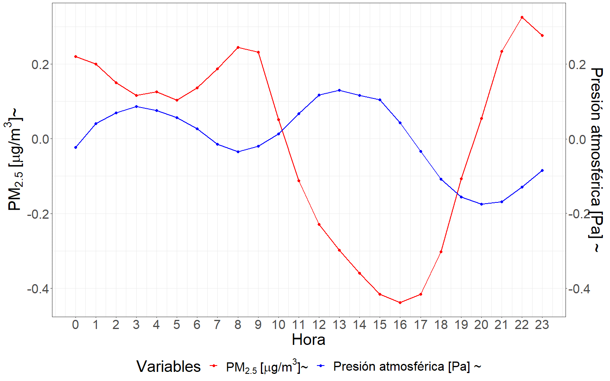

#	Influencia variables meteorológicas y satelitales {#cap:var}

## Introducción

  La teledetección o sensado remoto es una técnica que permite adquirir información mediante instrumentos que no están en contacto físico con los objetos investigados. Los sensores remotos miden la radiación electromagnética que es reflejada o emitida por estos. Generalmente, se ubican a bordo de aviones o satélites que orbitan la Tierra [@chuvieco2010plan]. Dado que la superficie terrestre se encuentra en continuo cambio, como consecuencia de la evolución de los ecosistemas, la acción del hombre y su interacción, la observación sistemática de la superficie permite comprender y pronosticar la dinámica de los sistemas. El conocimiento de esta dinámica posibilita la predicción de escenarios futuros, convirtiendo a la teledetección en una herramienta fundamental [@huot2022next; @rocchini2015potential; @watmough2019socioecologically; @asaly2022using; @paul2020mapping].

  A partir de la información relevada por satélites se generan múltiples productos. Muchos logran estimaciones horarias de un gran número de variables climáticas atmosféricas, terrestres y oceánica, que cubren la totalidad de la superficie terrestre. De esta forma, a partir de estos podemos disponer de información acerca del estado del sistema tierra atmósfera con una elevada resolución tanto espacial como temporal. Generalmente, estas estimaciones se generan por medio de la técnica de reanálisis, la cual combina datos de modelos teóricos, observaciones in situ y leyes físicas. Este principio, denominado asimilación de datos, se encuentra basado en el método utilizado por los centros de predicción meteorológica numérica, en donde cada un lapso de tiempo determinado se combina una previsión pasada con nuevas observaciones para producir una estimación actualizada del estado de la atmósfera [@bell2021era5; @hersbach2020era5; @wu2020regional].

  La fluctuación de las condiciones meteorológicas que determinan el estado de la atmósfera en un momento determinado generan una notable influencia en la variación de la concentración de material particulado fino (PM~2.5~) [@tiwari2017assessment; @he2017influences]. Numerosos estudios han evidenciado estas asociaciones, su porcentaje mayoritario demuestra una vinculación inversa con el material particulado, las variables que responden a este patrón son: la velocidad del viento [@cichowicz2020effect; @usman2022exploring; @xiaoyang2019particulate], la precipitación [@usman2022exploring; @xiaoyang2019particulate], la temperatura [@nogarotto2020review; @xiaoyang2019particulate], el punto de rocío [@zhao2022analysis] y la altura de la capa límite atmosférica (PBLH) [@li2020correlation; @wang2019relationship]. Por otra parte, existen variables que responden a una relación directa como la reportada para la profundidad óptica de aerosoles (AOD) [@soni2018particulate; @gupta2021spatio] y el tráfico de vehículos [@pant2013estimation; @weerakkody2018quantification]. Tanto para la presión atmosférica, como para la humedad relativa, existen resultados que vinculan las variables de forma directa [@li2015particulate; @nogarotto2020review] como inversa [@tian2014characteristics; @chen2016spatial]. Es pertinente destacar la existencia de estudios cuyas conclusiones reflejan que la concentración de material particulado (PM) depende más de la meteorología que de factores antropogénicos [@hooyberghs2005neural]. Además, esta relación de vinculación está sujeta a características propias del sitio de estudio, como por ejemplo las fuentes de emisión y el tamaño de las partículas [@khan2010characterization; @tai2010correlations; @dimitriou2015dependence], así como la topografía del sitio en cuestión [@alvarado2010modeling; @vinoj2022role].
  
  Enmarcado dentro del Servicio de Cambio Climático Copernicus (Copernicus Climate Change Service - C3S) de la Agencia Espacial Europea (ESA), el Centro Europeo para Previsiones Meteorológicas a Medio Plazo (European Centre for Medium-Range Weather Forecasts - ECMWF) está produciendo grandes conjuntos de datos climáticos a escala global. Para ello se combinan modelos climáticos y datos observacionales de todo el mundo. Este producto es la quinta generación de Reanálisis Europeo (European ReAnalysis - ERA5), sucesor de ERA-Interim [@munoz2021era5]. Estos productos, ponen a disposición información para todo el mundo a escala temporal diaria y mensual desde el año 1979. Así, cada vez es más factible mapear y modelar las variaciones o cambios espaciotemporales de las condiciones meteorológicas imperantes antes, durante y después de eventos de interes. El avance de la tecnología ha permitido un desarrollo notable en la capacidad computacional disponible, sumado a la disponibilidad de datos climáticos masivos en diversas plataformas de Internet, es posible obtener información climática variada para un sitio georreferenciado sobre un territorio de interés. Actualmente, se cuenta con variadas herramientas informáticas para la obtención de productos satelitales almacenados en la nube.
  
  La búsqueda de factores que logren explicar la variabilidad de la serie temporal de concentración de PM~2.5~ podría realizarse tanto para la comprensión de la dinámica de variación del contaminante, como para su modelado predictivo. El estudio de los patrones en la serie temporal del contaminante es fundamental para construir modelos mecanisísticos que intenten explicar y relacionar esta variabilidad con la de otros factores del medio. Sin embargo en otros estudios, el análisis de los datos de variabilidad del contaminante se relaciona con la variabilidad de otros factores, como por ejemplo meteorológicos con fines puramente predictivos. Para predecir valores futuros de una serie se puede usar un marco teórico basado en información contenida en la serie y/u otro que se nutra de la variabilidad de características relacionadas a la serie. En la actualidad esto último puede realizarse desde un enfoque computacional basado en el aprendizaje de relaciones entre distintas series de datos a partir de un conjunto de datos de entrenamiento. En particular los métodos de aprendizaje automático permiten obtener estas predicciones de valores futuros en función del comportamiento de un conjunto grande de potenciales predictoras y de la interrelación entre ellas. Los capítulos [4](#cap:var) y [5](#cap:pred), se hayan enmarcados dentro de un enfoque de trabajo basado en el aprendizaje automático, algunos métodos como los algoritmos basados en arboles demandan mas control del investigador sobre las variables predictoras y otros como los de aprendizaje profundo (redes neuronales) habilitan el trabajo con múltiples series de datos cuya variabilidad podría tener potencial capacidad predictiva de la variabilidad de PM~2.5~. Uno de los principales desafíos en el modelado predictivo a través de técnicas de aprendizaje automático es la selección de características o variables predictoras que alimentaran al modelo [@li2019influence; @rumao2019exploration; @cai2018feature]. Es factible que las variables relevantes para el desarrollo de un modelo predictivo de elevada exactitud puedan no solo ser las recomendadas en la literatura para la construcción de modelos mecanisistas explicativos de la dinámica observada en la serie del contaminante, ya que el objetivo dentro del enfoque de aprendizaje automático esta centrado en potenciar la exactitud de las predicciones y no en la explicación de las relaciones subyacentes .
  
  En esta tesis la variable predictora a modelar será la concentración de PM~2.5~ y las variables predictoras son todas derivadas de mediciones satelitales, principalmente meteorológicas. Para abordar el problema enmarcado en determinar la potencialidad de estas variables para predecir la concentración de PM~2.5~, se creó una amplia base de datos satelitales, la cual involucró no solo aquellas variables respaldadas por la bibliografía en cuanto a su conocida influencia sobre el PM~2.5~, sino también otros productos satelitales de fácil obtención cuya variación conjunta podría maximizar la capacidad predictiva de un modelo de aprendizaje automático.  

  En un contexto multi dimensional, las técnicas de selección de características asociadas a la predicción constituyen una herramienta útil para identificar las variables de mayor relevancia para desarrollar un modelo predictivo [@khalid2014survey; @venkatesh2019review]. Es importante destacar que, en algunos casos, las variables seleccionadas pueden no tener un respaldo teórico desde el punto de vista de los mecanismos que subyacen la contaminación ambiental. La implementación de técnicas de aprendizaje automático, permite que vinculaciones indirectas entre las variables que alimentan el modelo pueden ser desenmascaradas y estudiadas. Algunas de ellas podrían tener una interpretación teórica pero no todas [@suparwito2021student; @lima2016use].

  De esta forma los modelos predictivos desarrollados en el capítulo [5](#cap:pred) no solo incluyen las variables destacadas como relevantes según la bibliografía, sino que también incorporan otras variables satelitales que permiten aumentar la exactitud de las predicciones obtenidas. Además, en el presente capítulo las variables analizadas no solo son aquellas cuya relación es conocida con la concentración de PM~2.5~,  sino que también se encuentran involucradas otras variables que han sido identificadas a través del procedimiento de aprendizaje automático como de alta potencialidad para predecir la concentración de PM~2.5~.

## Materiales y métodos

### Base de datos

  La base de datos para el desarrollo de esta sección surge de la combinación de los datos recopilados durante el muestreo de PM~2.5~ (ver capítulo [2](#cap:expl) para más detalles) con distintas bases de datos satelitales. Entre estas se destaca la base de datos de ERA5 que surge del reanálisis realizado por el Centro Europeo de Previsión Meteorológica a Plazo Medio (ECMWF) para el clima global [@hersbach2020era5; @bell2021era5]. Este método de estimación combina modelos predictivos con observaciones a lo largo de todo el mundo, dando por resultado un conjunto de datos completo a escala global, cuyo principio de funcionamiento se basa en la asimilación de datos. La base de datos cuenta con estimaciones horarias para 172 variables atmosféricas, oceánicas y terrestres, con una resolución espacial de 0.25 grados, descargadas desde la plataforma ERA5. Además, se incluyeron otras covariables, citadas en la literatura como relevantes para el PM~2.5~, provenientes de las mediciones del sensor MODIS a bordo de los satélites Terra y Aqua de la Administración Nacional de Aeronáutica y el Espacio (NASA) [@savtchenko2004terra; @lyapustin2019maiac; @lyapustin2018modis; @hulley2014thermal], datos obtenidos a partir del análisis retrospectivo de la era moderna para investigación y aplicaciones, versión 2 (MERRA-2) [@bosilovich2015merra] y la base de datos de Google Traffic [@wu2007google]. Una descripción completa de cada una de las variables involucradas se encuentra en el [Anexo](#cap:anx).
  
Table: Fuentes de datos de variables satelitales. \label{tab:satdata}
Referencia: Fuente de datos, dependencia, resolución espacial, resolución temporal y número total de variables descargadas.

| Fuente | Dependencia | Espacial | Temporal | Variables |
|----------|:--------:|:--------:|:--------:|:--------:|:--------:| 
| ERA5 (ECMWF reanálisis) | ECMWF | 0.25°x0.25° | horaria | 172 |
| MODIS-MAIAC (MCD19A2) | NASA | 0.1°×0.1° | horaria | 1 |
| MERRA-2 (M2T1NXFLX) | NASA  | 0.625°×0.5° | horaria | 1 |
| MERRA-2 (M2IMNXGAS) | NASA  | 0.625°×0.5° | horaria | 1 |
| MERRA-2 (SODA) | NASA | 0.625°×0.5° | horaria | 9 |
| VIIRS (VNP14A1) | NASA | 0.1°×0.1° | diaria | 1 |
| MODIS (MOD11A1/MYD11A1) | NASA | 0.1°×0.1° | horaria | 1 |
  
  A continuación se procede a brindar información respecto de las variables analizadas en la presente sección, estas no solo involucran las de mayor importancia según los sustentos bibliográficos, si no que también las de mayor relevancia en función de las retenidas por el enfoque de aprendizaje automático implementado, estas son:

  Temperatura del aire 2 metros por encima de la superficie de la tierra, que se calcula interpolando entre el nivel más bajo obtenido por el modelo y el valor de temperatura en la superficie terrestre, teniendo en cuenta las condiciones atmosféricas. Este parámetro se expresa en kelvin ($K$). 

 Humedad relativa a 2 metros por encima de la superficie terrestre, que establece la relación entre la presión parcial del vapor de agua y la presión de vapor de equilibrio del agua a la temperatura dada a esa altura. Esta variable es calculada a partir de la combinación de los datos de temperatura y presión estimados por el satélite y se expresa en porcentaje ($%$).

  Punto de rocío, que es la temperatura a la que tendría que enfriarse el aire a 2 metros por encima de la superficie terrestre para que se produzca la saturación, es decir, para que el vapor de agua se condense en rocío o escarcha. Esta temperatura se calcula interpolando entre el nivel más bajo obtenido por el modelo y la medición obtenida para la superficie terrestre, teniendo en cuenta las condiciones atmosféricas. Este parámetro se expresa en kelvin ($K$). 

  Precipitación convectiva, que es la precipitación acumulada que cae sobre la superficie terrestre, obtenida a partir del esquema de convección en el Sistema Integrado de Previsión del ECMWF (IFS). Surge a partir de la combinación de información acerca de la formación y disipación de las nubes y la precipitación, derivada a partir de cambios en características atmosféricas, como lo son presión, temperatura y humedad. Esta precipitación tiene en cuenta tanto la lluvia, como la nieve, entre otros estadios intermedios de precipitación, que son acumulados horariamente. Este parámetro se expresa en metro de agua equivalente sobre la superficie terrestre, que representa la profundidad que tendría el agua si se repartiese uniformemente en la superficie de la cuadrícula de resolución.
  
  Velocidad del viento en su componente “neutra” a una altura de 10 metros sobre la superficie terrestre. Esta neutralidad se calcula a partir de la tensión superficial y de la rugosidad de la superficie terrestre, considerando una estratificación neutra de la atmósfera derivada a partir del gradiente de temperaturas. Esta componente es de menor velocidad que el viento real bajo condiciones estables, y de mayor bajo condiciones inestables. Las unidades en las que se mide este parámetro son metros por segundos ($\frac{m}{s}$). 
  
  Presión atmosférica, es la fuerza por unidad de superficie que ejerce la atmósfera sobre la superficie terrestre. Esta es una medida del peso del aire en una columna situada verticalmente sobre un punto de la superficie terrestre. Las unidades en que se mide este parámetro son Pascales ($Pa$).   
  
  Altura de la capa límite atmosférica (PBLH) refleja la altura del estrato de aire por encima de la superficie terrestre que se ve afectado por la resistencia a la transferencia de momento, calor o humedad, que genera la superficie terrestre. En otras palabras, es la altura del estrato de aire sujeto a la influencia de la superficie terrestre. Esta puede ser tan baja como unas pocas decenas de metros, como sucede con el aire de refrigeración por la noche, o tan alta como varios kilómetros como ocurre sobre el desierto en medio de un día caluroso y soleado. Cuando es baja, pueden desarrollarse mayores concentraciones de contaminantes (emitidos en superficie). Su cálculo se basa en el número de Richardson y la unidad en la que se mide este parámetro son los metros ($m$). 

  Radiación solar directa sin nubosidad sobre la superficie terrestre, es la cantidad de radiación directa del sol (onda corta) que llega a la superficie terrestre, suponiendo condiciones de cielo despejado (sin nubes). Esta radiación solar puede ser dispersada en distintas direcciones por partículas presentes en la atmósfera, la parte que llega a superficie se denomina radiación solar difusa. Mientras que, la parte de la radiación solar que llega a la superficie sin ser dispersada se denomina radiación solar directa. Las cantidades de radiación a cielo despejado se calculan para las mismas condiciones atmosféricas de temperatura, humedad, ozono, gases traza y aerosoles, sin considerar la nubosidad. Las unidades en las que se mide este parámetro son julios por metro cuadrado ($\frac{J}{m^2}$).

  Rugosidad de la superficie terrestre es la altura equivalente en metros de la rugosidad aerodinámica de la superficie terrestre. Es una medida de la resistencia que ejerce la superficie al flujo de aire, particularmente este parámetro se utiliza para determinar la transferencia de momento del aire a la superficie. Una mayor rugosidad de la superficie genera una reducción de la velocidad del viento cerca de la superficie. Esta variable se deriva de la cobertura, tipo de vegetación y presencia de nieve en la superficie terrestre y se expresa en metros ($m$). 

  Presión atmosférica al nivel del mar es la presión que ejerce la atmósfera sobre la superficie terrestre, ajustada a la altura del nivel medio del mar. Es una medida del peso que tendría todo el aire de una columna situada verticalmente sobre un punto de la Tierra, si el punto estuviera situado al nivel medio del mar. Los mapas de presión media a nivel del mar se utilizan para identificar la ubicación de los sistemas meteorológicos de baja y alta presión, a menudo denominados ciclones y anticiclones. Además, los contornos de la presión media a nivel del mar también indican la fuerza del viento, contornos más cerrados muestran vientos más fuertes, mientras que contornos más abiertos indican vientos más débiles. Las unidades de este parámetro son pascales ($Pa$). 
  
  Disipación en la capa límite atmosférica, indica la conversión acumulada de la energía cinética de flujo medio en calor en toda la columna atmosférica, por unidad de superficie, como consecuencia de los efectos de la tensión asociada a remolinos turbulentos cerca de la superficie y al arrastre de forma orográfica turbulenta. Los remolinos turbulentos cerca de la superficie están relacionados con la rugosidad superficial, mientras que el arrastre de forma orográfica turbulenta es la tensión debida a los valles, colinas y montañas en escalas horizontales inferiores a 5 km. Se espera que incrementos de la disipación en la capa limite atmosférica promueva reducciones de la concentración de partículas finas, como consecuencia de la influencia en la disipación de las mismas, por otra parte, reducciones de la disipación no favorecería el fenómeno de dispersión resultando en mayores concentraciones de PM~2.5~. Las unidades en las que se mide este parámetro son julios por metro cuadrado ($\frac{J}{m^2}$). 
  
  Integración vertical de flujo de ozono norte es la tasa horizontal de flujo de ozono en dirección norte, por metro a través del flujo, para una columna de aire que se extiende desde la superficie hasta la parte superior de la atmósfera. Los valores positivos denotan un flujo de sur a norte. Las unidades en las que se mide este parámetro son kilogramos por metro por segundo ($\frac{Kg}{m.s}$).
  
  Tasa media de escorrentía subterránea, es la parte del agua procedente de las precipitaciones, del deshielo o de las napas, que escurre por debajo de la superficie terrestre. El agua que no se almacena escurre, esto puede ser por la superficie (escorrentía superficial) o por debajo del suelo (escorrentía subsuperficial), la suma de ambas se denomina escorrentía. Este parámetro refiere a la tasa que tendría la escorrentía si se repartiera uniformemente por la cuadrícula de resolución espacial. La escorrentía es una medida de la disponibilidad de agua en el suelo y puede utilizarse, por ejemplo, como indicador de sequía o inundación. Se espera que la influencia de la variable en la concentración de PM~2.5~, sea a través del proceso físico de refrigeración de la atmósfera, influyendo en los niveles de la capa límite atmosférica. Las unidades en las que se mide este parámetro son kilogramos por metro cuadrado por segundo ($\frac{Kg}{m^2.s}$). 
  
  Integración vertical de temperatura es la integral vertical de la temperatura para una columna de aire ponderada por su masa, que se extiende desde la superficie de la Tierra hasta la parte superior de la atmósfera. Este parámetro puede utilizarse para estudiar el balance energético atmosférico. Se espera que esta variable se vincule con la concentración de PM~2.5~, por medio de la relación existente entre la variación de la temperatura lo largo del espesor de la atmósfera y las estratificaciones que en esta se generan, resultando en aumentos o disminuciones de la concentración PM~2.5~, en función de la altura a la cual ocurre la estratificación. Este fenómeno se encuentra vinculado también con la variación de la altura de la capa límite atmosférica. Las unidades en las que se mide este parámetro son en kilogramos por Kelvin por metro cuadrado ($\frac{Kg.K}{m^2}$).
  
  Profundidad óptica de aerosoles (AOD) que es un parámetro adimensional que mide la extinción de la luz debida a su dispersión y absorción por la presencia de partículas (por ejemplo, neblina urbana, humo, polvo desértico, sal marina) distribuidas en la columna de aire desde la superficie terrestre a la parte superior de la atmósfera. Esta variable se obtuvo a partir de dos fuentes, en primer lugar, del algoritmo denominado implementación de corrección atmosférica multi-ángulo (MAIAC) que ha sido recientemente desarrollado para los datos obtenidos con el sensor MODIS (a bordo de los satélites Terra y Aqua/NASA) [@lyapustin2019maiac; @lyapustin2018modis]; y en segundo lugar, del Análisis retrospectivo de la era moderna para investigación y aplicaciones, versión 2 (MERRA-2) [@bosilovich2015merra].
  
  Temperatura de la superficie terrestre (LST) obtenida a partir del producto MODIS LST y emisividad, LST&E de sus siglas en inglés (MOD21), disponible en la colección 6, el cual utiliza un algoritmo basado en la física para recuperar dinámicamente tanto esta temperatura como la emisividad simultáneamente para las tres bandas infrarrojas térmicas MODIS (29, 31 y 32) con una resolución espacial de 1 km en el nadir [@savtchenko2004terra; @hulley2014thermal]. Las unidades en las que se mide este parámetro son kelvin ($K$).

  El tráfico de automóviles que es un parámetro adimensional obtenido a partir de los datos que se encuentran publicados en Google Maps, en donde puede visualizarse el tráfico promedio usual para las distintas horas en los distintos días de la semana [@wu2007google]. 

### Protocolo estadístico
  
#### Análisis de series temporales

  En primer lugar, se llevó a cabo un análisis descriptivo de la variabilidad conjunta de las series de las variables satelitales respecto de la variable respuesta, en distintas escalas temporales de relevancia. Posteriormente, se chequeó la estacionalidad de las variables a través de las pruebas de Dickey-Fuller Aumentada (ADF) [@dickey1979distribution] y de Kwiatkowski–Phillips–Schmidt–Shin (KPSS) [@kwiatkowski1992testing]. Una serie de tiempo es estacionaria cuando la media, varianza y covarianza no varían a lo largo del tiempo, ni siguen una tendencia, en otras palabras una serie que es estacionaria es estable a lo largo del tiempo. La prueba de ADF es una prueba de raíz unitaria que permite probar si una serie de tiempo es estacionaria. En caso de presencia de una raíz unitaria en la serie, esta no es estacionaria (hipótesis nula), mientras que, si no posee ninguna, entonces la serie lo es (hipótesis alternativa). La presencia de una raíz unitaria revela una dependencia entre los valores de la serie a lo largo del tiempo y, por lo tanto, dificulta la predicción futura sobre su comportamiento. Por otra parte, la prueba de KPSS determina si una serie de tiempo es estacionaria en tendencia, es decir, alrededor de una tendencia media o lineal (hipótesis nula), o si no es estacionaria debido a una raíz unitaria (hipótesis alternativa). La combinación de los resultados obtenidos por ambas pruebas sugiere qué transformaciones es pertinente realizar para transformar la serie en estacionaria, de esta forma se obtienen indicios sobre el tratamiento necesario para cada variable previo al ajuste de un modelo teórico.
  
  Posteriormente, se procedió a ajustar un modelo teórico a cada una de las series temporales de las variables regresoras con el objetivo de realizar un análisis de correlación cruzada con previo blanqueamiento. La estimación de un modelo teórico consiste en ajustar un modelo matemático a los datos observados de una serie temporal con el fin de identificar las características de la misma. El modelo teórico se ajusta a los datos mediante la estimación de los parámetros del modelo. En este caso, el objetivo que persigue dicho ajuste es el pre blanqueamiento de la serie temporal, el cual busca eliminar las componentes de efectos no deseados, como lo son la tendencia, la estacionalidad y las fluctuaciones irregulares. El pre blanqueamiento consiste en filtrar la serie de la variable respuesta con el modelo teórico ajustado para la variable satelital en análisis [@fuenzalida1990prewhitening; @razavi2018prewhitening]. Finalmente se analiza la correlación cruzada entre ambas series filtradas, el procedimiento ejecutado permite independizarnos de la estructura de autocorrelación presente en las series temporales, cuya interpretación conduciría a la determinación de relaciones espuria entre las variables. La correlación cruzada entre series temporales indica la relación lineal entre las series en función del tiempo. Este análisis es comúnmente implementado en los casos en se quiere determinar si una serie de tiempo puede predecir otra. En otras palabras, la correlación cruzada mide la similitud entre dos series y cómo se relacionan en los distintos momentos de tiempo. A partir de estos resultados se busca reflejar la influencia de las variables satelitales en la variable respuesta [@probst2012using]. Para el ajuste de los modelos teóricos con los cuales se filtró la serie se optó por los llamados modelos de media móvil integrada autorregresiva estacional o conocido por sus siglas en inglés como SARIMA (*Seasonal Autoregressive Integrated Moving Average*) [@box2015time; @del2017evaluation].

  Los modelos SARIMA son una técnica estadística que modelar y predecir series de tiempo con patrones estacionales. Estos se ajustaron luego de estabilizar la media y la varianza de las series temporales. Un modelo SARIMA se escribe como SARIMA (p, d, q) x (P, D, Q)s, donde los parámetros p,d y q denotan el orden de los términos autorregresivos (AR), de diferenciación y de media móvil (MA), respectivamente. Mientras que, los órdenes estacionales autorregresivos, de medias móviles y de diferenciación vienen dados por los parámetros P,D y Q, respectivamente. El periodo de estacionalidad s, en nuestro caso, es de 24 horas dado al periodo cíclico de los datos a lo largo de las horas del día. Para identificar el modelo que mejor se ajusta a cada variable, se inspeccionó la función de autocorrelación simple (FAS) y la función de autocorrelación parcial (FAP), junto con el criterio de información de Akaike (AIC) obtenido para cada modelo.

  La transformación necesaria para la estabilización de la varianza fue distinta para cada una de las variables satelitales analizadas, entre los distintos métodos implementados se utilizaron la transformación de Box-Cox, la transformación logarítmica y la transformación generada a partir de la raíz cuadrada [@thompson2016stabilizing; @guerrero2004variance]. Por otra parte, la estabilización de la media en todos los casos se realizó por medio de la diferenciación de la serie. El ajuste de los modelos teóricos se llevó a cabo por medio de la metodología de Box-Jenkins, en donde el modelo teórico se deduce del análisis iterativo gráfico de la función de autocorrelación simple y parcial, y el cálculo del criterio AIC. La FAS es una medida de la correlación entre una serie de tiempo y sus retrasos, es decir, cómo se relacionan los valores en diferentes momentos en el tiempo. Es decir, la FAS de un retraso k mide la correlación entre los valores de la serie de tiempo en el tiempo t y los valores de la serie de tiempo en el tiempo t-k. Por otra parte, la FAP mide la correlación directa entre los valores de la serie de tiempo en diferentes momentos, pero eliminando la influencia de los retrasos intermedios. Es decir, la FAP de un retraso k mide la correlación entre los valores de la serie de tiempo en el tiempo t y los valores de la serie de tiempo en el tiempo t-k, eliminando la influencia de los valores intermedios entre t y t-k [@box2015time].

  Una vez obtenidos los modelos teóricos para cada una de las series temporales de las variables satelitales, se procedió a filtrar la serie de la variable respuesta y se calculó el diagrama de correlación cruzada. Este diagrama permite identificar cuáles pasados de la variable independiente poseen mayor capacidad predictiva para estimar la variable dependiente. A la hora de analizar el gráfico de correlación cruzada entre las series filtradas, es importante destacar que dicho diagrama ha sido construido considerando la variable satelital como la independiente, mientras que la concentración de PM~2.5~ como la dependiente. De esta forma, debe prestarse atención a los coeficientes de correlación posicionados en los desfasajes negativos, los cuales indican la capacidad predictiva de la variable independiente desfasada un determinado intervalo de tiempo para predecir el PM~2.5~ en el presente.  
  
  Una vez identificados estos retardos, se procedió a ajustar un modelo de función de transferencia dinámica lineal para estimar la dirección de las relaciones entre las variables en cuestión [@box1994time; @bisgaard2006quality1]. Además, los resultados obtenidos fueron corroborados a partir de la estimación de la misma relación funcional en diferencias. De esta forma, si la relación se mantiene constante, entonces puede concluirse que esta ocurre en la realidad [@bisgaard2006quality2]. La diferenciación implica calcular la diferencia entre observaciones consecutivas en la serie temporal, lo que puede eliminar gradualmente cualquier tendencia o patrón de comportamiento no deseado que pueda estar presente en la serie. La primera diferencia, por ejemplo, se calcula como la diferencia entre la observación actual y la observación anterior, mientras que la segunda diferencia se calcula como la diferencia entre dos primeras diferencias consecutivas.

  A partir del procedimiento implementado se ha logrado librar de todo tipo de efecto de autocorrelación existente en las variables. Evitando conclusiones erróneas dadas por relaciones espurias propias de la estructura de autocorrelación existente inherente a los datos de series de tiempo. Los resultados completos del proceso desarrollado pueden encontrarse en el anexo [Anexo](#cap:anx).

  El símbolo virgulilla (~) colocado posterior al nombre de una variable (serie temporal), indica que esta ha sido previamente normalizada (centrada y estandarizada). 

## Resultados

  En esta sección se reportan los resultados obtenidos a partir del análisis descriptivo de la variabilidad conjunta de las variables meteorológicas y satelitales más relevantes en la base de datos en relación con la concentración de PM~2.5~. Para ello, se utilizó un enfoque comparativo en el que se contrastaron los valores de cada variable con respecto a su media.
  
### Temperatura

```{r tempmes, echo=FALSE, out.width="100%", fig.align="center",fig.cap="(ref:tempmes)"}
knitr::include_graphics("images/imagescap4/tempmes.png")
```
(ref:tempmes) Perfil de variación conjunto de los promedios mensuales del PM~2.5~ y la temperatura a lo largo del año.
  
  La figura \@ref(fig:tempmes) permite una mejor comprensión de la relación existente entre la temperatura y la concentración de PM~2.5~ a lo largo del año. En este gráfico, puede observarse que durante los meses de bajas temperaturas, la concentración de PM~2.5~  aumenta, mientras que durante los meses en que la temperatura se eleva por encima de su media, las concentraciones disminuyen.

  Esta tendencia queda claramente evidenciada durante los meses de invierno, cuando las temperaturas son más bajas y las concentraciones de PM~2.5~ alcanzan sus valores máximos. En cambio, durante los meses de primavera y verano, cuando las temperaturas son más elevadas, las concentraciones del contaminante disminuyen. Este patrón podría verse vinculado a que las altas temperaturas favorecen la dispersión del PM~2.5~ en la atmósfera, mientras que las bajas temperaturas, propias del invierno, podrían favorecer la acumulación del contaminante. Este hecho podría encontrarse vinculado a las frecuentes inversiones térmicas ocurrentes durante la época invernal que impiden la dispersión de contaminantes, así como también el aumento del uso de combustibles fósiles para calefacción, generando un aumento de la concentración de PM~2.5~.

```{r temphor, echo=FALSE, out.width="100%", fig.align="center",fig.cap="(ref:temphor)"}
knitr::include_graphics("images/imagescap4/temphor.png")
```
(ref:temphor) Perfil de variación conjunto de los promedios horarios del PM~2.5~ y la temperatura a lo largo del día.

  La figura \@ref(fig:temphor) muestra una variación cíclica de la temperatura a lo largo del día, que se caracteriza por dos puntos de inflexión: uno en la mañana a las 10 horas y otro en la tarde a las 19 horas. Durante las horas de la mañana, la temperatura desciende continuamente hasta llegar a su mínimo a las 10 horas, mientras que en las horas de la tarde la temperatura aumenta constantemente hasta alcanzar su máximo a las 19 horas.

  Al comparar el ciclo descrito de la temperatura con el del PM~2.5~ puede observarse que temperaturas bajas favorecen mayores concentraciones de material particulado, mientras que temperaturas altas promueven reducciones de concentración (Figura \@ref(fig:temphor)). Estos resultados sugieren una relación inversa entre la temperatura y la concentración de PM~2.5~ promedio en las escalas de variación temporal tanto mensual como horaria. 
  
  Es importante destacar que esta relación inversa puede ser explicada por los procesos físicos que ocurren en la atmósfera. En general, la temperatura juega un papel importante en la dispersión y transporte de contaminantes en la atmósfera: a altas temperaturas, la atmósfera se vuelve más estable, reduciendo su capacidad para dispersar contaminantes mientras que, a bajas temperaturas, la atmósfera se vuelve más inestable, permitiendo una mayor dispersión de los contaminantes.

Table: PM~2.5~ promedio horario en las horas del día en que la temperatura toma valores por encima y por debajo de su media condicionada por cada estación del año.\label{tab:temp}

| Temperatura | PM~2.5~ |
|-------------|:-------:|
| Alta | 10.97 |
| Baja | 12.90 |

  A partir de la tabla \@ref(tab:temp) puede notarse que en las horas del día en que la temperatura es baja, la concentración de PM horaria registrada es superior a la registrada en las horas del día en que la temperatura es alta. De esta forma, estos resultados corroboran la relación inversa entre la temperatura y la concentración de material particulado, mostrando que las bajas temperaturas favorecen mayores concentraciones de este contaminante.

Table: Test de Kruskal-Wallis para el PM~2.5~ promedio horario en los días en que la temperatura toma valores por encima y por debajo de su media estacional.\label{tab:tempKW}

| Test | Chi-squared | df	| p-valor |
|------------------------------|:------:|:-----:|:-----:|
| Kruskal-Wallis rank sum test | 49.43	| 1 |	0 |

  A un nivel de significancia del 1%, se puede concluir que la muestra proporciona suficiente evidencia para rechazar la hipótesis nula, lo que sugiere que las muestras provienen de poblaciones con una distribución diferente o que sus medias son significativamente diferentes (Tabla \@ref(tab:tempKW)).

```{r mccftemp, echo=FALSE, out.width="100%", fig.align="center",fig.cap="(ref:mccftemp)"}

```
(ref:mccftemp) Gráfico de la correlación cruzada entre las series filtradas por el modelo teórico.

 Las únicas correlaciones significativas que perdura luego del procedimiento de filtrado de las series se dan en los tiempos t, t-1, t-12 y t-24 (Figura \@ref(fig:mccftemp)), destacándose como los desfasajes temporales de mayor capacidad predictiva para estimar el PM~2.5~ en el presente. 
  
  Luego de la estimación de la relación funcional se determinó que tres de los cuatro coeficientes significativos demostraron una relación inversa entre las variables, la cual permanece constante en la relación funcional diferenciada (t, t-12 y t-24). Por otra parte, el coeficiente restante indicó una relación directa (t-1). Puede establecerse de esta forma que ambas variables se relacionan en una u otra dirección en función del desfasaje temporal analizado, sin embargo, puede notarse que prevalece una relación del tipo inversa dado que la mayoría de los desfasajes se corresponden con esta. Además, la relación de mayor capacidad predictiva responde a una relación inversa y se da al no considerar desfasaje entre la temperatura y la variable respuesta. 

### Humedad relativa

```{r hummes, echo=FALSE, out.width="100%", fig.align="center",fig.cap="(ref:hummes)"}
knitr::include_graphics("images/imagescap4/hummes.png")
```
(ref:hummes) Perfil de variación conjunto de los promedios mensuales del PM~2.5~ y la humedad relativa a lo largo del año.
  
  En la figura \@ref(fig:hummes) puede visualizarse la relación que describen los promedios mensuales de la humedad relativa y la concentración de PM~2.5~ a lo largo del año. Esta escala temporal permite apreciar que en los meses en que la humedad relativa toma valores bajos con respecto a su media, la media de la concentración de PM~2.5~ es alta, mientras que para los meses en que la humedad relativa es alta la concentración de PM~2.5~ es baja con respecto a su media. Es importante destacar que esta relación no se mantiene constante a lo largo del año, como puede observarse en el mes de octubre donde la relación de vinculación se modifica. 

  La humedad relativa es un factor clave en la formación y dispersión de partículas, su variación puede generar grandes cambios en la concentración de PM~2.5~. Además, la presencia de meses en los que la relación de vinculación entre la humedad relativa y la concentración de PM~2.5~ cambia, como ocurre en octubre, indica que existen factores adicionales que pueden estar influyendo en la concentración de PM~2.5~ en la atmósfera. Estos factores podrían incluir variaciones en la fuente de emisión de los contaminantes, la presencia de eventos meteorológicos extremos o la interacción con otros contaminantes atmosféricos. Por lo tanto, es importante considerar una amplia gama de factores al analizar la relación entre la humedad relativa y la concentración de PM~2.5~ en la atmósfera.

```{r humhor, echo=FALSE, out.width="100%", fig.align="center",fig.cap="(ref:humhor)"}
knitr::include_graphics("images/imagescap4/humhor.png")
```
(ref:humhor) Perfil de variación conjunto de los promedios horarios del PM~2.5~ y la humedad relativa a lo largo del día.
  
  La figura \@ref(fig:humhor) exhibe la variación promedio de la humedad relativa a lo largo del día. Este patrón cíclico presenta dos puntos de inflexión, uno a las 10 horas y otro a las 19 horas, lo que sugiere la existencia de dos momentos antagónicos durante el día. Entre las 10 y las 19 horas, la humedad relativa disminuye, mientras que en el resto del día aumenta constantemente. Puede inferirse que una disminución de la humedad relativa con respecto a su media favorece un incremento de la concentración de PM fino, mientras que un aumento favorece su disminución.

  La relación entre la humedad relativa y la concentración de PM~2.5~ exhibe un ciclo de variación similar a lo largo del día, sin considerar ningún desfase temporal entre las variables. A pesar de lo que se observa, estos resultados no coinciden con la relación inversa que suele identificarse para el caso de la humedad relativa [@nogarotto2020review ;@liu2020varying; @he2019exploring; @chen2016spatial]. Sin embargo, al considerar un desfase de 5 horas (Figura \@ref(fig:mccfhum)), se aprecia una relación inversa entre las mismas. Por ejemplo, en la figura \@ref(fig:humhor), las curvas que representan el patrón de relación entre ambas variables describen una relación directa, mientras que al considerar un desfase de 5 horas, la relación entre ellas se vuelve inversa. Este resultado sugiere que la relación entre la humedad relativa y la concentración de PM~2.5~ es sensible al desfase temporal entre ambas variables.

Table: PM~2.5~ promedio horario en los días en que la humedad relativa toma valores por encima y por debajo de su media condicionada por cada estación del año.\label{tab:hum}

| Humedad Relativa | PM~2.5~ |
|-------------|:-------:|
| Alta | 11.40 |
| Baja | 9.75 |

  Puede notarse que durante las horas en que la humedad relativa es baja con respecto a su media, la concentración media de PM~2.5~ también es baja. Por el contrario, cuando la humedad relativa es alta, las concentraciones registradas de PM~2.5~ son más elevadas, lo que sugiere una relación directa entre ambas variables (Tabla \@ref(tab:hum)).
  
Table: Test de Kruskal-Wallis para el PM~2.5~ promedio horario en los días en que toma valores por encima y por debajo de su media condicionada por cada estación del año.\label{tab:humKW}

| Test | Chi-squared | df	| p-valor |
|------------------------------|:------:|:-----:|:-------:|
| Kruskal-Wallis rank sum test | 110.44	| 1 |	0 |

  A un nivel de significancia del 1% podemos establecer que la muestra reúne evidencias suficientes para rechazar la hipótesis nula, con lo cual se concluye que sus medias son significativamente diferentes (Tabla \@ref(tab:humKW)).

```{r mccfhum, echo=FALSE, out.width="100%", fig.align="center",fig.cap="(ref:mccfhum)"}

```
(ref:mccfhum) Gráfico de la correlación cruzada entre las series filtradas por el modelo teórico.

  A partir de la figura \@ref(fig:mccfhum), puede apreciarse que las únicas correlaciones significativas que perduran luego del procedimiento de filtrado de las series son los pasados en los tiempos t-24 y t-5, destacándose como los desfasajes temporales de mayor capacidad predictiva para estimar el PM~2.5~ en el presente.
  
  Luego de la estimación de la relación funcional entre la humedad relativa y el PM~2.5~, se determinó que cada uno de los coeficientes demostró una relación en direcciones opuestas, que se mantuvo constante en la estimación en diferencias. En particular, el desfasaje temporal de 5 horas demostró una relación inversa, mientras que el de 24 horas demostró una relación directa. Esto sugiere que la dirección de la relación entre ambas variables varía según el desfasaje considerado.

  Puede establecerse de esta forma que ambas variables se relacionan en una u otra dirección en función del desfasaje temporal considerado. Por otra parte, la relación de mayor capacidad predictiva es la obtenida en el desfasaje de 24 horas de la humedad relativa con respecto a la variable respuesta, demostrando una mayor contribución de la relación directa para predecir la variable respuesta en el presente.

### Temperatura del punto de rocío

```{r rocmes, echo=FALSE, out.width="100%", fig.align="center",fig.cap="(ref:rocmes)"}

```
(ref:rocmes) Perfil de variación conjunto de los promedios mensuales del PM~2.5~ y la temperatura del punto de rocío a lo largo del año.
  
  A partir de la figura \@ref(fig:rocmes) puede visualizarse la relación que describen los promedios mensuales de la temperatura del punto de rocío y la concentración de PM~2.5~ a lo largo del año. Esta escala temporal muestra que en los meses en los que la temperatura del punto de rocío está por debajo de su media, la concentración media de PM~2.5~ es alta, mientras que en los meses en los que la temperatura del punto de rocío es alta, la concentración de PM~2.5~ también lo es con respecto a su media. 

```{r rochor, echo=FALSE, out.width="100%", fig.align="center",fig.cap="(ref:rochor)"}
knitr::include_graphics("images/imagescap4/rochor.png")
```
(ref:rochor) Perfil de variación conjunto de los promedios horarios del PM~2.5~ y la temperatura del punto de rocío a lo largo del día.

  La figura \@ref(fig:rochor) muestra el ciclo de variación que describe la temperatura del punto de rocío promedio a lo largo de las horas del día. Puede observarse que a medida que transcurren las horas, la temperatura del punto de rocío experimenta un ciclo de variación inverso al ciclo que describe la concentración de PM~2.5~ promedio. En otras palabras, cuando la temperatura del punto de rocío alcanza valores elevados con respecto a su media, se observan menores concentraciones del contaminante, como sucede entre las 10 y 20 horas, el periodo del día en que las concentraciones son más bajas. En contraposición, el pico de concentraciones entre las 6 y 10 horas se produce al mismo tiempo que se registra un descenso en la temperatura del punto de rocío.

  A partir de esta información puede interpretarse que la relación que mejor describe el vínculo entre las variables en cuestión es una relación inversa.

Table: PM~2.5~ promedio horario en los días en que la presión toma valores por encima y por debajo de su media condicionada por cada estación del año.\label{tab:roc}

| Temperatura del punto de rocío | PM~2.5~ |
|-------------------------------------|:-------:|
| Alta | 11.00 |
| Baja | 10.45 |
  
  Puede notarse que las concentraciones de PM~2.5~ no varían significativamente en función de la temperatura del punto de rocío en las horas del día en que esta toma valores bajos o altos con respecto a su media. En otras palabras, no se encontró una relación clara entre estas variables en esos momentos del día (Tabla \@ref(tab:roc)). 
  
  Es importante destacar que la falta de relación entre la temperatura del punto de rocío y la concentración de PM~2.5~ en ciertas horas del día puede deberse a la presencia de otros factores ambientales que influyen en la concentración del contaminante.
  
Table: Test de Kruskal-Wallis para el PM~2.5~ promedio horario en los días en que la presión toma valores por encima y por debajo de su media condicionada por cada estación del año.\label{tab:rocKW}

| Test | Chi-squared | df	| p-valor |
|------------------------------|:------:|:-----:|:-------:|
| Kruskal-Wallis rank sum test | 36.31	| 1 |	0.1 |

  A un nivel de significancia del 1% podemos establecer que la muestra no reúne evidencias suficientes para rechazar la hipótesis nula, con lo cual se concluye que sus medias son iguales (Tabla \@ref(tab:rocKW)).
  
```{r mccfroc, echo=FALSE, out.width="100%", fig.align="center",fig.cap="(ref:mccfroc)"}

```
(ref:mccfroc) Gráfico de la correlación cruzada entre las series filtradas por el modelo teórico.

  A partir de la figura \@ref(fig:mccfroc), puede apreciarse que las únicas correlaciones significativas que perdura luego del procedimiento de filtrado de las series son los pasados en los tiempos t-11, t-14 y t-20, destacándose como los desfasajes temporales de mayor capacidad predictiva para estimar el PM~2.5~ en el presente.
  
  Luego de la estimación de la relación funcional, se determinó que dos de los tres coeficientes (t-11 y t-14) demostraron una relación inversa con la concentración de PM~2.5~, mientras que el coeficiente correspondiente al desfasaje de 20 horas mostró una relación espuria o aleatoria, invirtiendo su signo en ambas estimaciones de la relación funcional.

  En conclusión, puede afirmarse que la temperatura del punto de rocío y la concentración de PM~2.5~ se relacionan de forma inversamente proporcional, y que el desfasaje de mayor capacidad predictiva para estimar la concentración de PM~2.5~ en el presente es de 14 horas con respecto a la temperatura del punto de rocío.

### Precipitación
  
  Es importante destacar que el análisis de la precipitación en la escala temporal horaria no es significativo debido a su frecuencia de ocurrencia, lo que resulta en un gran número de datos nulos que pueden interferir con las interpretaciones. Por lo tanto, se decidió no incluir el análisis exploratorio en esta escala temporal para evitar posibles conclusiones erróneas.

```{r rainmes, echo=FALSE, out.width="100%", fig.align="center",fig.cap="(ref:rainmes)"}

```
(ref:rainmes) Perfil de variación conjunto de los promedios mensuales del PM~2.5~ y la precipitación a lo largo del año.

  La figura \@ref(fig:rainmes) presenta el perfil de variación promedio mensual de la precipitación a lo largo del año. Puede observarse que durante la primavera y el verano, las precipitaciones aumentan notablemente en comparación con el otoño e invierno. Además, los mayores valores de precipitación se registraron en los meses de noviembre y febrero, mientras que los meses de mayo a octubre presentaron las menores precipitaciones.
  
  Puede notarse que en los meses en que las precipitaciones son altas, la concentración promedio mensual de PM~2.5~ se ve reducida, mientras que en los meses en que las precipitaciones son bajas, las concentraciones de PM~2.5~ presentan valores más elevados. De esta forma puede interpretarse que la relación que vincula ambas variables es del tipo inversa. Este hallazgo sugiere que la lluvia juega un papel fundamental en la reducción de los niveles de PM~2.5~ en la atmósfera.

Table: PM~2.5~ promedio horario en los días en las horas del día en que ocurren precipitaciones, tomando valores por encima y por debajo de su media condicionada por cada estación del año.\label{tab:rain}

| Precipitación | PM~2.5~ |
|-------------|:-------:|
| Alta | 7.34 |
| Baja | 11.05 |

  A partir de la tabla \@ref(tab:rain) puede notarse que las horas del día en que ocurren precipitaciones la concentración media de PM~2.5~ horaria disminuye, mientras que las horas del día en que no ocurren precipitaciones se favorecen concentraciones altas.
  
Table: Test de Kruskal-Wallis para el PM~2.5~ promedio horario en los días en que la precipitación toma valores por encima y por debajo de su media condicionada por cada estación del año.\label{tab:rainKW}

| Test | Chi-squared | df	| p-valor |
|------------------------------|:------:|:-----:|:-------:|
| Kruskal-Wallis rank sum test | 202.74	| 1 |	0 |

  A un nivel de significancia del 1% podemos establecer que la muestra reúne evidencias suficientes para rechazar la hipótesis nula, con lo cual se concluye que sus medias son significativamente diferentes (Tabla \@ref(tab:rainKW)).

```{r mccfrain, echo=FALSE, out.width="100%", fig.align="center",fig.cap="(ref:mccfrain)"}
knitr::include_graphics("images/imagescap4/mccfrain.png")
```
(ref:mccfrain) Gráfico de la correlación cruzada entre las series filtradas por el modelo teórico.

  A partir de la figura \@ref(fig:mccfrain), puede apreciarse que la única correlación significativa que perdura luego del procedimiento de filtrado de las series es el pasado en el tiempo t-1, destacándose como el desfasaje temporal de mayor capacidad predictiva para estimar el PM~2.5~ en el presente. 
  
  Luego de la estimación de la relación funcional se determinó que el coeficiente demostró una relación inversa. Puede establecerse de esta forma que ambas variables se relacionan de forma inversa y que la relación de mayor capacidad predictiva se da en un desfasaje de 1 hora de la precipitación con respecto a la variable respuesta. 

### Velocidad del viento

```{r vvientmes, echo=FALSE, out.width="100%", fig.align="center",fig.cap="(ref:vvientmes)"}
knitr::include_graphics("images/imagescap4/vvientmes.png")
```
(ref:vvientmes) Perfil de variación conjunto de los promedios mensuales del PM~2.5~ y la velocidad del viento a lo largo del año.
  
  La figura \@ref(fig:vvientmes) presenta el patrón de variación de los promedios mensuales de la velocidad del viento a lo largo del año con respecto a la concentración promedio de PM~2.5~. A partir de esta, puede observarse que los mayores valores de velocidad del viento ocurren durante parte del invierno y la primavera, alcanzando sus máximos en los meses de septiembre y octubre. Por otro lado, se registran menores valores durante el verano y el otoño, con el mínimo en el mes de febrero. A pesar de la tendencia inversa que puede observarse en esta escala temporal, no se observa una marcada relación entre las variables. Por este motivo, será necesario realizar un análisis más detallado para determinar la existencia y la naturaleza de esta relación en escalas de tiempo más finas.

```{r vvienthor, echo=FALSE, out.width="100%", fig.align="center",fig.cap="(ref:vvienthor)"}
knitr::include_graphics("images/imagescap4/vvienthor.png")
```
(ref:vvienthor) Perfil de variación conjunto de los promedios horarios del PM~2.5~ y la velocidad del viento a lo largo del día.

  El patrón de variación de la velocidad del viento a lo largo del día (Figura \@ref(fig:vvienthor)), describe un incremento entre las 10 y 20 horas, desarrollando las máximas magnitudes entre las 15 y 20 horas, mientras que el resto del día la intensidad del viento es baja, con un mínimo a las 9 horas. La variación conjunta permite establecer que cuando la velocidad es baja, la concentración de PM~2.5~ es alta, mientras que cuando la velocidad del viento aumenta, la concentración disminuye. De esta forma puede interpretarse que la relación que mejor vincular a ambas variables es de la forma inversa.

Table: PM~2.5~ promedio horario en los días en que toma valores por encima y por debajo de su media condicionada por cada estación del año.\label{tab:vvient}

| Velocidad del viento | PM~2.5~ |
|-------------|:-------:|
| Alta | 8.10 |
| Baja | 12.62 |

  Puede notarse que las horas del día en que la velocidad del viento es baja con respecto a su media, se presentan los valores más altos de concentración media de PM~2.5~, mientras que las horas en que la velocidad del viento es alta con respecto a la misma, se presentan valores más bajos de concentración media (Tabla \@ref(tab:vvient)).

Table: Test de Kruskal-Wallis para el PM~2.5~ promedio horario en los días en que toma valores por encima y por debajo de su media condicionada por cada estación del año.\label{tab:vvientKW}

| Test | Chi-squared | df	| p-valor |
|------------------------------|:------:|:-----:|:-------:|
| Kruskal-Wallis rank sum test | 807.78	| 1 |	0 |

  A un nivel de significancia del 1% podemos establecer que la muestra reúne evidencias suficientes para rechazar la hipótesis nula, con lo cual se concluye que sus medias son significativamente diferentes (Tabla \@ref(tab:vvientKW)).

```{r mccfvient, echo=FALSE, out.width="100%", fig.align="center",fig.cap="(ref:mccfvient)"}

```
(ref:mccfvient) Gráfico de la correlación cruzada entre las series filtradas por el modelo teórico.

  A partir de la figura \@ref(fig:mccfvient), puede apreciarse que las únicas correlaciones significativas que perdura luego del procedimiento de filtrado de las series son los pasados en los tiempos t-5, t-7, t-8 y t-24, destacándose como los desfasajes temporales de mayor capacidad predictiva para estimar el PM~2.5~ en el presente.
  
  Luego de la estimación de la relación funcional se determinó que tres de los cuatro coeficientes demostraron estar influenciados por una relación espuria o aleatoria (t-5, t-7 y t-8), lo que significa que estas relaciones no son significativas en términos estadísticos. En contraste, el coeficiente para el tiempo t-24 muestra una relación inversa significativa. Por lo tanto, puede establecerse que ambas variables se relacionan de forma inversa y que la relación que mayor capacidad predictiva se da en un desfasaje de 24 horas de la velocidad del viento con respecto a la variable respuesta.
 
### Presión atmosférica

```{r presmes, echo=FALSE, out.width="100%", fig.align="center",fig.cap="(ref:presmes)"}

```
(ref:presmes) Perfil de variación conjunto de los promedios mensuales del PM~2.5~ y la presión a lo largo del año.
  
  En la figura \@ref(fig:presmes) puede notarse la variación conjunta de los promedios mensuales de la presión atmosférica con respecto a la concentración promedio de PM~2.5~ a lo largo del año. Esta variable alcanza sus valores máximos durante el otoño y el invierno, en los meses de junio y julio, mientras que en la primavera y el verano, la magnitud de esta variable disminuye. Por otro lado, la concentración promedio de PM~2.5~ se relaciona de manera inversa con la presión atmosférica, alcanzando sus valores máximos durante los meses de primavera y verano y disminuyendo durante el otoño e invierno. A partir de la figura, se puede apreciar que existe una relación conjunta directa entre ambas variables. Durante los meses en que se registran mayores concentraciones de PM fino, la presión atmosférica también alcanza sus valores máximos, y en los que se registran valores bajos de presión, la concentración del contaminante también disminuye. 

```{r preshor, echo=FALSE, out.width="100%", fig.align="center",fig.cap="(ref:preshor)"}

```
(ref:preshor) Perfil de variación conjunto de los promedios horarios del PM~2.5~ y la presión a lo largo del día.
 
  En la figura \@ref(fig:preshor), se presenta el patrón de variación horario de la presión atmosférica a lo largo del día. Puede notarse que la presión alcanza sus valores mínimos en dos momentos del día: entre las 7 y 9 horas y entre las 19 y 21 horas y alcanza sus valores máximos: entre las 2 y 4 horas y entre las 12 y 14 horas. Al analizar la variación horaria conjunta de ambas variables, se observa una relación inversa en la que cada período de aumento y disminución de las magnitudes es opuesto e instantáneo. En otras palabras, los picos de presión generan una notable reducción en la concentración de PM fino, mientras que las reducciones de la presión generan picos en la concentración de este contaminante.
  
Table: PM~2.5~ promedio horario en los días en que la presión toma valores por encima y por debajo de su media condicionada por cada estación del año.\label{tab:pres}

| Presión atmosférica | PM~2.5~ |
|---------------------|:-------:|
| Alta | 10.59 |
| Baja | 10.77 |
  
  Puede notarse que la concentración media de PM~2.5~ no varía significativamente con respecto a la variación horaria de la presión atmosférica (Tabla \@ref(tab:pres)). A pesar de esto, puede observarse una tendencia que establece que altos valores de presión atmosférica favorecen bajas concentraciones de PM~2.5~, mientras que bajos valores de esta variable favorecen altas concentraciones de PM~2.5~ (Tabla \@ref(tab:pres)).

Table: Test de Kruskal-Wallis para el PM~2.5~ promedio horario en los días en que la presión toma valores por encima y por debajo de su media condicionada por cada estación del año.\label{tab:presKW}

| Test | Chi-squared | df	| p-valor |
|------------------------------|:------:|:-----:|:-------:|
| Kruskal-Wallis rank sum test | 16.31	| 1 |	0.1 |

  A un nivel de significancia del 1% podemos establecer que la muestra no reúne evidencias suficientes para rechazar la hipótesis nula, con lo cual se concluye que las muestras provienen de poblaciones con la misma distribución, o bien que sus medias son iguales (Tabla \@ref(tab:presKW)).
  
```{r mccfpres, echo=FALSE, out.width="100%", fig.align="center",fig.cap="(ref:mccfpres)"}

```
(ref:mccfpres) Gráfico de la correlación cruzada entre las series filtradas por el modelo teórico.

  A partir de la figura \@ref(fig:mccfpres), puede apreciarse que las únicas correlaciones significativas que perdura luego del procedimiento de filtrado de las series son los pasados en los tiempos t-1 y t-10, destacándose como los desfasajes temporales de mayor capacidad predictiva para estimar el PM~2.5~ en el presente.
  
  Luego de la estimación de la relación funcional se determinó que cada uno de los coeficientes demostró una relación de vinculación distinta, la cual se mantuvo constante en la estimación en diferencias. Específicamente, se encontró que el desfasaje temporal de 1 hora demostró una relación inversa, mientras que el de 10 horas una relación directa. Esto sugiere que la relación entre ambas variables varía en función del desfasaje temporal considerado. A pesar de esto, la relación de mayor capacidad predictiva se da en un desfasaje temporal de 10 horas y responde a una relación directa. 
  
### Radiación solar

```{r radmes, echo=FALSE, out.width="100%", fig.align="center",fig.cap="(ref:radmes)"}

```
(ref:radmes) Perfil de variación conjunto de los promedios mensuales del PM~2.5~ y la radiación de corta longitud de onda a lo largo del año.

  La figura \@ref(fig:radmes) muestra el patrón de variación que describe la radiación solar a lo largo de los meses del año. Puede observarse que esta disminuye durante el otoño e invierno, alcanzando sus mayores valores durante la primavera y el verano, específicamente durante los meses de noviembre y diciembre, mientras que los mínimos se alcanzan durante mayo y junio.
  
  Por otra parte, la relación entre ambas variables aparenta ser del tipo inversa, ya que radiaciones de baja magnitud coinciden con el aumento de la concentración de PM~2.5~, mientras que aumentos de radiación están asociados con disminuciones de los niveles de PM~2.5~ Estos resultados sugieren una clara asociación de la radiación solar con la concentración del PM~2.5~ atmosférico.

```{r radhor, echo=FALSE, out.width="100%", fig.align="center",fig.cap="(ref:radhor)"}
knitr::include_graphics("images/imagescap4/radhor.png")
```
(ref:radhor) Perfil de variación conjunto de los promedios horarios del PM~2.5~ y la radiación de corta longitud de onda a lo largo del día.
  
  La figura \@ref(fig:radhor) presenta el perfil de variación promedio de la radiación solar a lo largo del día, mostrando dos puntos de inflexión. El primero ocurre a las 10 horas en la mañana, a partir del cual se describe una tendencia incremental en las magnitudes registradas. El segundo se alcanza a las 17 horas, momento a partir del cual se describe una tendencia decreciente hasta alcanzar los valores mínimos de radiación, que se dan durante la noche y la madrugada. 
  
  La relación que mejor describe la vinculación entre la radiación solar y la concentración de PM~2.5~ es inversa (Figura \@ref(fig:radhor)), ya que los aumentos de radiación están asociados con bajos niveles de PM~2.5~, mientras que periodos de baja radiación se asocian con aumentos de partículas.
  
Table: PM~2.5~ promedio horario en los días en que la radiación de corta longitud de onda toma valores por encima y por debajo de su media condicionada por cada estación del año.\label{tab:rad}

| Radiación solar | PM~2.5~ |
|-----------------|:-------:|
| Alta | 7.86 |
| Baja | 12.27 |

  La tabla \@ref(tab:rad) muestra que la concentración media horaria de PM~2.5~ es mayor durante las horas del día en que la radiación solar es baja en comparación con las horas en que la radiación solar es alta con respecto a su media. Esto sugiere una relación inversa entre ambas variables. Estos hallazgos coinciden con lo observado en la figura \@ref(fig:radhor), donde se muestra que los valores mínimos de radiación solar se corresponden con los picos máximos de la concentración de PM~2.5~ y viceversa.

Table: Test de Kruskal-Wallis para el PM~2.5~ promedio horario en los días en que toma valores por encima y por debajo de su media condicionada por cada estación del año.\label{tab:radKW}

| Test | Chi-squared | df	| p-valor |
|------------------------------|:------:|:-----:|:-------:|
| Kruskal-Wallis rank sum test | 696.71	| 1 |	0 |

  A un nivel de significancia del 1% podemos establecer que la muestra reúne evidencias suficientes para rechazar la hipótesis nula, con lo cual se concluye que las medias son significativamente diferentes (Tabla \@ref(tab:radKW)).

```{r mccfrad, echo=FALSE, out.width="100%", fig.align="center",fig.cap="(ref:mccfrad)"}

```
(ref:mccfrad) Gráfico de la correlación cruzada entre las series filtradas por el modelo teórico.

  A partir de la figura \@ref(fig:mccfrad), puede apreciarse que las correlaciones significativas que perduran luego del procedimiento de filtrado de las series son los pasados en los tiempos t-13 y t-23, destacándose como los desfasajes temporales de mayor capacidad predictiva para estimar el PM~2.5~ en el presente.
  
  Luego de la estimación de la relación funcional se determinó que que los coeficientes demostraron relaciones de vinculación en dirección tanto directa como inversa. En concreto, el desfasaje temporal de 13 horas mostró una relación directa, mientras que el de 23 horas presentó una relación inversa. Sin embargo, el coeficiente de mayor capacidad predictiva demostró una relación inversa.
  
  En consecuencia, puede afirmarse que ambas variables se relacionan en una u otra dirección en función del desfasaje temporal considerado. Además, la relación de mayor capacidad predictiva se da en un desfasaje de 23 horas de la radiación solar con respecto a la variable respuesta, siguiendo una relación del tipo inversa.

### Profundidad óptica de los aerosoles (AOD)

```{r aodmes, echo=FALSE, out.width="100%", fig.align="center",fig.cap="(ref:aodmes)"}
knitr::include_graphics("images/imagescap4/aodmes.png")
```
(ref:aodmes) Perfil de variación conjunto de los promedios mensuales del PM~2.5~ y la profundidad óptica de los aerosoles a lo largo del año.
  
  A partir de la figura \@ref(fig:aodmes) puede visualizarse el patrón de variación conjunto en los promedios mensuales de AOD y la concentración de PM~2.5~ a lo largo del año. Esta escala temporal muestra que durante los meses de baja AOD la concentración de PM~2.5~ aumenta, mientras que durante los meses en que el AOD es alto los niveles de PM~2.5~ son bajos. A pesar de esto, es importante destacar que la bibliografía menciona una correlación positiva entre ambas variables [@soni2018particulate; @gupta2021spatio]. Por este motivo es importante analizar en escalas temporales de menor granularidad con el objetivo de determinar la verdadera relación entre las variables.

```{r aodhor, echo=FALSE, out.width="100%", fig.align="center",fig.cap="(ref:aodhor)"}
knitr::include_graphics("images/imagescap4/aodhor.png")
```
(ref:aodhor) Perfil de variación conjunto de los promedios horarios del PM~2.5~ y la profundidad óptica de los aerosoles a lo largo del día.

  En la figura \@ref(fig:aodhor), se presenta el patrón de variación horario conjunto del AOD y la concentración de PM~2.5~ a lo largo de las horas del día. En esta escala temporal puede apreciarse que la relación que describe el vínculo entre ambas variables es directa. Los bajos valores de concentración de PM~2.5~ ocurren de forma simultánea con bajos valores de AOD, mientras que los incrementos en los registros de PM~2.5~ se dan conjuntamente con incrementos de la variable. Es importante destacar que ambos ciclos horarios muestran el mismo patrón de variación horario, lo que indica un notable acuerdo con una relación de vinculación directa entre ambas variables.

Table: PM~2.5~ promedio horario en los días en que el AOD toma valores por encima y por debajo de su media condicionada por cada estación del año.\label{tab:aod}

| AOD | PM~2.5~ |
|-------------|:-------:|
| Alta | 11.57 |
| Baja | 8.78 |

  De acuerdo a la tabla \@ref(tab:aod), en las horas del día en que el AOD es baja con respecto a su media, la concentración media horaria de PM~2.5~ registrada es inferior con respecto a la registrada cuando el AOD es alta con respecto a su media. Esto indica que durante las horas del día en que la presencia de aerosoles en el aire es menor, la concentración de PM~2.5~ tiende a ser menor también, mientras que durante las horas en que la presencia de aerosoles es mayor, la concentración de PM~2.5~ tiende a ser mayor.

Table: Test de Kruskal-Wallis para el PM~2.5~ promedio horario en los días en que el AOD toma valores por encima y por debajo de su media condicionada por cada estación del año.\label{tab:aodKW}

| Test | Chi-squared | df	| p-valor |
|------------------------------|:------:|:-----:|:-------:|
| Kruskal-Wallis rank sum test | 215.99	| 1 |	0.74 |

  A un nivel de significancia del 1% podemos establecer que la muestra reúne evidencias suficientes para rechazar la hipótesis nula, con lo cual se concluye que sus medias son significativamente diferentes (Tabla \@ref(tab:aodKW)).

```{r mccfaod, echo=FALSE, out.width="100%", fig.align="center",fig.cap="(ref:mccfaod)"}

```
(ref:mccfaod) Gráfico de la correlación cruzada entre las series filtradas por el modelo teórico.

  A partir de la figura \@ref(fig:mccfaod), puede apreciarse que las únicas correlaciones significativas que perduran luego del procedimiento de filtrado de las series son los pasados en los tiempos  t, t-7 y t-8, destacándose como los desfasajes temporales de mayor capacidad predictiva para estimar el PM~2.5~ en el presente.
  
  Luego de la estimación de la relación funcional se determinó que dos de los tres coeficientes se vieron influenciados por una relación espuria o aleatoria (t-7 y t-8), demostrando que no existe una relación real entre estas variables en esos desfasajes. Sin embargo, el coeficiente restante mostró una relación de vinculación directa. Puede establecerse de esta forma que ambas variables se relacionan de forma directa y que la relación de mayor capacidad predictiva se da sin considerar desfasaje entre el AOD y la variable respuesta.

### Altura de la capa límite atmosférica (PBLH)

```{r PBLHmes, echo=FALSE, out.width="100%", fig.align="center",fig.cap="(ref:PBLHmes)"}
knitr::include_graphics("images/imagescap4/pblmes.png")
```
(ref:PBLHmes) Perfil de variación conjunto de los promedios mensuales del PM~2.5~ y el PBLH a lo largo del año.

  La figura \@ref(fig:PBLHmes) ilustra el patrón de variación de los promedios mensuales del PBLH y la concentración de PM~2.5~ a lo largo del año. El PBLH muestra sus valores mínimos durante el otoño e invierno, mientras que los máximos durante la primavera y el verano. La relación de vinculación que puede apreciarse entre ambas variables es del tipo inversa: a medida que el PBLH, las concentraciones de PM~2.5~ aumentan, y a medida que la altura aumenta, las concentraciones disminuyen.

```{r PBLHor, echo=FALSE, out.width="100%", fig.align="center",fig.cap="(ref:PBLHor)"}
knitr::include_graphics("images/imagescap4/pblhor.png")
```
(ref:PBLHor) Perfil de variación conjunto de los promedios horarios del PM~2.5~ y el PBLH a lo largo del día.

  A partir de la figura \@ref(fig:PBLHor), puede apreciarse el patrón de variación del PBLH a lo largo de las horas del día. Puede notarse que el PBLH alcanza su punto máximo al anochecer, alrededor de las 18 horas, y luego disminuye gradualmente hasta alcanzar su mínimo a las 9 horas de la mañana. Esta variación horaria sugiere que el PBLH está inversamente relacionada con la concentración de PM~2.5~. Es decir, cuando el PBLH es alta, se registran concentraciones bajas de PM~2.5~, mientras que cuando el PBLH es baja, las concentraciones de PM~2.5~ son elevadas. En este sentido, la figura \@ref(fig:PBLHor) confirma la relación inversa entre ambas variables observada en la figura \@ref(fig:PBLHmes) y sugiere que el PBLH puede ser un factor determinante en la concentración de PM~2.5~ a nivel local.

Table: PM~2.5~ promedio horario en los días en que el PBLH toma valores por encima y por debajo de su media condicionada por cada estación del año.\label{tab:PBLH}

| PBLH | PM~2.5~ |
|-------------|:-------:|
| Alta | 7.92 |
| Baja | 12.44 |

  En la tabla \@ref(tab:PBLH) puede apreciarse que en las horas en las que el PBLH es baja con respecto a su media, la concentración media horaria de PM~2.5~ es significativamente inferior en comparación con las horas en las que la altura es alta. Esta relación sugiere que cuando el PBLH es baja, la concentración de PM~2.5~ es alta y viceversa, lo que respalda la relación inversa observada en la figura \@ref(fig:PBLHor).

Table: Test de Kruskal-Wallis para el PM~2.5~ promedio horario en los días en que el PBLH toma valores por encima y por debajo de su media condicionada por cada estación del año.\label{tab:PBLHKW}

| Test | Chi-squared | df	| p-valor |
|------------------------------|:------:|:-----:|:-------:|
| Kruskal-Wallis rank sum test | 809.17	| 1 |	0 |

  A un nivel de significancia del 1% podemos establecer que la muestra reúne evidencias suficientes para rechazar la hipótesis nula, con lo cual se concluye que sus medias son significativamente diferentes (Tabla \@ref(tab:PBLHKW)).

```{r mccfPBLH, echo=FALSE, out.width="100%", fig.align="center",fig.cap="(ref:mccfPBLH)"}

```
(ref:mccfPBLH) Gráfico de la correlación cruzada entre las series filtradas por el modelo teórico.

  A partir de la figura \@ref(fig:mccfPBLH), puede apreciarse que las únicas correlaciones significativas que perdura luego del procedimiento de filtrado de las series son los pasados en los tiempos t-0, t-21 y t-24, destacándose como los desfasajes temporales de mayor capacidad predictiva para estimar el PM~2.5~ en el presente.
  
  Tras la estimación de la relación funcional, se encontró que todos los coeficientes presentaron una relación de vinculación inversa. Por lo tanto, puede afirmarse que ambas variables se relacionan de forma inversa y que la relación de mayor capacidad predictiva se produce sin considerar el desfasaje temporal entre el PBLH y la variable respuesta.
  
### Tráfico (Google Traffic)
  
  Es relevante señalar que el análisis del tráfico a escala mensual no resulta significativo debido a que los datos disponibles representan promedios horarios a lo largo del año, manteniéndose constantes en los distintos meses. Por esta razón, se optó por no incluir el análisis exploratorio en esta escala temporal, con el fin de evitar posibles conclusiones erróneas que pudieran surgir de una interpretación equivocada de los datos.
  
```{r trafhor, echo=FALSE, out.width="100%", fig.align="center",fig.cap="(ref:trafhor)"}
knitr::include_graphics("images/imagescap4/trafhor.png")
```
(ref:trafhor) Perfil de variación conjunto de los promedios horarios del PM~2.5~ y el tráfico a lo largo del día. 

  A partir del patrón de variación del tráfico promedio a lo largo de las horas del día (Figura \@ref(fig:trafhor)), pueden identificarse dos momentos en que la variable alcanza valores máximos, a las 11 y 19 horas. Durante el resto del día el tráfico de automóviles disminuye gradualmente hasta alcanzar valores mínimos entre las 0 y las 5 horas. A pesar de no existir una clara asociación entre tráfico y concentración de PM fino, la relación aparenta ser del tipo directa. Esto se debe a que el pico de concentraciones entre las 8 y las 9 de la mañana coincide con un aumento del tráfico. Además, entre las 12 y las 18 horas, el tráfico disminuye de manera constante, lo que se relaciona con una reducción en la concentración de PM~2.5~ en la misma franja horaria.

  Por último, entre las 18 y las 20 horas, se observa un aumento simultáneo en las magnitudes de ambas variables, aunque luego se descordinan ya que el tráfico disminuye hacia el anochecer y la concentración de PM~2.5~ aumenta. Es posible que este aumento conjunto se deba a un efecto sinérgico con otras variables.
  
Table: PM~2.5~ promedio horario en los días en que el tráfico toma valores por encima y por debajo de su media condicionada por cada estación del año.\label{tab:traf}

| tráfico | PM~2.5~ |
|-------------|:-------:|
| Alto | 11.90 |
| Bajo | 9.39 |

  La Tabla \@ref(tab:traf) que en las horas del día en que el tráfico es bajo con respecto a su media, la concentración media de PM~2.5~ horaria registrada es inferior a la registrada en las horas en que el tráfico es alto con respecto a la misma. Esta observación indica una posible relación directa entre las dos variables, lo cual sugiere que la actividad vehicular puede ser un factor importante en la generación de contaminación atmosférica en la zona estudiada. 

Table: Test de Kruskal-Wallis para el PM~2.5~ promedio horario en los días en que el tráfico toma valores por encima y por debajo de su media condicionada por cada estación del año.\label{tab:trafKW}

| Test | Chi-squared | df	| p-valor |
|------------------------------|:------:|:-----:|:-------:|
| Kruskal-Wallis rank sum test | 262.62	| 1 |	0 |

  A un nivel de significancia del 1% podemos establecer que la muestra reúne evidencias suficientes para rechazar la hipótesis nula, con lo cual se concluye que las muestras provienen de poblaciones con distribución distinta, o bien que sus medias son significativamente diferentes (Tabla \@ref(tab:trafKW)).

```{r mccftraf, echo=FALSE, out.width="100%", fig.align="center",fig.cap="(ref:mccftraf)"}
knitr::include_graphics("images/imagescap4/mccftraf.png")
```
(ref:mccftraf) Gráfico de la correlación cruzada entre las series filtradas por el modelo teórico.

  A partir de la figura \@ref(fig:mccftraf), puede apreciarse que la única correlación significativa que perdura luego del procedimiento de filtrado de las series es en el tiempo t-8, destacándose como el desfasaje temporal de mayor capacidad predictiva para estimar el PM~2.5~ en el presente.
  
  Luego de la estimación de la relación funcional se determinó que el coeficiente demostró una relación directa. Puede establecerse de esta forma que ambas variables se relacionan de forma directa y que la relación de mayor capacidad predictiva se da en un desfasaje de 8 horas del tráfico con respecto a la variable respuesta.

### Temperatura de la superficie terrestre (LST).

```{r lstmes, echo=FALSE, out.width="100%", fig.align="center",fig.cap="(ref:lstmes)"}
knitr::include_graphics("images/imagescap4/lstmes.png")
```
(ref:lstmes) Perfil de variación conjunto de los promedios mensuales del PM~2.5~ y la LST a lo largo del año.
  
  La figura \@ref(fig:lstmes) presenta el patrón de variación conjunto que describen los promedios mensuales de la LST y la concentración de PM~2.5~ a lo largo del año. Puede observarse que los valores más bajos de temperatura se registran durante el otoño e invierno, mientras que los más altos durante la primavera y el verano. De esta forma puede notarse que bajas temperaturas de la superficie terrestre favorecen elevadas concentraciones, mientras que altas temperaturas generan una reducción en la magnitud de las concentraciones, describiendo una relación inversa. 

```{r lsthor, echo=FALSE, out.width="100%", fig.align="center",fig.cap="(ref:lsthor)"}
knitr::include_graphics("images/imagescap4/lsthor.png")
```
(ref:lsthor) Perfil de variación conjunto de los promedios horarios del PM~2.5~ y la LST a lo largo del día.

  La figura \@ref(fig:lsthor) muestra el patrón de variación de la LST promedio a lo largo de las horas del día. Como puede apreciarse, las magnitudes de la temperatura aumentan durante las horas de sol y disminuyen al anochecer. A partir de esto, puede inferirse que existe una relación inversa entre la LST y la concentración de PM~2.5~ horaria. En otras palabras, las horas del día en las que se registran valores elevados de LST coinciden con las horas en las que se registran concentraciones elevadas de PM~2.5~, mientras que las horas de menor temperatura corresponden a concentraciones más bajas de este contaminante.

Table: PM~2.5~ promedio horario en los días en que la LST toma valores por encima y por debajo de su media condicionada por cada estación del año.\label{tab:lst}

| LST | PM~2.5~ |
|-------------|:-------:|
| Alta |	9.70 |
| Baja | 11.59 |

  Puede notarse que en las horas del día en que la LST es baja con respecto a su media, la concentración media de PM~2.5~ horaria registrada es superior a la registrada en las horas en que la LST es alta (Tabla \@ref(tab:lst)). Este patrón indica una relación inversa entre ambas variables, en la cual temperaturas más bajas favorecen mayores concentraciones de PM~2.5~, mientras que temperaturas más altas promueven concentraciones más bajas.

Table: Test de Kruskal-Wallis para el PM~2.5~ promedio horario en los días en que la LST toma valores por encima y por debajo de su media condicionada por cada estación del año.\label{tab:lstKW}

| Test | Chi-squared | df	| p-valor |
|------------------------------|:------:|:-----:|:-------:|
| Kruskal-Wallis rank sum test | 223.13	| 1 |	0 |

  A un nivel de significancia del 1% podemos establecer que la muestra reúne evidencias suficientes para rechazar la hipótesis nula, con lo cual se concluye que sus medias son significativamente diferentes (Tabla \@ref(tab:lstKW)).

```{r mccflst, echo=FALSE, out.width="100%", fig.align="center",fig.cap="(ref:mccflst)"}
knitr::include_graphics("images/imagescap4/mccflst.png")
```
(ref:mccflst) Gráfico de la correlación cruzada entre las series filtradas por el modelo teórico.

  A partir de la figura \@ref(fig:mccflst), puede apreciarse que la única correlación significativa que perdura luego del procedimiento de filtrado de las series es el pasado en el tiempo t-5, destacándose como el desfasaje temporal de mayor capacidad predictiva para estimar el PM~2.5~ en el presente.
  
  Luego de la estimación de la relación funcional se determinó que el coeficiente demostró una relación inversa. Puede establecerse de esta forma que ambas variables se relacionan de forma inversa y que la relación de mayor capacidad predictiva se da en un desfasaje de 5 horas de la LST con respecto a la variable respuesta.

### Rugosidad de la superficie terrestre
  
  Es importante señalar que la rugosidad de la superficie terrestre es una variable que, en la escala temporal horaria, no presenta una variación significativa debido a que su cálculo implica la consideración de fenómenos cuyos rangos de variación y ocurrencia superan esta escala temporal. En consecuencia, durante el transcurso de las horas del día, su valor tiende a permanecer constante y solo varía en escalas temporales de mayor magnitud, como al cabo de múltiples horas, el día o los meses del año. Por esta razón, se ha decidido excluir el análisis exploratorio en la escala temporal horaria.

```{r rugmes, echo=FALSE, out.width="100%", fig.align="center",fig.cap="(ref:rugmes)"}

```
(ref:rugmes) Perfil de variación conjunto de los promedios mensuales del PM~2.5~ y la rugosidad de la superficie terrestre a lo largo del año.

  La figura \@ref(fig:rugmes) presenta el patrón de variación conjunto que describen los promedios mensuales de la rugosidad de la superficie terrestre y la concentración de PM~2.5~ a lo largo del año. A partir de esta puede notarse que los mayores valores de la variable se registran durante la primavera, específicamente en el mes de septiembre, mientras que el mínimo se da durante el verano, en el mes de marzo. Estos resultados sugieren que existe una relación de vinculación directa entre ambas variables, donde aumentos en la magnitud de la concentración del contaminante están favorecidos por mayores valores de rugosidad de la superficie terrestre.

Table: PM~2.5~ promedio horario en los días en que la rugosidad de la superficie terrestre toma valores por encima y por debajo de su media condicionada por cada estación del año.\label{tab:rug}

| Rugosidad | PM~2.5~ |
|-------------|:-------:|
| Alta |	10.65 |
| Baja | 10.71 |

  Puede notarse que los valores de concentración de PM~2.5~ promedio horarios parecen no variar significativamente en función de la rugosidad de la superficie terrestre en las horas del día en que la variable es superior e inferior respecto de su media, lo cual sugiere que otras variables pueden estar afectando más significativamente la concentración de PM~2.5~ en esta escala temporal (Tabla \@ref(tab:rug)). 
  
Table: Test de Kruskal-Wallis para el PM~2.5~ promedio horario en los días en que la rugosidad de la superficie terrestre toma valores por encima y por debajo de su media condicionada por cada estación del año.\label{tab:rugKW}

| Test | Chi-squared | df	| p-valor |
|------------------------------|:------:|:-----:|:-------:|
| Kruskal-Wallis rank sum test | 6.88	| 1 |	0.1 |

  A un nivel de significancia del 1% podemos establecer que la muestra no reúne evidencias suficientes para rechazar la hipótesis nula, con lo cual se concluye que las muestras provienen de la misma población o bien que las medias son similares (Tabla \@ref(tab:rugKW)).

```{r mccfrug, echo=FALSE, out.width="100%", fig.align="center",fig.cap="(ref:mccfrug)"}
knitr::include_graphics("images/imagescap4/mccfrug.png")
```
(ref:mccfrug) Gráfico de la correlación cruzada entre las series filtradas por el modelo teórico.

  A partir de la figura \@ref(fig:mccfrug), puede apreciarse que las únicas correlaciones significativas que perdura luego del procedimiento de filtrado de las series son los pasados en los tiempos t-0, t-1, t-9, t-12, t-13, t-14 y t-23, destacándose como los desfasajes temporales de mayor capacidad predictiva para estimar el PM~2.5~ en el presente.
  
  Luego de la estimación de la relación funcional se determinó que cuatro de los coeficientes demostraron una relación directa (t-0, t-12, t-13 y t-14), mientras que los tres restantes se vieron influenciados por una relación espuria o aleatoria (t-1, t-9 y t-23). Puede establecerse de esta forma que ambas variables se relacionan de forma directa y que la relación de mayor capacidad predictiva se da sin considerar desfasaje entre la rugosidad de la superficie terrestre y variable respuesta.

### Integración vertical del flujo de ozono proveniente del norte

```{r oznormes, echo=FALSE, out.width="100%", fig.align="center",fig.cap="(ref:oznormes)"}

```
(ref:oznormes) Perfil de variación conjunto de los promedios mensuales del PM~2.5~ y la integración vertical del flujo de ozono proveniente del norte a lo largo del año.

  La figura \@ref(fig:oznormes) presenta el patrón de variación conjunto que describen los promedios mensuales de la integración vertical del flujo de ozono norte y la concentración de PM~2.5~ a lo largo del año. A partir de esta puede notarse que los valores de menor magnitud registrados para la variable ocurren durante la primavera en los meses de septiembre y octubre, mientras que los de mayor magnitud fueron registrados durante el invierno, específicamente en los meses de mayo y junio. Esto sugiere que la relación de vinculación entre las variables es del tipo directa, evidenciando que bajas concentraciones se ven favorecidas por disminuciones de los valores que toma la variable, mientras que elevadas concentraciones se ven impulsadas por aumentos de la misma.
  
  Esta relación entre ambas variables sugiere que podrían existir factores comunes que influyen en su variabilidad. Además, dado que el flujo de ozono norte se encuentra principalmente en la troposfera inferior y la concentración de PM~2.5~ está influenciada por emisiones antropogénicas y procesos atmosféricos, es posible que la relación entre ambas variables refleje la interacción entre la química y la dinámica atmosférica.

```{r oznorhor, echo=FALSE, out.width="100%", fig.align="center",fig.cap="(ref:oznorhor)"}
knitr::include_graphics("images/imagescap4/oznorhor.png")
```
(ref:oznorhor) Perfil de variación conjunto de los promedios horarios del PM~2.5~ y  a lo largo del día.

  A partir de la imagen \@ref(fig:oznorhor), puede apreciarse el patrón de variación de la integración vertical del flujo de ozono proveniente del norte promedio a lo largo de las horas del día. En este, puede notarse que los valores más elevados se registran durante la madrugada, específicamente entre las 0 y las 2 horas, experimentando un descenso gradual a lo largo del día hasta alcanzar su mínimo a las 17 horas. De esta forma, puede apreciarse que la relación de variación conjunta entre ambas variables es del tipo directa. Asimismo, se puede apreciar un patrón de variación conjunto similar entre ambas variables, aunque con cierto desfase en algunas horas.

Table: PM~2.5~ promedio horario en los días en que la integración vertical del flujo de ozono proveniente del norte toma valores por encima y por debajo de su media condicionada por cada estación del año.\label{tab:oznor}

| Ozono | PM~2.5~ |
|-------------|:-------:|
| Alto |	11.25 |
| Bajo | 10.06 |

  Puede notarse una relación directa entre la integración vertical del flujo de ozono proveniente del norte y la concentración de PM~2.5~. En las horas del día en que la variable del flujo de ozono es baja con respecto a su media, también lo es la concentración media horaria de PM~2.5~ registrada. Por otro lado, cuando la variable de ozono presenta valores altos en comparación con su media, también ocurre lo mismo con la concentración de PM~2.5~ (Tabla \@ref(tab:oznor)).

Table: Test de Kruskal-Wallis para el PM~2.5~ promedio horario en los días en que la integración vertical del flujo de ozono proveniente del norte toma valores por encima y por debajo de su media condicionada por cada estación del año.\label{tab:oznorKW}

| Test | Chi-squared | df	| p-valor |
|------------------------------|:------:|:-----:|:-------:|
| Kruskal-Wallis rank sum test | 50.39	| 1 |	0 |

  A un nivel de significancia del 1% podemos establecer que la muestra reúne evidencias suficientes para rechazar la hipótesis nula, con lo cual se concluye que las muestras provienen de poblaciones con distribución distinta, o bien que sus medias son significativamente diferentes (Tabla \@ref(tab:oznorKW)).

```{r mccfoznor, echo=FALSE, out.width="100%", fig.align="center",fig.cap="(ref:mccfoznor)"}
knitr::include_graphics("images/imagescap4/mccfoznor.png")
```
(ref:mccfoznor) Gráfico de la correlación cruzada entre las series filtradas por el modelo teórico.

  A partir de la figura \@ref(fig:mccfoznor), puede apreciarse que las únicas correlaciones significativas que perduran luego del procedimiento de filtrado de las series es el pasado en los tiempos t-18 y t-19, destacándose como los desfasajes temporales de mayor capacidad predictiva para estimar el PM~2.5~ en el presente.
  
  Luego de la estimación de la relación funcional se determinó que uno de los coeficientes demostró una espuria o aleatoria (t-18), mientras que el restante una relación directa (t-19). Puede establecerse de esta forma que ambas variables se relacionan de forma directa y que la relación de mayor capacidad predictiva se da en un desfasaje de 19 horas de la integración del flujo de ozono proveniente del norte con respecto a la variable respuesta. Es importante destacar que esta relación es consistente con la observación de un patrón de variación conjunto similar entre ambas variables, pero desfasado en algunas horas, tal como se puede apreciar en la figura \@ref(fig:oznorhor).

### Tasa media de escorrentía subterránea
  
  Es importante mencionar que el análisis de la tasa media de escorrentía subterránea en la escala temporal horaria no proporciona información relevante dado a su estrecha relación con la precipitación. Cuando no ocurren precipitaciones, la tasa de escorrentía subterránea se mantiene constante a lo largo de las horas del día y, por lo tanto, sus valores no tienen una interpretación significativa. Como resultado, se decidió excluir el análisis exploratorio en esta escala temporal.

```{r escmes, echo=FALSE, out.width="100%", fig.align="center",fig.cap="(ref:escmes)"}
knitr::include_graphics("images/imagescap4/escmes.png")
```
(ref:escmes) Perfil de variación conjunto de los promedios mensuales del PM~2.5~ y la tasa media de escorrentía subterránea a lo largo del año.

  En la figura \@ref(fig:escmes) puede apreciarse el patrón de variación conjunto que describen los promedios mensuales de la tasa media de escorrentía subterránea y la concentración de PM~2.5~ a lo largo del año. Puede notarse que los valores de menor magnitud registrados para esta tasa ocurren en el verano durante los meses de diciembre, enero y febrero, mientras que los de mayor magnitud se registraron en el invierno durante el mes de junio. Puede notarse que la relación de vinculación entre ambas variables es del tipo directa, demostrando que bajas concentraciones se ven favorecidas por disminuciones de los valores que toma la variable, mientras que elevadas concentraciones se ven favorecidas por aumentos de la tasa media de escorrentía subterránea.

Table: PM~2.5~ promedio horario en los días en que la tasa media de escorrentía subterránea toma valores por encima y por debajo de su media condicionada por cada estación del año.\label{tab:esc}

|  | PM~2.5~ |
|-------------|:-------:|
| Alta |	11.65 |
| Baja | 9.80 |

  Puede notarse que en las horas del día en que la tasa media de escorrentía subterránea es baja con respecto a su media, también lo es la concentración media de PM~2.5~ horaria registrada, mientras que las horas del día en que la tasa media de escorrentía subterránea es alta también lo es la concentración del contaminante (Tabla \@ref(tab:esc)). 

Table: Test de Kruskal-Wallis para el PM~2.5~ promedio horario en los días en que la tasa media de escorrentía subterránea toma valores por encima y por debajo de su media condicionada por cada estación del año.\label{tab:escKW}

| Test | Chi-squared | df	| p-valor |
|------------------------------|:------:|:-----:|:-------:|
| Kruskal-Wallis rank sum test | 116.98	| 1 |	0 |

  A un nivel de significancia del 1% podemos establecer que la muestra reúne evidencias suficientes para rechazar la hipótesis nula, con lo cual se concluye que las muestras provienen de poblaciones con distribución distinta, o bien que sus medias son significativamente diferentes (Tabla \@ref(tab:escKW)).

```{r mccfesc, echo=FALSE, out.width="100%", fig.align="center",fig.cap="(ref:mccfesc)"}
knitr::include_graphics("images/imagescap4/mccfesc.png")
```
(ref:mccfesc) Gráfico de la correlación cruzada entre las series filtradas por el modelo teórico.

  A partir de la figura \@ref(fig:mccfesc), puede apreciarse que las únicas correlaciones significativas que perduran luego del procedimiento de filtrado de las series es el pasado en los tiempos t-8 y t-15, destacándose como los desfasajes temporales de mayor capacidad predictiva para estimar el PM~2.5~ en el presente.
  
  Luego de la estimación de la relación funcional se determinó que uno de los coeficientes demostró una relación espuria o aleatoria (t-8), mientras que el restante reveló una relación de vinculación directa (t-15). Puede establecerse de esta forma que ambas variables se relacionan de forma directa y que la relación de mayor capacidad predictiva se da en un desfasaje de 15 horas de la tasa media de escorrentía subterránea con respecto a la variable respuesta.

### Integración vertical de temperatura

```{r intvertmes, echo=FALSE, out.width="100%", fig.align="center",fig.cap="(ref:intvertmes)"}
knitr::include_graphics("images/imagescap4/intvertmes.png")
```
(ref:intvertmes) Perfil de variación conjunto de los promedios mensuales del PM~2.5~ y la integración vertical de temperatura a lo largo del año.

  En la figura \@ref(fig:intvertmes) puede visualizarse el patrón de variación conjunto que describen los promedios mensuales de la integración vertical de temperatura y la concentración de PM~2.5~ a lo largo del año. Puede notarse que los valores de menor magnitud de la variable fueron registrados durante el invierno, específicamente en el mes de junio, mientras que los mayores durante el verano en los meses de diciembre y enero. Estos hallazgos sugieren una relación de vinculación entre las variables del tipo inversa, lo que implica que aumentos en la magnitud de la variable se asocian con disminuciones en las concentraciones de PM~2.5~, mientras que disminuciones en la variable se vinculan con aumentos en las concentraciones del contaminante.

```{r intverthor, echo=FALSE, out.width="100%", fig.align="center",fig.cap="(ref:intverthor)"}
knitr::include_graphics("images/imagescap4/intverthor.png")
```
(ref:intverthor) Perfil de variación conjunto de los promedios horarios del PM~2.5~ y la integración vertical de temperatura a lo largo del día.

  A partir de la figura \@ref(fig:intverthor) puede apreciarse el patrón de variación conjunto de la integración vertical de temperatura y la concentración de PM~2.5~ promedio a lo largo de las horas del día. Puede notarse que la temperatura presenta un perfil de variación opuesto al de la concentración de PM~2.5~, evidenciando una relación de vinculación inversa. De esta forma, valores de baja magnitud de la variable se condicen con aumentos de la concentración del contaminante, mientras que valores de mayor magnitud de la variable ocurren en simultaneidad con disminuciones de la concentración de PM~2.5~.

Table: PM~2.5~ promedio horario en los días en que la integración vertical de temperatura toma valores por encima y por debajo de su media condicionada por cada estación del año.\label{tab:intvert}

|  | PM~2.5~ |
|-------------|:-------:|
| Alta |	11.24 |
| Baja | 10.08 |

  Puede notarse que en las horas del día en que la integración vertical de temperatura es baja con respecto a su media, la concentración media de PM~2.5~ horaria registrada también lo es y que las horas en que la integración vertical de temperatura toma valores por encima de su media, la concentración del contaminante registrada es superior (Tabla \@ref(tab:intvert)).

Table: Test de Kruskal-Wallis para el PM~2.5~ promedio horario en los días en que la integración vertical de temperatura toma valores por encima y por debajo de su media condicionada por cada estación del año.\label{tab:intvertKW}

| Test | Chi-squared | df	| p-valor |
|------------------------------|:------:|:-----:|:-------:|
| Kruskal-Wallis rank sum test | 65.44	| 1 |	0 |

  A un nivel de significancia del 1% podemos establecer que la muestra reúne evidencias suficientes para rechazar la hipótesis nula, con lo cual se concluye que las muestras provienen de poblaciones con distribución distinta, o bien que sus medias son significativamente diferentes (Tabla \@ref(tab:intvertKW)).

```{r mccfintvert, echo=FALSE, out.width="100%", fig.align="center",fig.cap="(ref:mccfintvert)"}
knitr::include_graphics("images/imagescap4/mccfintvert.png")
```
(ref:mccfintvert) Gráfico de la correlación cruzada entre las series filtradas por el modelo teórico.

  A partir de la figura \@ref(fig:mccfintvert), puede apreciarse que las únicas correlaciones significativas que perdura luego del procedimiento de filtrado de las series se dan en los tiempos t, t-15, t-16, t-18 y t-21, destacándose como los desfasajes temporales de mayor capacidad predictiva para estimar el PM~2.5~ en el presente. 
  
  Luego de la estimación de la relación funcional se determinó que dos de los cinco coeficientes significativos se vieron influenciados por efectos espurias o aleatorios (t y t-21), demostrando que estas relaciones no son significativas en términos estadísticos. En contraste, de los tres restantes dos demostraron una relación directa (t-16 y t-18) y solo uno una relación inversa (t-15). Además, el coeficiente de mayor capacidad predictiva (desfasaje de 16 horas) demostró una relación del tipo directa. Puede establecerse de esta forma que ambas variables se vinculan en una u otra dirección en función del desfasaje temporal analizado, a pesar de esto predomina una relación directa entre ambas variables.

### Presión atmosférica ajustada al nivel del mar

```{r presmarmes, echo=FALSE, out.width="100%", fig.align="center",fig.cap="(ref:presmarmes)"}

```
(ref:presmarmes) Perfil de variación conjunto de los promedios mensuales del PM~2.5~ y la presión atmosférica a nivel del mar a lo largo del año.

  A partir de la figura \@ref(fig:presmarmes) puede visualizarse el patrón de variación conjunto que describen los promedios mensuales de la presión atmosférica ajustada al nivel del mar y la concentración de PM~2.5~ a lo largo del año. Puede notarse que los valores de menor magnitud de presión registrados ocurren durante el verano, específicamente en los meses de enero y diciembre, mientras que los de mayor magnitud ocurren durante el invierno en el mes de junio. A partir de la figura, se puede apreciar que existe una relación conjunta directa entre ambas variables. Durante los meses en que se registran mayores concentraciones de PM~2.5~, la presión atmosférica ajustada al nivel del mar también alcanza sus valores máximos, y al disminuir la presión, la concentración del contaminante también disminuye.

```{r presmarhor, echo=FALSE, out.width="100%", fig.align="center",fig.cap="(ref:presmarhor)"}

```
(ref:presmarhor) Perfil de variación conjunto de los promedios horarios del PM~2.5~ y la presión atmosférica a nivel del mar a lo largo del día.
  
  La figura \@ref(fig:presmarhor) presenta el patrón de variación conjunto que describen los promedios horarios de la presión atmosférica ajustada al nivel del mar y la concentración de PM~2.5~ a lo largo del día. Puede notarse que ambas variables muestran un perfil de variación opuesto, evidenciando una relación inversa, en la cual valores de baja magnitud de la variable se condicen con elevadas concentraciones del contaminante, mientras que elevados valores de la variable ocurren en simultaneidad con reducidas concentraciones.

Table: PM~2.5~ promedio horario en los días en que la presión atmosférica ajustada al nivel del mar toma valores por encima y por debajo de su media condicionada por cada estación del año.\label{tab:presmar}

|  | PM~2.5~ |
|-------------|:-------:|
| Alta |	10.22 |
| Baja | 11.12 |

  Puede notarse que en las horas del día en que la presión atmosférica ajustada al nivel del mar es baja con respecto a su media, la concentración media de PM~2.5~ horaria registrada es superior a la registrada en las horas del día en que la presión es alta (Tabla \@ref(tab:presmar)).

Table: Test de Kruskal-Wallis para el PM~2.5~ promedio horario en los días en que la presión atmosférica ajustada al nivel del mar toma valores por encima y por debajo de su media condicionada por cada estación del año.\label{tab:presmarKW}

| Test | Chi-squared | df	| p-valor |
|------------------------------|:------:|:-----:|:-------:|
| Kruskal-Wallis rank sum test | 70.57	| 1 |	0 |

  A un nivel de significancia del 1% podemos establecer que la muestra reúne evidencias suficientes para rechazar la hipótesis nula, con lo cual se concluye que las muestras provienen de poblaciones con distribución distinta, o bien que sus medias son significativamente diferentes (Tabla \@ref(tab:presmarKW)).

```{r mccfpresmar, echo=FALSE, out.width="100%", fig.align="center",fig.cap="(ref:mccfpresmar)"}

```
(ref:mccfpresmar) Gráfico de la correlación cruzada entre las series filtradas por el modelo teórico.
    
  A partir de la figura \@ref(fig:mccfpresmar), puede apreciarse que las únicas correlaciones significativas que perdura luego del procedimiento de filtrado de las series se dan en los tiempos t, t-9 y t-19, destacándose como los desfasajes temporales de mayor capacidad predictiva para estimar el PM~2.5~ en el presente.
  
  Luego de la estimación de la relación funcional se determinó que uno de los tres coeficientes significativos demostró una relación del tipo aleatoria (t-9), mientras que los dos restantes exhibieron una relación de vinculación tanto inversa (t) como directa (t-19). Sin embargo, el coeficiente de mayor capacidad predictiva (sin desfasaje) demostró una relación del tipo inversa. Puede establecerse de esta forma que ambas variables se relacionan en una u otra dirección en función del desfasaje temporal analizado.
  
### Disipación en la capa límite atmosférica

```{r disipmes, echo=FALSE, out.width="100%", fig.align="center",fig.cap="(ref:disipmes)"}

```
(ref:disipmes) Perfil de variación conjunto de los promedios mensuales del PM~2.5~ y la disipación en la capa límite atmosférica a lo largo del año.

  A partir de la figura \@ref(fig:disipmes) puede visualizarse el patrón de variación conjunto que describen los promedios mensuales de la disipación en la capa límite atmosférica y la concentración de PM~2.5~ a lo largo del año. Puede notarse que los valores de menor magnitud de disipación registrados ocurren durante el verano en los meses de enero y diciembre, mientras que los de mayor magnitud ocurren durante la primavera en los meses de septiembre y octubre. A pesar de que no logra apreciarse una clara relación entre las variables en esta escala temporal, la tendencia parece ser del tipo directa. 

```{r disiphor, echo=FALSE, out.width="100%", fig.align="center",fig.cap="(ref:disiphor)"}
knitr::include_graphics("images/imagescap4/disiphor.png")
```
(ref:disiphor) Perfil de variación conjunto de los promedios horarios del PM~2.5~ y la disipación en la capa límite atmosférica a lo largo del día.
  
  La figura \@ref(fig:disiphor) presenta el patrón de variación conjunto que describen los promedios horarios de la disipación en la capa límite atmosférica y la concentración de PM~2.5~ a lo largo del día. Puede notarse que ambas variables muestran un perfil de variación inverso, evidenciando una relación inversa, en la cual valores de baja magnitud de la variable se condicen con elevadas concentraciones del contaminante, mientras que elevados valores de la variable ocurren en simultaneidad con reducidas concentraciones.

Table: PM~2.5~ promedio horario en los días en que la disipación en la capa límite atmosférica toma valores por encima y por debajo de su media condicionada por cada estación del año.\label{tab:disip}

|  | PM~2.5~ |
|-------------|:-------:|
| Alta |	8.58 |
| Baja | 11.71 |

  Puede notarse que en las horas del día en que la disipación en la capa límite atmosférica es baja con respecto a su media, la concentración media de PM~2.5~ horaria registrada es superior a la registrada en las horas en que la disipación en la capa límite atmosférica es alta (Tabla \@ref(tab:disip)).

Table: Test de Kruskal-Wallis para el PM~2.5~ promedio horario en los días en que la disipación en la capa límite atmosférica toma valores por encima y por debajo de su media condicionada por cada estación del año.\label{tab:disipKW}

| Test | Chi-squared | df	| p-valor |
|------------------------------|:------:|:-----:|:-------:|
| Kruskal-Wallis rank sum test | 431.43	| 1 |	0 |

  A un nivel de significancia del 1% podemos establecer que la muestra reúne evidencias suficientes para rechazar la hipótesis nula, con lo cual se concluye que las muestras provienen de poblaciones con distribución distinta, o bien que sus medias son significativamente diferentes (Tabla \@ref(tab:disipKW)).

```{r mccfdisip, echo=FALSE, out.width="100%", fig.align="center",fig.cap="(ref:mccfdisip)"}

```
(ref:mccfdisip) Gráfico de la correlación cruzada entre las series filtradas por el modelo teórico.
    
  A partir de la figura \@ref(fig:mccfdisip), puede apreciarse que las únicas correlaciones significativas que perduran luego del procedimiento de filtrado de las series son los pasados en los tiempos t, t-5, t-7, t-20 y t-22, destacándose como los desfasajes temporales de mayor capacidad predictiva para estimar el PM~2.5~ en el presente.

  Luego de la estimación de la relación funcional se determinó que dos de los cinco coeficientes demostraron estar influenciados por una relación espuria o aleatoria (t-5 y t-7), mientras que los tres restantes exhibieron una relación inversa (t, t-20 y t-22). Puede establecerse de esta forma que ambas variables se vinculan de forma inversa y que la relación que mayor capacidad predictiva se da en un desfasaje de 20 horas de la disipación en la capa límite atmosférica con respecto a la variable respuesta.

## Discusión

  Los resultados obtenidos demuestran una relación inversa entre el PM~2.5~ y la temperatura, similar a la reportada por otras investigaciones [@nogarotto2020review; @xiaoyang2019particulate]. Esta podría ser explicada por mecanismos físicos y químicos que afectan el transporte y la dispersión de las partículas en la atmósfera. De esta forma, durante los días más cálidos, el aire cercano a la superficie se calienta y se vuelve menos denso que el aire circundante, lo que produce un gradiente de presión vertical que impulsa el aire caliente hacia arriba, dando lugar a corrientes ascendentes. Estas corrientes podrían arrastrar consigo las partículas finas presentes en la atmósfera, reduciendo su concentración en la capa de aire cercana al suelo. Es importante destacar que la influencia de la temperatura en la formación y la química de los contaminantes atmosféricos puede ser compleja y variada. Por ejemplo, las reacciones químicas que forman algunos contaminantes pueden aumentar con temperaturas más altas, mientras que otras pueden disminuir. Además, la temperatura también puede influir en la cantidad y la composición de los precursores químicos, como los óxidos de nitrógeno y los compuestos orgánicos volátiles, que pueden reaccionar para formar partículas finas. Por lo tanto, la relación entre la temperatura y la concentración de PM~2.5~ puede depender de varios factores, tales como las fuentes de emisión y las condiciones meteorológicas locales. Por otra parte, la temperatura también influye en la estabilidad de la capa límite atmosférica, alterando la concentración de contaminantes en función de su altura.

  Los desfasajes temporales significativos determinados ayudan a comprender aún más la relación de vinculación entre las variables. En el caso de la temperatura el coeficiente sin desfasaje demuestra el efecto instantáneo que tienen las fluctuaciones de esta variable en la concentración de PM~2.5~. Algo similar podría interpretarse para el desfasaje de 24 horas, el cual dado al patrón cíclico de la serie de temperatura estaría reflejando valores sumamente similares a los del presente. Por otra parte, el desfasaje temporal de 12 horas podría estar sugiriendo el tiempo necesario para que las reacciones químicas impulsadas por variaciones de la temperatura resulten en aportes a la concentración de PM~2.5~.

  Estudios previos han reportado una relación inversa entre la humedad relativa y el PM~2.5~ [@nogarotto2020review ;@liu2020varying; @he2019exploring; @chen2016spatial]. Este fenómeno puede explicarse por diversos mecanismos físicos y químicos. En el presente estudio se observó una relación inversa entre PM~2.5~ y la humedad durante un bajo desfasaje temporal (5 horas), mientras que a mayor desfasaje temporal (24 horas) los niveles de PM~2.5~ se asociaron de manera directa con la humedad. La relación inversa podría explicarse por el efecto de lavado por coalescencia o coagulación entre partículas finas y las gotas de agua presentes en la atmósfera, lo que lleva a una disminución de los niveles de partículas en la atmósfera. Por otra parte, la relación directa podría estar asociada a los ciclos de fluctuación conjunta que describen ambas variables en la escala temporal horaria, donde se aprecia un vínculo directo sin considerar desfasaje. A su vez, esta relación directa podría verse sustentada en que, durante aumentos de humedad relativa, los sensores de bajo costo podrían estar detectando la mayor cantidad de micro gotas de agua presentes en la atmósfera como un aumento de la concentración de PM~2.5~. En resumen, la relación entre la humedad relativa y las partículas finas es compleja y depende por ejemplo del desfasaje temporal, entre otros factores.
  
  Cabe destacar que, dadas las características cíclicas a lo largo de las horas del día, el desfasaje temporal de 24 horas a su vez refleja la relación sin considerar desfasaje. Este desfasaje demostró un vínculo directo, sugiriendo que los aumentos en la humedad relativa, genera de forma instantánea aumentos de la concentración de PM~2.5~, como consecuencia del aumento de las micro gotas presentes en la atmósfera. Por otra parte, el desfasaje temporal significativo al cabo de 5 horas reflejó un vínculo inverso, exhibiendo que el efecto de lavado de partículas de la atmósfera como consecuencia de su interacción con la humedad tiene resultados significativos aproximadamente 5 horas después de su variación.
  
  Al igual que en el estudio realizado por Mishra, Goyal y Upadhyay [@mishra2015artificial], se reportó una relación inversa entre la temperatura del punto de rocío y la concentración de PM~2.5~. Este fenómeno podría ocurrir dado qué bajas temperaturas de rocío indican un aumento de la probabilidad de condensación del vapor agua contenido en el aire, resultando en un incremento de micro gotas de agua en forma de rocío o neblina. Estas micro gotas podrían interactuar con las partículas de PM~2.5~, afectando las mediciones de los sensores de bajo costo utilizados para la detección de la concentración de estas partículas. Es importante tener en cuenta este factor al interpretar los datos de concentración de PM~2.5~ obtenidos mediante sensores de bajo costo.
  
  Los desfasajes temporales hallados en 11 y 14 horas demostraron un vínculo inverso. Estos sugieren que el proceso físico de influencia de la temperatura del punto de rocío necesita aproximadamente esa cantidad de horas para resultar efectos significativos sobre la concentración de PM~2.5~. De esta forma la condensación de agua que influencia la concentración detectada de PM~2.5~, necesita aproximadamente entre 11 y 14 horas para influenciarla efectivamente su concentración.
  
  La relación inversa entre la precipitación y la concentración de PM~2.5~ ha sido ampliamente documentada en estudios previos [@usman2022exploring; @xiaoyang2019particulate]. En este estudio se observó que los días con precipitación la concentración de PM~2.5~ se reduce en un 40% en comparación con los días sin precipitación. Esta reducción se debe al efecto de lavado de las gotas de lluvia, que van capturando las partículas presentes en el aire, reduciendo así su concentración en la atmósfera. Además, la precipitación también provoca un efecto de limpieza en la superficie terrestre, lo que conduce a una disminución adicional de la concentración de partículas en momentos subsiguientes como consecuencia de la ausencia de re suspensión de suelo.
  
  El desfasaje temporal de 1 hora identificado demostró un vínculo inverso, reflejando que el efecto de limpieza de la atmósfera se da de manera instantánea al iniciar el fenómeno meteorológico.
  
  La relación inversa entre la velocidad del viento y la concentración de PM~2.5~ ha sido mencionada previamente en numerosos estudios recientes [@cichowicz2020effect; @usman2022exploring; @xiaoyang2019particulate]. Esta relación podría explicarse por la dispersión de partículas como consecuencia del movimiento de las masas de aire. Así, cuando la velocidad del viento es alta, las corrientes de aire arrastran y dispersan las partículas en la atmósfera, lo que conduce a una reducción de su concentración. Por el contrario, cuando la velocidad del viento es baja, no existe tal dilución, lo que resulta en mayores concentraciones de PM~2.5~. Además, se observó que en los eventos de alta magnitud de velocidad del viento hubo una mayor reducción de PM~2.5~ debido a la dispersión más rápida de partículas.

  Cabe destacar que, dadas las características cíclicas a lo largo de las horas del día, el desfasaje temporal de 24 horas a su vez refleja la vinculación sin considerar desfasaje. De esta forma, el vínculo inverso demostrado, sugiere que aumentos de la velocidad del viento, generan una limpieza instantánea de la atmósfera como consecuencia del fenómeno de dispersión.

  La relación entre la presión atmosférica y el PM~2.5~ depende del desfasaje temporal considerado. Ante un bajo desfasaje (1 hora), se observó una relación inversa entre ambas variables, mientras que a mayor desfasaje temporal (10 horas), la relación fue directa. Es importante destacar que un aumento en la presión atmosférica podría favorecer la deposición de PM~2.5~ y disminuir por lo tanto su concentración. Mientras que, valores bajos de presión atmosférica no favorecerían la deposición de PM~2.5~. Resultados similares han sido encontrados por Li [@li2015particulate], quien menciona una relación inversa entre la presión atmosférica y el PM fino. Además, se halló esta misma relación de vinculación para la presión atmosférica ajustada al nivel del mar sin considerar desfasaje entre ambas variables.

  El vínculo inverso hallado para el desfasaje de 1 hora en el caso de la presión atmosférica y sin desfasaje para la ajustada al nivel del mar, sugieren que el efecto de deposición como consecuencia de esta variable es instantáneo. Por otra parte, los desfasajes significativos hallados para las 10 y 19 horas, demostraron un vínculo directo, reflejando que el efecto de la variación de la presión atmosférica deja de tener influencia en la concentración de PM~2.5~, al cabo de aproximadamente esa cantidad de horas.
  
  La relación inversa entre la radiación solar directa sin nubosidad y el PM~2.5~ se encuentra asociada con los resultados previamente reportados para la LST. En este sentido, el aumento de la radiación solar directa podría ocasionar un aumento en la LST, generando un aumento de la temperatura de las masas de aire cercanas a la superficie y ocasionando una corriente ascendente impulsada por la variación en la densidad, que actuaría arrastrando las partículas finas presentes en la atmósfera y reduciendo su concentración. De esta forma, el calentamiento de la superficie terrestre y el subsiguiente aumento en la temperatura del aire promueve la dispersión de las partículas finas en la atmósfera, reduciendo su concentración. Por el contrario, durante eventos de baja radiación solar, este fenómeno no tiene lugar y pueden apreciarse concentraciones más altas de PM~2.5~. Además, es importante destacar que la radiación solar directa no considera la nubosidad. Al eliminar el factor de la nubosidad, puede notarse con mayor claridad la relación entre la radiación solar directa y la concentración de PM~2.5~, ya que la presencia de aerosoles en la atmósfera disminuye la cantidad de radiación directa detectada, sosteniendo que el vínculo inverso es el de mayor capacidad predictiva. En cuanto al vínculo directo hallado para el desfasaje de 13 horas, podría explicarse por el hecho de que al desfasar el ciclo de variación que describe la radiación solar directa, se produce un total acuerdo con respecto a la concentración de PM~2.5~. Es decir, la radiación solar directa sin nubosidad y la concentración de PM~2.5~ presentan variaciones similares considerando un desfase de 13 horas entre ellas.

  El desfasaje temporal de 23 horas para la radiación solar demostró una relación inversa, esta podría encontrarse vinculada a la misma relación hallada para el LST en un desfasaje de 5 horas. Dadas las características cíclicas a lo largo de las horas del día, el desfasaje temporal de 23 horas a su vez refleja una relación prácticamente sin considerar desfasaje o bien considerando uno mínimo. De esta forma, los coeficientes sugieren que la radiación calienta de forma instantánea la superficie terrestre, cuyo aumento de temperatura acaba resultando en corrientes ascendentes de aire al cabo de 5 horas, promoviendo la limpieza de la atmósfera. Por otra parte, el desfasaje temporal al cabo de 13 horas vinculado de forma directa refleja que la influencia de los fenómenos de limpieza como consecuencia de la radiación solar finalizan su efecto.
  
  Los resultados obtenidos indican una relación directa entre el AOD y la concentración de PM~2.5~, indicando que la cantidad de aerosoles presentes en la atmósfera se encuentra directamente relacionada con la concentración de PM~2.5~. Cuando la cantidad de partículas finas aumenta en la atmósfera, una mayor proporción de radiación solar es atenuada por los aerosoles, lo que se refleja en un aumento del AOD. Por otro lado, valores bajos de AOD se traducen en bajas concentraciones de PM~2.5~, lo cual sugiere que el AOD es una medida indirecta que permite estimar la concentración de PM~2.5~ en la atmósfera. Estos resultados son consistentes con investigaciones actuales que reportan una relación directa entre el AOD y la concentración de PM~2.5~ [@soni2018particulate; @gupta2021spatio].
  
  El coeficiente significativo demuestra una relación del tipo directa y se caracteriza por no involucrar ningún desfasaje, sugiriendo que las variaciones del AOD reflejan de forma instantánea las fluctuaciones de la concentración de PM~2.5~.
  
  Los resultados obtenidos muestran que existe una relación entre la altura del PBLH y la concentración de PM~2.5~, a medida que la altura aumenta, la concentración de PM~2.5~ disminuye, mientras que cuando esta disminuye, la concentración de PM~2.5~ aumenta. Esta relación se debe al hecho que la altura del PBLH afecta directamente el volumen de aire disponible en el cual ocurre la dilución de contaminantes emitidos desde la superficie. Cuando esta altura aumenta, el volumen de aire disponible para la mezcla y dispersión de los contaminantes también lo hace, lo que permite una mayor dilución y, por lo tanto, menores concentraciones de PM~2.5~. Por el contrario, cuando la altura disminuye, el volumen de aire disponible para la dilución de contaminantes también lo hace, aumentando la concentración de contaminantes [@li2020correlation; @wang2019relationship].

  Todos los coeficientes hallados significativo demostraron una relación inversa, nuevamente puede apreciarse que el coeficiente sin desfasaje es significativo conjuntamente con el de desfasaje de 24 horas, demostrando que, dadas las características cíclicas de las series a lo largo de las horas del día, estos reflejan la relación sin considerar desfasaje. De esta forma, los coeficientes encontrados sugieren que la influencia de la variación del PBLH en la concentración del PM~2.5~ es de manera instantánea o en un desfasaje temporal bajo.
  
  Los resultados obtenidos en esta investigación se encuentran en línea con los obtenidos por otros estudios que han demostrado una relación directa entre el tráfico vehicular y la concentración de PM~2.5~ [@pant2013estimation; @weerakkody2018quantification]. Las emisiones vehiculares son una fuente importante de partículas finas en la atmósfera, debido a la combustión incompleta de los combustibles fósiles. Por lo tanto, se espera que un aumento en el tráfico vehicular resulte en un aumento en las emisiones, lo que a su vez resulta en una mayor concentración de partículas finas en el aire.
  
  El coeficiente encontrado significativo en este caso es en un desfasaje temporal de 8 horas. A pesar de que el vínculo encontrado es similar al descripto por otros estudios, el desfasaje temporal deja que desear, debido a que se hubiese esperado que la influencia del tráfico en la concentración de PM~2.5~, hubiese sido de forma instantánea. Sin embargo, el desfasaje hallado podría encontrarse vinculado al tiempo que demora desde que se da el aumento de la concentración hasta que es captado por los sensores de bajo costo, los cuales se hallan dispuestos en edificaciones y no a la salida del caño de escape de los vehículos.
  
  La relación directa entre la rugosidad de la superficie terrestre y la concentración de PM~2.5~ podría encontrarse sustentada en que la presencia de objetos y estructuras en superficie, tales como edificios, árboles y otros obstáculos que obstaculizan el flujo de aire y dificultan así la dispersión de los contaminantes. Por lo tanto, aumentos en la rugosidad de la superficie resultan en mayores concentraciones de PM~2.5~. En contraste, superficies terrestres con baja rugosidad permiten un flujo libre de las corrientes de aire, lo que favorece la dispersión de los contaminantes.

  El coeficiente detectado significativo de mayor importancia no se vincula a ningún desfasaje temporal y representa una relación directa, sugiriendo que la influencia de la rugosidad en la dispersión de los contaminantes atmosféricos ocurre de forma instantánea. A su vez el coeficiente en un desfasaje de 14 horas demostró también ser significativo siguiendo la misma relación, lo cual parece carecer de sentido físico, pero sostiene la relación directa previamente encontrada.

  Estudios previos han demostrado una correlación positiva entre la concentración de ozono troposférico y la concentración de material particulado, lo cual también ha sido constatado en este trabajo [@qu2022lidar; @kalashnikov2022increasing]. Tal y como señala Kalashnikov, esta relación podría deberse a incendios forestales o bien a eventos meteorológicos particulares que contribuyen al incremento de la concentración simultánea de ambos contaminantes (Kalashnikov et al., 2022). Durante los incendios forestales, se liberan grandes cantidades de gases y partículas al ambiente. Entre estos gases, se encuentran los compuestos orgánicos volátiles (COV), que reaccionan con los óxidos de nitrógeno (NOx) para producir ozono. Además, el ozono puede interactuar con las partículas en la atmósfera para formar compuestos químicos más complejos, como los llamados nitratos orgánicos, que pueden contribuir al aumento de la concentración de partículas y ozono en zonas alejadas de los incendios forestales. El ozono troposférico es un oxidante fotoquímico que puede reaccionar con los precursores del material particulado, tales como los compuestos orgánicos volátiles y los óxidos de nitrógeno, para formar partículas secundarias. De esta forma, el aumento de la concentración de ozono podría contribuir al aumento de la concentración de PM~2.5~ [@qu2022lidar].

  El coeficiente detectado significativo es en un desfasaje temporal de 19 horas sosteniendo un vínculo directo. Este coeficiente refleja que los factores que relacionan la concentración de ozono y PM~2.5~, como lo son las múltiples reacciones químicas en cadena, requieren grandes intervalos temporales para materializar su ocurrencia y aporte a la concentración.
  
  Los hallazgos de este estudio sugieren una relación directa entre la tasa media de escorrentía subterránea y la concentración de PM~2.5~. Esta relación podría encontrarse vinculada al hecho de que un aumento en la tasa de escorrentía indica una mayor disponibilidad de agua en la superficie terrestre. La presencia de agua puede tener un efecto refrigerante, reduciendo la LST y dificultando la generación de corrientes verticales de dispersión de contaminantes. Por otro lado, una tasa de escorrentía baja podría indicar una situación de sequía lo que facilita la generación de corrientes ascendentes de masas de aire, generando un aumento en la dispersión de los contaminantes.
  
  El coeficiente significativo hallado ocurre en un desfasaje de 15 horas, demostrando un vínculo directo, sugiere que la influencia del agua contenida en la superficie y el efecto refrigerante de esta requiere de un gran desfasaje temporal para surgir efecto en la concentración de PM~2.5~. Esto puede deberse a que, durante las precipitaciones, la radiación solar incidente es baja, por lo que al cabo de 15 horas posteriormente a la ocurrencia de las precipitaciones, la radiación vuelve a incidir en la superficie de manera significativa desencadenando efectos de refrigeración de la atmósfera que disminuyen la concentración del PM~2.5~.
  
  La integración vertical de la temperatura es un parámetro importante que permite entender el balance energético en la atmósfera. Los resultados de este estudio demostraron una relación directa con la concentración de PM~2.5~. Aumentos de la integración vertical de la temperatura podrían favorecer la formación de inversiones térmicas, atrapando los contaminantes cerca de la superficie terrestre y, por lo tanto, favoreciendo el aumento de la concentración de PM~2.5~.
  
  Los coeficientes significativos detectados ocurren en los desfasajes temporales de 16 y 18 horas, reflejando una relación directa. De esta forma, sugieren que la influencia de esta variable requiere un desfasaje temporal prolongado para incidir en la concentración de PM~2.5~. Esto podría deberse a la complejidad que vincula la relación entre la variable en cuestión y la altura del PBLH. Por otra parte, el coeficiente detectado para el desfasaje temporal de 15 horas refleja un vínculo inverso que contradice los resultados propuestos y aún podría encontrarse influenciado por efectos espuria.
  
  Una variable importante que resume muchos de los efectos anteriormente mencionados es la disipación en la capa límite atmosférica, donde se produce la interacción entre la superficie terrestre y la atmósfera. Esta refiere a la capacidad de esta capa para disipar la energía mecánica de las corrientes de aire, lo cual afecta la dispersión de contaminantes en la atmósfera. Aumentos en la disipación expresarían condiciones favorables para la ocurrencia de la dispersión de contaminantes, como por ejemplo el aumento de remolinos turbulentos cerca de la superficie, lo que reduce la concentración de partículas. Por el contrario, valores bajos de disipación en la capa límite atmosférica demostrarían condiciones favorables para la concentración de contaminantes y, en consecuencia, el aumento de la concentración de PM fino. Esta variable está influenciada por diversos factores como la rugosidad de la superficie, la velocidad del viento y la estabilidad atmosférica, por lo que su interacción puede estar sujeta también a la fluctuación de otras variables.

  Los coeficientes encontrados para la disipación reflejan múltiples desfasajes temporales que la relacionan a través de un vínculo inverso con la concentración de PM~2.5~. Por una parte, el coeficiente que no involucra desfasaje sugiere que algunos de los procesos que involucra la disipación en la capa limite atmosférica influencian de forma inmediata la concentración y dispersión de contaminantes en la atmósfera. Mientras que, desfasajes restantes (20 y 22 horas) demuestran que la variable también incluye procesos que efectivizan su influencia al cabo de grandes intervalos de tiempo.

## Conclusión

  Los resultados del estudio indican que las variables satelitales y meteorológicas permitieron explicar la variabilidad espacio temporal del PM~2.5~, por lo que su inclusión en el modelado predictivo logrará captar la variabilidad y obtener estimaciones más exactas de la concentración de PM~2.5~. 