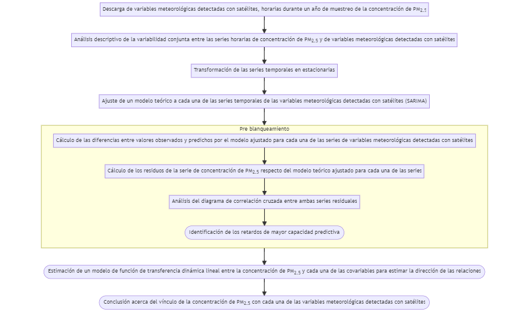
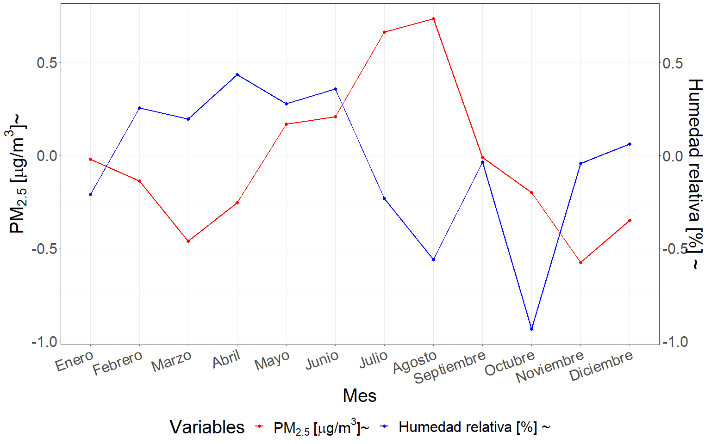
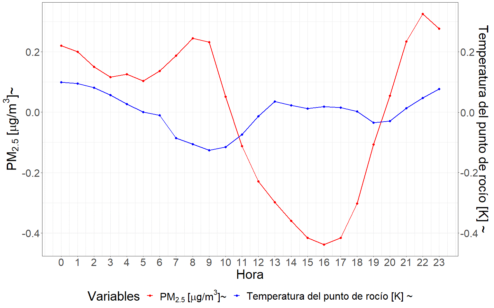
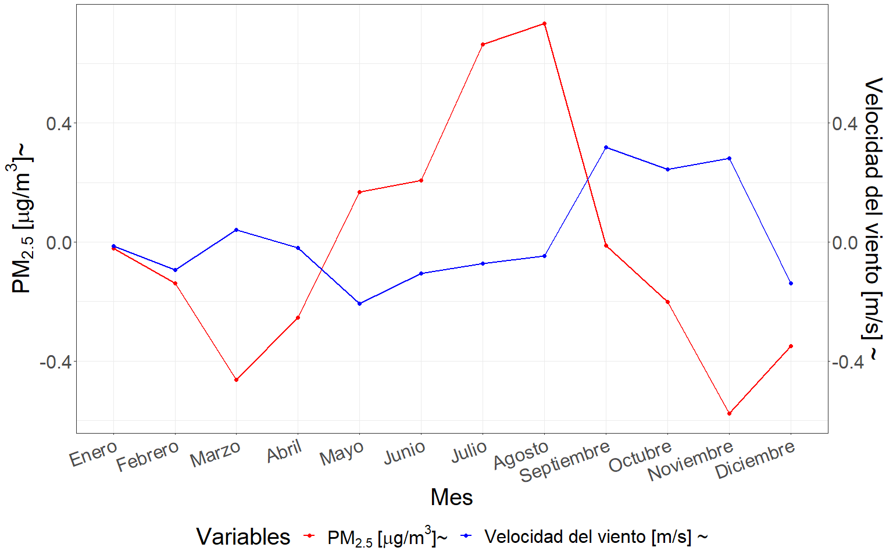
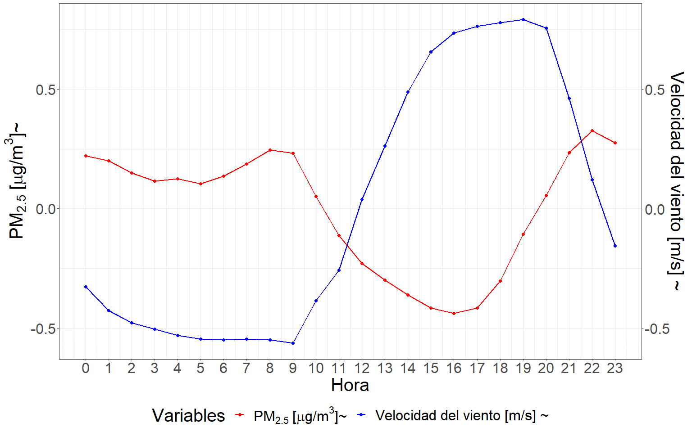
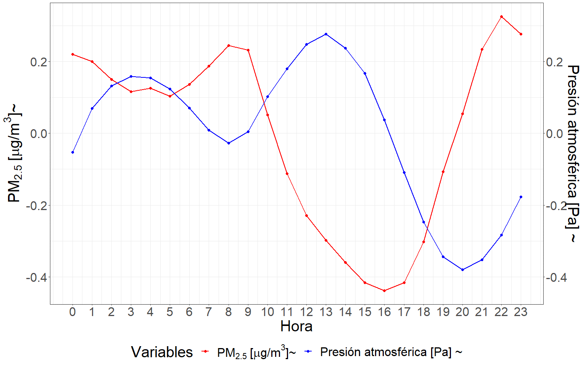
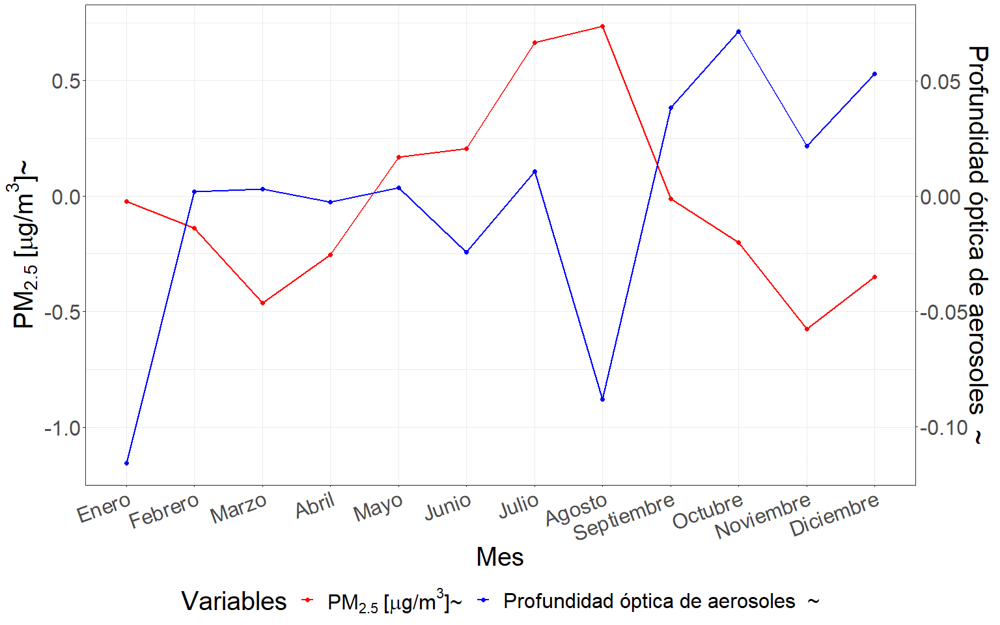
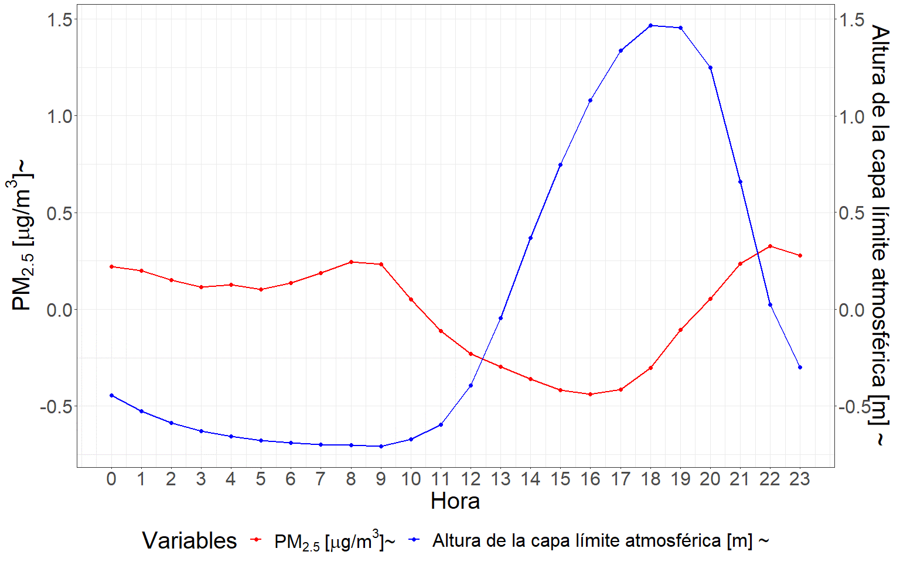
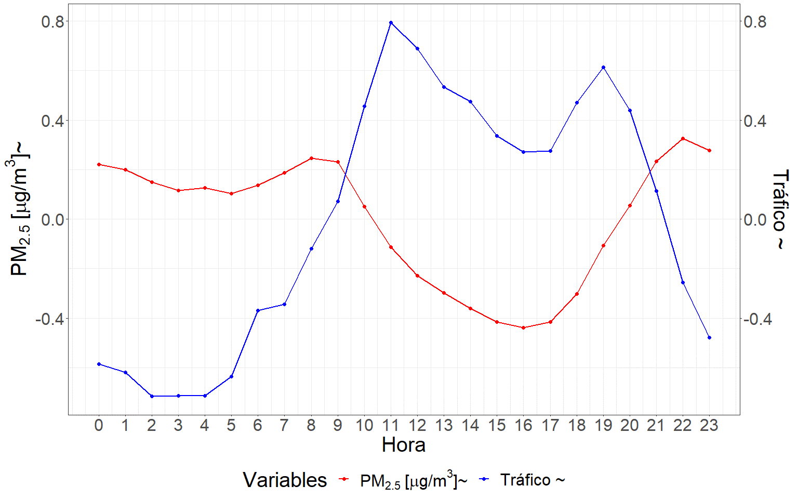
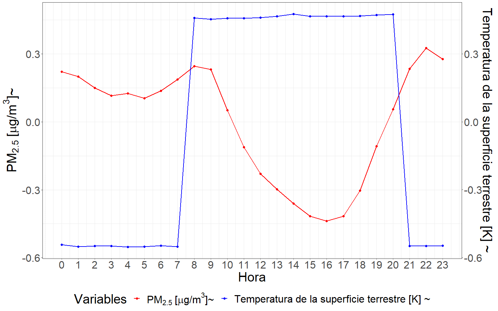

#	Influencia de variables meteorológicas obtenidas de satélites {#cap:var}

## Introducción

  La teledetección o sensado remoto es una técnica que permite adquirir información sobre el sistema terrestre mediante sensores ubicados en aviones o satélites, sin necesidad de contacto físico directo con los objetos de estudio [@chuvieco2010plan]. Estos sensores capturan y registran la radiación electromagnética reflejada o emitida por la superficie terrestre. Su aplicabilidad se extiende al estudio de aspectos clave como el clima, la meteorología, la interacción Tierra-atmósfera y la dinámica de la superficie terrestre. A partir de la información recopilada, se obtienen estimaciones horarias de diversas variables climáticas, atmosféricas, terrestres y oceánicas, que abarcan la totalidad de la superficie, con una elevada resolución tanto espacial como temporal. Estas estimaciones se generan por medio de la técnica de reanálisis, la cual combina datos de modelos teóricos, con observaciones *in situ* y leyes físicas. Esta metodología, denominada asimilación de datos, es ampliamente utilizada por los centros de predicción meteorológica numérica. Cada un lapso de tiempo determinado se combina una previsión anterior con nuevas observaciones disponibles para producir una nueva estimación del estado de la atmósfera [@bell2021era5; @hersbach2020era5; @wu2020regional]. La información generada a partir de la teledetección la convierte en una herramienta fundamental a la hora de predecir escenarios climáticos futuros [@huot2022next; @rocchini2015potential; @watmough2019socioecologically; @asaly2022using; @paul2020mapping].
  
  La fluctuación de las condiciones meteorológicas que determinan el estado de la atmósfera en un momento determinado generan una notable influencia en la variación de la concentración de PM [@tiwari2017assessment; @he2017influences]. Numerosos estudios han demostrado asociaciones de vínculo inverso entre el PM con la velocidad del viento [@cichowicz2020effect; @usman2022exploring; @xiaoyang2019particulate], las precipitaciones [@usman2022exploring; @xiaoyang2019particulate], la temperatura [@nogarotto2020review; @xiaoyang2019particulate], el punto de rocío [@zhao2022analysis], precipitación [@hu2021importance;@kleine2017modeling] y la altura de la capa límite atmosférica (PBLH) [@li2020correlation; @wang2019relationship]. Por otra parte, existen variables que responden a una relación directa positiva con los niveles de PM, tales como la profundidad óptica de aerosoles (AOD) [@soni2018particulate; @gupta2021spatio], el tráfico de vehículos [@pant2013estimation; @weerakkody2018quantification], entre otras múltiples fuentes de emisión. Tanto para la presión atmosférica, como para la humedad relativa y la radiación solar, existen resultados que vinculan estas variables con el PM tanto de forma directa [@li2015particulate; @nogarotto2020review; @yang2016intensification] como inversa [@tian2014characteristics; @chen2016spatial; @liu2015seasonal]. Es pertinente destacar la existencia de estudios cuyas conclusiones reflejan que la concentración de PM depende más de la meteorología que de factores antropogénicos [@hooyberghs2005neural]. Esta relación está sujeta a otras características propias del sitio, como por ejemplo las fuentes de emisión, el tamaño de las partículas [@khan2010characterization; @tai2010correlations; @dimitriou2015dependence] y la topografía [@alvarado2010modeling; @vinoj2022role]. Por este motivo, cobra sentido modelar la concentración de PM~2.5~ en función de variables meteorológicas para sitios con características específicas. La disponibilidad de variables meteorológicas provenientes de la teledetección o sensoramiento remoto viabiliza un ajuste de modelos predictivos más adecuado para la concentración de PM~2.5~. Sin embargo, previo a cualquier ajuste de modelo predictivo es necesario contar con una descripción exhaustiva de la estructura de la serie temporal de PM.
  
  Enmarcado dentro del Servicio de Cambio Climático Copernicus (C3S - *Copernicus Climate Change Service*) de la Agencia Espacial Europea (ESA), el Centro Europeo para Previsiones Meteorológicas a Medio Plazo (ECMWF - *European Centre for Medium-Range Weather Forecasts*) genera grandes conjuntos de datos meteorológicos a escala global. Este producto es la quinta generación de Reanálisis Europeo (ERA5 - *European ReAnalysis*), sucesor de *ERA-Interim* [@munoz2021era5], y se caracteriza por combinar modelos meteorológicos y datos observacionales a nivel mundial. Los productos generados ponen a disposición información para todo el globo a escala temporal horaria, diaria y mensual desde el año 1979. Así, cada vez es más factible mapear y modelar las variaciones o cambios espacio-temporales de las condiciones meteorológicas imperantes antes, durante y después de eventos de interés. El avance de la tecnología ha permitido un desarrollo notable en la capacidad computacional disponible, sumado a la disponibilidad de datos meteorológicos masivos en diversas plataformas de Internet, es posible obtener información meteorológica variada para un sitio georreferenciado sobre un territorio de interés. Actualmente, se cuenta con variadas herramientas informáticas para la obtención de productos satelitales almacenados en la nube. Tales productos pueden ser usados como covariables con potencialidad predictiva de la concentración de PM.
  
  La búsqueda de factores que logren explicar la variabilidad de la serie temporal de concentración de PM~2.5~ se realiza tanto para la comprensión de la dinámica de variación del contaminante como para su modelado predictivo. El estudio de la estructura o patrones en la serie temporal del contaminante y su covariabilidad con las series de variables meteorológicas es fundamental para construir modelos predictivos. Estos pueden ser mecanicísticos, *i.e.* modelos que pretenden explicar y relacionar, usualmente basados en el conocimiento existente, la covariabilidad del PM~2.5~ con la de otros factores del medio. Sin embargo, los modelos predictivos también pueden ser de base computacional. En este caso, el análisis de los datos del contaminante se relaciona con la variabilidad de múltiples factores con la intención de predecir su valor aun cuando el impacto de cada uno de los factores o sus combinaciones permanezca oculto o sin justificar desde el conocimiento existente. Los modelos de inteligencia artificial, tanto de aprendizaje automático como profundo, se basan en explotar la covariabilidad entre un gran número de series de variables en una base de datos de entrenamiento con la finalidad de predecir nuevos valores de PM~2.5~ en contextos similares al del aprendizaje. Por lo tanto, para predecir valores futuros de una serie puede implementarse un marco teórico basado en información contenida en la misma y/u otro que se nutra, además de la variabilidad de factores relacionados con la serie. En particular, los métodos de aprendizaje automático permiten obtener predicciones de valores futuros en función del comportamiento de un conjunto grande de potenciales predictoras y de la covariabilidad entre ellas. El presente capítulo [4](#cap:var) y su posterior [5](#cap:pred), se hallan enmarcados dentro de un enfoque de trabajo basado en la inteligencia artificial. Se incluyen métodos clásicos como la regresión lineal múltiple, que demandan un mayor control del investigador sobre las variables predictoras y supuestos sobre las relaciones subyacentes, además de otros como los algoritmos de aprendizaje automático basados en árboles y de aprendizaje profundo basados en redes neuronales, que habilitan el trabajo con múltiples series de datos cuya variabilidad podría tener potencial capacidad predictiva de la variabilidad de PM~2.5~ con un menor nivel de control y de supuestos. Uno de los principales desafíos en el modelado predictivo a través de técnicas de aprendizaje automático es la selección de características o variables predictoras que alimentarán al modelo, dado que mientras mayor sea el número de predictoras también lo será la complejidad del resultado [@li2019influence; @rumao2019exploration; @cai2018feature]. Es factible que las variables relevantes para el desarrollo de un modelo predictivo de elevada exactitud puedan no solo ser las recomendadas en la literatura para la construcción de modelos mecanicistas explicativos de la dinámica observada en la serie del contaminante, ya que el objetivo dentro del enfoque de aprendizaje automático está centrado en potenciar la exactitud de las predicciones y no en la explicación de cada una de las relaciones subyacentes.
  
  En esta tesis la variable respuesta a modelar es la concentración de PM~2.5~ y las variables predictoras derivarán principalmente de mediciones satelitales, en especial meteorológicas, además de las que refieren a la estructura temporal de variabilidad de la serie de tiempo para las características de cada uso del suelo. Para abordar el problema enmarcado en determinar la potencialidad de estas variables para predecir la concentración de PM~2.5~, se creó una base de datos satelitales. Respetando las premisas de creación de un sistema de alerta de bajo costo ante condiciones adversas de calidad del aire, las variables incluidas como predictoras en el modelado predictivo de la concentración de PM~2.5~, son de dominio público y la variable respuesta obtenida por medio de sensores de monitoreo basados en tecnologías de bajo costo.

  Las técnicas de selección de características asociadas a la predicción constituyen una herramienta útil para identificar las variables de mayor relevancia a la hora de desarrollar un modelo predictivo [@khalid2014survey; @venkatesh2019review]. Es importante destacar que, en algunos casos, las variables seleccionadas pueden no tener un respaldo teórico desde el punto de vista de los mecanismos que subyacen la contaminación ambiental. La implementación de técnicas de aprendizaje automático, permite que vinculaciones indirectas entre las variables que alimentan el modelo puedan ser desenmascaradas. Algunas de ellas podrían tener una interpretación teórica, pero esto no necesariamente ocurrirá con todas [@suparwito2021student; @lima2016use].

## Materiales y métodos

### Resumen gráfico del protocolo de analísis de correlaciones entre series

```{r serie, echo=FALSE, out.width="100%", fig.align="center",fig.cap="(ref:serie)"}

```
(ref:serie) Resumen gráfico del protocolo analítico desarrollado en el capítulo 4.

  La Figura \@ref(fig:serie) presenta el protocolo analítico desarrollado en este capítulo con la finalidad de identificar asociaciones entre la serie de concentración de PM~2.5~ y las de variables derivadas a partir de información satelital. En primer lugar, se creó la base de datos empleada durante el presente capítulo, la cual surgió a partir de la combinación de la base de datos de concentración de PM~2.5~ provista por los sensores de monitoreo basados en tecnologías de bajo costo y las variables derivadas a partir de información satelital de acceso público descargadas desde la nube. Posteriormente se hace mención a cada uno de los pasos desarrollados durante el análisis de series temporales ejecutado en el presente capítulo. Es interesante destacar el procedimiento de pre blanqueamiento, el cual permite eliminar el ruido presente en una serie temporal. Para más detalles sobre cada uno de los procedimientos mencionados dirigirse a la sección de protocolo estadístico, más específicamente al apartado análisis de series temporales. Al finalizar el procedimiento se concluyó respecto de las correlaciones desenmascaradas para cada una de las variables derivadas a partir de información satelital analizadas.

### Base de datos

  La base de datos para el desarrollo de esta sección surge de la combinación de los datos recopilados durante el muestreo de PM~2.5~ (ver capítulo [2](#cap:expl) para más detalles) con distintas bases de datos satelitales (Tabla \@ref(tab:satdata)). De esta forma el período a lo largo del cual se descargaron los datos derivados de satélites se corresponde con el muestreo previamente realizado en los distintos sitios de muestreo en la provincia de Córdoba (30/03/2021 - 01/06/2022). Cabe destacar que en el análisis exploratorio realizado en el presente capítulo se utilizaron promedios calculados a lo largo de todos los sitios de muestreo en las distintas escalas temporales consideradas de análisis, tanto para la concentración de PM~2.5~ como para las variables derivadas de información satelital.
  
  Las covariables utilizadas son derivadas de información satelital a distintos niveles, lo que implica una combinación de técnicas y fuentes de datos avanzadas. Algunas de estas variables se obtienen directamente a partir de la interpretación física de la reflectancia capturada por los satélites, la cual es procesada y transformada en datos utilizables, como es el caso de las mediciones del sensor espectrorradiómetro de imágenes de resolución moderada (MODIS) a bordo de los satélites Terra y Aqua de la NASA [@savtchenko2004terra; @lyapustin2019maiac; @lyapustin2018modis; @hulley2014thermal]. Otras variables son generadas a través de modelos que utilizan datos de entrada satelitales, como los producidos por el modelo meteorológico ERA5, que surge del reanálisis realizado por el Centro Europeo de Previsión Meteorológica a Plazo Medio (ECMWF) para el clima global [@hersbach2020era5; @bell2021era5], permitiendo así estimaciones y proyecciones más precisas en base a algoritmos específicos y condiciones iniciales derivadas de observaciones satelitales. Además, se emplean técnicas de asimilación de datos, como las utilizadas en el reanálisis retrospectivo para investigación y aplicaciones de era moderna en su versión 2 (MERRA-2) [@bosilovich2015merra], las cuales integran observaciones satelitales con modelos numéricos para mejorar la exactitud y consistencia de los datos finales. También formó parte de la base considerada el conjunto de radiómetros de imágenes infrarrojas visibles (VIIRS) [@wu2016viirs]. Cabe destacar, que ninguna de las variables utilizadas han sido validadas para los sitios de estudio en la provincia de Córdoba con respecto a datos de campo. 
  
  Para aquellas variables que explícitamente indiquen su fuente de datos entre paréntesis, se ha utilizado información derivada de otros métodos o sistemas distintos al ERA5. La base de datos original contó con un total de 193 variables estas son: hora del día (fecha de toma de dato), día de la semana (fecha de toma de dato), mes del año (fecha de toma de dato), día  del mes (fecha de toma de dato), estación del año (fecha de toma de dato), mes del año codificación seno (fecha de toma de dato), mes del año codificación coseno (fecha de toma de dato), día de la semana codificación seno (fecha de toma de dato), día de la semana codificación coseno (fecha de toma de dato), día del mes codificación seno (fecha de toma de dato), día del mes codificación coseno (fecha de toma de dato), hora del día codificación seno (fecha de toma de dato), hora del día codificación coseno (fecha de toma de dato), estación del año codificación seno (fecha de toma de dato), estación del año codificación coseno (fecha de toma de dato), componente u del viento a 100 m, componente v del viento a 100 m, componente u del viento neutral a 10 m, componente u del viento a 10 m, componente v del viento neutral a 10 m, componente v del viento a 10 m, ráfaga de viento a 10 m desde el posprocesamiento anterior, temperatura del punto de rocío a 2 m, temperatura a 2 m, ángulo de orografía a escala inferior a la cuadrícula, anisotropía de la orografía a escala inferior a la cuadrícula, disipación de la capa límite, altura de la capa límite, cielo despejado, radiación solar directa en la superficie, altura de la base de las nubes, energía potencial convectiva disponible, inhibición convectiva, precipitación convectiva, tasa de lluvia convectiva, radiación ultravioleta descendente en la superficie, tensión superficial de ondas de gravedad hacia el este, tensión superficial turbulenta hacia el este, evaporación, evaporación del suelo desnudo, evaporación desde la parte superior del dosel, evaporación de la transpiración de la vegetación, albedo previsto, logaritmo previsto de la rugosidad de la superficie para el calor, superficie prevista rugosidad, velocidad de fricción, geopotencial, disipación de ondas de gravedad, nubosidad alta, cubierta de vegetación alta, ráfaga de viento instantánea de 10 m, tensión superficial turbulenta instantánea hacia el este, fracción de precipitación superficial instantánea a gran escala, flujo de humedad instantáneo, tensión superficial turbulenta instantánea hacia el norte, superficie sensible instantánea flujo de calor, índice k, precipitación a gran escala, fracción de precipitación a gran escala, tasa de lluvia a gran escala, índice de área foliar vegetación alta, índice de área foliar vegetación baja, cobertura de nubes baja, cobertura de vegetación baja, temperatura máxima de 2 m desde el procesamiento posterior anterior, total máximo tasa de precipitación desde el procesamiento posterior anterior, disipación media de la capa límite, tasa media de precipitación convectiva, tensión superficial turbulenta media hacia el este, tasa media de evaporación, disipación media de ondas de gravedad, fracción de precipitación media a gran escala, tasa media de precipitaciones a gran escala, tensión superficial media de ondas de gravedad hacia el norte, tensión superficial turbulenta media hacia el norte, tasa de evaporación potencial media, tasa de escorrentía media, presión media a nivel del mar, tasa de escorrentía subsuperficial media, flujo de radiación de onda corta directa en superficie media, flujo de radiación de onda larga hacia abajo en superficie media, flujo de radiación de onda corta en superficie media hacia abajo, flujo de radiación ultravioleta descendente medio en la superficie, flujo de calor latente superficial medio, flujo de radiación de onda larga neta superficial media, tasa de escorrentía superficial media, flujo de calor sensible superficial medio, flujo de radiación de onda corta descendente media superior, flujo de radiación de onda larga neta superior media, media flujo de radiación de onda corta neto superior, tasa de precipitación total media, gradiente vertical medio de refractividad dentro de la capa de captura, divergencia de humedad integrada verticalmente media, cobertura de nubes media, temperatura mínima de 2 m desde el posprocesamiento anterior, tasa de precipitación total mínima desde el posprocesamiento anterior, gradiente vertical mínimo de refractividad dentro de la capa de captura, albedo de infrarrojo cercano para radiación difusa, albedo de infrarrojo cercano para radiación directa, tensión superficial de ondas de gravedad hacia el norte, tensión superficial turbulenta hacia el norte, evaporación potencial, tipo de precipitación, escorrentía, pendiente de la orografía a escala subcuadrícula, tipo de suelo, desviación estándar de orografía de subred filtrada, desviación estándar de la orografía, escorrentía subsuperficial, flujo de calor latente superficial, radiación solar neta superficial, radiación térmica neta superficial, presión superficial, escorrentía superficial, flujo de calor sensible superficial, radiación solar superficial hacia abajo, radiación térmica superficial hacia abajo, toa radiación solar incidente, radiación solar neta superior, radiación térmica neta superior, nubosidad total, columna total de agua helada de la nube, columna total de agua líquida de la nube, columna total de ozono, columna total de agua de lluvia, columna total de agua, columna total de vapor de agua, evaporación total, precipitación total, cielo total, radiación solar directa en la superficie, índice de totales totales, altura base de la capa de captura, altura superior de la capa de captura, tipo de vegetación alta, tipo de vegetación baja, componente u deriva de Stokes, albedo uv visible para radiación difusa, uv visible albedo para radiación directa, componente v deriva de Stokes, integral vertical de divergencia del flujo de agua congelada en la nube, integral vertical de divergencia del flujo de agua líquida en la nube, integral vertical de divergencia del flujo geopotencial, integral vertical de divergencia del flujo de energía cinética, integral vertical de divergencia de flujo de masa, integral vertical de divergencia de flujo de humedad, integral vertical de divergencia de flujo de ozono, integral vertical de divergencia de flujo de energía térmica, integral vertical de divergencia de flujo de energía total, integral vertical de nube hacia el este flujo de agua congelada, integral vertical del flujo de agua líquida en la nube hacia el este, integral vertical del flujo geopotencial hacia el este, integral vertical del flujo de calor hacia el este, integral vertical del flujo de energía cinética hacia el este, integral vertical del flujo de masa hacia el este, integral vertical del flujo de ozono hacia el este, integral vertical del flujo de energía total hacia el este, integral vertical del flujo de vapor de agua hacia el este, integral vertical de conversión de energía, integral vertical de la energía cinética, integral vertical de la masa de la atmósfera, integral vertical de la tendencia de la masa, integral vertical del flujo de agua congelada de las nubes hacia el norte, integral vertical del flujo de agua líquida de las nubes hacia el norte, integral vertical del flujo geopotencial hacia el norte, integral vertical del calor hacia el norte integral vertical del flujo de energía cinética hacia el norte, integral vertical del flujo de masa hacia el norte, integral vertical del flujo de ozono hacia el norte, integral vertical del flujo de energía total hacia el norte, integral vertical del flujo de vapor de agua hacia el norte, integral vertical de energía potencial e interna, integral vertical de temperatura, integral vertical de energía térmica, integral vertical de energía total, divergencia de humedad integrada verticalmente, nivel de cero grados, viento a 100 m, viento a 10 m, viento neutro a 10 m, humedad relativa a 2 m, profundidad óptica de aerosoles (MERRA), incremento de la profundidad óptica de aerosoles (MERRA), incremento de la profundidad óptica de aerosoles (MAIAC), profundidad óptica de aerosoles (MAIAC), altura de la capa límite atmosférica, máscara de fuego VNP14A1 001, temperatura de la superficie terrestre (MODIS) y tráfico de vehículos (GOOGLE).
  
  <!-- Si bien todas la variables involucradas se encuentran descriptas en el Anexo 3, se listan aquí las de mayor importancia según la bibliografía, para describir la variación de la concentración de PM~2.5~: -->

  <!-- Temperatura del aire a 2 metros por encima de la superficie de la Tierra (ERA5): calculada utilizando el modelo meteorológico ERA5 del ECMWF, se obtiene interpolando el nivel más bajo proporcionado por el modelo y el valor de temperatura en la superficie terrestre, teniendo en cuenta las condiciones atmosféricas. ERA5 es un conjunto de datos de reanálisis atmosférico que ofrece información climática de alta resolución, con una resolución espacial de aproximadamente 31 km y una resolución temporal horaria. Este parámetro se expresa en kelvin ($K$).  -->

  <!-- Humedad relativa a 2 metros por encima de la superficie terrestre (ERA5): establece la relación entre la presión parcial del vapor de agua y la presión de vapor de equilibrio del agua a la temperatura dada a esa altura. Esta variable es calculada a partir de la combinación de los datos de temperatura y presión estimados por el satélite y se expresa en porcentaje (*%*). -->

  <!-- Temperatura del punto de rocío (ERA5): es la temperatura a la que tendría que enfriarse el aire a 2 metros por encima de la superficie terrestre para que se produzca la saturación, es decir, para que el vapor de agua se condense en rocío o escarcha. Esta temperatura se calcula utilizando calculada utilizando el modelo meteorológico ERA5 del ECMWF, interpolando el nivel más bajo obtenido por el modelo y la medición obtenida para la superficie terrestre, teniendo en cuenta las condiciones atmosféricas. Este parámetro se expresa en kelvin ($K$).  -->

  <!-- Precipitación convectiva (ERA5): es la precipitación acumulada que cae sobre la superficie terrestre, obtenida a partir del esquema de convección en el Sistema Integrado de Previsión del ECMWF (IFS). Surge a partir de la combinación de información acerca de la formación y disipación de las nubes y la precipitación, derivada a partir de cambios en características atmosféricas, como presión, temperatura y humedad. Esta precipitación tiene en cuenta tanto la lluvia, como la nieve, entre otros estadíos intermedios de precipitación, que son acumulados horariamente. Este parámetro se expresa en metro de agua equivalente sobre la superficie terrestre, que representa la profundidad que tendría el agua si se repartiese uniformemente en la superficie de la cuadrícula de resolución en cada hora del día. -->

  <!-- Velocidad del viento en su componente “neutra” a una altura de 10 metros sobre la superficie terrestre (ERA5): esta neutralidad se calcula a partir de la tensión superficial y de la rugosidad de la superficie terrestre, considerando una estratificación neutra de la atmósfera derivada a partir del gradiente de temperaturas. Esta componente es de menor velocidad que el viento real bajo condiciones estables, y de mayor velocidad bajo condiciones inestables. Las unidades en las que se expresa este parámetro son metros por segundo ($\frac{m}{s}$).  -->

  <!-- Presión atmosférica (ERA5): fuerza por unidad de superficie que ejerce la atmósfera sobre la superficie terrestre. Esta es una medida del peso del aire en una columna situada verticalmente sobre un punto de la superficie terrestre. Las unidades en que se mide este parámetro son Pascales ($Pa$). -->

  <!-- Altura de la capa límite atmosférica (PBLH) (ERA5): refleja la altura del estrato de aire por encima de la superficie terrestre que se ve afectado por la resistencia a la transferencia de momento, calor o humedad, que genera la superficie terrestre. En otras palabras, es la altura del estrato de aire sujeto a la influencia de la superficie terrestre. Esta puede ser tan baja como unas pocas decenas de metros, como sucede con el aire de refrigeración por la noche, o tan alta como varios kilómetros como ocurre sobre el desierto en medio de un día caluroso y soleado. Cuando es baja, pueden desarrollarse mayores concentraciones de contaminantes (emitidos en superficie). Su cálculo se basa en el número de Richardson y la unidad en la que se expresa este parámetro son los metros ($m$).  -->

  <!-- Radiación solar directa sin nubosidad sobre la superficie terrestre (ERA5): es la cantidad de radiación directa del sol (onda corta) que llega a la superficie terrestre, suponiendo condiciones de cielo despejado (sin nubes). Esta radiación solar puede ser dispersada en distintas direcciones por partículas presentes en la atmósfera, la parte que llega a superficie se denomina radiación solar difusa. Mientras que, la parte de la radiación solar que llega a la superficie sin ser dispersada se denomina radiación solar directa. Las cantidades de radiación a cielo despejado se calculan para las mismas condiciones atmosféricas de temperatura, humedad, ozono, gases traza y aerosoles, sin considerar la nubosidad. Las unidades en las que se expresa este parámetro son julios por metro cuadrado ($\frac{J}{m^2}$). -->

  <!-- Profundidad óptica de aerosoles (AOD) (MODIS y MERRA-2): es un parámetro adimensional que mide la extinción de la luz debida a su dispersión y absorción por la presencia de partículas distribuidas en la columna de aire desde la superficie terrestre a la parte superior de la atmósfera. Esta variable se obtuvo a partir de dos fuentes, en primer lugar, del algoritmo MAIAC que ha sido recientemente desarrollado para los datos obtenidos con el sensor MODIS [@lyapustin2019maiac; @lyapustin2018modis]; y en segundo lugar, del MERRA-2 [@bosilovich2015merra]. -->

  <!-- Temperatura de la superficie terrestre (LST): se obtuvo a partir del producto MODIS LST y emisividad, (MOD21), disponible en la colección 6, el cual utiliza un algoritmo basado en la física para recuperar dinámicamente tanto esta temperatura como la emisividad simultánea para las tres bandas infrarrojas térmicas MODIS (29, 31 y 32) con una resolución espacial de 1 km en el nadir [@savtchenko2004terra; @hulley2014thermal]. Las unidades en las que se expresa este parámetro son kelvin ($K$). -->

  <!-- El tráfico de automóviles: es un parámetro adimensional obtenido a partir de los datos que se encuentran publicados en *Google Maps*; En esa plataforma puede visualizarse el tráfico promedio usual para las distintas horas en los distintos días de la semana [@wu2007google].  -->
  
  El mayor volumen de variables lo comprenden las generadas por el modelo meteorológico ERA5, que surge del reanálisis realizado por el Centro Europeo de Previsión Meteorológica a Plazo Medio (ECMWF) para el clima global [@hersbach2020era5; @bell2021era5]. Este método de estimación combina modelos predictivos con observaciones a lo largo de todo el mundo, dando por resultado un conjunto de datos completo a escala global, cuyo principio de funcionamiento se basa en la asimilación de datos. Enmarcado dentro del C3S de la Comisión Europea, el ECMWF genera el reanálisis ERA5 que representa un registro detallado de las condiciones atmosféricas globales, de la superficie terrestre y oceánicas desde 1979 en adelante. ERA5 se basa en el Sistema Integrado de Pronóstico (IFS) Cy41r2, implementado desde 2016, beneficiándose de una década de desarrollos en modelos físicos, dinámica y asimilación de datos. Esta base de datos cuenta con estimaciones horarias para 164 variables atmosféricas, oceánicas y terrestres, con una resolución espacial de 0.25 grados [@hersbach2020era5]. Algunas de las principales variables provenientes de esta fuente de datos que están vinculadas con la concentración de PM2.5 son: previsión total de precipitación, evaporación, cobertura total de nubes, altura de la base de las nubes, rugosidad superficial pronosticada, velocidad de fricción, cobertura de vegetación alta, cobertura de vegetación baja, componente u del viento, componente v del viento, temperatura a 2 m, presión superficial, vapor de agua total en columna, altura de la capa límite, albedo pronosticado e índice de área foliar de vegetación alta [@storey2022prediction, @gundougdu2024data, @jiang2021estimation]. El listado completo de las variables provenientes extraídas de esta herramienta se encuentran mencionadas en el Anexo 1, mientras que una descripción detallada de cada una de ellas se presenta en el Anexo 3 de la presente tesis.

  La profundidad óptica de aerosoles (AOD) se obtuvo a partir mediciones del sensor MODIS (*Moderate Resolution Imaging Spectroradiometer*) [@savtchenko2004terra; @lyapustin2019maiac; @lyapustin2018modis; @hulley2014thermal], el cual se encuentra a bordo de los satélites Terra y Aqua pertenecientes a la Administración Nacional de Aeronáutica y del Espacio (NASA). Lyapustin (2011) desarrolló el algoritmo MAIAC para obtener valores de AOD sobre superficies brillantes y oscuras con una resolución de 1 km a partir de los productos de MODIS [@lyapustin2018modis]. El algoritmo MAIAC permite así obtener características más refinadas de los aerosoles, necesarias para el monitoreo regional y a menores escalas espaciales [@tao2019performance]. La alta resolución espacial mejora la capacidad para determinar las características de los aerosoles finos y distinguir las fuentes de emisión [@mhawish2019comparison;@savtchenko2004terra;@hulley2014thermal]. Este algoritmo permite obtener el valor de AOD sobre la superficie terrestre a partir de la implementación de series temporales, logrando discriminar la contribución de aerosoles de la reflectividad de la superficie terrestre, considerando los efectos de la reflectividad bidireccional [@lyapustin2018modis;@lyapustin2019maiac]. Además, implementa técnicas de análisis de series temporales y procesamiento basado en imágenes para llevar a cabo la recuperación de datos y la corrección en superficies brillantes y en vegetación oscura [@lyapustin2018modis;@lyapustin2011multiangle]; asimismo el algoritmo mejora la capacidad de detección de humo (polvo), nubes y cobertura de nieve [@lyapustin2012discrimination]. 
  
  La temperatura de la superficie terrestre (LST) también se obtuvo a partir de los datos brindados por el instrumento MODIS a bordo de los satélites Terra y Aqua, proporcionando registros con una precisión objetivo de 1 K. Los sensores térmicos basados en satélites son herramientas poderosas para el monitoreo ambiental, como la detección de incendios [@justice2002modis] o actividad volcánica [@wright2002automated]. Además, estos sensores ofrecen evidencia directa de la variabilidad de la superficie, la cual se utiliza para establecer su relación con la variabilidad de los aerosoles [@handschuh2023systematic].
  
  Los datos incluidos a partir MERRA-2 (*Modern Era-Retrospective Reanalysis for Research and Applications Version 2*) utilizan la nueva versión del Sistema de Asimilación de Datos del Sistema de Observación Terrestre de Goddard, Versión 5 (GEOS-5), que es un sistema de vanguardia que combina un modelo de circulación general atmosférica global (GEOS-5 AGCM) con la Interpolación Estadística de Puntos en Rejilla (GSI) del NCEP [@feng2019does, @bosilovich2015merra]. Los datos de altura de la capa límite planetaria (PBLH) se obtuvieron del conjunto de datos de reanálisis MERRA-2 con una resolución espacial de 0.5° × 0.625° (latitud-longitud) [@gelaro2017modern]. Dado que los datos de reanálisis tienen la ventaja de contar con una alta resolución temporal, se pudo generar una base precisa de PBLH para la región en estudio utilizando los datos de MERRA-2 (M2T1NXFLX - Diagnóstico del Flujo de Superficie). MERRA-2 también proporciona productos de reanálisis de aerosoles, provenientes de la asimilación de numerosas observaciones provenientes de satélites y estaciones de monitoreo en superficie. Además, se incorporo el AOD obtenido a parir de MERRA-2, Zhang et al. evaluaron de manera sistemática el rendimiento de AOD de Himawari-8 y dos conjuntos de datos de AOD de reanálisis ofrecidos por MERRA-2 y el Servicio de Monitoreo de la Atmósfera de Copernicus (CAMS) [@zhang2020evaluation]. Sus resultados mostraron que el AOD de Himawari-8 y MERRA-2 presentaron una precisión similar, mostrando variaciones diurnas significativas. Estudios previos han confirmado que el uso del AOD de MERRA-2 combinado con modelos de aprendizaje automático puede estimar las concentraciones de PM~2.5~ con una precisión razonable [@gupta2021machine]. El conjunto de datos se complementó con los datos de MERRA-2 recopilados a través del servicio web de datos de radiación solar (SoDa - *Solar radiation Data*), que ofrece series temporales de temperatura (a 2 m sobre el nivel del suelo), humedad relativa (a 2 m sobre el nivel del suelo), presión (a 2 m sobre el nivel del suelo), velocidad y dirección del viento (a 10 m sobre el nivel del suelo), precipitación, nieve, espesor de nieve e irradiación horizontal global (GHI) con una resolución espacial de 0.5° × 0.5° (aproximadamente 50 km) [@valappil2023evaluation].
  
  El VIIRS es uno de los cinco instrumentos a bordo del satélite Suomi-NPP que opera en una órbita sincrónica con el sol a una altitud de 824 km (inclinación = 98.7°), con un nodo ascendente de tiempo solar local a la 1:30 pm [@wu2016viirs]. Logra una cobertura global diaria y tiene un ciclo de repetición de aproximadamente 16 días. El producto de datos de la Versión 1 de Anomalías Térmicas/Incendios (VNP14A1) proporciona información diaria sobre incendios activos y otras anomalías térmicas. El producto de datos VNP14A1 es un compuesto global en malla de 1 km de píxeles de incendios detectados a partir de las bandas del VIIRS con una resolución espacial de 375 m, lo que proporciona un rendimiento mejorado en comparación con los datos de imagen de 750 m, durante un período diario (24 horas). Los datos VNP14 están diseñados siguiendo la suite de productos de Anomalías Térmicas/Incendios del MODIS, así el producto VNP14A1 proporciona un total de cuatro capas de Conjunto de Datos Científicos (SDS) para la confianza del incendio, la potencia radiativa máxima del incendio (FRP), la evaluación de calidad (QA) y la posición del incendio dentro del escaneo [@wu2016viirs].
  
Table: Fuentes de datos de variables derivadas a partir de información satelital. \label{tab:satdata}

| Fuente | Dependencia | Espacial | Temporal | Variables |
|----------|:--------:|:--------:|:--------:|:--------:|:--------:| 
| ERA5 (ECMWF reanálisis) | ECMWF | 0.25°x0.25° | horaria | 164 |
| MODIS-MAIAC (MCD19A2) | NASA | 0.1°×0.1° | 3 a 5 (hora) | 1 |
| MERRA-2 (M2T1NXFLX) | NASA  | 0.625°×0.5° | horaria | 1 |
| MERRA-2 (M2I3NXGAS) | NASA  | 0.625°×0.5° | 1 (3 horas) | 1 |
| MERRA-2 (SODA) | NASA | 0.625°×0.5° | horaria | 9 |
| VIIRS (VNP14A1) | NASA | 0.1°×0.1° | diaria | 1 |
| MODIS (MOD11A1/MYD11A1) | NASA | 0.1°×0.1° | horaria | 1 |
\begin{flushleft}
\setstretch{1}
\textit{ }
{\footnotesize
Fuente de datos, dependencia, resolución espacial, resolución temporal y número total de variables descargadas. Variables especificas descargadas de cada uno de los productos satelitales: MODIS-MAIAC (MCD19A2) \textit{Optical Depth 047} (\textit{Blue band (0.47 $\mu m$) aerosol optical depth over land}), MERRA-2 (M2T1NXFLX) \textit{PBLH} (\textit{planetary boundary layer height}), MERRA-2 (M2I3NXGAS) \textit{AODANA} y \textit{AODINC} (\textit{Aerosol Optical Depth Analysis} y \textit{Aerosol Optical Depth Analysis Increment}), VIIRS (VNP14A1) \textit{FireMask} (\textit{Confidence of fire}) y MODIS (MOD11A1/MYD11A1) \textit{LST Day 1km} y \textit{LST Night 1km} (\textit{Daytime Land Surface Temperature} y \textit{Nighttime Land Surface Temperature}).}
\end{flushleft}

### Protocolo estadístico
  
#### Análisis de series temporales
  
  En primer lugar, se llevó a cabo un análisis descriptivo de la variabilidad conjunta de series de las variables derivadas de información satelital que ya se conoce están asociadas a la concentración de PM~2.5~ en distintas escalas temporales (horas a lo largo del día y meses a lo largo del año). Posteriormente, se chequeó la estacionalidad de las series a través de las pruebas de Dickey-Fuller Aumentada [@dickey1979distribution] y de Kwiatkowski–Phillips–Schmidt–Shin [@kwiatkowski1992testing]. 
  
  En una serie de tiempo estacionaria la media, varianza y covarianza no varían a lo largo del tiempo; Sin embargo tanto las series de concentración de PM~2.5~ como las de variables derivadas a partir de información satelital presentan tendencias estacionales y heterogeneidades de varianzas a lo largo del tiempo. Por este motivo, las series bajo estudio (PM~2.5~ y variables derivadas a partir de información satelital) debieron ser transformadas para lograr su estacionariedad. 
  
  La estabilización de la varianza se llevó a cabo por medio de la transformación de Box-Cox, la cual sugirió transformaciones logarítmicas y en la escala de la raíz cuadrada [@thompson2016stabilizing; @guerrero2004variance]. Por otra parte, la estabilización de la media dentro de cada día, en todos los casos se realizó por medio de la diferenciación de la serie considerando un paso (*lag*) de 1 hora. La diferenciación es una operación matemática que consiste en generar una nueva serie de tiempo calculando la diferencia entre los valores de la serie original espaciados en un intervalo de tiempo *k* conocido como *lag*. La diferenciación es una técnica utilizada habitualmente para eliminar la tendencia en una serie temporal [@box2015time]. 
  
  Posteriormente, se procedió a ajustar un modelo teórico para cada una de las series temporales de las variables derivadas a partir de información satelital. La estimación de un modelo teórico consiste en ajustar un modelo matemático a los datos observados de una serie temporal con el fin de identificar sus características. Seguidamente, para cada serie de variable satelital se obtuvieron los residuos (diferencia entre valores observados y predichos por el modelo ajustado), además  luego se obtuvieron los residuos de la serie de concentración de PM~2.5~ calculados respecto del modelo teórico ajustado para cada una de las series de variables predictoras. El proceso completo se denomina pre blanqueamiento [@fuenzalida1990prewhitening; @razavi2018prewhitening] y busca reducir la presencia de variación sistemática que no es relevante para la predicción.
  
  Finalmente, se analizó la correlación cruzada entre cada una de las series filtradas de PM~2.5~ y la respectiva variable satelital. El procedimiento ejecutado permite independizarnos de la estructura de autocorrelación presente en las series temporales, cuya interpretación podría conducir a la determinación de relaciones espurias entre las variables [@razavi2018prewhitening]. Una relación se considera espuria o aleatoria cuando las variables aparentan tener una conexión numérica, forzada por el azar o factores externos y no por una verdadera relación de vinculación entre las variables. La correlación cruzada entre series temporales indica la relación lineal entre las series a lo largo del tiempo. Este análisis es comúnmente implementado en los casos en se quiere determinar si una serie de tiempo puede predecir otra. En otras palabras, la correlación cruzada mide la covariabilidad entre dos series y cómo se relacionan cuando están distanciadas en un determinado paso (*lag*) de tiempo. A partir de estos resultados se busca reflejar la potencial correlación de las series de variables derivadas a partir de información satelital con la variable concentración de PM~2.5~ [@probst2012using]. El ajuste de los modelos teóricos con los cuales se filtró la serie de concentración de PM~2.5~ fue realizado a través de modelos de media móvil integrada autorregresiva estacional o conocido por sus siglas en inglés como SARIMA (*Seasonal Autoregressive Integrated Moving Average*) [@box2015time; @del2017evaluation].

  Los modelos SARIMA son una técnica estadística que permiten modelar y predecir series de tiempo con patrones estacionales. Estos se ajustaron luego de estabilizar la media intra-diaria y la varianza de las series temporales. Un modelo SARIMA se escribe como SARIMA (*p*, *d*, *q*) x (*P*, *D*, *Q*)*s*, donde los parámetros *p*,*d* y *q* denotan el orden de los términos autorregresivos (*AR*), de diferenciación y de media móvil (*MA*), respectivamente; Mientras que los órdenes estacionales autorregresivos de medias móviles y de diferenciación vienen dados por los parámetros *P*,*D* y *Q*, respectivamente. El periodo de estacionalidad *s*, en este caso, es de 24 horas dado al periodo cíclico de los datos a lo largo de las horas del día. Para identificar el modelo teórico de mejor ajuste a cada variable, se inspeccionó la función de autocorrelación simple (*FAS*) y la función de autocorrelación parcial (*FAP*), junto con el criterio de información de Akaike (AIC) para cada modelo (metodología de Box-Jenkins, Box et al., 2015).

  Por otra parte, el ajuste de los modelos teóricos se llevó a cabo por medio de la metodología de Box-Jenkins, en donde el modelo teórico se deduce del análisis iterativo gráfico de la *FAS* y *FAP*, y el cálculo del criterio AIC. La *FAS* es una medida de la correlación entre una serie de tiempo y sus retrasos, es decir, la *FAS* de un retraso *k* mide la correlación entre los valores de la serie de tiempo en el tiempo *t* y los valores de la serie de tiempo en el tiempo *t-k*. Por otra parte, la *FAP* mide la correlación directa entre los valores de la serie de tiempo en diferentes momentos, pero eliminando la influencia de los retrasos intermedios. Es decir, la *FAP* de un retraso *k* mide la correlación entre los valores de la serie de tiempo en el tiempo *t* y los valores de la serie de tiempo en el tiempo *t-k*, eliminando la influencia de los valores intermedios entre *t* y *t-k* [@box2015time].

  Una vez obtenidos los modelos teóricos para cada una de las series temporales de las variables derivadas a partir de información satelital, se procedió a filtrar la serie de concentración de PM~2.5~ y se calculó el diagrama de correlación cruzada. Este diagrama permite identificar cuáles *lags* de la variable independiente poseen mayor capacidad predictiva para estimar la variable dependiente. A la hora de analizar el gráfico de correlación cruzada entre las series filtradas, es importante destacar que la variable satelital es la independiente, mientras que la concentración de PM~2.5~ es la variable dependiente. De esta forma, debe prestarse atención a los coeficientes de correlación posicionados en los desfasajes negativos, los cuales indican la capacidad predictiva de la variable independiente desfasada un determinado intervalo de tiempo para predecir la concentración de PM~2.5~ en el tiempo *t*.
  
  Una vez identificados estos retardos, se procedió a ajustar un modelo de función de transferencia dinámica lineal para estimar la dirección de las relaciones entre las series en cuestión [@box1994time; @bisgaard2006quality1]. Los resultados obtenidos fueron corroborados a partir de la estimación de la misma relación funcional en diferencias. Si la relación se mantiene con la misma direccionalidad tanto en la estimación de la función de transferencia dinámica lineal con y sin diferenciación, entonces puede concluirse que esta ocurre en la realidad y que no se debe a efectos espurios [@bisgaard2006quality2]. Los resultados completos del proceso desarrollado pueden encontrarse en el Anexo 2. El símbolo virgulilla (~) colocado posterior al nombre de una variable (serie temporal), indica que esta ha sido previamente normalizada, es decir, centrada y estandarizada (Ecuación 4.1). 

\begin{equation*}
\tilde{x}_i = \frac{x_i - \mu}{\sigma} \tag{4.1}
\end{equation*}
\begin{flushleft}
\setstretch{1}
{\footnotesize
\textbf{Ecuación 4.1:}
Normalización de una variable centrada y estandarizada ($\tilde{x}_i$), donde $x_i$ es el valor original, $\mu$ es la media de la variable, y $\sigma$ es la desviación estándar de la variable.}
\end{flushleft}

## Resultados

  En esta sección se reportan los resultados obtenidos en el análisis descriptivo de la variabilidad conjunta de las variables meteorológicas satelitales más relevantes en relación con la concentración de PM~2.5~.
  
#### Temperatura

```{r tempmes, echo=FALSE, out.width="100%", fig.align="center",fig.cap="(ref:tempmes)"}
knitr::include_graphics("images/imagescap4/tempmes.png")
```
(ref:tempmes) Perfil de variación conjunto de los promedios mensuales del PM~2.5~ y la temperatura a lo largo del año (2022-2023), los promedios calculados consideran todos los sitios de muestreo ubicados en la provincia de Córdoba, Argentina.
  
  En la Figura \@ref(fig:tempmes) se presenta la relación existente entre la temperatura y la concentración de PM~2.5~ a lo largo del año. Puede observarse que durante los meses en que las temperaturas promedio son más bajas, la concentración promedio de PM~2.5~ aumenta, mientras que durante los meses en que la temperatura se eleva por encima de su media, las concentraciones disminuyen.

```{r temphor, echo=FALSE, out.width="100%", fig.align="center",fig.cap="(ref:temphor)"}
knitr::include_graphics("images/imagescap4/temphor.png")
```
(ref:temphor) Perfil de variación conjunto de los promedios horarios del PM~2.5~ y la temperatura a lo largo de un día promedio en la provincia de Córdoba, Argentina.

  La Figura \@ref(fig:temphor) muestra la variación cíclica que describe la temperatura promedio a lo largo de las horas del día, caracterizada por dos puntos de inflexión para la curva de la temperatura: uno en la mañana a las 10 horas y otro en la tarde a las 19 horas. Durante las horas de la mañana, la temperatura desciende continuamente hasta llegar a su mínimo a las 10 horas, mientras que en las horas de la tarde, la temperatura aumenta constantemente hasta alcanzar su máximo a las 19 horas.

  Los resultados indican que temperaturas bajas favorecen mayores concentraciones de PM~2.5~, mientras que temperaturas altas se asocian con una reducción en la concentración sugiriendo una relación inversa entre la temperatura y la concentración de PM~2.5~ promedio en las escalas de variación temporal tanto mensual 
Table: Coeficientes de correlación  estimados a partir de la relación funcional para la covariable analizada en sus promedios horarios a lo largo de todos los sitios de muestreo localizados en la provincia de Córdoba, Argentina, considerando todo el periodo de muestreo analizado que abarca desde el 30/03/2021 hasta el 01/06/2022.\label{tab:coeftemp}

| Desfasaje | Con diferenciación | Sin diferenciación |
|----------|:-------:|:-------:|
| t | -0.1573001 | -1.04115 | 
| t-1 | 0.2441853 | 1.44786 |
| t-12 | -0.0197213 | -0.06497 |
| t-24 | -0.2628158 | -0.68048 |

  Las correlaciones significativas que perduran luego del procedimiento de filtrado de las series se observaron en los tiempos t, t-1, t-12 y t-24, que representan al tiempo a 0, 1, 12 y 24 horas, indicando que son los desfasajes temporales de mayor capacidad predictiva para predecir la concentración de PM~2.5~ en el presente a partir de la información pasada de temperatura. 
  
  Luego de la estimación de la relación funcional se determinó que tres de los cuatro coeficientes significativos demostraron una relación inversa estadísticamente significativa entre temperatura (t, t-12 y t-24) y la concentración de PM~2.5~. Sin embargo, para el *lag* t-1 se detectó una relación directa positiva (Tabla \@ref(tab:coeftemp)). 

#### Humedad relativa

```{r hummes, echo=FALSE, out.width="100%", fig.align="center",fig.cap="(ref:hummes)"}

```
(ref:hummes) Perfil de variación conjunto de los promedios mensuales del PM~2.5~ y la humedad relativa a lo largo del año (2022-2023), los promedios calculados consideran todos los sitios de muestreo ubicados en la provincia de Córdoba, Argentina.
  
  En la Figura \@ref(fig:hummes) puede visualizarse la relación que describen los promedios mensuales de la humedad relativa y la concentración de PM~2.5~ a lo largo del año. Esta escala temporal permite apreciar que los meses en que la humedad relativa toma valores por debajo de su media, la concentración de PM~2.5~ promedio es alta, mientras que para los meses en que la humedad relativa es alta la concentración de PM~2.5~ es baja, con respecto a su media. Sin embargo, esta relación no se mantiene constante a lo largo del año, como puede observarse por ejemplo en el mes de octubre donde la relación se modifica mostrando una relación de proporcionalidad directa. 

```{r humhor, echo=FALSE, out.width="100%", fig.align="center",fig.cap="(ref:humhor)"}
knitr::include_graphics("images/imagescap4/humhor.png")
```
(ref:humhor) Perfil de variación conjunto de los promedios horarios del PM~2.5~ y la humedad relativa a lo largo de un día promedio, en la provincia de Córdoba, Argentina.
  
  La Figura \@ref(fig:humhor) exhibe la variación promedio de la humedad relativa a lo largo del día. Este patrón cíclico presenta dos puntos de inflexión para la curva de la humedad relativa, uno a las 10 horas y otro a las 19 horas, lo que sugiere la existencia de dos momentos antagónicos durante el día. Entre las 10 y las 19 horas, la humedad relativa disminuye, mientras que en el resto del día aumenta constantemente para el período de muestreo analizado (30/03/2021-01/06/2022). Puede inferirse que una disminución de la humedad relativa con respecto a su media favorece un incremento de la concentración de PM~2.5~, mientras que un aumento favorece su disminución.
  
Table: Coeficientes de correlación  estimados a partir de la relación funcional para la covariable analizada en sus promedios horarios a lo largo de todos los sitios de muestreo localizados en la provincia de Córdoba, Argentina, considerando todo el periodo de muestreo analizado que abarca desde el 30/03/2021 hasta el 01/06/2022.\label{tab:coefhum}

| Desfasaje | Con diferenciación | Sin diferenciación |
|----------|:-------:|:-------:| 
| t-5 | -0.2681536 | -0.2548 | 
| t-24 | 0.1367988 | 0.1309 |
  
  Los desfasajes temporales de mayor capacidad predictiva para predecir la concentración de PM~2.5~ en el presente a partir de la información pasada de humedad relativa, fueron los tiempos t-5 y t-24, que perduraron luego del procedimiento de filtrado de las series. Luego de la estimación de la relación funcional se determinó que cada uno de los coeficientes significativos demostró una relación opuesta de vinculación. El *lag* temporal de 5 horas resultó en una relación inversa estadísticamente significativa, mientras que el *lag* de 24 horas se asoció de manera directa y estadísticamente significativa, entre la humedad relativa y la concentración de PM~2.5~.

#### Temperatura del punto de rocío

```{r rocmes, echo=FALSE, out.width="100%", fig.align="center",fig.cap="(ref:rocmes)"}
knitr::include_graphics("images/imagescap4/rocmes.png")
```
(ref:rocmes) Perfil de variación conjunto de los promedios mensuales del PM~2.5~ y la temperatura del punto de rocío a lo largo del año (2022-2023), los promedios calculados consideran todos los sitios de muestreo ubicados en la provincia de Córdoba, Argentina.
  
  Los meses en los que la temperatura del punto de rocío está por debajo de su media, la concentración de PM~2.5~ promedio es alta, mientras que en los meses en los que la temperatura del punto de rocío es alta, la concentración de PM~2.5~ también lo es (Figura \@ref(fig:rocmes)). 

```{r rochor, echo=FALSE, out.width="100%", fig.align="center",fig.cap="(ref:rochor)"}

```
(ref:rochor) Perfil de variación conjunto de los promedios horarios del PM~2.5~ y la temperatura del punto de rocío a lo largo de un día promedio en la provincia de Córdoba, Argentina.

  La Figura \@ref(fig:rochor) muestra el ciclo de variación que describe la temperatura del punto de rocío promedio a lo largo de las horas del día. A medida que transcurren las horas, la temperatura del punto de rocío experimenta un ciclo de variación inverso al patrón de concentración media de PM~2.5~. En otras palabras, cuando la temperatura del punto de rocío aumenta en sus promedio calculados para las distintas horas del día, se observan menores concentraciones del contaminante, como sucede entre las 10 y 20 horas, el periodo del día en que las concentraciones son más bajas. En contraposición, el pico de concentraciones entre las 6 y 10 horas se produce al mismo tiempo en que se registra un descenso en la temperatura del punto de rocío. A partir de esta información puede interpretarse que la relación que mejor describe el vínculo entre las variables en cuestión es una relación inversa.

Table: Coeficientes de correlación  estimados a partir de la relación funcional para la covariable analizada en sus promedios horarios a lo largo de todos los sitios de muestreo localizados en la provincia de Córdoba, Argentina, considerando todo el periodo de muestreo analizado que abarca desde el 30/03/2021 hasta el 01/06/2022.\label{tab:coefroc}

| Desfasaje | Con diferenciación | Sin diferenciación |
|----------|:-------:|:-------:| 
| t-11 | -0.1597575 | -0.2921 | 
| t-14 | -0.3212396 | -0.3222  |
| t-20 | 0.3752728 | -0.3377 |

  Los desfasajes temporales de mayor capacidad predictiva para predecir la concentración de PM~2.5~ en el presente a partir de la información pasada de temperatura del punto de rocío fueron los tiempos t-11, t-14 y t-20. Luego de la estimación de la relación funcional se determinó que dos de los tres coeficientes significativos demostraron una relación inversa estadísticamente significativa entre la temperatura del punto de roció (t-11 y t-14) y la concentración de PM~2.5~. Sin embargo, para el *lag* t-20 se detectó una relación espuria o aleatoria, invirtiendo su signo en ambas estimaciones de la relación funcional.

#### Precipitación
  
  Es importante destacar que el análisis exploratorio de la precipitación en la escala temporal horaria no es representativo dada la frecuencia de ocurrencia de este fenómeno a lo largo del año, resultando en un gran porcentaje de datos nulos que pueden interferir con las interpretaciones. Por lo tanto, se decidió no incluir el análisis exploratorio en esta escala temporal para evitar posibles conclusiones erróneas. Sin embargo, para analizar la correlación entre ambas series temporales, se obtuvieron resultados significativos de correlación para los días en que este fenómeno ocurría. 

```{r rainmes, echo=FALSE, out.width="100%", fig.align="center",fig.cap="(ref:rainmes)"}
knitr::include_graphics("images/imagescap4/rainmes.png")
```
(ref:rainmes) Perfil de variación conjunto de los promedios mensuales del PM~2.5~ y la precipitación a lo largo del año (2022-2023), los promedios calculados consideran todos los sitios de muestreo ubicados en la provincia de Córdoba, Argentina.
  
  Durante la primavera y el verano, las precipitaciones aumentan notablemente en comparación con el otoño e invierno (Figura \@ref(fig:rainmes)). Además, los mayores valores de precipitación se registraron en los meses de noviembre y febrero, mientras que los meses de mayo a octubre presentaron las menores precipitaciones en todo el periodo de muestreo analizado que abarca desde el 30/03/2021 hasta el 01/06/2022..

Table: Coeficientes de correlación  estimados a partir de la relación funcional para la covariable analizada en sus promedios horarios a lo largo de todos los sitios de muestreo localizados en la provincia de Córdoba, Argentina, considerando todo el periodo de muestreo analizado que abarca desde el 30/03/2021 hasta el 01/06/2022.\label{tab:coefrain}

| Desfasaje | Con diferenciación | Sin diferenciación |
|----------|:-------:|:-------:| 
| t-1 | -6.162e+01 | -3466.73 | 

  La única correlación significativa que perdura luego del procedimiento de filtrado de las series se observa en el tiempo t-1. Este coeficiente demostró una relación inversa estadísticamente significativa entre la precipitación y la concentración de PM~2.5~. 

#### Velocidad del viento

```{r vvientmes, echo=FALSE, out.width="100%", fig.align="center",fig.cap="(ref:vvientmes)"}

```
(ref:vvientmes) Perfil de variación conjunto de los promedios mensuales del PM~2.5~ y la velocidad del viento a lo largo del año (2022-2023), los promedios calculados consideran todos los sitios de muestreo ubicados en la provincia de Córdoba, Argentina.
  
  La Figura \@ref(fig:vvientmes) presenta el patrón de variación de los promedios mensuales de la velocidad del viento a lo largo del año con respecto a la concentración media de PM~2.5~. Los mayores valores de velocidad del viento ocurren durante parte del invierno y la primavera, alcanzando sus máximos registros en los meses de septiembre y octubre. Por otra parte, los valores de los registros disminuyen durante el verano y el otoño, describiendo el mínimo durante el mes de febrero.

```{r vvienthor, echo=FALSE, out.width="100%", fig.align="center",fig.cap="(ref:vvienthor)"}

```
(ref:vvienthor) Perfil de variación conjunto de los promedios horarios del PM~2.5~ y la velocidad del viento a lo largo de un día promedio en la provincia de Córdoba, Argentina.
  
  La Figura \@ref(fig:vvienthor) muestra el ciclo de variación que describe la velocidad del viento promedio a lo largo de las horas del día. Se observa un incremento entre las 10 y 20 horas, y las máximas magnitudes promedio entre las 15 y 20 horas, mientras que el resto del día la intensidad del viento es baja, mostrando su mínimo a las 9 horas. La variación conjunta con respecto a la concentración promedio horaria de PM~2.5~ permite establecer que cuando la velocidad decrece, la concentración de PM~2.5~ aumenta, por lo que puede deducirse una relación inversa entre ambas variables.

Table: Coeficientes de correlación  estimados a partir de la relación funcional para la covariable analizada en sus promedios horarios a lo largo de todos los sitios de muestreo localizados en la provincia de Córdoba, Argentina, considerando todo el periodo de muestreo analizado que abarca desde el 30/03/2021 hasta el 01/06/2022.\label{tab:coefvient}

| Desfasaje | Con diferenciación | Sin diferenciación |
|----------|:-------:|:-------:| 
| t-5 | 0.1016645 | -0.1288 | 
| t-7 | 0.1317611 | -0.03429  |
| t-8 | 0.1445327 | -0.006416 |
| t-24 | -0.1998146 | -0.3433 |

  Las correlaciones significativas que perduran luego del procedimiento de filtrado de las series se observaron en los tiempos t-5, t-7, t-8 y t-24, tres de estos cuatro coeficientes significativos demostraron estar influenciados por una relación aleatoria (t-5, t-7 y t-8). Mientras que, el coeficiente con un *lag* de t-24 horas, resultó en una relación inversa estadísticamente significativa entre velocidad del viento y la concentración de PM~2.5~.
 
#### Presión atmosférica

```{r presmes, echo=FALSE, out.width="100%", fig.align="center",fig.cap="(ref:presmes)"}
knitr::include_graphics("images/imagescap4/presmes_b.png")
```
(ref:presmes) Perfil de variación conjunto de los promedios mensuales del PM~2.5~ y la presión a lo largo del año (2022-2023), los promedios calculados consideran todos los sitios de muestreo ubicados en la provincia de Córdoba, Argentina.
  
  En la Figura \@ref(fig:presmes) se observa la variación conjunta de los promedios mensuales de la presión atmosférica con respecto a la concentración promedio de PM~2.5~ a lo largo del año. Esta variable alcanza sus valores máximos durante el otoño y el invierno, en los meses de junio y julio, mientras que en la primavera y el verano, la magnitud de esta variable decrece. Por otra parte, la concentración promedio de PM~2.5~ se relaciona de manera inversa con la presión atmosférica, alcanzando sus valores máximos durante los meses de primavera y verano y disminuyendo durante el otoño e invierno. Esto indica una relación directa entre ambas variables. 

```{r preshor, echo=FALSE, out.width="100%", fig.align="center",fig.cap="(ref:preshor)"}

```
(ref:preshor) Perfil de variación conjunto de los promedios horarios del PM~2.5~ y la presión a lo largo de un día promedio en la provincia de Córdoba, Argentina.
 
  En la Figura \@ref(fig:preshor), se presenta el patrón de variación promedio de la presión atmosférica a lo largo de las horas del día. Puede notarse que la presión alcanza sus valores mínimos en dos momentos del día: entre las 7 y 9 horas y entre las 19 y 21 horas. De la misma forma, alcanza sus valores máximos en dos momentos del día: entre las 2 y 4 horas y entre las 12 y 14 horas. Al analizar la variación horaria conjunta entre ambas variables, puede apreciarse una relación inversa. En otras palabras, los picos de presión generan una notable reducción en la concentración de PM~2.5~, mientras que reducciones de presión generan picos en la concentración del contaminante.

Table: Coeficientes de correlación  estimados a partir de la relación funcional para la covariable analizada en sus promedios horarios a lo largo de todos los sitios de muestreo localizados en la provincia de Córdoba, Argentina, considerando todo el periodo de muestreo analizado que abarca desde el 30/03/2021 hasta el 01/06/2022.\label{tab:coefpresmar}

| Desfasaje | Con diferenciación | Sin diferenciación |
|----------|:-------:|:-------:| 
| t | -0.003024 | -3.434e-03 | 
| t-9 | 0.002529 | -7.623e-04 | 
| t-19 | 0.008081 | 6.478e-03 | 

  Las correlaciones significativas que perduran luego del procedimiento de filtrado de las series se observaron en los tiempos t, t-9 y t-19, uno de los tres coeficientes significativos demostró una relación del tipo aleatoria (t-9), mientras que los dos restantes exhibieron una relación estadísticamente significativa, tanto inversa en el presente (t) como directa teniendo en cuenta un *lag* de t-19, entre la presión atmosférica y la concentración de PM~2.5~.

#### Radiación solar

```{r radmes, echo=FALSE, out.width="100%", fig.align="center",fig.cap="(ref:radmes)"}
knitr::include_graphics("images/imagescap4/radmes.png")
```
(ref:radmes) Perfil de variación conjunto de los promedios mensuales del PM~2.5~ y la radiación de corta longitud de onda a lo largo del año (2022-2023), los promedios calculados consideran todos los sitios de muestreo ubicados en la provincia de Córdoba, Argentina.

  La Figura \@ref(fig:radmes) muestra el patrón de variación de la radiación solar promedio a lo largo de los meses del año. Puede observarse que esta disminuye durante el otoño e invierno, alcanzando sus mayores valores durante la primavera y el verano, específicamente durante los meses de noviembre y diciembre, mientras que los mínimos se alcanzan durante mayo y junio. La relación de vinculación aparenta ser del tipo inversa, ya que radiaciones de baja magnitud coinciden con el aumento de la concentración de PM~2.5~, mientras que aumentos de radiación están asociados con disminuciones de los niveles de PM~2.5~.
  
```{r radhor, echo=FALSE, out.width="100%", fig.align="center",fig.cap="(ref:radhor)"}
knitr::include_graphics("images/imagescap4/radhor.png")
```
(ref:radhor) Perfil de variación conjunto de los promedios horarios del PM~2.5~ y la radiación de corta longitud de onda a lo largo de un día promedio en la provincia de Córdoba, Argentina.
  
  La Figura \@ref(fig:radhor) presenta el perfil de variación promedio de la radiación solar a lo largo de las horas del día, el cual exhibe dos puntos de inflexión. El primero ocurre a las 10 horas en la mañana, a partir del cual se describe una tendencia incremental en las magnitudes registradas. El segundo se alcanza a las 17 horas, momento a partir del cual se describe una tendencia decreciente hasta alcanzar los valores mínimos de radiación, que se dan durante la noche y la madrugada. Por otra parte, la relación que mejor describe la vinculación entre la radiación solar y la concentración de PM~2.5~ es inversa (Figura \@ref(fig:radhor)).
  
| Desfasaje | Con diferenciación | Sin diferenciación |
|----------|:-------------:|:-------------:|
| t-13 | 4.023e-07 | 2.753e-07 |
| t-23 | -1.884e-06 | -2.413e-06 |

  Las correlaciones significativas que perduran luego del procedimiento de filtrado de las series se observaron en los tiempos t-13 y t-23. El desfasaje temporal con un *lag* de 13 horas resultó en una relación directa estadísticamente significativa, mientras que el *lag* de 23 horas resultó en una inversa estadísticamente significativa entre la radiación solar y la concentración de PM~2.5~. 
  
#### Profundidad óptica de los aerosoles (AOD)

```{r aodmes, echo=FALSE, out.width="100%", fig.align="center",fig.cap="(ref:aodmes)"}

```
(ref:aodmes) Perfil de variación conjunto de los promedios mensuales del PM~2.5~ y la profundidad óptica de los aerosoles a lo largo del año (2022-2023), los promedios calculados consideran todos los sitios de muestreo ubicados en la provincia de Córdoba, Argentina.
  
  En la Figura \@ref(fig:aodmes) se observa el patrón de variación conjunto entre los promedios mensuales de AOD y la concentración de PM~2.5~ a lo largo del año. Durante los meses de baja AOD la concentración de PM~2.5~ aumenta, mientras que durante los meses en que el AOD es alto los niveles de PM~2.5~ son bajos. Estos resultados indican una relación inversa entre ambas variables en la escala mensual. 

```{r aodhor, echo=FALSE, out.width="100%", fig.align="center",fig.cap="(ref:aodhor)"}
knitr::include_graphics("images/imagescap4/aodhor.png")
```
(ref:aodhor) Perfil de variación conjunto de los promedios horarios del PM~2.5~ y la profundidad óptica de los aerosoles a lo largo de un día promedio en la provincia de Córdoba, Argentina.

  En la Figura \@ref(fig:aodhor), se presenta el patrón de variación conjunto del AOD y la concentración de PM~2.5~ a lo largo de las horas del día, lo cual indica una relación directa entre ambas variables. Los menores registros tanto de concentración de PM~2.5~, como de AOD ocurren de forma simultánea, mientras que los incrementos en el valor medio de ambas variables también ocurren de forma conjunta y simultanea.

Table: Coeficientes de correlación  estimados a partir de la relación funcional para la covariable analizada en sus promedios horarios a lo largo de todos los sitios de muestreo localizados en la provincia de Córdoba, Argentina, considerando todo el periodo de muestreo analizado que abarca desde el 30/03/2021 hasta el 01/06/2022.\label{tab:coefaod}

| Desfasaje | Con diferenciación | Sin diferenciación |
|----------|:-------:|:-------:| 
| t | 6.777e+00 | 0.4331  |
| t-7 | 7.795e+00 | -0.9688 |
| t-8 | 1.384e+01 | -11.15574 |

  Las correlaciones significativas que perduran luego del procedimiento de filtrado de las series se observaron en los tiempos t, t-7 y t-8. Dos de los tres coeficientes se vieron influenciados por una relación espuria o aleatoria (t-7 y t-8), demostrando que no existe una relación real entre estas variables en esos *lags* temporales. Sin embargo, el coeficiente restante mostró una relación de vinculación directa estadísticamente significativa entre el AOD y la concentración de PM~2.5~. 
  
#### Altura de la capa límite atmosférica (PBLH)

```{r PBLHmes, echo=FALSE, out.width="100%", fig.align="center",fig.cap="(ref:PBLHmes)"}
knitr::include_graphics("images/imagescap4/pblmes.png")
```
(ref:PBLHmes) Perfil de variación conjunto de los promedios mensuales del PM~2.5~ y el PBLH a lo largo del año (2022-2023), los promedios calculados consideran todos los sitios de muestreo ubicados en la provincia de Córdoba, Argentina.

  La Figura \@ref(fig:PBLHmes) ilustra el patrón de variación de los promedios mensuales del PBLH y la concentración de PM~2.5~ a lo largo del año. El PBLH muestra sus valores mínimos durante el otoño e invierno, mientras que los máximos durante la primavera y el verano. A medida que el PBLH disminuye, las concentraciones de PM~2.5~ aumentan, y a medida que la altura aumenta, las concentraciones disminuyen.

```{r PBLHor, echo=FALSE, out.width="100%", fig.align="center",fig.cap="(ref:PBLHor)"}

```
(ref:PBLHor) Perfil de variación conjunto de los promedios horarios del PM~2.5~ y el PBLH a lo largo de un día promedio en la provincia de Córdoba, Argentina.

  A partir de la Figura \@ref(fig:PBLHor), puede apreciarse el patrón de variación del PBLH a lo largo de las horas del día. Puede notarse que el PBLH alcanza su punto máximo al anochecer, alrededor de las 18 horas, a partir del cual, disminuye gradualmente hasta alcanzar su mínimo a las 9 horas de la mañana. Esta variación horaria sugiere que el PBLH está inversamente relacionada con la concentración de PM~2.5~. Estos resultados confirman la relación inversa entre ambas variables observada en la Figura \@ref(fig:PBLHmes) y sugiere que el PBLH puede ser un factor determinante en la concentración de PM~2.5~ a nivel local.

Table: Coeficientes de correlación  estimados a partir de la relación funcional para la covariable analizada en sus promedios horarios a lo largo de todos los sitios de muestreo localizados en la provincia de Córdoba, Argentina, considerando todo el periodo de muestreo analizado que abarca desde el 30/03/2021 hasta el 01/06/2022.\label{tab:coefpbl}

| Desfasaje | Con diferenciación | Sin diferenciación |
|----------|:-------:|:-------:| 
| t | -0.0019158 | -0.00436 |
| t-21 | -0.003367 | -0.004821 |
| t-24 | -1.928e-03 | -0.003588 |
  
  Las correlaciones significativas que perduran luego del procedimiento de filtrado de las series se observaron en los tiempos t-0, t-21 y t-24, presentando todos una relación de vinculación inversa estadísticamente significativa entre el PBLH y la concentración de PM~2.5~. 
  
#### Tráfico (Google Traffic)
  
  Es relevante señalar que el análisis del tráfico a escala mensual no resulta significativo debido a que los datos disponibles representan promedios horarios a lo largo del año, manteniéndose constantes en los distintos meses. Cabe destacar que los datos analizados se corresponden a promedios horarios a lo largo de todos los sitios de muestreo localizados en la provincia de Córdoba, Argentina, considerando todo el periodo de muestreo analizado que abarca desde el 30/03/2021 hasta el 01/06/2022. Por esta razón, se optó por no incluir el análisis exploratorio en esta escala temporal, con el fin de evitar posibles conclusiones erróneas que pudieran surgir de una interpretación equivocada de los datos.
  
```{r trafhor, echo=FALSE, out.width="100%", fig.align="center",fig.cap="(ref:trafhor)"}

```
(ref:trafhor) Perfil de variación conjunto de los promedios horarios del PM~2.5~ y el tráfico a lo largo de un día promedio, los promedios calculados consideran todos los sitios de muestreo ubicados en la provincia de Córdoba, Argentina.

  A partir del patrón de variación del tráfico promedio a lo largo de las horas del día (Figura \@ref(fig:trafhor)), pueden identificarse dos momentos en que la variable alcanza valores máximos, a las 11 y 19 horas. Durante el resto del día el tráfico de automóviles disminuye gradualmente hasta alcanzar sus valores mínimos entre las 0 y las 5 horas. A pesar de no existir una clara asociación entre tráfico y concentración de PM~2.5~, la relación aparenta ser del tipo directa. Esto se debe a que el pico de concentraciones entre las 8 y las 9 de la mañana coincide con un aumento en el tráfico. Además, entre las 12 y las 18 horas, el tráfico disminuye de manera constante, lo que se relaciona con una reducción en la concentración de PM~2.5~ en la misma franja horaria. Por último, entre las 18 y las 20 horas, se observa un aumento simultáneo en las magnitudes de ambas variables, a pesar de que luego se descoordinen, dado a que el tráfico disminuye hacia el anochecer y la concentración de PM~2.5~ aumenta. Es posible que este aumento conjunto en los promedios horarios entre las 17 y 19 horas se deba a un efecto sinérgico con otras variables.
  
Table: Coeficientes de correlación  estimados a partir de la relación funcional para la covariable analizada en sus promedios horarios a lo largo de todos los sitios de muestreo localizados en la provincia de Córdoba, Argentina, considerando todo el periodo de muestreo analizado que abarca desde el 30/03/2021 hasta el 01/06/2022.\label{tab:coeftraf}

| Desfasaje | Con diferenciación | Sin diferenciación |
|----------|:-------:|:-------:| 
| t-8 | 1.085e-01 | 2.442 |

  La única correlación significativa que perdura luego del procedimiento de filtrado de las series se observa en el tiempo t-8, que mostró una relación directa estadísticamente significativa entre el tráfico y la concentración de PM~2.5~. 

#### Temperatura de la superficie terrestre (LST).

```{r lstmes, echo=FALSE, out.width="100%", fig.align="center",fig.cap="(ref:lstmes)"}
knitr::include_graphics("images/imagescap4/lstmes.png")
```
(ref:lstmes) Perfil de variación conjunto de los promedios mensuales del PM~2.5~ y la LST a lo largo del año (2022-2023), los promedios calculados consideran todos los sitios de muestreo ubicados en la provincia de Córdoba, Argentina.
  
  La Figura \@ref(fig:lstmes) presenta el patrón de variación conjunto que describen los promedios mensuales de la LST y la concentración de PM~2.5~ a lo largo del año. Puede observarse que bajas temperaturas de la superficie terrestre favorecen elevadas concentraciones de PM~2.5~, mientras que altas temperaturas se asocian con una reducción en las concentraciones, describiendo una relación inversa. 

```{r lsthor, echo=FALSE, out.width="100%", fig.align="center",fig.cap="(ref:lsthor)"}

```
(ref:lsthor) Perfil de variación conjunto de los promedios horarios del PM~2.5~ y la LST a lo largo de un día promedio en la provincia de Córdoba, Argentina.

  La Figura \@ref(fig:lsthor) muestra el patrón de variación de la LST promedio a lo largo de las horas del día. Como puede apreciarse, las magnitudes de la temperatura aumentan durante las horas de sol y disminuyen al anochecer, por lo que puede inferirse que existe una relación inversa entre la LST y la concentración de PM~2.5~ horaria. 
  
Table: Coeficientes de correlación  estimados a partir de la relación funcional para la covariable analizada en sus promedios horarios a lo largo de todos los sitios de muestreo localizados en la provincia de Córdoba, Argentina, considerando todo el periodo de muestreo analizado que abarca desde el 30/03/2021 hasta el 01/06/2022.\label{tab:coeflst}

| Desfasaje | Con diferenciación | Sin diferenciación |
|----------|:-------:|:-------:| 
| t-5 | -0.0139078 | -0.3025  |

  La única correlación significativa que perdura luego del procedimiento de filtrado de las series se observa en el tiempo t-5, que demostró una relación inversa estadísticamente significativa entre LST y la concentración de PM~2.5~.

## Discusión

  Los resultados obtenidos evidencian la existencia de relaciones entre la concentración de PM~2.5~ y las variables meteorológicas estudiadas. Los desfasajes temporales significativos identificados en este trabajo amplían la comprensión de la relación existente entre las variables meteorológicas estudiadas y el PM. Por otro lado, es importante destacar que el análisis de la correlación entre PM~2.5~ con respecto a las variables meteorológicas en diferentes *lags* no ha sido reportado aun en la literatura, según nuestro conocimiento. 
  
  La asociación inversa entre la temperatura y la concentración de PM~2.5~ indica que a temperaturas elevadas hay mayor dispersión del PM~2.5~ en la atmósfera, mientras que las bajas temperaturas características del invierno podrían favorecer la acumulación del contaminante. Este hecho podría encontrarse vinculado a las frecuentes inversiones térmicas durante la época invernal que impiden la dispersión de contaminantes. Además, el aumento del uso de combustibles fósiles para calefacción en invierno también podría contribuir al aumento de la concentración de PM~2.5~. Esta misma asociación inversa también fue reportada previamente por otras investigaciones, Xiaoyang et al. (2019) obtuvo un resultado similar para un estudio que involucro múltiples ciudades chinas, mientras que Nogarotto et al. (2020) obtuvo un resultado similar al considerar datos recopilados a lo largo de todo el mundo. Los resultados obtenidos sugieren la existencia de mecanismos físicos y químicos que influyen en el transporte y la dispersión de partículas en la atmósfera. Durante los días más cálidos, el aire cercano a la superficie se calienta, volviéndose menos denso que el aire circundante, generando un gradiente de presión vertical que impulsa el aire caliente hacia arriba, dando lugar a corrientes ascendentes. Estas corrientes podrían arrastrar consigo las partículas finas presentes en la atmósfera, reduciendo su concentración a nivel del suelo. Asimismo, la temperatura también influye en la cantidad y la composición de precursores químicos, como los óxidos de nitrógeno y los compuestos orgánicos volátiles, los cuales pueden reaccionar para formar partículas finas. La temperatura también afecta la estabilidad de la capa límite atmosférica, la cual en función de su altura puede modificar la concentración de contaminantes en las capas bajas [@deng2023effects]. La correlación significativa entre la temperatura y la concentración de PM~2.5~ simultáneas demuestra el efecto instantáneo que tienen las fluctuaciones térmicas en los niveles de partículas. Dado al patrón cíclico de la temperatura se interpreta de igual forma la correlación inversa significativa entre una medición y la observada a la misma hora el día anterior (*lag* t-24), la cual informa un efecto inmediato entre ambas variables. Por otra parte, el desfasaje temporal de 12 horas podría estar sugiriendo el tiempo necesario para que las reacciones químicas impulsadas por variaciones de la temperatura resulten en aportes a la concentración de PM~2.5~. Estas reacciones fotoquímicas, que involucran compuestos como NOx y VOCs, pueden tardar varias horas en completarse dada la complejidad de los procesos y las condiciones atmosféricas, como la intensidad de la radiación solar y la temperatura. Estudios han mostrado que la formación de PM~2.5~ secundario puede continuar hasta 12 horas después de las emisiones iniciales de los precursores [@hodan2004evaluating; @cao2024characteristics]. Además, la variación diurna en la concentración de PM~2.5~, que a menudo presenta picos en la tarde y noche, sugiere que las reacciones químicas y la estabilidad de la capa límite atmosférica influyen significativamente en la producción y dispersión de estos contaminantes [@cao2024characteristics].
  
  La humedad relativa desempeña un papel fundamental en la formación y dispersión de partículas, y sus variaciones pueden tener impacto significativo en la concentración de PM~2.5~ [@sun2020quantifying]. La relación de vinculación entre la concentración de PM~2.5~ y la humedad relativa demostró ser del tipo inversa, a excepción de meses como por ejemplo el de octubre donde esta forma de relación se invierte, lo que podría estar indicando que existen factores adicionales que influyen la concentración de PM~2.5~ en la atmósfera; Entre ellos podemos mencionar la ocurrencia de eventos meteorológicos extremos y la posible interacción con otros contaminantes atmosféricos. La asociación horaria entre ambas variables podría ser interpretada como un relación directa a pesar de que esto no sea consistente con la bibliografía [@nogarotto2020review ;@liu2020varying; @he2019exploring; @chen2016spatial]. A pesar de no coincidir con la relación de vinculación reportada por la bibliografía citada, cabe destacar que ninguno de los estudios mencionados estudio la variación de la concentración de PM~2.5~ en términos de promedios horarios, los estudios previamente citados en su granularidad mínima consideran promedios mensuales. En el presente estudio se observó una relación inversa estadísticamente significativa entre la concentración de PM~2.5~ y la humedad relativa al considerar un desfasaje temporal de 5 horas, por otra parte, el desfasaje temporal de 24 horas significativo reportó una asociación directa entre las variables. La relación inversa podría explicarse mediante el efecto de lavado causado por el proceso de coalescencia o coagulación entre partículas finas y las gotas de agua presentes en la atmósfera, lo que resulta en una disminución de los niveles de partículas en el aire. Por otra parte, al reducir la granularidad del análisis y considerar promedios horarios puede que la relación varié con respecto a mayores granularidades. De esta forma la relación directa para la granularidad horaria podría estar asociada a los ciclos de fluctuación conjunta que describen ambas variables en esta escala temporal horaria. Al variar la escala de temporalidad de análisis, los promedios observados difieren para ambas variables analizadas, generando que la relación observada entre ellas cambie con respecto a la escala mensual. Además, podría pensarse que durante aumentos de humedad relativa, los sensores de bajo costo podrían estar detectando micro gotas de agua como un aumento de la concentración de PM~2.5~, dicha afirmación no es correcta ya que la influencia de la humedad relativa en las concentraciones registradas para los sensores implementados se da para valores mayores al 80% de esta variable, dato que nunca fue registrado en el muestreo realizado [@badura2018evaluation]. Es relevante mencionar que el ciclo promedio a lo largo de las horas del día descripto por ambas variables en este trabajo es similar al reportado por otros estudios de investigación [@saaroni2015human; @omar2011assessment; @grossi2016analysis; @anjos2019sea; @gama2018temporal; @jena2021performance; @mcfarlane2021first; @dhaka2022trends]. Además, dadas las características cíclicas de ambas series a lo largo del periodo de muestreo analizado, el desfasaje temporal de 24 horas refleja la relación existente entre las variables en un mismo momento de tiempo o bien sin considerar desfasaje. Esto es así como consecuencia de que al cabo de 24 horas el ciclo de promedios horarios a lo largo del día se vuelve a iniciar, y como consecuencia de las caracterizaras cíclicas las promedios calculados son similares.  De esta forma, el vínculo directo encontrado, podría deberse solo a la variabilidad conjunta descripta por ambas variables en la escala horaria a lo largo del día. Se entiende por covarianza al grado de variación conjunta de dos variables aleatorias respecto a sus medias.

  Así como en el estudio realizado por Mishra et al., (2015), en este trabajo también se ha encontrado una relación inversa entre la temperatura del punto de rocío y la concentración de PM~2.5~. Este fenómeno podría atribuirse al hecho de que bajas temperaturas de rocío indican una mayor probabilidad de condensación del vapor agua contenido en el aire, resultando en un incremento de micro gotas de agua en forma de rocío o neblina, que resulta en una condensación y precipitación de partículas. Las correlaciones negativas halladas con *lags* de 11 y 14 horas anteriores a la lectura del PM~2.5~ sugieren que el proceso físico de influencia de la temperatura del punto de rocío necesita aproximadamente esa cantidad de horas para resultar en efectos significativos sobre la concentración de PM~2.5~. 

  La relación inversa encontrada entre la precipitación y la concentración de PM~2.5~ también ha sido previamente documentada en otros estudios [@usman2022exploring; @xiaoyang2019particulate]. En este trabajo se observó que los días en los que se produce precipitación hay una reducción del 40% en la concentración de PM~2.5~, en comparación con los días en que esta no sucede. Esta disminución podría atribuirse al efecto de lavado causado por las gotas de lluvia, las cuales capturan las partículas presentes en el aire, reduciendo así su concentración en la atmósfera. Además, las precipitaciones limpian la superficie terrestre; de esta forma se evita la resuspención de partículas del suelo y se reduce la concentración de partículas en el aire. La correlación estadísticamente significativa se observó teniendo en cuenta un *lag* de una hora entre la precipitación y la concentración de PM~2.5~, y fue negativa, reflejando el efecto de limpieza prácticamente instantánea de la atmósfera al iniciarse las lluvias.
  
  La relación inversa entre la velocidad del viento y la concentración de PM~2.5~, también ha sido documentada en otros trabajos de investigación [@cichowicz2020effect; @usman2022exploring; @xiaoyang2019particulate]. Esta relación podría explicarse a través del proceso de dispersión de partículas debido al movimiento de las masas de aire. Cuando la velocidad del viento es alta, las corrientes de aire arrastran y dispersan las partículas en la atmósfera, conduciendo a una reducción de la concentración de PM~2.5~. Por el contrario, cuando la velocidad del viento es baja, no existe tal dilución, resultando en mayores concentraciones de PM~2.5~. Cabe destacar que, dadas las características cíclicas a lo largo de las horas del día, el desfasaje temporal de 24 horas a su vez refleja la asociación entre estas variables sin considerar desfasaje o *lag*. 
  
  1- Among the meteorological factors, the mean PRS was positively correlated with the PM2.5 concentration
  
  2- A positive correlation is found between PM2.5 concentration and surface pressure in northeast China, central China, and Hainan Province, as shown in Figure 6d. This is because high pressure is always accompanied with low atmospheric boundary layer height, and thus the vertical dispersion of air pollutants is hindered [44,45].
  
  A pesar de los resultados contradictorios hallados para la relación entre la presión atmosférica y la concentración de PM~2.5~ que indicaron un vínculo inverso estadísticamente significativo al no considerar *lag*, mientras que uno directo al considerar un *lag* de 19 horas. Es importante destacar que múltiples estudios científicos resaltan una correlación positiva entre las variables, sustentada en que altas presiones atmosféricas suelen estar asociadas con una baja altura de la capa límite atmosférica, lo que dificulta la dispersión de contaminantes [@gao2022analysis; @yang2017relationships].
  
  La relación inversa entre la radiación solar directa y la concentración de PM~2.5~ se basa en estudios previos, como el realizado por Liu et al. en 2015. Se postula que el aumento en la radiación solar directa puede elevar la temperatura de la superficie terrestre, lo que a su vez incrementaría la temperatura del aire cercano a la superficie. Este calentamiento induciría corrientes ascendentes impulsadas por variaciones en la densidad del aire, lo que resultaría en la dispersión de las partículas finas presentes en la atmósfera y, por ende, en la reducción de su concentración. Durante períodos de baja radiación solar, este proceso puede no ocurrir, lo que podría contribuir a concentraciones más altas de PM~2.5~ debido a la falta de fenómenos de dispersión vertical. Además, la relación inversa encontrada entre la radiación solar y el PM~2.5~ se ve respaldada por datos que muestran una reducción prácticamente instantánea en las magnitudes de radiación solar seguida de un aumento en la concentración de PM~2.5~ Esto se refleja en el análisis de *lags*, donde se encontró un coeficiente significativo para la radiación solar con un *lag* de 23 horas, lo que sugiere una relación inversa con la concentración de PM~2.5~.
  
  Por otra parte, la relación entre la temperatura de la superficie terrestre (LST) y la concentración de PM~2.5~ también es significativa. El aumento de la LST puede desencadenar corrientes ascendentes de aire, que requieren un tiempo considerable para tener un efecto significativo en la limpieza de la atmósfera. Esto sugiere que el aumento de la temperatura de la superficie terrestre podría contribuir a la reducción de la concentración de PM~2.5~ a través de procesos de dispersión atmosférica. Además, se observa un coeficiente directo significativo entre la LST y la radiación solar, indicando una ventana temporal específica en la que ocurren los fenómenos de limpieza atmosférica como resultado de la interacción entre estos dos factores. Sin embargo, es importante considerar que la LST puede ser influenciada por una variedad de factores, como fuentes de calor cercanas, lo que podría afectar la interpretación de su relación con la concentración de PM~2.5~ Esto se evidencia en el análisis de *lags*, donde se encontró un coeficiente significativo para la LST con un *lag* de 5 horas, lo que sugiere una relación inversa con la concentración de PM~2.5~.
  
  La relación entre el AOD y la concentración de PM~2.5~ generalmente es positiva en la literatura científica. Esto implica que un aumento en el AOD, está correlacionado con un aumento en la concentración de PM~2.5~ [@he2021spatiotemporal; @soni2018particulate; @gupta2021spatio]. Este vínculo se basa en el principio de que una mayor cantidad de partículas finas en el aire resulta en una mayor dispersión y absorción de la radiación solar, reflejándose como un mayor AOD. No obstante, algunos estudios, como el de Della Ceca et al., 2018, han encontrado tendencias inversas en ciertas regiones rurales, lo que sugiere que esta relación puede variar dependiendo del contexto específico, como las características locales de las fuentes de emisión y las condiciones meteorológicas prevalentes. El análisis gráfico realizado en el presente capítulo para los promedios mensuales podría llevarnos a interpretar una relación entre el AOD y la concentración de PM~2.5~ del tipo inversa. Además, Della Ceca et al., 2018, quien describió la variación espacio temporal del AOD en escala mensual analizando una base de datos que contempló una década. La abundancia de datos le permitió observar una tendencia positiva de diciembre a marzo en las zonas urbanas. En este estudio alcanza a observarse elevados valores en diciembre alcanzando el pico máximo que termina decayendo notablemente en enero, lo cual podría encontrarse vinculado a una tendencia atípica en el año de análisis. Por otra parte, en la investigación llevada a cabo por Della Ceca et al., 2018 se observo una tendencia negativa en las zonas rurales, resultados que se asemejan más a lo revelado en los gráficos exploratorios de la presente tesis, lo que podría revelar una predominancia de los sitios rurales por sobre los urbanos involucrados en esta tesis. Cabe destacar que es importante examinar en escalas temporales de menor granularidad como la horaria, que permite detectar la relación directa previamente documentado por otras investigaciones. Los resultados obtenidos en este estudio indican una relación significativa directa entre el AOD y la concentración de PM~2.5~, sugiriendo que los aerosoles presentes en la atmósfera se encuentran directamente relacionados con la concentración de PM~2.5~. Esta relación podría encontrarse sustentada en que al aumentar la cantidad de partículas finas en la atmósfera, una mayor proporción de radiación solar es atenuada por los aerosoles, reflejándose en un aumento del AOD. Por otro lado, valores bajos de AOD se traducen en bajas concentraciones de PM~2.5~, lo cual sugiere que el AOD es una medida indirecta que permite estimar la concentración de PM~2.5~ en la atmósfera. Estos resultados son consistentes con otras investigaciones actuales que reportan una relación directa entre el AOD y la concentración de PM~2.5~ [@soni2018particulate; @gupta2021spatio]. El coeficiente de correlación significativo que conserva su signo antes y después del procedimiento de diferenciación se caracteriza por no involucrar ningún desfasaje temporal, sugiriendo que las variaciones del AOD reflejan de forma instantánea las fluctuaciones de la concentración de PM~2.5~.
  
  Los resultados obtenidos en la presente investigación demuestran la existencia de una relación inversa entre la altura de la capa límite atmosférica (PBLH) y la concentración de PM~2.5~. Esta relación se debe a que la PBLH define el volumen de la capa de la atmósfera más cercana a la superficie, donde se diluyen los contaminantes emitidos. Investigaciones recientes, como las de Li et al., en 2020 y Wand et al., en 2019, han reportado resultados similares. Cabe destacar, que todos los coeficientes de correlación que resultaron significativos indican la existencia de una relación inversa. Además, es pertinente resaltar que los coeficientes tanto para un *lag* nulo como para uno de 24 horas, ambos significativos, demuestran que dadas las características cíclicas de las series a lo largo de las horas del día, reflejan una vinculación en el mismo momento temporal. La interpretación nace como consecuencia de que al cabo de 24 horas el ciclo de promedios horarios a lo largo del día se vuelve a iniciar, y como consecuencia de las caracterizaras cíclicas las promedios calculados son similares. De esta forma, sugieren que la influencia de la variación del PBLH en la concentración del PM~2.5~ se manifiesta de manera instantánea.
  
  Los resultados obtenidos sobre la relación entre el tránsito vehicular y la concentración de PM~2.5~ se encuentran en línea con los obtenidos por otros estudios en los que se ha demostrado una relación directa [@pant2013estimation; @weerakkody2018quantification]. Las emisiones vehiculares son una fuente importante de partículas finas en la atmósfera, debido a la combustión incompleta de los combustibles fósiles. Por lo tanto, se espera que aumentos en el tráfico vehicular conduzcan a un incremento en las emisiones generadas, lo que a su vez resulta en mayor concentración de PM~2.5~. El coeficiente de correlación que perdura luego del procedimiento de diferenciación resultando significativo tiene lugar con un desfasaje temporal de 8 horas. Este desfasaje podría deberse al tiempo necesario desde la emisión hasta su registro por parte de los sistemas de monitoreo, los cuales se hallan dispuestos en edificaciones y no a la salida inmediata del caño de escape de los vehículos.

## Conclusiones

  Los resultados del estudio confirman que las variables derivadas a partir de información satelital y meteorológicas guardan una estrecha relación con la variación temporal de la concentración de PM~2.5~ en el Área Metropolitana de Córdoba. Estas variables poseen potencialidad para explicar la variabilidad espacio temporal de la concentración de PM~2.5~ en el área de estudio. La inclusión de variables derivadas a partir de información satelital como variables independientes en la base de datos para desarrollar el modelo predictivo para la concentración de PM~2.5~ permitirá obtener predicciones exactas.