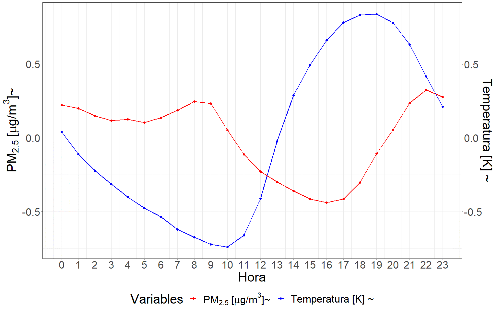
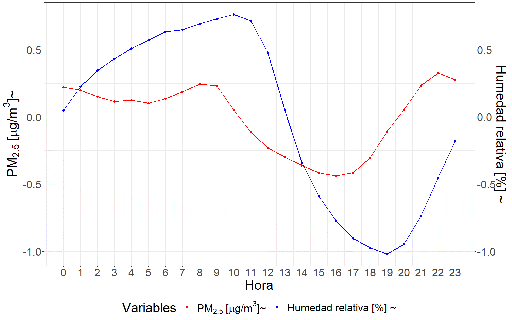
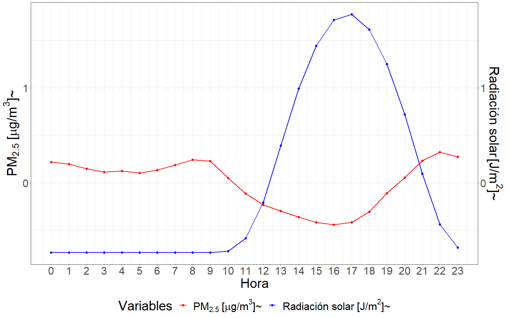
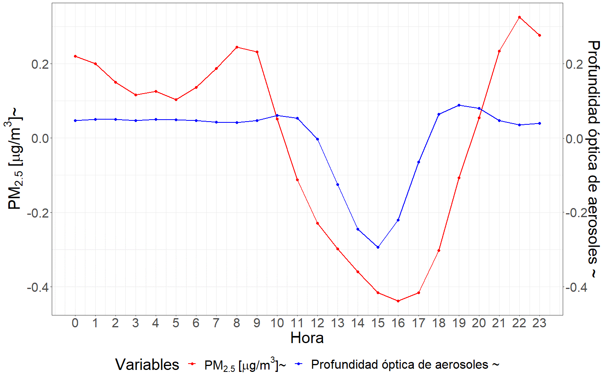
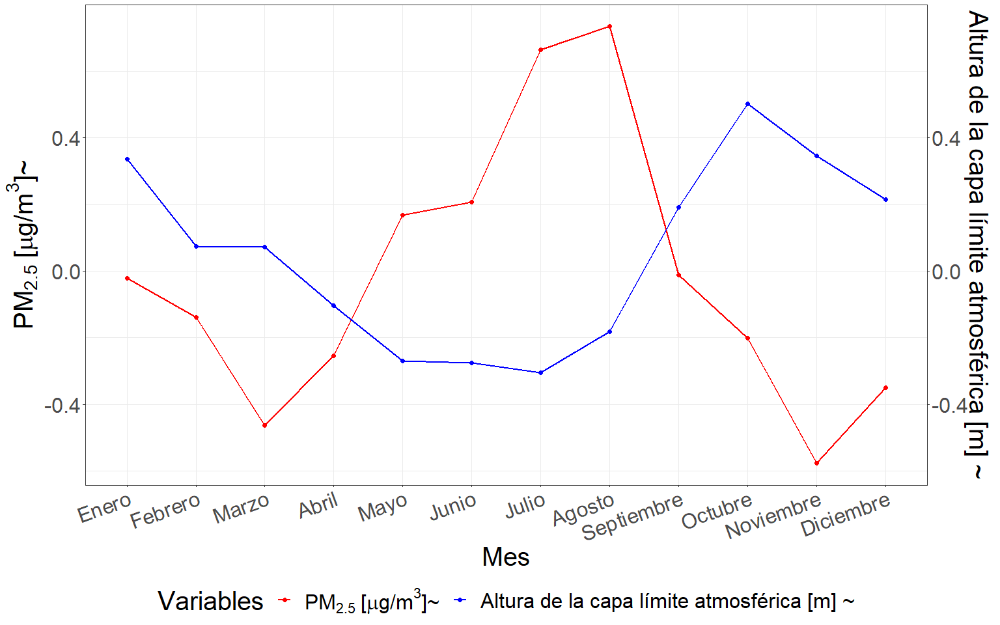
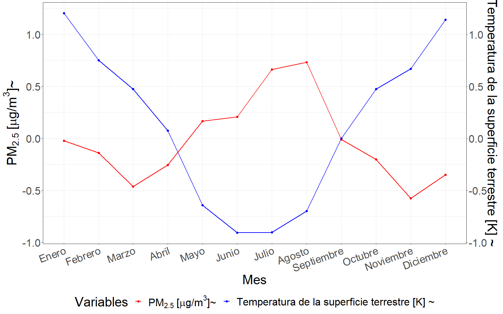

#	Influencia variables satelitales {#cap:var}

## Introducción

  La teledetección o sensado remoto es una técnica que permite adquirir información sobre el sistema terrestre mediante sensores ubicados en aviones o satélites, sin necesidad de contacto físico directo con los objetos de estudio [@chuvieco2010plan]. Estos sensores capturan y registran la radiación electromagnética reflejada o emitida por la superficie terrestre. Su aplicabilidad se extiende al estudio de aspectos clave como el clima, la meteorología, la interacción tierra-atmósfera y la dinámica de la superficie terrestre. A partir de la información recopilada, se obtienen estimaciones horarias de diversas variables climáticas, atmosféricas, terrestres y oceánicas, que abarcan la totalidad de la superficie. Los productos satelitales proporcionan información detallada acerca del estado del sistema tierra-atmósfera, con una elevada resolución tanto espacial como temporal. Estas estimaciones se generan por medio de la técnica de reanálisis, la cual combina datos de modelos teóricos, con observaciones *in situ* y leyes físicas. Este principio, denominado asimilación de datos, se encuentra basado en el método utilizado por los centros de predicción meteorológica numérica, en donde cada un lapso de tiempo determinado se combina una predicción anterior con nuevas observaciones disponibles para producir una nueva estimación del estado de la atmósfera [@bell2021era5; @hersbach2020era5; @wu2020regional]. La información generada a partir de la teledetección la convierte en una herramienta fundamental a la hora de predecir escenarios climáticos futuros [@huot2022next; @rocchini2015potential; @watmough2019socioecologically; @asaly2022using; @paul2020mapping].
  
  La fluctuación de las condiciones meteorológicas que determinan el estado de la atmósfera en un momento determinado generan una notable influencia en la variación de la concentración de PM [@tiwari2017assessment; @he2017influences]. Numerosos estudios han evidenciado asociaciones, de vínculo inverso entre el PM con la velocidad del viento [@cichowicz2020effect; @usman2022exploring; @xiaoyang2019particulate], la precipitación [@usman2022exploring; @xiaoyang2019particulate], la temperatura [@nogarotto2020review; @xiaoyang2019particulate], el punto de rocío [@zhao2022analysis], precipitación [@hu2021importance;@kleine2017modeling] y la altura de la capa límite atmosférica (PBLH) [@li2020correlation; @wang2019relationship]. Por otra parte, existen variables que responden a una relación directa positiva como la profundidad óptica de aerosoles (AOD) [@soni2018particulate; @gupta2021spatio] y el tráfico de vehículos [@pant2013estimation; @weerakkody2018quantification]. Tanto para la presión atmosférica, como para la humedad relativa y la radiación solar, existen resultados que vinculan estas variables con el PM tanto de forma directa [@li2015particulate; @nogarotto2020review; @yang2016intensification] como inversa [@tian2014characteristics; @chen2016spatial; @liu2015seasonal]. Es pertinente destacar la existencia de estudios cuyas conclusiones reflejan que la concentración de PM depende más de la meteorología que de factores antropogénicos [@hooyberghs2005neural]. Esta relación de vinculación está sujeta a otras características propias del sitio, como por ejemplo las fuentes de emisión, el tamaño de las partículas [@khan2010characterization; @tai2010correlations; @dimitriou2015dependence] y la topografía [@alvarado2010modeling; @vinoj2022role]. Por este motivo, cobra sentido modelar la concentración de PM~2.5~ en función de variables meteorológicas para sitios con características específicas. La disponibilidad de variables meteorológicas provenientes de la teledetección o sensoramiento remoto viabiliza el ajuste de modelos predictivos para la concentración de PM~2.5~. Sin embargo, previo a cualquier ajuste de modelo predictivo es necesario contar con una descripción exhaustiva de la estructura de la serie temporal de PM. 
  
  Enmarcado dentro del Servicio de Cambio Climático Copernicus (C3S - *Copernicus Climate Change Service*) de la Agencia Espacial Europea (ESA), el Centro Europeo para Previsiones Meteorológicas a Medio Plazo (ECMWF - *European Centre for Medium-Range Weather Forecasts*) genera grandes conjuntos de datos climáticos a escala global. Este producto es la quinta generación de Reanálisis Europeo (ERA5 - *European ReAnalysis*), sucesor de *ERA-Interim* [@munoz2021era5], y se caracteriza por combinar modelos climáticos y datos observacionales a nivel mundial. Los productos generados ponen a disposición información para todo el globo a escala temporal horaria, diaria y mensual desde el año 1979. Así, cada vez es más factible mapear y modelar las variaciones o cambios espacio-temporales de las condiciones meteorológicas imperantes antes, durante y después de eventos de interés. El avance de la tecnología ha permitido un desarrollo notable en la capacidad computacional disponible, sumado a la disponibilidad de datos meteorológicos masivos en diversas plataformas de Internet, es posible obtener información meteorológica variada para un sitio georreferenciado sobre un territorio de interés. Actualmente, se cuenta con variadas herramientas informáticas para la obtención de productos satelitales almacenados en la nube. Tales productos pueden ser usados como covariables con potencialidad predictiva de la concentración de PM. Sin embargo, el desarrollo de modelos para predecir PM~2.5~ basados en la abundancia de información hoy disponible y enmarcados en el contexto de la inteligencia artificial es incipiente.
  
  La búsqueda de factores que logren explicar la variabilidad de la serie temporal de concentración de PM~2.5~ se realiza tanto para la comprensión de la dinámica de variación del contaminante como para su modelado predictivo. El estudio de la estructura o patrones en la serie temporal del contaminante y su covariabilidad con las series de variables meteorológicas es fundamental para construir modelos predictivos. Estos pueden ser mecanicísticos, *i.e.* modelos que pretenden explicar y relacionar, usualmente basados en el conocimiento existente, la covariabilidad del PM~2.5~ con la de otros factores del medio. Sin embargo, los modelos predictivos también pueden ser de base computacional. En este caso, el análisis de los datos del contaminante se relaciona con la variabilidad de múltiples factores con la intención de predecir su valor aun cuando el impacto de cada uno de los factores o sus combinaciones permanezca oculto o sin justificar desde el conocimiento existente. Los modelos de inteligencia artificial, tanto de aprendizaje automático como profundo, se basan en explotar la covariabilidad entre un gran número de series de variables en una base de datos de entrenamiento con la finalidad de predecir nuevos valores de PM~2.5~ en contextos similares al del aprendizaje. Por lo tanto, para predecir valores futuros de una serie puede implementarse un marco teórico basado en información contenida en la misma y/u otro que se nutra, además de la variabilidad de factores relacionados con la serie. En particular, los métodos de aprendizaje automático permiten obtener predicciones de valores futuros en función del comportamiento de un conjunto grande de potenciales predictoras y de la covariabilidad entre ellas. El presente capítulo [4](#cap:var) y su posterior [5](#cap:pred), se hallan enmarcado dentro de un enfoque de trabajo basado en la inteligencia artificial. Se incluyen métodos clásicos como la regresión lineal múltiple, que demandan un mayor control del investigador sobre las variables predictoras y supuestos sobre las relaciones subyacentes, además de otros como los algoritmos de aprendizaje automático basados en árboles y de aprendizaje profundo  basados en redes neuronales, que habilitan el trabajo con múltiples series de datos cuya variabilidad podría tener potencial capacidad predictiva de la variabilidad de PM~2.5~ con un menor nivel de control y de supuestos. Uno de los principales desafíos en el modelado predictivo a través de técnicas de aprendizaje automático es la selección de características o variables predictoras que alimentarán al modelo, dado que mientras mayor sea el número de predictoras también lo será la complejidad del resultado [@li2019influence; @rumao2019exploration; @cai2018feature]. Es factible que las variables relevantes para el desarrollo de un modelo predictivo de elevada exactitud puedan no solo ser las recomendadas en la literatura para la construcción de modelos mecanicistas explicativos de la dinámica observada en la serie del contaminante, ya que el objetivo dentro del enfoque de aprendizaje automático está centrado en potenciar la exactitud de las predicciones y no en la explicación de cada una de las relaciones subyacentes.
  
  En esta tesis la variable respuesta a modelar es la concentración de PM~2.5~ y las variables predictoras derivarán principalmente de mediciones satelitales, en especial meteorológicas, además de las que refieren a la estructura temporal de variabilidad de la serie de tiempo para las características de cada uso de suelo. Para abordar el problema enmarcado en determinar la potencialidad de estas variables para predecir la concentración de PM~2.5~, se creó una base de datos satelitales, la cual involucró no solo aquellas variables respaldadas por la bibliografía en cuanto a su conocida influencia sobre el PM~2.5~, sino también otros productos satelitales de público acceso cuya variación conjunta podría maximizar la capacidad predictiva de un modelo de aprendizaje automático. Respetando las premisas de creación de un sistema de alerta de bajo costo ante condiciones adversas de calidad del aire, las variables incluidas como predictoras en el modelado predictivo de la concentración de PM~2.5~, son de dominio público y la variable respuesta obtenida por medio de sensores de monitoreo basados en tecnologías de bajo costo.

  Las técnicas de selección de características asociadas a la predicción constituyen una herramienta útil para identificar las variables de mayor relevancia a la hora de desarrollar un modelo predictivo [@khalid2014survey; @venkatesh2019review]. Es importante destacar que, en algunos casos, las variables seleccionadas pueden no tener un respaldo teórico desde el punto de vista de los mecanismos que subyacen la contaminación ambiental. La implementación de técnicas de aprendizaje automático, permite que vinculaciones indirectas entre las variables que alimentan el modelo puedan ser desenmascaradas. Algunas de ellas podrían tener una interpretación teórica, pero esto no necesariamente ocurrirá con todas [@suparwito2021student; @lima2016use].

  De esta forma, los modelos predictivos desarrollados en el capítulo [5](#cap:pred) no solo incluyen las variables destacadas como relevantes según la bibliografía, sino que también incorporan otras variables satelitales con la finalidad de aumentar la exactitud de las predicciones obtenidas. Del mismo modo, en el presente capítulo las variables analizadas no solo son aquellas cuya relación de vinculación con la concentración de PM~2.5~ es conocida, sino que también se encuentran involucradas otras variables que han sido identificadas a través del procedimiento de aprendizaje automático como de alta potencialidad para predecir la concentración de PM~2.5~.

## Materiales y métodos

### Resumen gráfico del protocolo de analísis de correlaciones entre series

```{r serie, echo=FALSE, out.width="100%", fig.align="center",fig.cap="(ref:serie)"}
knitr::include_graphics("images/GA/serie.png")
```
(ref:serie) Resumen gráfico del protocolo analítico desarrollado en el capítulo 4.

  La figura \@ref(fig:serie) presenta el protocolo analítico desarrollado en este capítulo con la finalidad de identificar asociaciones entre la serie de concentración de PM~2.5~ y las de variables satelitales. En primer lugar, se creo la base de datos empleada durante el presente capítulo, la cual surgió a partir de la combinación de la base de datos de concentración de PM~2.5~ provista por los sensores de monitoreo  basados en tecnologías de bajo costo y las variables satelitales de público acceso descargadas desde la nube. Posteriormente se hace mención a cada uno de los pasos desarrollados durante el análisis de series temporales ejecutado en el presente capítulo, para más detalles dirigirse a la sección de protocolo estadístico, más específicamente al apartado análisis de series temporales. Al finalizar el procedimiento se concluyó respecto de las correlaciones desenmascaradas para cada una de las variables satelitales analizadas.

### Base de datos

  La base de datos para el desarrollo de esta sección surge de la combinación de los datos recopilados durante el muestreo de PM~2.5~ (ver capítulo [2](#cap:expl) para más detalles) con distintas bases de datos satelitales. Entre estas se destaca la base de datos de ERA5 que surge del reanálisis realizado por el ECMWF para el clima global [@hersbach2020era5; @bell2021era5]. Este método de estimación combina modelos predictivos con observaciones a lo largo de todo el mundo, dando por resultado un conjunto de datos completo a escala global, cuyo principio de funcionamiento se basa en la asimilación de datos. Enmarcado dentro del C3S de la Comisión Europea, el ECMWF genera el reanálisis ERA5 que representa un registro detallado de las condiciones atmosféricas globales, de la superficie terrestre y oceánicas desde 1979 en adelante. ERA5 se basa en el Sistema Integrado de Pronóstico (IFS) Cy41r2, implementado desde 2016, beneficiándose de una década de desarrollos en modelos físicos, dinámica y asimilación de datos. Esta base de datos cuenta con estimaciones horarias para 164 variables atmosféricas, oceánicas y terrestres, con una resolución espacial de 0.25 grados [@hersbach2020era5]. 
    
  Además, se incluyeron otras covariables, citadas en la literatura como relevantes para el PM~2.5~, provenientes de las mediciones del sensor espectrorradiómetro de imágenes de resolución moderada (MODIS - *Moderate Resolution Imaging Spectroradiometer*) [@savtchenko2004terra; @lyapustin2019maiac; @lyapustin2018modis; @hulley2014thermal], datos obtenidos a partir del reanálisis retrospectivo para investigación y aplicaciones de era moderna en su versión 2 (MERRA-2 - *Modern Era-Retrospective Reanalysis for Research and Applications Version 2*) [@bosilovich2015merra], datos del conjunto de radiómetros de imágenes infrarrojas visibles (VIIRS) [@wu2016viirs] y la base de datos de *Google Traffic* [@wu2007google]. La descripción completa de cada una de las variables involucradas se encuentra en el Anexo 3.

  La profundidad óptica de aerosoles (AOD) se obtuvo a partir de los datos brindados por el instrumento MODIS, el cual se encuentra a bordo de los satélites Terra y Aqua pertenecientes a la Administración Nacional de Aeronáutica y del Espacio (NASA). Lyapustin (2011) desarrolló el algoritmo MAIAC para obtener valores de AOD sobre superficies brillantes y oscuras con una resolución de 1 km a partir de los productos de MODIS [@lyapustin2018modis]. El algoritmo MAIAC permite obtener características más refinadas de los aerosoles, cumpliendo con los requisitos para el monitoreo regional a menores escalas espaciales [@tao2019performance]. El algoritmo MAIAC permite obtener el valor de AOD sobre la superficie terrestre a partir de la implementación de series temporales, logrando discriminar la contribución de aerosoles y de la reflectividad de la superficie terrestre, considerando los efectos de la reflectividad bidireccional [@lyapustin2018modis;@lyapustin2019maiac]. El algoritmo MAIAC implementa técnicas de análisis de series temporales y procesamiento basado en imágenes para llevar a cabo la recuperación de datos y la corrección en superficies brillantes y en vegetación oscura [@lyapustin2018modis;@lyapustin2011multiangle]. Asimismo, el algoritmo MAIAC mejora la capacidad de detección de humo (polvo), nubes y cobertura de nieve [@lyapustin2012discrimination]. En comparación con otros productos de AOD, el producto de MAIAC ofrece una mayor cobertura espacial y frecuencia de recuperación. La alta resolución espacial mejora la capacidad para determinar las características de los aerosoles finos y distinguir las fuentes de emisión [@mhawish2019comparison;@savtchenko2004terra;@hulley2014thermal].
  
  La temperatura de la superficie terrestre (LST) se obtuvo a partir de los datos brindados por el instrumento MODIS a bordo de los satélites Terra y Aqua, proporcionando registros con una precisión objetivo de 1 K. Los sensores térmicos basados en satélites son herramientas poderosas para el monitoreo ambiental, como la detección de incendios [@justice2002modis] o actividad volcánica [@wright2002automated]. Además, estos sensores ofrecen evidencia directa de la variabilidad de la superficie, la cual se utiliza para establecer su relación con la variabilidad de los aerosoles [@handschuh2023systematic].
  
  También se incluyeron los datos de reanálisis de MERRA-2 que utilizan la nueva versión del Sistema de Asimilación de Datos del Sistema de Observación Terrestre de Goddard, Versión 5 (GEOS-5), que es un sistema de vanguardia que combina un modelo de circulación general atmosférica global (GEOS-5 AGCM) con la Interpolación Estadística de Puntos en Rejilla (GSI) del NCEP [@feng2019does]. Los datos de altura de la capa límite planetaria (PBLH) se obtuvieron del conjunto de datos de reanálisis MERRA-2 con una resolución espacial de 0.5° × 0.625° (latitud-longitud) [@gelaro2017modern]. Dado a que los datos de reanálisis tienen la ventaja de contar con una alta resolución temporal y considerar las fuerzas dinámicas a gran escala, se pudo generar una base precisa de PBLH para la región en estudio utilizando los datos de MERRA-2 (M2T1NXFLX - Diagnóstico del Flujo de Superficie).
  
  MERRA-2 también proporciona productos de reanálisis de aerosoles, provenientes de la asimilación de numerosas observaciones provenientes de satélites y estaciones de monitoreo en superficie. Zhang et al. evaluaron de manera sistemática el rendimiento de los AOD de Himawari-8 y dos conjuntos de datos de AOD de reanálisis ofrecidos por MERRA-2 y el Servicio de Monitoreo de la Atmósfera de Copernicus (CAMS) [@zhang2020evaluation]. Sus resultados mostraron que el AOD de Himawari-8 y MERRA-2 presentaron una precisión similar, mostrando variaciones diurnas significativas. Estudios han confirmado que el uso del AOD de MERRA-2 combinado con modelos de aprendizaje automático puede estimar las concentraciones de PM~2.5~ con una precisión razonable [@gupta2021machine].
  
  El conjunto de datos se complementó con los datos de MERRA-2 recopilados a través del servicio web de datos de radiación solar (SoDa - *Solar radiation Data*), que ofrece series temporales de temperatura (a 2 m sobre el nivel del suelo), humedad relativa (a 2 m sobre el nivel del suelo), presión (a 2 m sobre el nivel del suelo), velocidad y dirección del viento (a 10 m sobre el nivel del suelo), precipitación, nieve, espesor de nieve e irradiación horizontal global (GHI) con una resolución espacial de 0.5° × 0.5° (aproximadamente 50 km) [@valappil2023evaluation].
  
  El VIIRS es uno de los cinco instrumentos a bordo del satélite Suomi-NPP. El satélite Suomi-NPP, y por lo tanto el VIIRS, opera en una órbita sincrónica con el sol a una altitud de 824 km (inclination = 98.7°), con un nodo ascendente de tiempo solar local a la 1:30 pm. Logra una cobertura global diaria y tiene un ciclo de repetición de aproximadamente 16 días. El producto de datos de la Versión 1 de Anomalías Térmicas/Incendios (VNP14A1) proporciona información diaria sobre incendios activos y otras anomalías térmicas. El producto de datos VNP14A1 es un compuesto global en malla de 1 kilómetro (km) de píxeles de incendios detectados a partir de las bandas de 750 metros (m) del VIIRS durante un período diario (24 horas). Los productos de datos VNP14 están diseñados siguiendo la suite de productos de Anomalías Térmicas/Incendios del MODIS. El producto VNP14A1 proporciona un total de cuatro capas de Conjunto de Datos Científicos (SDS) para la confianza del incendio, la potencia radiativa máxima del incendio (FRP), la evaluación de calidad (QA) y la posición del incendio dentro del escaneo [@wu2016viirs].
  
Table: Fuentes de datos de variables satelitales. \label{tab:satdata}
Referencia: Fuente de datos, dependencia, resolución espacial, resolución temporal y número total de variables descargadas.

| Fuente | Dependencia | Espacial | Temporal | Variables |
|----------|:--------:|:--------:|:--------:|:--------:|:--------:| 
| ERA5 (ECMWF reanálisis) | ECMWF | 0.25°x0.25° | horaria | 164 |
| MODIS-MAIAC (MCD19A2) | NASA | 0.1°×0.1° | horaria | 1 |
| MERRA-2 (M2T1NXFLX) | NASA  | 0.625°×0.5° | horaria | 1 |
| MERRA-2 (M2IMNXGAS) | NASA  | 0.625°×0.5° | horaria | 1 |
| MERRA-2 (SODA) | NASA | 0.625°×0.5° | horaria | 9 |
| VIIRS (VNP14A1) | NASA | 0.1°×0.1° | diaria | 1 |
| MODIS (MOD11A1/MYD11A1) | NASA | 0.1°×0.1° | horaria | 1 |
  
  Si bien todas la variables involucradas se encuentran descriptas en el Anexo 3, se listan aquí las de mayor importancia según los sustentos bibliográficos para describir la variación de la concentración de PM~2.5~:

  Temperatura del aire 2 metros por encima de la superficie de la tierra, que se calcula interpolando entre el nivel más bajo obtenido por el modelo y el valor de temperatura en la superficie terrestre, teniendo en cuenta las condiciones atmosféricas. Este parámetro se expresa en kelvin ($K$). 

 Humedad relativa a 2 metros por encima de la superficie terrestre, que establece la relación entre la presión parcial del vapor de agua y la presión de vapor de equilibrio del agua a la temperatura dada a esa altura. Esta variable es calculada a partir de la combinación de los datos de temperatura y presión estimados por el satélite y se expresa en porcentaje ($%$).

  Punto de rocío, que es la temperatura a la que tendría que enfriarse el aire a 2 metros por encima de la superficie terrestre para que se produzca la saturación, es decir, para que el vapor de agua se condense en rocío o escarcha. Esta temperatura se calcula interpolando entre el nivel más bajo obtenido por el modelo y la medición obtenida para la superficie terrestre, teniendo en cuenta las condiciones atmosféricas. Este parámetro se expresa en kelvin ($K$). 

  Precipitación convectiva, que es la precipitación acumulada que cae sobre la superficie terrestre, obtenida a partir del esquema de convección en el Sistema Integrado de Previsión del ECMWF (IFS). Surge a partir de la combinación de información acerca de la formación y disipación de las nubes y la precipitación, derivada a partir de cambios en características atmosféricas, como lo son presión, temperatura y humedad. Esta precipitación tiene en cuenta tanto la lluvia, como la nieve, entre otros estadios intermedios de precipitación, que son acumulados horariamente. Este parámetro se expresa en metro de agua equivalente sobre la superficie terrestre, que representa la profundidad que tendría el agua si se repartiese uniformemente en la superficie de la cuadrícula de resolución.
  
  Velocidad del viento en su componente “neutra” a una altura de 10 metros sobre la superficie terrestre. Esta neutralidad se calcula a partir de la tensión superficial y de la rugosidad de la superficie terrestre, considerando una estratificación neutra de la atmósfera derivada a partir del gradiente de temperaturas. Esta componente es de menor velocidad que el viento real bajo condiciones estables, y de mayor bajo condiciones inestables. Las unidades en las que se mide este parámetro son metros por segundos ($\frac{m}{s}$). 
  
  Presión atmosférica, es la fuerza por unidad de superficie que ejerce la atmósfera sobre la superficie terrestre. Esta es una medida del peso del aire en una columna situada verticalmente sobre un punto de la superficie terrestre. Las unidades en que se mide este parámetro son Pascales ($Pa$).   
  
  Altura de la capa límite atmosférica (PBLH) refleja la altura del estrato de aire por encima de la superficie terrestre que se ve afectado por la resistencia a la transferencia de momento, calor o humedad, que genera la superficie terrestre. En otras palabras, es la altura del estrato de aire sujeto a la influencia de la superficie terrestre. Esta puede ser tan baja como unas pocas decenas de metros, como sucede con el aire de refrigeración por la noche, o tan alta como varios kilómetros como ocurre sobre el desierto en medio de un día caluroso y soleado. Cuando es baja, pueden desarrollarse mayores concentraciones de contaminantes (emitidos en superficie). Su cálculo se basa en el número de Richardson y la unidad en la que se mide este parámetro son los metros ($m$). 

  Radiación solar directa sin nubosidad sobre la superficie terrestre, es la cantidad de radiación directa del sol (onda corta) que llega a la superficie terrestre, suponiendo condiciones de cielo despejado (sin nubes). Esta radiación solar puede ser dispersada en distintas direcciones por partículas presentes en la atmósfera, la parte que llega a superficie se denomina radiación solar difusa. Mientras que, la parte de la radiación solar que llega a la superficie sin ser dispersada se denomina radiación solar directa. Las cantidades de radiación a cielo despejado se calculan para las mismas condiciones atmosféricas de temperatura, humedad, ozono, gases traza y aerosoles, sin considerar la nubosidad. Las unidades en las que se mide este parámetro son julios por metro cuadrado ($\frac{J}{m^2}$).

  Presión atmosférica al nivel del mar es la presión que ejerce la atmósfera sobre la superficie terrestre, ajustada a la altura del nivel medio del mar. Es una medida del peso que tendría todo el aire de una columna situada verticalmente sobre un punto de la Tierra, si el punto estuviera situado al nivel medio del mar. Los mapas de presión media a nivel del mar se utilizan para identificar la ubicación de los sistemas meteorológicos de baja y alta presión, a menudo denominados ciclones y anticiclones. Además, los contornos de la presión media a nivel del mar también indican la fuerza del viento, contornos más cerrados muestran vientos más fuertes, mientras que contornos más abiertos indican vientos más débiles. Las unidades de este parámetro son pascales ($Pa$). 
  
  Profundidad óptica de aerosoles (AOD) que es un parámetro adimensional que mide la extinción de la luz debida a su dispersión y absorción por la presencia de partículas (por ejemplo, neblina urbana, humo, polvo desértico, sal marina) distribuidas en la columna de aire desde la superficie terrestre a la parte superior de la atmósfera. Esta variable se obtuvo a partir de dos fuentes, en primer lugar, del algoritmo denominado implementación de corrección atmosférica multi-ángulo (MAIAC) que ha sido recientemente desarrollado para los datos obtenidos con el sensor MODIS (a bordo de los satélites Terra y Aqua/NASA) [@lyapustin2019maiac; @lyapustin2018modis]; y en segundo lugar, del Análisis retrospectivo de la era moderna para investigación y aplicaciones, versión 2 (MERRA-2) [@bosilovich2015merra].
  
  Temperatura de la superficie terrestre (LST) obtenida a partir del producto MODIS LST y emisividad, LST&E de sus siglas en inglés (MOD21), disponible en la colección 6, el cual utiliza un algoritmo basado en la física para recuperar dinámicamente tanto esta temperatura como la emisividad simultáneamente para las tres bandas infrarrojas térmicas MODIS (29, 31 y 32) con una resolución espacial de 1 km en el nadir [@savtchenko2004terra; @hulley2014thermal]. Las unidades en las que se mide este parámetro son kelvin ($K$).

  El tráfico de automóviles que es un parámetro adimensional obtenido a partir de los datos que se encuentran publicados en *Google Maps*, en donde puede visualizarse el tráfico promedio usual para las distintas horas en los distintos días de la semana [@wu2007google]. 

### Protocolo estadístico
  
#### Análisis de series temporales
  
  En primer lugar, se llevó a cabo un análisis descriptivo de la variabilidad conjunta de las series de las variables satelitales documentadas en la literatura como influyentes de la concentración de PM~2.5~, en distintas escalas temporales (horas a lo largo del día y meses a lo largo del año). Posteriormente, se chequeó la estacionalidad de las series a través de las pruebas de Dickey-Fuller Aumentada (ADF) [@dickey1979distribution] y de Kwiatkowski–Phillips–Schmidt–Shin (KPSS) [@kwiatkowski1992testing]. En una serie de tiempo estacionaria la media, varianza y covarianza no varían a lo largo del tiempo. Sin embargo tanto las series de concentración de PM~2.5~ como las de variables satelitales presentan tendencias estacionales y heterogeneidades de varianzas a lo largo del tiempo. Por este motivo, las series bajo estudio (PM~2.5~ y variables satelitales) debieron ser transformadas para lograr su estacionariedad. La estabilización de la varianza se llevó a cabo por medio de la transformación de Box-Cox, la cual sugirió transformaciones logarítmicas y en la escala de la raíz cuadrada [@thompson2016stabilizing; @guerrero2004variance]. Por otra parte, la estabilización de la media dentro de cada día, en todos los casos se realizó por medio de la diferenciación de la serie considerando un paso (*lag*) de 1 hora. La diferenciación, es una operación matemática que consiste en generar una nueva serie de tiempo a partir de la serie original, a través de la diferencia entre los valores de la serie original espaciados en un intervalo de tiempo *k* conocido como *lag*. La diferenciación es una técnica utilizada habitualmente para eliminar la tendencia en una serie temporal [@box2015time]. 
  
  Posteriormente, se procedió a ajustar un modelo teórico a cada una de las series temporales de las variables satelitales. La estimación de un modelo teórico consiste en ajustar un modelo matemático a los datos observados de una serie temporal con el fin de identificar las características de la misma. Seguidamente, para cada serie de variable satelital, se obtuvieron los residuos (diferencia entre valores observados y predichos por el modelo ajustado). Luego se obtuvieron los residuos de la serie de concentración de PM~2.5~ respecto del modelo teórico ajustado para cada una de las series de variables predictoras. El proceso completo se denomina pre blanqueamiento [@fuenzalida1990prewhitening; @razavi2018prewhitening] y busca reducir la presencia de variación sistemática que no es relevante para la predicción. Finalmente, se analizó la correlación cruzada entre cada una de las series filtradas de PM~2.5~ y la respectiva variable satelital. El procedimiento ejecutado permite independizarnos de la estructura de autocorrelación presente en las series temporales, cuya interpretación podría conducir a la determinación de relaciones espurias entre las variables [@razavi2018prewhitening]. Una relación se considera espuria o aleatoria cuando las variables aparentan tener una conexión numérica, forzada por el azar o factores externos y no por una verdadera relación de vinculación entre las variables. La correlación cruzada entre series temporales indica la relación lineal entre las series a lo largo del tiempo. Este análisis es comúnmente implementado en los casos en se quiere determinar si una serie de tiempo puede predecir otra. En otras palabras, la correlación cruzada mide la covariabilidad entre dos series y cómo se relacionan cuando están distanciadas en un determinado paso (*lag*) de tiempo. A partir de estos resultados se busca reflejar la potencial correlación de las series de variables satelitales con la variable concentración de PM~2.5~ [@probst2012using]. El ajuste de los modelos teóricos con los cuales se filtró la serie de concentración de PM~2.5~ fue realizado a través de modelos de media móvil integrada autorregresiva estacional o conocido por sus siglas en inglés como SARIMA (*Seasonal Autoregressive Integrated Moving Average*) [@box2015time; @del2017evaluation].

  Los modelos SARIMA son una técnica estadística que permiten modelar y predecir series de tiempo con patrones estacionales. Estos se ajustaron luego de estabilizar la media intra diaria y la varianza de las series temporales. Un modelo SARIMA se escribe como SARIMA (p, d, q) x (P, D, Q)s, donde los parámetros p,d y q denotan el orden de los términos autorregresivos (AR), de diferenciación y de media móvil (MA), respectivamente. Mientras que, los órdenes estacionales autorregresivos, de medias móviles y de diferenciación vienen dados por los parámetros P,D y Q, respectivamente. El periodo de estacionalidad s, en este caso, es de 24 horas dado al periodo cíclico de los datos a lo largo de las horas del día (datos horarios). Para identificar el modelo teórico de mejor ajuste a cada variable, se inspeccionó la función de autocorrelación simple (*FAS*) y la función de autocorrelación parcial (*FAP*), junto con el criterio de información de Akaike (AIC) obtenido para cada modelo (metodología de Box-Jenkins [@box2015time]).

  Por otra parte, el ajuste de los modelos teóricos se llevó a cabo por medio de la metodología de Box-Jenkins, en donde el modelo teórico se deduce del análisis iterativo gráfico de la función de autocorrelación simple (*FAS*) y parcial (*FAP*), y el cálculo del criterio AIC. La *FAS* es una medida de la correlación entre una serie de tiempo y sus retrasos, es decir, cómo se relacionan los valores en diferentes momentos en el tiempo. Es decir, la *FAS* de un retraso k mide la correlación entre los valores de la serie de tiempo en el tiempo t y los valores de la serie de tiempo en el tiempo t-k. Por otra parte, la *FAP* mide la correlación directa entre los valores de la serie de tiempo en diferentes momentos, pero eliminando la influencia de los retrasos intermedios. Es decir, la *FAP* de un retraso k mide la correlación entre los valores de la serie de tiempo en el tiempo t y los valores de la serie de tiempo en el tiempo t-k, eliminando la influencia de los valores intermedios entre t y t-k [@box2015time].

  Una vez obtenidos los modelos teóricos para cada una de las series temporales de las variables satelitales, se procedió a filtrar la serie de concentración de PM~2.5~ y se calculó el diagrama de correlación cruzada. Este diagrama permite identificar cuáles *lags* pasados de la variable independiente poseen mayor capacidad predictiva para estimar la variable dependiente. A la hora de analizar el gráfico de correlación cruzada entre las series filtradas, es importante destacar que dicho diagrama ha sido construido considerando la variable satelital como la independiente, mientras que la concentración de PM~2.5~ como la dependiente. De esta forma, debe prestarse atención a los coeficientes de correlación posicionados en los desfasajes negativos, los cuales indican la capacidad predictiva de la variable independiente desfasada un determinado intervalo de tiempo para predecir la concentración de PM~2.5~ en el tiempo *t*.
  
  Una vez identificados estos retardos, se procedió a ajustar un modelo de función de transferencia dinámica lineal para estimar la dirección de las relaciones entre las series en cuestión [@box1994time; @bisgaard2006quality1]. Los resultados obtenidos fueron corroborados a partir de la estimación de la misma relación funcional en diferencias. Si la relación se mantiene con la misma direccionalidad tanto en la estimación de la función de transferencia dinámica lineal con y sin diferenciación, entonces puede concluirse que esta ocurre en la realidad y que no se debe a efectos espurios [@bisgaard2006quality2]. Los resultados completos del proceso desarrollado pueden encontrarse en el Anexo 2. El símbolo virgulilla (~) colocado posterior al nombre de una variable (serie temporal), indica que esta ha sido previamente normalizada (centrada y estandarizada). 

## Resultados

  En esta sección se reportan los resultados obtenidos a partir del análisis descriptivo de la variabilidad conjunta de las variables meteorológicas satelitales más relevantes en la base de datos en relación con la concentración de PM~2.5~.
  
#### Temperatura

```{r tempmes, echo=FALSE, out.width="100%", fig.align="center",fig.cap="(ref:tempmes)"}
knitr::include_graphics("images/imagescap4/tempmes.png")
```
(ref:tempmes) Perfil de variación conjunto de los promedios mensuales del PM~2.5~ y la temperatura a lo largo del año.
  
  La figura \@ref(fig:tempmes) permite una mejor comprensión de la relación existente entre la temperatura y la concentración de PM~2.5~ a lo largo del año. En este gráfico, puede observarse que durante los meses de bajas temperaturas, la concentración de PM~2.5~ aumenta, mientras que durante los meses en que la temperatura se eleva por encima de su media, las concentraciones disminuyen.

  Esta tendencia queda claramente evidenciada durante los meses de invierno, cuando las temperaturas son más bajas y las concentraciones de PM~2.5~ alcanzan sus valores máximos. En cambio, durante los meses de primavera y verano, cuando las temperaturas son más elevadas, las concentraciones del contaminante disminuyen. Este patrón podría verse vinculado a que las altas temperaturas favorecen la dispersión del PM~2.5~ en la atmósfera, mientras que las bajas temperaturas, propias del invierno, podrían favorecer la acumulación del contaminante. Este hecho podría encontrarse vinculado a las frecuentes inversiones térmicas ocurrentes durante la época invernal que impiden la dispersión de contaminantes, así como también el aumento del uso de combustibles fósiles para calefacción, generando un aumento de la concentración de PM~2.5~.

```{r temphor, echo=FALSE, out.width="100%", fig.align="center",fig.cap="(ref:temphor)"}

```
(ref:temphor) Perfil de variación conjunto de los promedios horarios del PM~2.5~ y la temperatura a lo largo del día.

  La figura \@ref(fig:temphor) muestra una variación cíclica de la temperatura a lo largo del día, que se caracteriza por dos puntos de inflexión: uno en la mañana a las 10 horas y otro en la tarde a las 19 horas. Durante las horas de la mañana, la temperatura desciende continuamente hasta llegar a su mínimo a las 10 horas, mientras que en las horas de la tarde la temperatura aumenta constantemente hasta alcanzar su máximo a las 19 horas.

  Al comparar el ciclo descrito de la temperatura con el del PM~2.5~ puede observarse que temperaturas bajas favorecen mayores concentraciones de material particulado, mientras que temperaturas altas promueven reducciones de concentración (Figura \@ref(fig:temphor)). Estos resultados sugieren una relación inversa entre la temperatura y la concentración de PM~2.5~ promedio en las escalas de variación temporal tanto mensual como horaria. 

Table: Coeficientes estimados a partir de la relación funcional.\label{tab:coeftemp}

| Desfasaje | Con diferenciación | Sin diferenciación |
|----------|:-------:|:-------:|
| t | -0.1573001 | -1.04115 | 
| t-1 | 0.2441853 | 1.44786 |
| t-12 | -0.0197213 | -0.06497 |
| t-24 | -0.2628158 | -0.68048 |

  Las correlaciones significativas que perdura luego del procedimiento de filtrado de las series se observaron en los tiempos t, t-1, t-12 y t-24, destacándose como los desfasajes temporales de mayor capacidad predictiva para predecir la concentración de PM~2.5~ en el presente a partir de la información de temperatura. 
  
  Luego de la estimación de la relación funcional se determinó que tres de los cuatro coeficientes significativos demostraron una relación inversa estadísticamente significativa (no espuria) entre temperatura (t, t-12 y t-24) y la concentración de PM~2.5~. Sin embargo, para el *lag* t-1 se detectó una relación directa positiva. 

#### Humedad relativa

```{r hummes, echo=FALSE, out.width="100%", fig.align="center",fig.cap="(ref:hummes)"}
knitr::include_graphics("images/imagescap4/hummes.png")
```
(ref:hummes) Perfil de variación conjunto de los promedios mensuales del PM~2.5~ y la humedad relativa a lo largo del año.
  
  En la figura \@ref(fig:hummes) puede visualizarse la relación que describen los promedios mensuales de la humedad relativa y la concentración de PM~2.5~ a lo largo del año. Esta escala temporal permite apreciar que en los meses en que la humedad relativa toma valores bajos con respecto a su media, la media de la concentración de PM~2.5~ es alta, mientras que para los meses en que la humedad relativa es alta la concentración de PM~2.5~ es baja con respecto a su media. Es importante destacar que esta relación no se mantiene constante a lo largo del año, como puede observarse en el mes de octubre donde la relación de vinculación se modifica. 

  La humedad relativa es un factor clave en la formación y dispersión de partículas, su variación puede generar grandes cambios en la concentración de PM~2.5~. Además, la presencia de meses en los que la relación de vinculación entre la humedad relativa y la concentración de PM~2.5~ cambia, como ocurre en octubre, indica que existen factores adicionales que pueden estar influyendo en la concentración de PM~2.5~ en la atmósfera. Estos factores podrían incluir variaciones en la fuente de emisión de los contaminantes, la presencia de eventos meteorológicos extremos o la interacción con otros contaminantes atmosféricos. Por lo tanto, es importante considerar una amplia gama de factores al analizar la relación entre la humedad relativa y la concentración de PM~2.5~ en la atmósfera.

```{r humhor, echo=FALSE, out.width="100%", fig.align="center",fig.cap="(ref:humhor)"}

```
(ref:humhor) Perfil de variación conjunto de los promedios horarios del PM~2.5~ y la humedad relativa a lo largo del día.
  
  La figura \@ref(fig:humhor) exhibe la variación promedio de la humedad relativa a lo largo del día. Este patrón cíclico presenta dos puntos de inflexión, uno a las 10 horas y otro a las 19 horas, lo que sugiere la existencia de dos momentos antagónicos durante el día. Entre las 10 y las 19 horas, la humedad relativa disminuye, mientras que en el resto del día aumenta constantemente. Puede inferirse que una disminución de la humedad relativa con respecto a su media favorece un incremento de la concentración de PM~2.5~, mientras que un aumento favorece su disminución.
  
Table: Coeficientes estimados de la relación funcional.\label{tab:coefhum}

| Desfasaje | Con diferenciación | Sin diferenciación |
|----------|:-------:|:-------:| 
| t-5 | -0.2681536 | -0.2548 | 
| t-24 | 0.1367988 | 0.1309 |

  Las correlaciones significativas que perdura luego del procedimiento de filtrado de las series se observaron en los tiempos t-5 y t-24, destacándose como los desfasajes temporales de mayor capacidad predictiva para predecir la concentración de PM~2.5~ en el presente a partir de la información de humedad relativa. 
  
  Luego de la estimación de la relación funcional se determinó que cada uno de los coeficientes significativos demostró una relación opuesta de vinculación. El *lag* temporal de 5 horas resultó en una relación inversa estadísticamente significativa, mientras que el *lag* de 24 horas lo hizo en una directa estadísticamente significativa, entre la humedad relativa y la concentración de PM~2.5~.  

#### Temperatura del punto de rocío

```{r rocmes, echo=FALSE, out.width="100%", fig.align="center",fig.cap="(ref:rocmes)"}
knitr::include_graphics("images/imagescap4/rocmes.png")
```
(ref:rocmes) Perfil de variación conjunto de los promedios mensuales del PM~2.5~ y la temperatura del punto de rocío a lo largo del año.
  
  A partir de la figura \@ref(fig:rocmes) puede visualizarse la relación que describen los promedios mensuales de la temperatura del punto de rocío y la concentración de PM~2.5~ a lo largo del año. Esta escala temporal muestra que en los meses en los que la temperatura del punto de rocío está por debajo de su media, la concentración media de PM~2.5~ es alta, mientras que en los meses en los que la temperatura del punto de rocío es alta, la concentración de PM~2.5~ también lo es con respecto a su media. 

```{r rochor, echo=FALSE, out.width="100%", fig.align="center",fig.cap="(ref:rochor)"}
knitr::include_graphics("images/imagescap4/rochor.png")
```
(ref:rochor) Perfil de variación conjunto de los promedios horarios del PM~2.5~ y la temperatura del punto de rocío a lo largo del día.

  La figura \@ref(fig:rochor) muestra el ciclo de variación que describe la temperatura del punto de rocío promedio a lo largo de las horas del día. Puede observarse que a medida que transcurren las horas, la temperatura del punto de rocío experimenta un ciclo de variación inverso al ciclo que describe la concentración de PM~2.5~ promedio. En otras palabras, cuando la temperatura del punto de rocío alcanza valores elevados con respecto a su media, se observan menores concentraciones del contaminante, como sucede entre las 10 y 20 horas, el periodo del día en que las concentraciones son más bajas. En contraposición, el pico de concentraciones entre las 6 y 10 horas se produce al mismo tiempo que se registra un descenso en la temperatura del punto de rocío. A partir de esta información puede interpretarse que la relación que mejor describe el vínculo entre las variables en cuestión es una relación inversa.

Table: Coeficientes estimados de la relación funcional.\label{tab:coefroc}

| Desfasaje | Con diferenciación | Sin diferenciación |
|----------|:-------:|:-------:| 
| t-11 | -0.1597575 | -0.2921 | 
| t-14 | -0.3212396 | -0.3222  |
| t-20 | 0.3752728 | -0.3377 |

  Las correlaciones significativas que perdura luego del procedimiento de filtrado de las series se observaron en los tiempos t-11, t-14 y t-20, destacándose como los desfasajes temporales de mayor capacidad predictiva para predecir la concentración de PM~2.5~ en el presente a partir de la información de temperatura del punto de rocío. 
  
  Luego de la estimación de la relación funcional se determinó que dos de los tres coeficientes significativos demostraron una relación inversa estadísticamente significativa (no espuria) entre la temperatura del punto de roció (t-11 y t-14) y la concentración de PM~2.5~. Sin embargo, para el *lag* t-20 se detectó una relación espuria o aleatoria, invirtiendo su signo en ambas estimaciones de la relación funcional.

#### Precipitación
  
  Es importante destacar que el análisis exploratorio de la precipitación en la escala temporal horaria no es representativo dada la frecuencia de ocurrencia de este fenómeno a lo largo del año, resultando en un gran número de datos nulos que pueden interferir con las interpretaciones. Por lo tanto, se decidió no incluir el análisis exploratorio en esta escala temporal para evitar posibles conclusiones erróneas. Sin embargo, a la hora de analizar la correlación entre ambas series temporales, se obtuvieron resultados significativos de correlación para los días en que este fenómeno ocurría. 

```{r rainmes, echo=FALSE, out.width="100%", fig.align="center",fig.cap="(ref:rainmes)"}
knitr::include_graphics("images/imagescap4/rainmes.png")
```
(ref:rainmes) Perfil de variación conjunto de los promedios mensuales del PM~2.5~ y la precipitación a lo largo del año.

  La figura \@ref(fig:rainmes) presenta el perfil de variación promedio mensual de la precipitación a lo largo del año. Puede observarse que durante la primavera y el verano, las precipitaciones aumentan notablemente en comparación con el otoño e invierno. Además, los mayores valores de precipitación se registraron en los meses de noviembre y febrero, mientras que los meses de mayo a octubre presentaron las menores precipitaciones.

Table: Coeficientes estimados de la relación funcional.\label{tab:coefrain}

| Desfasaje | Con diferenciación | Sin diferenciación |
|----------|:-------:|:-------:| 
| t-1 | -6.162e+01 | -3466.73 | 

  La única correlación significativa que perdura luego del procedimiento de filtrado de las series se observa en el tiempo t-1, destacándose como el desfasaje temporal de mayor capacidad predictiva para predecir la concentración de PM~2.5~ en el presente a partir de la información de precipitación. 
  
  Luego de la estimación de la relación funcional se determinó que este coeficiente demostró una relación inversa estadísticamente significativa (no espuria) entre la precipitación y la concentración de PM~2.5~. 

#### Velocidad del viento

```{r vvientmes, echo=FALSE, out.width="100%", fig.align="center",fig.cap="(ref:vvientmes)"}
knitr::include_graphics("images/imagescap4/vvientmes.png")
```
(ref:vvientmes) Perfil de variación conjunto de los promedios mensuales del PM~2.5~ y la velocidad del viento a lo largo del año.
  
  La figura \@ref(fig:vvientmes) presenta el patrón de variación de los promedios mensuales de la velocidad del viento a lo largo del año con respecto a la concentración promedio de PM~2.5~. A partir de esta, puede observarse que los mayores valores de velocidad del viento ocurren durante parte del invierno y la primavera, alcanzando sus máximos en los meses de septiembre y octubre. Por otro lado, se registran menores valores durante el verano y el otoño, con el mínimo en el mes de febrero. A pesar de la tendencia inversa que puede observarse en esta escala temporal, no se observa una marcada relación entre las variables. Por este motivo, será necesario realizar un análisis más detallado para determinar la existencia y la naturaleza de esta relación en escalas de tiempo más finas.

```{r vvienthor, echo=FALSE, out.width="100%", fig.align="center",fig.cap="(ref:vvienthor)"}
knitr::include_graphics("images/imagescap4/vvienthor.png")
```
(ref:vvienthor) Perfil de variación conjunto de los promedios horarios del PM~2.5~ y la velocidad del viento a lo largo del día.

  El patrón de variación de la velocidad del viento a lo largo del día (Figura \@ref(fig:vvienthor)), describe un incremento entre las 10 y 20 horas, desarrollando las máximas magnitudes entre las 15 y 20 horas, mientras que el resto del día la intensidad del viento es baja, con un mínimo a las 9 horas. La variación conjunta permite establecer que cuando la velocidad es baja, la concentración de PM~2.5~ es alta, mientras que cuando la velocidad del viento aumenta, la concentración disminuye. De esta forma puede interpretarse que la relación que mejor vincular a ambas variables es de la forma inversa.

Table: Coeficientes estimados de la relación funcional.\label{tab:coefvient}

| Desfasaje | Con diferenciación | Sin diferenciación |
|----------|:-------:|:-------:| 
| t-5 | 0.1016645 | -0.1288 | 
| t-7 | 0.1317611 | -0.03429  |
| t-8 | 0.1445327 | -0.006416 |
| t-24 | -0.1998146 | -0.3433 |

  Las correlaciones significativas que perdura luego del procedimiento de filtrado de las series se observaron en los tiempos t-5, t-7, t-8 y t-24, destacándose como los desfasajes temporales de mayor capacidad predictiva para predecir la concentración de PM~2.5~ en el presente a partir de la información de velocidad del viento. 
  
  Luego de la estimación de la relación funcional se determinó que tres de los cuatro coeficientes significativos demostraron estar influenciados por una relación espuria o aleatoria (t-5, t-7 y t-8), resultando en relaciones no significativas en términos estadísticos. Por otra parte, el coeficiente con un *lag* de t-24 horas, resultó en una relación inversa estadísticamente significativa (no espuria) entre velocidad del viento y la concentración de PM~2.5~.
 
#### Presión atmosférica

```{r presmes, echo=FALSE, out.width="100%", fig.align="center",fig.cap="(ref:presmes)"}

```
(ref:presmes) Perfil de variación conjunto de los promedios mensuales del PM~2.5~ y la presión a lo largo del año.
  
  En la figura \@ref(fig:presmes) puede notarse la variación conjunta de los promedios mensuales de la presión atmosférica con respecto a la concentración promedio de PM~2.5~ a lo largo del año. Esta variable alcanza sus valores máximos durante el otoño y el invierno, en los meses de junio y julio, mientras que en la primavera y el verano, la magnitud de esta variable disminuye. Por otro lado, la concentración promedio de PM~2.5~ se relaciona de manera inversa con la presión atmosférica, alcanzando sus valores máximos durante los meses de primavera y verano y disminuyendo durante el otoño e invierno. A partir de la figura, se puede apreciar que existe una relación conjunta directa entre ambas variables. Durante los meses en que se registran mayores concentraciones de PM fino, la presión atmosférica también alcanza sus valores máximos, y en los que se registran valores bajos de presión, la concentración del contaminante también disminuye. 

```{r preshor, echo=FALSE, out.width="100%", fig.align="center",fig.cap="(ref:preshor)"}
knitr::include_graphics("images/imagescap4/preshor_b.png")
```
(ref:preshor) Perfil de variación conjunto de los promedios horarios del PM~2.5~ y la presión a lo largo del día.
 
  En la figura \@ref(fig:preshor), se presenta el patrón de variación horario de la presión atmosférica a lo largo del día. Puede notarse que la presión alcanza sus valores mínimos en dos momentos del día: entre las 7 y 9 horas y entre las 19 y 21 horas y alcanza sus valores máximos: entre las 2 y 4 horas y entre las 12 y 14 horas. Al analizar la variación horaria conjunta de ambas variables, se observa una relación inversa en la que cada período de aumento y disminución de las magnitudes es opuesto e instantáneo. En otras palabras, los picos de presión generan una notable reducción en la concentración de PM fino, mientras que las reducciones de la presión generan picos en la concentración de este contaminante.

Table: Coeficientes estimados de la relación funcional.\label{tab:coefpresmar}

| Desfasaje | Con diferenciación | Sin diferenciación |
|----------|:-------:|:-------:| 
| t | -0.003024 | -3.434e-03 | 
| t-9 | 0.002529 | -7.623e-04 | 
| t-19 | 0.008081 | 6.478e-03 | 

  Las correlaciones significativas que perdura luego del procedimiento de filtrado de las series se observaron en los tiempos t, t-9 y t-19, destacándose como los desfasajes temporales de mayor capacidad predictiva para predecir la concentración de PM~2.5~ en el presente a partir de la información de presión atmosférica. 
  
  Luego de la estimación de la relación funcional se determinó que uno de los tres coeficientes significativos demostró una relación del tipo aleatoria (t-9), mientras que los dos restantes exhibieron una relación de vinculación estadísticamente significativa (no espuria), tanto inversa en el presente (t) como directa teniendo en cuenta un *lag* de t-19, entre la presión atmosférica y la concentración de PM~2.5~.

#### Radiación solar

```{r radmes, echo=FALSE, out.width="100%", fig.align="center",fig.cap="(ref:radmes)"}
knitr::include_graphics("images/imagescap4/radmes.png")
```
(ref:radmes) Perfil de variación conjunto de los promedios mensuales del PM~2.5~ y la radiación de corta longitud de onda a lo largo del año.

  La figura \@ref(fig:radmes) muestra el patrón de variación que describe la radiación solar a lo largo de los meses del año. Puede observarse que esta disminuye durante el otoño e invierno, alcanzando sus mayores valores durante la primavera y el verano, específicamente durante los meses de noviembre y diciembre, mientras que los mínimos se alcanzan durante mayo y junio.
  
  Por otra parte, la relación entre ambas variables aparenta ser del tipo inversa, ya que radiaciones de baja magnitud coinciden con el aumento de la concentración de PM~2.5~, mientras que aumentos de radiación están asociados con disminuciones de los niveles de PM~2.5~ Estos resultados sugieren una clara asociación de la radiación solar con la concentración del PM~2.5~ atmosférico.

```{r radhor, echo=FALSE, out.width="100%", fig.align="center",fig.cap="(ref:radhor)"}

```
(ref:radhor) Perfil de variación conjunto de los promedios horarios del PM~2.5~ y la radiación de corta longitud de onda a lo largo del día.
  
  La figura \@ref(fig:radhor) presenta el perfil de variación promedio de la radiación solar a lo largo del día, mostrando dos puntos de inflexión. El primero ocurre a las 10 horas en la mañana, a partir del cual se describe una tendencia incremental en las magnitudes registradas. El segundo se alcanza a las 17 horas, momento a partir del cual se describe una tendencia decreciente hasta alcanzar los valores mínimos de radiación, que se dan durante la noche y la madrugada. 
  
  La relación que mejor describe la vinculación entre la radiación solar y la concentración de PM~2.5~ es inversa (Figura \@ref(fig:radhor)), ya que los aumentos de radiación están asociados con bajos niveles de PM~2.5~, mientras que periodos de baja radiación se asocian con aumentos de partículas.
  
| Desfasaje | Con diferenciación | Sin diferenciación |
|----------|:-------------:|:-------------:|
| t-13 | 4.023e-07 | 2.753e-07 |
| t-23 | -1.884e-06 | -2.413e-06 |

  Las correlaciones significativas que perdura luego del procedimiento de filtrado de las series se observaron en los tiempos t-13 y t-23, destacándose como los desfasajes temporales de mayor capacidad predictiva para predecir la concentración de PM~2.5~ en el presente a partir de la información de radiación solar. 
  
  Luego de la estimación de la relación funcional se determinó que cada uno de los coeficientes significativos demostró una relación opuesta de vinculación. El desfasaje temporal con un *lag* de 13 horas resultó en una relación directa estadísticamente significativa, mientras que el *lag* de 23 horas resultó en una inversa estadísticamente significativa entre la radiación solar y la concentración de PM~2.5~. 
  
#### Profundidad óptica de los aerosoles (AOD)

```{r aodmes, echo=FALSE, out.width="100%", fig.align="center",fig.cap="(ref:aodmes)"}
knitr::include_graphics("images/imagescap4/aodmes.png")
```
(ref:aodmes) Perfil de variación conjunto de los promedios mensuales del PM~2.5~ y la profundidad óptica de los aerosoles a lo largo del año.
  
  A partir de la figura \@ref(fig:aodmes) puede visualizarse el patrón de variación conjunto en los promedios mensuales de AOD y la concentración de PM~2.5~ a lo largo del año. Esta escala temporal muestra que durante los meses de baja AOD la concentración de PM~2.5~ aumenta, mientras que durante los meses en que el AOD es alto los niveles de PM~2.5~ son bajos. A pesar de esto, es importante destacar que la bibliografía menciona una correlación positiva entre ambas variables [@soni2018particulate; @gupta2021spatio]. Por este motivo es importante analizar en escalas temporales de menor granularidad con el objetivo de determinar la verdadera relación entre las variables.

```{r aodhor, echo=FALSE, out.width="100%", fig.align="center",fig.cap="(ref:aodhor)"}

```
(ref:aodhor) Perfil de variación conjunto de los promedios horarios del PM~2.5~ y la profundidad óptica de los aerosoles a lo largo del día.

  En la figura \@ref(fig:aodhor), se presenta el patrón de variación horario conjunto del AOD y la concentración de PM~2.5~ a lo largo de las horas del día. En esta escala temporal puede apreciarse que la relación que describe el vínculo entre ambas variables es directa. Los bajos valores de concentración de PM~2.5~ ocurren de forma simultánea con bajos valores de AOD, mientras que los incrementos en los registros de PM~2.5~ se dan conjuntamente con incrementos de la variable. Es importante destacar que ambos ciclos horarios muestran el mismo patrón de variación horario, lo que indica un notable acuerdo con una relación de vinculación directa entre ambas variables.

Table: Coeficientes estimados de la relación funcional.\label{tab:coefaod}

| Desfasaje | Con diferenciación | Sin diferenciación |
|----------|:-------:|:-------:| 
| t | 6.777e+00 | 0.4331  |
| t-7 | 7.795e+00 | -0.9688 |
| t-8 | 1.384e+01 | -11.15574 |

  Las correlaciones significativas que perdura luego del procedimiento de filtrado de las series se observaron en los tiempos t, t-7 y t-8, destacándose como los desfasajes temporales de mayor capacidad predictiva para predecir la concentración de PM~2.5~ en el presente a partir de la información de profundidad óptica de los aerosoles. 
  
  Luego de la estimación de la relación funcional se determinó que dos de los tres coeficientes se vieron influenciados por una relación espuria o aleatoria (t-7 y t-8), demostrando que no existe una relación real entre estas variables en esos desfasajes. Sin embargo, el coeficiente restante mostró una relación de vinculación directa estadísticamente significativa entre el AOD y la concentración de PM~2.5~. 
  
#### Altura de la capa límite atmosférica (PBLH)

```{r PBLHmes, echo=FALSE, out.width="100%", fig.align="center",fig.cap="(ref:PBLHmes)"}

```
(ref:PBLHmes) Perfil de variación conjunto de los promedios mensuales del PM~2.5~ y el PBLH a lo largo del año.

  La figura \@ref(fig:PBLHmes) ilustra el patrón de variación de los promedios mensuales del PBLH y la concentración de PM~2.5~ a lo largo del año. El PBLH muestra sus valores mínimos durante el otoño e invierno, mientras que los máximos durante la primavera y el verano. La relación de vinculación que puede apreciarse entre ambas variables es del tipo inversa: a medida que el PBLH, las concentraciones de PM~2.5~ aumentan, y a medida que la altura aumenta, las concentraciones disminuyen.

```{r PBLHor, echo=FALSE, out.width="100%", fig.align="center",fig.cap="(ref:PBLHor)"}
knitr::include_graphics("images/imagescap4/pblhor.png")
```
(ref:PBLHor) Perfil de variación conjunto de los promedios horarios del PM~2.5~ y el PBLH a lo largo del día.

  A partir de la figura \@ref(fig:PBLHor), puede apreciarse el patrón de variación del PBLH a lo largo de las horas del día. Puede notarse que el PBLH alcanza su punto máximo al anochecer, alrededor de las 18 horas, y luego disminuye gradualmente hasta alcanzar su mínimo a las 9 horas de la mañana. Esta variación horaria sugiere que el PBLH está inversamente relacionada con la concentración de PM~2.5~. Es decir, cuando el PBLH es alta, se registran concentraciones bajas de PM~2.5~, mientras que cuando el PBLH es baja, las concentraciones de PM~2.5~ son elevadas. En este sentido, la figura \@ref(fig:PBLHor) confirma la relación inversa entre ambas variables observada en la figura \@ref(fig:PBLHmes) y sugiere que el PBLH puede ser un factor determinante en la concentración de PM~2.5~ a nivel local.

Table: Coeficientes estimados de la relación funcional.\label{tab:coefpbl}

| Desfasaje | Con diferenciación | Sin diferenciación |
|----------|:-------:|:-------:| 
| t | -0.0019158 | -0.00436 |
| t-21 | -0.003367 | -0.004821 |
| t-24 | -1.928e-03 | -0.003588 |
  
  Las correlaciones significativas que perdura luego del procedimiento de filtrado de las series se observaron en los tiempos t-0, t-21 y t-24, destacándose como los desfasajes temporales de mayor capacidad predictiva para predecir la concentración de PM~2.5~ en el presente a partir de la información de la altura de la capa límite atmosférica. 
  
  Tras la estimación de la relación funcional, se encontró que todos los coeficientes significativos presentaron una relación de vinculación inversa estadísticamente significativa entre el PBLH y la concentración de PM~2.5~. 
  
#### Tráfico (Google Traffic)
  
  Es relevante señalar que el análisis del tráfico a escala mensual no resulta significativo debido a que los datos disponibles representan promedios horarios a lo largo del año, manteniéndose constantes en los distintos meses. Por esta razón, se optó por no incluir el análisis exploratorio en esta escala temporal, con el fin de evitar posibles conclusiones erróneas que pudieran surgir de una interpretación equivocada de los datos.
  
```{r trafhor, echo=FALSE, out.width="100%", fig.align="center",fig.cap="(ref:trafhor)"}
knitr::include_graphics("images/imagescap4/trafhor.png")
```
(ref:trafhor) Perfil de variación conjunto de los promedios horarios del PM~2.5~ y el tráfico a lo largo del día. 

  A partir del patrón de variación del tráfico promedio a lo largo de las horas del día (Figura \@ref(fig:trafhor)), pueden identificarse dos momentos en que la variable alcanza valores máximos, a las 11 y 19 horas. Durante el resto del día el tráfico de automóviles disminuye gradualmente hasta alcanzar valores mínimos entre las 0 y las 5 horas. A pesar de no existir una clara asociación entre tráfico y concentración de PM fino, la relación aparenta ser del tipo directa. Esto se debe a que el pico de concentraciones entre las 8 y las 9 de la mañana coincide con un aumento del tráfico. Además, entre las 12 y las 18 horas, el tráfico disminuye de manera constante, lo que se relaciona con una reducción en la concentración de PM~2.5~ en la misma franja horaria.

  Por último, entre las 18 y las 20 horas, se observa un aumento simultáneo en las magnitudes de ambas variables, aunque luego se descordinan ya que el tráfico disminuye hacia el anochecer y la concentración de PM~2.5~ aumenta. Es posible que este aumento conjunto se deba a un efecto sinérgico con otras variables.
  
Table: Coeficientes estimados de la relación funcional.\label{tab:coeftraf}

| Desfasaje | Con diferenciación | Sin diferenciación |
|----------|:-------:|:-------:| 
| t-8 | 1.085e-01 | 2.442 |

  La única correlación significativa que perdura luego del procedimiento de filtrado de las series se observa en el tiempo t-8, destacándose como el desfasaje temporal de mayor capacidad predictiva para predecir la concentración de PM~2.5~ en el presente a partir de la información del tráfico.  
  
  Luego de la estimación de la relación funcional se determinó que el coeficiente demostró una relación directa estadísticamente significativa (no espuria) entre el tráfico y la concentración de PM~2.5~. 

#### Temperatura de la superficie terrestre (LST).

```{r lstmes, echo=FALSE, out.width="100%", fig.align="center",fig.cap="(ref:lstmes)"}

```
(ref:lstmes) Perfil de variación conjunto de los promedios mensuales del PM~2.5~ y la LST a lo largo del año.
  
  La figura \@ref(fig:lstmes) presenta el patrón de variación conjunto que describen los promedios mensuales de la LST y la concentración de PM~2.5~ a lo largo del año. Puede observarse que los valores más bajos de temperatura se registran durante el otoño e invierno, mientras que los más altos durante la primavera y el verano. De esta forma puede notarse que bajas temperaturas de la superficie terrestre favorecen elevadas concentraciones, mientras que altas temperaturas generan una reducción en la magnitud de las concentraciones, describiendo una relación inversa. 

```{r lsthor, echo=FALSE, out.width="100%", fig.align="center",fig.cap="(ref:lsthor)"}
knitr::include_graphics("images/imagescap4/lsthor.png")
```
(ref:lsthor) Perfil de variación conjunto de los promedios horarios del PM~2.5~ y la LST a lo largo del día.

  La figura \@ref(fig:lsthor) muestra el patrón de variación de la LST promedio a lo largo de las horas del día. Como puede apreciarse, las magnitudes de la temperatura aumentan durante las horas de sol y disminuyen al anochecer. A partir de esto, puede inferirse que existe una relación inversa entre la LST y la concentración de PM~2.5~ horaria. En otras palabras, las horas del día en las que se registran valores elevados de LST coinciden con las horas en las que se registran concentraciones elevadas de PM~2.5~, mientras que las horas de menor temperatura corresponden a concentraciones más bajas de este contaminante.

Table: Coeficientes estimados de la relación funcional.\label{tab:coeflst}

| Desfasaje | Con diferenciación | Sin diferenciación |
|----------|:-------:|:-------:| 
| t-5 | -0.0139078 | -0.3025  |

  La única correlación significativa que perdura luego del procedimiento de filtrado de las series se observa en el tiempo t-5, destacándose como el desfasaje temporal de mayor capacidad predictiva para predecir la concentración de PM~2.5~ en el presente a partir de la información de LST.  
  
  Luego de la estimación de la relación funcional se determinó que el coeficiente demostró una relación inversa estadísticamente significativa (no espuria) entre LST y la concentración de PM~2.5~.

## Discusión

  Los resultados obtenidos demuestran relación existente entre las fluctuaciones de la concentración de PM~2.5~ y las variables climáticas citadas en la literatura. Los desfasajes temporales significativos identificados en este trabajo amplifican la comprensión de la relación de vinculación existente con las variables meteorológicas estudiadas. El análisis de la correlación de la concentración de PM~2.5~ con respecto a las variables meteorológicas en diferentes *lags* no ha sido reportado en la literatura según nuestro conocimiento. 
  
  La correlación inversa con la serie de temperatura fue reportada previamente por otras investigaciones [@nogarotto2020review; @xiaoyang2019particulate]. Esta podría ser explicada por mecanismos físicos y químicos que afectan el transporte y la dispersión de las partículas en la atmósfera. De esta forma, durante los días más cálidos, el aire cercano a la superficie se calienta y se vuelve menos denso que el aire circundante, lo que produce un gradiente de presión vertical que impulsa el aire caliente hacia arriba, dando lugar a corrientes ascendentes. Estas corrientes podrían arrastrar consigo las partículas finas presentes en la atmósfera, reduciendo su concentración en la capa de aire cercana al suelo. Es importante destacar que la influencia de la temperatura en la formación y la química de los contaminantes atmosféricos puede ser compleja y variada. Por ejemplo, las reacciones químicas que forman algunos contaminantes pueden aumentar con temperaturas más altas, mientras que otras pueden disminuir. Además, la temperatura también puede influir en la cantidad y la composición de los precursores químicos, como los óxidos de nitrógeno y los compuestos orgánicos volátiles, que pueden reaccionar para formar partículas finas. Por lo tanto, la relación entre la temperatura y la concentración de PM~2.5~ puede depender de varios factores, tales como las fuentes de emisión y las condiciones meteorológicas locales. Por otra parte, la temperatura también influye en la estabilidad de la capa límite atmosférica, alterando la concentración de contaminantes en función de su altura. La correlación significativa entre la temperatura y la concentración de PM~2.5~ medidos en el mismo momento de tiempo demuestra el efecto instantáneo que tienen las fluctuaciones térmicas. De la misma forma, debido al patrón cíclico de la serie de temperatura se interpreta la correlación inversa significativa entre una medición y la observada a la misma hora el día anterior (*lag* t-24). Por otra parte, el desfasaje temporal de 12 horas podría estar sugiriendo el tiempo necesario para que las reacciones químicas impulsadas por variaciones de la temperatura resulten en aportes a la concentración de PM~2.5~. 

  Existen estudios que han reportado una relación inversa entre la humedad relativa y la concentración de PM~2.5~, como la encontrada en nuestro trabajo [@nogarotto2020review ;@liu2020varying; @he2019exploring; @chen2016spatial]. Este fenómeno podría ser explicado a través de diversos mecanismos físicos y químicos. En el presente estudio se observó una relación inversa estadísticamente significativa entre la concentración de PM~2.5~ y la humedad relativa al considerar un desfasaje temporal de 5 horas, por otra parte, el desfasaje temporal de 24 horas significativo reportó una asociación directa entre las variables. La relación inversa podría explicarse a partir del efecto de lavado generado como consecuencia del proceso de coalescencia o coagulación entre partículas finas y las gotas de agua presentes en la atmósfera, lo que resulta en una disminución de los niveles de partículas en la atmósfera. Por otra parte, la relación positiva podría estar asociada a los ciclos de fluctuación conjunta que describen ambas variables en la escala temporal horaria. Este hecho podría llevar a suponer que durante aumentos de humedad relativa, los sensores de bajo costo estarían detectando una mayor cantidad de micro gotas de agua presentes en la atmósfera como un aumento de la concentración de PM~2.5~, lo cual no es necesariamente correcto y atentaría contra el funcionamiento de estos sensores. El ciclo promedio horario a lo largo del año descripto por ambas variables es similar al reportado en múltiples estudios de investigación [@saaroni2015human; @omar2011assessment; @grossi2016analysis; @anjos2019sea; @gama2018temporal; @jena2021performance; @mcfarlane2021first; @dhaka2022trends]. Cabe destacar que, dadas las características cíclicas a lo largo de las horas del día de ambas series, el desfasaje temporal de 24 horas a su vez refleja la relación existente entre las variables en un mismo momento de tiempo o bien sin considerar desfasaje. De esta forma, el vínculo directo encontrado, podría deberse solo a la variabilidad conjunta descripta por ambas variables en la escala horaria a lo largo del día. Por otra parte, el desfasaje temporal significativo considerando un *lag* de 5 horas cuyo vínculo reportado fue inverso, podría estar exhibiendo que el efecto de lavado de partículas de la atmósfera tiene resultados significativos aproximadamente 5 horas después de la variación de la humedad relativa.

  Al igual que en el estudio realizado por Mishra, Goyal y Upadhyay [@mishra2015artificial], se encontró en este trabajo una relación inversa entre la temperatura del punto de rocío y la concentración de PM~2.5~. Este fenómeno podría ocurrir dado qué bajas temperaturas de rocío indican un aumento de la probabilidad de condensación del vapor agua contenido en el aire, resultando en un incremento de micro gotas de agua en forma de rocío o neblina, promoviendo un efecto de lavado de la atmósfera. Las correlaciones negativas halladas con las mediciones de 11 y 14 horas anteriores a la lectura del PM~2.5~ sugieren que el proceso físico de influencia de la temperatura del punto de rocío necesita aproximadamente esa cantidad de horas para resultar en efectos significativos sobre la concentración de PM~2.5~. 

  La relación inversa encontrada en este estudio para la relación de vinculación entre la precipitación y la concentración de PM~2.5~ también ha sido ampliamente documentada en otros estudios [@usman2022exploring; @xiaoyang2019particulate]. En esta investigación se observó que en los días en que la precipitación ocurre, la concentración de PM~2.5~ se reduce en un 40% en comparación con los días en que esta no sucede. Esta reducción se debe al efecto de lavado que tienen las gotas de lluvia, las cuales van capturando partículas presentes en el aire, reduciendo así su concentración en la atmósfera. Además, la precipitación también provoca un efecto de limpieza en la superficie terrestre, lo que conduce a una disminución adicional de la concentración de partículas en momentos subsiguientes como consecuencia de la reducción en la re suspensión del suelo. La correlación estadísticamente significativa se observó teniendo en cuenta un *lag* de una hora entre la precipitación y la concentración de PM~2.5~, y fue negativa, reflejando el efecto de limpieza prácticamente instantánea de la atmósfera al iniciarse las lluvias.
  
  La relación de vinculación inversa desenmascarada en este trabajo entre la velocidad del viento y la concentración de PM~2.5~, también ha sido reportada en otros estudios [@cichowicz2020effect; @usman2022exploring; @xiaoyang2019particulate]. Esta relación podría ser explicada a través del fenómeno de dispersión de partículas como consecuencia del movimiento de las masas de aire. Así, cuando la velocidad del viento es alta, las corrientes de aire arrastran y dispersan las partículas en la atmósfera, conduciendo a una reducción de la concentración de PM~2.5~. Por el contrario, cuando la velocidad del viento es baja, no existe tal dilución, resultando en mayores concentraciones de PM~2.5~. Cabe destacar que, dadas las características cíclicas a lo largo de las horas del día, el desfasaje temporal de 24 horas a su vez refleja la vinculación sin considerar desfasaje o *lag* entre las variables analizadas. De esta forma, el vínculo inverso demostrado, sugiere que aumentos de la velocidad del viento, generan una limpieza instantánea de la atmósfera como consecuencia del fenómeno de dispersión.

  La relación entre la presión atmosférica y la concentración de PM~2.5~ observada en este trabajo sugirió un vínculo inverso estadísticamente significativo al no considerar un *lag*, mientras que al considerar un *lag* de 19 horas el vínculo fue directo. Es importante destacar que aumentos de la presión atmosférica podrían favorecer la deposición de partículas finas, resultando en una disminución de su concentración. Mientras que, valores bajos de presión atmosférica no favorecerían la deposición de PM~2.5~. Resultados similares han sido reportados por Li [@li2015particulate], quien menciona una relación inversa entre la presión atmosférica y el PM fino. El vínculo inverso hallado sugiere que el efecto de deposición y consecuente reducción de la concentración es instantáneo. Por otra parte, coeficiente significativo hallado considerando un *lag* de 19 horas, refleja que el efecto de la variación de la presión atmosférica deja de tener influencia en la concentración de PM~2.5~, al cabo de esa cantidad de horas.
  
  La relación inversa reportada en este trabajo, para la vinculación entre la radiación solar directa sin nubosidad y la concentración de PM~2.5~ se encuentra asociada con los resultados reportados para la temperatura de la superficie terrestre (LST). Un vínculo similar ha sido reportado para la relación de vinculación existente entre la radiación solar y la concentración de PM~2.5~ por Liu, et al. en el 2015 [@liu2015seasonal]. Este tipo de vínculo podría encontrarse relacionado a que el aumento de la radiación solar directa derivaría en un aumento de la LST, ocasionando un aumento de la temperatura de las masas de aire cercanas a la superficie, generando una corriente ascendente impulsada por la variación en la densidad del aire, que actuaría arrastrando las partículas finas presentes en la atmósfera y reduciendo así su concentración. De esta forma, el calentamiento de la superficie terrestre y el subsiguiente aumento en la temperatura del aire promueve la dispersión de las partículas finas en la atmósfera, reduciendo su concentración. Por el contrario, durante eventos de baja radiación solar, este fenómeno no tiene lugar y pueden apreciarse concentraciones más altas de PM~2.5~, dado a la ausencia de fenómenos de dispersión vertical. Además, es importante destacar que la radiación solar directa no considera nubosidad, de esta forma acentuando la relación existente con respecto a la concentración de PM~2.5~, dado a que la interferencia que genera la nubosidad ya se encuentra descontada. Por lo tanto, podría esperarse que a mayor presencia de aerosoles en la atmósfera la cantidad de radiación directa detectada sea menor en superficie. 
  
  El coeficiente significativo detectado para la radiación solar en un *lag* de 23 horas demostró una relación inversa, la cual podría encontrarse vinculada a la hallada para la LST en un desfasaje de 5 horas demostrando un vinculo significativo en la misma dirección. Dadas las características cíclicas a lo largo de las horas del día, el desfasaje temporal de 23 horas a su vez refleja la relación considerando un *lag* de 1 hora. De esta forma, la reducción en las magnitudes de radiación solar refleja de forma prácticamente instantánea un aumento en la concentración de PM~2.5~, esta relación podría encontrarse sustentada en que el porcentaje de radiación que es atenuado aumenta como consecuencia del incremento de partículas en la atmósfera. Mientras que, aumentos en las magnitudes de radiación solar registradas, podrían encontrarse vinculados a la ausencia de dicha atenuación como consecuencia de la reducción de la concentración de PM~2.5~. Por otra parte, la relación inversa significativa encontrada para la LST en un *lag* de 5 horas, podría encontrarse vinculada al hecho de que el aumento de la temperatura de la superficie terrestre deriva en corrientes ascendentes de aire, las cuales requieren al cabo de 5 horas para tener un efecto significativo en la limpieza de la atmósfera. Finalmente, el coeficiente significativo detectado en un *lag* de 13 horas vinculado de forma directa refleja la ventana temporal en que los fenómenos de limpieza como consecuencia de la interacción entre la radiación solar y la LST tienen efecto.
  
  Los resultados obtenidos en la presente investigación indican una relación significativa directa entre el AOD y la concentración de PM~2.5~, indicando que la cantidad de aerosoles presentes en la atmósfera se encuentra directamente relacionada con la concentración de PM~2.5~. Esta relación de vinculación podría encontrarse sustentada en que al aumentar la cantidad de partículas finas en la atmósfera, una mayor proporción de radiación solar es atenuada por los aerosoles, reflejándose en un aumento del AOD. Por otro lado, valores bajos de AOD se traducen en bajas concentraciones de PM~2.5~, lo cual sugiere que el AOD es una medida indirecta que permite estimar la concentración de PM~2.5~ en la atmósfera. Estos resultados son consistentes con otras investigaciones actuales que reportan una relación directa entre el AOD y la concentración de PM~2.5~ [@soni2018particulate; @gupta2021spatio]. El coeficiente significativo se caracteriza por no involucrar ningún desfasaje temporal, sugiriendo que las variaciones del AOD reflejan de forma instantánea las fluctuaciones de la concentración de PM~2.5~.
  
  Los resultados obtenidos en la presente investigación demuestran la existencia de una relación de vinculación inversa entre la altura de la capa límite atmosférica (PBLH) y la concentración de PM~2.5~. Esta relación podría encontrarse sustentada en el hecho de que la PBLH afecta de forma directa el volumen de aire disponible para que ocurra la dilución de contaminantes emitidos desde la superficie. Cuando esta altura aumenta, el volumen de aire disponible para la mezcla y dispersión de los contaminantes también lo hace, permitiendo una mayor dilución y, por lo tanto, menores concentraciones de PM~2.5~. Por el contrario, cuando esta altura disminuye, el volumen de aire disponible para la dilución de contaminantes también lo hace, resultando en un aumento de la concentración de contaminantes. Resultados similares han sido reportados por otras investigaciones actuales como las de Li, et al. en 2020 y Wand et al. en 2019 [@li2020correlation; @wang2019relationship]. Cabe destacar, que todos los coeficientes estadísticamente significativos demostraron una relación inversa de vinculación. Es pertinente resaltar que el coeficiente considerando un *lag* nulo y uno de 24 horas, son significativos conjuntamente, demostrando que dadas las características cíclicas de las series a lo largo de las horas del día, estos reflejan una relación equivalente. De esta forma, los coeficientes encontrados sugieren que la influencia de la variación del PBLH en la concentración del PM~2.5~ se da de manera instantánea.
  
  Los resultados obtenidos en esta investigación se encuentran en línea con los obtenidos por otros estudios en los que se ha demostrado una relación directa entre el tráfico vehicular y la concentración de PM~2.5~ [@pant2013estimation; @weerakkody2018quantification]. Las emisiones vehiculares son una fuente importante de partículas finas en la atmósfera, debido a la combustión incompleta de los combustibles fósiles. Por lo tanto, se espera que aumentos en el tráfico vehicular resulte en un aumentos de las emisiones generadas y por lo tanto resulte en mayores concentración de PM~2.5~. El coeficiente reportado estadísticamente significativo es en un desfasaje temporal de 8 horas. A pesar de que el vínculo encontrado es similar al descripto por otros estudios, se hubiese esperado que el *lag* reflejase una influencia de forma instantánea. Sin embargo, el desfasaje hallado podría encontrarse vinculado al tiempo necesario desde la emisión hasta su registro por parte de los sistema de monitoreo, los cuales se hallan dispuestos en edificaciones y no a la salida inmediata del caño de escape de los vehículos.

## Conclusión

  Los resultados del estudio confirman que las variables satelitales y meteorológicas guardan una estrecha relación con la variación temporal de la concentración de PM~2.5~ en el Área Metropolitana de Córdoba. Estas variables poseen potencialidad para explicar la variabilidad espacio temporal de la concentración de PM~2.5~ en el área de estudio. La inclusión de variables satelitales como variables independientes en la base de datos para desarrollar el modelo predictivo para la concentración de PM~2.5~ permitirá obtener predicciones exactas.