#	Modelado predictivo {#cap:pred}

## Introducción

  La calidad del aire es un recurso esencial para garantizar la salud pública, el equilibrio ecosistémico y climático, sin embargo se ve amenazada por el continuo desarrollo urbano, la industrialización, la activa alteración de la superficie terrestre y el cambio climático. En este contexto, el monitoreo de la calidad del aire emerge como una valiosa práctica que proporciona información acerca de las emisiones atmosféricas, permitiendo evaluar la calidad del aire y desarrollar estrategias efectivas de mitigación y control. El desarrollo de modelos predictivos se ha consolidado como una herramienta fundamental dentro de los sistemas de gestión de calidad del aire, permitiendo obtener predicciones con el objetivo de alertar a la población ante condiciones adversas de calidad de aire.
  
  Los modelos predictivos son herramientas matemáticas que buscan reproducir procesos observados en la naturaleza con la mayor fidelidad posible. En el caso de los modelos de emisiones atmosféricas, estos no solo tienen aplicaciones científicas, sino que también son útiles en la gestión de la calidad del aire. La utilidad de mayor relevancia recae en el control y predicción en tiempo real y futuro de la contaminación atmosférica en una ciudad o región particular. La aplicación de un modelo predictivo es una tarea compleja que exige la integración sistemática de una gran cantidad de información generada por diferentes fuentes de datos. 

  La predicción efectiva de un fenómeno de contaminación atmosférica es una poderosa herramienta de análisis, con un amplio espectro de aplicación que va desde la evaluación de estrategias de control de emisiones, el análisis de impacto en la calidad del aire, el apoyo en la toma de decisiones de carácter ambiental, hasta la generación de información científica valiosa para comprender mejor la dinámica de la atmósfera y la contaminación en una región. A pesar de esto, su objetivo primordial se encuentra relacionado con la alerta temprana de la población ante eventos nocivos para la salud.

  El avance de la tecnología ha posibilitado la recopilación de información relacionada a numerosos fenómenos atmosféricos a lo largo del tiempo. El uso más común de los datos en forma de series temporales recae en su análisis para la predicción y el pronóstico futuro. Este análisis promueve la extracción de información representativa tanto respecto a sus orígenes y relaciones subyacentes como sobre la posibilidad de extrapolar y predecir su comportamiento futuro. La elección de un método de predicción apropiado depende del fenómeno o situación a predecir. 
  
  Son múltiples las diferentes aplicaciones de series temporales que pueden citarse en las diversas áreas del conocimiento, área que determina el tipo de variable utilizada, por ejemplo: variables económicas (índice de precios al consumidor, demanda eléctrica, serie de exportaciones o importaciones), variables físicas (clima [@brunet2005first], velocidad del viento en una planta de energía eólica, temperatura en un proceso, caudal de un río [@ilarri2006processing], concentración de un contaminante en la atmósfera), variables químicas (determinación de la cantidad de azúcares en soluciones [@araujo2005modelo]) o variables sociales (número de nacimientos, matrimonios, defunciones o votos a un partido político, operaciones militares[@chu2005instantaneous]), entre otras.

  En esta tesis, dado al creciente número de estudios científicos que relacionan la contaminación del aire con enfermedades respiratorias y cardiovasculares, cáncer, trastornos del sistema nervioso, así como enfermedades transmitidas por el aire e inducidas por el calor, la aplicación recae en la predicción de la concentración de la calidad del aire, específicamente la concentración de PM~2.5~ [@sacks2011particulate; @zhao2020fine]. Mientras más se estudia el fenómeno, más estrecho es el vínculo que se informa entre la calidad del aire y el sistema meteorológico-climático [@elminir2005dependence; @pearce2011quantifying; @sfetsos2010new]. De allí, los numerosos intentos de predecir la distribución de partículas, a partir de información satelital y meteorológica. 

  El avance de la tecnología ha permitido un desarrollo notable en la capacidad computacional disponible, lo cual sumado a la disponibilidad de datos meteorológicos masivos en diversas plataformas de Internet, posibilitan el entrenamiento de modelos predictivos de calidad de aire en un sitio especifico. Actualmente, se cuenta con variadas herramientas informáticas para la obtención de productos satelitales almacenados en la nube. Tales productos pueden ser empleados como covariables con potencialidad predictiva de la concentración de PM. Sin embargo, aun cuando existen modelos predictivos mecanicistas basados en la estimación de efectos para variables reportadas en la literatura, el desarrollo de modelos de base empírica sustentados en la abundancia de información hoy disponible es más incipiente. El paso final en el desarrollo del sistema de alerta ante condiciones adversas de calidad de aire de bajo costo, recae en el desarrollo y selección del algoritmo de mayor desempeño predictivo de concentración de PM~2.5~. Para lograr tal objetivo en este capítulo se compararon distintos enfoques de modelado predictivo basados en el aprendizaje automático y aprendizaje profundo implementando como datos de entrada variables meteorológicas, ambientales y temporales, obtenidas principalmente de satélites, para cada uno de los usos de suelo evaluados. De esta forma se desarrollo un sistema de alerta ante condiciones adversas de concentración de PM~2.5~ con un horizonte de predicción de cinco días de anticipación. 

## Materiales y métodos

### Resumen gráfico del protocolo analítico de modelado predictivo

```{r mod, echo=FALSE, out.width="100%", fig.align="center",fig.cap="(ref:mod)"}
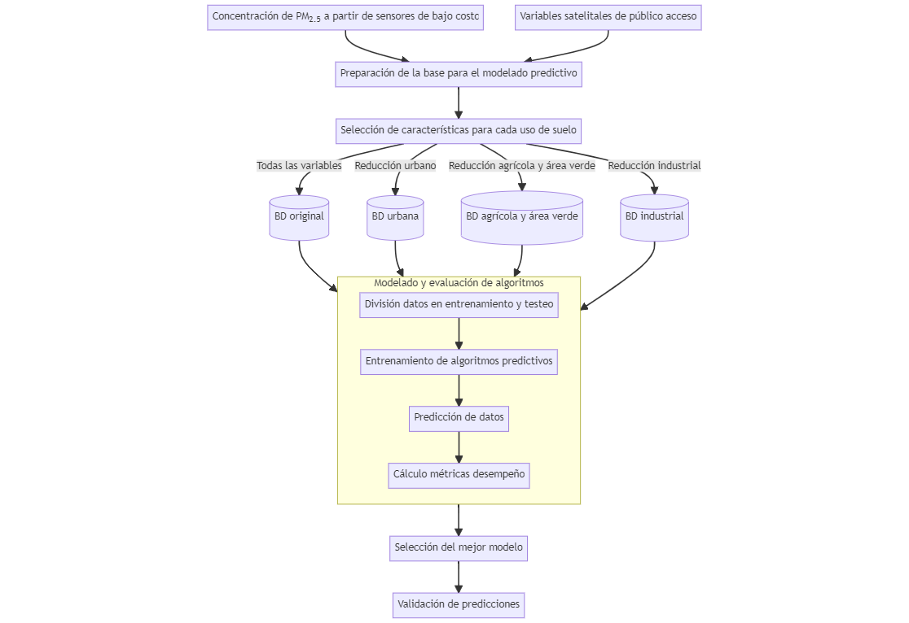
```
(ref:mod) Resumen gráfico del protocolo analítico desarrollado en el capítulo 5.

  La figura \@ref(fig:mod) ilustra el protocolo analítico desarrollado en este capítulo con el fin de estimar un modelo predictivo basado en variables satelitales y temporales relacionadas a la variación periódica para la estimación de la concentración de PM~2.5~ en el Área Metropolitana de Córdoba, Argentina. En primer lugar, se llevó a cabo el ajuste, evaluación y selección del modelo de mayor capacidad predictiva basado en variables meteorológicas, ambientales y temporales principalmente derivadas de satélites, para predecir la concentración de PM~2.5~ con un horizonte de predicción de cinco días de anticipación en cada uno de los usos de suelo. Finalmente, se procedió con un análisis de interpretación de los resultados obtenidos y su comparación con los resultantes en otras partes del mundo. 

### Enfoque de trabajo
  
  Como se menciono en el capítulo [4](#cap:var), la presente sección se haya enmarcada dentro de un enfoque computacional de aprendizaje automático. El objetivo principal que persigue es desarrollar un modelo predictivo de elevada exactitud, como consecuencia de esto, las variables relevantes para su desarrollo pueden no solo ser las recomendadas en la literatura.
  
  El procedimiento llevado a cabo a la hora de analizar los datos involucró distintas metodologías que es relevante mencionar de forma previa a la lectura del capítulo. En primera instancia cabe destacar que se compararon múltiples algoritmos de aprendizaje automático y profundo, con el objetivo de determinar cual de estos era el que mejor desempeño predictivo alcanzaba. La metodología de modelado abarco el desarrollo de un modelo predictivo que considera un desfasaje de 5 días, para permitir alertar a la población ante condiciones adversas de calidad de aire. A su vez, el modelado discriminó, o bien condicionó en función del uso de suelo, permitiendo ajustar distintos modelos predictivos para cada uno de los usos involucrados.  
  
  Además, se compararon múltiples alternativas de bases de datos a implementar como sustento del modelo predictivo. Las alternativas de bases de datos evaluadas fueron: la base de datos original, que contenía todas las variables predictoras descargadas y, una base de datos reducida (para cada uno de los usos de suelo), la cual se originó a través de la reducción de dimensionalidad por medio de técnicas de selección de características. Las variables incluidas en cada una de las bases de datos se encuentran mencionadas en el Anexo 1.

  Finalmente los algoritmos de aprendizaje automático evaluados fueron optimizados a través de la búsqueda de hiperparámetros e interpretados a través de la implementan del método de valores de las explicaciones aditivas de Shapley (SHAP).

### Base de datos

  La base de datos implementada en la presente sección es la misma que se implemento en el capítulo [4](#cap:var). Esta se obtuvo a partir de la combinación los datos recopilados durante el muestreo analizados en el capítulo [3](#cap:expl) y los datos satelitales y meteorológicos analizados en el capítulo [4](#cap:var). 
  
  Además de estas variables, las variables temporales (estación, mes, día del mes, día de la semana y hora de la lectura del contaminante) fueron incluidas en su forma categórica original y luego de ser codificadas de manera cíclica a través de la inclusión de sus senos y cosenos. Es importante destacar que todas las variables numéricas se estandarizaron, unificando los rangos de variabilidad. De esta forma, se evitaron los problemas de escala y se facilitó la comparación entre las variables.

### Protocolo estadístico

#### Métodos de inteligencia artificial comparados

  La **regresión lineal múltiple** (*multiple linear regression*) es una técnica estadística que se utiliza para modelar una variable dependiente como combinación lineal de múltiples variables independientes. Este tipo de análisis es aplicable tanto a datos de sección transversal como a series temporales [@aldas2017analisis]. El supuesto subyacente en el modelo es que existe una relación lineal entre la variable dependiente y las variables independientes. El aprendizaje de la interrelación entre las variables se logra mediante el ajuste de los coeficientes de regresión, estimados a partir de las observaciones. Los algoritmos de aprendizaje buscan determinar el hiperplano que mejor ajuste a los datos, lo cual implica encontrar coeficientes que minimicen la diferencia entre los valores observados y predichos por el modelo (Figura \@ref(fig:reglin)).

```{r reglin, echo=FALSE, out.width="100%", fig.align="center", fig.cap="(ref:reglin)"}
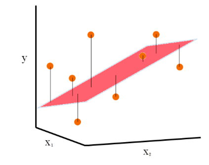
```
(ref:reglin) Diagrama de funcionamiento del algoritmo de regresión lineal múltiple.

  En esta investigación se emplearon diversos algoritmos de ajuste para la regresión lineal múltiple. El primero fue el método de mínimos cuadrados ordinarios, el cual deriva en un modelo lineal cuyos coeficientes resultantes minimizan la suma de los residuos cuadrados entre los valores observados y los valores predichos. Este es el método más clásico empleado para el ajuste de modelos de regresión lineal múltiple y proporciona estimaciones insesgadas y eficientes de los coeficientes.
  
  Otro algoritmo implementado fue la regresión de Ridge, la cual agrega un término de penalización al tamaño de los coeficientes estimados [@saunders1998ridge], lo cual significa que la función que se busca minimizar se encuentra además penalizada por un parámetro de complejidad que regula la cantidad de contracción de los parámetros. Este algoritmo es útil en los casos en que existe colinealidad entre las variables predictoras y proporcionando un modelo más robusto que el de mínimos cuadrados ordinarios.

  También se evaluó la alternativa de regresión de Lasso, que incluye un término de penalización distinto en la función a minimizar, que busca reducir la cantidad de variables que integran el modelo final al mínimo, reduciendo así la cantidad de variables involucradas en la predicción [@tibshirani1996regression, @santosa1986linear]. Este algoritmo es útil cuando se desea seleccionar un subconjunto de variables predictoras, proporcionando un modelo de mayor interpretabilidad.
  
  Además, se empleó el algoritmo de descenso por el gradiente estocástico, que es una alternativa simple y efectiva para ajustar modelos de regresión lineal múltiple [@bottou2007tradeoffs], particularmente útil cuando el conjunto de datos es de grandes dimensiones y complejidad, ya que permite un procesamiento eficiente y escalable.

  Finalmente, se implementó el algoritmo de red elástica, que combina las regularizaciones y penalizaciones introducidas por los métodos de regresión Ridge y Lasso [@zou2005regularization], que permite estimar un modelo que cuente con las ventajas de ambos métodos, la estabilidad de Ridge y la capacidad de selección de características de Lasso.

  Las **máquinas de vectores de soporte** (*support vector machine (SVM)*) es otro algoritmo de aprendizaje supervisado que puede ser empleado tanto para la clasificación como para la regresión. A diferencia de los modelos de regresión lineal, cuyo objetivo es ajustar un hiperplano en el espacio de las variables predictoras, las SVM buscan encontrar un hiperplano en un espacio de características de mayor dimensión (Figura \@ref(fig:svm)). En el caso de la regresión, el objetivo del SVM es ajustar un hiperplano a partir de las muestras de entrenamiento, construyendo márgenes alrededor que garanticen un ajuste de mayor flexibilidad. El algoritmo original de SVM fue propuesto en 1995 [@cortes1995support], y desde entonces ha sido ampliamente utilizado en la práctica debido a su capacidad para manejar eficazmente grandes conjuntos de datos y por su rendimiento en la resolución de problemas de clasificación y regresión. Su popularidad radica en la introducción del concepto de núcleo (*kernel*), el cual permite mapear los datos a un espacio de características de mayor dimensión donde estos pueden ser representados de forma lineal, incluso cuando en el espacio original de los datos no hay relaciones lineales. 

```{r svm, echo=FALSE, out.width="100%", fig.align="center", fig.cap="(ref:svm)"}
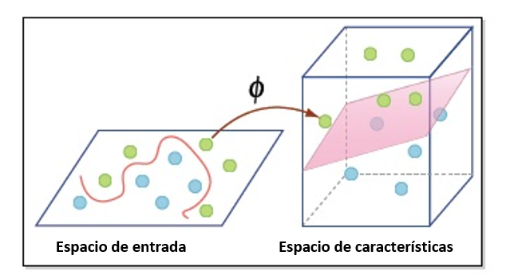
```
(ref:svm) Diagrama de funcionamiento del algoritmo de máquinas de vectores de soporte.

  El algoritmo de **k vecinos más cercanos** (*k nearest neighbours (KNN)*) es un método de aprendizaje perezoso basado en instancias. Es capaz de aprender funciones objetivo complejas sin hacer suposiciones sobre la distribución de los datos, lo que lo hace útil en problemas de regresión no lineal [@fix1985discriminatory]. En estos casos, su funcionamiento se encuentra basado en el calculo de las distancias entre la consulta realizada y los datos de entrenamiento. De forma selecciona los K ejemplos de mayor similitud a la consulta y, a través de una operación de promediación, estima la respuesta. Por ejemplo, si suponemos que la cantidad de vecinos a consultar es de 3 (k=3), la figura \@ref(fig:knn) muestra como seria el cálculo de una predicción para un dato desconocido. En lugar de generar una función que describa la relación entre las variables de entrada y salida, KNN guarda en memoria las muestras de entrenamiento y busca en esta base la respuesta más cercana para cada consulta de entrada. Este enfoque lo hace especialmente útil para problemas de regresión donde la estructura subyacente del problema es compleja y no se conoce a priori.
  
```{r knn, echo=FALSE, out.width="100%", fig.align="center", fig.cap="(ref:knn)"}
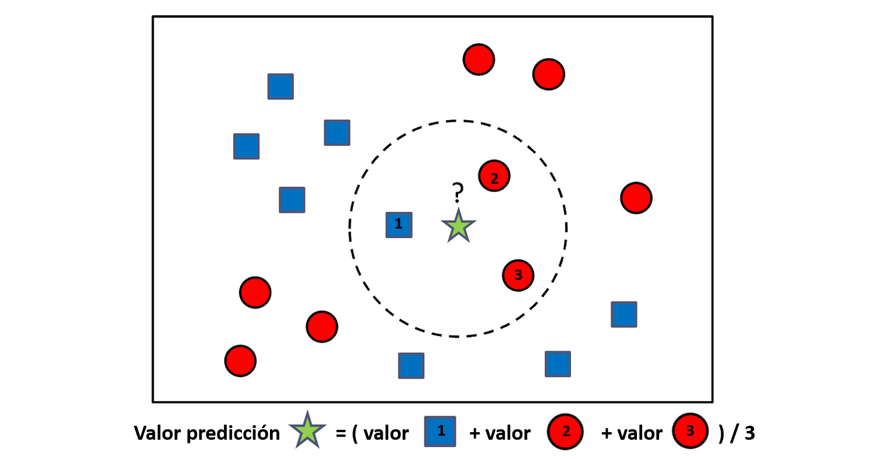
```
(ref:knn) Diagrama de funcionamiento del algoritmo de k vecinos más cercanos.
  
  En los últimos años ha aumentado el interés en los métodos de aprendizaje automático que usan ensambles de modelos como los **bosques aleatorios** (*random forest*) [@breiman1996bagging]. Estos métodos combinan los resultados de múltiples modelos independientes para mejorar el rendimiento predictivo del modelo ensamblado (Figura \@ref(fig:rfalgo)). Uno de los métodos de ensamblado más reconocido es el empaquetado (*bagging* o *bootstrap aggregating*) [@breiman1996bagging]. El empaquetado crea múltiples conjuntos de datos mediante remuestreo con reemplazo de los datos de entrenamiento. Al combinar los resultados de los modelos estimados en cada uno de los conjuntos de datos obtenidos por remuestreo, se aumenta la estabilidad y precisión de las predicciones, porque se reduce la varianza.
 
```{r rfalgo, echo=FALSE, out.width="100%", fig.align="center", fig.cap="(ref:rfalgo)"}
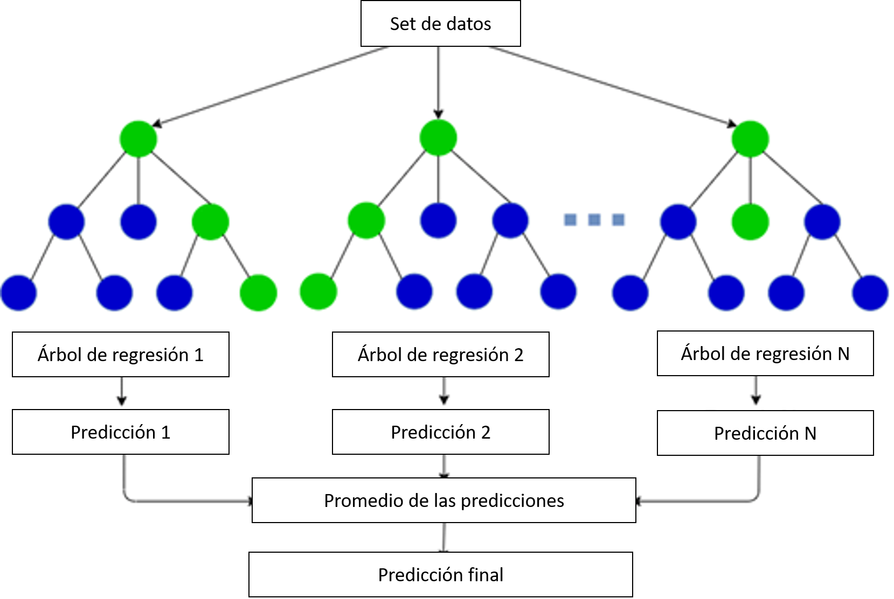
```
(ref:rfalgo) Diagrama de funcionamiento del algoritmo de bosques aleatorios.

  Posteriormente, Breiman [@breiman2001random] propuso el modelo de bosques aleatorios, que añade una capa de aleatoriedad en las variables de entrada a cada uno de los empaquetados, proporcionando mayor robustez contra el sobreajuste. Al ajustar el modelo, se considera un número limitado de variables predictoras elegidas aleatoriamente. Esta aleatoriedad hace que cada uno de los subconjuntos de datos considere distintos subconjuntos de variables predictoras garantizando mayor independencia entre los modelos estimados a partir de las distintos subconjuntos generados por el remuestreo.

  En resumen, el algoritmo de bosques aleatorios combina los resultados de múltiples árboles de regresión independientes, cada uno generado sobre distintos subconjuntos de datos creados a partir de los datos originales y agrega las predicciones resultantes de los distintos árboles a través de un promedio.

  Dentro de las técnicas de *boosting*, una de las más utilizadas es la de las **máquinas de aumento de gradiente** (*gradient boosting machines (GBM)*), propuesta por Friedman (2001). Su principio de funcionamiento esta basado en el agregado secuencial de nuevos modelos de árbol al conjunto (*enseamble*), permitiendo reducir el sesgo de los estimadores previamente ajustados, representado por medio de una función de error (Figura \@ref(fig:gbm)). Cada nuevo árbol se entrena con respecto al error del conjunto hasta esa iteración del modelo [@friedman2001greedy].

```{r gbm, echo=FALSE, out.width="100%", fig.align="center", fig.cap="(ref:gbm)"}
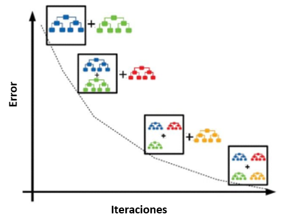
```
(ref:gbm) Diagrama de funcionamiento del algoritmo de máquinas de aumento de gradiente.

  En los problemas de regresión, la función de error objetivo a optimizar es el clásico error cuadrático medio o su raíz. Sin embargo, uno de los mayores desafíos en el modelado por aprendizaje automático es la capacidad de generalizar, ya que los modelos pueden sesgarse durante el aprendizaje, dando como resultado modelos inadecuado que sobre ajustan. Para mitigar los efectos del sobreajuste, Friedman propuso la técnica de contracción, con el objetivo de controlar la complejidad del modelo [@friedman2001greedy]. Este enfoque de regularización actúa penalizando los coeficientes de regresión reduciendo el impacto de las variables con coeficientes inestables. En el contexto del GBM, la contracción penaliza la importancia de los árboles individuales en cada paso consecutivo. La función objetivo final del modelo consta de dos términos: una función de pérdida de entrenamiento representada por error cuadrático clásico y la regularización que mide la complejidad del modelo.

  En resumen, el GBM es una técnica de aprendizaje automático que ha demostrado ser efectiva en la creación de modelos predictivos precisos, gracias a su capacidad de reducir el sesgo de los estimadores previamente ajustados y controlar la complejidad del modelo para evitar el sobreajuste. La técnica de contracción es fundamental en la regularización de este modelo y garantiza una mejor generalización de los resultados.

  Las **redes neuronales artificiales** (*artificial neural networks (ANN)*) son algoritmos que permiten modelar procesos no lineales de manera eficiente, a partir de la información de entrada recolectada a través de un vector denominado capa de entrada. Una vez ingresada la información se propaga y fluye capa a capa de la red, estableciendo las relaciones entre la capa de entrada y la capa final denominada de salida. El aprendizaje de las interrelaciones entre las variables predictoras se desarrolla a través del ajuste de parámetros característicos de este tipo de modelo denominados pesos sinápticos. Las capas intermedias u ocultas consisten en múltiples unidades denominadas neuronas que se encuentran interconectadas con las neuronas de las capas anterior y posterior. El número de capas ocultas y el número de neuronas en cada una de ellas define la topología de la red (Figura \@ref(fig:redalgo)). Cada neurona genera una respuesta excitatoria a las señales recibidas por medio de una función de activación. Existen distintas funciones, de las cuales algunas pueden resultar más recomendadas para un objetivo y problema en particular [@bishop1995neural; @hayakin1999learn]. 

  El aprendizaje de la red se basa en capturar las relaciones entre la capa de entrada y de salida a partir de la optimización de una métrica de error. En los problemas de regresión la métrica más implementada es la raíz del error cuadrático medio (*RMSE*), la cual se calcula comparando las salidas predichas por la red con los valores observados. A partir de la pérdida registrada es que se genera una actualización de los pesos sinápticos mediante el algoritmo de retropropagación (*backpropagation*) [@rumelhart1986learning]. Una de las mayores dificultades de este tipo de enfoque es encontrar la topología de red que mejor ajuste a los datos. Este proceso normalmente se aborda a partir del ajuste iterativo de múltiples arquitecturas. Generalmente, se parte de una red simple de una capa oculta y pocas neuronas, y se procede aumentando la complejidad de la red (incrementando secuencialmente el número de neuronas, así como el número de capas ocultas) hasta obtener un modelo satisfactorio que optimice los resultados.

  Las **redes neuronales recurrentes** (*recurrent neural network (RNN)*), a diferencia de las tradicionales, incluyen bucles o conexiones entre unidades que permiten que la información persista en los sucesivos capas de la red (Figura \@ref(fig:redalgo)). La capacidad de incorporar información sobre el contexto pasado en sus sucesivas salidas las hace especialmente prometedores para tareas en las que la información pasada es relevante para la predicción, como en el caso de series temporales. Las *RNN* pueden ser consideradas como múltiples copias de la misma red neuronal actuando conjuntamente, cada una de las cuales transfiere información a su sucesora y forma una arquitectura en cadena capaz de preservar la información de la secuencia. Las *RNN* son eficientes implementando información pasada en un intervalo de tiempo corto, es decir reciente, para realizar una tarea de predicción. Sin embargo, la información relevante no siempre esta cercana al pasado y, a medida que aumenta el intervalo de tiempo, las *RNN* no logran conectar la información para realizar las predicciones, de esta forma disminuye su capacidad predictiva cuando la información importante se encuentra contenida en mayores desfasajes de tiempo. 
 
```{r redalgo, echo=FALSE, out.width="100%", fig.align="center", fig.cap="(ref:redalgo)"}
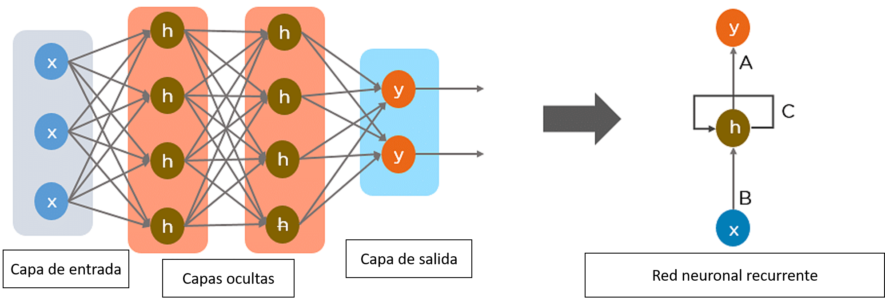
```
(ref:redalgo) Diagrama de funcionamiento del algoritmo de redes neuronales recurrentes.

  Para solventar esta falencia, en 1997 fueron introducidas las **redes de memoria a corto plazo** (*Long Short-Term Memory (LSTM)*) por Hochreiter y Schmidhuber [@hochreiter1997long] y mejoradas en el 2000 por Gers et al. [@gers2000learning]. Estas son una variación de las *RNN* capaz de aprender dependencias de largo plazo, gracias a la inclusión de unidades especiales llamadas bloques de memoria. Además, de otras unidades multiplicativas llamadas puertas que controlan el flujo de información de una unidad *LSTM* a otra. Una variante de este tipo de red es la **red recurrente con compuerta** (*Gated Recurrent Unit (GRU)*), introducidas por Cho et al. [@cho2014properties], las cuales mantienen las características propias de las *LSTM* con una estructura más simple, reduciendo la cantidad de parámetros a ajustar y permitiendo una ejecución de mayor rapidez y eficiencia. 

#### Metodología de modelado
 
  Se evaluaron múltiples alternativas para desarrollar el ajuste del modelo predictivo de concentración de PM~2.5~, entre ellas distintas formas de condicionarlo, con el objetivo de aumentar el desempeño en la obtención de predicciones. Se generaron modelos para cada estación del año (4 modelos predictivos), día de la semana (7 modelos predictivos), mes del año (12 modelos predictivos), hora del día (24 modelos predictivos) y uso de suelo (2 modelos predictivos). Mediante estadística descriptiva se determinó que el uso del suelo es una fuente de variación importante de las series temporales de PM~2.5~. Y por ello el desarrollo del algoritmo predictivo fue llevado a cabo condicionado por esta variable, de forma que se entrenaron dos algoritmos predictivos, uno para cada uno de los usos de suelo presente en la base de datos.
   
  El entrenamiento de los algoritmos predictivos se realizó con un desfasaje de la variable respuesta respecto a las predictoras de 120 horas, es decir, cinco días, con el objetivo de obtener un modelo predictivo que permita disponer de predicciones de concentración de contaminantes atmosféricos con cinco días de anticipación.

#### Selección de variables 

  Fueron analizadas dos alternativas respecto de la cantidad de variables predictoras a incluir en el modelado predictivo (base original y base reducida). Para la reducción de la cantidad de variables se implementó una combinación de múltiples algoritmos de selección de características, estos fueron:  

  El algoritmo *featurewiz* [@bakheet2023hybrid; @novaes2022modelo; @hu2023glass], surge de la combinación de dos algoritmos de selección de características. En primer lugar, emplea el algoritmo de *SULOV* (*Searching for Uncorrelated List of Variables*), el cual se encuentra basado en el algoritmo de *MRMR* (*Minimum-Redundancy-Maximum-Relevance*) [@radovic2017minimum]. Este permite reducir la base de datos a un número óptimo de variables no correlacionadas que contienen la máxima información mutua con respecto a la variable respuesta. Una vez que *SULOV* ha seleccionado las variables más relevantes, se emplea un método de eliminación recursiva de variables (*RFE* de *Recursive Feature Elimination*). La *RFE* es un método de selección de características que ajusta de forma iterativa un algoritmo predictivo a una base de datos, eliminando aquellas características de menor importancia, hasta alcanzar el número optimo de variables que permiten maximizar el desempeño predictivo. El algoritmo de *featurewiz* emplea una eliminación recursiva basada en el algoritmo predictivo de *XGBoost*, el cual es un método de ensamblado (*ensamble*) perteneciente a la familia de los algoritmos de *boosting*, cuya característica principal es que el entrenamiento del modelo predictivo se genera de forma secuencial [@chen2015xgboost; @chen2016xgboost]. De esta forma, el algoritmo de *featurewiz* posteriormente a la reducción por *SULOV* aplica un algoritmo de *XGBoost Recursivo*. De esta forma, el algoritmo logra encontrar el conjunto óptimo de características, que permite entrenar un modelo de aprendizaje automático robusto.

  El algoritmo de *Boruta*, basado en el método de aprendizaje automático de bosques aleatorios, cuyo objetivo es captar las variables más importantes para explicar la variable respuesta a partir de las características de la base de datos. Su algoritmo de búsqueda se basa en el ajuste de este modelo de aprendizaje automático en la base original y en una base de datos creada a partir de la mezcla aleatoria de las realizaciones de las variables. A partir de la comparación del desempeño de los distintos algoritmos ajustados y la importancia otorgada a cada una de las variables involucradas, determina cuáles son las variables de mayor relevancia en la base de datos. 
  
  Finalmente, se implementó un algoritmo alternativo a *Boruta*, cuya variación reside en su paso inicial, el cual busca una reducción de las variables en función del coeficiente de correlación de Pearson. Este algoritmo busca eliminar las variables en la base de datos que se encuentren fuertemente correlacionadas, priorizando conservar aquellas de mayor correlación con la variable respuesta. Posteriormente, implementa el algoritmo de eliminación recursiva basado en bosques aleatorios implementado por *Boruta* para determinar cuáles son las variables más importantes en la base de datos.

  Para crear la base de datos reducida final, se optó por combinar los resultados obtenidos por los tres métodos de reducción de dimensionalidad. El procedimiento acatado fue otorgar un punto a cada una de las variables seleccionadas por cada uno de los métodos. Para el set de datos Reducido se filtraron todas las variables predictoras cuya sumatoria de puntos era igual a tres, es decir que fueron seleccionadas de forma independiente por todos los algoritmos de reducción, mientras que para el set de datos Original se consideraron todas las variables presentes en la base de datos. 

  Las variables incluidas en cada una de las bases de datos original y reducida por selección de características, para cada uno de los usos de suelo se encuentran descriptas en el Anexo 1.

#### Metodología de entrenamiento
 
  La metodología implementada para llevar a cabo el ajuste y evaluación de los modelos predictivos, constó en un procedimiento iterativo de división de datos, entrenamiento del modelo y evaluación por medio de las métricas de desempeño. La base de datos fue dividido en subconjuntos de entrenamiento, validación y testeo a partir de un muestreo aleatorio estratificado por meses, días y horas. Esta estratificación buscó maximizar la representatividad de las distintas condiciones temporales existentes en los distintos subconjuntos de datos para el ajuste del modelo predictivo. Las respectivas proporciones de los datos para cada uno de los subconjuntos (entrenamiento, validación y testeo), fue de 70%, 15% y 15%, respectivamente. Posteriormente se procedió a ajustar cada uno de los algoritmos de modelado predictivo en la base de datos de entrenamiento y validación. Una vez entrenados los modelos se prosiguió con el cálculo de las predicciones tanto en la base de datos de entrenamiento como en la de testeo, a partir de estas predicciones se llevó a cabo el cálculo de las métricas de desempeño en ambas particiones de los datos. Este procedimiento de entrenamiento y evaluación del modelo predictivo fue realizado de forma iterativa un total de diez veces por medio de la variación de las semillas aleatorias que determinaron las particiones que dieron origen a cada uno de los subconjuntos de datos. Finalizada la iteración, se llevo a cabo el cálculo promedio de las métricas de desempeño para las diez corridas del procedimiento tanto para la base de datos de entrenamiento como la de testeo. Finalmente se compararon los resultados promedio de las métricas de desempeño a partir de los cuales se determino cual de los algoritmos predictivos fue el que generó el ajuste de mayor capacidad predictiva.
  
#### Optimización modelo predictivo
 
  Todos los algoritmos predictivos ajustados fueron optimizados durante el procedimiento iterativo de entrenamiento y evaluación a partir de las particiones de entrenamiento y validación. Esta optimización se llevo a cabo variando los valores de los hiperparámetros, hasta obtener los valores de los mismos que garantizaron el ajuste de mayor desempeño predictivo. Además, para el caso de las redes neuronales se profundizó en el estudio de diferentes arquitecturas para llevar a cabo el modelado predictivo. 
  
#### Críterio para interpretar los resultados del modelo

  Las contribuciones de cada una de las variables a las predicciones se cuantificaron con el método de los valores de las explicaciones aditivas de Shapley (SHAP) [@lubo2020machine]. Los valores SHAP son una medida de atribución a las variables que permite interpretar modelos complejos de aprendizaje automático. Cada valor SHAP es la contribución de cada variable independiente a una predicción individual específica, para el caso de la concentración de PM~2.5~, en unidades de $\frac{\mu g}{m^3}$. En concreto, el valor SHAP para un predictor y una observación dada es la diferencia existente en los resultados de predicción entre un modelo que se ajusta incluyendo y excluyendo a dicho predictor. Para cada observación, la suma de todos los valores SHAP, más la media general (concentración media global de PM~2.5~ en los datos de entrenamiento), es igual a la predicción del modelo predictivo. La matriz resultante de los valores SHAP puede resumirse para comprender cómo contribuye cada predictor a las predicciones resultantes. El valor SHAP absoluto medio de todas las observaciones resume la contribución global de cada variable predictora, y es posible una interpretación local del modelo mediante la visualización a través de un gráfico de dispersión que compare los valores de dicha variable y la contribución SHAP que generan dichos valores.

```{r shapalgo, echo=FALSE, out.width="100%", fig.align="center", fig.cap="(ref:shapalgo)"}
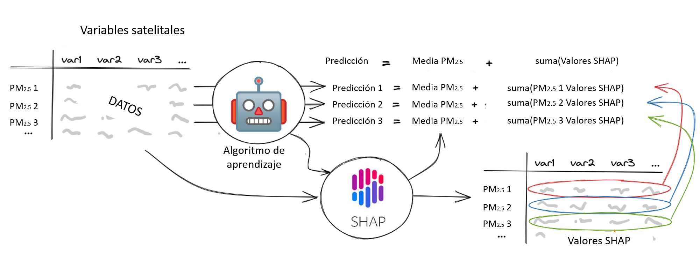
```
(ref:shapalgo) Diagrama de funcionamiento del algoritmo de valores SHAP.

#### Evaluación del modelo predictivo

  Para comparar el desempeño predictivo de los distintos algoritmos ajustados tanto en el conjunto de datos de entrenamiento como en el de testeo, se implementó la métrica de rendimiento raíz del error cuadrático medio de predicción ($RMSE$), la cual se deriva  a partir del error cuadrático medio ($MSE$).
  
  Error cuadrático medio (*mean squared error (MSE)*): es un estimador que mide el promedio de los errores al cuadrado, es decir, la diferencia entre el valor observado y su predicción por el modelo. Es una función de riesgo, correspondiente al valor esperado de la pérdida del error al cuadrado o pérdida cuadrática. Mientras menor es su valor, más exactos serán los pronósticos del modelo predictivo [@lehmann2006theory].
  
\begin{equation*} 
\sum_{i=1}^{N}(y_i-\hat{y_i})^2
\end{equation*} 

  Raíz del error cuadrático medio (*root mean squared error ($RMSE$)*): expresa el promedio de la diferencia cuadrática entre los valores predichos por el modelo y los valores observados [@hyndman2006effect]. Esta es siempre no negativa, y un valor de 0 (poco común en la práctica) indicaría un ajuste perfecto a los datos. Generalmente, mientras menor $RMSE$ mejor ajuste o mayor exactitud en las predicciones. Esta métrica es sensible a valores atípicos y pone mayor peso en los grandes errores, ya que su coeficiente elevado al cuadrado influirá notablemente en el resultado [@lehmann2006theory; @pontius2008components; @willmott2006use].

\begin{equation*} 
RMSE = \sqrt{\frac{1}{n}\sum\nolimits_{i=1}^N(y_i-\hat{y_i})^2}
\end{equation*}

  Además, cabe destacar que para abordar la comparación de la capacidad predictiva de los modelos ajustados se implemento una línea de base contra la cual contrastar los algoritmos ajustados. Esta refiere a un modelo de referencia (*base line*), que predice la concentración de PM~2.5~ para la hora que no se tiene dato como la media de la concentración en la hora anterior y posterior. Cabe destacar que esta predicción no es posible en la práctica, ya que no se dispone de datos de concentración de PM~2.5~ en tiempo real. Un desempeño superior o similar al de este modelo de referencia refleja una elevada capacidad predictiva del modelo ajustado. 
  
## Resultados

### Modelado de PM~2.5~ en entornos urbanos

#### Comparación de algoritmos para el uso de suelo **urbano** 

  En esta sección se desarrolló el modelado predictivo de la concentración de PM~2.5~ a partir de las base de datos original y reducida. La base de datos original involucró todas las variables independientes (193), mientras que la reducida contó con un total de 77 variables. Una descripción detallada de cada una de ellas puede hallarse en el Anexo 1.

Table: Métricas de ajuste de modelos predictivos aplicados en el contexto de aprendizaje automático al set de datos de testeo para el uso de suelo urbano. Los valores de *RMSE* se encuentran en las mismas unidades que la concentración de PM~2.5~, es decir [$\frac{\mu g}{m^3}$]. \label{tab:modurb}
Referencias: raíz del error cuadrático medio ($RMSE$) y error cuadrático medio ($MSE$).

| Modelo  | Set de datos | *RMSE* | *MSE* |
|------------------------------|:--------------:|:-------:|:-------:|
| Redes neuronales recurrentes | Original | 3.441 | 11.840 |
| Redes neuronales recurrentes | Reducido | 3.533 | 12.482 |
| K vecinos más cercanos | Original | 3.552 | 12.617 |
| K vecinos más cercanos | Reducido | 3.602 | 12.974 |
| Bosques Aleatorios | Original | 4.101 | 16.818 |
| Bosques Aleatorios | Reducido | 4.317 | 18.636 |
| Regresión de Soporte Vectorial | Reducido | 5.692 | 32.399 |
| Regresión de Soporte Vectorial | Original | 5.772 | 33.316 |
| GBM ligero | Original | 7.123 | 50.737 |
| GBM ligero | Reducido | 7.283 | 53.042 |
| Regresión lineal | Original | 8.029 | 64.465 |
| Regresión Ridge | Original | 8.029 | 64.465 |
| Regresión SGD | Original | 8.03 | 64.481 |
| Regresión SGD | Reducido | 8.26 | 68.228 |
| Regresión lineal | Reducido | 8.304 | 68.956 |
| Regresión Ridge | Reducido | 8.304 | 68.956 |
| Regresión Lasso | Original | 9.011 | 81.198 |
| Regresión Lasso | Reducido | 9.023 | 81.415 |
| Regresión de red elástica | Original | 9.853 | 97.082 |
| Regresión de red elástica | Reducido | 9.853 | 97.082 |
|  |  |  |  |  |
| *Modelo de referencia* | Base | 3.676 | 13.585 |

  Los resultados observados en la tabla \@ref(tab:modurb) muestran que el algoritmo predictivo de mayor desempeño para el uso de suelo urbano fueron las redes neuronales recurrentes en sus versiones bajo la base de datos original y reducida. El gran desempeño predictivo demuestra como las características propias de aprendizaje del algoritmo logran captar las fuentes de variabilidad y realizar estimaciones acertadas de la variable respuesta. 
 
  Además, puede notarse que el único algoritmo predictivo que también logra superar el modelo de referencia propuesto es el modelo de k vecinos más cercanos. Sin embargo, este algoritmo no garantiza el aprendizaje de la estructura de variabilidad presente en los datos, ya que su proceso de predicción consiste en encontrar las k observaciones más similares en la base de datos de entrenamiento y calcular su media para obtener la predicción final. Este algoritmo de modelado puede ser una forma novedosa y no convencional de calcular predicciones condicionadas por el parentesco entre los datos, a diferencia de los demás métodos que buscan calcular parámetros y pesos que les permiten inferir acerca de las interrelaciones entre las variables. 

  Para evitar caer en interpretaciones sesgadas respecto de la relación de vinculación que guardan las variables, se optó por seleccionar el modelo predictivo desarrollado sobre la base de datos reducida. Esto es así, ya que el modelo sobre la base de datos original, al contar con un número superior de variables predictoras, aumenta drásticamente el espacio de posibles soluciones que pueden encontrarse, pudiendo existir soluciones en las cuales se atribuya importancia a variables de forma equivocada. Cabe destacar que la base de datos reducida cuenta con las variables más importantes seleccionadas a partir de la combinación de múltiples algoritmos de selección de características. De esta forma al modelar sobre la misma, el espacio de posibles soluciones ya se encuentra reducido a uno en el cual todas las posibles involucran las variables de mayor importancia en la base de datos. Además, puede apreciarse que la diferencia en la precisión promedio de los algoritmos predictivos entre ambas bases de datos es baja, 0.112 $\frac{\mu g}{m^3}$. Tomando en consideración que la base de datos reducida involucra un 60% menos de variables, se asume que se introduce un menor porcentaje de ruido al modelado. Por este motivo, además de encontrar soluciones de mayor relevancia, permite reducir la complejidad y el tiempo de ejecución en el entrenamiento del modelo predictivo. Otra ventaja de la base de datos reducida es que facilita notablemente la implementación del modelo en producción, ya que al involucrar un menor número de variables, es menor la descarga y procesamiento necesario para generar predicciones, además de simplificar la actualización (re entrenamiento) del mismo. 
 
  De esta forma, se seleccionó el algoritmo predictivo ajustado sobre la base de datos reducida, cuyas predicciones difieren en promedio de los valores reales medidos de concentración de PM~2.5~ en 3.533 $\frac{\mu g}{m^3}$.
 
#### Optimización del modelo predictivo

  Las redes neuronales recurrentes entrenadas en esta sección, se encuentran conformadas por un modelo apilado (múltiples capas superpuestas). Cada una de las capas del modelo apilado consta de una capa recurrente y una de dilución (*dropout*). Además, se evaluaron distintas metodologías de recurrencia implementando diferentes variantes de apilamiento para determinar si mejoraba el rendimiento del modelo.

Table: Métricas de ajuste de redes neuronales recurrentes con distintas arquitecturas en el contexto de aprendizaje automático en el set de datos de testeo para el uso de suelo urbano bajo la base de datos reducida. Los valores de *RMSE* se encuentran en las mismas unidades que la concentración de PM~2.5~, es decir [$\frac{\mu g}{m^3}$]. \label{tab:arqurb}
Referencia: metodología de recurrencia, cantidad de capas apiladas, *RMSE* y *MSE*. 

| Recurrencia | Capas | *RMSE* | *MSE* |
|--------|:-------:|:-------:|-------:|
| GRU | 3 | 3.491 | 12.187 |
| LSTM | 5 | 3.507 | 12.299 |
| GRU | 5 | 3.558 | 12.659 |
| LSTM | 4 | 3.568 | 12.731 |
| GRU | 4 | 3.61 | 13.032 |
| GRU | 2 | 3.633 | 13.199 |
| LSTM | 3 | 3.64 | 13.250 |
| LSTM | 2 | 3.772 | 14.228 |
| LSTM | 1 | 4.005 | 16.040 |
| GRU | 1 | 4.015 | 16.120 |
| RNN | 3 | 4.258 | 18.131 |
| RNN | 4 | 4.409 | 19.439 |
| RNN | 2 | 4.451 | 19.811 |
| RNN | 5 | 4.614 | 21.289 |
| RNN | 1 | 5.212 | 27.165 |

  La tabla \@ref(tab:arqurb) presenta el proceso de exploración de metodologías alternativas dentro de las redes neuronales recurrentes. Los resultados muestran que el mejor desempeño predictivo fue alcanzado por el modelo que involucra redes con compuerta (*GRU*). El modelo final resultante fue un modelo apilado compuesto por tres capas sucesivas, cada una de las cuales combina una capa de red neuronal con compuerta y una de dilución (*dropout*).

  Posteriormente, se llevaron a cabo experimentos para determinar los valores óptimos de los hiperparámetros del modelo. En la búsqueda se analizaron distintas combinaciones para el número de neuronas en las distintas capas y el porcentaje de neuronas apagadas en cada capa de dilución.
  
  Finalmente, el modelo de mejor ajuste quedó conformado en su primer aglomerado del apilamiento por un total de 200 neuronas en la capa con compuerta, seguido por una capa de dilución con un 30% de neuronas apagadas. Los dos aglomerados subsiguientes que dan estructura a esta red se encuentran conformados por un total de 100 neuronas en cada una de sus capas con compuerta y una capa de dilución con un 30% de porcentaje de neuronas apagadas. Previo a la capa de salida, se encuentra la estructura clásica de capa densa totalmente conectada que permite la combinación de los coeficientes aprendidos por la red para dar como resultado la predicción final.

  En términos de rendimiento, las predicciones del modelo de mejor ajuste difieren en promedio de los valores reales medidos de concentración de PM~2.5~ en 3.491 $\frac{\mu g}{m^3}$. Esto sugiere que el modelo es capaz de realizar predicciones precisas y puede ser utilizado en futuros estudios y aplicaciones en el monitoreo de la calidad del aire.
  
#### Entrenamiento del algoritmo predictivo resultante:

```{r aprendmodurb, echo=FALSE, out.width="100%", fig.align="center",fig.cap="(ref:aprendmodurb)"}
knitr::include_graphics("images/imagescap5/aprendmodurb.png")
```
(ref:aprendmodurb) Procedimiento de aprendizaje del modelo final en la base de datos de entrenamiento y validación.

  La figura \@ref(fig:aprendmodurb) ilustra el procedimiento de aprendizaje del modelo predictivo de mejor ajuste tanto en la partición de entrenamiento como en la de validación. En esta puede observarse cómo se da la reducción del error a lo largo del proceso de aprendizaje, indicando una mejoría en su capacidad de generalización a medida que se avanza en el aprendizaje. Además, puede apreciarse que el algoritmo finaliza su aprendizaje en el ciclo 283 por medio del mecanismo de frenado temprano (*early stopping*), demostrando la obtención de un modelo robusto al evitar el sobreajuste (*overfitting*).

#### Interpretación modelo predictivo:

#### Variables más importantes

  Exploración de las variables de mayor importancia dada su contribución a las predicciones.

```{r varimpurb, echo=FALSE, out.width="100%", fig.align="center",fig.cap="(ref:varimpurb)"}

```
(ref:varimpurb) Importancia relativa de las variables en las redes neuronales recurrentes para el uso de suelo urbano.

  A partir de la figura \@ref(fig:varimpurb) pueden apreciarse las cinco variables de mayor importancia relativa para el modelo predictivo en el uso de suelo urbano bajo la base de datos reducida. Dos de las variables se encuentran vinculadas a la escala temporal, destacando la dependencia de la variable respuesta respecto a sus patrones de variación temporal explorados en el capítulo [3](#cap:expl). Las variables restantes son satelitales vinculadas a la variabilidad estudiada en el capítulo [4](#cap:var). Los resultados muestran que las cinco variables de mayor importancia relativa reúnen menos del 25% de la misma. 
  
  A la hora de predecir la concentración de PM~2.5~ en entornos urbanos, es crucial considerar la hora del día, la radiación solar, la rugosidad de la superficie terrestre, el día de la semana y presión atmosférica. 
  
#### Gráfico de dependencia SHAP
  
  Análisis de los aportes de las variables satelitales más importantes a las predicciones para el uso de suelo urbano.
  
#### Radiación solar
  
```{r shapurbrad, echo=FALSE, out.width="100%", fig.align="center",fig.cap="(ref:shapurbrad)"}
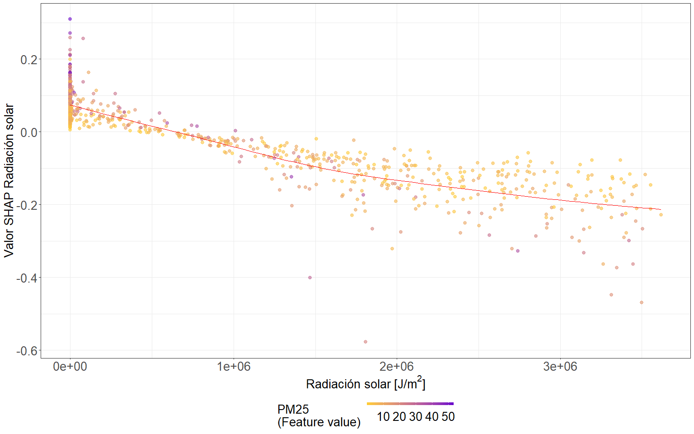
```
(ref:shapurbrad) Gráfico de la variable radiación solar contra su valor shap coloreado por el valor de PM~2.5~ para el uso de suelo urbano.

  La figura \@ref(fig:shapurbrad) muestra que valores de baja magnitud de radiación solar estan asociados a incrementos en las predicciones de la variable respuesta, mientras que valores de elevada estan asociados con menor concentración de PM~2.5~ predichas. De esta forma se aprecia una relación del tipo inversa similar a la identificada en el capítulo [4](#cap:var). Además, puede notarse como los valores de mayor concentración de PM~2.5~ se hallan localizados en las zonas de menor radiación solar, momento en el cual se favorecen mayores concentraciones de dicho contaminante, demostrando la elevada capacidad predictiva de la variable.

#### Rugosidad de la superficie terrestre

```{r shapurbrug, echo=FALSE, out.width="100%", fig.align="center",fig.cap="(ref:shapurbrug)"}
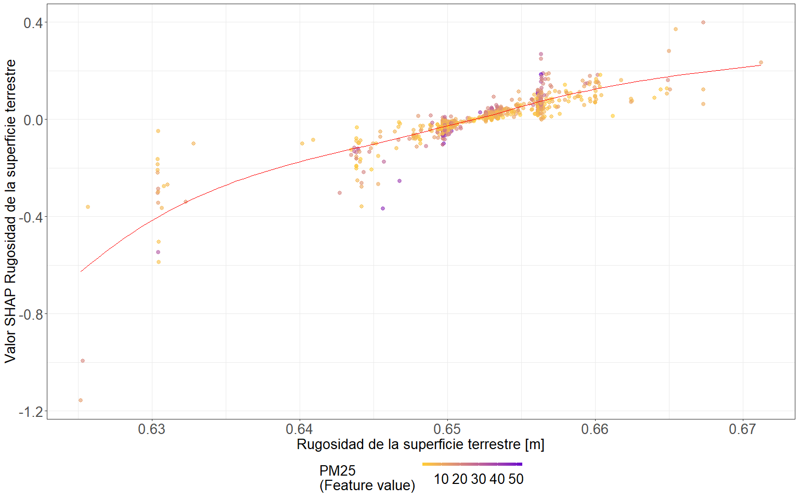
```
(ref:shapurbrug) Gráfico de la variable rugosidad de la superficie terrestre contra su valor shap coloreado por el valor de PM~2.5~ para el uso de suelo urbano.

  La figura \@ref(fig:shapurbrug) muestra que valores de baja magnitud de la rugosidad de la superficie terrestre se asocian con disminuciones en las predicciones de la variable respuesta, mientras que valores de elevada magnitud de la variable resultan en incrementos de las concentraciones de PM~2.5~ predichas. De esta forma se identifica una relación del tipo directa similar a la reportada en el capítulo [4](#cap:var).

#### Presión atmosférica ajustada al nivel del mar
  
```{r shapurbpresmar, echo=FALSE, out.width="100%", fig.align="center",fig.cap="(ref:shapurbpresmar)"}
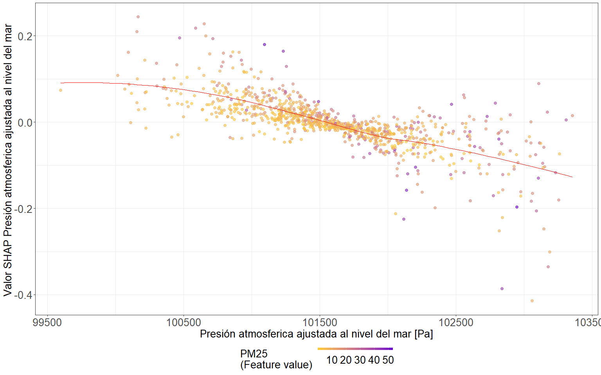
```
(ref:shapurbpresmar) Gráfico de la variable presión atmosférica ajustada al nivel del mar contra su valor shap coloreado por el valor de PM~2.5~ para el uso de suelo urbano.

  La figura \@ref(fig:shapurbpresmar) muestra que valores de baja magnitud de la presión atmosférica ajustada al nivel del mar favorecen incrementos en las predicciones de la variable respuesta, mientras que valores de elevada magnitud de la variable resultan en disminuciones de las concentraciones de PM~2.5~ predichas. De esta forma se identifica una relación del tipo inversa similar a la reportada en el capítulo [4](#cap:var).

###  Modelado de PM~2.5~ en entornos industriales

#### Comparación de algoritmos para el uso de suelo **industrial** 

  En esta sección se desarrolló el modelado predictivo de la concentración de PM~2.5~ a partir de las base de datos original y reducida. La base de datos reducida contó con un total de 53 variables. Una descripción detallada de cada una de ellas puede hallarse en el Anexo 1.

Table: Métricas de ajuste de modelos predictivos aplicados en el contexto de aprendizaje automático al set de datos de testeo para el uso de suelo industrial. Los valores de *RMSE* se encuentran en las mismas unidades que la concentración de PM~2.5~, es decir [$\frac{\mu g}{m^3}$]. \label{tab:modind}
Referencias: raíz del error cuadrático medio ($RMSE$) y error cuadrático medio ($MSE$).
 
| Modelo | Set de datos | *RMSE* | *MSE* |
|------------------------------|:--------------:|:-------:|:-------:|
| Redes neuronales recurrentes | Reducido | 6.171 | 38.081 |
| Redes neuronales recurrentes | Original | 6.193 | 38.353 |
| K vecinos más cercanos | Original | 6.248 | 39.038 |
| K vecinos más cercanos | Reducido | 6.263 | 39.225 |
| Bosques Aleatorios | Original | 6.523 | 42.550 |
| Bosques Aleatorios | Reducido | 6.547 | 42.863 |
| Regresión de Soporte Vectorial | Original | 7.876 | 62.031 |
| Regresión de Soporte Vectorial | Reducido | 8.023 | 64.369 |
| GBM ligero | Original | 9.344 | 87.310 |
| GBM ligero  | Reducido | 9.533 | 90.878 |
| Regresión lineal  | Original | 10.100 | 102.010 |
| Regresión Ridge  | Original | 10.100 | 102.010 |
| Regresión SGD  | Original | 10.110 | 102.212 |
| Regresión SGD | Reducido | 10.240 | 104.858 |
| Regresión Ridge  | Reducido | 10.330 | 106.709 |
| Regresión lineal | Reducido | 10.330 | 106.709 |
| Regresión Lasso  | Original | 10.920 | 119.246 |
| Regresión Lasso  | Reducido | 10.930 | 119.465 |
| Regresión de red elástica | Original | 11.820 | 139.712 |
| Regresión de red elástica | Reducido | 11.820 | 139.712 |
|  |  |  |  |  |
| *Modelo de referencia* | Base | 6.475 | 41.545 |

  En la tabla \@ref(tab:modind) se presentan los resultados obtenidos en el modelado predictivo de los datos provenientes del uso de suelo industrial, puede apreciarse que estos son similares a los obtenidos para el uso de suelo urbano (Tabla \@ref(tab:modurb)). En primer lugar, puede apreciarse que el mejor desempeño predictivo es alcanzado por las redes neuronales recurrentes, sugiriendo que este algoritmo es robusto y efectivo en la predicción de la concentración de material particulado fino. La principal diferencia radica en que el mejor desempeño en este caso es alcanzado sobre la base de datos reducida.
  
  Además, para este uso de suelo, puede notarse que el único algoritmo predictivo que también logra superar el modelo de referencia propuestos es el modelo de K vecinos más cercanos. Este a partir de la estimación de la media entre K observaciones logra una elevada capacidad predictiva, a pesar de esto no garantiza captar las interrelaciones existentes entre las variables. 
 
  Cabe destacar que los mejores resultados predictivos fueron obtenidos al emplear la base de datos reducida, proporcionando evidencia acerca de las ventajas de este tipo de base para el modelado predictivo. De esta forma, esta será la base de datos empleada para llevar a cabo el modelado y posteriormente analizar la relación de vinculación entre las variables.

  En cuanto a las predicciones del algoritmo seleccionado, se observa que difieren en promedio de los valores reales medidos de concentración de PM~2.5~ en 6.171 $\frac{\mu g}{m^3}$. Este resultado indica que el modelo seleccionado puede proporcionar estimaciones precisas de la concentración de PM~2.5~ en el uso de suelo industrial.

#### Optimización del modelo predictivo

Table: Métricas de ajuste de redes neuronales recurrentes con distintas arquitecturas en el contexto de aprendizaje automático en el set de datos de testeo para el uso de suelo industrial bajo la base de datos reducida. Los valores de *RMSE* se encuentran en las mismas unidades que la concentración de PM~2.5~, es decir [$\frac{\mu g}{m^3}$]. \label{tab:arqind}
Referencia: metodología de recurrencia, cantidad de capas apiladas, *RMSE* y *MSE*. 

| Recurrencia | Capas | *RMSE* | *MSE* |
|--------|:-------:|:-------:|-------:|
| GRU | 2 | 5.964 | 35.569 |
| GRU | 3 | 5.988 | 35.856 |
| LSTM | 2 | 6.074 | 36.893 |
| LSTM | 5 | 6.082 | 36.991 |
| GRU | 5 | 6.091 | 37.100 |
| LSTM | 3 | 6.11 | 37.332 |
| LSTM | 4 | 6.132 | 37.601 |
| GRU | 4 | 6.16 | 37.946 |
| LSTM | 1 | 6.191 | 38.328 |
| GRU | 1 | 6.471 | 41.874 |
| RNN | 2 | 6.598 | 43.534 |
| RNN | 3 | 6.628 | 43.930 |
| RNN | 4 | 6.857 | 47.018 |
| RNN | 5 | 6.927 | 47.983 |
| RNN | 1 | 7.683 | 59.028 |

  Los resultados de la tabla \@ref(tab:arqind) muestran que el mejor desempeño predictivo fue alcanzado por el modelo que involucra redes con compuerta (*GRU*). El modelo final resultante fue un modelo apilado de dos capas sucesivas, cada una de las cuales combina una capa de red neuronal con compuerta y una de dilución (*dropout*).
  
  Posteriormente, se llevaron a cabo experimentos para determinar los valores óptimos de los hiperparámetros del modelo. En la búsqueda se analizaron distintas combinaciones para el número de neuronas en las distintas capas y el porcentaje de neuronas apagadas en cada capa de dilución.

  Finalmente, el modelo de mejor ajuste quedo conformado en su primer aglomerado del apilamiento por un total de 200 neuronas en la capa con compuerta, seguido por una capa de dilución con un 30% de neuronas apagadas. La subsiguiente capa del aglomerado quedo conformada por un total de 100 neuronas en su capa con compuerta y un 30% de porcentaje de neuronas apagadas en su capa de dilución. Previo a la capa de salida, se encuentra la estructura clásica de capa densa totalmente conectada que permite la combinación de los coeficientes aprendidos por la red para dar como resultado la predicción final.

  En términos de rendimiento, las predicciones del modelo mejor ajuste difieren en promedio de los valores reales medidos de concentración de PM~2.5~ en 5.964 $\frac{\mu g}{m^3}$. 
  
#### Entrenamiento del algoritmo predictivo resultante:

```{r aprendmodind, echo=FALSE, out.width="100%", fig.align="center",fig.cap="(ref:aprendmodind)"}
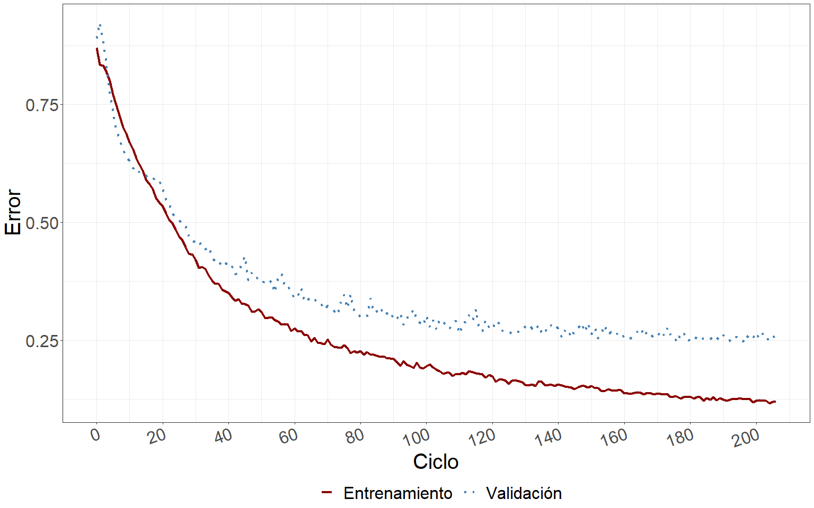
```
(ref:aprendmodind) Procedimiento de aprendizaje del modelo final en la base de datos de entrenamiento y validación industrial.

  La figura \@ref(fig:aprendmodind) ilustra el procedimiento de aprendizaje del modelo predictivo tanto en la partición de entrenamiento como en la de validación. En esta puede observarse cómo se da la reducción del error a lo largo del proceso de aprendizaje, indicando una mejoría en su capacidad de generalización a medida que se avanza en el aprendizaje. Además, puede apreciarse que el algoritmo finaliza su aprendizaje en el ciclo 207 gracias al mecanismo de frenado temprano (*early stopping*), demostrando la obtención de un modelo robusto al evitar el sobreajuste (*overfitting*).

#### Interpretación modelo predictivo:

#### Variables más importantes
  
  Exploración de las variables de mayor importancia dada su contribución a las predicciones.
 
```{r varimpind, echo=FALSE, out.width="100%", fig.align="center",fig.cap="(ref:varimpind)"}
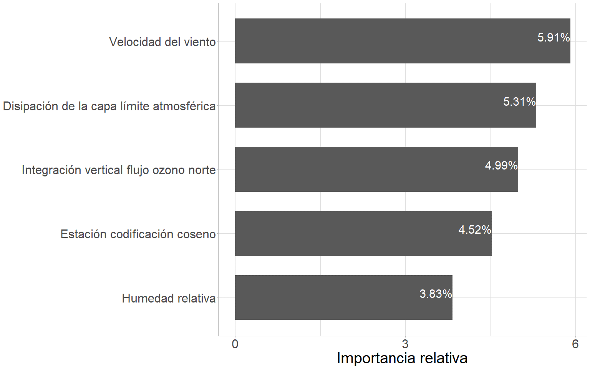
```
(ref:varimpind) Importancia relativa de las variables en las redes neuronales recurrentes para el uso de suelo industrial.

  A partir de la figura \@ref(fig:varimpind) pueden apreciarse las cinco variables de mayor importancia relativa para el modelo predictivo en el uso de suelo industrial bajo la base de datos reducida. Solo una de las variables se encuentra vinculada a la escala temporal, destacando la dependencia de la variable respuesta respecto a sus patrones de variación temporal explorados en el capítulo [3](#cap:expl). Las restantes son variables satelitales vinculadas a la variabilidad estudiada en el capítulo [4](#cap:var). Los resultados muestran que las cinco variables de mayor importancia relativa reúnen menos del 25% de la misma. 
  
  A la hora de predecir la concentración de PM~2.5~ en entornos industriales, es crucial considerar la velocidad del viento, la disipación en la capa límite atmosférica, el flujo de ozono, la estación del año y la humedad relativa.

#### Gráfico de dependencia SHAP
  
  Análisis de los aportes de las variables satelitales más importantes a las predicciones para el uso de suelo industrial.

#### Velocidad del viento
  
```{r shapindvvient, echo=FALSE, out.width="100%", fig.align="center",fig.cap="(ref:shapindvvient)"}
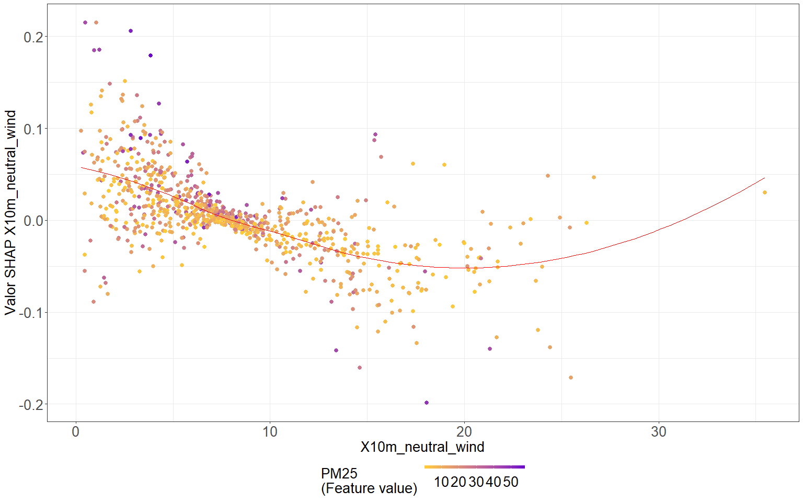
```
(ref:shapindvvient) Gráfico de la variable velocidad del viento contra su valor shap coloreado por el valor de PM~2.5~ para el uso de suelo industrial.

  La figura \@ref(fig:shapindvvient) muestra que valores de baja magnitud de velocidad del viento resultan en incrementos de las predicciones de la variable respuesta, mientras que valores de elevada magnitud de la variable promueven disminuciones en las concentraciones de PM~2.5~ predichas. De esta forma se identifica una relación del tipo inversa similar a la encontrada en el capítulo [4](#cap:var). Además, se puede apreciar como los valores de mayores concentraciones de PM~2.5~ se localizan en zonas de reducida velocidad del viento, demostrando la gran capacidad predictiva de la variable.  

#### Disipación en la capa límite atmosférica

```{r shapinddisip, echo=FALSE, out.width="100%", fig.align="center",fig.cap="(ref:shapinddisip)"}
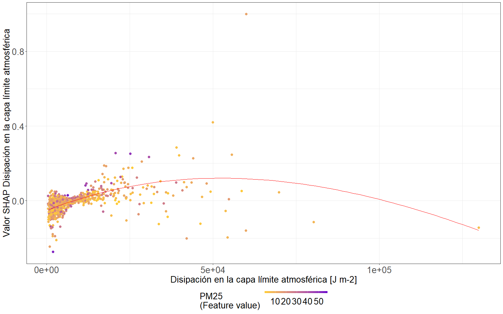
```
(ref:shapinddisip) Gráfico de la variable disipación en la capa límite atmosférica contra su valor shap coloreado por el valor de PM~2.5~ para el uso de suelo industrial.
  
  La figura \@ref(fig:shapinddisip) permite apreciar que el mayor porcentaje de los datos se encuentra concentrado en valores de baja magnitud de disipación en la capa límite atmosférica. No logra apreciarse una clara tendencia en cuanto al aporte de la variable predictora en el modelo predictivo dado a que en todo el rango de variación los aportes son tanto de incremento como de decremento de la concentración. Dada la inconsistencia existente en el rango de variación de los aportes, se concluye que para este modelo predictivo la importancia que adquiere la variable se encuentra vinculada al actuar conjunto con otras variables.

#### Integración vertical flujo ozono norte

```{r shapindoznor, echo=FALSE, out.width="100%", fig.align="center",fig.cap="(ref:shapindoznor)"}
knitr::include_graphics("images/imagescap5/shapindoznor.png")
```
(ref:shapindoznor) Gráfico de la variable integración vertical flujo ozono norte contra su valor shap coloreado por el valor de PM~2.5~ para el uso de suelo industrial.
  
  La figura \@ref(fig:shapurbrug) muestra que valores de baja magnitud de la integración vertical flujo ozono norte promueven disminuciones en las predicciones de la variable respuesta, mientras que valores elevada magnitud de la variable resultan en incrementos de las concentraciones de PM~2.5~ predichas. De esta forma se identifica una relación del tipo directa similar a la reportada en el capítulo [4](#cap:var).

#### Humedad relativa
  
```{r shapindhum, echo=FALSE, out.width="100%", fig.align="center",fig.cap="(ref:shapindhum)"}
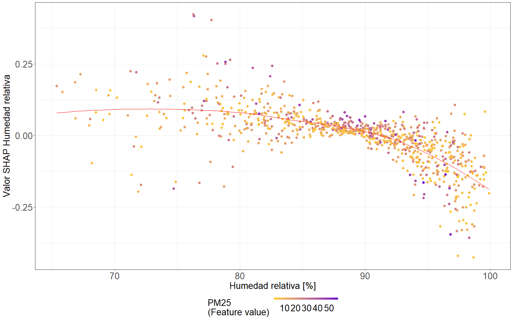
```
(ref:shapindhum) Gráfico de la variable humedad relativa contra su valor shap coloreado por el valor de PM~2.5~ para el uso de suelo industrial.
  
  La figura \@ref(fig:shapindhum) muestra que valores menores al 90% de humedad relativa favorecen incrementos de las concentraciones de material particulado fino, mientras que humedades relativas mayores tienden a favorecer decrementos de la concentraciones. Además, puede apreciarse una mayor densidad de valores de elevada concentración de PM~2.5~ entre el 80% y 90% de humedad relativa. De esta forma se concluye que para este modelo predictivo valores por encima del 90% de humedad relativa favorecen la remoción de material particulado, mientras que valores por debajo de este límite favorecen aportes a la concentración de dicho contaminante. Esta figura permite concluir que la relación de vinculación que prevalece en el modelo es la inversa, la cual fue la que menor magnitud reporto en el capítulo [4](#cap:var).

###  Modelado de PM~2.5~ en entornos agrícola y área verde

#### Comparación de algoritmos para el uso de suelo **agrícola/ área verde** 

  En esta sección se desarrolló el modelado predictivo de la concentración de PM~2.5~ a partir de las base de datos original y reducida. La base de datos reducida contó con un total de 84 variables. Una descripción detallada de cada una de ellas puede hallarse en el Anexo 1. 

Table: Métricas de ajuste de modelos predictivos aplicados en el contexto de aprendizaje automático al set de datos de testeo para el uso de suelo industrial. Los valores de *RMSE* se encuentran en las mismas unidades que la concentración de PM~2.5~, es decir [$\frac{\mu g}{m^3}$]. \label{tab:modaa} 
Referencias: raíz del error cuadrático medio ($RMSE$) y error cuadrático medio ($MSE$).
        
| Modelo | Set de datos | *RMSE* | *MSE* |
|------------------------------|:-------------:|:-------:|:-------:|
| Bosques Aleatorios | Reducido | 2.596 | 6.739 |
| Bosques Aleatorios | Original | 2.611 | 6.817 |
| K vecinos más cercanos | Reducido | 2.651 | 7.028 |
| K vecinos más cercanos | Original | 2.747 | 7.546 |
| Redes neuronales recurrentes | Reducido | 2.785 | 7.756 |
| Redes neuronales recurrentes | Original | 2.837 | 8.049 |
| Regresión de Soporte Vectorial | Reducido | 3.654 | 13.352 |
| Regresión de Soporte Vectorial | Original | 3.825 | 14.631 |
| GBM ligero | Original | 4.509 | 20.331 |
| GBM ligero | Reducido | 4.606 | 21.215 |
| Regresión SGD | Original | 5.182 | 26.853 |
| Regresión SGD | Reducido | 5.258 | 27.647 |
| Regresión lineal | Original | 5.275 | 27.826 |
| Regresión Ridge | Original | 5.282 | 27.900 |
| Regresión lineal | Reducido | 5.381 | 28.955 |
| Regresión Ridge | Reducido | 5.381 | 28.955 |
| Regresión Lasso | Original | 5.809 | 33.744 |
| Regresión Lasso | Reducido | 5.809 | 33.744 |
| Regresión de red elástica | Original | 6.185 | 38.254 |
| Regresión de red elástica | Reducido | 6.185 | 38.254 |
|  |  |  |  |  |
| *Modelo de referencia* | Base | 2.775 | 7.768 |

  En la tabla \@ref(tab:modaa) se presentan los resultados obtenidos en el modelado predictivo de los datos provenientes del uso de suelo agrícola y área verde, puede apreciarse que el algoritmo de mayor desempeño predictivo fueron los bosques aleatorios en sus dos versiones de base de datos, siendo el de menor error el desarrollado sobre la base de datos reducida. La principal diferencia con respecto a los resultados obtenidos para los demás usos de suelo (Tabla \@ref(tab:modurb) y tabla \@ref(tab:modind)), es que las redes neuronales recurrentes no logran superar la línea de base propuesta, lo cual podría encontrarse vinculado a las características propias de la serie de tiempo en estos entornos. 
  
  Cabe destacar que el mayor desempeño predictivo fue obtenido en el ajuste bajo la base de datos reducida, proporcionando evidencia acerca de las ventajas de la reducción de variables para el modelado predictivo en este uso de suelo. 
  
  En cuanto a las predicciones del algoritmo seleccionado, se observa que difieren en promedio de los valores reales medidos de concentración de PM~2.5~ en 2.596 $\frac{\mu g}{m^3}$. Este resultado indica que el modelo seleccionado puede proporcionar estimaciones precisas de la concentración de PM~2.5~ en el uso de suelo agrícola y área verde.
  
#### Optimización de los bosques aleatorios

  Posteriormente se llevó a cabo la optimización de los hiperparámetros a través del ajuste iterativo de múltiples algoritmos de bosques aleatorios variando sus valores de hiperparámetros. A partir de este procedimiento se alcanzó el modelo óptimo en cuanto a su capacidad predictiva, el mismo se encontró conformado por un total de 200 árboles individuales en el bosque, además para lograr la separación en un nuevo nodo fue necesario contar con más de dos muestras en cada uno de ellos.
  
  Finalmente, las predicciones del algoritmo que demostró mayor capacidad predictiva difieren en promedio de los valores reales medidos de concentración de PM~2.5~ en 2.324 $\frac{\mu g}{m^3}$.
  
#### Interpretación modelo predictivo:

#### Variables más importantes

  Exploración de las variables de mayor importancia dada su contribución a las predicciones.
 
```{r varimpaa, echo=FALSE, out.width="100%", fig.align="center",fig.cap="(ref:varimpaa)"}
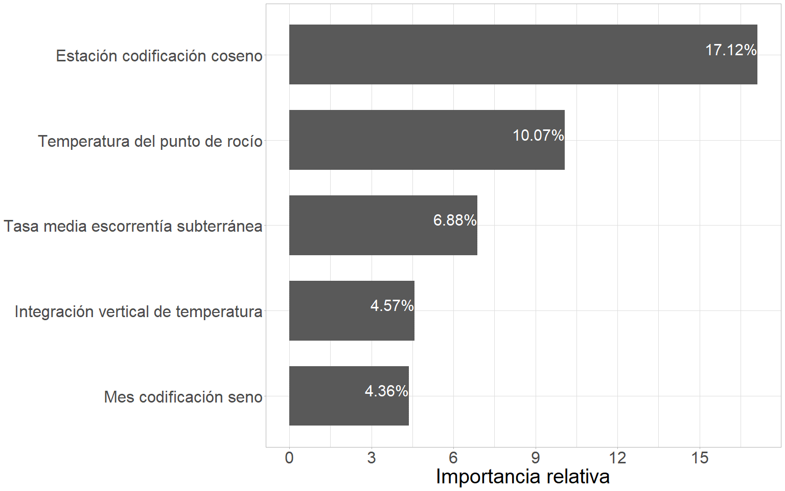
```
(ref:varimpaa) Importancia relativa de las variables en las redes neuronales recurrentes para el uso de suelo agrícola/ área verde.
  
  A partir de la figura \@ref(fig:varimpaa) pueden apreciarse las cinco variables de mayor importancia relativa para el modelo predictivo en el uso de suelo agrícola y área verde bajo la base de datos reducida. Dos de las mismas se encuentran vinculadas a la escala temporal, destacando la dependencia de la variable respuesta respecto a sus patrones de variación temporales explorados en el capítulo [3](#cap:expl). Las restantes son variables satelitales vinculadas a la variabilidad estudiada en el capítulo [4](#cap:var). Los resultados muestran que las cinco variables de mayor importancia relativa reúnen más del 40% de la misma. De esta forma puede apreciarse como en este uso de suelo se necesita menor cantidad de variables para reunir un mismo porcentaje de importancia relativa, demostrando mayor capacidad para explicar la concentración de PM~2.5~ con menor información.
  
  A la hora de predecir la concentración de PM~2.5~ en entornos agrícolas y áreas verdes, es crucial considerar la estación del año, temperatura de rocío, escorrentía, temperatura y el mes del año. 

#### Gráfico de dependencia SHAP

  Análisis de los aportes de las variables satelitales más importantes a las predicciones para el uso de suelo agrícola / área verde.
  
#### Temperatura del punto de rocío
  
```{r shapaaroc, echo=FALSE, out.width="100%", fig.align="center",fig.cap="(ref:shapaaroc)"}
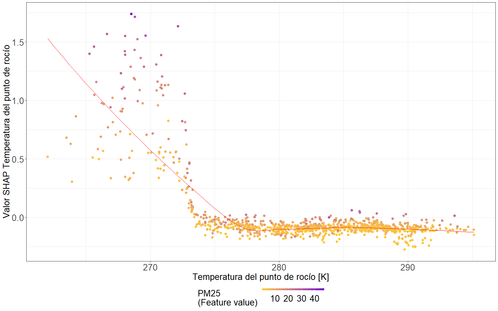
```
(ref:shapaaroc) Gráfico de la variable temperatura del punto de rocío contra su valor shap coloreado por el valor de PM~2.5~ para el uso de suelo agrícola / área verde.
  
  La figura \@ref(fig:shapaaroc) muestra que valores de baja magnitud de la temperatura del punto de rocío se asocian con altas concentraciones de PM~2.5~, mientras que valores elevada magnitud lo hacen con bajas concentraciones de PM~2.5~ De esta forma se identifica una relación del tipo inversa similar a la reportada en el capítulo [4](#cap:var).
  
#### Tasa media de escorrentía subterránea
  
```{r shapaaesc, echo=FALSE, out.width="100%", fig.align="center",fig.cap="(shapaaesc)"}
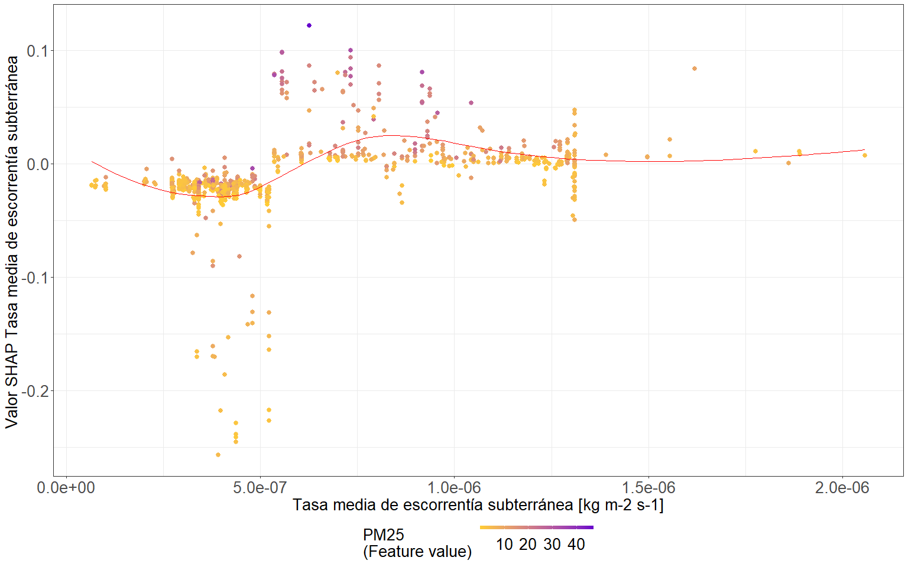
```
(ref:shapaaesc) Gráfico de la variable tasa media de escorrentía subterránea contra su valor shap coloreado por el valor de PM~2.5~ para el uso de suelo agrícola / área verde.
  
  La figura \@ref(fig:shapaaesc) muestra que valores de baja magnitud de la tasa media de escorrentía subterránea (menores a 5.07e-07) favorecen bajas concentraciones de PM~2.5~, mientras que valores superiores de la variable promueven un aumento en la concentración de PM~2.5~ predicha. Para valores superiores a 1.0e-06, la relación entre las variables permanece sin variaciones importantes respecto del aporte a la concentración. De esta forma se identifica una relación del tipo directa similar a la reportada en el capítulo [4](#cap:var).

#### Integración vertical de temperatura
  
```{r shapaaintvert, echo=FALSE, out.width="100%", fig.align="center",fig.cap="(ref:shapaaintvert)"}
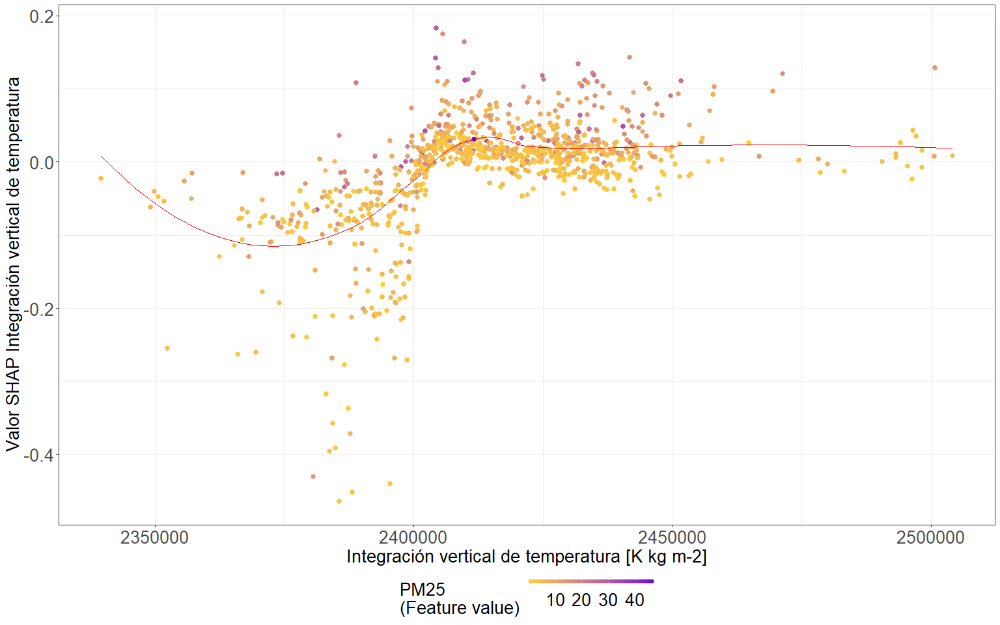
```
(ref:shapaaintvert) Gráfico de la variable integración vertical de temperatura contra su valor shap coloreado por el valor de PM~2.5~ para el uso de suelo agrícola / área verde.

  La figura \@ref(fig:shapaaintvert) muestra que valores de baja magnitud de la integración vertical de temperatura se asocia con bajas predicciones de PM~2.5~, mientras que valores de elevada magnitud de la variable resultan en incrementos de las concentraciones de PM~2.5~ predichas. De esta forma se identifica una relación del tipo directa similar a la reportada en el capítulo [4](#cap:var). 
  
## Discusión
  
  Es interesante destacar que tanto para el uso de suelo urbano como para el industrial el algoritmo predictivo de mejor ajuste demostraron ser las redes neuronales recurrentes. Resultados similares fueron hallados por Ayturan et. al., demostrando que las redes neuronales recurrentes, en especial las *GRU* destacan de entre múltiples algoritmos predictivos como las de mayor precisión para predecir la concentración de PM~2.5~ [@ayturan2020short]. Además otros estudios han demostrado la supremacía de las redes neuronales recurrentes para predecir la concentración de PM~2.5~ [@feng2019recurrent; @dhakal2021exploring; @casallas2021long]. En esta tesis el algoritmo de mayor capacidad predictiva para el uso de suelo urbano alcanzando una $RMSE$ de 3.491 $\frac{\mu g}{m^3}$ en el set de datos testeo. Por otra parte, para el uso de suelo industrial las redes neuronales recurrentes de mayor capacidad alcanzaron una $RMSE$ de 5.964 $\frac{\mu g}{m^3}$ en el set de datos testeo.
  
  Por otra parte, en el uso de suelo agrícola y área verde, el algoritmo predictivo que demostró mayor capacidad predictiva fue el de bosques aleatorios. Múltiples estudios han expuesto resultados coincidentes con los informados en este trabajo, destacando el algoritmo de bosques aleatorios como el de mayor capacidad para predecir la concentración de PM~2.5~ [@huang2018predicting; @suleiman2020comparative; @chen2018machine; @xu2021influence]. En el presente trabajo la mayor capacidad predictiva para este uso de suelo reporto una $RMSE$ de 2.324 $\frac{\mu g}{m^3}$ en el set de testeo. 
  
  A partir de los resultados obtenidos para los distintos tipos de modelos predictivos ajustados en el contexto de aprendizaje automático puede notarse que el algoritmo predictivo de mejor ajuste varia en función del uso del suelo analizado. Este resultado podría encontrarse vinculado no solo a características propias de cada una de las series temporales en cada uno de los usos de suelo descritas en el capítulo [3](#cap:expl), si no también a las de aprendizaje de los algoritmos empleados en el modelado predictivo.
  
  En el caso de la serie de tiempo para el uso de suelo agrícola y área verde, se observó que las realizaciones variaban en un entorno reducido respecto de su media. Esto indica una baja dispersión de los datos, lo que se traduce en una baja frecuencia de fluctuación entre valores de elevada y baja magnitud. Esta característica permite que la variable respuesta pueda ser explicada por un menor número de variables predictoras (Figura \@ref(fig:varimpaa)). Cabe destacar que más del 40% de la importancia relativa es acumulada por las cinco variables de mayor importancia para el modelo predictivo. En un set de datos que alberga un total de 70 variables, es destacable que prácticamente el 7% de las mismas concentren la información necesaria para describir la variable respuesta. Esta concentración de la información podría encontrarse sustentada en que al ser una serie de baja variabilidad se requiere menor información para describir sus fluctuaciones, ya que pueden ser explicadas la mayor parte del tiempo por las mismas variables predictoras.
  
  La concentración de información en un número reducido de variables podría favorecer al algoritmo de bosques aleatorios. Los bosques aleatorios resultaron eficientes detectando y utilizando la información de las variables de mayor importancia en la base de datos. Una vez detectadas, estas fueron retenidas en múltiples árboles individuales del bosque, generando una influencia de mayor peso en las predicciones. Dado al gran porcentaje de información contenido en una cantidad reducida de variables, los bosques aleatorios lograron internalizar de forma efectiva las interrelaciones entre las distintas variables, lo que resultó en un modelo predictivo de elevada exactitud. Resultados coincidentes fueron publicados por Pengcheng et. al., (2020) y por Wang et. al., (2021), quienes mostraron que el algoritmo de bosques aleatorios aumenta su capacidad predictiva al ser entrenado en bases de datos previamente reducidas por medio de algoritmos de selección de características [@pengcheng2020prediction; @wang2021using].
  
  Por otra parte, es importante destacar que las series provenientes de entornos urbanos e industriales presentan una notoria dispersión en sus realizaciones. Esto implica que sus datos son menos homogéneos en comparación con la serie agrícola y de área verde. Las series urbana e industrial muestran continuas fluctuaciones entre valores de elevada y baja magnitud de concentración de PM~2.5~. Por este motivo, a diferencia de la serie temporal agrícola y área verde, en estos caso se requiere un número de variables superior para reunir el mismo porcentaje de importancia relativa (Figuras \@ref(fig:varimpurb) y \@ref(fig:varimpind)). Es importante destacar que la importancia relativa otorgada a cada una de las variables participantes en los modelos para cada uno de estos usos de suelo varía en un rango acotado. A diferencia del uso de suelo agrícola y área verde, no hay variables en ninguno de los restantes usos de suelo que demuestren supremacía en cuanto a su importancia relativa. Los resultados muestran que las primeras cinco variables explican menos del 25% de la importancia relativa para los usos de suelo de mayor variabilidad.
  
  Los algoritmos de redes neuronales de mejor ajuste para los usos de suelo urbano e industrial no identificaron variables predictoras de elevada importancia relativa, a diferencia de lo que sucede con los bosques aleatorios en el uso de suelo agrícola y área verde. En las redes neuronales, todas las variables aportaron de forma homogénea a las predicciones, siendo el algoritmo predictivo el encargado de internalizar las ponderaciones de las mismas. En las figuras \@ref(fig:varimpurb) y \@ref(fig:varimpind), se presentaron los porcentaje de importancia relativa para los usos de suelo urbano e industrial respectivamente, los cuales evidenciaron ser inferiores a los del uso de suelo agrícola y área verde. 
  
  Las características de la serie temporal urbana e industrial podrían favorecer el modelado predictivo a través de redes neuronales recurrentes, cuyo algoritmo posee numerosos parámetros que logran reflejar el aporte de cada una de las variables a la predicción bajo las distintas situaciones posibles presentes en la base de datos. Al calcularse una gran cantidad de parámetros, puede notarse reflejado en cada predicción la influencia de cada una de las variables presentes en la base de datos, siendo el algoritmo predictivo el encargado de ponderar las influencias en cada caso particular. Al tratarse de series en donde la importancia relativa atribuida a las distintas predictoras es similar, el contar con un algoritmo predictivo que tenga en cuenta la influencia conjunta de todas las variables resultó en un mayor desempeño predictivo. De esta forma en cada predicción puede verse reflejada la influencia de cada una de las variables predictoras. Numerosos estudios han reflejado de forma similar la mejoría en la capacidad predictiva de la concentración de PM~2.5~ experimentada al aplicar redes neuronales recurrentes sobre bases de datos con gran cantidad de variables regresoras [@ding2022prediction ;@ayturan2020short ;@kim2023comparison ;@feng2019recurrent; @dhakal2021exploring; @casallas2021long].
  
## Conclusión

  Los resultados obtenidos indican que los modelos predictivos desarrollados logran explicar la variabilidad de la concentración de PM~2.5~ a partir de variables satelitales y temporales.
  
  La similitud existente entre las métricas obtenidas para el modelo de referencia  y las de los modelos predictivos desarrollados demuestran que estos poseen potencial para cumplir el objetivo de alertar a la población ante condiciones adversas de calidad de aire con cinco días de anticipación. 
  
  Las características propias de la variabilidad de cada una de las series temporales en los distintos usos de suelo y de aprendizaje de cada uno de los modelos predictivos ajustados, fueron determinantes en el tipo de algoritmo que demostró mayor exactitud para cada uno de los usos de suelo. En el uso de suelo de menor variabilidad el algoritmo de bosques aleatorios se desempeñó mejor que los algoritmos de aprendizaje profundo. Mientras que los de aprendizaje profundo permitieron ajustar modelos de mayor capacidad predictiva en usos de suelo donde la serie de PM~2.5~ se caracterizaba por una mayor variabilidad.