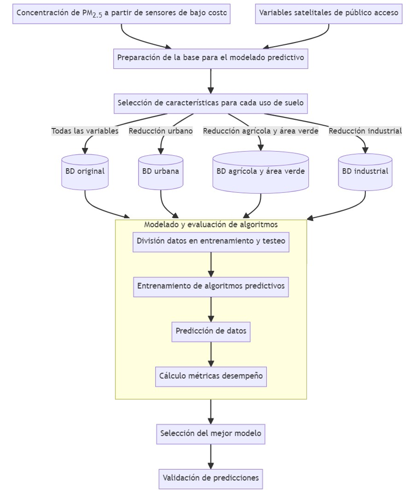
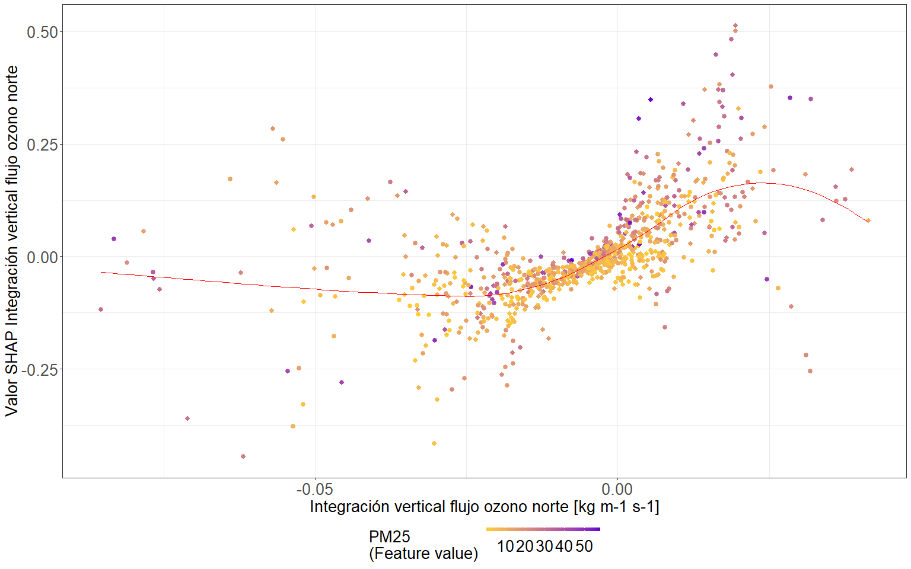

#	Modelado predictivo de la concentración de PM~2.5~ {#cap:pred}

## Introducción

  Preservar la calidad del aire no solo reviste una importancia fundamental para salvaguardar la salud pública, sino también para asegurar el equilibrio ecosistémico y climático. Sin embargo, esta calidad se ve constantemente amenazada por el avance del desarrollo urbano, la creciente industrialización, la alteración activa de la superficie terrestre y los efectos del cambio climático. En este contexto, el monitoreo de la calidad del aire emerge como una valiosa práctica capaz de brindar información crucial sobre las emisiones atmosféricas. Esto, a su vez, posibilita la evaluación de los niveles de contaminación y la formulación de estrategias efectivas de mitigación. En este marco, el desarrollo de modelos predictivos se ha consolidado como una herramienta fundamental dentro de los sistemas de gestión de calidad del aire, permitiendo obtener predicciones con el propósito de alertar a la población ante condiciones de contaminación que podrían ser adversas para la salud.
  
  Los modelos predictivos constituyen herramientas estadísticas diseñadas para recrear con la máxima fidelidad posible los procesos que se observan en la naturaleza. En el contexto de los modelos que abordan las emisiones atmosféricas, su utilidad no solo se limita a aplicaciones científicas, sino que también desempeñan un papel crucial en la gestión de la calidad del aire. Su principal aporte radica en la capacidad de controlar y prever, tanto en tiempo real como en el futuro, la contaminación atmosférica en zonas urbanas o regionales específicas. La generación de un modelo predictivo eficiente es una tarea compleja que exige la integración sistemática de un gran volumen de información generada a partir de diferentes fuentes de datos. 

  El avance de la tecnología ha posibilitado la recopilación de información relativa a diversos fenómenos atmosféricos relacionados a la variabilidad de la contaminación del aire a lo largo del tiempo. Una análisis común de los datos en forma de series temporales radica en el análisis de su estructura temporal para desentrañar sus patrones de variabilidad. Este análisis promueve la extracción de información representativa en términos de sus orígenes y relaciones subyacentes, además de evaluar la posibilidad de extrapolar y anticipar comportamientos de la serie de datos en el futuro. Por otra parte, la correcta selección de la metodología de predicción depende intrínsecamente del fenómeno específico o situación que se pretenda predecir. 
  
  Son numerosas y variadas las aplicaciones de series temporales en monitores ambientales. En esta tesis, dado al creciente número de estudios científicos que establecen vínculos entre la contaminación del aire con enfermedades respiratorias [@hahad2024breathing], cardiovasculares, cáncer [@chen2022trends], trastornos del sistema nervioso [@costa2022traffic], así como enfermedades transmitidas por el aire e inducidas por el calor, la aplicación se centra en la predicción de la concentración de la calidad del aire, específicamente de la concentración de PM~2.5~ [@sacks2011particulate; @zhao2020fine]. A medida que se profundiza en el estudio de este fenómeno, se evidencia un vínculo cada vez más estrecho entre la calidad del aire y el sistema meteorológico-climático [@elminir2005dependence; @pearce2011quantifying; @sfetsos2010new]. De allí, los numerosos intentos de predecir la distribución de partículas, a partir de información satelital meteorológica. 

  El desarrollo tecnológico ha permitido un notable progreso en la capacidad de cómputo disponible. Esta evolución, sumada a la disponibilidad de datos meteorológicos masivos en diversas plataformas de Internet, posibilitan el entrenamiento de modelos predictivos de calidad de aire en un sitio específico en el contexto de la inteligencia artificial. Actualmente, se cuenta con variadas herramientas informáticas para la obtención de productos satelitales almacenados en la nube. Tales productos pueden ser empleados como covariables con potencialidad predictiva de la concentración de PM~2.5~. Sin embargo, aun cuando existen modelos predictivos mecanicistas basados en la estimación de efectos para variables reportadas en la literatura, el desarrollo de modelos de base empírica sustentados en la abundancia de información hoy disponible es más incipiente [@kang2018air; @gu2021pm; @muthukumar2022pm2; @al2020new]. Un paso importante en la creación de un sistema de alerta frente a condiciones adversas de calidad de aire de bajo costo recae en el desarrollo y la selección del algoritmo de mayor desempeño predictivo para la concentración de PM~2.5~. El objetivo de este capítulo es comparar distintos enfoques de modelado predictivo basados en el aprendizaje automático y aprendizaje profundo para predecir la concentración de PM~2.5~ horarias. Los procesos de modelado se basan en el uso de variables predictoras meteorológicas, ambientales y temporales, obtenidas principalmente de satélites, para cada uno de los usos de suelo evaluados. La finalidad que persigue este capítulo es completar el desarrollo de un sistema de alerta basado en tecnologías de bajo costo que detecte condiciones adversas de calidad de aire.
  
## Materiales y métodos

### Resumen gráfico del protocolo analítico de modelado predictivo

```{r mod, echo=FALSE, out.width="100%", fig.align="center",fig.cap="(ref:mod)"}

```
(ref:mod) Resumen gráfico del protocolo analítico para selección del mejor modelo predictivo.

  La Figura \@ref(fig:mod) ilustra el protocolo analítico desarrollado en este capítulo, cuyo objetivo central es la construcción de un modelo predictivo para la concentración de PM~2.5~ en el Área Metropolitana de Córdoba, Argentina. Este modelo se destaca por prever la concentración de PM~2.5~ horaria, con cinco días de anticipación, motivo por el cual la variable objetivo con la cual se entrena el modelo es la concentración de PM~2.5~ horaria recopilada por las estaciones de monitoreo, y emplea como entrada variables meteorológicas satelitales y temporales relacionadas a la variabilidad periódica de este contaminante. Se compararon modelos alternativos basados en aprendizaje automático y profundo, llevando a cabo el ajuste de cada uno de ellos, evaluación y selección del modelo de mayor capacidad predictiva para distintos usos de suelo. Es importante destacar que la presente sección se haya enmarcada dentro de un enfoque computacional de inteligencia artificial. 
  
  En primer lugar, se llevó a cabo una comparación exhaustiva de distintos algoritmos de aprendizaje automático: regresión lineal múltiple [@saunders1998ridge; @tibshirani1996regression; @zou2005regularization; @bottou2007tradeoffs], máquinas de vectores de soporte [@cortes1995support], k vecinos más cercanos [@fix1985discriminatory], bosques aleatorios [@breiman2001random] y máquina de aumento de gradiente [@friedman2001greedy]); y profundo (redes neuronales recurrentes [@bishop1995neural], redes de memoria a largo plazo [@hochreiter1997long] y redes recurrentes con compuerta [@cho2014properties], con el propósito de identificar cuál de ellos demostraba el mejor rendimiento predictivo. La metodología de modelado abarcó el desarrollo de un modelo predictivo que considera un desfasaje temporal de 5 días, es decir 120 horas, para generar una predicción de la concentración de PM~2.5~ horaria con este desfasaje de antelación. Además, se aplicó una estrategia de modelado que discriminó según el uso del suelo, permitiendo ajustar distintos modelos predictivos para cada uno de los usos considerados, de esta forma se permitió la obtención de predicciónes discriminadas para cada uno de los usos de suelo involucrados en el presente estudio. También se evaluaron distintas alternativas de bases de datos como soporte para el modelo predictivo, una incluyó todas las variables predictoras y otra involucró una selección de variables para trabajar con una base de datos reducida. Esta última se creó mediante técnicas de reducción de dimensionalidad y selección de características (featurewiz [@bakheet2023hybrid], Boruta [@kursa2010boruta] y Boruta alternativo [@jamei2023surface]). Las variables incluidas en cada una de las bases de datos se encuentran mencionadas en el Anexo 1 para cada uso del suelo. Los algoritmos de aprendizaje evaluados fueron optimizados por medio de la búsqueda de hiperparámetros e interpretados a través de la implementación del método de Shapley (valores SHAP) [@lubo2020machine]. La elección del horizonte de predicción se encuentra fundada en que la disponibilidad de las variables derivadas a partir de información satelital es gratuita solo cinco días previos al momento presente, de esta forma para poder obtener la predicción de la hora siguiente, es necesario emplear como predictoras los datos de la hora anterior con cinco días de antelación. Por este motivo, el entrenamiento de los algoritmos predictivos se realizó con un desfasaje de la variable respuesta respecto a las predictoras de 120 horas, es decir, cinco días, dadas las características de las bases de datos satelitales.  La evaluación de los modelos se realizó mediante la comparación de la métrica RMSE obtenida a partir de una validación cruzada *K-fold* con un K igual a 10.

### Base de datos

  En esta sección, se utilizó la misma base de datos que fue implementada en el capítulo [4](#cap:var), generada a partir de la combinación de los datos de concentración de PM~2.5~ recopilados durante el muestreo con sensores de bajo costo, analizados en el capítulo [3](#cap:expl), y los datos satelitales y meteorológicos analizados en el capítulo [4](#cap:var), descargados desde la nube. 
  
  Además de las variables mencionadas, se incorporaron variables temporales como la estación del año, el mes, el día del mes, el día de la semana y la hora de la lectura del contaminante. Éstas se incluyeron tanto en su forma categórica original como luego de ser codificadas de manera cíclica mediante la introducción de las componentes de seno y coseno correspondientes. Es importante destacar que todas las variables numéricas se estandarizaron o normalizaron con el objetivo de homogeneizar sus rangos de variabilidad y ajustar su desviación estándar a 1. Este proceso permitió evitar problemas de escala y facilitó la comparación entre las variables.

  Para lograr una comprensión integral de la relación de vinculación entre las variables que resultaron relevantes en el proceso de modelado predictivo y la concentración de PM~2.5~ se incluyó el análisis exploratorio realizado durante el capítulo [4](#cap:var) de forma resumida haciendo especial énfasis en la conexión de las variables. Por otra parte, para aquellas variables que no fueron abordadas en el análisis del capítulo [4](#cap:var) dado a que no son habitualmente citadas en sustentos bibliográficos para describir la variación de la concentración de PM~2.5~, se incluyó un análisis exploratorio equivalente al desarrollado en dicho capítulo. Las variables mencionadas son: la rugosidad de la superficie terrestre, la disipación en la capa límite atmosférica, la integración vertical flujo ozono norte, tasa media de escorrentía subterránea y la integración vertical de temperatura. En primer lugar, a pesar de existir una descripción detallada de cada una de las variables en el Anexo 3, se incluyó en el presente capítulo la definición de cada una de las variables exploradas para cada uno de los usos de suelo, proseguida de su análisis exploratorio. La inclusión de este análisis tiene por objetivo garantizar una interpretación e inferencia adecuada acerca de la manera en que se manifiesta la variabilidad conjunta desenmascarada entre cada una de las variables analizadas y la concentración de PM~2.5~, permitiendo generar independencia entre los capítulos de la presente tesis.

### Protocolo estadístico

#### Modelos predictivos comparados

##### Regresión lineal:

  La regresión lineal múltiple (*multiple linear regression*) es una técnica estadística que se utiliza para modelar una variable dependiente como una combinación lineal de múltiples variables independientes. Este metodología es aplicable tanto a datos de sección transversal como a series temporales contemplando la autocorrelación temporal [@aldas2017analisis]. El supuesto subyacente en este modelo es que existe una relación lineal entre la variable dependiente y las variables independientes. En el contexto del aprendizaje automático, el aprendizaje de la interrelación entre las variables se logra mediante el ajuste iterativo de los coeficientes de regresión. El algoritmo de regresión busca determinar el hiperplano que mejor ajusta a los datos, lo cual implica encontrar coeficientes que minimicen la diferencia entre los valores observados y predichos por el modelo.

  En esta investigación, se emplearon diversos algoritmos para ajustar la regresión lineal múltiple. El primero fue el método de mínimos cuadrados ordinarios, el cual deriva en un modelo lineal cuyos coeficientes resultantes minimizan la suma de los residuos cuadrados entre los valores observados y los valores predichos. Este método representa el enfoque clásico para ajustar modelos de regresión lineal múltiple, y proporciona estimaciones insesgadas y eficientes de los coeficientes.
  
  Otro algoritmo implementado fue la regresión de Ridge, que incorpora un término de penalización al tamaño de los coeficientes estimados [@saunders1998ridge]. Esto implica que la función que se busca minimizar se encuentra además penalizada por un parámetro de complejidad que controla el nivel de contracción de los coeficientes. Este algoritmo es útil en los casos en que existe colinealidad entre las variables predictoras, proporcionando un modelo más robusto en comparación con el enfoque de mínimos cuadrados ordinarios bajo la situación de múltiples variables predictoras correlacionadas.

  También se evaluó la alternativa de regresión LASSO, que incluye un término de penalización distinto en la función a minimizar. El objetivo de este término es reducir la cantidad de variables que integran el modelo final al mínimo, lo que conlleva a una disminución fuerte en la cantidad de variables involucradas en la predicción [@tibshirani1996regression, @santosa1986linear]. Este algoritmo es especialmente útil cuando se desea seleccionar un subconjunto de variables predictoras, proporcionando un modelo de mayor interpretabilidad.
  
  Además, se implementó el algoritmo de red elástica, el cual fusiona las regularizaciones y penalizaciones introducidas por los métodos de regresión Ridge y LASSO [@zou2005regularization]. Este enfoque posibilita la estimación de un modelo que combina las ventajas de ambos métodos, ofreciendo la estabilidad característica de Ridge y la habilidad de selección de características de LASSO. 
  
  También, se empleó el algoritmo de descenso por el gradiente estocástico, que es una alternativa comúnmente usada en el contexto del aprendizaje automático donde se busca ajustar iterativamente los parámetros del modelo de regresión lineal múltiple de manera eficiente (regresión SGD). Este método implica calcular el error entre las predicciones del modelo y los valores reales, y luego ajustar los parámetros en la dirección opuesta del gradiente de la función de costo, permitiendo una adaptación precisa. Al ser de naturaleza "estocástica", en cada iteración se utiliza un subconjunto aleatorio de los datos disponibles para actualizar los parámetros, lo que agiliza la convergencia y se torna especialmente útil en situaciones donde los conjuntos de datos son de dimensiones considerables y presentan colinealidad [@bottou2007tradeoffs]. 

##### Máquinas de vectores de soporte:

  Las máquinas de vectores de soporte (*support vector machine (SVM)*) [@cortes1995support] es otro algoritmo de aprendizaje automático que puede ser empleado tanto para la clasificación de variables discretas como para la predicción de variables continuas. A diferencia de los modelos de regresión lineal, las SVM buscan encontrar un hiperplano en un espacio de características de mayor dimensión, logrado mediante una transformación no lineal de los datos (mediante el uso de funciones kernel) (Figura \@ref(fig:svm)). El enfoque se centra en la identificación de los vectores de soporte, puntos de datos clave que influyen en la ubicación del hiperplano y los márgenes. La efectividad de las SVM radica en su capacidad para descubrir el hiperplano que maximiza los márgenes alrededor de estos vectores de soporte, permitiendo el ajuste. Asimismo, esta técnica es especialmente idónea para tratar conjuntos de datos que no sean separables linealmente en el espacio original, gracias a la transformación llevada a cabo en el espacio de características de mayor dimensión.

```{r svm, echo=FALSE, out.width="100%", fig.align="center", fig.cap="(ref:svm)"}
knitr::include_graphics("images/imagescap5/svm.png")
```
(ref:svm) Diagrama representativo del algoritmo de máquinas de vectores de soporte.

##### K vecinos más cercanos:

  El algoritmo de k vecinos más cercanos (*k nearest neighbours (KNN)*) es un método basado en distancias. En el contexto del aprendizaje automático es capaz de aprender funciones objetivo complejas sin hacer suposiciones sobre la distribución de los datos, lo que lo hace útil en problemas de relaciones no lineales [@fix1985discriminatory]. Su funcionamiento se basa en el cálculo de las distancias entre las observaciones respecto a las variables predictoras y el promedio de las observaciones más cercanas. Así, selecciona las K observaciones de mayor similitud a la observación que se desea predecir y, asigna como predicción el promedio de la respuesta en el grupo de vecinos. En lugar de generar una función que describa la relación entre las variables de entrada y salida, KNN guarda en memoria las muestras de entrenamiento y busca en esta base la respuesta más cercana para cada consulta de entrada. Este enfoque lo hace especialmente útil para problemas de predicción donde la estructura subyacente del problema es compleja y no se conoce a priori.
  
##### Bosques aleatorios:

  En los últimos años ha aumentado el interés en los métodos de aprendizaje automático que usan ensambles de modelos como los bosques aleatorios (*random forest*) [@breiman1996bagging]. Este método combina los resultados de múltiples arboles de regresión [@breiman1996bagging] generados independientemente por remuestreo del conjunto de datos original para mejorar el rendimiento predictivo mediante ensamblado (Figura \@ref(fig:rfalgo)). Uno de los métodos de ensamblado más reconocido es el empaquetado (*bagging* o *bootstrap aggregating*) [@breiman1996bagging]. En el aprendizaje automático, se crean múltiples conjuntos de datos mediante remuestreo con reemplazo de los datos de entrenamiento y luego se ensamblan los resultados obtenidos en cada muestra mediante el promedio. 
 
```{r rfalgo, echo=FALSE, out.width="100%", fig.align="center", fig.cap="(ref:rfalgo)"}
knitr::include_graphics("images/imagescap5/RFalgo.png")
```
(ref:rfalgo) Diagrama de predicción por ensamble, en verde se muestra el camino de predicción resultante para cada árbol de regresión.

  Breiman [@breiman2001random] propuso el modelo de bosques aleatorios, que añade una capa de aleatoriedad en las variables de entrada a cada uno de los empaquetados, proporcionando mayor robustez contra el sobreajuste. Al ajustar el modelo, se considera un número limitado de variables predictoras elegidas aleatoriamente. Esta aleatoriedad hace que cada uno de los subconjuntos de datos considere distintos subconjuntos de variables predictoras garantizando mayor independencia entre los modelos estimados a partir de las distintos subconjuntos generados por el remuestreo.
  
##### Máquina de aumento de gradiente:

  Otra técnica de ensamblaje utilizada es el *boosting*, un método que busca mejorar el rendimiento del modelo a través de la combinación de múltiples estimadores individuales. En el contexto del aprendizaje automático, el *boosting* se emplea en conjunción con árboles de regresión, dando origen al algoritmo conocido como máquina de aumento de gradiente (*gradient boosting machine (GBM)*), propuesto por Friedman en 2001. La esencia de este enfoque reside en la incorporación secuencial de nuevos modelos de árbol al conjunto (*ensemble*), lo que contribuye a disminuir el sesgo de los estimadores previamente ajustados. Esta reducción del sesgo se refleja a través de una función de error (Figura \@ref(fig:gbm)). Cada árbol adicional es entrenado con respecto al error acumulado hasta esa iteración del modelo [@friedman2001greedy].

```{r gbm, echo=FALSE, out.width="100%", fig.align="center", fig.cap="(ref:gbm)"}

```
(ref:gbm) Diagrama representativo del algoritmo de máquina de aumento de gradiente.

  Uno de los mayores desafíos en el modelado por aprendizaje automático es la capacidad de generalizar, ya que los modelos pueden sesgarse durante el aprendizaje, dando como resultado modelos inadecuados que podrían sobreajustar los datos. Para mitigar los efectos del sobreajuste, Friedman propuso la técnica de contracción [@friedman2001greedy]. Esta técnica comprende un enfoque de regularización que actúa penalizando los coeficientes de regresión. En el contexto del GBM, la contracción penaliza la importancia de los árboles individuales en cada paso consecutivo. La función objetivo final del modelo consta de dos términos: una función de pérdida de entrenamiento representada por error cuadrático medio y la regularización que mide la complejidad del modelo.

##### Redes neuronales artificiales:

  Las redes neuronales artificiales (*artificial neural networks (ANN)*) [@bishop1995neural; @hayakin1999learn] son algoritmos de aprendizaje profundo que permiten modelar procesos no lineales de manera eficiente. La información de entrada es recolectada a través de un vector denominado capa de entrada. Una vez ingresada se propaga y fluye capa a capa de la red, estableciendo las relaciones entre la capa de entrada y la capa final denominada de salida. El aprendizaje de las interrelaciones entre las variables predictoras se desarrolla a través del ajuste de parámetros característicos de este tipo de modelo denominados pesos sinápticos. Las capas intermedias u ocultas consisten en múltiples unidades denominadas neuronas que se encuentran interconectadas con las neuronas de las capas anterior y posterior. El número de capas ocultas y el número de neuronas en cada una de ellas define la topología de la red (Figura \@ref(fig:redalgo)). Cada neurona genera una respuesta excitatoria a las señales recibidas por medio de una función de activación. Existen distintas funciones de activación, de las cuales algunas pueden resultar más recomendadas para un objetivo y problema en particular [@bishop1995neural; @hayakin1999learn].

  El aprendizaje de la red se basa en capturar las relaciones entre la capa de entrada y de salida a partir de la optimización de una métrica de error. En los problemas de predicción de variables continuas la métrica más implementada es la raíz del error cuadrático medio (*RMSE*), la cual se calcula comparando las salidas predichas por la red con los valores observados en un conjunto de entrenamiento. A partir de la pérdida registrada es que se genera una actualización de los pesos sinápticos mediante el algoritmo de retropropagación (*backpropagation*) [@rumelhart1986learning]. Una de las mayores dificultades de este tipo de enfoque es encontrar la topología de red que mejor ajuste a los datos. Este proceso normalmente se aborda a partir del ajuste iterativo de múltiples arquitecturas. Generalmente, se parte de una red simple de una capa oculta y pocas neuronas, y se procede aumentando la complejidad de la red (incrementando secuencialmente el número de neuronas, así como el número de capas ocultas) hasta obtener un modelo satisfactorio que optimice los resultados.

  Las redes neuronales recurrentes (*recurrent neural network (RNN)*), a diferencia de las ANN, incluyen bucles o conexiones entre unidades que permiten que la información persista en mayor medida a lo largo de las sucesivas capas de la red (Figura \@ref(fig:redalgo)). La capacidad de incorporar información sobre el contexto pasado en sus sucesivas salidas las hace especialmente prometedores para tareas en las que la información pasada es relevante para la predicción, como en el caso de series temporales. Las *RNN* pueden ser consideradas como múltiples copias de la misma red neuronal actuando conjuntamente, cada una de las cuales transfiere información a su sucesora y forma una arquitectura en cadena capaz de preservar la información de la secuencia. Las *RNN* son eficientes implementando información pasada en un intervalo de tiempo corto, para realizar una tarea de predicción. Sin embargo, la información relevante no siempre esta cercana al pasado y, a medida que aumenta el intervalo de tiempo, las *RNN* no logran conectar la información para realizar las predicciones, de esta forma disminuye su capacidad predictiva cuando la información importante se encuentra contenida en mayores desfasajes de tiempo. 
 
```{r redalgo, echo=FALSE, out.width="100%", fig.align="center", fig.cap="(ref:redalgo)"}
knitr::include_graphics("images/imagescap5/redalgo.png")
```
(ref:redalgo) Diagrama representativo de algoritmos de redes neuronales.

  Para solventar la falencia de las RNN, en 1997 fueron introducidas las redes de memoria a largo plazo (*Long Short-Term Memory (LSTM)*) por Hochreiter y Schmidhuber [@hochreiter1997long] y mejoradas en el 2000 por Gers et al. [@gers2000learning]. Estas son una variación de las *RNN* capaz de aprender dependencias de largo plazo, gracias a la inclusión de unidades especiales llamadas bloques de memoria. Además, de otras unidades multiplicativas llamadas puertas que controlan el flujo de información de una unidad *LSTM* a otra. Una variante de este tipo de red es la red recurrente con compuerta (*Gated Recurrent Unit (GRU)*), introducidas por Cho et al. [@cho2014properties], la cual mantiene las características propias de las *LSTM* con una estructura más simple, reduciendo la cantidad de parámetros a ajustar.

#### Selección de variables 

  Fueron analizadas dos alternativas respecto de la cantidad de variables predictoras a incluir en el modelado predictivo (base original y base reducida). Para la reducción de la cantidad de variables se implementó una combinación de múltiples algoritmos que se describen a continuación. 

  El algoritmo *featurewiz* [@bakheet2023hybrid; @novaes2022modelo; @hu2023glass], surge de la combinación de dos algoritmos de selección de características. En primer lugar, emplea el algoritmo de *SULOV* (*Searching for Uncorrelated List of Variables*), el cual se encuentra basado en el algoritmo de *MRMR* (*Minimum-Redundancy-Maximum-Relevance*) [@radovic2017minimum]. Este permite reducir la base de datos a un número óptimo de variables no correlacionadas que contienen la máxima información mutua con respecto a la variable respuesta. Una vez que *SULOV* ha seleccionado las variables más relevantes, se emplea un método de eliminación recursiva de variables (*RFE* de *Recursive Feature Elimination*). La *RFE* es un método de selección de características que ajusta de forma iterativa un algoritmo predictivo a una base de datos, eliminando aquellas características de menor importancia, hasta alcanzar el número optimo de variables que permiten maximizar el desempeño predictivo. El algoritmo de *featurewiz* emplea una eliminación recursiva basada en el algoritmo predictivo de *XGBoost* [@chen2015xgboost; @chen2016xgboost]. De esta forma, el algoritmo de *featurewiz* posteriormente a la reducción por *SULOV* aplica un algoritmo de *XGBoost Recursivo*, que logra encontrar el conjunto óptimo de características, que permite entrenar un modelo de aprendizaje automático.

  El algoritmo de *Boruta* [@kursa2010boruta], se encuentra basado en el método de bosques aleatorios y tiene por objetivo identificar la importancia de las variables en la explicación de la variable respuesta. Su algoritmo de búsqueda se basa en el ajuste del modelo de bosques aleatorios en la base original y en una base de datos creada a partir de la mezcla aleatoria de las realizaciones de las variables. A partir de la comparación del desempeño de los distintos modelos ajustados determina cuáles son las variables de mayor relevancia en la base de datos. 
  
  Finalmente, se implementó otro algoritmo denominado como *Boruta alternativo* [@jamei2023surface], cuya variación reside en su paso inicial, el cual busca una reducción de las variables en función del coeficiente de correlación de Pearson. Este algoritmo busca eliminar las variables en la base de datos que se encuentren fuertemente correlacionadas, priorizando conservar aquellas de mayor correlación con la variable respuesta. Posteriormente, implementa el algoritmo de eliminación recursiva basado en bosques aleatorios implementado por *Boruta* para determinar cuáles son las variables más importantes en la base de datos.

  Para crear la base de datos reducida final, se optó por combinar los resultados obtenidos por los tres métodos de reducción de dimensionalidad (*featurewiz*, *Boruta* y *Boruta alternativo*). El procedimiento acatado fue otorgar un punto a cada una de las variables seleccionadas por cada uno de los métodos. Para obtener un conjunto de datos reducido se seleccionaron todas las variables predictoras cuya sumatoria de puntos era igual a tres, es decir que fueron seleccionadas de forma independiente por los tres algoritmos de reducción.

#### Procedimiento de ajuste y evaluación de modelos
 
  Para comparar el desempeño predictivo de los distintos algoritmos ajustados tanto en el conjunto de datos de entrenamiento como en el de testeo, se implementó la métrica de rendimiento raíz del error cuadrático medio de predicción ($RMSE$), la cual se deriva  a partir del error cuadrático medio ($MSE$).
  
  Error cuadrático medio (*mean squared error (MSE)*): es un estimador que mide el promedio de los errores al cuadrado, es decir, la diferencia entre el valor observado y su predicción por el modelo (Ecuación 5.1). Es una función de riesgo, correspondiente al valor esperado de la pérdida del error al cuadrado o pérdida cuadrática. Mientras menor es su valor, más exactos serán los pronósticos del modelo predictivo [@lehmann2006theory].
  
\begin{equation*} 
\sum_{i=1}^{N}(y_i-\hat{y_i})^2 \tag{5.1}
\end{equation*} 
\begin{flushleft}
\setstretch{1}
{\footnotesize
\textbf{Ecuación 5.1:}
  Error cuadrático medio (\textit{mean squared error}).
  
\textbf{Componentes}:
\begin{itemize}
    \item \textit{y$_{i}$:} valor real u observado en el i-ésimo punto de datos en un conjunto de datos. Representa el resultado o la variable de respuesta que se está tratando de predecir o modelar en el contexto de un problema de regresión.
    \item \textit{$\hat{y_i}$:} predicción del modelo en el i-ésimo punto de datos. Es el valor estimado por el modelo para y$_{i}$.
    \item \textit{n:} número total de puntos en el conjunto de datos.
\end{itemize}
}
\end{flushleft}

  Raíz del error cuadrático medio (*root mean squared error ($RMSE$)*): expresa el promedio de la diferencia cuadrática entre los valores predichos por el modelo y los valores observados (Ecuación 5.2). Esta es siempre no negativa, y un valor de 0 (poco común en la práctica) indicaría un ajuste perfecto a los datos. Generalmente, mientras menor $RMSE$ mejor ajuste o mayor exactitud en las predicciones. Esta métrica es sensible a valores atípicos y pone mayor peso en los grandes errores, ya que su coeficiente elevado al cuadrado influirá notablemente en el resultado [@lehmann2006theory; @pontius2008components; @willmott2006use]. Esta métrica se encuentra definida hace muchos años y es ampliamente recomendada para evaluar el desempeño de modelos de calidad del aire [@thunis2011procedure; @zhang2014evaluation].

\begin{equation*} 
RMSE = \sqrt{\frac{1}{n}\sum\nolimits_{i=1}^N(y_i-\hat{y_i})^2} \tag{5.2}
\end{equation*}
\begin{flushleft}
\setstretch{1}
{\footnotesize
\textbf{Ecuación 5.2:}
  Raíz del error cuadrático medio (\textit{root mean squared error} ($RMSE$)).
  
\textbf{Componentes}:
\begin{itemize}
    \item \textit{y$_{i}$:} valor real u observado en el i-ésimo punto de datos en un conjunto de datos. Representa el resultado o la variable de respuesta que se está tratando de predecir o modelar en el contexto de un problema de regresión.
    \item \textit{$\hat{y_i}$:} predicción del modelo en el i-ésimo punto de datos. Es el valor estimado por el modelo para y$_{i}$.
    \item \textit{n:} número total de puntos en el conjunto de datos.
\end{itemize}
}
\end{flushleft}
 
  La metodología implementada para llevar a cabo el ajuste y evaluación de los modelos predictivos, se basó en un enfoque iterativo que involucró la división de datos, entrenamiento del modelo y evaluación por medio de las métricas de desempeño. La base de datos se dividió en subconjuntos de entrenamiento, validación y testeo a partir de un muestreo aleatorio estratificado por meses, días y horas. Esta estratificación buscó maximizar la representatividad de las distintas condiciones temporales existentes en los distintos subconjuntos de datos para el ajuste del modelo predictivo. Las proporciones correspondientes para cada uno de los subconjuntos (entrenamiento, validación y testeo), fue de 70%, 15% y 15%, respectivamente. Posteriormente, se procedió a ajustar cada uno de los algoritmos de modelado predictivo en los subconjuntos de entrenamiento y validación. Una vez que los modelos fueron entrenados, se realizaron predicciones tanto en la base de datos de entrenamiento como en la de testeo. A partir de estas predicciones, se llevó a cabo el cálculo de las métricas de desempeño en la base de datos de testeo. Este procedimiento de entrenamiento y evaluación se repitió de forma iterativa 10 veces, variando las semillas aleatorias que determinaron las particiones de los datos en cada iteración. Finalizadas las iteraciones, se calculó el promedio de las métricas de desempeño para las 10 corridas del procedimiento en los de testeo. Finalmente, se compararon los resultados promedio de las métricas de desempeño para determinar cuál de los algoritmos predictivos fue el que generó el ajuste de mayor capacidad predictiva. En el contexto de entrenamiento de modelos de aprendizaje automático, los datos de validación se utilizan para evaluar el rendimiento del modelo de manera iterativa durante el proceso de entrenamiento. Esto permite ajustar los hiperparámetros del modelo y realizar mejoras antes de hacer una evaluación final con los datos de testeo. 

  La inclusión de la variable categórica máscara de fuego (VNP14A1) en la base de datos para desarrollar el modelo predictivo se llevó a cabo mediante el empleo de la técnica conocida de *One-Hot Encoding* [@draper1998applied]. Este proceso implica la transformación de las variables categóricas en una representación binaria, donde cada categoría se convierte en una nueva variable binaria independiente. La razón detrás del uso de *One-Hot Encoding* radica en la necesidad de representar las variables categóricas de manera que puedan ser incorporadas efectivamente en modelos matemáticos y algoritmos de aprendizaje automático. 

  Todos los algoritmos predictivos ajustados fueron optimizados durante el procedimiento iterativo de entrenamiento y evaluación a partir de las particiones de entrenamiento y validación. Esta optimización se llevó a cabo variando los valores de los hiperparámetros, hasta encontrar las configuraciones que aseguraron el mayor rendimiento predictivo. Los resultados de los hiperparámetros que demostraron el mayor rendimiento predictivo en la base de datos seleccionada se encuentran reportados en el Anexo 4 para cada uno de los usos de suelo. Además, en el caso de las redes neuronales, se profundizó en el estudio de diferentes arquitecturas. Las redes neuronales recurrentes entrenadas en este capítulo se encuentran conformadas por un modelo apilado (múltiples capas superpuestas). Cada una de las capas del modelo apilado consta de una capa recurrente y una de dilución (*dropout*). La capa recurrente permite comprender dependencias temporales y secuenciales, mientras que la capa de dilución contribuye a la regularización al prevenir el sobreajuste, al mismo tiempo que fomenta la generalización del modelo. Además, se evaluaron distintas metodologías de recurrencia implementando diferentes variantes de apilamiento para determinar si mejoraba el rendimiento del modelo.
  
  Además, cabe destacar que para abordar la comparación de la capacidad predictiva de los modelos ajustados se implementó una línea de base contra la cual contrastar los algoritmos ajustados. Esta refiere a un modelo de referencia (*base line*), que predice la concentración de PM~2.5~ para las horas sin dato (testeo) como la media de la concentración en la hora anterior y posterior. Es relevante resaltar que esta predicción no es posible en la práctica, ya que no se dispone de datos de concentración de PM~2.5~ en tiempo real. Un desempeño del modelo ajustado superior o similar al de este modelo de referencia indica una elevada capacidad predictiva.
  
  Las contribuciones de cada una de las variables a las predicciones se cuantificaron con el método de Shapley (SHAP) [@lubo2020machine]. Cada valor SHAP representa la contribución de una variable independiente a una predicción individual específica, para el caso de la concentración de PM~2.5~, en unidades de $\frac{\mu g}{m^3}$. En concreto, el valor SHAP para un predictor y una observación dada es la diferencia existente en los resultados de predicción entre un modelo que se ajusta incluyendo y otro excluyendo a dicho predictor. Para cada observación, la suma de todos los valores SHAP, más la media general (concentración media global de PM~2.5~ en los datos de entrenamiento), es igual a la predicción del modelo predictivo. La matriz resultante de los valores SHAP puede resumirse para comprender cómo contribuye cada predictor a las predicciones resultantes. El valor SHAP absoluto medio de todas las observaciones resume la contribución global de cada variable predictora, y es posible una interpretación local del modelo mediante la visualización a través de un gráfico de dispersión que compare los valores de dicha variable y la contribución SHAP que generan dichos valores.
  
## Resultados

### Modelado de PM~2.5~ en entornos urbanos

#### Comparación de algoritmos para el uso del suelo **urbano** 

  Esta sección desarrolla el modelado predictivo de la concentración de PM~2.5~ a partir de las base de datos original y reducida. La base de datos original involucró todas las variables independientes (193), mientras que la reducida contó con un total de 77 variables. Una descripción detallada de cada una de ellas puede hallarse en el Anexo 1. En el contexto del análisis y modelado de datos, el término "variable independiente" se refiere a cualquier variable que se utiliza como entrada para predecir la variable objetivo (también conocida como variable dependiente). No se refiere a la independencia estadística entre las  variables. Los resultados del modelo predictivo desarrollado en esta sección se presentan en la tabla \@ref(tab:modurb).

Table: Error cuadrático medio de predicción (*RMSE*) de modelos ajustados para predecir la concentración de PM~2.5~ en el uso del suelo urbano a partir de 193 variables derivadas a partir de información satelital (base de datos original) y 77 variables seleccionadas (base de datos reducida). \label{tab:modurb}

| Modelo / Base de datos | Original | Reducida |
|------------------------------|:-----------:|:-----------:|
| **GRU** | 3.44 | 3.46 |
| LSTM | 3.50 | 3.50 |
| RNN | 4.44 | 4.25 |
| Bosques aleatorios | 4.10 | 4.31 |
| KNN | 3.55 | 3.60 |
| SVM | 5.77 | 5.69 |
| GBM | 7.12 | 7.28 |
| Regresión lineal | 8.02 | 8.30 |
| Regresión SGD | 8.03 | 8.26 |
| Regresión Ridge | 8.02 | 8.30 |
| Regresión LASSO | 9.01 | 9.02 |
| Regresión de red elástica | 9.85 | 9.85 |
|  |  |  |  |  |
| *Modelo de referencia* | 3.67 | 3.67 |
\begin{flushleft}
\setstretch{1}
{\footnotesize Los valores de \textit{RMSE} se encuentran en las mismas unidades que la concentración de PM$_{2.5}$, es decir [$\frac{\mu g}{m^3}$]. Un menor valor de \textit{RMSE} indica mejor desempeño del modelo predictivo. El PM$_{2.5}$ promedio para el uso del suelo urbano fue de 11.54 $\frac{\mu g}{m^3}$. El \textit{RMSE} reportado se calculó sobre la base de datos de testeo.}
\end{flushleft}

  Los resultados presentados en la Tabla \@ref(tab:modurb) demuestran que el algoritmo predictivo de mayor desempeño predictivo para el uso del suelo urbano fueron las redes neuronales recurrentes en sus versiones bajo la base de datos original y reducida. El gran desempeño predictivo demuestra cómo las características propias de aprendizaje del algoritmo logran captar las fuentes de variabilidad y realizar estimaciones acertadas de la variable respuesta. De entre las distintas arquitecturas de redes neuronales recurrentes evaluadas, específicamente el modelo que se destaca por su sobresaliente capacidad predictiva es aquel que incorpora redes con compuerta (*GRU*).
 
  Además, es importante destacar que el único algoritmo predictivo que también es capaz de superar al modelo de referencia propuesto es el modelo de k vecinos más cercanos. Sin embargo, este algoritmo no garantiza el aprendizaje de la estructura de variabilidad presente en los datos, ya que su proceso de predicción se basa en identificar las k observaciones más similares en la base de datos de entrenamiento a partir de la matriz de distancias, y calcular su media para obtener la predicción final. Este algoritmo de modelado puede ser una forma novedosa y no convencional de calcular predicciones condicionadas por el parentesco entre los datos, a diferencia de los demás métodos que buscan calcular parámetros y pesos que les permiten inferir acerca de las interrelaciones entre las variables. 

  Para evitar caer en interpretaciones sesgadas respecto a la relación de vinculación que guardan las variables, se optó por seleccionar el modelo predictivo desarrollado sobre la base de datos reducida. Esta elección se fundamenta en el hecho de que el modelo construido sobre la base de datos original, al contar con un número superior de variables predictoras, aumenta drásticamente el espacio de posibles soluciones que pueden encontrarse, pudiendo existir soluciones en las cuales se atribuya importancia a variables de forma equivocada. Cabe destacar que la base de datos reducida cuenta con las variables más importantes seleccionadas a partir de la combinación de múltiples algoritmos de selección de características. Al trabajar con esta base de datos, el espacio de posibles soluciones se reduce considerablemente, asegurando que todas las soluciones posibles involucren las variables de mayor relevancia. Además, puede apreciarse que la diferencia en la precisión promedio entre los algoritmos predictivos en ambas bases de datos es de 0.020 $\frac{\mu g}{m^3}$. Tomando en consideración que la base de datos reducida involucra un 60% menos de variables, se asume que se introduce un menor porcentaje de ruido al modelado y que no disminuye drásticamente el desempeño predictivo. Por este motivo, además de encontrar soluciones de mayor relevancia, permite reducir la complejidad y el tiempo de ejecución en el entrenamiento del modelo predictivo. Otra ventaja inherente a la base de datos reducida es su mayor viabilidad para la implementación en producción, ya que implica una menor carga y procesamiento para generar predicciones, además de simplificar las tareas de actualización y reentrenamiento del modelo.
  
  La elección de utilizar la base de datos reducida está basada en una combinación de técnicas de selección de características que aseguran que solo las variables más relevantes se utilicen en el modelo. Esta selección no solo mantiene una alta precisión predictiva, sino que también reduce el ruido, la complejidad y el tiempo de entrenamiento, además de mejorar la viabilidad para la implementación en producción. Estas ventajas se traducen en un modelo más robusto, interpretable y eficiente, adecuado para aplicaciones prácticas y sostenibles a largo plazo. En primer lugar la elección de una base de datos reducida se fundamenta en que la reducción de variables de 193 a 77 implica un 60% menos de variables, lo que disminuye la posibilidad de introducir ruido en el modelo. Menos variables irrelevantes significa menos riesgo de que el modelo encuentre patrones espurios, lo que puede llevar a interpretaciones incorrectas y a un desempeño menos robusto en datos no vistos. En segundo lugar, la diferencia en la precisión promedio entre los algoritmos predictivos en ambas bases de datos es mínima (0.020 $\frac{\mu g}{m^3}$). Esto demuestra que la reducción de variables no impacta drásticamente el desempeño predictivo, manteniendo una alta precisión mientras se simplifica el modelo. En tercer lugar, el modelo entrenado con la base de datos reducida es menos complejo y más rápido de entrenar. Menor complejidad y tiempo de entrenamiento facilitan iteraciones más rápidas, pruebas más frecuentes y ajustes de modelo más eficientes, lo cual es crucial en entornos de producción. Finalmente, un modelo con menos variables es más fácil de mantener y actualizar. Reduce la carga computacional y el tiempo necesario para generar predicciones, además de simplificar las tareas de reentrenamiento y actualización del modelo en producción. 
  
  El modelo de mejor ajuste quedó conformado en su primer aglomerado del apilamiento por un total de 200 neuronas en la capa con compuerta, seguido por una capa de dilución con un 30% de neuronas apagadas. Los dos aglomerados subsiguientes que dan estructura a esta red se encuentran conformados por un total de 100 neuronas en cada una de sus capas con compuerta y una capa de dilución con un 30% de porcentaje de neuronas apagadas. Previo a la capa de salida, se encuentra la estructura clásica de capa densa totalmente conectada que permite la combinación de los coeficientes aprendidos por la red para dar como resultado la predicción final. El algoritmo de mayor desempeño permitió obtener predicciones que difieren en promedio de los valores reales medidos de concentración de PM~2.5~ en 3.461 $\frac{\mu g}{m^3}$ (*RMSE*).

#### Interpretación modelo predictivo:

#### Variables más importantes

  Exploración de las variables de mayor importancia dada su contribución a las predicciones.

```{r varimpurb, echo=FALSE, out.width="100%", fig.align="center",fig.cap="(ref:varimpurb)"}

```
(ref:varimpurb) Importancia relativa de las variables en las redes neuronales recurrentes para el uso del suelo urbano.

  A partir de la Figura \@ref(fig:varimpurb) pueden apreciarse las cinco variables de mayor importancia relativa para el modelo predictivo en el uso del suelo urbano bajo la base de datos reducida. Dos de las variables se encuentran vinculadas a la escala temporal, lo que destaca la influencia de los patrones de variación temporal en la variable objetivo, como se exploró en el capítulo [3](#cap:expl). Las variables restantes están asociadas con condiciones meteorológicas vinculadas a la variabilidad analizada en el capítulo [4](#cap:var). Los resultados muestran que las cinco variables de mayor importancia relativa abarcan menos del 25% de la importancia total. A la hora de predecir la concentración de PM~2.5~ en entornos urbanos, es crucial considerar la hora del día, la radiación solar, la rugosidad de la superficie terrestre, el día de la semana y la presión atmosférica. 

#### Radiación solar

```{r shapurbrad, echo=FALSE, out.width="100%", fig.align="center",fig.cap="(ref:shapurbrad)"}

```
(ref:shapurbrad) Gráfico de la variable radiación solar contra su valor SHAP coloreado por el valor de PM~2.5~ para el uso del suelo urbano.

  La Figura \@ref(fig:shapurbrad) muestra qué valores de baja magnitud de radiación solar están asociados a incrementos en las predicciones de la variable respuesta, mientras que valores de radiación solar alrededor de 2e6 $\frac{J}{m^2}$ están asociados con menores concentraciones de PM~2.5~ predichas. De esta forma se aprecia una relación del tipo inversa similar a una de las identificadas a partir del análisis de vinculación entre ambas variables. Además, puede notarse como los valores de mayor concentración de PM~2.5~, en función de la escala de graduación de colores, se hallan concentrados en la zona de menores valores de radiación solar, lo cual se condice con la relación inversa descripta en el análisis exploratorio del capítulo [4](#cap:var) en la sección de resultados de la radiación solar, demostrando que el modelo logra capturar la relación entre las variables. 

#### Rugosidad de la superficie terrestre

  La rugosidad de la superficie terrestre es la altura equivalente en metros de la rugosidad aerodinámica que posee la superficie del terreno. Esta es una medida de la resistencia que ejerce la superficie al flujo de aire, particularmente este parámetro se utiliza para determinar la transferencia de momento del aire a la superficie. Una mayor rugosidad de la superficie genera una reducción de la velocidad del viento cerca de la superficie. Esta variable se deriva de la cobertura, tipo de vegetación y presencia de nieve en la superficie terrestre y se expresa en metros ($m$). Aunque la presencia de nieve puede influir en la rugosidad de la superficie terrestre, en el contexto del área metropolitana de Córdoba, este aspecto no es relevante debido a la escasa o nula presencia de nieve. Por lo tanto, para este caso específico, la rugosidad de la superficie se determina principalmente por la cobertura rocosa y el tipo de vegetación.
  
```{r shapurbrug, echo=FALSE, out.width="100%", fig.align="center",fig.cap="(ref:shapurbrug)"}
knitr::include_graphics("images/imagescap5/shapurbrug.png")
```
(ref:shapurbrug) Gráfico de la variable rugosidad de la superficie terrestre contra su valor SHAP coloreado por el valor de PM~2.5~ para el uso del suelo urbano.

  La Figura \@ref(fig:shapurbrug) muestra una relación directa que coincide con la reportada por el análisis de vinculación conjunto entre ambas variables que se encuentra en el Anexo 5. Es decir que valores alrededor de 0.63 $m$ de la rugosidad de la superficie terrestre se asocian con disminuciones en las predicciones de la variable respuesta.
  
#### Presión atmosférica
  
```{r shapurbpresmar, echo=FALSE, out.width="100%", fig.align="center",fig.cap="(ref:shapurbpresmar)"}

```
(ref:shapurbpresmar) Gráfico de la variable presión atmosférica contra su valor SHAP coloreado por el valor de PM~2.5~ para el uso del suelo urbano.

  La Figura \@ref(fig:shapurbpresmar) muestra una asociación entre variables de tipo inversa similar a la reportada por el análisis de vinculación conjunto entre ambas variables sin considerar desfasaje (Capítulo [4](#cap:var)). Esto indica que valores de presión atmosférica menores a 100,500 $Pa$ favorecen incrementos en las predicciones de la variable respuesta, mientras que valores mayores a 102,500 $Pa$ resultan en disminuciones de las concentraciones de PM~2.5~ predichas.

### Modelado de PM~2.5~ en entornos industriales

#### Comparación de algoritmos para el uso del suelo **industrial** 

  Esta sección desarrolla el modelado predictivo de la concentración de PM~2.5~ a partir de la base de datos original y reducida. La base de datos reducida contó con un total de 53 variables. Una descripción detallada de cada una de ellas puede hallarse en el Anexo 1. Los resultados del modelo predictivo desarrollado en esta sección se presentan en la tabla \@ref(tab:modind).

Table: Error cuadrático medio de predicción (*RMSE*) de modelos ajustados para predecir la concentración de PM~2.5~ en el uso del suelo industrial a partir de 193 variables derivadas a partir de información satelital (base de datos original) y 53 variables seleccionadas (base de datos reducida). \label{tab:modind}

| Modelo / Base de datos | Original | Reducida |
|------------------------------|:-----------:|:-----------:|
| **GRU** | 6.10 | 5.96 |
| LSTM | 6.19 | 6.17 |
| RNN | 6.72 | 6.59 |
| Bosques aleatorios | 6.52 | 6.54 |
| KNN | 6.24 | 6.26 |
| SVM | 7.87 | 8.02 |
| GBM | 9.34 | 9.53 |
| Regresión lineal | 10.10 | 10.33 |
| Regresión SGD | 10.11 | 10.24 |
| Regresión Ridge | 10.10 | 10.33 |
| Regresión LASSO | 10.92 | 10.93 |
| Regresión de red elástica | 11.82 | 11.82 |
|  |  |  |  |  |
| *Modelo de referencia* | 6.47 | 6.47 |
\begin{flushleft}
\setstretch{1}
{\footnotesize Los valores de \textit{RMSE} se encuentran en las mismas unidades que la concentración de PM$_{2.5}$, es decir [$\frac{\mu g}{m^3}$]. Un menor valor de \textit{RMSE} indica mejor desempeño del modelo predictivo. El PM$_{2.5}$ promedio para el uso del suelo industrial fue de 14.22 $\frac{\mu g}{m^3}$. El \textit{RMSE} reportado se calculó sobre la base de datos de testeo.}
\end{flushleft}

  La Tabla \@ref(tab:modind) presenta los resultados obtenidos en el proceso de modelado predictivo de los datos correspondientes al uso del suelo industrial. Estos resultados exhiben similitudes notables con los obtenidos para el uso del suelo urbano (Tabla \@ref(tab:modurb)). En primer lugar, se observa que las redes neuronales recurrentes logran el mejor desempeño predictivo, lo que sugiere su robustez y eficacia en la predicción de la concentración de PM~2.5~. La distinción principal radica en que el óptimo desempeño bajo la base de datos industrial se obtiene sobre los datos reducidos. De igual forma que para el uso del suelo urbano, el algoritmo de redes neuronales recurrentes que destaca por su desempeño predictivo es el modelo que involucra redes con compuerta (*GRU*).
  
  Adicionalmente, para este tipo de uso del suelo, se evidencia que el único algoritmo predictivo que supera al modelo de referencia propuesto es el modelo de k vecinos más cercanos. A través de la estimación de la media entre k observaciones, este modelo logra un alto poder predictivo, aunque no necesariamente captura las interacciones existentes entre las variables.
 
  Cabe destacar que los mejores resultados predictivos fueron obtenidos al emplear la base de datos reducida, proporcionando evidencia acerca de las ventajas de este tipo de base para el modelado predictivo. Por lo tanto, esta será la base de datos elegida para realizar el modelado y, posteriormente, para analizar la relación de vinculación entre las variables.

  El modelo de mejor ajuste quedó conformado en su primer aglomerado del apilamiento por un total de 200 neuronas en la capa con compuerta, seguido por una capa de dilución con un 30% de neuronas apagadas. La subsiguiente capa del aglomerado quedo conformada por un total de 100 neuronas en su capa con compuerta y un 30% de porcentaje de neuronas apagadas en su capa de dilución. Previo a la capa de salida, se encuentra la estructura clásica de capa densa totalmente conectada que permite la combinación de los coeficientes aprendidos por la red para dar como resultado la predicción final. En términos de rendimiento, las predicciones del modelo de mejor ajuste difieren en promedio de los valores reales medidos de concentración de PM~2.5~ en 5.964 $\frac{\mu g}{m^3}$ (*RMSE*). 

#### Interpretación modelo predictivo:

#### Variables más importantes
  
  Exploración de las variables de mayor importancia dada su contribución a las predicciones.
 
```{r varimpind, echo=FALSE, out.width="100%", fig.align="center",fig.cap="(ref:varimpind)"}
knitr::include_graphics("images/imagescap5/varimpind.png")
```
(ref:varimpind) Importancia relativa de las variables en las redes neuronales recurrentes para el uso del suelo industrial.

  A partir de la Figura \@ref(fig:varimpind) pueden apreciarse las cinco variables de mayor importancia relativa para el modelo predictivo en el uso del suelo industrial bajo la base de datos reducida. Solo una de las variables se encuentra vinculada a la escala temporal, destacando la dependencia de la variable respuesta respecto a sus patrones de variación temporal explorados en el capítulo [3](#cap:expl). Las restantes son variables meteorológicas vinculadas a la variabilidad estudiada en el capítulo [4](#cap:var). Los resultados muestran que las cinco variables de mayor importancia relativa reúnen menos del 25% de la misma. 
  
  A la hora de predecir la concentración de PM~2.5~ en entornos industriales, es crucial considerar la velocidad del viento, la disipación en la capa límite atmosférica, el flujo de ozono, la estación del año y la humedad relativa.

#### Velocidad del viento
  
```{r shapindvvient, echo=FALSE, out.width="100%", fig.align="center",fig.cap="(ref:shapindvvient)"}
knitr::include_graphics("images/imagescap5/shapindvvient.png")
```
(ref:shapindvvient) Gráfico de la variable velocidad del viento contra su valor SHAP coloreado por el valor de PM~2.5~ para el uso del suelo industrial.

  La Figura \@ref(fig:shapindvvient) muestra que valores de baja magnitud de velocidad del viento (menores a 10 $\frac{m}{s}$) resultan en incrementos de las predicciones de la variable respuesta, mientras que valores de elevada magnitud de la variable independiente (mayores a 20 $\frac{m}{s}$) promueven disminuciones en las concentraciones de PM~2.5~ predichas. De esta forma se identifica una relación del tipo inversa similar a la encontrada durante el análisis de vinculación conjunto entre ambas variables (Capítulo [4](#cap:var)). Además, se puede apreciar cómo los valores de mayores concentraciones de PM~2.5~ se localizan en zonas de reducida velocidad del viento, demostrando la gran capacidad predictiva de la variable.

#### Disipación en la capa límite atmosférica
  
  La disipación en la capa límite atmosférica, indica la conversión acumulada de la energía cinética de flujo medio en calor en toda la columna atmosférica, por unidad de superficie, como consecuencia de los efectos de la tensión asociada a remolinos turbulentos cerca de la superficie y al arrastre de forma orográfica turbulenta. Los remolinos turbulentos cerca de la superficie están relacionados con la rugosidad superficial, mientras que el arrastre de forma orográfica turbulenta es la tensión debida a los valles, colinas y montañas en escalas horizontales inferiores a 5 km. Se espera que incrementos de la disipación en la capa límite atmosférica promueva reducciones de la concentración de partículas finas, como consecuencia de la influencia en la disipación de las mismas, por otra parte, reducciones de la disipación no favorecería el fenómeno de dispersión resultando en mayores concentraciones de PM~2.5~. Las unidades en las que se mide este parámetro son julios por metro cuadrado ($\frac{J}{m^2}$). 
  
```{r shapinddisip, echo=FALSE, out.width="100%", fig.align="center",fig.cap="(ref:shapinddisip)"}
knitr::include_graphics("images/imagescap5/shapinddisip.png")
```
(ref:shapinddisip) Gráfico de la variable disipación en la capa límite atmosférica contra su valor SHAP coloreado por el valor de PM~2.5~ para el uso del suelo industrial.
  
  La Figura \@ref(fig:shapinddisip) permite apreciar que el mayor porcentaje de los datos se encuentra concentrado en valores menores a $5e4 J/m^2$ de disipación en la capa límite atmosférica. Por este motivo, no logra apreciarse una clara tendencia en cuanto al aporte de la variable predictora en el modelo predictivo dado a que en todo el rango de variación los aportes son tanto de incremento como de decremento de la concentración. Dada la inconsistencia existente en el rango de variación de los aportes, se concluye que para este modelo predictivo la importancia que adquiere la variable se encuentra vinculada al actuar conjunto con otras variables independientes.

#### Integración vertical flujo ozono norte

  La variable integración vertical de flujo de ozono norte refiere a la tasa horizontal de flujo de ozono en dirección norte, por metro a través del flujo, para una columna de aire que se extiende desde la superficie hasta el tope de la atmósfera. Los valores positivos denotan un flujo de sur a norte. Las unidades en las que se mide este parámetro son kilogramos por metro por segundo ($\frac{Kg}{m.s}$).

```{r shapindoznor, echo=FALSE, out.width="100%", fig.align="center",fig.cap="(ref:shapindoznor)"}

```
(ref:shapindoznor) Gráfico de la variable integración vertical flujo ozono norte contra su valor SHAP coloreado por el valor de PM~2.5~ para el uso del suelo industrial.
  
  La Figura \@ref(fig:shapurbrug) muestra que valores de baja magnitud de la integración vertical flujo ozono norte (menores a 0 $\frac{kg}{m.s}$) promueven reducciones en las predicciones de la variable respuesta, mientras que valores de elevada magnitud de la variable independiente (mayores a 0 $\frac{kg}{m.s}$) resultan en incrementos de las concentraciones de PM~2.5~ predichas. De esta forma se identifica una relación del tipo directa similar a la reportada por el análisis de variación conjunto entre ambas variables (Anexo 5). 

#### Humedad relativa
  
```{r shapindhum, echo=FALSE, out.width="100%", fig.align="center",fig.cap="(ref:shapindhum)"}

```
(ref:shapindhum) Gráfico de la variable humedad relativa contra su valor SHAP coloreado por el valor de PM~2.5~ para el uso del suelo industrial.
  
  La Figura \@ref(fig:shapindhum) muestra que valores menores al 90% de humedad relativa favorecen incrementos de las concentraciones de PM~2.5~, mientras que humedades relativas mayores tienden a favorecer decrementos de la concentraciones. Además, puede apreciarse una mayor densidad de valores de elevada concentración de PM~2.5~ entre el 80% y 90% de humedad relativa. De esta forma, puede notarse que en este modelo predictivo valores por encima del 90% de humedad relativa favorecen la remoción de PM~2.5~, mientras que valores por debajo de este límite favorecen aportes a la concentración de dicho contaminante. De esta forma, puede concluirse que la relación de vinculación que prevalece en el modelo predictivo es del tipo inversa, similar a una de las reportadas durante el análisis de conexión entre las mismas (Capítulo [4](#cap:var)).

###  Modelado de PM~2.5~ en entornos agrícola y área verde

#### Comparación de algoritmos para el uso del suelo **agrícola/ área verde** 

  Esta sección desarrolla el modelado predictivo de la concentración de PM~2.5~ a partir de las base de datos original y reducida. La base de datos reducida contó con un total de 84 variables. Una descripción detallada de cada una de ellas puede hallarse en el Anexo 1. Los resultados del modelo predictivo desarrollado en esta sección se presentan en la tabla \@ref(tab:modaa).

Table: Error cuadrático medio de predicción (*RMSE*) de modelos ajustados para predecir la concentración de PM~2.5~ en el uso del suelo agrícola/ área verde a partir de 193 variables derivadas a partir de información satelital (base de datos original) y 84 variables seleccionadas (base de datos reducida). \label{tab:modaa} 

| Modelo / Base de datos | Original | Reducida |
|------------------------------|:-----------:|:-----------:|
| GRU | 2.83 | 2.76 |
| LSTM | 2.91 | 2.86 |
| RNN | 3.35 | 3.10 |
| **Bosques aleatorios** | 2.61 | 2.32 |
| KNN | 2.74 | 2.65 |
| SVM | 3.82 | 3.65 |
| GBM | 4.50 | 4.60 |
| Regresión lineal | 5.27 | 5.38 |
| Regresión SGD | 5.18 | 5.25 |
| Regresión Ridge | 5.38 | 5.38 |
| Regresión LASSO | 5.80 | 5.80 |
| Regresión de red elástica | 6.18 | 6.18 |
|  |  |  |  |  |
| *Modelo de referencia* | 2.77 | 2.77 |
\begin{flushleft}
\setstretch{1}
{\footnotesize Los valores de \textit{RMSE} se encuentran en las mismas unidades que la concentración de PM$_{2.5}$, es decir [$\frac{\mu g}{m^3}$]. Un menor valor de \textit{RMSE} indica mejor desempeño del modelo predictivo. El PM$_{2.5}$ promedio para el uso del suelo agrícola y área verde fue de 2.76 $\frac{\mu g}{m^3}$. El \textit{RMSE} reportado se calculó sobre la base de datos de testeo.}
\end{flushleft}

  La Tabla \@ref(tab:modaa) presenta los resultados derivados del proceso de modelado predictivo empleando los datos correspondientes al uso del suelo agrícola y área verde. En este caso, puede apreciarse que el algoritmo que demuestra el mayor rendimiento predictivo es el de bosques aleatorios. Este resultado es independiente de la versión de la base de datos utilizada, destacando su mayor precisión en la versión desarrollada a partir de la base de datos reducida. A diferencia de los resultados obtenidos con respecto a los demás usos de suelo (Tabla \@ref(tab:modurb) y Tabla \@ref(tab:modind)) las redes neuronales recurrentes no logran superar el modelo de referencia propuesto. Este resultado podría encontrarse vinculado a las características propias de la serie de tiempo en entornos agrícolas y áreas verdes. 

  El modelo óptimo en términos de capacidad predictiva dentro del enfoque de bosques aleatorios se encontró compuesto por un total de 200 árboles individuales que forman el bosque. Además, es interesante destacar que para lograr la separación en un nuevo nodo, se requiere contar con al menos dos muestras en cada uno de estos. Las predicciones generadas por este algoritmo difieren en promedio de los valores reales medidos de concentración de PM~2.5~ en 2.324 $\frac{\mu g}{m^3}$ (*RMSE*).
  
#### Interpretación modelo predictivo:

#### Variables más importantes

  Exploración de las variables de mayor importancia dada su contribución a las predicciones.
 
```{r varimpaa, echo=FALSE, out.width="100%", fig.align="center",fig.cap="(ref:varimpaa)"}
knitr::include_graphics("images/imagescap5/varimpaa.png")
```
(ref:varimpaa) Importancia relativa de las variables en el bosque aleatorio para el uso del suelo agrícola/ área verde.
  
  A partir de la Figura \@ref(fig:varimpaa) pueden apreciarse las cinco variables de mayor importancia relativa para el modelo predictivo en el uso del suelo agrícola y área verde bajo la base de datos reducida. Dos de las mismas se encuentran vinculadas a la escala temporal, destacando la dependencia de la variable respuesta respecto a sus patrones de variación temporales explorados en el capítulo [3](#cap:expl). Las restantes son variables meteorológicas vinculadas a la variabilidad estudiada en el capítulo [4](#cap:var). Los resultados muestran que las cinco variables de mayor importancia relativa reúnen más del 40% de la misma. De esta forma puede apreciarse como en este uso del suelo se requiere una menor cantidad de variables para reunir el mismo porcentaje de importancia relativa con respecto a los demás usos de suelo, demostrando de esta forma, mayor capacidad para explicar la variabilidad en la concentración de PM~2.5~ a partir de un porcentaje menor de información.
  
  A la hora de predecir la concentración de PM~2.5~ en entornos agrícolas y áreas verdes, es crucial considerar la estación del año, temperatura de rocío, escorrentía, temperatura y el mes del año. 
  
#### Temperatura del punto de rocío

```{r shapaaroc, echo=FALSE, out.width="100%", fig.align="center",fig.cap="(ref:shapaaroc)"}

```
(ref:shapaaroc) Gráfico de la variable temperatura del punto de rocío contra su valor SHAP coloreado por el valor de PM~2.5~ para el uso del suelo agrícola / área verde.
  
  La Figura \@ref(fig:shapaaroc) muestra que valores de baja magnitud de la temperatura del punto de rocío (menores a 275 $K$) se asocian con altas concentraciones de PM~2.5~, mientras que valores de elevada magnitud (mayores a 280 $K$) lo hacen con bajas concentraciones de PM~2.5~. De esta forma se identifica una relación del tipo inversa similar a la reportada durante el estudio de la relación de vinculación entre ambas variables (Capítulo [4](#cap:var)).
  
#### Tasa media de escorrentía subterránea

  La tasa media de escorrentía subterránea, es la parte del agua procedente de las precipitaciones, del deshielo o de las napas, que escurre por debajo de la superficie terrestre. El agua que no se almacena escurre, esto puede ser por la superficie (escorrentía superficial) o por debajo del suelo (escorrentía subsuperficial), la suma de ambas se denomina escorrentía. Este parámetro refiere a la tasa que tendría la escorrentía si se repartiera uniformemente por la cuadrícula de resolución espacial de 31 km x 31 km. La escorrentía es una medida de la disponibilidad de agua en el suelo y puede utilizarse, por ejemplo, como indicador de sequía o inundación. Se espera que la influencia de la variable en la concentración de PM~2.5~, sea a través del proceso físico de refrigeración de la atmósfera, influyendo en los niveles de la capa límite atmosférica. Las unidades en las que se mide este parámetro son kilogramos por metro cuadrado por segundo ($\frac{Kg}{m^2.s}$). La resolución espacial utilizada proviene del reanálisis ERA5, que tiene una cuadrícula de resolución espacial de aproximadamente 0.25 grados (alrededor de 31 km).

```{r shapaaesc, echo=FALSE, out.width="100%", fig.align="center",fig.cap="(ref:shapaaesc)"}
knitr::include_graphics("images/imagescap5/shapaaesc.png")
```
(ref:shapaaesc) Gráfico de la variable tasa media de escorrentía subterránea contra su valor SHAP coloreado por el valor de PM~2.5~ para el uso del suelo agrícola / área verde.
  
  La Figura \@ref(fig:shapaaesc) muestra que valores de baja magnitud de la tasa media de escorrentía subterránea (menores a 5.07e-07 $\frac{Kg}{m^2.s}$) favorecen bajas concentraciones de PM~2.5~, mientras que valores superiores de la variable promueven un aumento en la concentración de PM~2.5~ predicha. Para valores superiores a 1.0e-06 $\frac{Kg}{m^2.s}$, la relación entre las variables permanece sin variaciones importantes respecto del aporte a la concentración. De esta forma se identifica una relación del tipo directa similar a la reportada en el análisis de conexión entre las mismas (Anexo 5). 

#### Integración vertical de temperatura

  La integración vertical de temperatura es la integral vertical de la temperatura para una columna de aire ponderada por su masa, que se extiende desde la superficie de la Tierra hasta la parte superior de la atmósfera. Este parámetro puede utilizarse para estudiar el balance energético atmosférico. Se espera que esta variable se vincule con la concentración de PM~2.5~, por medio de la relación existente entre la variación de la temperatura a lo largo del espesor de la atmósfera y las estratificaciones que en esta se generan, resultando en aumentos o disminuciones de la concentración PM~2.5~, en función de la altura a la cual ocurre la estratificación. Este fenómeno se encuentra vinculado también con la variación de la altura de la capa límite atmosférica. Las unidades en las que se mide este parámetro son en kilogramos por Kelvin por metro cuadrado ($\frac{Kg.K}{m^2}$).
  
```{r shapaaintvert, echo=FALSE, out.width="100%", fig.align="center",fig.cap="(ref:shapaaintvert)"}

```
(ref:shapaaintvert) Gráfico de la variable integración vertical de temperatura contra su valor SHAP coloreado por el valor de PM~2.5~ para el uso del suelo agrícola / área verde.

  La Figura \@ref(fig:shapaaintvert) muestra que valores de baja magnitud de la integración vertical de temperatura (menores a 2400000 $\frac{K kg}{m^2}$) se asocian con bajas predicciones de PM~2.5~, mientras que valores de elevada magnitud de la variable (mayores a 2450000 $\frac{K kg}{m^2}$) resultan en incrementos de las concentraciones de PM~2.5~ predichas. De esta forma se identifica una relación del tipo directa similar a la reportada en el análisis de conexión entre las mismas (Anexo 5).

## Discusión
  
  Es interesante destacar que tanto para el uso del suelo urbano como para el industrial el algoritmo predictivo de mejor ajuste demostraron ser las redes neuronales recurrentes. Resultados similares fueron hallados por Ayturan et. al., 2020 evidenciando que las redes neuronales recurrentes, en especial las *GRU* destacan de entre múltiples algoritmos predictivos como las de mayor capacidad para predecir la concentración de PM~2.5~ [@ayturan2020short]. Además, otros estudios han demostrado la supremacía de las redes neuronales recurrentes para predecir la concentración de PM~2.5~ [@feng2019recurrent; @dhakal2021exploring; @casallas2021long]. En esta tesis el algoritmo de mayor capacidad predictiva para el uso del suelo urbano alcanzó un $RMSE$ de 3.46 $\frac{\mu g}{m^3}$ en el set de datos de testeo, mientras que para el uso del suelo industrial las redes neuronales recurrentes de mayor capacidad alcanzaron un $RMSE$ de 5.96 $\frac{\mu g}{m^3}$ en el set de datos de testeo. Cabe destacar que el modelo predictivo sobre el uso de suelo urbano alcanzo un mejor desempeño que el desarrollado sobre el uso de suelo industrial, lo cual podría encontrarse asociado a la variabilidad propia de los datos en cada una de las series de tiempo. 
  
  Por otra parte, en el uso del suelo agrícola y área verde, el algoritmo predictivo que demostró mayor capacidad predictiva fue el de bosques aleatorios. Múltiples estudios han expuesto resultados coincidentes con los informados en este trabajo, destacando el algoritmo de bosques aleatorios como el de mayor capacidad para predecir la concentración de PM~2.5~ [@huang2018predicting; @suleiman2020comparative; @chen2018machine; @xu2021influence]. En el presente trabajo la mayor capacidad predictiva para este uso del suelo reportó un $RMSE$ de 2.32 $\frac{\mu g}{m^3}$ en el set de de datos de testeo. 
  
  Los resultados de ajuste obtenidos para los distintos algoritmos predictivos ajustados provenientes tanto del contexto de aprendizaje automático como profundo demuestran que el mejor ajuste varia en función del uso del suelo analizado. Este resultado podría encontrarse vinculado no solo a las características propias de cada una de las series temporales, en cada uno de los usos de suelo descriptos en el capítulo [3](#cap:expl), si no también a las de aprendizaje de los algoritmos empleados en el modelado predictivo.
  
  Para el caso de la serie de temporal proveniente del uso del suelo agrícola y área verde, se observó que los datos de concentración de PM~2.5~ variaban en un entorno reducido respecto de su media. Esto indica una baja dispersión de los datos, lo que se traduce en una baja frecuencia de fluctuación entre valores de elevada y baja magnitud. Esta característica permite que la variable respuesta pueda ser explicada por un menor número de variables predictoras (Figura \@ref(fig:varimpaa)). Cabe destacar que más del 40% de la importancia relativa es acumulada por las cinco variables de mayor importancia para el modelo predictivo. En un set de datos que alberga un total de 70 variables, es destacable que prácticamente el 7% de las mismas concentren la información necesaria para describir la variable respuesta. Esta concentración de la información podría encontrarse sustentada en que al ser una serie de baja variabilidad se requiere menor información para describir sus fluctuaciones, ya que pueden ser explicadas la mayor parte del tiempo por las mismas variables predictoras.
  
  La concentración de información en un número reducido de variables podría favorecer el algoritmo de bosques aleatorios. Los bosques aleatorios resultaron eficientes detectando y utilizando la información de las variables de mayor importancia en la base de datos. Una vez detectadas, estas podrían haber sido retenidas en múltiples árboles individuales del bosque, generando una influencia de mayor peso en las predicciones. Dado al gran porcentaje de información contenido en una cantidad reducida de variables, los bosques aleatorios podrían haber logrado internalizar de forma efectiva las interrelaciones existentes entre las distintas variables, lo que resultó en un modelo predictivo de elevada exactitud. Resultados coincidentes fueron publicados por Pengcheng et. al., y por Wang et. al., quienes mostraron que el algoritmo de bosques aleatorios aumenta su capacidad predictiva al ser entrenado en bases de datos previamente reducidas por medio de algoritmos de selección de características [@pengcheng2020prediction; @wang2021using].
  
  Por otra parte, es importante destacar que las series provenientes de entornos urbanos e industriales presentan una notoria dispersión en sus realizaciones. Esto implica que sus datos son menos homogéneos en comparación con la serie agrícola y de área verde. Las series urbana e industrial muestran continuas fluctuaciones entre valores de elevada y baja magnitud de concentración de PM~2.5~. Por este motivo, a diferencia de la serie temporal agrícola y área verde, en estos caso se requiere un número de variables superior para reunir el mismo porcentaje de importancia relativa (Figuras \@ref(fig:varimpurb) y \@ref(fig:varimpind)). Es importante destacar que la importancia relativa otorgada a cada una de las variables participantes en los modelos para cada uno de estos usos de suelo varía en un rango acotado. A diferencia del uso del suelo agrícola y área verde, no hay variables en ninguno de los restantes usos de suelo que demuestren supremacía en cuanto a su importancia relativa. Los resultados muestran que las primeras cinco variables explican menos del 25% de la importancia relativa para los usos de suelo de mayor variabilidad.
  
  Los algoritmos de redes neuronales de mejor ajuste para los usos de suelo urbano e industrial no identificaron variables predictoras de elevada importancia relativa, a diferencia de lo que sucede con los bosques aleatorios en el uso del suelo agrícola y área verde. En las redes neuronales, todas las variables aportaron de forma homogénea a las predicciones, siendo el algoritmo predictivo el encargado de internalizar las ponderaciones de las mismas. En las figuras \@ref(fig:varimpurb) y \@ref(fig:varimpind), se presentaron los porcentaje de importancia relativa para los usos de suelo urbano e industrial respectivamente, los cuales evidenciaron ser inferiores a los del uso del suelo agrícola y área verde. 
  
  Las características de la serie temporal urbana e industrial podrían favorecer el modelado predictivo a través de redes neuronales recurrentes, cuyo algoritmo posee numerosos parámetros que logran reflejar el aporte de cada una de las variables a la predicción bajo las distintas situaciones posibles presentes en la base de datos. Al calcularse una gran cantidad de parámetros, podría notarse reflejado en cada predicción la influencia de cada una de las variables presentes en la base de datos, siendo el algoritmo predictivo el encargado de ponderar las influencias en cada caso particular. Al tratarse de series en donde la importancia relativa atribuida a las distintas predictoras es similar, el contar con un algoritmo predictivo que tenga en cuenta la influencia conjunta de todas las variables podría resultar en un mayor desempeño predictivo. De esta forma en cada predicción se vería reflejada la influencia de cada una de las variables predictoras. Numerosos estudios han reflejado de forma similar la mejoría en la capacidad predictiva de la concentración de PM~2.5~ experimentada al aplicar redes neuronales recurrentes [@ding2022prediction ;@ayturan2020short ;@kim2023comparison ;@feng2019recurrent; @dhakal2021exploring; @casallas2021long].
  
  La relación directa entre la rugosidad de la superficie terrestre y la concentración de PM~2.5~ podría estar respaldada por el hecho de que la presencia de objetos y estructuras en la superficie, tales como edificios y árboles, puede obstaculizar el flujo de aire y dificultar la dispersión de los contaminantes. Como resultado, un aumento en la rugosidad de la superficie podría llevar a un aumento en las concentraciones de PM~2.5~. En contraste, superficies terrestres con baja rugosidad permiten un flujo libre de las corrientes de aire, lo que facilita la dispersión de los contaminantes. Todos los coeficientes estadísticamente significativos exhiben una relación de vinculación directa entre la rugosidad de la superficie terrestre y la concentración de PM~2.5~.
  
  Investigaciones previas han demostrado una correlación positiva entre la concentración de ozono troposférico y la concentración de PM~2.5~ [@qu2022lidar; @kalashnikov2022increasing], la cual también ha sido constatada en este trabajo. Aunque la variable utilizada en este estudio indica la columna total de ozono, es importante destacar que esta incluye el ozono troposférico. Dado que el ozono troposférico constituye una parte significativa de la columna total de ozono, la correlación observada se mantiene válida. Según lo señalado por Kalashnikov, esta relación podría ser atribuida a incendios forestales o eventos meteorológicos específicos que contribuyen al aumento simultáneo de ambos contaminantes [@kalashnikov2022increasing]. Durante los incendios forestales, se liberan grandes cantidades de gases y partículas al ambiente. Entre estos gases se encuentran los compuestos orgánicos volátiles (COV), que reaccionan con los óxidos de nitrógeno (NOx) para producir ozono. Además, el ozono puede interactuar con las partículas en la atmósfera para formar compuestos químicos más complejos, como los llamados nitratos orgánicos, que pueden contribuir al aumento de la concentración de partículas y ozono en áreas distantes de los incendios forestales. El ozono troposférico es un oxidante fotoquímico que puede reaccionar con precursores del material particulado, tales como los compuestos orgánicos volátiles y los óxidos de nitrógeno, para formar partículas secundarias. Por lo tanto, el aumento en la concentración de ozono podría estar relacionado con un incremento en la concentración PM~2.5~ [@qu2022lidar]. El coeficiente estadísticamente significativo detectado se obtuvo considerando un *lag* temporal de 19 horas demostrando un vínculo directo. Este coeficiente refleja que los factores que relacionan la concentración de ozono y PM~2.5~, como las múltiples reacciones químicas en cadena, requieren intervalos temporales amplios para que sus efectos se manifiesten y contribuyan a las concentraciones observadas. 
  
  Los hallazgos de este estudio sugieren una relación directa entre la tasa media de escorrentía subterránea y la concentración de PM~2.5~. Esta relación podría encontrarse vinculada al hecho de que un aumento en la tasa de escorrentía podría indicar una mayor disponibilidad de agua en la superficie terrestre. Esta presencia de agua podría tener un efecto refrigerante, reduciendo la LST y dificultando la generación de corrientes verticales de dispersión de contaminantes. Por otro lado, una tasa de escorrentía baja podría indicar una situación de sequía lo que facilitaría la generación de corrientes ascendentes de masas de aire, generando un aumento en la dispersión de los contaminantes [@chauhan2022seasonal]. El coeficiente estadísticamente significativo se encontró considerando un *lag* de 15 horas demostrando un vínculo directo, sugiriendo que la influencia del agua contenida en la superficie y el efecto refrigerante de esta requiere de un desfasaje temporal de esta magnitud para tener efectos significativos sobre la concentración de PM~2.5~. Esto podría deberse a que, durante las precipitaciones, la radiación solar incidente tiende a ser baja, y al cabo de 15 horas, la radiación vuelve a incidir en la superficie de manera significativa desencadenando efectos de refrigeración de la atmósfera que disminuyen la concentración del PM~2.5~. Este fenómeno se relaciona con la influencia de la radiación solar en la temperatura superficial. Un aumento en la radiación solar lleva a un calentamiento de la superficie terrestre y el aire circundante, lo que provoca corrientes ascendentes que dispersan las partículas finas en la atmósfera, reduciendo su concentración. En contraste, durante periodos de baja radiación solar, las partículas pueden acumularse debido a la falta de dispersión vertical. La nubosidad ya se ha tenido en cuenta en este proceso. Por lo tanto, la radiación solar directa influye en la concentración de PM~2.5~ en la atmósfera. Cabe mencionar que, efectivamente, las precipitaciones favorecen la deposición húmeda de partículas del aire, un proceso conocido que reduce temporalmente las concentraciones de PM~2.5~ en la atmósfera al eliminarlas a través del agua de lluvia [@seinfeld1998air]. Sin embargo, en este estudio se ha observado que, tras un período de 15 horas post-precipitación, la radiación solar vuelve a incidir en la superficie terrestre de manera significativa, desencadenando procesos de refrigeración de la atmósfera que influyen en la concentración de PM~2.5~. Este fenómeno sugiere que, aunque la deposición húmeda inicialmente reduce las concentraciones de partículas, la influencia de la radiación solar y las condiciones meteorológicas posteriores juegan un papel crucial en la dinámica y distribución temporal de PM~2.5~ en la atmósfera.
  
  La integración vertical de la temperatura es un parámetro esencial para comprender el balance energético en la atmósfera. Esta refiere a la integral vertical de la temperatura ponderada por la masa en una columna de aire que se extiende desde la superficie de la Tierra hasta la parte superior de la atmósfera, desempeña un papel esencial en la comprensión del balance energético en la atmósfera. Esta variable nos permite analizar cómo la temperatura varía a lo largo de la altura en la atmósfera y cómo estas variaciones están relacionadas con las estratificaciones que se forman. Estas estratificaciones pueden llevar a aumentos o disminuciones en la concentración de PM~2.5~, dependiendo de la altura a la que se produzcan. Además, la integración vertical de la temperatura está vinculada con la variación en la altura de la capa límite atmosférica. Se mide en kilogramos por Kelvin por metro cuadrado ($\frac{Kg.K}{m^2}$) y su estudio es fundamental para comprender los efectos en la concentración de PM~2.5~ en la atmósfera.
  
  Los resultados de este estudio demostraron una relación directa estadísticamente significativa con la concentración de PM~2.5~. Aumentos de la integración vertical de la temperatura podrían favorecer la formación de inversiones térmicas, atrapando los contaminantes cerca de la superficie terrestre y, por lo tanto, favoreciendo el aumento de la concentración de PM~2.5~. Los coeficientes significativos detectados se presentaron considerando un *lag* temporal de 16 y 18 horas, reflejando una relación directa. De esta forma, podrían sugerir que la influencia de esta variable requiere un desfasaje temporal prolongado para incidir en la concentración de PM~2.5~. Esto podría deberse a la complejidad que vincula la relación entre la variable en cuestión y el PBLH. Por otra parte, el coeficiente detectado para el desfasaje temporal de 15 horas refleja un vínculo inverso que contradice los resultados propuestos y aún podría encontrarse influenciado por efectos espuria.
  
  La disipación en la capa límite atmosférica refiere a la capacidad de esta capa para disipar la energía mecánica de las corrientes de aire, lo cual afecta la dispersión de contaminantes en la atmósfera. Aumentos en la disipación podrían expresar condiciones favorables para la ocurrencia de la dispersión de contaminantes, como por ejemplo el aumento de remolinos turbulentos cerca de la superficie, reduciendo la concentración de partículas. Por el contrario, valores bajos de disipación en la capa límite atmosférica podrían vincularse a condiciones favorables para el aumento de la concentración de contaminantes y, en consecuencia, el aumento de la concentración de PM~2.5~. Esta variable se encuentra influenciada por diversos factores como la rugosidad de la superficie, la velocidad del viento y la estabilidad atmosférica, por lo que su interacción puede estar sujeta también a la fluctuación de otras variables [@ma2022improving]. Los coeficientes estadísticamente significativos encontrados para la disipación reflejan múltiples desfasajes temporales que la relacionan a través de un vínculo inverso con la concentración de PM~2.5~. Por una parte, el coeficiente sin considerar un *lag* temporal sugiere que algunos de los procesos que involucra la disipación en la capa límite atmosférica influencian de forma inmediata la concentración y dispersión de contaminantes en la atmósfera. Mientras que, los desfasajes restantes, de mayor *lag* temporal (20 y 22 horas) demuestran que la variable también incluye procesos que efectivizan su influencia al cabo de grandes intervalos de tiempo.

## Conclusiones

  Los resultados obtenidos reflejan que los modelos predictivos desarrollados logran explicar la variabilidad de la concentración de PM~2.5~ a partir de variables derivadas a partir de información satelital y temporales. Estos modelos también han demostrado una interpretación acertada de las relaciones subyacentes entre la concentración de PM~2.5~ y las variables climáticas.

  La similitud existente entre las métricas obtenidas para el modelo de referencia y las de los modelos predictivos desarrollados evidencian su potencial para cumplir con el objetivo de alertar a la población ante condiciones adversas de calidad de aire con cinco días de anticipación. 
  
  Las características propias de la variabilidad de cada una de las series temporales en los distintos usos de suelo, así como las características de aprendizaje de cada uno de los modelos predictivos ajustados, fueron determinantes en el tipo de algoritmo que demostró mayor exactitud en la predicción para cada uno de los usos de suelo. En el uso del suelo de menor variabilidad, el algoritmo de bosques aleatorios se desempeñó mejor que los algoritmos de aprendizaje profundo. Mientras que los de aprendizaje profundo permitieron ajustar modelos de mayor capacidad predictiva en usos de suelo donde la serie de PM~2.5~ se caracterizaba por una mayor variabilidad.