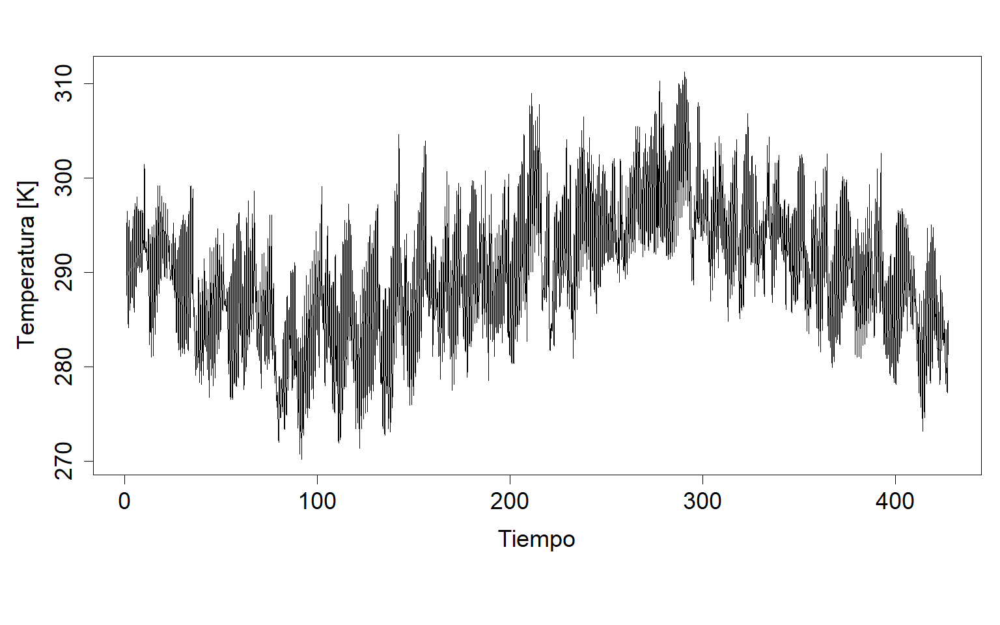
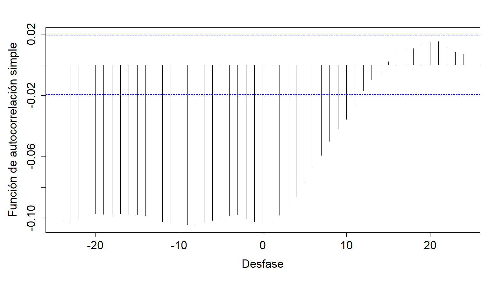
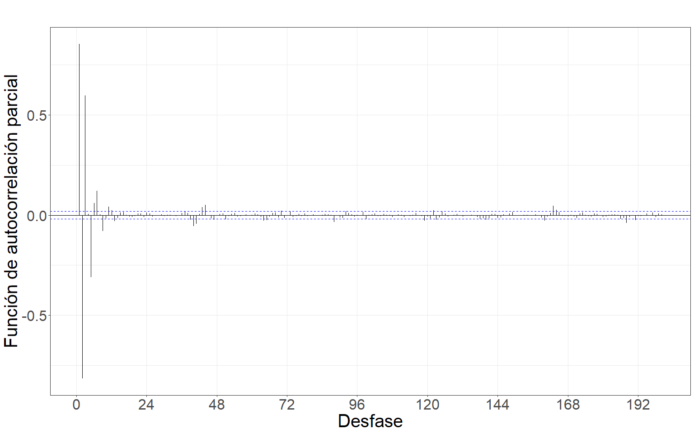
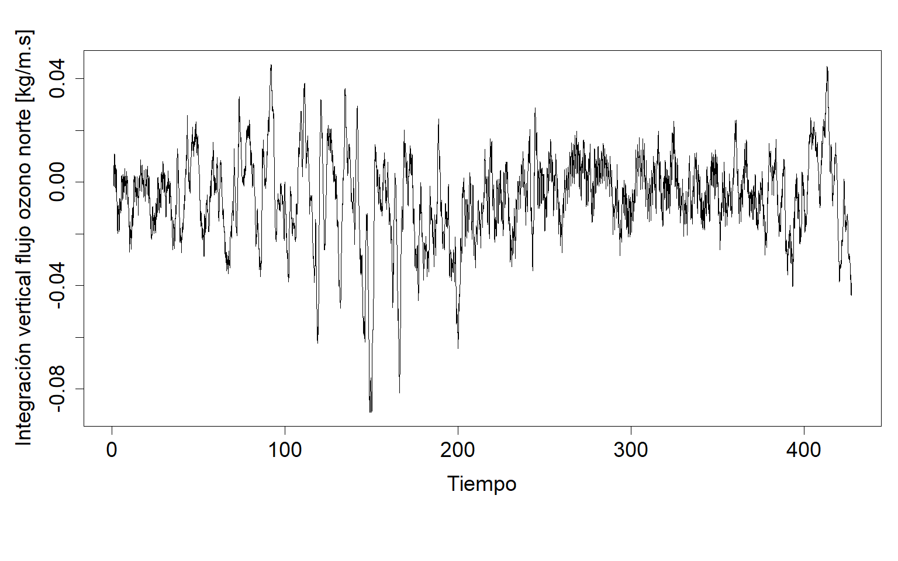
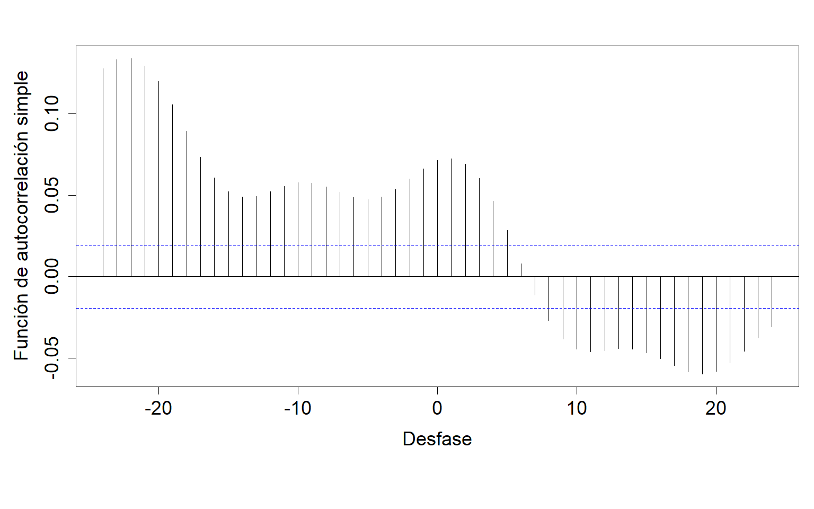
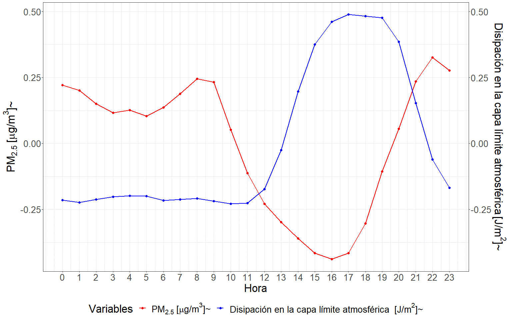
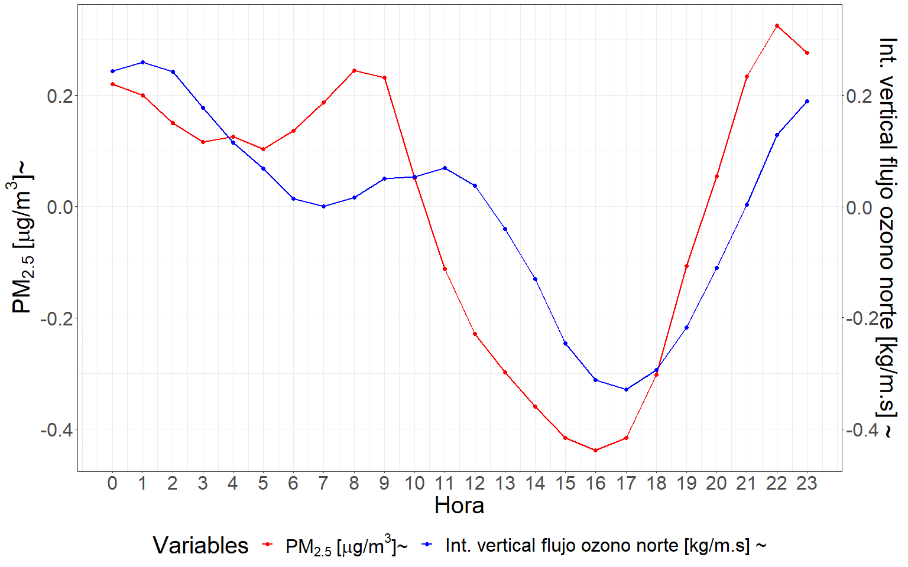
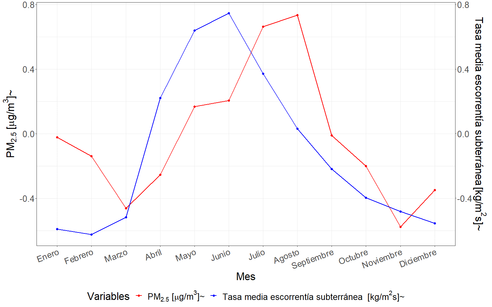
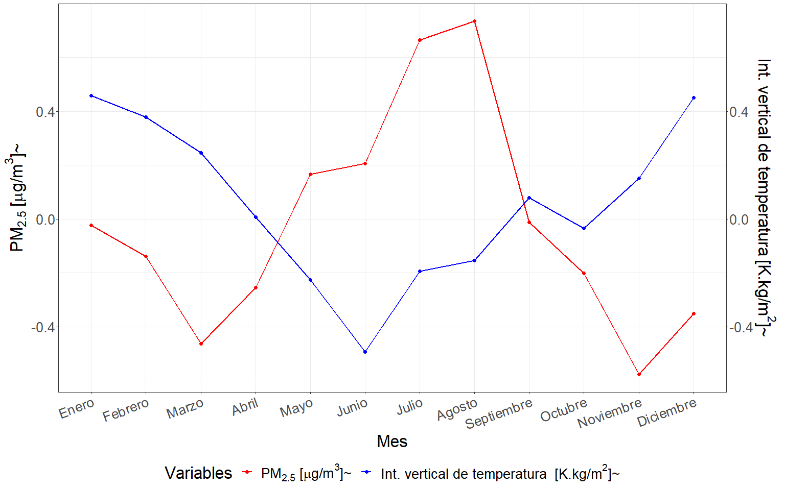
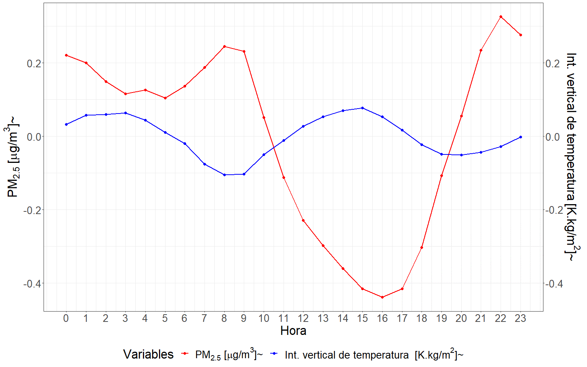

# Anexo 1: Bases de datos {-}

### Base de datos original

  La base de datos original contó con un total de 193 variables estas son: hora del día, día de la semana, mes del año, día  del mes, estación del año, mes del año codificación seno, mes del año codificación coseno, día de la semana codificación seno, día de la semana codificación coseno, día del mes codificación seno, día del mes codificación coseno, hora del día codificación seno, hora del día codificación coseno, estación del año codificación seno, estación del año codificación coseno, componente u del viento a 100 m, componente v del viento a 100 m, componente u del viento neutral a 10 m, componente u del viento a 10 m, componente v del viento neutral a 10 m, componente v del viento a 10 m, ráfaga de viento a 10 m desde el posprocesamiento anterior, temperatura del punto de rocío a 2 m, temperatura a 2 m, ángulo de orografía a escala inferior a la cuadrícula, anisotropía de la orografía a escala inferior a la cuadrícula, disipación de la capa límite, altura de la capa límite, cielo despejado, radiación solar directa en la superficie, altura de la base de las nubes, energía potencial convectiva disponible, inhibición convectiva, precipitación convectiva, tasa de lluvia convectiva, radiación ultravioleta descendente en la superficie, tensión superficial de ondas de gravedad hacia el este, tensión superficial turbulenta hacia el este, evaporación, evaporación del suelo desnudo, evaporación desde la parte superior del dosel, evaporación de la transpiración de la vegetación, albedo previsto, logaritmo previsto de la rugosidad de la superficie para el calor, superficie prevista rugosidad, velocidad de fricción, geopotencial, disipación de ondas de gravedad, nubosidad alta, cubierta de vegetación alta, ráfaga de viento instantánea de 10 m, tensión superficial turbulenta instantánea hacia el este, fracción de precipitación superficial instantánea a gran escala, flujo de humedad instantáneo, tensión superficial turbulenta instantánea hacia el norte, superficie sensible instantánea flujo de calor, índice k, precipitación a gran escala, fracción de precipitación a gran escala, tasa de lluvia a gran escala, índice de área foliar vegetación alta, índice de área foliar vegetación baja, cobertura de nubes baja, cobertura de vegetación baja, temperatura máxima de 2 m desde el procesamiento posterior anterior, total máximo tasa de precipitación desde el procesamiento posterior anterior, disipación media de la capa límite, tasa media de precipitación convectiva, tensión superficial turbulenta media hacia el este, tasa media de evaporación, disipación media de ondas de gravedad, fracción de precipitación media a gran escala, tasa media de precipitaciones a gran escala, tensión superficial media de ondas de gravedad hacia el norte, tensión superficial turbulenta media hacia el norte, tasa de evaporación potencial media, tasa de escorrentía media, presión media a nivel del mar, tasa de escorrentía subsuperficial media, flujo de radiación de onda corta directa en superficie media, flujo de radiación de onda larga hacia abajo en superficie media, flujo de radiación de onda corta en superficie media hacia abajo, flujo de radiación ultravioleta descendente medio en la superficie, flujo de calor latente superficial medio, flujo de radiación de onda larga neta superficial media, tasa de escorrentía superficial media, flujo de calor sensible superficial medio, flujo de radiación de onda corta descendente media superior, flujo de radiación de onda larga neta superior media, media flujo de radiación de onda corta neto superior, tasa de precipitación total media, gradiente vertical medio de refractividad dentro de la capa de captura, divergencia de humedad integrada verticalmente media, cobertura de nubes media, temperatura mínima de 2 m desde el posprocesamiento anterior, tasa de precipitación total mínima desde el posprocesamiento anterior, gradiente vertical mínimo de refractividad dentro de la capa de captura, albedo de infrarrojo cercano para radiación difusa, albedo de infrarrojo cercano para radiación directa, tensión superficial de ondas de gravedad hacia el norte, tensión superficial turbulenta hacia el norte, evaporación potencial, tipo de precipitación, escorrentía, pendiente de la orografía a escala subcuadrícula, tipo de suelo, desviación estándar de orografía de subred filtrada, desviación estándar de la orografía, escorrentía subsuperficial, flujo de calor latente superficial, radiación solar neta superficial, radiación térmica neta superficial, presión superficial, escorrentía superficial, flujo de calor sensible superficial, radiación solar superficial hacia abajo, radiación térmica superficial hacia abajo, toa radiación solar incidente, radiación solar neta superior, radiación térmica neta superior, nubosidad total, columna total de agua helada de la nube, columna total de agua líquida de la nube, columna total de ozono, columna total de agua de lluvia, columna total de agua, columna total de vapor de agua, evaporación total, precipitación total, cielo total, radiación solar directa en la superficie, índice de totales totales, altura base de la capa de captura, altura superior de la capa de captura, tipo de vegetación alta, tipo de vegetación baja, componente u deriva de Stokes, albedo uv visible para radiación difusa, uv visible albedo para radiación directa, componente v deriva de Stokes, integral vertical de divergencia del flujo de agua congelada en la nube, integral vertical de divergencia del flujo de agua líquida en la nube, integral vertical de divergencia del flujo geopotencial, integral vertical de divergencia del flujo de energía cinética, integral vertical de divergencia de flujo de masa, integral vertical de divergencia de flujo de humedad, integral vertical de divergencia de flujo de ozono, integral vertical de divergencia de flujo de energía térmica, integral vertical de divergencia de flujo de energía total, integral vertical de nube hacia el este flujo de agua congelada, integral vertical del flujo de agua líquida en la nube hacia el este, integral vertical del flujo geopotencial hacia el este, integral vertical del flujo de calor hacia el este, integral vertical del flujo de energía cinética hacia el este, integral vertical del flujo de masa hacia el este, integral vertical del flujo de ozono hacia el este, integral vertical del flujo de energía total hacia el este, integral vertical del flujo de vapor de agua hacia el este, integral vertical de conversión de energía, integral vertical de la energía cinética, integral vertical de la masa de la atmósfera, integral vertical de la tendencia de la masa, integral vertical del flujo de agua congelada de las nubes hacia el norte, integral vertical del flujo de agua líquida de las nubes hacia el norte, integral vertical del flujo geopotencial hacia el norte, integral vertical del calor hacia el norte integral vertical del flujo de energía cinética hacia el norte, integral vertical del flujo de masa hacia el norte, integral vertical del flujo de ozono hacia el norte, integral vertical del flujo de energía total hacia el norte, integral vertical del flujo de vapor de agua hacia el norte, integral vertical de energía potencial e interna, integral vertical de temperatura, integral vertical de energía térmica, integral vertical de energía total, divergencia de humedad integrada verticalmente, nivel de cero grados, viento a 100 m, viento a 10 m, viento neutro a 10 m, humedad relativa a 2 m, profundidad óptica de aerosoles (MERRA), incremento de la profundidad óptica de aerosoles (MERRA), incremento de la profundidad óptica de aerosoles (MAIAC), profundidad óptica de aerosoles (MAIAC), altura de la capa límite atmosférica, máscara de fuego VNP14A1 001, temperatura de la superficie terrestre (MODIS) y tráfico de vehículos (GOOGLE).

### Bases de datos reducidas

#### uso del suelo urbano

  La base de datos reducida para el uso del suelo urbano contó con un total de 77 variables estas son: hora del día, día de la semana, mes del año, día  del mes, estación del año, mes del año codificación seno, mes del año codificación coseno, día de la semana codificación seno, día de la semana codificación coseno, día del mes codificación seno, día del mes codificación coseno, hora del día codificación seno, hora del día codificación coseno, estación del año codificación seno, estación del año codificación coseno, componente v de viento neutral a 10 m, temperatura a 2 m, energía potencial convectiva disponible, tasa de lluvia convectiva, tensión de la superficie de la onda de gravedad hacia el este, evaporación del suelo desnudo, evaporación de la transpiración de la vegetación, pronóstico del logaritmo de la rugosidad de la superficie para el calor, pronóstico de la rugosidad de la superficie, disipación de la onda de gravedad, nubosidad alta, tensión superficial turbulenta instantánea hacia el este, flujo de humedad instantáneo, tasa media de escorrentía, presión media a nivel del mar, tasa media de escorrentía subsuperficial, flujo de radiación de onda larga neta superficial media, divergencia de humedad integrada verticalmente media, cubierta de nubes media, gradiente vertical mínimo de refractividad dentro de la capa de captura, cerca del albedo ir para la radiación difusa, tensión superficial de la onda de gravedad hacia el norte, escorrentía subsuperficial, radiación térmica neta superior, cobertura total de nubes, columna total de ozono, columna total de agua de lluvia, columna total de agua, precipitación total, total índice de totales, altura superior de la capa de captura, integral vertical de divergencia del flujo de agua congelada en la nube, integral vertical de divergencia del flujo de agua líquida en la nube, integral vertical de divergencia del flujo geopotencial, integral vertical de divergencia del flujo de energía cinética, integral vertical de divergencia de flujo de masa, integral vertical de la divergencia del flujo de ozono, integral vertical de la nube hacia el este flujo de agua congelada, integral vertical de la nube hacia el este flujo de agua líquida, integral vertical del flujo de energía total hacia el este, integral vertical del flujo de vapor de agua hacia el este, integral vertical de la nube hacia el norte flujo de agua congelada, integral vertical del flujo de agua líquida de la nube hacia el norte, integral vertical del flujo de energía cinética hacia el norte, integral vertical del flujo de ozono hacia el norte, integral vertical del flujo de vapor de agua hacia el norte, nivel de cero grados, viento neutro a 10 m, humedad relativa a 2 m, punto de rocío temperatura a 2 m, tasa de precipitación media a gran escala, presión superficial, cielo despejado, radiación solar directa en la superficie, altura de la capa límite, disipación de la capa límite, profundidad óptica de aerosoles (MERRA), incremento de la profundidad óptica de aerosoles (MERRA), incremento de la profundidad óptica de aerosoles (MAIAC), altura de la capa límite atmosférica, VNP14A1 001 máscara de fuego, temperatura de la superficie terrestre (MODIS) y tráfico de vehículos (GOOGLE).

#### uso del suelo industrial

  La base de datos reducida para el uso del suelo industrial contó con un total de 53 variables estas son: hora del día, día de la semana, mes del año, día  del mes, estación del año, mes del año codificación seno, mes del año codificación coseno, día de la semana codificación seno, día de la semana codificación coseno, día del mes codificación seno, día del mes codificación coseno, hora del día codificación seno, hora del día codificación coseno, estación del año codificación seno, estación del año codificación coseno, tensión superficial de la onda de gravedad hacia el este, evaporación desde la parte superior del dosel, evaporación de la transpiración de la vegetación, ráfaga de viento instantánea de 10 m, tensión superficial turbulenta instantánea hacia el este, flujo de humedad instantáneo, índice k, presión media a nivel del mar, tensión superficial de la onda de gravedad hacia el norte, escorrentía, sub escorrentía superficial, columna total de ozono, integral vertical de divergencia del flujo de agua líquida en la nube, integral vertical de divergencia del flujo de energía cinética, integral vertical de divergencia del flujo de humedad, integral vertical de divergencia del flujo de ozono, integral vertical de divergencia del flujo total de energía , integral vertical del flujo de agua líquida de la nube hacia el este, integral vertical del flujo de energía cinética hacia el este, integral vertical del flujo de vapor de agua hacia el este, integral vertical de tendencia de masa, integral vertical del flujo de calor hacia el norte, integral vertical del flujo de ozono hacia el norte, nivel de cero grados, temperatura a 2 m, humedad relativa a 2 m, punto de rocío temperatura a 2 m, tasa media de precipitación a gran escala, viento neutro a 10 m, presión superficial, cielo despejado, radiación solar directa en la superficie, altura de la capa límite, disipación de la capa límite, profundidad óptica de aerosoles (MERRA), incremento de la profundidad óptica de aerosoles (MERRA), incremento de la profundidad óptica de aerosoles (MAIAC), altura de la capa límite atmosférica, VNP14A1 001 máscara de fuego, temperatura de la superficie terrestre (MODIS) y tráfico de vehículos (GOOGLE).

#### uso del suelo agrícola y área verde

  La base de datos reducida para el uso del suelo agrícola y área verde contó con un total de 84 variables estas son: hora del día, día de la semana, mes del año, día  del mes, estación del año, mes del año codificación seno, mes del año codificación coseno, día de la semana codificación seno, día de la semana codificación coseno, día del mes codificación seno, día del mes codificación coseno, hora del día codificación seno, hora del día codificación coseno, estación del año codificación seno, estación del año codificación coseno, componente v del viento a 100 m, componente u del viento neutral a 10 m, energía potencial convectiva disponible, tasa de lluvia convectiva, tensión de la superficie de la onda de gravedad hacia el este, evaporación de la transpiración de la vegetación, albedo pronosticado, logaritmo pronosticado de la rugosidad de la superficie para el calor, disipación de la onda de gravedad, nubes altas cobertura, temperatura máxima de 2 m desde el posprocesamiento anterior, tasa media de evaporación, tasa media de precipitación a gran escala, tensión superficial media de la onda de gravedad hacia el norte, tasa media de escorrentía, presión media a nivel del mar, tasa media de escorrentía subsuperficial, flujo de radiación de onda larga neta superficial media, gradiente vertical medio de refractividad dentro de la capa atrapante, nubosidad media, tipo de precipitación, escorrentía subsuperficial, flujo de calor latente superficial, flujo de calor sensible superficial, radiación térmica neta superior, nubosidad total, columna de agua total, precipitación total, índice de totales totales, altura de la base de la capa de captura, tipo de vegetación baja, albedo visible uv para radiación difusa, integral vertical de divergencia del flujo de agua congelada en la nube, integral vertical de divergencia del flujo de agua líquida en la nube, integral vertical de divergencia del flujo de energía cinética, integral vertical de divergencia del flujo de ozono, integral vertical de la divergencia del flujo de energía térmica, integral vertical de la divergencia del flujo de energía total, integral vertical del flujo de agua congelada en la nube hacia el este, integral vertical del flujo de agua líquida en la nube hacia el este, integral vertical del flujo geopotencial hacia el este, integral vertical de flujo de ozono hacia el este, integral vertical del flujo de vapor de agua hacia el este, integral vertical de la masa de la atmósfera, integral vertical de la tendencia de la masa, integral vertical del flujo de agua congelada en las nubes hacia el norte, integral vertical del flujo de agua líquida en las nubes hacia el norte, integral vertical del flujo de calor hacia el norte, integral vertical del flujo de ozono hacia el norte, integral vertical del flujo de vapor de agua hacia el norte, integral vertical de temperatura, divergencia de humedad integrada verticalmente, nivel de cero grados, viento neutro a 10 m, temperatura a 2 m, humedad relativa a 2 m, temperatura del punto de rocio a 2 m, presión superficial, cielo despejado directo radiación solar en la superficie, pbl, flujo de humedad instantáneo, altura de la capa límite, disipación de la capa límite, profundidad óptica de aerosoles (MERRA), incremento de la profundidad óptica de aerosoles (MERRA), incremento de la profundidad óptica de aerosoles (MAIAC), altura de la capa límite atmosférica, máscara de fuego VNP14A1 001, temperatura de la superficie terrestre (MODIS) y tráfico de vehículos (GOOGLE).
  
  
# Anexo 2: Procedimiento de análisis de series temporales {-}

  La presente sección incluye los resultados obtenidos a partir del procedimiento completo de análisis de series temporales desarrollado durante el capítulo [4](#cap:var), para el análisis de las variables derivadas a partir de información satelital y meteorológicas. En la misma se incluye desde los resultados del análisis descriptivo hasta los obtenidos en el procedimiento de ajuste del modelo teórico y el análisis de correlación cruzada para cada una de las variables analizadas.  

#### Temperatura

```{r sertemp, echo=FALSE, out.width="100%", fig.align="center",fig.cap="(ref:sertemp)"}

```
(ref:sertemp) Gráfico de la serie horaria promedio de temperatura.

```{r fastemp, echo=FALSE, out.width="100%", fig.align="center",fig.cap="(ref:fastemp)"}

```
(ref:fastemp) Gráfico de la función de autocorrelación simple de la serie.

```{r faptemp, echo=FALSE, out.width="100%", fig.align="center",fig.cap="(ref:faptemp)"}

```
(ref:faptemp) Gráfico de la función de autocorrelación parcial de la serie.

```{r ccftemp, echo=FALSE, out.width="100%", fig.align="center",fig.cap="(ref:ccftemp)"}

```
(ref:ccftemp) Gráfico de la correlación cruzada entre las series previo al filtrado por el modelo teórico.

Table: Modelo teórico ajustado.\label{tab:modtemp}

| Modelo | AIC | AICc	| BIC |
|------------------------------|:-------:|:-------:|:-------:|
| ARIMA(2,0,1)(2,1,0)[24] | 18579.78 | 18579.79 | 18579.79 |

```{r mfastemp, echo=FALSE, out.width="100%", fig.align="center",fig.cap="(ref:mfastemp)"}

```
(ref:mfastemp) Gráfico de la función de autocorrelación simple de la serie filtrada por el modelo teórico ajustado.

```{r mfaptemp, echo=FALSE, out.width="100%", fig.align="center",fig.cap="(ref:mfaptemp)"}

```
(ref:mfaptemp) Gráfico de la función de autocorrelación parcial de la serie filtrada por el modelo teórico ajustado.

```{r mccftemp, echo=FALSE, out.width="100%", fig.align="center",fig.cap="(ref:mccftemp)"}
knitr::include_graphics("images/anexo/mccftemp.png")
```
(ref:mccftemp) Gráfico de la correlación cruzada entre las series filtradas por el modelo teórico ajustado.

Table: Coeficientes estimados de la relación funcional.\label{tab:coeftemp}

| Desfasaje | Con diferenciación | Sin diferenciación |
|----------|:-------:|:-------:|
| t | -0.1573001 | -1.04115 | 
| t-1 | 0.2441853 | 1.44786 |
| t-12 | -0.0197213 | -0.06497 |
| t-24 | -0.2628158 | -0.68048 |

#### Humedad relativa

```{r serhum, echo=FALSE, out.width="100%", fig.align="center",fig.cap="(ref:serhum)"}

```
(ref:serhum) Gráfico de la serie horaria promedio de humedad relativa.

```{r fashum, echo=FALSE, out.width="100%", fig.align="center",fig.cap="(ref:fashum)"}

```
(ref:fashum) Gráfico de la función de autocorrelación simple de la serie.

```{r faphum, echo=FALSE, out.width="100%", fig.align="center",fig.cap="(ref:faphum)"}

```
(ref:faphum) Gráfico de la función de autocorrelación parcial de la serie.

```{r ccfhum, echo=FALSE, out.width="100%", fig.align="center",fig.cap="(ref:ccfhum)"}

```
(ref:ccfhum) Gráfico de la correlación cruzada entre las series previo al filtrado por el modelo teórico ajustado.

Table: Modelo teórico ajustado.\label{tab:modhum}

| Modelo | AIC | AICc	| BIC |
|------------------------------|:-------:|:-------:|:-------:|
| ARIMA(5,0,0)(2,1,0)[24] | 32693.17 | 32693.18 | 32751.02 |

```{r mfashum, echo=FALSE, out.width="100%", fig.align="center",fig.cap="(ref:mfashum)"}

```
(ref:mfashum) Gráfico de la función de autocorrelación simple de la serie filtrada por el modelo teórico ajustado.

```{r mfaphum, echo=FALSE, out.width="100%", fig.align="center",fig.cap="(ref:mfaphum)"}

```
(ref:mfaphum) Gráfico de la función de autocorrelación parcial de la serie filtrada por el modelo teórico ajustado.

```{r mccfhum, echo=FALSE, out.width="100%", fig.align="center",fig.cap="(ref:mccfhum)"}
knitr::include_graphics("images/anexo/mccfhum.png")
```
(ref:mccfhum) Gráfico de la correlación cruzada entre las series filtradas por el modelo teórico ajustado.

Table: Coeficientes estimados de la relación funcional.\label{tab:coefhum}

| Desfasaje | Con diferenciación | Sin diferenciación |
|----------|:-------:|:-------:| 
| t-5 | -0.2681536 | -0.2548 | 
| t-24 | 0.1367988 | 0.1309 |

#### Temperatura del punto de rocío

```{r serroc, echo=FALSE, out.width="100%", fig.align="center",fig.cap="(ref:serroc)"}

```
(ref:serroc) Gráfico de la serie horaria promedio de temperatura del punto de rocío.

```{r fasroc, echo=FALSE, out.width="100%", fig.align="center",fig.cap="(ref:fasroc)"}

```
(ref:fasroc) Gráfico de la función de autocorrelación simple de la serie.

```{r faproc, echo=FALSE, out.width="100%", fig.align="center",fig.cap="(ref:faproc)"}

```
(ref:faproc) Gráfico de la función de autocorrelación parcial de la serie.

```{r ccfroc, echo=FALSE, out.width="100%", fig.align="center",fig.cap="(ref:ccfroc)"}

```
(ref:ccfroc) Gráfico de la correlación cruzada entre las series previo al filtrado por el modelo teórico ajustado.

Table: Modelo teórico ajustado.\label{tab:modroc}

| Modelo | AIC | AICc	| BIC |
|------------------------------|:-------:|:-------:|:-------:|
| ARIMA(3,1,0)(2,0,0)[24] | 19288.83 | 19288.84 | 19332.23 |

```{r mfasroc, echo=FALSE, out.width="100%", fig.align="center",fig.cap="(ref:mfasroc)"}

```
(ref:mfasroc) Gráfico de la función de autocorrelación simple de la serie filtrada por el modelo teórico ajustado.

```{r mfaproc, echo=FALSE, out.width="100%", fig.align="center",fig.cap="(ref:mfaproc)"}

```
(ref:mfaproc) Gráfico de la función de autocorrelación parcial de la serie filtrada por el modelo teórico ajustado.

```{r mccfroc, echo=FALSE, out.width="100%", fig.align="center",fig.cap="(ref:mccfroc)"}
knitr::include_graphics("images/anexo/mccfroc.png")
```
(ref:mccfroc) Gráfico de la correlación cruzada entre las series filtradas por el modelo teórico ajustado.

Table: Coeficientes estimados de la relación funcional.\label{tab:coefroc}

| Desfasaje | Con diferenciación | Sin diferenciación |
|----------|:-------:|:-------:| 
| t-11 | -0.1597575 | -0.2921 | 
| t-14 | -0.3212396 | -0.3222  |
| t-20 | 0.3752728 | -0.3377 |

#### Precipitación convectiva

```{r serrain, echo=FALSE, out.width="100%", fig.align="center",fig.cap="(ref:serrain)"}

```
(ref:serrain) Gráfico de la serie horaria promedio de precipitación convectiva.

```{r fasrain, echo=FALSE, out.width="100%", fig.align="center",fig.cap="(ref:fasrain)"}

```
(ref:fasrain) Gráfico de la función de autocorrelación simple de la serie.

```{r faprain, echo=FALSE, out.width="100%", fig.align="center",fig.cap="(ref:faprain)"}

```
(ref:faprain) Gráfico de la función de autocorrelación parcial de la serie.

```{r ccfrain, echo=FALSE, out.width="100%", fig.align="center",fig.cap="(ref:ccfrain)"}

```
(ref:ccfrain) Gráfico de la correlación cruzada entre las series previo al filtrado por el modelo teórico ajustado.

Table: Modelo teórico ajustado.\label{tab:modrain}

| Modelo | AIC | AICc	| BIC |
|------------------------------|:-------:|:-------:|:-------:|
| ARIMA(0,1,5)(0,0,0)[24] | -152270.8 | -152270.8 | -152227.4 |

```{r mfasrain, echo=FALSE, out.width="100%", fig.align="center",fig.cap="(ref:mfasrain)"}
knitr::include_graphics("images/anexo/mfasrain.png")
```
(ref:mfasrain) Gráfico de la función de autocorrelación simple de la serie filtrada por el modelo teórico ajustado.

```{r mfaprain, echo=FALSE, out.width="100%", fig.align="center",fig.cap="(ref:mfaprain)"}

```
(ref:mfaprain) Gráfico de la función de autocorrelación parcial de la serie filtrada por el modelo teórico ajustado.

```{r mccfrain, echo=FALSE, out.width="100%", fig.align="center",fig.cap="(ref:mccfrain)"}

```
(ref:mccfrain) Gráfico de la correlación cruzada entre las series filtradas por el modelo teórico ajustado.

Table: Coeficientes estimados de la relación funcional.\label{tab:coefrain}

| Desfasaje | Con diferenciación | Sin diferenciación |
|----------|:-------:|:-------:| 
| t-1 | -6.162e+01 | -3466.73 | 

#### Velocidad del viento

```{r servient, echo=FALSE, out.width="100%", fig.align="center",fig.cap="(ref:servient)"}

```
(ref:servient) Gráfico de la serie horaria promedio de velocidad del viento.

```{r fasvient, echo=FALSE, out.width="100%", fig.align="center",fig.cap="(ref:fasvient)"}

```
(ref:fasvient) Gráfico de la función de autocorrelación simple de la serie.

```{r fapvient, echo=FALSE, out.width="100%", fig.align="center",fig.cap="(ref:fapvient)"}

```
(ref:fapvient) Gráfico de la función de autocorrelación parcial de la serie.

```{r ccfvient, echo=FALSE, out.width="100%", fig.align="center",fig.cap="(ref:ccfvient)"}

```
(ref:ccfvient) Gráfico de la correlación cruzada entre las series previo al filtrado por el modelo teórico ajustado.

Table: Modelo teórico ajustado.\label{tab:modvient}

| Modelo | AIC | AICc	| BIC |
|------------------------------|:-------:|:-------:|:-------:|
| ARIMA(4,0,0)(2,1,0)[24] | 34503.31 | 34503.32 | 34553.93 |

```{r mfasvient, echo=FALSE, out.width="100%", fig.align="center",fig.cap="(ref:mfasvient)"}

```
(ref:mfasvient) Gráfico de la función de autocorrelación simple de la serie filtrada por el modelo teórico ajustado.

```{r mfapvient, echo=FALSE, out.width="100%", fig.align="center",fig.cap="(ref:mfapvient)"}

```
(ref:mfapvient) Gráfico de la función de autocorrelación parcial de la serie filtrada por el modelo teórico ajustado.

```{r mccfvient, echo=FALSE, out.width="100%", fig.align="center",fig.cap="(ref:mccfvient)"}
knitr::include_graphics("images/anexo/mccfvient.png")
```
(ref:mccfvient) Gráfico de la correlación cruzada entre las series filtradas por el modelo teórico ajustado.

Table: Coeficientes estimados de la relación funcional.\label{tab:coefvient}

| Desfasaje | Con diferenciación | Sin diferenciación |
|----------|:-------:|:-------:| 
| t-5 | 0.1016645 | -0.1288 | 
| t-7 | 0.1317611 | -0.03429  |
| t-8 | 0.1445327 | -0.006416 |
| t-24 | -0.1998146 | -0.3433 |
  
#### Presión atmosférica

<!-- #### Presión atmosférica -->

<!-- ```{r serpres, echo=FALSE, out.width="100%", fig.align="center",fig.cap="(ref:serpres)"} -->
<!--  -->
<!-- ``` -->
<!-- (ref:serpres) Gráfico de la serie horaria promedio de presión atmosférica. -->

<!-- ```{r faspres, echo=FALSE, out.width="100%", fig.align="center",fig.cap="(ref:faspres)"} -->
<!--  -->
<!-- ``` -->
<!-- (ref:faspres) Gráfico de la función de autocorrelación simple de la serie. -->

<!-- ```{r fappres, echo=FALSE, out.width="100%", fig.align="center",fig.cap="(ref:fappres)"} -->
<!--  -->
<!-- ``` -->
<!-- (ref:fappres) Gráfico de la función de autocorrelación parcial de la serie. -->

<!-- ```{r ccfpres, echo=FALSE, out.width="100%", fig.align="center",fig.cap="(ref:ccfpres)"} -->
<!--  -->
<!-- ``` -->
<!-- (ref:ccfpres) Gráfico de la correlación cruzada entre las series previo al filtrado por el modelo teórico ajustado. -->

<!-- Table: Modelo teórico ajustado.\label{tab:modpres} -->

<!-- | Modelo | AIC | AICc	| BIC | -->
<!-- |------------------------------|:-------:|:-------:|:-------:| -->
<!-- | ARIMA(6,3,6)(6,2,6)[24] | 131088.9 | 131088.9 | 131132.3 | -->

<!-- ```{r mfaspres, echo=FALSE, out.width="100%", fig.align="center",fig.cap="(ref:mfaspres)"} -->
<!--  -->
<!-- ``` -->
<!-- (ref:mfaspres) Gráfico de la función de autocorrelación simple de la serie filtrada por el modelo teórico ajustado. -->

<!-- ```{r mfappres, echo=FALSE, out.width="100%", fig.align="center",fig.cap="(ref:mfappres)"} -->
<!-- knitr::include_graphics("images/anexo/mfappres.png") -->
<!-- ``` -->
<!-- (ref:mfappres) Gráfico de la función de autocorrelación parcial de la serie filtrada por el modelo teórico ajustado. -->

<!-- ```{r mccfpres, echo=FALSE, out.width="100%", fig.align="center",fig.cap="(ref:mccfpres)"} -->
<!-- knitr::include_graphics("images/anexo/mccfpres.png") -->
<!-- ``` -->
<!-- (ref:mccfpres) Gráfico de la correlación cruzada entre las series filtradas por el modelo teórico ajustado. -->

<!-- Table: Coeficientes estimados de la relación funcional.\label{tab:coefpres} -->

<!-- | Desfasaje | Con diferenciación | Sin diferenciación | -->
<!-- |----------|:-------:|:-------:| -->
<!-- | t-1 | -2.577e-03 | -3.582e-03 | -->
<!-- | t-10 | 3.933e-04 | 5.467e-03 | -->

```{r serpresmar, echo=FALSE, out.width="100%", fig.align="center",fig.cap="(ref:serpresmar)"}

```
(ref:serpresmar) Gráfico de la serie horaria promedio de presión atmosférica al nivel del mar.

```{r faspresmar, echo=FALSE, out.width="100%", fig.align="center",fig.cap="(ref:faspresmar)"}

```
(ref:faspresmar) Gráfico de la función de autocorrelación simple de la serie.

```{r fappresmar, echo=FALSE, out.width="100%", fig.align="center",fig.cap="(ref:fappresmar)"}

```
(ref:fappresmar) Gráfico de la función de autocorrelación parcial de la serie.

```{r ccfpresmar, echo=FALSE, out.width="100%", fig.align="center",fig.cap="(ref:ccfpresmar)"}

```
(ref:ccfpresmar) Gráfico de la correlación cruzada entre las series previo al filtrado por el modelo teórico ajustado.

```{r mfaspresmar, echo=FALSE, out.width="100%", fig.align="center",fig.cap="(ref:mfaspresmar)"}

```
(ref:mfaspresmar) Gráfico de la función de autocorrelación simple de la serie filtrada por el modelo teórico ajustado.

Table: Modelo teórico ajustado.\label{tab:modpresmar}

| Modelo | AIC | AICc	| BIC |
|------------------------------|:-------:|:-------:|:-------:|
| ARIMA(4,1,2)(2,1,2)[24] | 104424.1 | 104424.1 | 104474.7 |

```{r mfappresmar, echo=FALSE, out.width="100%", fig.align="center",fig.cap="(ref:mfappresmar)"}

```
(ref:mfappresmar) Gráfico de la función de autocorrelación parcial de la serie filtrada por el modelo teórico ajustado.

```{r mccfpresmar, echo=FALSE, out.width="100%", fig.align="center",fig.cap="(ref:mccfpresmar)"}
knitr::include_graphics("images/anexo/mccfpresmar.png")
```
(ref:mccfpresmar) Gráfico de la correlación cruzada entre las series filtradas por el modelo teórico ajustado.

Table: Coeficientes estimados de la relación funcional.\label{tab:coefpresmar}

| Desfasaje | Con diferenciación | Sin diferenciación |
|----------|:-------:|:-------:|
| t | -0.003024 | -3.434e-03 |
| t-9 | 0.002529 | -7.623e-04 |
| t-19 | 0.008081 | 6.478e-03 |

#### Radiación solar

```{r serrad, echo=FALSE, out.width="100%", fig.align="center",fig.cap="(ref:serrad)"}

```
(ref:serrad) Gráfico de la serie horaria promedio de radiación solar.

```{r fasrad, echo=FALSE, out.width="100%", fig.align="center",fig.cap="(ref:fasrad)"}
knitr::include_graphics("images/anexo/fasrad.png")
```
(ref:fasrad) Gráfico de la función de autocorrelación simple de la serie.

```{r faprad, echo=FALSE, out.width="100%", fig.align="center",fig.cap="(ref:faprad)"}

```
(ref:faprad) Gráfico de la función de autocorrelación parcial de la serie.

```{r ccfrad, echo=FALSE, out.width="100%", fig.align="center",fig.cap="(ref:ccfrad)"}

```
(ref:ccfrad) Gráfico de la correlación cruzada entre las series previo al filtrado por el modelo teórico ajustado.

Table: Modelo teórico ajustado.\label{tab:modrad}

| Modelo | AIC | AICc	| BIC |
|------------------------------|:-------:|:-------:|:-------:|
| ARIMA(2,2,1)(4,3,2)[24] | 248262.3 | 248262.3 | 248327.4 |

```{r mfasrad, echo=FALSE, out.width="100%", fig.align="center",fig.cap="(ref:mfasrad)"}

```
(ref:mfasrad) Gráfico de la función de autocorrelación simple de la serie filtrada por el modelo teórico ajustado.

```{r mfaprad, echo=FALSE, out.width="100%", fig.align="center",fig.cap="(ref:mfaprad)"}

```
(ref:mfaprad) Gráfico de la función de autocorrelación parcial de la serie filtrada por el modelo teórico ajustado.

```{r mccfrad, echo=FALSE, out.width="100%", fig.align="center",fig.cap="(ref:mccfrad)"}
knitr::include_graphics("images/anexo/mccfrad.png")
```
(ref:mccfrad) Gráfico de la correlación cruzada entre las series filtradas por el modelo teórico ajustado.

Table: Coeficientes estimados de la relación funcional.\label{tab:coefrad}

| Desfasaje | Con diferenciación | Sin diferenciación |
|----------|:-------------:|:-------------:|
| t-13 | 4.023e-07 | 2.753e-07 |
| t-23 | -1.884e-06 | -2.413e-06 |

#### Profundidad óptica de aerosoles

```{r seraod, echo=FALSE, out.width="100%", fig.align="center",fig.cap="(ref:seraod)"}

```
(ref:seraod) Gráfico de la serie horaria promedio de profundidad óptica de aerosoles.

```{r fasaod, echo=FALSE, out.width="100%", fig.align="center",fig.cap="(ref:fasaod)"}

```
(ref:fasaod) Gráfico de la función de autocorrelación simple de la serie.

```{r fapaod, echo=FALSE, out.width="100%", fig.align="center",fig.cap="(ref:fapaod)"}

```
(ref:fapaod) Gráfico de la función de autocorrelación parcial de la serie.

```{r ccfaod, echo=FALSE, out.width="100%", fig.align="center",fig.cap="(ref:ccfaod)"}

```
(ref:ccfaod) Gráfico de la correlación cruzada entre las series previo al filtrado por el modelo teórico ajustado.

Table: Modelo teórico ajustado.\label{tab:modaod}

| Modelo | AIC | AICc	| BIC |
|------------------------------|:-------:|:-------:|:-------:|
| ARIMA(3,2,6)(3,1,6)[24] | 22579.78 | 22579.79 | 22579.79 |

```{r mfasaod, echo=FALSE, out.width="100%", fig.align="center",fig.cap="(ref:mfasaod)"}

```
(ref:mfasaod) Gráfico de la función de autocorrelación simple de la serie filtrada por el modelo teórico ajustado.

```{r mfapaod, echo=FALSE, out.width="100%", fig.align="center",fig.cap="(ref:mfapaod)"}

```
(ref:mfapaod) Gráfico de la función de autocorrelación parcial de la serie filtrada por el modelo teórico ajustado.

```{r mccfaod, echo=FALSE, out.width="100%", fig.align="center",fig.cap="(ref:mccfaod)"}
knitr::include_graphics("images/anexo/mccfaod.png")
```
(ref:mccfaod) Gráfico de la correlación cruzada entre las series filtradas por el modelo teórico ajustado.

Table: Coeficientes estimados de la relación funcional.\label{tab:coefaod}

| Desfasaje | Con diferenciación | Sin diferenciación |
|----------|:-------:|:-------:| 
| t | 6.777e+00 | 0.4331  |
| t-7 | 7.795e+00 | -0.9688 |
| t-8 | 1.384e+01 | -11.15574 |

#### Altura de la capa límite atmosférica

```{r serpbl, echo=FALSE, out.width="100%", fig.align="center",fig.cap="(ref:serpbl)"}

```
(ref:serpbl) Gráfico de la serie horaria promedio de altura de la capa límite atmosférica.

```{r faspbl, echo=FALSE, out.width="100%", fig.align="center",fig.cap="(ref:faspbl)"}

```
(ref:faspbl) Gráfico de la función de autocorrelación simple de la serie.

```{r fappbl, echo=FALSE, out.width="100%", fig.align="center",fig.cap="(ref:fappbl)"}

```
(ref:fappbl) Gráfico de la función de autocorrelación parcial de la serie.

```{r ccfpbl, echo=FALSE, out.width="100%", fig.align="center",fig.cap="(ref:ccfpbl)"}
knitr::include_graphics("images/anexo/ccfpbl.png")
```
(ref:ccfpbl) Gráfico de la correlación cruzada entre las series previo al filtrado por el modelo teórico ajustado.

Table: Modelo teórico ajustado.\label{tab:modpbl}

| Modelo | AIC | AICc	| BIC |
|------------------------------|:-------:|:-------:|:-------:|
| ARIMA(2,0,0)(2,1,0)[24] | 123028.6 | 123028.6 | 123064.7 |

```{r mfaspbl, echo=FALSE, out.width="100%", fig.align="center",fig.cap="(ref:mfaspbl)"}

```
(ref:mfaspbl) Gráfico de la función de autocorrelación simple de la serie filtrada por el modelo teórico ajustado.

```{r mfappbl, echo=FALSE, out.width="100%", fig.align="center",fig.cap="(ref:mfappbl)"}

```
(ref:mfappbl) Gráfico de la función de autocorrelación parcial de la serie filtrada por el modelo teórico ajustado.

```{r mccfpbl, echo=FALSE, out.width="100%", fig.align="center",fig.cap="(ref:mccfpbl)"}
knitr::include_graphics("images/anexo/mccfpbl.png")
```
(ref:mccfpbl) Gráfico de la correlación cruzada entre las series filtradas por el modelo teórico ajustado.

Table: Coeficientes estimados de la relación funcional.\label{tab:coefpbl}

| Desfasaje | Con diferenciación | Sin diferenciación |
|----------|:-------:|:-------:| 
| t | -0.0019158 | -0.00436 |
| t-21 | -0.003367 | -0.004821 |
| t-24 | -1.928e-03 | -0.003588 |

#### Tráfico

```{r sertraf, echo=FALSE, out.width="100%", fig.align="center",fig.cap="(ref:sertraf)"}

```
(ref:sertraf) Gráfico de la serie horaria promedio de tráfico.

```{r fastraf, echo=FALSE, out.width="100%", fig.align="center",fig.cap="(ref:fastraf)"}

```
(ref:fastraf) Gráfico de la función de autocorrelación simple de la serie.

```{r faptraf, echo=FALSE, out.width="100%", fig.align="center",fig.cap="(ref:faptraf)"}

```
(ref:faptraf) Gráfico de la función de autocorrelación parcial de la serie.

```{r ccftraf, echo=FALSE, out.width="100%", fig.align="center",fig.cap="(ref:ccftraf)"}

```
(ref:ccftraf) Gráfico de la correlación cruzada entre las series previo al filtrado por el modelo teórico ajustado.

Table: Modelo teórico ajustado.\label{tab:modtraf}

| Modelo | AIC | AICc	| BIC |
|------------------------------|:-------:|:-------:|:-------:|
| ARIMA(3,2,5)(4,2,1)[24] | -17854.73 | -17854.72  | -17804.12 |

```{r mfastraf, echo=FALSE, out.width="100%", fig.align="center",fig.cap="(ref:mfastraf)"}
knitr::include_graphics("images/anexo/mfastraf.png")
```
(ref:mfastraf) Gráfico de la función de autocorrelación simple de la serie filtrada por el modelo teórico ajustado.

```{r mfaptraf, echo=FALSE, out.width="100%", fig.align="center",fig.cap="(ref:mfaptraf)"}

```
(ref:mfaptraf) Gráfico de la función de autocorrelación parcial de la serie filtrada por el modelo teórico ajustado.

```{r mccftraf, echo=FALSE, out.width="100%", fig.align="center",fig.cap="(ref:mccftraf)"}
knitr::include_graphics("images/anexo/mccftraf.png")
```
(ref:mccftraf) Gráfico de la correlación cruzada entre las series filtradas por el modelo teórico ajustado.

Table: Coeficientes estimados de la relación funcional.\label{tab:coeftraf}

| Desfasaje | Con diferenciación | Sin diferenciación |
|----------|:-------:|:-------:| 
| t-8 | 1.085e-01 | 2.442 |

#### Temperatura de la superficie terrestre

```{r serlst, echo=FALSE, out.width="100%", fig.align="center",fig.cap="(ref:serlst)"}

```
(ref:serlst) Gráfico de la serie horaria promedio de temperatura de la superficie terrestre.

```{r faslst, echo=FALSE, out.width="100%", fig.align="center",fig.cap="(ref:faslst)"}

```
(ref:faslst) Gráfico de la función de autocorrelación simple de la serie.

```{r faplst, echo=FALSE, out.width="100%", fig.align="center",fig.cap="(ref:faplst)"}

```
(ref:faplst) Gráfico de la función de autocorrelación parcial de la serie.

```{r ccflst, echo=FALSE, out.width="100%", fig.align="center",fig.cap="(ref:ccflst)"}

```
(ref:ccflst) Gráfico de la correlación cruzada entre las series previo al filtrado por el modelo teórico ajustado.

Table: Modelo teórico ajustado.\label{tab:modlst}

| Modelo | AIC | AICc	| BIC |
|------------------------------|:-------:|:-------:|:-------:|
| ARIMA(6,2,4)(4,1,6)[24] | 32396.77 | 32396.79 | 32469.08 |

```{r mfaslst, echo=FALSE, out.width="100%", fig.align="center",fig.cap="(ref:mfaslst)"}

```
(ref:mfaslst) Gráfico de la función de autocorrelación simple de la serie filtrada por el modelo teórico ajustado.

```{r mfaplst, echo=FALSE, out.width="100%", fig.align="center",fig.cap="(ref:mfaplst)"}

```
(ref:mfaplst) Gráfico de la función de autocorrelación parcial de la serie filtrada por el modelo teórico ajustado.

```{r mccflst, echo=FALSE, out.width="100%", fig.align="center",fig.cap="(ref:mccflst)"}

```
(ref:mccflst) Gráfico de la correlación cruzada entre las series filtradas por el modelo teórico ajustado.

Table: Coeficientes estimados de la relación funcional.\label{tab:coeflst}

| Desfasaje | Con diferenciación | Sin diferenciación |
|----------|:-------:|:-------:| 
| t-5 | -0.0139078 | -0.3025  |

#### Rugosidad de la superficie terrestre

```{r serrug, echo=FALSE, out.width="100%", fig.align="center",fig.cap="(ref:serrug)"}

```
(ref:serrug) Gráfico de la serie horaria promedio de rugosidad de la superficie terrestre.

```{r fasrug, echo=FALSE, out.width="100%", fig.align="center",fig.cap="(ref:fasrug)"}

```
(ref:fasrug) Gráfico de la función de autocorrelación simple de la serie.

```{r faprug, echo=FALSE, out.width="100%", fig.align="center",fig.cap="(ref:faprug)"}

```
(ref:faprug) Gráfico de la función de autocorrelación parcial de la serie.

```{r ccfrug, echo=FALSE, out.width="100%", fig.align="center",fig.cap="(ref:ccfrug)"}

```
(ref:ccfrug) Gráfico de la correlación cruzada entre las series previo al filtrado por el modelo teórico ajustado.

```{r mfasrug, echo=FALSE, out.width="100%", fig.align="center",fig.cap="(ref:mfasrug)"}

```
(ref:mfasrug) Gráfico de la función de autocorrelación simple de la serie filtrada por el modelo teórico ajustado.

Table: Modelo teórico ajustado.\label{tab:modrou}

| Modelo | AIC | AICc	| BIC |
|------------------------------|:-------:|:-------:|:-------:|
| ARIMA(4,2,4)(4,1,4)[24] | -76679 | -76678.97 | -76599.43 |

```{r mfaprug, echo=FALSE, out.width="100%", fig.align="center",fig.cap="(ref:mfaprug)"}

```
(ref:mfaprug) Gráfico de la función de autocorrelación parcial de la serie filtrada por el modelo teórico ajustado.

```{r mccfrug, echo=FALSE, out.width="100%", fig.align="center",fig.cap="(ref:mccfrug)"}

```
(ref:mccfrug) Gráfico de la correlación cruzada entre las series filtradas por el modelo teórico ajustado.

Table: Coeficientes estimados de la relación funcional.\label{tab:coefrou}

| Desfasaje | Con diferenciación | Sin diferenciación |
|----------|:-------:|:-------:| 
| t | 9.317e+01 | 111.32 |
| t-1 | -4.080e+01 | 92.03 |
| t-9 | -1.868e+01 | 66.55 |
| t-12 | 9.1090057  | 87.25 |
| t-13 | 0.4461504  | 89.23 |
| t-14 | 6.760e+00 | 91.01 |
| t-23 | -1.032e+01 | 55.22 |

#### Integración vertical flujo ozono norte

```{r seroznor, echo=FALSE, out.width="100%", fig.align="center",fig.cap="(ref:seroznor)"}

```
(ref:seroznor) Gráfico de la serie horaria promedio de integración vertical flujo ozono norte.

```{r fasoznor, echo=FALSE, out.width="100%", fig.align="center",fig.cap="(ref:fasoznor)"}

```
(ref:fasoznor) Gráfico de la función de autocorrelación simple de la serie.

```{r fapoznor, echo=FALSE, out.width="100%", fig.align="center",fig.cap="(ref:fapoznor)"}

```
(ref:fapoznor) Gráfico de la función de autocorrelación parcial de la serie.

```{r ccfoznor, echo=FALSE, out.width="100%", fig.align="center",fig.cap="(ref:ccfoznor)"}

```
(ref:ccfoznor) Gráfico de la correlación cruzada entre las series previo al filtrado por el modelo teórico ajustado.

Table: Modelo teórico ajustado.\label{tab:modoznor}

| Modelo | AIC | AICc	| BIC |
|------------------------------|:-------:|:-------:|:-------:|
| ARIMA(4,2,4)(4,2,4)[24] | -72004.18 | -72004.18 | -71982.48 |

```{r mfasoznor, echo=FALSE, out.width="100%", fig.align="center",fig.cap="(ref:mfasoznor)"}

```
(ref:mfasoznor) Gráfico de la función de autocorrelación simple de la serie filtrada por el modelo teórico ajustado.

```{r mfapoznor, echo=FALSE, out.width="100%", fig.align="center",fig.cap="(ref:mfapoznor)"}

```
(ref:mfapoznor) Gráfico de la función de autocorrelación parcial de la serie filtrada por el modelo teórico ajustado.

```{r mccfoznor, echo=FALSE, out.width="100%", fig.align="center",fig.cap="(ref:mccfoznor)"}

```
(ref:mccfoznor) Gráfico de la correlación cruzada entre las series filtradas por el modelo teórico ajustado.

Table: Coeficientes estimados de la relación funcional.\label{tab:coefoznor}

| Desfasaje | Con diferenciación | Sin diferenciación |
|----------|:-------:|:-------:| 
| t-18 | -3.189e+01 | 43.90 |
| t-19 | 1.219e+02 | 52.00 |

#### Tasa media de escorrentía subterránea

```{r seresc, echo=FALSE, out.width="100%", fig.align="center",fig.cap="(ref:seresc)"}

```
(ref:seresc) Gráfico de la serie horaria promedio de tasa media de escorrentía subterránea.

```{r fasesc, echo=FALSE, out.width="100%", fig.align="center",fig.cap="(ref:fasesc)"}

```
(ref:fasesc) Gráfico de la función de autocorrelación simple de la serie.

```{r fapesc, echo=FALSE, out.width="100%", fig.align="center",fig.cap="(ref:fapesc)"}

```
(ref:fapesc) Gráfico de la función de autocorrelación parcial de la serie.

```{r ccfesc, echo=FALSE, out.width="100%", fig.align="center",fig.cap="(ref:ccfesc)"}

```
(ref:ccfesc) Gráfico de la correlación cruzada entre las series previo al filtrado por el modelo teórico ajustado.

Table: Modelo teórico ajustado.\label{tab:modesc}

| Modelo | AIC | AICc	| BIC |
|------------------------------|:-------:|:-------:|:-------:|
| ARIMA(1,2,4)(4,2,3)[24] | -299719.1 | -299719.1 | -299711.8 |

```{r mfasesc, echo=FALSE, out.width="100%", fig.align="center",fig.cap="(ref:mfasesc)"}

```
(ref:mfasesc) Gráfico de la función de autocorrelación simple de la serie filtrada por el modelo teórico ajustado.

```{r mfapesc, echo=FALSE, out.width="100%", fig.align="center",fig.cap="(ref:mfapesc)"}

```
(ref:mfapesc) Gráfico de la función de autocorrelación parcial de la serie filtrada por el modelo teórico ajustado.

```{r mccfesc, echo=FALSE, out.width="100%", fig.align="center",fig.cap="(ref:mccfesc)"}

```
(ref:mccfesc) Gráfico de la correlación cruzada entre las series filtradas por el modelo teórico ajustado.

Table: Coeficientes estimados de la relación funcional.\label{tab:coefesc}

| Desfasaje | Con diferenciación | Sin diferenciación |
|----------|:------------:|:------------:|
| t-8 | -2.648e+05 | 5.770e+06 | 
| t-15 | 5.326e+04 | 5.633e+06 | 

#### Integración vertical de temperatura

```{r serintvert, echo=FALSE, out.width="100%", fig.align="center",fig.cap="(ref:serintvert)"}

```
(ref:serintvert) Gráfico de la serie horaria promedio de integración vertical de temperatura.

```{r fasintvert, echo=FALSE, out.width="100%", fig.align="center",fig.cap="(ref:fasintvert)"}

```
(ref:fasintvert) Gráfico de la función de autocorrelación simple de la serie.

```{r fapintvert, echo=FALSE, out.width="100%", fig.align="center",fig.cap="(ref:fapintvert)"}

```
(ref:fapintvert) Gráfico de la función de autocorrelación parcial de la serie.

```{r ccfintvert, echo=FALSE, out.width="100%", fig.align="center",fig.cap="(ref:ccfintvert)"}

```
(ref:ccfintvert) Gráfico de la correlación cruzada entre las series previo al filtrado por el modelo teórico ajustado.

Table: Modelo teórico ajustado.\label{tab:modinttemp}

| Modelo | AIC | AICc	| BIC |
|------------------------------|:-------:|:-------:|:-------:|
| ARIMA(4,2,4)(4,2,4)[24] | 200568 | 200568 | 200611.4 |

```{r mfasintvert, echo=FALSE, out.width="100%", fig.align="center",fig.cap="(ref:mfasintvert)"}

```
(ref:mfasintvert) Gráfico de la función de autocorrelación simple de la serie filtrada por el modelo teórico ajustado.

```{r mfapintvert, echo=FALSE, out.width="100%", fig.align="center",fig.cap="(ref:mfapintvert)"}

```
(ref:mfapintvert) Gráfico de la función de autocorrelación parcial de la serie filtrada por el modelo teórico ajustado.

```{r mccfintvert, echo=FALSE, out.width="100%", fig.align="center",fig.cap="(ref:mccfintvert)"}

```
(ref:mccfintvert) Gráfico de la correlación cruzada entre las series filtradas por el modelo teórico ajustado.

Table: Coeficientes estimados de la relación funcional.\label{tab:coefinttemp}

| Desfasaje | Con diferenciación | Sin diferenciación |
|----------|:----------:|:-----------:|
| t | 7.654e-05 | -3.442e-06 | 
| t-15 | -1.411e-05 | -3.438e-05 | 
| t-16 | 8.115e-06 | 2.149e-05 |
| t-18 | 3.007e-05 | 6.352e-05 |
| t-21 | 1.269e-05 | -6.070e-05 |

<!-- #### Presión atmosferica al nivel del mar -->

<!-- ```{r serpresmar, echo=FALSE, out.width="100%", fig.align="center",fig.cap="(ref:serpresmar)"} -->
<!--  -->
<!-- ``` -->
<!-- (ref:serpresmar) Gráfico de la serie horaria promedio de presión atmosférica al nivel del mar. -->

<!-- ```{r faspresmar, echo=FALSE, out.width="100%", fig.align="center",fig.cap="(ref:faspresmar)"} -->
<!--  -->
<!-- ``` -->
<!-- (ref:faspresmar) Gráfico de la función de autocorrelación simple de la serie. -->

<!-- ```{r fappresmar, echo=FALSE, out.width="100%", fig.align="center",fig.cap="(ref:fappresmar)"} -->
<!--  -->
<!-- ``` -->
<!-- (ref:fappresmar) Gráfico de la función de autocorrelación parcial de la serie. -->

<!-- ```{r ccfpresmar, echo=FALSE, out.width="100%", fig.align="center",fig.cap="(ref:ccfpresmar)"} -->
<!--  -->
<!-- ``` -->
<!-- (ref:ccfpresmar) Gráfico de la correlación cruzada entre las series previo al filtrado por el modelo teórico ajustado. -->

<!-- ```{r mfaspresmar, echo=FALSE, out.width="100%", fig.align="center",fig.cap="(ref:mfaspresmar)"} -->
<!--  -->
<!-- ``` -->
<!-- (ref:mfaspresmar) Gráfico de la función de autocorrelación simple de la serie filtrada por el modelo teórico ajustado. -->

<!-- Table: Modelo teórico ajustado.\label{tab:modpresmar} -->

<!-- | Modelo | AIC | AICc	| BIC | -->
<!-- |------------------------------|:-------:|:-------:|:-------:| -->
<!-- | ARIMA(4,1,2)(2,1,2)[24] | 104424.1 | 104424.1 | 104474.7 | -->

<!-- ```{r mfappresmar, echo=FALSE, out.width="100%", fig.align="center",fig.cap="(ref:mfappresmar)"} -->
<!--  -->
<!-- ``` -->
<!-- (ref:mfappresmar) Gráfico de la función de autocorrelación parcial de la serie filtrada por el modelo teórico ajustado. -->

<!-- ```{r mccfpresmar, echo=FALSE, out.width="100%", fig.align="center",fig.cap="(ref:mccfpresmar)"} -->
<!-- knitr::include_graphics("images/anexo/mccfpresmar.png") -->
<!-- ``` -->
<!-- (ref:mccfpresmar) Gráfico de la correlación cruzada entre las series filtradas por el modelo teórico ajustado. -->

<!-- Table: Coeficientes estimados de la relación funcional.\label{tab:coefpresmar} -->

<!-- | Desfasaje | Con diferenciación | Sin diferenciación | -->
<!-- |----------|:-------:|:-------:| -->
<!-- | t | -0.003024 | -3.434e-03 | -->
<!-- | t-9 | 0.002529 | -7.623e-04 | -->
<!-- | t-19 | 0.008081 | 6.478e-03 | -->

#### Disipación en la capa límite atmosférica

```{r serdisip, echo=FALSE, out.width="100%", fig.align="center",fig.cap="(ref:serdisip)"}

```
(ref:serdisip) Gráfico de la serie horaria promedio de disipación en la capa límite atmosférica.

```{r fasdisip, echo=FALSE, out.width="100%", fig.align="center",fig.cap="(ref:fasdisip)"}

```
(ref:fasdisip) Gráfico de la función de autocorrelación simple de la serie.

```{r fapdisip, echo=FALSE, out.width="100%", fig.align="center",fig.cap="(ref:fapdisip)"}

```
(ref:fapdisip) Gráfico de la función de autocorrelación parcial de la serie.

```{r ccfdisip, echo=FALSE, out.width="100%", fig.align="center",fig.cap="(ref:ccfdisip)"}

```
(ref:ccfdisip) Gráfico de la correlación cruzada entre las series previo al filtrado por el modelo teórico ajustado.

Table: Modelo teórico ajustado.\label{tab:moddisip}

| Modelo | AIC | AICc	| BIC |
|------------------------------|:-------:|:-------:|:-------:|
| ARIMA(2,3,6)(2,2,4)[24]  | 187961.2 | 187961.2 | 188019.1 |

```{r mfasdisip, echo=FALSE, out.width="100%", fig.align="center",fig.cap="(ref:mfasdisip)"}

```
(ref:mfasdisip) Gráfico de la función de autocorrelación simple de la serie filtrada por el modelo teórico ajustado.

```{r mfapdisip, echo=FALSE, out.width="100%", fig.align="center",fig.cap="(ref:mfapdisip)"}

```
(ref:mfapdisip) Gráfico de la función de autocorrelación parcial de la serie filtrada por el modelo teórico ajustado.

```{r mccfdisip, echo=FALSE, out.width="100%", fig.align="center",fig.cap="(ref:mccfdisip)"}
knitr::include_graphics("images/anexo/mccfdisip.png")
```
(ref:mccfdisip) Gráfico de la correlación cruzada entre las series filtradas por el modelo teórico ajustado.

Table: Coeficientes estimados de la relación funcional.\label{tab:coefdisip}

| Desfasaje | Con diferenciación | Sin diferenciación |
|----------|:-------:|:-------:| 
| t | -7.918e-05 | -0.0001536 |
| t-5 | 6.594e-05 | -0.000054 |
| t-7 | 0.0000533 | -3.578e-05 |
| t-20 | -8.173e-05 | -0.0001142 |
| t-22 | -0.0001042 | -0.0001257 |

#### Resumen de relaciones 

Table: Resumen de los desfasajes temporales con capacidad predictiva para cada una de las variables derivadas a partir de información satelital analizadas.\label{tab:resumen}

| Variable | Desfasaje | Dirección | Mayor capacidad predictiva  |
|-------------------------|:-------:|:-------:|:-------:|
| Temperatura | t | Inversa | * | 
|  | t-12 | Inversa | |
|  | t-24 | Inversa | |
| Humedad relativa | t-5 | Inversa | |
|  | t-24 | Directa | * |
| Temperatura del punto de rocío | t-11  | Inversa  |  |
|   | t-14  | Inversa  | * |
| Precipitación convectiva  | t-1  | Inversa  | * |
| Velocidad del viento | t-24 | Inversa | * |
| Presión atmosférica | t-1 | Inversa  |  |
|   | t-10 | Directa  | * |
| Radiación solar  | t-13  | Directa  |  |
|   | t-23 | Inversa  | * |
| Profundidad óptica de aerosoles | t | Directa | * |
| Altura de la capa límite atmosférica | t |  Inversa |  |
|   | t-21  | Inversa  |  |
|   | t-24 | Inversa  | * |
| Tráfico  |  t-8 |  Directa | * |
| Temperatura de la superficie terrestre  | t-5  |  Inversa | * |
| Rugosidad de la superficie terrestre  |  t |  Directa | * |
|   |  t-12 | Directa  |  |
|   | t-13  |  Directa |  |
|   | t-14  |  Directa |  |
| Integración vertical flujo ozono norte  |  t-19 | Directa  | * |
| Tasa media de escorrentía subterránea  | t-15  | Directa  | * |
| Integración vertical de temperatura  | t-15  | Inversa  |  |
|   |  t-16 | Directa | * |
|   | t-18  | Directa |  |
| Presión atmosferica al nivel del mar  |  t |  Inversa | * |
|   |  t-19 | Directa  |  |
| Disipación en la capa límite atmosférica  |  t | Inversa  |  |
|   |  t-20 | Inversa  | * |
|   | t-22  | Inversa  |  |

# Anexo 3: Descripción de variables {-}

  Las variables que involucran la base de datos empleada en la presente tesis fueron recopiladas a partir de múltiples fuentes de datos. Las meteorológicas, climáticas y ambientales provienen de fuentes de datos obtenidas a partir de la medición de satélites, mientras que las variables temporales fueron derivadas a partir de la fecha en que cada dato fue recopilado. Todas aquellas variables que en su definición no incluyan explícitamente la fuente de datos de la cual fueron obtenidas pertenecen a las derivadas a partir del método de ERA5. A continuación se presenta una descripción detallada de cada una de las variables:
  
* Hora del día (hora) [adimensional] (temporal): Variable numérica que toma valores en un rango de 1 a 24, indicando la variación de las horas a lo largo del día. Esta variable representa la hora del día en la que cada dato fue recopilado.

* Día de la semana (día) [adimensional] (temporal): Variable numérica que toma valores en un rango de 1 a 7, indicando la variación de los días a lo largo de la semana. Esta variable representa el día de la semana en el que cada dato fue recopilado.

* Mes del año (mes) [adimensional] (temporal): Variable numérica que toma valores en un rango de 1 a 12, indicando la variación de los meses a lo largo del año. Esta variable representa el mes del año en el que cada dato fue recopilado.

* Día del mes [adimensional] (temporal): Variable numérica que toma valores en un rango de 1 a 31, indicando la variación de los días a lo largo del mes. Esta variable representa el día del mes en el que cada dato fue recopilado.

* Estación del año (estación) [adimensional] (temporal): Variable numérica que toma valores en un rango de 1 a 4, indicando la variación de la estación a lo largo del año. Esta variable representa la estación climática del año en la que cada dato fue recopilado.

* Hora codificación seno [adimensional] (temporal): Codificación seno de la variable hora del día.

* Hora codificación coseno [adimensional] (temporal): Codificación coseno de la variable hora del día.

* Mes codificación seno [adimensional] (temporal): Codificación seno de la variable mes del año.

* Mes codificación coseno [adimensional] (temporal): Codificación coseno de la variable mes del año.

* Día codificación seno [adimensional] (temporal): Codificación seno de la variable día de la semana.

* Día codificación coseno [adimensional] (temporal): Codificación coseno de la variable día de la semana.

* Día del mes codificación seno [adimensional] (temporal): Codificación seno de la variable día del mes.

* Día del mes codificación coseno [adimensional] (temporal): Codificación seno de la variable día del mes.

* Estación codificación seno [adimensional] (temporal): Codificación seno de la variable estación del año.

* Estación codificación coseno [adimensional] (temporal): Codificación coseno de la variable estación del año.
  
* Profundidad óptica de aerosoles (AOD) [adimensional] (MODIS-MAIAC/MERRA-2): Mide la extinción de la luz debida a su dispersión y absorción por la presencia de partículas (por ejemplo, neblina urbana, humo, polvo desértico, sal marina) distribuidas en la columna de aire desde la superficie terrestre a la parte superior de la atmósfera. Esta variable se obtuvo a partir de dos fuentes, en primer lugar, del algoritmo denominado implementación de corrección atmosférica multi-ángulo (MAIAC) que ha sido recientemente desarrollado para los datos obtenidos con el sensor MODIS (a bordo de los satélites Terra y Aqua/NASA) aplicado a la capa (*Blue band (0.47 ${\mu m}$) aerosol optical depth over land*) [@lyapustin2019maiac; @lyapustin2018modis]. En segundo lugar, la variable se obtuvo del Análisis retrospectivo de la era moderna para investigación y aplicaciones, versión 2 (MERRA-2), el producto empleado fue (M2I3NXGAS) el cual permite obtener 1 dato cada 3 horas con una resolución espacial de 0.625 x 0.5 [@bosilovich2015merra].
  
* Incremento de la profundidad óptica de aerosoles [adimensional] (MERRA-2): Diferencia entre dos mediciones sucesivas de la profundidad óptica de aerosoles. Esta variable se denomina *AODINC* (*Aerosol Optical Depth Analysis Increment*) y proviene del producto satelital M2I3NXGAS obtenido a partir del análisis de MERRA-2. 
  
* Temperatura de la superficie terrestre (LST) [K] (MODIS): Obtenida a partir del producto MODIS LST y emisividad, LST&E de sus siglas en inglés (MOD21), disponible en la colección 6, el cual utiliza un algoritmo basado en la física para recuperar dinámicamente tanto esta temperatura como la emisividad simultáneamente para las tres bandas infrarrojas térmicas MODIS 29, 31 y 32 cuyos canales infrarrojos se encuentran centrados en 8.55 $\mu m$, 11.03 $\mu m$ y 12.02 $\mu m$, con una resolución espacial de 1 km en el nadir [@savtchenko2004terra; @hulley2014thermal]. Las unidades en las que se mide este parámetro son kelvin ($K$).

* Tráfico de vehículos [adimensional] (Google Maps): Variable obtenida a partir de los datos que se encuentran publicados en Google Maps, en donde puede visualizarse el tráfico promedio usual para las distintas horas en los distintos días de la semana [@wu2007google].

* Componente u del viento a 100 m [$m/s$] (ERA5): Este parámetro es la componente hacia el este del viento a 100 m de altura. Es la la velocidad horizontal del aire moviéndose hacia el este, a una altura de 100 metros sobre la superficie de la Tierra, en metros por segundo. Este parámetro puede combinarse con la componente hacia el norte para dar la velocidad y dirección del viento horizontal de 100 m.

*  Componente v del viento a 100 m [$m/s$] (ERA5): Este parámetro es la componente hacia el norte del viento a 100 m de altura. Es la velocidad horizontal del aire moviéndose hacia el norte, a una altura de 100 metros sobre la superficie de la Tierra, en metros por segundo. Este parámetro se puede combinar con el componente hacia el este para dar la velocidad y dirección del viento horizontal de 100 m.

* Velocidad del viento a 100 m [$m/s$] (ERA5): Combinación de las componentes del viento horizontal a 100 m de altura. 

* Componente u del viento neutro a 10 m [$m/s$] (ERA5):	Este parámetro es la componente hacia el este del "viento neutro", a una altura de 10 metros sobre la superficie de la Tierra. El viento neutro se calcula a partir de la tensión superficial y la longitud de rugosidad correspondiente suponiendo que el aire está estratificado de forma neutra. El viento neutral es más lento que el viento real en condiciones estables y más rápido en condiciones inestables. El viento neutro está, por definición, en la dirección de la tensión superficial. El tamaño de la longitud de la rugosidad depende de las propiedades de la superficie terrestre o del estado del mar.

* Componente v de viento neutral a 10 m [$m/s$] (ERA5): Este parámetro es la componente hacia el norte del "viento neutro", a una altura de 10 metros sobre la superficie de la Tierra. El viento neutro se calcula a partir de la tensión superficial y la longitud de rugosidad correspondiente suponiendo que el aire está estratificado de forma neutra. El viento neutral es más lento que el viento real en condiciones estables y más rápido en condiciones inestables. El viento neutro está, por definición, en la dirección de la tensión superficial. El tamaño de la longitud de la rugosidad depende de las propiedades de la superficie terrestre o del estado del mar.

* Velocidad del viento neutro a 10 m [$m/s$] (ERA5): Combinación de las componentes del viento neutro a 10 m de altura. 

* Componente u del viento	a 10 m [$m/s$] (ERA5):	Este parámetro es la componente hacia el este del viento a 10 m de altura. Es la velocidad horizontal del aire moviéndose hacia el este, a una altura de diez metros sobre la superficie de la Tierra, en metros por segundo. Este parámetro se puede combinar con la componente V del viento de 10 m para dar la velocidad y la dirección del viento horizontal de 10 m.

* Componente del viento	a 10 m [$m/s$] (ERA5): Este parámetro es la componente hacia el norte del viento de 10 m. Es la velocidad horizontal del aire que se desplaza hacia el norte, a una altura de diez metros sobre la superficie de la Tierra, en metros por segundo. Este parámetro se puede combinar con la componente U del viento de 10 m para dar la velocidad y dirección del viento horizontal de 10 m.

* Velocidad del viento a 10 m [$m/s$] (ERA5): Combinación de las componentes del viento horizontal a 10 m de altura.  

* Ráfaga de viento a 10 m desde el posprocesamiento anterior [$m/s$] (ERA5): Viento máximo de cada 3 segundos a 10 m de altura según lo definido por la Organización Meteorológica Mundial (OMM). La parametrización representa la turbulencia y convección. La ráfaga de 3 s es calculada en cada paso de tiempo de 3 s y el máximo se mantiene desde el último procesamiento posterior.

* Máscara de fuego VNP14A1 001 (*FireMask*-*Confidence of fire*) [adimensional] (Suomi-NPP-NOAA): Es una representación espacial que identifica las áreas en las que se ha detectado actividad de fuego. Esta máscara de fuego se genera a partir de la información recopilada a partir del sensor VIIRS a bordo de los satélites Suomi-NPP y NOAA, que permite la detección y monitoreo de incendios forestales y otros eventos relacionados con el fuego a nivel global.

* Temperatura de punto de rocío a 2 m [K] (ERA5):	Este parámetro es la temperatura a la que el aire debe enfriarse a presión constante para que alcance la saturación y el vapor de agua en el aire comience a condensarse en forma de gotas de agua o niebla, a 2 metros sobre la superficie de la Tierra, para que se produzca la saturación. Cuando el aire alcanza su temperatura de punto de rocío, está completamente saturado de humedad y cualquier enfriamiento adicional resultará en la formación de condensación, como rocío o niebla. La temperatura del punto de rocío a 2 m se calcula interpolando entre el nivel más bajo del modelo implementado por ERA5 y la superficie de la Tierra, teniendo en cuenta las condiciones atmosféricas. Este parámetro tiene unidades de kelvin (K). La temperatura medida en kelvin se puede convertir a grados Celsius (°C) restando 273,15.

* Humedad relativa a 2 metros por encima de la superficie terrestre [%] (ERA5): establece la relación entre la presión parcial del vapor de agua y la presión de vapor de equilibrio del agua a la temperatura dada a esa altura. Esta variable es calculada a partir de la combinación de los datos de temperatura y presión estimados por el satélite y se expresa en porcentaje ($%$).

* Temperatura a 2 m [K] (ERA5):	Este parámetro es la temperatura del aire a 2 m sobre la superficie de la tierra, el mar o las aguas interiores. La temperatura a 2 m se calcula interpolando entre el nivel más bajo del modelo y la superficie de la Tierra, teniendo en cuenta las condiciones atmosféricas. Este parámetro tiene unidades de kelvin (K). La temperatura medida en kelvin se puede convertir a grados Celsius (°C) restando 273,15.

* Ángulo de orografía a escala inferior a la cuadrícula	[radianes] (ERA5):	Este parámetro es uno de los cuatro parámetros (los otros son la desviación estándar, la pendiente y la anisotropía) que describen las características de la orografía, las cuales son demasiado pequeñas para ser resueltas por la cuadrícula del modelo. Estos cuatro parámetros se calculan para características orográficas con escalas horizontales comprendidas entre 5 km y la resolución de cuadrícula del modelo, y se derivan de la altura de valles, colinas y montañas con una resolución de aproximadamente 1 km. Se utilizan como entrada para el esquema de orografía de subcuadrícula que representa el bloqueo de bajo nivel y los efectos de ondas de gravedad orográficas. El ángulo de la orografía a escala de subcuadrícula caracteriza la orientación geográfica del terreno en el plano horizontal (a vista de pájaro) en relación con un eje hacia el este. Este parámetro no varía en el tiempo.

* Anisotropía de la orografía a escala inferior a la cuadrícula	[adimensional] (ERA5):	Este parámetro es uno de los cuatro parámetros (los otros son la desviación estándar, la pendiente y el ángulo de orografía a escala inferior a la cuadrícula) que describen las características de la orografía que son demasiado pequeñas para ser resueltas por la cuadrícula del modelo. Estos cuatro parámetros se calculan para características orográficas con escalas horizontales comprendidas entre 5 km y la resolución de cuadrícula del modelo, y se derivan de la altura de valles, colinas y montañas con una resolución de aproximadamente 1 km. Se utilizan como entrada para el esquema de orografía de subcuadrícula que representa el bloqueo de bajo nivel y los efectos de ondas de gravedad orográficas. Este parámetro es una medida de cuánto se distorsiona la forma del terreno en el plano horizontal (a vista de pájaro) de un círculo. Un valor de uno es un círculo, menos de uno una elipse y 0 es una cresta. En el caso de una cresta, el viento que sopla paralelo a él no ejerce ningún arrastre sobre el flujo, pero el viento que sopla perpendicular a él ejerce el máximo arrastre. Este parámetro no varía en el tiempo.

* Disipación de la capa límite	[$J/m^2$]	Este parámetro es la conversión acumulada de energía cinética en el flujo medio en calor, sobre toda la columna atmosférica, por unidad de área, que se debe a los efectos del estrés asociado con remolinos turbulentos cerca de la superficie y arrastre de forma orográfica turbulenta. Se calcula mediante los esquemas de arrastre de formas orográficas turbulentas y de difusión turbulenta del ECMWF Integrated Forecasting System. Los remolinos turbulentos cerca de la superficie están relacionados con la rugosidad de la superficie. El arrastre de forma orográfica turbulenta es la tensión debida a los valles, colinas y montañas en escalas horizontales por debajo de los 5 km, que se especifican a partir de datos de la superficie terrestre con una resolución de aproximadamente 1 km. (La disipación asociada con las características orográficas con escalas horizontales entre 5 km y la escala de cuadrícula del modelo se tiene en cuenta mediante el esquema orográfico de subcuadrícula). Este parámetro se acumula durante un período de tiempo particular que depende de los datos extraídos. Para el reanálisis, el período de acumulación es superior a 1 hora y finaliza en la fecha y hora de validez. Para los miembros del conjunto, la media y su dispersión corresponden a un período de acumulación de 3 horas desde la fecha y hora de validación.

* Altura de la capa límite atmosférica [metro] (MERRA-2/ERA5):	refleja la altura del estrato de aire por encima de la superficie terrestre que se ve afectado por la resistencia a la transferencia de momento, calor o humedad, que genera la superficie terrestre. En otras palabras, es la altura del estrato de aire sujeto a la influencia de la superficie terrestre. Esta puede ser tan baja como unas pocas decenas de metros, como sucede con el aire de refrigeración por la noche, o tan alta como varios kilómetros como ocurre sobre el desierto en medio de un día caluroso y soleado. Cuando es baja, pueden desarrollarse mayores concentraciones de contaminantes (emitidos en superficie). Su cálculo se basa en el número de Richardson y la unidad en la que se mide este parámetro son los metros ($m$). 

* Radiación solar directa en cielo despejado en la superficie [$J/m^2$] (ERA5):	Este parámetro es la cantidad de radiación directa del Sol, también conocida como radiación solar o de onda corta (400 a 700 nm), que llega a la superficie de la Tierra, suponiendo condiciones de cielo despejado (sin nubes). Es la cantidad de radiación que pasa a través de un plano horizontal. La radiación solar en la superficie puede ser directa o difusa. La radiación solar puede ser dispersada en todas las direcciones por partículas en la atmósfera, algunas de las cuales alcanzan la superficie (radiación solar difusa). Parte de la radiación solar llega a la superficie sin ser dispersada (radiación solar directa). Las cantidades de radiación en cielo despejado se calculan exactamente para las mismas condiciones atmosféricas de temperatura, humedad, ozono, gases traza y aerosoles que las cantidades correspondientes del cielo total (nubes incluidas), pero asumiendo que las nubes no están allí. Este parámetro se acumula durante un período de tiempo particular que depende de los datos extraídos. Para el reanálisis, el período de acumulación es superior a 1 hora y finaliza en la fecha y hora de validez. Para los miembros del conjunto, la media y su dispersión corresponden a un período de acumulación de 3 horas desde la fecha y hora de validación. Las unidades son julios por metro cuadrado [$J/m^2$]. Para convertir a vatios por metro cuadrado [$W/m^2$], los valores acumulados deben dividirse por el período de acumulación expresado en segundos. La convención ECMWF para flujos verticales es positiva hacia abajo.

* Altura de la base de la nube [metro] (ERA5):	La altura sobre la superficie de la Tierra de la base de la capa de nubes más baja, en el momento especificado. Este parámetro se calcula buscando desde el segundo nivel más bajo del modelo hacia arriba, hasta la altura del nivel donde la fracción de nubes se vuelve mayor al 1% y el contenido de condensado mayor a 1.E-6 $kg/kg$. La niebla (es decir, la nube en la capa más baja del modelo) no se considera al definir la altura base de la nube.

* Energía potencial convectiva disponible	[$J/kg$] (ERA5):	Esta es una indicación de la inestabilidad (o estabilidad) de la atmósfera y se puede utilizar para evaluar el potencial de desarrollo de convección, que puede provocar fuertes lluvias, tormentas eléctricas y otras condiciones meteorológicas adversas. En el Sistema Integrado de Pronóstico (IFS) del ECMWF, el CAPE se calcula considerando parcelas de aire que parten a diferentes niveles del modelo por debajo del nivel de 350 hPa. Si una parcela de aire es más flotante (más cálida y/o con más humedad) que el entorno que la rodea, seguirá ascendiendo (enfriándose a medida que asciende) hasta que alcance un punto en el que ya no tenga flotabilidad positiva. CAPE es la energía potencial representada por el exceso de flotabilidad total. El CAPE máximo producido por las distintas parcelas es el valor retenido. Los valores positivos grandes de CAPE indican que una parcela de aire sería mucho más cálida que su entorno circundante y, por lo tanto, muy boyante. CAPE está relacionado con la máxima velocidad vertical potencial del aire dentro de una corriente ascendente; por lo tanto, los valores más altos indican un mayor potencial para el clima severo. Los valores observados en ambientes tormentosos a menudo pueden exceder los 1000 julios por kilogramo [$J/kg$], pudiendo en casos extremos superar los 5000 [$J/kg$]. El cálculo de este parámetro asume: (i) la porción de aire no se mezcla con el aire circundante; (ii) el ascenso es pseudo-adiabático (toda el agua condensada cae) y (iii) otras simplificaciones relacionadas con el calentamiento por condensación de fase mixta.

* Inhibición convectiva	[$J/kg$] (ERA5):	Este parámetro es una medida de la cantidad de energía requerida para que comience la convección. Si el valor de este parámetro es demasiado alto, entonces es poco probable que ocurra una convección profunda y húmeda, incluso si la energía potencial convectiva disponible o el corte de la energía potencial convectiva disponible son grandes. Los valores de CIN superiores a 200 [$J/kg$] se considerarían altos. Una capa atmosférica donde la temperatura aumenta con la altura (lo que se conoce como inversión de temperatura) inhibiría el levantamiento convectivo y es una situación en la que la inhibición convectiva sería grande.

* Precipitación convectiva	[metro] (ERA5):	Este parámetro es la precipitación acumulada a lo largo de 3 horas previas a la fecha que indica el dato, que cae a la superficie de la Tierra, la cual es generada por el esquema de convección en el Sistema de Pronóstico Integrado (IFS) del ECMWF. El esquema de convección representa la convección a escalas espaciales más pequeñas que el cuadro de cuadrícula. La precipitación también puede ser generada por el esquema de nubes en el IFS, que representa la formación y disipación de nubes y la precipitación a gran escala debido a cambios en las cantidades atmosféricas (como presión, temperatura y humedad) pronosticadas directamente a escalas espaciales del cuadro de cuadrícula. o más grande En el IFS, la precipitación se compone de lluvia y nieve. Este parámetro se acumula durante un período de tiempo particular que depende de los datos extraídos. Para el reanálisis, el período de acumulación es superior a 1 hora que finaliza en la fecha y hora de validez. Para los miembros del conjunto, la media y su dispersión corresponden a un período de acumulación de 3 horas desde la fecha y hora de validación. Las unidades de este parámetro son la profundidad en metros de agua equivalente. Es la profundidad que tendría el agua si se distribuyera uniformemente sobre la caja de rejilla.

* Tasa de lluvia convectiva	[$kg/m^2 s$] (ERA5):	Este parámetro es la tasa de lluvia (intensidad de lluvia), en la superficie de la Tierra y en el momento especificado, que se genera mediante el esquema de convección en el Sistema Integrado de Pronóstico (IFS) del ECMWF. El esquema de convección representa la convección a escalas espaciales más pequeñas que el cuadro de cuadrícula. Las precipitaciones también pueden ser generadas por el esquema de nubes en el IFS, que representa la formación y disipación de nubes y precipitaciones a gran escala debido a cambios en las cantidades atmosféricas (como presión, temperatura y humedad) pronosticadas directamente en las escalas espaciales de la cuadrícula o más grande En el IFS, la precipitación se compone de lluvia y nieve. Este parámetro es la tasa que tendría la lluvia si se distribuyera uniformemente sobre el cuadro de la cuadrícula. 1 kg de agua repartida en 1 metro cuadrado de superficie tiene 1 mm de profundidad (despreciando los efectos de la temperatura sobre la densidad del agua), por lo que las unidades equivalen a mm por segundo. 

* Nevadas convectivas	[metros de agua equivalente] (ERA5):	Este parámetro es la nieve acumulada que cae a la superficie de la Tierra, la cual es generada por el esquema de convección en el Sistema Integrado de Pronóstico (IFS) del ECMWF. El esquema de convección representa la convección a escalas espaciales más pequeñas que el cuadro de cuadrícula. Las nevadas también pueden ser generadas por el esquema de nubes en el IFS, que representa la formación y disipación de nubes y precipitaciones a gran escala debido a cambios en las cantidades atmosféricas (como presión, temperatura y humedad) pronosticadas directamente en las escalas espaciales de la cuadrícula. o más grande En el IFS, la precipitación se compone de lluvia y nieve. Este parámetro se acumula durante un período de tiempo particular que depende de los datos extraídos. Para el reanálisis, el período de acumulación es superior a 1 hora y finaliza en la fecha y hora de validez. Para los miembros del conjunto, media del conjunto y dispersión del conjunto, el período de acumulación es durante las 3 horas que terminan en la fecha y hora de validez. Las unidades de este parámetro son la profundidad en metros de agua equivalente. Es la profundidad que tendría el agua si se distribuyera uniformemente sobre la caja de rejilla. 

* Tasa de nevadas convectivas equivalente en agua	[$kg/m^2 s$] (ERA5):	Este parámetro es la tasa de nevadas (intensidad de las nevadas), en la superficie de la Tierra y en el momento especificado, que se genera mediante el esquema de convección en el Sistema Integrado de Pronóstico (IFS) del ECMWF. El esquema de convección representa la convección a escalas espaciales más pequeñas que el cuadro de cuadrícula. Las nevadas también pueden ser generadas por el esquema de nubes en el IFS, que representa la formación y disipación de nubes y precipitaciones a gran escala debido a cambios en las cantidades atmosféricas (como presión, temperatura y humedad) pronosticadas directamente en las escalas espaciales de la cuadrícula. o más grande En el IFS, la precipitación se compone de lluvia y nieve. Este parámetro es la tasa que tendría la nevada si se distribuyera uniformemente sobre el cuadro de la cuadrícula. Dado que 1 kg de agua esparcida sobre 1 metro cuadrado de superficie tiene 1 mm de espesor (despreciando los efectos de la temperatura sobre la densidad del agua), las unidades son equivalentes a mm (de agua líquida) por segundo. 

* Radiación UV hacia abajo en la superficie	[$J/m ^2$] (ERA5):	Este parámetro es la cantidad de radiación ultravioleta (UV) que llega a la superficie. Es la cantidad de radiación que pasa a través de un plano horizontal. La radiación ultravioleta es parte del espectro electromagnético emitido por el Sol que tiene longitudes de onda más cortas que la luz visible. En el sistema de pronóstico integrado (IFS) del ECMWF se define como radiación con una longitud de onda de 0,20-0,44 [$\mu m$] (micras, 1 millonésima de metro). Pequeñas cantidades de UV son esenciales para los organismos vivos, pero la sobre exposición puede provocar daño celular; en humanos esto incluye efectos agudos y crónicos en la salud de la piel, los ojos y el sistema inmunológico. La radiación ultravioleta es absorbida por la capa de ozono, pero parte llega a la superficie. El agotamiento de la capa de ozono está causando preocupación por el aumento de los efectos dañinos de los rayos UV. Este parámetro se acumula durante un período de tiempo particular que depende de los datos extraídos. Para el reanálisis, el período de acumulación es superior a 1 hora y finaliza en la fecha y hora de validez. Para los miembros del conjunto, la media y su dispersión corresponden a un período de acumulación de 3 horas desde la fecha y hora de validación. Las unidades son julios por metro cuadrado [$J/m ^2$]. Para convertir a vatios por metro cuadrado [$W/m ^2$], los valores acumulados deben dividirse por el período de acumulación expresado en segundos. La convención ECMWF para flujos verticales es positiva hacia abajo.

* Altura de la base del conducto	[metro] (ERA5):	Altura de la base del conducto diagnosticada a partir del gradiente vertical de refractividad atmosférica.

* Esfuerzo superficial de ondas de gravedad hacia el este	[$N/m ^2$] (ERA5):	El aire que fluye sobre una superficie ejerce una tensión (arrastre) que transfiere impulso a la superficie y frena el viento. Este parámetro es el componente de la tensión superficial acumulada en una dirección hacia el este, asociada con el bloqueo orográfico de bajo nivel y las ondas de gravedad orográficas. Se calcula mediante el esquema de orografía de subcuadrícula del Sistema Integrado de Pronóstico del ECMWF, que representa el estrés debido a valles, colinas y montañas no resueltos con escalas horizontales entre 5 km y la escala de cuadrícula del modelo. (La tensión asociada con las características orográficas con escalas horizontales menores de 5 km se explica por el esquema de arrastre de forma orográfica turbulenta). Las ondas de gravedad orográficas son oscilaciones en el flujo mantenidas por la flotabilidad de las parcelas de aire desplazadas, producidas cuando el aire es desviado hacia arriba por colinas y montañas. Este proceso puede crear tensión en la atmósfera en la superficie de la Tierra y en otros niveles de la atmósfera. Los valores positivos (negativos) indican tensión en la superficie de la Tierra en una dirección hacia el este (hacia el oeste). Este parámetro se acumula durante un período de tiempo particular que depende de los datos extraídos. Para el reanálisis, el período de acumulación es superior a 1 hora y finaliza en la fecha y hora de validez. Para los miembros del conjunto, la media y su dispersión corresponden a un período de acumulación de 3 horas desde la fecha y hora de validación. Para el reanálisis, el período de acumulación es superior a 1 hora y finaliza en la fecha y hora de validez. Para los miembros del conjunto, la media y su dispersión corresponden a un período de acumulación de 3 horas desde la fecha y hora de validación..

* Tensión superficial turbulenta hacia el este [$N/m ^2$] (ERA5):	El aire que fluye sobre una superficie ejerce una tensión (arrastre) que transfiere impulso a la superficie y frena el viento. Este parámetro es el componente de la tensión superficial acumulada en una dirección hacia el este, asociado con remolinos turbulentos cerca de la superficie y arrastre de forma orográfica turbulenta. Se calcula mediante los esquemas de arrastre de formas orográficas turbulentas y de difusión turbulenta del ECMWF Integrated Forecasting System. Los remolinos turbulentos cerca de la superficie están relacionados con la rugosidad de la superficie. El arrastre de forma orográfica turbulenta es la tensión debida a los valles, colinas y montañas en escalas horizontales por debajo de los 5 km, que se especifican a partir de datos de la superficie terrestre con una resolución de aproximadamente 1 km. La tensión asociada con las características orográficas con escalas horizontales entre 5 km y la escala de cuadrícula del modelo se tiene en cuenta mediante el esquema orográfico de subcuadrícula. Los valores positivos (negativos) indican tensión en la superficie de la Tierra en dirección este (oeste). Este parámetro se acumula durante un período de tiempo particular que depende de los datos extraídos. Para el reanálisis, el período de acumulación es superior a 1 hora y finaliza en la fecha y hora de validez. Para los miembros del conjunto, la media y su dispersión corresponden a un período de acumulación de 3 horas desde la fecha y hora de validación.

* Evaporación	[metros de agua equivalente] (ERA5):	Este parámetro es la cantidad acumulada de agua que se ha evaporado de la superficie de la Tierra, incluida una representación simplificada de la transpiración (de la vegetación), en forma de vapor en el aire de arriba. Este parámetro se acumula durante un período de tiempo particular que depende de los datos extraídos. Para el reanálisis, el período de acumulación es superior a 1 hora y finaliza en la fecha y hora de validez. Para los miembros del conjunto, la media y su dispersión corresponden a un período de acumulación de 3 horas desde la fecha y hora de validación. La convención del Sistema Integrado de Pronóstico (IFS) del ECMWF es que los flujos descendentes son positivos. Por lo tanto, los valores negativos indican evaporación y los valores positivos indican condensación.

* Pronóstico de albedo [adimensional] (ERA5):	Este parámetro es una medida de la reflectividad de la superficie de la Tierra. Es la fracción de radiación de onda corta (solar) reflejada por la superficie de la Tierra, para radiación difusa, asumiendo un espectro fijo de radiación de onda corta hacia abajo en la superficie. Los valores de este parámetro varían entre cero y uno. Por lo general, la nieve y el hielo tienen una alta reflectividad con valores de albedo de 0,8 y superiores, la tierra tiene valores intermedios entre 0,1 y 0,4 y el océano tiene valores bajos de 0,1 o menos. La radiación de onda corta del Sol es parcialmente reflejada de regreso al espacio por las nubes y partículas en la atmósfera (aerosoles) y parte de ella es absorbida. El resto incide sobre la superficie de la Tierra, donde parte de él se refleja. La porción que es reflejada por la superficie de la Tierra depende del albedo. En el Sistema Integrado de Pronóstico (IFS) del ECMWF, se utiliza un albedo de fondo climatológico (valores observados promediados durante un período de varios años), modificado por el modelo sobre agua, hielo y nieve. El albedo a menudo se muestra como un porcentaje (%).

* Logaritmo de pronóstico de la rugosidad de la superficie para el calor	[adimensional] (ERA5):	Este parámetro es el logaritmo natural de la longitud de rugosidad para el calor. La rugosidad de la superficie para el calor es una medida de la resistencia de la superficie a la transferencia de calor. Este parámetro se utiliza para determinar la transferencia de calor del aire a la superficie. Para determinadas condiciones atmosféricas, una mayor rugosidad de la superficie para el calor significa que es más difícil que el aire intercambie calor con la superficie. Una menor rugosidad de la superficie para el calor significa que es más fácil que el aire intercambie calor con la superficie. Sobre el océano, la rugosidad de la superficie para el calor depende de las olas. Sobre el hielo marino, tiene un valor constante de 0,001 m. Sobre tierra, se deriva del tipo de vegetación y la capa de nieve.

* Rugosidad de la superficie	[metro] (ERA5):	Este parámetro es la longitud de rugosidad aerodinámica en metros. Es una medida de la resistencia superficial. Este parámetro se utiliza para determinar la transferencia de cantidad de movimiento del aire a la superficie. Para condiciones atmosféricas dadas, una mayor rugosidad de la superficie provoca una velocidad del viento cerca de la superficie más lenta. Sobre el océano, la rugosidad de la superficie depende de las olas. En tierra, la rugosidad de la superficie se deriva del tipo de vegetación y la capa de nieve.

* Velocidad de fricción	[$m/s$] (ERA5):	El aire que fluye sobre una superficie ejerce una tensión que transfiere impulso a la superficie y frena el viento. Este parámetro es una velocidad teórica del viento en la superficie de la Tierra que expresa la magnitud del estrés. Se calcula dividiendo la tensión superficial por la densidad del aire y sacando su raíz cuadrada. Para flujo turbulento, la velocidad de fricción es aproximadamente constante en los pocos metros más bajos de la atmósfera. Este parámetro aumenta con la rugosidad de la superficie. Se utiliza para calcular la forma en que el viento cambia con la altura en los niveles más bajos de la atmósfera.

* Geopotencial	[$m^2/s^2$] (ERA5):	Este parámetro es la energía potencial gravitacional de una unidad de masa, en un lugar particular de la superficie de la Tierra, en relación con el nivel medio del mar. También es la cantidad de trabajo que tendría que realizarse, contra la fuerza de la gravedad, para elevar una unidad de masa hasta ese lugar desde el nivel medio del mar. La altura geopotencial (superficial) (orografía) se puede calcular dividiendo el geopotencial (superficial) por la aceleración gravitatoria de la Tierra, g (=9,80665 [$m^2/s^2$] ). Este parámetro no varía en el tiempo.

* Disipación de ondas de gravedad	[$J/m^2$] (ERA5):	Este parámetro es la conversión acumulada de energía cinética en el flujo medio en calor, sobre toda la columna atmosférica, por unidad de área, que se debe a los efectos del estrés asociado con el bloqueo orográfico de bajo nivel y las ondas de gravedad orográficas. Se calcula mediante el esquema de orografía de subcuadrícula del Sistema Integrado de Pronóstico del ECMWF, que representa el estrés debido a valles, colinas y montañas no resueltos con escalas horizontales entre 5 km y la escala de cuadrícula del modelo. (La disipación asociada con características orográficas con escalas horizontales menores de 5 km se explica por el esquema de arrastre de forma orográfica turbulenta). Las ondas de gravedad orográficas son oscilaciones en el flujo mantenidas por la flotabilidad de las parcelas de aire desplazadas, producidas cuando el aire es desviado hacia arriba por colinas y montañas. Este proceso puede crear tensión en la atmósfera en la superficie de la Tierra y en otros niveles de la atmósfera. Este parámetro se acumula durante un período de tiempo particular que depende de los datos extraídos. Para el reanálisis, el período de acumulación es superior a 1 hora y finaliza en la fecha y hora de validez. Para los miembros del conjunto, la media y su dispersión corresponden a un período de acumulación de 3 horas desde la fecha y hora de validación.

* Nubosidad alta	[adimensional] (ERA5):	La proporción de una caja de cuadrícula cubierta por nubes que se producen en los niveles altos de la troposfera. La nube alta es un campo de un solo nivel calculado a partir de la nube que se produce en los niveles del modelo con una presión inferior a 0,45 veces la presión superficial. Por lo tanto, si la presión en la superficie es de 1000 hPa (hectopascal), la nubosidad alta se calcularía utilizando niveles con una presión de menos de 450 hPa (aproximadamente 6 km y más (suponiendo una "atmósfera estándar")). El parámetro de nubosidad alta se calcula a partir de la nube para los niveles de modelo apropiados, como se describe anteriormente. Se hacen suposiciones sobre el grado de superposición/aleatoriedad entre nubes en diferentes niveles de modelo. Las fracciones de nubes varían de 0 a 1.

* Cobertura vegetal alta	[adimensional] (ERA5):	Este parámetro es la fracción del cuadro de cuadrícula que está cubierta con vegetación que se clasifica como "alta". Los valores varían entre 0 y 1 pero no varían en el tiempo. Este es uno de los parámetros del modelo que describe la vegetación de la superficie terrestre. La "vegetación alta" consiste en árboles de hoja perenne, árboles de hoja caduca, bosque mixto/bosque y bosque interrumpido.

* Ráfaga de viento instantánea a 10 m	[$m/s$] (ERA5):	Este parámetro es la ráfaga de viento máxima en el momento especificado, a una altura de diez metros sobre la superficie de la Tierra. La OMM define una ráfaga de viento como el máximo del viento promediado en intervalos de 3 segundos. Esta duración es más corta que un paso de tiempo del modelo, por lo que el Sistema Integrado de Pronóstico (IFS) del ECMWF deduce la magnitud de una ráfaga dentro de cada paso de tiempo a partir de la tensión superficial promediada por paso de tiempo, la fricción de la superficie, la cizalladura del viento y la estabilidad. 

* Tensión superficial turbulenta instantánea hacia el este	[$N/m^2$] (ERA5):	El aire que fluye sobre una superficie ejerce una tensión (arrastre) que transfiere impulso a la superficie y frena el viento. Este parámetro es el componente de la tensión superficial en el momento especificado, en dirección este, asociado con remolinos turbulentos cerca de la superficie y arrastre de forma orográfica turbulenta. Se calcula mediante los esquemas de arrastre de formas orográficas turbulentas y de difusión turbulenta del ECMWF Integrated Forecasting System. Los remolinos turbulentos cerca de la superficie están relacionados con la rugosidad de la superficie. El arrastre de forma orográfica turbulenta es la tensión debida a los valles, colinas y montañas en escalas horizontales por debajo de los 5 km, que se especifican a partir de datos de la superficie terrestre con una resolución de aproximadamente 1 km.

* Fracción de precipitación superficial instantánea a gran escala	[adimensional] (ERA5):	Este parámetro es la fracción de la cuadrícula (0-1) cubierta por precipitación a gran escala en el momento especificado. La precipitación a gran escala es lluvia y nieve que cae sobre la superficie de la Tierra y es generada por el esquema de nubes en el Sistema Integrado de Pronóstico (IFS) del ECMWF. El esquema de nubes representa la formación y disipación de nubes y precipitaciones a gran escala debido a cambios en las cantidades atmosféricas (como presión, temperatura y humedad) pronosticadas directamente por el IFS a escalas espaciales de una cuadrícula o más grandes. La precipitación también puede deberse a la convección generada por el esquema de convección en el IFS. El esquema de convección representa la convección a escalas espaciales más pequeñas que el cuadro de cuadrícula.

* Flujo instantáneo de humedad [$kg/m^2 s$] (ERA5):	Este parámetro es la tasa neta de intercambio de humedad entre la superficie terrestre/oceánica y la atmósfera, debido a los procesos de evaporación (incluida la evapotranspiración) y condensación, en el momento especificado. Por convención, los flujos descendentes son positivos, lo que significa que la evaporación se representa con valores negativos y la condensación con valores positivos.

* Tensión superficial turbulenta instantánea hacia el norte	[$N/m^2$] (ERA5):	El aire que fluye sobre una superficie ejerce una tensión (arrastre) que transfiere impulso a la superficie y frena el viento. Este parámetro es el componente de la tensión superficial en el momento especificado, en dirección norte, asociado con remolinos turbulentos cerca de la superficie y arrastre de forma orográfica turbulenta. Se calcula mediante los esquemas de arrastre de formas orográficas turbulentas y de difusión turbulenta del ECMWF Integrated Forecasting System. Los remolinos turbulentos cerca de la superficie están relacionados con la rugosidad de la superficie. El arrastre de forma orográfica turbulenta es la tensión debida a los valles, colinas y montañas en escalas horizontales por debajo de los 5 km, que se especifican a partir de datos de la superficie terrestre con una resolución de aproximadamente 1 km.

* Flujo de calor sensible superficial instantáneo	[$W/m^2$] (ERA5):	Este parámetro es la transferencia de calor entre la superficie de la Tierra y la atmósfera, en el momento especificado, a través de los efectos del movimiento turbulento del aire (pero excluyendo cualquier transferencia de calor resultante de la condensación o la evaporación). La magnitud del flujo de calor sensible se rige por la diferencia de temperatura entre la superficie y la atmósfera suprayacente, la velocidad del viento y la rugosidad de la superficie. Por ejemplo, el aire frío que recubre una superficie cálida produciría un flujo de calor sensible desde la tierra (o el océano) hacia la atmósfera. La convención ECMWF para flujos verticales es positiva hacia abajo.

* Índice K	[k] (ERA5):	Este parámetro es una medida del potencial de desarrollo de una tormenta eléctrica, calculado a partir de la temperatura y la temperatura del punto de rocío en la parte inferior de la atmósfera. El cálculo utiliza la temperatura a 850, 700 y 500 hPa y la temperatura de punto de rocío a 850 y 700 hPa. Los valores más altos de K indican un mayor potencial para el desarrollo de tormentas eléctricas. Este parámetro está relacionado con la probabilidad de ocurrencia de una tormenta: <20 K Sin tormenta, 20-25 K Tormentas aisladas, 26-30 K Tormentas dispersas, 31-35 K Tormentas dispersas, >35 K Numerosas tormentas.

* Temperatura del fondo del lago	[k] (ERA5):	Este parámetro es la temperatura del agua en el fondo de los cuerpos de agua continentales (lagos, embalses, ríos y aguas costeras). Este parámetro se define en todo el mundo, incluso donde no hay aguas continentales. Las regiones sin aguas continentales se pueden enmascarar considerando solo los puntos de cuadrícula donde la cobertura del lago es superior a 0,0. En mayo de 2015, se implementó un modelo de lago en el Sistema Integrado de Pronóstico (IFS) del ECMWF para representar la temperatura del agua y el hielo del lago de las principales masas de agua continentales del mundo. La profundidad del lago y la fracción de área (cobertura) se mantienen constantes en el tiempo. Este parámetro tiene unidades de kelvin (K). La temperatura medida en kelvin se puede convertir a grados Celsius (°C) restando 273,15.

* Cubierta del lago	[adimensional] (ERA5):	Este parámetro es la proporción de una cuadrícula cubierta por cuerpos de agua continentales (lagos, embalses, ríos y aguas costeras). Los valores varían entre 0: sin agua continental y 1: el cuadro de la cuadrícula está completamente cubierto con agua continental. Este parámetro se especifica a partir de observaciones y no varía en el tiempo. En mayo de 2015, se implementó un modelo de lago en el Sistema Integrado de Pronóstico (IFS) del ECMWF para representar la temperatura del agua y el hielo del lago de las principales masas de agua continentales del mundo.

* Profundidad del lago	[metro] (ERA5):	Este parámetro es la profundidad media de las masas de agua continentales (lagos, embalses, ríos y aguas costeras). Este parámetro se especifica a partir de mediciones in situ y estimaciones indirectas y no varía en el tiempo. Este parámetro se define en todo el mundo, incluso donde no hay aguas continentales. Las regiones sin aguas continentales se pueden enmascarar considerando solo los puntos de cuadrícula donde la cobertura del lago es superior a 0,0. En mayo de 2015, se implementó un modelo de lago en el Sistema Integrado de Pronóstico (IFS) del ECMWF para representar la temperatura del agua y el hielo del lago de las principales masas de agua continentales del mundo.

* Profundidad del hielo del lago	[metro] (ERA5):	Este parámetro es el espesor del hielo en las masas de agua continentales (lagos, embalses, ríos y aguas costeras). Este parámetro se define en todo el mundo, incluso donde no hay aguas continentales. Las regiones sin aguas continentales se pueden enmascarar considerando solo los puntos de cuadrícula donde la cobertura del lago es superior a 0,0. En mayo de 2015, se implementó un modelo de lago en el Sistema Integrado de Pronóstico (IFS) del ECMWF para representar la temperatura del agua y el hielo del lago de las principales masas de agua continentales del mundo. La profundidad del lago y la fracción de área (cobertura) se mantienen constantes en el tiempo. Se utiliza una sola capa de hielo para representar la formación y el derretimiento del hielo en masas de agua continentales. Este parámetro es el espesor de esa capa de hielo.
temperatura del hielo del lago	k	Este parámetro es la temperatura de la superficie superior del hielo en cuerpos de agua continentales (lagos, embalses, ríos y aguas costeras). Es la temperatura en la interfaz hielo/atmósfera o hielo/nieve. Este parámetro se define en todo el mundo, incluso donde no hay aguas continentales. Las regiones sin aguas continentales se pueden enmascarar considerando solo los puntos de cuadrícula donde la cobertura del lago es superior a 0,0. En mayo de 2015, se implementó un modelo de lago en el Sistema Integrado de Pronóstico (IFS) del ECMWF para representar la temperatura del agua y el hielo del lago de las principales masas de agua continentales del mundo. La profundidad del lago y la fracción de área (cobertura) se mantienen constantes en el tiempo. Se utiliza una sola capa de hielo para representar la formación y el derretimiento del hielo en masas de agua continentales. Este parámetro tiene unidades de kelvin (K).

* Profundidad de la capa de mezcla del lago	[metro] (ERA5):	Este parámetro es el espesor de la capa superior de las masas de agua continentales (lagos, embalses, ríos y aguas costeras) que está bien mezclada y tiene una temperatura casi constante con la profundidad (es decir, una distribución uniforme de la temperatura con la profundidad). La mezcla puede ocurrir cuando la densidad del agua superficial (y cercana a la superficie) es mayor que la del agua debajo. La mezcla también puede ocurrir por la acción del viento en la superficie del agua. Este parámetro se define en todo el mundo, incluso donde no hay aguas continentales. Las regiones sin aguas continentales se pueden enmascarar considerando solo los puntos de cuadrícula donde la cobertura del lago es superior a 0,0. En mayo de 2015, se implementó un modelo de lago en el Sistema Integrado de Pronóstico (IFS) del ECMWF para representar la temperatura del agua y el hielo del lago de las principales masas de agua continentales del mundo. La profundidad del lago y la fracción de área (cobertura) se mantienen constantes en el tiempo. Los cuerpos de agua continentales se representan con dos capas en la vertical, la capa mixta arriba y la termoclina abajo, donde la temperatura cambia con la profundidad. El límite superior de la termoclina se encuentra en el fondo de la capa mixta y el límite inferior de la termoclina en el fondo del lago. Se utiliza una sola capa de hielo para representar la formación y el derretimiento del hielo en masas de agua continentales.

* Temperatura de la capa de mezcla del lago	[k] (ERA5):	Este parámetro es la temperatura de la capa superior de las masas de agua continentales (lagos, embalses, ríos y aguas costeras) que está bien mezclada y tiene una temperatura casi constante con la profundidad (es decir, una distribución uniforme de la temperatura con la profundidad). La mezcla puede ocurrir cuando la densidad del agua superficial (y cercana a la superficie) es mayor que la del agua debajo. La mezcla también puede ocurrir por la acción del viento en la superficie del agua. Este parámetro se define en todo el mundo, incluso donde no hay aguas continentales. Las regiones sin aguas continentales se pueden enmascarar considerando solo los puntos de cuadrícula donde la cobertura del lago es superior a 0,0. En mayo de 2015, se implementó un modelo de lago en el Sistema Integrado de Pronóstico (IFS) del ECMWF para representar la temperatura del agua y el hielo del lago de las principales masas de agua continentales del mundo. La profundidad del lago y la fracción de área (cobertura) se mantienen constantes en el tiempo. Los cuerpos de agua continentales se representan con dos capas en la vertical, la capa mixta arriba y la termoclina abajo, donde la temperatura cambia con la profundidad. El límite superior de la termoclina se encuentra en el fondo de la capa mixta y el límite inferior de la termoclina en el fondo del lago. Se utiliza una sola capa de hielo para representar la formación y el derretimiento del hielo en masas de agua continentales. Este parámetro tiene unidades de kelvin (K). La temperatura medida en kelvin se puede convertir a grados Celsius (°C) restando 273,15. El límite superior de la termoclina se encuentra en el fondo de la capa mixta y el límite inferior de la termoclina en el fondo del lago. Se utiliza una sola capa de hielo para representar la formación y el derretimiento del hielo en masas de agua continentales. Este parámetro tiene unidades de kelvin (K). La temperatura medida en kelvin se puede convertir a grados Celsius (°C) restando 273,15. El límite superior de la termoclina se encuentra en el fondo de la capa mixta y el límite inferior de la termoclina en el fondo del lago. Se utiliza una sola capa de hielo para representar la formación y el derretimiento del hielo en masas de agua continentales. Este parámetro tiene unidades de kelvin (K). La temperatura medida en kelvin se puede convertir a grados Celsius (°C) restando 273,15.

* Factor de forma del lago	[adimensional] (ERA5):	Este parámetro describe la forma en que la temperatura cambia con la profundidad en la capa de termoclina de los cuerpos de agua continentales (lagos, embalses, ríos y aguas costeras), es decir, describe la forma del perfil de temperatura vertical. Se utiliza para calcular la temperatura del fondo del lago y otros parámetros relacionados con el lago. Este parámetro se define en todo el mundo, incluso donde no hay aguas continentales. Las regiones sin aguas continentales se pueden enmascarar considerando solo los puntos de cuadrícula donde la cobertura del lago es superior a 0,0. En mayo de 2015, se implementó un modelo de lago en el Sistema Integrado de Pronóstico (IFS) del ECMWF para representar la temperatura del agua y el hielo del lago de las principales masas de agua continentales del mundo. La profundidad del lago y la fracción de área (cobertura) se mantienen constantes en el tiempo. Los cuerpos de agua continentales se representan con dos capas en la vertical, la capa mixta arriba y la termoclina abajo, donde la temperatura cambia con la profundidad. El límite superior de la termoclina se encuentra en el fondo de la capa mixta y el límite inferior de la termoclina en el fondo del lago. Se utiliza una sola capa de hielo para representar la formación y el derretimiento del hielo en masas de agua continentales.

* Temperatura total de la capa del lago	[k] (ERA5):	Este parámetro es la temperatura media de la columna de agua total en cuerpos de agua continentales (lagos, embalses, ríos y aguas costeras). Este parámetro se define en todo el mundo, incluso donde no hay aguas continentales. Las regiones sin aguas continentales se pueden enmascarar considerando solo los puntos de cuadrícula donde la cobertura del lago es superior a 0,0. En mayo de 2015, se implementó un modelo de lago en el Sistema Integrado de Pronóstico (IFS) del ECMWF para representar la temperatura del agua y el hielo del lago de las principales masas de agua continentales del mundo. La profundidad del lago y la fracción de área (cobertura) se mantienen constantes en el tiempo. Los cuerpos de agua continentales se representan con dos capas en la vertical, la capa mixta arriba y la termoclina abajo, donde la temperatura cambia con la profundidad. Este parámetro es la temperatura media sobre las dos capas. El límite superior de la termoclina se encuentra en el fondo de la capa mixta y el límite inferior de la termoclina en el fondo del lago. Se utiliza una sola capa de hielo para representar la formación y el derretimiento del hielo en masas de agua continentales. Este parámetro tiene unidades de kelvin (K). La temperatura medida en kelvin se puede convertir a grados Celsius (°C) restando 273,15.

* Tasa de lluvia a gran escala	[$kg/m^2 s$] (ERA5):	Este parámetro es la tasa de lluvia (intensidad de lluvia), en la superficie de la Tierra y en el momento especificado, que genera el esquema de nubes en el Sistema Integrado de Pronóstico (IFS) del ECMWF. El esquema de nubes representa la formación y disipación de nubes y la precipitación a gran escala debido a cambios en las cantidades atmosféricas (como presión, temperatura y humedad) pronosticadas directamente a escalas espaciales de la cuadrícula o mayores. La lluvia también puede ser generada por el esquema de convección en el IFS, que representa la convección a escalas espaciales más pequeñas que la cuadrícula. En el IFS, la precipitación se compone de lluvia y nieve. Este parámetro es la tasa que tendría la lluvia si se distribuyera uniformemente sobre el cuadro de la cuadrícula. Dado que 1 kg de agua repartida en 1 metro cuadrado de superficie tiene 1 mm de profundidad (despreciando los efectos de la temperatura sobre la densidad del agua), las unidades son equivalentes a mm por segundo. 

* Tasa de nevadas a gran escala equivalente en agua	[$kg/m^2 s$] (ERA5):	Este parámetro es la tasa de nevadas (intensidad de las nevadas), en la superficie de la Tierra y en el momento especificado, que genera el esquema de nubes en el Sistema Integrado de Pronóstico (IFS) del ECMWF. El esquema de nubes representa la formación y disipación de nubes y la precipitación a gran escala debido a cambios en las cantidades atmosféricas (como presión, temperatura y humedad) pronosticadas directamente a escalas espaciales de la cuadrícula o mayores. Las nevadas también pueden ser generadas por el esquema de convección en el IFS, que representa la convección a escalas espaciales más pequeñas que la cuadrícula. En el IFS, la precipitación se compone de lluvia y nieve. Este parámetro es la tasa que tendría la nevada si se distribuyera uniformemente sobre el cuadro de la cuadrícula. Dado que 1 kg de agua repartida en 1 metro cuadrado de superficie tiene 1 mm de profundidad (despreciando los efectos de la temperatura sobre la densidad del agua), las unidades equivalen a mm (de agua líquida) por segundo. 

* Precipitación a gran escala	[metro] (ERA5):	Este parámetro es la precipitación acumulada que cae a la superficie de la Tierra, que es generada por el esquema de nubes en el Sistema Integrado de Pronóstico (IFS) del ECMWF. El esquema de nubes representa la formación y disipación de nubes y la precipitación a gran escala debido a cambios en las cantidades atmosféricas (como presión, temperatura y humedad) pronosticadas directamente a escalas espaciales de la cuadrícula o mayores. La precipitación también puede ser generada por el esquema de convección en el IFS, que representa la convección a escalas espaciales más pequeñas que la cuadrícula. En el IFS, la precipitación se compone de lluvia y nieve. Este parámetro se acumula durante un período de tiempo particular que depende de los datos extraídos. Para el reanálisis, el período de acumulación es superior a 1 hora y finaliza en la fecha y hora de validez. Para los miembros del conjunto, media del conjunto y dispersión del conjunto, el período de acumulación es durante las 3 horas que terminan en la fecha y hora de validez. Las unidades de este parámetro son la profundidad en metros de agua equivalente. Es la profundidad que tendría el agua si se distribuyera uniformemente sobre la caja de rejilla. 

* Fracción de precipitación a gran escala	[s] (ERA5):	Este parámetro es la acumulación de la fracción de la cuadrícula (0-1) que está cubierta por precipitaciones a gran escala. Este parámetro se acumula durante un período de tiempo particular que depende de los datos extraídos. Para el reanálisis, el período de acumulación es superior a 1 hora y finaliza en la fecha y hora de validez. Para los miembros del conjunto, la media y su dispersión corresponden a un período de acumulación de 3 horas desde la fecha y hora de validación.

* Nevadas a gran escala	[metros de agua equivalente] (ERA5):	Este parámetro es la nieve acumulada que cae a la superficie de la Tierra, que es generada por el esquema de nubes en el Sistema Integrado de Pronóstico (IFS) del ECMWF. El esquema de nubes representa la formación y disipación de nubes y la precipitación a gran escala debido a cambios en las cantidades atmosféricas (como presión, temperatura y humedad) pronosticadas directamente a escalas espaciales de la cuadrícula o mayores. Las nevadas también pueden ser generadas por el esquema de convección en el IFS, que representa la convección a escalas espaciales más pequeñas que la cuadrícula. En el IFS, la precipitación se compone de lluvia y nieve. Este parámetro se acumula durante un período de tiempo particular que depende de los datos extraídos. Para el reanálisis, el período de acumulación es superior a 1 hora y finaliza en la fecha y hora de validez. Para los miembros del conjunto, media del conjunto y dispersión del conjunto, el período de acumulación es durante las 3 horas que terminan en la fecha y hora de validez. Las unidades de este parámetro son la profundidad en metros de agua equivalente. Es la profundidad que tendría el agua si se distribuyera uniformemente sobre la caja de rejilla. 

* Índice de área foliar, vegetación alta	[$m^2/ m^2$] (ERA5):	Este parámetro es la superficie de una cara de todas las hojas que se encuentran sobre una superficie de terreno para vegetación clasificada como "alta". Este parámetro tiene valor 0 sobre suelo desnudo o sin hojas. Se puede calcular diariamente a partir de datos satelitales. Es importante para pronosticar, por ejemplo, cuánta agua de lluvia será interceptada por el dosel vegetal, en lugar de caer al suelo. Este es uno de los parámetros del modelo que describe la vegetación de la superficie terrestre. La "vegetación alta" consiste en árboles de hoja perenne, árboles de hoja caduca, bosque mixto/bosque y bosque interrumpido.

* Índice de área foliar, vegetación baja	[$m^2/ m^2$] (ERA5):	Este parámetro es la superficie de una cara de todas las hojas que se encuentran sobre una superficie de terreno para vegetación clasificada como "baja". Este parámetro tiene valor 0 sobre suelo desnudo o sin hojas. Se puede calcular diariamente a partir de datos satelitales. Es importante para pronosticar, por ejemplo, cuánta agua de lluvia será interceptada por el dosel vegetal, en lugar de caer al suelo. Este es uno de los parámetros del modelo que describe la vegetación de la superficie terrestre. La "vegetación baja" consiste en cultivos y agricultura mixta, cultivos de regadío, pastos cortos, pastos altos, tundra, semidesierto, pantanos y marismas, arbustos de hoja perenne, arbustos de hoja caduca y mezclas de agua y tierra.

* Nubosidad baja	[adimensional] (ERA5):	Este parámetro es la proporción de una cuadrícula cubierta por nubes que se encuentran en los niveles inferiores de la troposfera. La nube baja es un campo de un solo nivel calculado a partir de nubes que se producen en los niveles del modelo con una presión superior a 0,8 veces la presión superficial. Por lo tanto, si la presión en la superficie es de 1000 hPa (hectopascal), la nube baja se calcularía utilizando niveles con una presión superior a 800 hPa (por debajo de aproximadamente 2 km (suponiendo una "atmósfera estándar")). Se hacen suposiciones sobre el grado de superposición/aleatoriedad entre nubes en diferentes niveles de modelo. Este parámetro tiene valores de 0 a 1.

* Cobertura vegetal baja	[adimensional] (ERA5):	Este parámetro es la fracción del cuadro de cuadrícula que está cubierta con vegetación que se clasifica como "baja". Los valores varían entre 0 y 1 pero no varían en el tiempo. Este es uno de los parámetros del modelo que describe la vegetación de la superficie terrestre. La "vegetación baja" consiste en cultivos y agricultura mixta, cultivos de regadío, pastos cortos, pastos altos, tundra, semidesierto, pantanos y marismas, arbustos de hoja perenne, arbustos de hoja caduca y mezclas de agua y tierra.

* Temperatura máxima de 2 m desde el posprocesamiento anterior	[k] (ERA5):	Este parámetro es la temperatura más alta del aire a 2 m sobre la superficie de la tierra, el mar o las aguas continentales desde que se archivó el parámetro por última vez en un pronóstico particular. La temperatura a 2 m se calcula interpolando entre el nivel más bajo del modelo y la superficie de la Tierra, teniendo en cuenta las condiciones atmosféricas. Este parámetro tiene unidades de kelvin (K). La temperatura medida en kelvin se puede convertir a grados Celsius (°C) restando 273,15.

* Tasa de precipitación total máxima desde el posprocesamiento anterior	[$kg/m^2 s$] (ERA5):	La precipitación total se calcula a partir de las tasas combinadas de lluvia y nevadas a gran escala y convectivas en cada paso de tiempo y se mantiene el máximo desde el último procesamiento posterior.

* Disipación media de la capa límite [$W/m^2$] (ERA5):	Este parámetro es la tasa media de conversión de energía cinética en el flujo medio en calor, en toda la columna atmosférica, por unidad de área, que se debe a los efectos de la tensión asociada con remolinos turbulentos cerca de la superficie y arrastre de forma orográfica turbulenta. Se calcula mediante los esquemas de arrastre de formas orográficas turbulentas y de difusión turbulenta del ECMWF Integrated Forecasting System. Los remolinos turbulentos cerca de la superficie están relacionados con la rugosidad de la superficie. El arrastre de forma orográfica turbulenta es la tensión debida a los valles, colinas y montañas en escalas horizontales por debajo de los 5 km, que se especifican a partir de datos de la superficie terrestre con una resolución de aproximadamente 1 km. (La disipación asociada con las características orográficas con escalas horizontales entre 5 km y la escala de cuadrícula del modelo se tiene en cuenta mediante el esquema orográfico de subcuadrícula). Este parámetro es una media durante un período de tiempo particular que depende de los datos extraídos (1 hora). Para el reanálisis, el período de procesamiento es superior a 1 hora y finaliza en la fecha y hora de validez. Para los miembros del conjunto, la media y su dispersión corresponden a un período de acumulación de 3 horas desde la fecha y hora de validación.

* Tasa media de precipitación convectiva	[$kg/m^2 s$] (ERA5):	Este parámetro es la tasa de precipitación en la superficie de la Tierra, que es generada por el esquema de convección en el Sistema Integrado de Pronóstico (IFS) del ECMWF. El esquema de convección representa la convección a escalas espaciales más pequeñas que el cuadro de cuadrícula. La precipitación también puede ser generada por el esquema de nubes en el IFS, que representa la formación y disipación de nubes y la precipitación a gran escala debido a cambios en las cantidades atmosféricas (como presión, temperatura y humedad) pronosticadas directamente a escalas espaciales del cuadro de cuadrícula. o más grande En el IFS, la precipitación se compone de lluvia y nieve. Este parámetro es una media durante un período de tiempo particular que depende de los datos extraídos (1 hora). Para el reanálisis, el período de procesamiento es superior a 1 hora y finaliza en la fecha y hora de validez. Para los miembros del conjunto, la media y su dispersión corresponden a un período de acumulación de 3 horas desde la fecha y hora de validación. Es la tasa que tendría la precipitación si se distribuyera uniformemente sobre la cuadrícula. 1 kg de agua repartida en 1 metro cuadrado de superficie tiene 1 mm de profundidad (despreciando los efectos de la temperatura sobre la densidad del agua), por lo que las unidades equivalen a mm (de agua líquida) por segundo.

* Tasa media de nevadas convectivas	[$kg/m^2 s$] (ERA5):	Este parámetro es la tasa de nevadas (intensidad de las nevadas) en la superficie de la Tierra, que es generada por el esquema de convección en el Sistema Integrado de Pronóstico (IFS) del ECMWF. El esquema de convección representa la convección a escalas espaciales más pequeñas que el cuadro de cuadrícula. Las nevadas también pueden ser generadas por el esquema de nubes en el IFS, que representa la formación y disipación de nubes y precipitaciones a gran escala debido a cambios en las cantidades atmosféricas (como presión, temperatura y humedad) pronosticadas directamente en las escalas espaciales de la cuadrícula. o más grande En el IFS, la precipitación se compone de lluvia y nieve. Este parámetro es una media durante un período de tiempo particular que depende de los datos extraídos (1 hora). Para el reanálisis, el período de procesamiento es superior a 1 hora y finaliza en la fecha y hora de validez. Para los miembros del conjunto, la media y su dispersión corresponden a un período de acumulación de 3 horas desde la fecha y hora de validación. Es la tasa que tendría la nevada si se distribuyera uniformemente sobre la cuadrícula. Dado que 1 kg de agua esparcida sobre 1 metro cuadrado de superficie tiene 1 mm de espesor (despreciando los efectos de la temperatura sobre la densidad del agua), las unidades son equivalentes a mm (de agua líquida) por segundo.

* Tensión superficial media de la onda de gravedad hacia el este	[$N/m^2$] (ERA5):	El aire que fluye sobre una superficie ejerce una tensión (arrastre) que transfiere impulso a la superficie y frena el viento. Este parámetro es el componente de la tensión superficial media en una dirección hacia el este, asociado con el bloqueo orográfico de bajo nivel y las ondas de gravedad orográficas. Se calcula mediante el esquema de orografía de subcuadrícula del Sistema Integrado de Pronóstico del ECMWF, que representa el estrés debido a valles, colinas y montañas no resueltos con escalas horizontales entre 5 km y la escala de cuadrícula del modelo. (La tensión asociada con las características orográficas con escalas horizontales menores de 5 km se explica por el esquema de arrastre de forma orográfica turbulenta). Las ondas de gravedad orográficas son oscilaciones en el flujo mantenidas por la flotabilidad de las parcelas de aire desplazadas, producidas cuando el aire es desviado hacia arriba por colinas y montañas. Este proceso puede crear tensión en la atmósfera en la superficie de la Tierra y en otros niveles de la atmósfera. Los valores positivos (negativos) indican tensión en la superficie de la Tierra en una dirección hacia el este (hacia el oeste). Este parámetro es una media durante un período de tiempo particular que depende de los datos extraídos (1 hora). Para el reanálisis, el período de procesamiento es superior a 1 hora y finaliza en la fecha y hora de validez. Para los miembros del conjunto, la media y su dispersión corresponden a un período de acumulación de 3 horas desde la fecha y hora de validación. Este parámetro es una media durante un período de tiempo particular que depende de los datos extraídos (1 hora). Para el reanálisis, el período de procesamiento es superior a 1 hora y finaliza en la fecha y hora de validez. Para los miembros del conjunto, la media y su dispersión corresponden a un período de acumulación de 3 horas desde la fecha y hora de validación. Este parámetro es una media durante un período de tiempo particular que depende de los datos extraídos (1 hora). Para el reanálisis, el período de procesamiento es superior a 1 hora y finaliza en la fecha y hora de validez. Para los miembros del conjunto, la media y su dispersión corresponden a un período de acumulación de 3 horas desde la fecha y hora de validación.

* Tensión superficial turbulenta media hacia el este	[$N/m^2$] (ERA5):	El aire que fluye sobre una superficie ejerce una tensión (arrastre) que transfiere impulso a la superficie y frena el viento. Este parámetro es el componente de la tensión superficial media en dirección este, asociado con remolinos turbulentos cerca de la superficie y arrastre de forma orográfica turbulenta. Se calcula mediante los esquemas de arrastre de formas orográficas turbulentas y de difusión turbulenta del ECMWF Integrated Forecasting System. Los remolinos turbulentos cerca de la superficie están relacionados con la rugosidad de la superficie. El arrastre de forma orográfica turbulenta es la tensión debida a los valles, colinas y montañas en escalas horizontales por debajo de los 5 km, que se especifican a partir de datos de la superficie terrestre con una resolución de aproximadamente 1 km. (La tensión asociada con las características orográficas con escalas horizontales entre 5 km y la escala de cuadrícula del modelo se tiene en cuenta mediante el esquema orográfico de subcuadrícula). Los valores positivos (negativos) indican tensión en la superficie de la Tierra en dirección este (oeste). Este parámetro es una media durante un período de tiempo particular que depende de los datos extraídos (1 hora). Para el reanálisis, el período de procesamiento es superior a 1 hora y finaliza en la fecha y hora de validez. Para los miembros del conjunto, la media y su dispersión corresponden a un período de acumulación de 3 horas desde la fecha y hora de validación.

* Tasa media de evaporación	[$kg/m^2 s$] (ERA5):	Este parámetro es la cantidad de agua que se ha evaporado de la superficie de la Tierra, incluida una representación simplificada de la transpiración (de la vegetación), en forma de vapor en el aire de arriba. Este parámetro es una media durante un período de tiempo particular que depende de los datos extraídos (1 hora). Para el reanálisis, el período de procesamiento es superior a 1 hora y finaliza en la fecha y hora de validez. Para los miembros del conjunto, la media y su dispersión corresponden a un período de acumulación de 3 horas desde la fecha y hora de validación. La convención del Sistema Integrado de Pronóstico (IFS) del ECMWF es que los flujos descendentes son positivos. Por lo tanto, los valores negativos indican evaporación y los valores positivos indican condensación.

* Disipación media de ondas de gravedad	[$W/m^2$] (ERA5):	Este parámetro es la tasa media de conversión de la energía cinética en el flujo medio en calor, en toda la columna atmosférica, por unidad de área, que se debe a los efectos de la tensión asociada con el bloqueo orográfico de bajo nivel y las ondas de gravedad orográficas. Se calcula mediante el esquema de orografía de subcuadrícula del Sistema Integrado de Pronóstico del ECMWF, que representa el estrés debido a valles, colinas y montañas no resueltos con escalas horizontales entre 5 km y la escala de cuadrícula del modelo. (La disipación asociada con características orográficas con escalas horizontales menores de 5 km se explica por el esquema de arrastre de forma orográfica turbulenta). Las ondas de gravedad orográficas son oscilaciones en el flujo mantenidas por la flotabilidad de las parcelas de aire desplazadas, producidas cuando el aire es desviado hacia arriba por colinas y montañas. Este proceso puede crear tensión en la atmósfera en la superficie de la Tierra y en otros niveles de la atmósfera. Este parámetro es una media durante un período de tiempo particular que depende de los datos extraídos (1 hora). Para el reanálisis, el período de procesamiento es superior a 1 hora y finaliza en la fecha y hora de validez. Para los miembros del conjunto, la media y su dispersión corresponden a un período de acumulación de 3 horas desde la fecha y hora de validación.

* Fracción media de precipitación a gran escala	[adimensional] (ERA5):	Este parámetro es la media de la fracción de la cuadrícula (0-1) que está cubierta por precipitaciones a gran escala. Este parámetro es una media durante un período de tiempo particular que depende de los datos extraídos (1 hora). Para el reanálisis, el período de procesamiento es superior a 1 hora y finaliza en la fecha y hora de validez. Para los miembros del conjunto, la media y su dispersión corresponden a un período de acumulación de 3 horas desde la fecha y hora de validación.

* Tasa de precipitación media a gran escala	[$kg/m^2 s$] (ERA5):	Este parámetro es la tasa de precipitación en la superficie de la Tierra, que es generada por el esquema de nubes en el Sistema Integrado de Pronóstico (IFS) del ECMWF. El esquema de nubes representa la formación y disipación de nubes y la precipitación a gran escala debido a cambios en las cantidades atmosféricas (como presión, temperatura y humedad) pronosticadas directamente a escalas espaciales de la cuadrícula o mayores. La precipitación también puede ser generada por el esquema de convección en el IFS, que representa la convección a escalas espaciales más pequeñas que la cuadrícula. En el IFS, la precipitación se compone de lluvia y nieve. Este parámetro es una media durante un período de tiempo particular que depende de los datos extraídos (1 hora). Para el reanálisis, el período de procesamiento es superior a 1 hora y finaliza en la fecha y hora de validez. Para los miembros del conjunto, media del conjunto y dispersión del conjunto, el período de procesamiento es de más de 3 horas y finaliza en la fecha y hora de validez. Es la tasa que tendría la precipitación si se distribuyera uniformemente sobre la cuadrícula. Dado que 1 kg de agua repartida en 1 metro cuadrado de superficie tiene 1 mm de profundidad (despreciando los efectos de la temperatura sobre la densidad del agua), las unidades equivalen a mm (de agua líquida) por segundo.

* Tasa media de nevadas a gran escala	[$kg/m^2 s$] (ERA5):	Este parámetro es la tasa de nevadas (intensidad de las nevadas) en la superficie de la Tierra, que es generada por el esquema de nubes en el Sistema Integrado de Pronóstico (IFS) del ECMWF. El esquema de nubes representa la formación y disipación de nubes y la precipitación a gran escala debido a cambios en las cantidades atmosféricas (como presión, temperatura y humedad) pronosticadas directamente a escalas espaciales de la cuadrícula o mayores. Las nevadas también pueden ser generadas por el esquema de convección en el IFS, que representa la convección a escalas espaciales más pequeñas que la cuadrícula. En el IFS, la precipitación se compone de lluvia y nieve. Este parámetro es una media durante un período de tiempo particular que depende de los datos extraídos (1 hora). Para el reanálisis, el período de procesamiento es superior a 1 hora y finaliza en la fecha y hora de validez. Para los miembros del conjunto, la media y su dispersión corresponden a un período de acumulación de 3 horas desde la fecha y hora de validación. Es la tasa que tendría la nevada si se distribuyera uniformemente sobre la cuadrícula. Dado que 1 kg de agua repartida en 1 metro cuadrado de superficie tiene 1 mm de profundidad (despreciando los efectos de la temperatura sobre la densidad del agua), las unidades equivalen a mm (de agua líquida) por segundo.

* Tensión superficial media de la onda de gravedad hacia el norte	[$N/m^2$] (ERA5):	El aire que fluye sobre una superficie ejerce una tensión (arrastre) que transfiere impulso a la superficie y frena el viento. Este parámetro es el componente de la tensión superficial media en una dirección hacia el norte, asociado con el bloqueo orográfico de bajo nivel y las ondas de gravedad orográficas. Se calcula mediante el esquema de orografía de subcuadrícula del Sistema Integrado de Pronóstico del ECMWF, que representa el estrés debido a valles, colinas y montañas no resueltos con escalas horizontales entre 5 km y la escala de cuadrícula del modelo. (La tensión asociada con las características orográficas con escalas horizontales menores de 5 km se explica por el esquema de arrastre de forma orográfica turbulenta). Las ondas de gravedad orográficas son oscilaciones en el flujo mantenidas por la flotabilidad de las parcelas de aire desplazadas, producidas cuando el aire es desviado hacia arriba por colinas y montañas. Este proceso puede crear tensión en la atmósfera en la superficie de la Tierra y en otros niveles de la atmósfera. Los valores positivos (negativos) indican tensión en la superficie de la Tierra en una dirección hacia el norte (hacia el sur). Este parámetro es una media durante un período de tiempo particular que depende de los datos extraídos (1 hora). Para el reanálisis, el período de procesamiento es superior a 1 hora y finaliza en la fecha y hora de validez. Para los miembros del conjunto, la media y su dispersión corresponden a un período de acumulación de 3 horas desde la fecha y hora de validación. Este parámetro es una media durante un período de tiempo particular que depende de los datos extraídos (1 hora). Para el reanálisis, el período de procesamiento es superior a 1 hora y finaliza en la fecha y hora de validez. Para los miembros del conjunto, la media y su dispersión corresponden a un período de acumulación de 3 horas desde la fecha y hora de validación. Este parámetro es una media durante un período de tiempo particular que depende de los datos extraídos (1 hora). Para el reanálisis, el período de procesamiento es superior a 1 hora y finaliza en la fecha y hora de validez. Para los miembros del conjunto, la media y su dispersión corresponden a un período de acumulación de 3 horas desde la fecha y hora de validación.

* Tensión superficial turbulenta media hacia el norte	[$N/m^2$] (ERA5):	El aire que fluye sobre una superficie ejerce una tensión (arrastre) que transfiere impulso a la superficie y frena el viento. Este parámetro es el componente de la tensión superficial media en dirección norte, asociado con remolinos turbulentos cerca de la superficie y arrastre de forma orográfica turbulenta. Se calcula mediante los esquemas de arrastre de formas orográficas turbulentas y de difusión turbulenta del ECMWF Integrated Forecasting System. Los remolinos turbulentos cerca de la superficie están relacionados con la rugosidad de la superficie. El arrastre de forma orográfica turbulenta es la tensión debida a los valles, colinas y montañas en escalas horizontales por debajo de los 5 km, que se especifican a partir de datos de la superficie terrestre con una resolución de aproximadamente 1 km. (La tensión asociada con las características orográficas con escalas horizontales entre 5 km y la escala de cuadrícula del modelo se tiene en cuenta mediante el esquema orográfico de subcuadrícula). Los valores positivos (negativos) indican tensión en la superficie de la Tierra en una dirección hacia el norte (hacia el sur). Este parámetro es una media durante un período de tiempo particular que depende de los datos extraídos (1 hora). Para el reanálisis, el período de procesamiento es superior a 1 hora y finaliza en la fecha y hora de validez. Para los miembros del conjunto, la media y su dispersión corresponden a un período de acumulación de 3 horas desde la fecha y hora de validación.

* Tasa de evaporación potencial media	[$kg/m^2 s$] (ERA5):	Este parámetro es una medida de la medida en que las condiciones atmosféricas cercanas a la superficie conducen al proceso de evaporación. Generalmente se considera que es la cantidad de evaporación, bajo las condiciones atmosféricas existentes, de una superficie de agua pura que tiene la temperatura de la capa más baja de la atmósfera y da una indicación de la evaporación máxima posible. La evaporación potencial en el actual Sistema Integrado de Pronóstico (IFS) del ECMWF se basa en los cálculos del balance de energía de la superficie con los parámetros de vegetación establecidos en "cultivos/agricultura mixta" y asumiendo que "no hay estrés por la humedad del suelo". En otras palabras, la evaporación se calcula para la tierra agrícola como si estuviera bien regada y suponiendo que la atmósfera no se ve afectada por esta condición de superficie artificial. Esto último puede no ser siempre realista. Aunque la evaporación potencial está destinada a proporcionar una estimación de los requisitos de riego, el método puede dar resultados poco realistas en condiciones áridas debido a una evaporación demasiado fuerte forzada por el aire seco. Este parámetro es una media durante un período de tiempo particular que depende de los datos extraídos (1 hora). Para el reanálisis, el período de procesamiento es superior a 1 hora y finaliza en la fecha y hora de validez. Para los miembros del conjunto, la media y su dispersión corresponden a un período de acumulación de 3 horas desde la fecha y hora de validación. Este parámetro es una media durante un período de tiempo particular que depende de los datos extraídos (1 hora). Para el reanálisis, el período de procesamiento es superior a 1 hora y finaliza en la fecha y hora de validez. Para los miembros del conjunto, la media y su dispersión corresponden a un período de acumulación de 3 horas desde la fecha y hora de validación.

* Tasa media de escorrentía	[$kg/m^2 s$] (ERA5):	Parte del agua de la lluvia, de la nieve que se derrite o de lo profundo del suelo, permanece almacenada en el suelo. De lo contrario, el agua se escurre, ya sea sobre la superficie (escorrentía superficial) o bajo tierra (escorrentía subterránea) y la suma de estos dos se denomina escorrentía. Este parámetro es una media durante un período de tiempo particular que depende de los datos extraídos (1 hora). Para el reanálisis, el período de procesamiento es superior a 1 hora y finaliza en la fecha y hora de validez. Para los miembros del conjunto, la media y su dispersión corresponden a un período de acumulación de 3 horas desde la fecha y hora de validación. Es la tasa que tendría la escorrentía si se distribuyera uniformemente sobre la cuadrícula. Se debe tener cuidado al comparar los parámetros del modelo con las observaciones, porque las observaciones suelen ser locales a un punto en particular en lugar de promediar sobre un cuadro de cuadrícula.

* Tasa media de evaporación de la nieve	[$kg/m^2 s$] (ERA5):	Este parámetro es la tasa promedio de evaporación de la nieve desde el área cubierta de nieve de una caja de rejilla hasta convertirse en vapor en el aire de arriba. El Sistema Integrado de Pronóstico (IFS) del ECMWF representa la nieve como una sola capa adicional sobre el nivel superior del suelo. La nieve puede cubrir todo o parte de la caja de rejilla. Este parámetro es una media durante un período de tiempo particular que depende de los datos extraídos (1 hora). Para el reanálisis, el período de procesamiento es superior a 1 hora y finaliza en la fecha y hora de validez. Para los miembros del conjunto, la media y su dispersión corresponden a un período de acumulación de 3 horas desde la fecha y hora de validación. Es la tasa que tendría la evaporación de la nieve si se distribuyera uniformemente sobre la caja de rejilla. 1 kg de agua repartida en 1 metro cuadrado de superficie tiene 1 mm de profundidad (despreciando los efectos de la temperatura sobre la densidad del agua), por lo que las unidades equivalen a mm (de agua líquida) por segundo. La convención IFS es que los flujos descendentes son positivos. Por lo tanto, los valores negativos indican evaporación y los valores positivos indican deposición.

* Tasa media de nevadas	[$kg/m^2 s$] (ERA5):	Este parámetro es la tasa de nevadas en la superficie de la Tierra. Es la suma de las nevadas a gran escala y convectivas. Las nevadas a gran escala son generadas por el esquema de nubes en el Sistema Integrado de Pronóstico (IFS) del ECMWF. El esquema de nubes representa la formación y disipación de nubes y la precipitación a gran escala debido a cambios en las cantidades atmosféricas (como presión, temperatura y humedad) pronosticadas directamente a escalas espaciales de la cuadrícula o mayores. La nevada convectiva es generada por el esquema de convección en el IFS, que representa la convección a escalas espaciales más pequeñas que la cuadrícula. En el IFS, la precipitación se compone de lluvia y nieve. Este parámetro es una media durante un período de tiempo particular que depende de los datos extraídos (1 hora). Para el reanálisis, el período de procesamiento es superior a 1 hora que finaliza en la fecha y hora de validez. Para los miembros del conjunto, la media y su dispersión corresponden a un período de acumulación de 3 horas desde la fecha y hora de validación. Es la tasa que tendría la nevada si se distribuyera uniformemente sobre la cuadrícula. 1 kg de agua repartida en 1 metro cuadrado de superficie tiene 1 mm de profundidad (despreciando los efectos de la temperatura sobre la densidad del agua), por lo que las unidades equivalen a mm (de agua líquida) por segundo. 

* Tasa media de deshielo	[$kg/m^2 s$] (ERA5):	Este parámetro es la tasa de derretimiento de la nieve en el área cubierta de nieve de una cuadrícula. El Sistema Integrado de Pronóstico (IFS) del ECMWF representa la nieve como una sola capa adicional sobre el nivel superior del suelo. La nieve puede cubrir todo o parte de la caja de rejilla. Este parámetro es una media durante un período de tiempo particular que depende de los datos extraídos (1 hora). Para el reanálisis, el período de procesamiento es superior a 1 hora y finaliza en la fecha y hora de validez. Para los miembros del conjunto, la media y su dispersión corresponden a un período de acumulación de 3 horas desde la fecha y hora de validación. Es la velocidad que tendría la fusión si se distribuyera uniformemente sobre la caja de rejilla. 1 kg de agua repartida en 1 metro cuadrado de superficie tiene 1 mm de profundidad (despreciando los efectos de la temperatura sobre la densidad del agua),

* Tasa media de escorrentía subterránea	[$kg/m^2 s$] (ERA5):	Parte del agua de la lluvia, de la nieve que se derrite o de lo profundo del suelo, permanece almacenada en el suelo. De lo contrario, el agua se escurre, ya sea sobre la superficie (escorrentía superficial) o bajo tierra (escorrentía subterránea) y la suma de estos dos se denomina escorrentía. Este parámetro es una media durante un período de tiempo particular que depende de los datos extraídos (1 hora). Para el reanálisis, el período de procesamiento es superior a 1 hora y finaliza en la fecha y hora de validez. Para los miembros del conjunto, la media y su dispersión corresponden a un período de acumulación de 3 horas desde la fecha y hora de validación. Es la tasa que tendría la escorrentía si se distribuyera uniformemente sobre la cuadrícula. 

* Flujo medio de radiación directa de onda corta en la superficie	[$W/m^2$]	Este parámetro es la cantidad de radiación solar directa (también conocida como radiación de onda corta) que llega a la superficie de la Tierra. Es la cantidad de radiación que pasa a través de un plano horizontal. La radiación solar en la superficie puede ser directa o difusa. La radiación solar puede ser dispersada en todas las direcciones por partículas en la atmósfera, algunas de las cuales alcanzan la superficie (radiación solar difusa). Parte de la radiación solar llega a la superficie sin ser dispersada (radiación solar directa). Este parámetro es una media durante un período de tiempo particular que depende de los datos extraídos (1 hora). Para el reanálisis, el período de procesamiento es superior a 1 hora y finaliza en la fecha y hora de validez. Para los miembros del conjunto, la media y su dispersión corresponden a un período de acumulación de 3 horas desde la fecha y hora de validación.

* Flujo medio de radiación directa de onda corta en superficie, cielo despejado	[$W/m^2$] (ERA5):	Este parámetro es la cantidad de radiación directa del Sol (también conocida como radiación solar o de onda corta) que llega a la superficie de la Tierra, suponiendo condiciones de cielo despejado (sin nubes). Es la cantidad de radiación que pasa a través de un plano horizontal. La radiación solar en la superficie puede ser directa o difusa. La radiación solar puede ser dispersada en todas las direcciones por partículas en la atmósfera, algunas de las cuales alcanzan la superficie (radiación solar difusa). Parte de la radiación solar llega a la superficie sin ser dispersada (radiación solar directa). Las cantidades de radiación en cielo despejado se calculan exactamente para las mismas condiciones atmosféricas de temperatura, humedad, ozono, gases traza y aerosoles que las cantidades correspondientes del cielo total (nubes incluidas), pero asumiendo que las nubes no están allí. Este parámetro es una media durante un período de tiempo particular que depende de los datos extraídos (1 hora). Para el reanálisis, el período de procesamiento es superior a 1 hora y finaliza en la fecha y hora de validez. Para los miembros del conjunto, la media y su dispersión corresponden a un período de acumulación de 3 horas desde la fecha y hora de validación. La convención ECMWF para flujos verticales es positiva hacia abajo.

* Flujo de radiación UV superficial medio hacia abajo	[$W/m^2$] (ERA5):	Este parámetro es la cantidad de radiación ultravioleta (UV) que llega a la superficie. Es la cantidad de radiación que pasa a través de un plano horizontal. La radiación ultravioleta es parte del espectro electromagnético emitido por el Sol que tiene longitudes de onda más cortas que la luz visible. En el sistema de pronóstico integrado (IFS) del ECMWF se define como radiación con una longitud de onda de 0,20-0,44 [$\mu m$] (micras, 1 millonésima de metro). Pequeñas cantidades de UV son esenciales para los organismos vivos, pero la sobreexposición puede provocar daño celular; en humanos esto incluye efectos agudos y crónicos en la salud de la piel, los ojos y el sistema inmunológico. La radiación ultravioleta es absorbida por la capa de ozono, pero parte llega a la superficie. El agotamiento de la capa de ozono está causando preocupación por el aumento de los efectos dañinos de los rayos UV. Este parámetro es una media durante un período de tiempo particular que depende de los datos extraídos (1 hora). Para el reanálisis, el período de procesamiento es superior a 1 hora y finaliza en la fecha y hora de validez. Para los miembros del conjunto, la media y su dispersión corresponden a un período de acumulación de 3 horas desde la fecha y hora de validación. La convención ECMWF para flujos verticales es positiva hacia abajo.

* Flujo medio de radiación de onda larga hacia abajo en la superficie	[$W/m^2$] (ERA5):	Este parámetro es la cantidad de radiación térmica (también conocida como de onda larga o terrestre) emitida por la atmósfera y las nubes que alcanza un plano horizontal en la superficie de la Tierra. La superficie de la Tierra emite radiación térmica, parte de la cual es absorbida por la atmósfera y las nubes. La atmósfera y las nubes también emiten radiación térmica en todas las direcciones, parte de la cual alcanza la superficie (representada por este parámetro). Este parámetro es una media durante un período de tiempo particular que depende de los datos extraídos (1 hora). Para el reanálisis, el período de procesamiento es superior a 1 hora y finaliza en la fecha y hora de validez. Para los miembros del conjunto, la media y su dispersión corresponden a un período de acumulación de 3 horas desde la fecha y hora de validación. La convención ECMWF para flujos verticales es positiva hacia abajo.

* Flujo medio de radiación de onda larga hacia abajo en la superficie, cielo despejado	[$W/m^2$] (ERA5):	Este parámetro es la cantidad de radiación térmica (también conocida como de onda larga o terrestre) emitida por la atmósfera que alcanza un plano horizontal en la superficie de la Tierra, suponiendo condiciones de cielo despejado (sin nubes). La superficie de la Tierra emite radiación térmica, parte de la cual es absorbida por la atmósfera y las nubes. La atmósfera y las nubes también emiten radiación térmica en todas las direcciones, parte de la cual alcanza la superficie. Las cantidades de radiación en cielo despejado se calculan exactamente para las mismas condiciones atmosféricas de temperatura, humedad, ozono, gases traza y aerosoles que las cantidades correspondientes del cielo total (nubes incluidas), pero asumiendo que las nubes no están allí. Este parámetro es una media durante un período de tiempo particular que depende de los datos extraídos (1 hora). Para el reanálisis, el período de procesamiento es superior a 1 hora que finaliza en la fecha y hora de validez. Para los miembros del conjunto, la media y su dispersión corresponden a un período de acumulación de 3 horas desde la fecha y hora de validación. La convención ECMWF para flujos verticales es positiva hacia abajo.

* Flujo medio de radiación de onda corta hacia abajo en la superficie	[$W/m^2$] (ERA5):	Este parámetro es la cantidad de radiación solar (también conocida como radiación de onda corta) que llega a un plano horizontal en la superficie de la Tierra. Este parámetro comprende tanto la radiación solar directa como la difusa. La radiación del Sol (radiación solar o de onda corta) es parcialmente reflejada de regreso al espacio por las nubes y partículas en la atmósfera (aerosoles) y parte de ella es absorbida. El resto incide sobre la superficie terrestre (representada por este parámetro). En una aproximación razonablemente buena, este parámetro es el modelo equivalente a lo que mediría un piranómetro (un instrumento utilizado para medir la radiación solar) en la superficie. Este parámetro es una media durante un período de tiempo particular que depende de los datos extraídos (1 hora). Para el reanálisis, el período de procesamiento es superior a 1 hora y finaliza en la fecha y hora de validez. Para los miembros del conjunto, la media y su dispersión corresponden a un período de acumulación de 3 horas desde la fecha y hora de validación. La convención ECMWF para flujos verticales es positiva hacia abajo.

* Flujo medio de radiación de onda corta hacia abajo en la superficie, cielo despejado	[$W/m^2$] (ERA5):	Este parámetro es la cantidad de radiación solar (también conocida como radiación de onda corta) que alcanza un plano horizontal en la superficie de la Tierra, suponiendo condiciones de cielo despejado (sin nubes). Este parámetro comprende tanto la radiación solar directa como la difusa. La radiación del Sol (radiación solar o de onda corta) es parcialmente reflejada de regreso al espacio por las nubes y partículas en la atmósfera (aerosoles) y parte de ella es absorbida. El resto incide en la superficie de la Tierra. Las cantidades de radiación en cielo despejado se calculan exactamente para las mismas condiciones atmosféricas de temperatura, humedad, ozono, gases traza y aerosoles que las cantidades correspondientes del cielo total (nubes incluidas), pero asumiendo que las nubes no están allí. Este parámetro es una media durante un período de tiempo particular que depende de los datos extraídos (1 hora). Para el reanálisis, el período de procesamiento es superior a 1 hora y finaliza en la fecha y hora de validez. Para los miembros del conjunto, la media y su dispersión corresponden a un período de acumulación de 3 horas desde la fecha y hora de validación. La convención ECMWF para flujos verticales es positiva hacia abajo.

* Flujo de calor latente superficial medio	[$W/m^2$] (ERA5):	Este parámetro es la transferencia de calor latente (resultado de los cambios de fase del agua, como la evaporación o la condensación) entre la superficie de la Tierra y la atmósfera a través de los efectos del movimiento turbulento del aire. La evaporación desde la superficie de la Tierra representa una transferencia de energía desde la superficie hacia la atmósfera. Este parámetro es una media durante un período de tiempo particular que depende de los datos extraídos (1 hora). Para el reanálisis, el período de procesamiento es superior a 1 hora y finaliza en la fecha y hora de validez. Para los miembros del conjunto, la media y su dispersión corresponden a un período de acumulación de 3 horas desde la fecha y hora de validación. La convención ECMWF para flujos verticales es positiva hacia abajo.

* Flujo de radiación de onda larga neto superficial medio	[$W/m^2$] (ERA5):	La radiación térmica (también conocida como radiación de onda larga o terrestre) se refiere a la radiación emitida por la atmósfera, las nubes y la superficie de la Tierra. Este parámetro es la diferencia entre la radiación térmica descendente y ascendente en la superficie de la Tierra. Es la cantidad de radiación que pasa a través de un plano horizontal. La atmósfera y las nubes emiten radiación térmica en todas las direcciones, parte de la cual llega a la superficie como radiación térmica descendente. La radiación térmica ascendente en la superficie consiste en la radiación térmica emitida por la superficie más la fracción de radiación térmica descendente reflejada hacia arriba por la superficie. Este parámetro es una media durante un período de tiempo particular que depende de los datos extraídos (1 hora). Para el reanálisis, el período de procesamiento es superior a 1 hora y finaliza en la fecha y hora de validez. Para los miembros del conjunto, la media y su dispersión corresponden a un período de acumulación de 3 horas desde la fecha y hora de validación. La convención ECMWF para flujos verticales es positiva hacia abajo.

* Flujo de radiación de onda larga neto superficial medio, cielo despejado	[$W/m^2$] (ERA5):	La radiación térmica (también conocida como radiación de onda larga o terrestre) se refiere a la radiación emitida por la atmósfera, las nubes y la superficie de la Tierra. Este parámetro es la diferencia entre la radiación térmica descendente y ascendente en la superficie de la Tierra, suponiendo condiciones de cielo despejado (sin nubes). Es la cantidad de radiación que pasa a través de un plano horizontal. Las cantidades de radiación en cielo despejado se calculan exactamente para las mismas condiciones atmosféricas de temperatura, humedad, ozono, gases traza y aerosoles que las cantidades correspondientes del cielo total (nubes incluidas), pero asumiendo que las nubes no están allí. La atmósfera y las nubes emiten radiación térmica en todas las direcciones, parte de la cual llega a la superficie como radiación térmica descendente. La radiación térmica ascendente en la superficie consiste en la radiación térmica emitida por la superficie más la fracción de radiación térmica descendente reflejada hacia arriba por la superficie. Este parámetro es una media durante un período de tiempo particular que depende de los datos extraídos (1 hora). Para el reanálisis, el período de procesamiento es superior a 1 hora y finaliza en la fecha y hora de validez. Para los miembros del conjunto, la media y su dispersión corresponden a un período de acumulación de 3 horas desde la fecha y hora de validación. La convención ECMWF para flujos verticales es positiva hacia abajo. el período de procesamiento es superior a 1 hora que finaliza en la fecha y hora de validez. Para los miembros del conjunto, la media y su dispersión corresponden a un período de acumulación de 3 horas desde la fecha y hora de validación. La convención ECMWF para flujos verticales es positiva hacia abajo. el período de procesamiento es superior a 1 hora que finaliza en la fecha y hora de validez. Para los miembros del conjunto, la media y su dispersión corresponden a un período de acumulación de 3 horas desde la fecha y hora de validación. La convención ECMWF para flujos verticales es positiva hacia abajo.

* Flujo de radiación de onda corta neto superficial medio	[$W/m^2$] (ERA5):	Este parámetro es la cantidad de radiación solar (también conocida como radiación de onda corta) que alcanza un plano horizontal en la superficie de la Tierra (tanto directa como difusa) menos la cantidad reflejada por la superficie de la Tierra (que se rige por el albedo). La radiación del Sol (radiación solar o de onda corta) es parcialmente reflejada de regreso al espacio por las nubes y partículas en la atmósfera (aerosoles) y parte de ella es absorbida. El resto incide sobre la superficie de la Tierra, donde parte de él se refleja. Este parámetro es una media durante un período de tiempo particular que depende de los datos extraídos (1 hora). Para el reanálisis, el período de procesamiento es superior a 1 hora y finaliza en la fecha y hora de validez. Para los miembros del conjunto, la media del conjunto y la dispersión del conjunto, el período de procesamiento es superior a las 3 horas que terminan en la fecha y hora de validez. La convención ECMWF para flujos verticales es positiva hacia abajo.

* Flujo de radiación de onda corta neto superficial medio, cielo despejado	[$W/m^2$] (ERA5):	Este parámetro es la cantidad de radiación solar (onda corta) que llega a la superficie de la Tierra (tanto directa como difusa) menos la cantidad reflejada por la superficie de la Tierra (que se rige por el albedo), asumiendo condiciones de cielo despejado (sin nubes). Es la cantidad de radiación que pasa a través de un plano horizontal. Las cantidades de radiación en cielo despejado se calculan exactamente para las mismas condiciones atmosféricas de temperatura, humedad, ozono, gases traza y aerosoles que las cantidades correspondientes del cielo total (nubes incluidas), pero asumiendo que las nubes no están allí. La radiación del Sol (radiación solar o de onda corta) es parcialmente reflejada de regreso al espacio por las nubes y partículas en la atmósfera (aerosoles) y parte de ella es absorbida. El resto incide sobre la superficie de la Tierra, donde parte de él se refleja. La diferencia entre la radiación solar hacia abajo y reflejada es la radiación solar neta superficial. Este parámetro es una media durante un período de tiempo particular que depende de los datos extraídos (1 hora). Para el reanálisis, el período de procesamiento es superior a 1 hora y finaliza en la fecha y hora de validez. Para los miembros del conjunto, la media y su dispersión corresponden a un período de acumulación de 3 horas desde la fecha y hora de validación. La convención ECMWF para flujos verticales es positiva hacia abajo. el período de procesamiento es superior a las 3 horas que terminan en la fecha y hora de validez. La convención ECMWF para flujos verticales es positiva hacia abajo. el período de procesamiento es superior a las 3 horas que terminan en la fecha y hora de validez. La convención ECMWF para flujos verticales es positiva hacia abajo.

* Tasa media de escorrentía superficial	[$kg/m^2 s$] (ERA5):	Parte del agua de la lluvia, de la nieve que se derrite o de lo profundo del suelo, permanece almacenada en el suelo. De lo contrario, el agua se escurre, ya sea sobre la superficie (escorrentía superficial) o bajo tierra (escorrentía subterránea) y la suma de estos dos se denomina escorrentía. Este parámetro es una media durante un período de tiempo particular que depende de los datos extraídos (1 hora). Para el reanálisis, el período de procesamiento es superior a 1 hora y finaliza en la fecha y hora de validez. Para los miembros del conjunto, la media y su dispersión corresponden a un período de acumulación de 3 horas desde la fecha y hora de validación. Es la tasa que tendría la escorrentía si se distribuyera uniformemente sobre la cuadrícula. 

* Flujo de calor sensible superficial medio	[$W/m^2$] (ERA5):	Este parámetro es la transferencia de calor entre la superficie de la Tierra y la atmósfera a través de los efectos del movimiento turbulento del aire (pero excluyendo cualquier transferencia de calor resultante de la condensación o la evaporación). La magnitud del flujo de calor sensible se rige por la diferencia de temperatura entre la superficie y la atmósfera suprayacente, la velocidad del viento y la rugosidad de la superficie. Por ejemplo, el aire frío que recubre una superficie cálida produciría un flujo de calor sensible desde la tierra (o el océano) hacia la atmósfera. Este parámetro es una media durante un período de tiempo particular que depende de los datos extraídos (1 hora). Para el reanálisis, el período de procesamiento es superior a 1 hora y finaliza en la fecha y hora de validez. Para los miembros del conjunto, la media del conjunto y la dispersión del conjunto, el período de procesamiento es superior a las 3 horas que terminan en la fecha y hora de validez. La convención ECMWF para flujos verticales es positiva hacia abajo.

* Flujo medio de radiación de onda corta de arriba hacia abajo	[$W/m^2$] (ERA5):	Este parámetro es la radiación solar entrante (también conocida como radiación de onda corta), recibida del Sol, en la parte superior de la atmósfera. Es la cantidad de radiación que pasa a través de un plano horizontal. Este parámetro es una media durante un período de tiempo particular que depende de los datos extraídos (1 hora). Para el reanálisis, el período de procesamiento es superior a 1 hora y finaliza en la fecha y hora de validez. Para los miembros del conjunto, la media y su dispersión corresponden a un período de acumulación de 3 horas desde la fecha y hora de validación. La convención ECMWF para flujos verticales es positiva hacia abajo.

* Flujo de radiación de onda larga neto superior medio	[$W/m^2$] (ERA5):	La radiación térmica (también conocida como terrestre o de onda larga) emitida al espacio en la parte superior de la atmósfera se conoce comúnmente como Radiación de onda larga saliente (OLR). La radiación térmica neta superior (este parámetro) es igual al negativo de OLR. Este parámetro es una media durante un período de tiempo particular que depende de los datos extraídos (1 hora). Para el reanálisis, el período de procesamiento es superior a 1 hora y finaliza en la fecha y hora de validez. Para los miembros del conjunto, la media y su dispersión corresponden a un período de acumulación de 3 horas desde la fecha y hora de validación. La convención ECMWF para flujos verticales es positiva hacia abajo.

* Flujo de radiación de onda larga neto superior medio, cielo despejado	[$W/m^2$] (ERA5):	Este parámetro es la radiación térmica (también conocida como terrestre o de onda larga) emitida al espacio en la parte superior de la atmósfera, suponiendo condiciones de cielo despejado (sin nubes). Es la cantidad que pasa por un plano horizontal. Tenga en cuenta que la convención ECMWF para flujos verticales es positiva hacia abajo, por lo que un flujo de la atmósfera al espacio será negativo. Las cantidades de radiación en cielo despejado se calculan exactamente para las mismas condiciones atmosféricas de temperatura, humedad, ozono, gases traza y aerosoles que las cantidades de cielo total (nubes incluidas), pero asumiendo que las nubes no están allí. La radiación térmica emitida al espacio en la parte superior de la atmósfera se conoce comúnmente como radiación de onda larga saliente (OLR) (es decir, tomando un flujo de la atmósfera al espacio como positivo). Este parámetro es una media durante un período de tiempo particular que depende de los datos extraídos (1 hora). Para el reanálisis, el período de procesamiento es superior a 1 hora y finaliza en la fecha y hora de validez. Para los miembros del conjunto, la media y su dispersión corresponden a un período de acumulación de 3 horas desde la fecha y hora de validación.

* Flujo de radiación de onda corta neto superior medio	[$W/m^2$] (ERA5):	Este parámetro es la radiación solar entrante (también conocida como radiación de onda corta) menos la radiación solar saliente en la parte superior de la atmósfera. Es la cantidad de radiación que pasa a través de un plano horizontal. La radiación solar entrante es la cantidad recibida del Sol. La radiación solar saliente es la cantidad reflejada y dispersada por la atmósfera y la superficie de la Tierra. Este parámetro es una media durante un período de tiempo particular que depende de los datos extraídos (1 hora). Para el reanálisis, el período de procesamiento es superior a 1 hora y finaliza en la fecha y hora de validez. Para los miembros del conjunto, la media y su dispersión corresponden a un período de acumulación de 3 horas desde la fecha y hora de validación. La convención ECMWF para flujos verticales es positiva hacia abajo.

* Flujo de radiación de onda corta neto superior medio, cielo despejado	[$W/m^2$] (ERA5):	Este parámetro es la radiación solar entrante (también conocida como radiación de onda corta) menos la radiación solar saliente en la parte superior de la atmósfera, suponiendo condiciones de cielo despejado (sin nubes). Es la cantidad de radiación que pasa a través de un plano horizontal. La radiación solar entrante es la cantidad recibida del Sol. La radiación solar saliente es la cantidad reflejada y dispersada por la atmósfera y la superficie de la Tierra, suponiendo condiciones de cielo despejado (sin nubes). Las cantidades de radiación en cielo despejado se calculan exactamente para las mismas condiciones atmosféricas de temperatura, humedad, ozono, gases traza y aerosoles que las cantidades de cielo total (nubes incluidas), pero asumiendo que las nubes no están allí. Este parámetro es una media durante un período de tiempo particular que depende de los datos extraídos (1 hora). Para el reanálisis, el período de procesamiento es superior a 1 hora que finaliza en la fecha y hora de validez. Para los miembros del conjunto, la media y su dispersión corresponden a un período de acumulación de 3 horas desde la fecha y hora de validación. La convención ECMWF para flujos verticales es positiva hacia abajo.

* Tasa media de precipitación total	[$kg/m^2 s$] (ERA5):	Este parámetro es la tasa de precipitación en la superficie de la Tierra. Es la suma de las tasas debidas a la precipitación a gran escala y la precipitación convectiva. La precipitación a gran escala es generada por el esquema de nubes en el Sistema Integrado de Pronóstico (IFS) del ECMWF. El esquema de nubes representa la formación y disipación de nubes y la precipitación a gran escala debido a cambios en las cantidades atmosféricas (como presión, temperatura y humedad) pronosticadas directamente a escalas espaciales de la cuadrícula o mayores. La precipitación convectiva es generada por el esquema de convección en el IFS, que representa la convección a escalas espaciales más pequeñas que la cuadrícula. En el IFS, la precipitación se compone de lluvia y nieve. Este parámetro es una media durante un período de tiempo particular que depende de los datos extraídos (1 hora). Para el reanálisis, el período de procesamiento es superior a 1 hora y finaliza en la fecha y hora de validez. Para los miembros del conjunto, la media y su dispersión corresponden a un período de acumulación de 3 horas desde la fecha y hora de validación. Es la tasa que tendría la precipitación si se distribuyera uniformemente sobre la cuadrícula. 1 kg de agua repartida en 1 metro cuadrado de superficie tiene 1 mm de profundidad (despreciando los efectos de la temperatura sobre la densidad del agua), por lo que las unidades equivalen a mm (de agua líquida) por segundo.

* Gradiente vertical medio de refractividad dentro de la capa de captura	[$1/metro$] (ERA5):	Gradiente vertical medio de la refractividad atmosférica dentro de la capa de captura.

* Divergencia media de humedad integrada verticalmente	[$kg/m^2 s$] (ERA5):	La integral vertical del flujo de humedad es la tasa horizontal de flujo de humedad (vapor de agua, líquido de nube y hielo de nube), por metro a través del flujo, para una columna de aire que se extiende desde la superficie de la Tierra hasta la parte superior de la atmósfera, que se extiende a una altitud de aproximadamente 80 kilómetros. Su divergencia horizontal es la tasa de humedad que se esparce hacia afuera desde un punto, por metro cuadrado. Este parámetro es una media durante un período de tiempo particular que depende de los datos extraídos (1 hora). Para el reanálisis, el período de procesamiento es superior a 1 hora y finaliza en la fecha y hora de validez. Para los miembros del conjunto, la media y su dispersión corresponden a un período de acumulación de 3 horas desde la fecha y hora de validación. Este parámetro es positivo para la humedad que se esparce o diverge, y negativo para lo contrario, para la humedad que se concentra, o convergente (convergencia). Este parámetro indica si los movimientos atmosféricos actúan para disminuir (por divergencia) o aumentar (por convergencia) la integral vertical de la humedad, durante el período de tiempo. Los valores negativos altos de este parámetro (es decir, una gran convergencia de la humedad) pueden estar relacionados con la intensificación de las precipitaciones y las inundaciones. 1 kg de agua repartida en 1 metro cuadrado de superficie tiene 1 mm de profundidad (despreciando los efectos de la temperatura sobre la densidad del agua), por lo que las unidades equivalen a mm (de agua líquida) por segundo, una gran convergencia de humedad puede estar relacionado con la intensificación de las precipitaciones y las inundaciones.

* Nubosidad media	[adimensional] (ERA5):	Este parámetro es la proporción de una cuadrícula cubierta por nubes que se encuentran en los niveles medios de la troposfera. La nube media es un campo de un solo nivel calculado a partir de la nube que se produce en los niveles del modelo con una presión entre 0,45 y 0,8 veces la presión superficial. Así, si la presión en superficie es de 1000 hPa (hectopascal), la nube media se calcularía utilizando niveles con una presión menor o igual a 800 hPa y mayor o igual a 450 hPa (entre 2 km y 6 km aproximadamente (suponiendo un "estándar atmósfera")). El parámetro de nubes medias se calcula a partir de la cobertura de nubes para los niveles de modelo apropiados, como se describe anteriormente. Se hacen suposiciones sobre el grado de superposición/aleatoriedad entre nubes en diferentes niveles de modelo. Las fracciones de nubes varían de 0 a 1.

* Temperatura mínima de 2 m desde el posprocesamiento anterior	[K] (ERA5):	Este parámetro es la temperatura más baja del aire a 2 m sobre la superficie de la tierra, el mar o las aguas interiores desde que se archivó el parámetro por última vez en un pronóstico particular. La temperatura a 2 m se calcula interpolando entre el nivel más bajo del modelo y la superficie de la Tierra, teniendo en cuenta las condiciones atmosféricas. Ver más información. Este parámetro tiene unidades de kelvin (K). La temperatura medida en kelvin se puede convertir a grados Celsius (°C) restando 273,15.

* Tasa de precipitación total mínima desde el posprocesamiento anterior	[$kg/m^2 s$] (ERA5):	La precipitación total se calcula a partir de las tasas combinadas de lluvia y nevadas a gran escala y convectivas en cada paso de tiempo y se mantiene el mínimo desde el último procesamiento posterior.

* Gradiente vertical mínimo de refractividad dentro de la capa de captura:	[metro] (ERA5): Gradiente vertical mínimo de refractividad atmosférica dentro de la capa de captura.

* Albedo IR cercano para radiación difusa	[adimensional] (ERA5):	El albedo es una medida de la reflectividad de la superficie terrestre. Este parámetro es la fracción de radiación solar difusa (onda corta) con longitudes de onda entre 0,7 y 4 [$\mu m$] (micras, 1 millonésima de metro) reflejada por la superficie de la Tierra (solo para superficies terrestres sin nieve). Los valores de este parámetro varían entre 0 y 1. En el Sistema Integrado de Pronóstico (IFS) del ECMWF, el albedo se trata por separado para la radiación solar con longitudes de onda mayores.

* Albedo IR cercano para radiación directa	[adimensional] (ERA5):	El albedo es una medida de la reflectividad de la superficie terrestre. Este parámetro es la fracción de radiación solar directa (onda corta) con longitudes de onda entre 0,7 y 4 [$\mu m$] (micras, 1 millonésima de metro) reflejada por la superficie de la Tierra (solo para superficies terrestres sin nieve). Los valores de este parámetro varían entre 0 y 1. En el Sistema Integrado de Pronóstico (IFS) del ECMWF, el albedo se trata por separado para la radiación solar con longitudes de onda mayores.

* Esfuerzo superficial de ondas de gravedad hacia el norte	[$N/m^2 s$] (ERA5):	El aire que fluye sobre una superficie ejerce una tensión (arrastre) que transfiere impulso a la superficie y frena el viento. Este parámetro es el componente de la tensión superficial acumulada en una dirección hacia el norte, asociado con el bloqueo orográfico de bajo nivel y las ondas de gravedad orográficas. Se calcula mediante el esquema de orografía de subcuadrícula del Sistema Integrado de Pronóstico del ECMWF, que representa el estrés debido a valles, colinas y montañas no resueltos con escalas horizontales entre 5 km y la escala de cuadrícula del modelo. (La tensión asociada con las características orográficas con escalas horizontales menores de 5 km se explica por el esquema de arrastre de forma orográfica turbulenta). Las ondas de gravedad orográficas son oscilaciones en el flujo mantenidas por la flotabilidad de las parcelas de aire desplazadas, producidas cuando el aire es desviado hacia arriba por colinas y montañas. Este proceso puede crear tensión en la atmósfera en la superficie de la Tierra y en otros niveles de la atmósfera. Los valores positivos (negativos) indican tensión en la superficie de la Tierra en una dirección hacia el norte (hacia el sur). Este parámetro se acumula durante un período de tiempo particular que depende de los datos extraídos. Para el reanálisis, el período de acumulación es superior a 1 hora y finaliza en la fecha y hora de validez. Para los miembros del conjunto, la media y su dispersión corresponden a un período de acumulación de 3 horas desde la fecha y hora de validación. Este parámetro se acumula durante un período de tiempo particular que depende de los datos extraídos. Para el reanálisis, el período de acumulación es superior a 1 hora y finaliza en la fecha y hora de validez. Para los miembros del conjunto, la media y su dispersión corresponden a un período de acumulación de 3 horas desde la fecha y hora de validación. Este parámetro se acumula durante un período de tiempo particular que depende de los datos extraídos.

* Tensión superficial turbulenta hacia el norte	[$N/m^2 s$] (ERA5):	El aire que fluye sobre una superficie ejerce una tensión (arrastre) que transfiere impulso a la superficie y frena el viento. Este parámetro es el componente de la tensión superficial acumulada en dirección norte, asociado con remolinos turbulentos cerca de la superficie y arrastre de forma orográfica turbulenta. Se calcula mediante los esquemas de arrastre de formas orográficas turbulentas y de difusión turbulenta del ECMWF Integrated Forecasting System. Los remolinos turbulentos cerca de la superficie están relacionados con la rugosidad de la superficie. El arrastre de forma orográfica turbulenta es la tensión debida a los valles, colinas y montañas en escalas horizontales por debajo de los 5 km, que se especifican a partir de datos de la superficie terrestre con una resolución de aproximadamente 1 km. (La tensión asociada con las características orográficas con escalas horizontales entre 5 km y la escala de cuadrícula del modelo se tiene en cuenta mediante el esquema orográfico de subcuadrícula). Los valores positivos (negativos) indican tensión en la superficie de la Tierra en una dirección hacia el norte (hacia el sur). Este parámetro se acumula durante un período de tiempo particular que depende de los datos extraídos. Para el reanálisis, el período de acumulación es superior a 1 hora y finaliza en la fecha y hora de validez. Para los miembros del conjunto, la media y su dispersión corresponden a un período de acumulación de 3 horas desde la fecha y hora de validación.

* Evaporación potencial	[metro] (ERA5):	Este parámetro es una medida de la medida en que las condiciones atmosféricas cercanas a la superficie conducen al proceso de evaporación. Generalmente se considera que es la cantidad de evaporación, bajo las condiciones atmosféricas existentes, de una superficie de agua pura que tiene la temperatura de la capa más baja de la atmósfera y da una indicación de la evaporación máxima posible. La evaporación potencial en el actual Sistema Integrado de Pronóstico (IFS) del ECMWF se basa en los cálculos del balance de energía de la superficie con los parámetros de vegetación establecidos en "cultivos/agricultura mixta" y asumiendo que "no hay estrés por la humedad del suelo". En otras palabras, la evaporación se calcula para la tierra agrícola como si estuviera bien regada y suponiendo que la atmósfera no se ve afectada por esta condición de superficie artificial. Esto último puede no ser siempre realista. Aunque la evaporación potencial está destinada a proporcionar una estimación de los requisitos de riego, el método puede dar resultados poco realistas en condiciones áridas debido a una evaporación demasiado fuerte forzada por el aire seco. Este parámetro se acumula durante un período de tiempo particular que depende de los datos extraídos. Para el reanálisis, el período de acumulación es superior a 1 hora y finaliza en la fecha y hora de validez. Para los miembros del conjunto, la media y su dispersión corresponden a un período de acumulación de 3 horas desde la fecha y hora de validación. el período de acumulación es superior a 1 hora que finaliza en la fecha y hora de validez. Para los miembros del conjunto, la media y su dispersión corresponden a un período de acumulación de 3 horas desde la fecha y hora de validación. el período de acumulación es superior a 1 hora que finaliza en la fecha y hora de validez. Para los miembros del conjunto, la media y su dispersión corresponden a un período de acumulación de 3 horas desde la fecha y hora de validación.

* Tipo de precipitación	[adimensional] (ERA5):	Este parámetro describe el tipo de precipitación en la superficie, en el momento especificado. Se asigna un tipo de precipitación siempre que haya un valor de precipitación distinto de cero. En el Sistema Integrado de Pronóstico (IFS) del ECMWF solo hay dos variables de precipitación pronosticadas: lluvia y nieve. El tipo de precipitación se deriva de estas dos variables pronosticadas en combinación con las condiciones atmosféricas, como la temperatura. Valores del tipo de precipitación definidos en el IFS: 0: Sin precipitación, 1: Lluvia, 3: Lluvia helada (es decir, gotas de lluvia superenfriadas que se congelan al contacto con el suelo y otras superficies), 5: Nieve, 6: Nieve húmeda (es decir, partículas de nieve que empiezan a derretirse); 7: Mezcla de lluvia y nieve, 8: Hielo granulado. Estos tipos de precipitación son consistentes con la Tabla de cifrado 4.201 de la OMM. Otros tipos en esta tabla de la OMM no están definidos en el IFS.

* Escapada	[metro] (ERA5):	Parte del agua de la lluvia, de la nieve que se derrite o de lo profundo del suelo, permanece almacenada en el suelo. De lo contrario, el agua se escurre, ya sea sobre la superficie (escorrentía superficial) o bajo tierra (escorrentía subterránea) y la suma de estos dos se denomina escorrentía. Este parámetro se acumula durante un período de tiempo particular que depende de los datos extraídos. Para el reanálisis, el período de acumulación es superior a 1 hora y finaliza en la fecha y hora de validez. Para los miembros del conjunto, la media y su dispersión corresponden a un período de acumulación de 3 horas desde la fecha y hora de validación. Las unidades de escorrentía son la profundidad en metros de agua. Esta es la profundidad que tendría el agua si se distribuyera uniformemente sobre la caja de rejilla. Se debe tener cuidado al comparar los parámetros del modelo con las observaciones, porque las observaciones son a menudo locales a un punto en particular en lugar de promediar sobre un cuadro de cuadrícula. Las observaciones también se toman a menudo en diferentes unidades, como mm/día, en lugar de los metros acumulados producidos aquí. La escorrentía es una medida de la disponibilidad de agua en el suelo y puede, por ejemplo, utilizarse como indicador de sequía o inundación.

* Contenido del reservorio de la piel (*Skin reservoir content*)	[metros de agua equivalente] (ERA5):	Este parámetro es la cantidad de agua en el dosel de la vegetación y/o en una capa delgada sobre el suelo. Representa la cantidad de lluvia interceptada por el follaje y el agua del rocío. La cantidad máxima de "contenido de depósito de piel" que puede contener una caja de cuadrícula depende del tipo de vegetación y puede ser cero. El agua sale del "depósito de la piel" por evaporación.
    

* Temperatura de la piel (*Skin temperature*) [K] (ERA5): Este parámetro es la temperatura de la superficie de la Tierra. La temperatura de la piel es la temperatura teórica que se requiere para satisfacer el balance de energía superficial. Representa la temperatura de la capa superficial superior, que no tiene capacidad calorífica y, por lo tanto, puede responder instantáneamente a los cambios en los flujos superficiales. La temperatura de la piel se calcula de manera diferente sobre la tierra y el mar. Este parámetro tiene unidades de kelvin (K). La temperatura medida en kelvin se puede convertir a grados Celsius (°C) restando 273,15.

* Pendiente de la orografía a escala inferior a la cuadrícula	[adimensional] (ERA5):	Este parámetro es uno de los cuatro parámetros (los otros son la desviación estándar, el ángulo y la anisotropía) que describen las características de la orografía que son demasiado pequeñas para ser resueltas por la cuadrícula del modelo. Estos cuatro parámetros se calculan para características orográficas con escalas horizontales comprendidas entre 5 km y la resolución de cuadrícula del modelo, y se derivan de la altura de valles, colinas y montañas con una resolución de aproximadamente 1 km. Se utilizan como entrada para el esquema de orografía de subcuadrícula que representa el bloqueo de bajo nivel y los efectos de ondas de gravedad orográficas. Este parámetro representa la pendiente de los valles, colinas y montañas de la subcuadrícula. Una superficie plana tiene un valor de 0 y una pendiente de 45 grados tiene un valor de 0,5. Este parámetro no varía en el tiempo.

* Albedo de nieve	[adimensional] (ERA5):	Este parámetro es una medida de la reflectividad de la parte cubierta de nieve de la caja de rejilla. Es la fracción de radiación solar (onda corta) reflejada por la nieve en todo el espectro solar. El Sistema Integrado de Pronóstico (IFS) del ECMWF representa la nieve como una sola capa adicional sobre el nivel superior del suelo. La nieve puede cubrir todo o parte de la caja de rejilla. Este parámetro cambia con la edad de la nieve y también depende de la altura de la vegetación. Tiene un rango de valores entre 0 y 1. Para vegetación baja, oscila entre 0,52 para nieve vieja y 0,88 para nieve fresca. Para vegetación alta con nieve debajo, depende del tipo de vegetación y tiene valores entre 0,27 y 0,38. Este parámetro se define en todo el mundo, incluso donde no hay nieve.

* Densidad de la nieve	[$kg/m^3$] (ERA5): Este parámetro es la masa de nieve por metro cúbico en la capa de nieve. El Sistema Integrado de Pronóstico (IFS) del ECMWF representa la nieve como una sola capa adicional sobre el nivel superior del suelo. La nieve puede cubrir todo o parte de la caja de rejilla. Este parámetro se define en todo el mundo, incluso donde no hay nieve. Las regiones sin nieve se pueden enmascarar considerando solo los puntos de la cuadrícula donde la profundidad de la nieve ([metros de agua equivalente] es mayor que 0,0.

* Profundidad de la nieve	[metros de agua equivalente] (ERA5):	Este parámetro es la cantidad de nieve del área cubierta de nieve de una cuadrícula. Sus unidades son metros de agua equivalente, por lo que es la profundidad que tendría el agua si la nieve se derritiera y se repartiera uniformemente por toda la cuadrícula. El Sistema Integrado de Pronóstico (IFS) del ECMWF representa la nieve como una sola capa adicional sobre el nivel superior del suelo. La nieve puede cubrir todo o parte de la caja de rejilla.

* Evaporación de nieve	[metros de agua equivalente] (ERA5):	Este parámetro es la cantidad acumulada de agua que se ha evaporado de la nieve del área cubierta de nieve de una caja de rejilla en forma de vapor en el aire de arriba. El Sistema Integrado de Pronóstico (IFS) del ECMWF representa la nieve como una sola capa adicional sobre el nivel superior del suelo. La nieve puede cubrir todo o parte de la caja de rejilla. Este parámetro es la profundidad del agua que habría si la nieve evaporada (del área cubierta de nieve de una caja de rejilla) fuera líquida y se distribuyera uniformemente por toda la caja de rejilla. Este parámetro se acumula durante un período de tiempo particular que depende de los datos extraídos. Para el reanálisis, el período de acumulación es superior a 1 hora y finaliza en la fecha y hora de validez. Para los miembros del conjunto, la media y su dispersión corresponden a un período de acumulación de 3 horas desde la fecha y hora de validación. La convención IFS es que los flujos descendentes son positivos. Por lo tanto, los valores negativos indican evaporación y los valores positivos indican deposición.

* Nevada	[metros de agua equivalente] (ERA5):	Este parámetro es la nieve acumulada que cae a la superficie terrestre. Es la suma de las nevadas a gran escala y las nevadas convectivas. Las nevadas a gran escala son generadas por el esquema de nubes en el Sistema Integrado de Pronóstico (IFS) del ECMWF. El esquema de nubes representa la formación y disipación de nubes y la precipitación a gran escala debido a cambios en las cantidades atmosféricas (como presión, temperatura y humedad) pronosticadas directamente a escalas espaciales de la cuadrícula o mayores. La nevada convectiva es generada por el esquema de convección en el IFS, que representa la convección a escalas espaciales más pequeñas que la cuadrícula. En el IFS, la precipitación se compone de lluvia y nieve. Este parámetro se acumula durante un período de tiempo particular que depende de los datos extraídos. Para el reanálisis, el período de acumulación es superior a 1 hora que finaliza en la fecha y hora de validez. Para los miembros del conjunto, la media y su dispersión corresponden a un período de acumulación de 3 horas desde la fecha y hora de validación. Las unidades de este parámetro son la profundidad en metros de agua equivalente. Es la profundidad que tendría el agua si se distribuyera uniformemente sobre la caja de rejilla.  Es la profundidad que tendría el agua si se distribuyera uniformemente sobre la caja de rejilla.  Es la profundidad que tendría el agua si se distribuyera uniformemente sobre la caja de rejilla. 

* Deshielo	[metros de agua equivalente] (ERA5):	Este parámetro es la cantidad acumulada de agua que se ha derretido de la nieve en el área cubierta de nieve de una caja de rejilla. El Sistema Integrado de Pronóstico (IFS) del ECMWF representa la nieve como una sola capa adicional sobre el nivel superior del suelo. La nieve puede cubrir todo o parte de la caja de rejilla. Este parámetro es la profundidad del agua que habría si la nieve derretida (del área cubierta de nieve de un cuadro de cuadrícula) se distribuyera uniformemente sobre todo el cuadro de cuadrícula. Por ejemplo, si la mitad de la caja de la cuadrícula estuviera cubierta de nieve con una profundidad equivalente al agua de 0,02 m, este parámetro tendría un valor de 0,01 m. Este parámetro se acumula durante un período de tiempo particular que depende de los datos extraídos. Para el reanálisis, el período de acumulación es superior a 1 hora y finaliza en la fecha y hora de validez. Para los miembros del conjunto, la media del conjunto y la dispersión del conjunto,

* Nivel de temperatura del suelo 1	[k] (ERA5):	Este parámetro es la temperatura del suelo en el nivel 1 (en el medio de la capa 1). El Sistema Integrado de Pronóstico (IFS) del ECMWF tiene una representación del suelo de cuatro capas, donde la superficie está a 0 cm: Capa 1: 0 - 7 cm, Capa 2: 7 - 28 cm, Capa 3: 28 - 100 cm, Capa 4: 100 - 289 cm. La temperatura del suelo se establece en el medio de cada capa y la transferencia de calor se calcula en las interfaces entre ellas. Se supone que no hay transferencia de calor desde el fondo de la capa más baja. La temperatura del suelo se define en todo el mundo, incluso sobre el océano. Las regiones con una superficie de agua se pueden enmascarar considerando solo los puntos de cuadrícula donde la máscara tierra^mar tiene un valor superior a 0,5. Este parámetro tiene unidades de kelvin (K). La temperatura medida en kelvin se puede convertir a grados Celsius (°C) restando 273,15.

* Nivel de temperatura del suelo 2	[k] (ERA5):	Este parámetro es la temperatura del suelo en el nivel 2 (en el medio de la capa 2). El Sistema Integrado de Pronóstico (IFS) del ECMWF tiene una representación del suelo de cuatro capas, donde la superficie está a 0 cm: Capa 1: 0 - 7 cm, Capa 2: 7 - 28 cm, Capa 3: 28 - 100 cm, Capa 4: 100 - 289 cm. La temperatura del suelo se establece en el medio de cada capa y la transferencia de calor se calcula en las interfaces entre ellas. Se supone que no hay transferencia de calor desde el fondo de la capa más baja. La temperatura del suelo se define en todo el mundo, incluso sobre el océano. Las regiones con una superficie de agua se pueden enmascarar considerando solo los puntos de cuadrícula donde la máscara tierra^mar tiene un valor superior a 0,5. Este parámetro tiene unidades de kelvin (K). La temperatura medida en kelvin se puede convertir a grados Celsius (°C) restando 273,15.

* Temperatura del suelo nivel 3	[k] (ERA5):	Este parámetro es la temperatura del suelo en el nivel 3 (en el medio de la capa 3). El Sistema Integrado de Pronóstico (IFS) del ECMWF tiene una representación del suelo en cuatro capas, donde la superficie está a 0 cm: Capa 1: 0 - 7 cm, Capa 2: 7 - 28 cm, Capa 3: 28 - 100 cm, Capa 4: 100 - 289 cm. La temperatura del suelo se establece en el medio de cada capa y la transferencia de calor se calcula en las interfaces entre ellas. Se supone que no hay transferencia de calor desde el fondo de la capa más baja. La temperatura del suelo se define en todo el mundo, incluso sobre el océano. Las regiones con una superficie de agua se pueden enmascarar considerando solo los puntos de cuadrícula donde la máscara tierra^mar tiene un valor superior a 0,5. Este parámetro tiene unidades de kelvin (K). La temperatura medida en kelvin se puede convertir a grados Celsius (°C) restando 273,15.

* Nivel de temperatura del suelo 4	[k] (ERA5):	Este parámetro es la temperatura del suelo en el nivel 4 (en el medio de la capa 4). El Sistema Integrado de Pronóstico (IFS) del ECMWF tiene una representación del suelo en cuatro capas, donde la superficie está a 0 cm: Capa 1: 0 - 7 cm, Capa 2: 7 - 28 cm, Capa 3: 28 - 100 cm, Capa 4: 100 - 289 cm. La temperatura del suelo se establece en el medio de cada capa y la transferencia de calor se calcula en las interfaces entre ellas. Se supone que no hay transferencia de calor desde el fondo de la capa más baja. La temperatura del suelo se define en todo el mundo, incluso sobre el océano. Las regiones con una superficie de agua se pueden enmascarar considerando solo los puntos de cuadrícula donde la máscara tierra^mar tiene un valor superior a 0,5. Este parámetro tiene unidades de kelvin (K). La temperatura medida en kelvin se puede convertir a grados Celsius (°C) restando 273,15.

* Tipo de suelo	[adimensional] (ERA5):	Este parámetro es la textura (o clasificación) del suelo utilizado por el esquema de superficie terrestre del Sistema Integrado de Pronóstico (IFS) del ECMWF para predecir la capacidad de retención de agua del suelo en los cálculos de humedad y escorrentía del suelo. Se deriva de los datos de la zona de raíces (30-100 cm por debajo de la superficie) del Mapa Digital de Suelos del Mundo de la FAO/UNESCO, DSMW (FAO, 2003), que existe a una resolución de 5' X 5' (alrededor de 10 kilómetros). Los siete tipos de suelo son: 1: Grueso, 2: Medio, 3: Medio fino, 4: Fino, 5: Muy fino, 6: Orgánico, 7: Orgánico tropical. Un valor de 0 indica un punto que no es tierra. Este parámetro no varía en el tiempo.

* Desviación estándar de la orografía de subred filtrada [metro] (ERA5):	Parámetro climatológico (se incluyen escalas entre 3 y 22 km aproximadamente). Este parámetro no varía en el tiempo.

* Desviación estándar de la orografía	[adimensional] (ERA5):	Este parámetro es uno de los cuatro parámetros (los otros son el ángulo de orografía a escala inferior a la cuadrícula, la pendiente y la anisotropía) que describen las características de la orografía que son demasiado pequeñas para ser resueltas por la cuadrícula del modelo. Estos cuatro parámetros se calculan para características orográficas con escalas horizontales comprendidas entre 5 km y la resolución de cuadrícula del modelo, y se derivan de la altura de valles, colinas y montañas con una resolución de aproximadamente 1 km. Se utilizan como entrada para el esquema de orografía de subcuadrícula que representa el bloqueo de bajo nivel y los efectos de ondas de gravedad orográficas. Este parámetro representa la desviación estándar de la altura de los valles, colinas y montañas de la subcuadrícula dentro de un cuadro de cuadrícula. Este parámetro no varía en el tiempo.

* Escorrentía subterránea	[metro] (ERA5):	Parte del agua de la lluvia, de la nieve que se derrite o de lo profundo del suelo, permanece almacenada en el suelo. De lo contrario, el agua se escurre, ya sea sobre la superficie (escorrentía superficial) o bajo tierra (escorrentía subterránea) y la suma de estos dos se denomina escorrentía. Este parámetro se acumula durante un período de tiempo particular que depende de los datos extraídos. Para el reanálisis, el período de acumulación es superior a 1 hora y finaliza en la fecha y hora de validez. Para los miembros del conjunto, la media y su dispersión corresponden a un período de acumulación de 3 horas desde la fecha y hora de validación. Las unidades de escorrentía son la profundidad en metros de agua. Esta es la profundidad que tendría el agua si se distribuyera uniformemente sobre la caja de rejilla. Se debe tener cuidado al comparar los parámetros del modelo con las observaciones, porque las observaciones son a menudo locales a un punto en particular en lugar de promediar sobre un cuadro de cuadrícula. Las observaciones también se toman a menudo en diferentes unidades, como mm/día, en lugar de los metros acumulados producidos aquí. La escorrentía es una medida de la disponibilidad de agua en el suelo y puede, por ejemplo, utilizarse como indicador de sequía o inundación.

* Flujo de calor latente superficial	[$J/m^2$] (ERA5):	Este parámetro es la transferencia de calor latente (resultado de los cambios de fase del agua, como la evaporación o la condensación) entre la superficie de la Tierra y la atmósfera a través de los efectos del movimiento turbulento del aire. La evaporación desde la superficie de la Tierra representa una transferencia de energía desde la superficie hacia la atmósfera. Este parámetro se acumula durante un período de tiempo particular que depende de los datos extraídos. Para el reanálisis, el período de acumulación es superior a 1 hora y finaliza en la fecha y hora de validez. Para los miembros del conjunto, la media y su dispersión corresponden a un período de acumulación de 3 horas desde la fecha y hora de validación. Las unidades son julios por metro cuadrado [$J/m^2$]. Para convertir a vatios por metro cuadrado [$W/m^2$], los valores acumulados deben dividirse por el período de acumulación expresado en segundos. La convención ECMWF para flujos verticales es positiva hacia abajo.

* Radiación solar neta superficial	[$J/m^2$] (ERA5):	Este parámetro es la cantidad de radiación solar (también conocida como radiación de onda corta) que alcanza un plano horizontal en la superficie de la Tierra (tanto directa como difusa) menos la cantidad reflejada por la superficie de la Tierra (que se rige por el albedo). La radiación del Sol (radiación solar o de onda corta) es parcialmente reflejada de regreso al espacio por las nubes y partículas en la atmósfera (aerosoles) y parte de ella es absorbida. El resto incide sobre la superficie de la Tierra, donde parte de él se refleja. Este parámetro se acumula durante un período de tiempo particular que depende de los datos extraídos. Para el reanálisis, el período de acumulación es superior a 1 hora y finaliza en la fecha y hora de validez. Para los miembros del conjunto, la media del conjunto y la dispersión del conjunto, el período de acumulación es superior a las 3 horas que terminan en la fecha y hora de validez. Las unidades son julios por metro cuadrado [$J/m^2$]. Para convertir a vatios por metro cuadrado [$W/m^2$], los valores acumulados deben dividirse por el período de acumulación expresado en segundos. La convención ECMWF para flujos verticales es positiva hacia abajo.

* Radiación solar neta superficial, cielo despejado	[$J/m^2$] (ERA5):	Este parámetro es la cantidad de radiación solar (onda corta) que llega a la superficie de la Tierra (tanto directa como difusa) menos la cantidad reflejada por la superficie de la Tierra (que se rige por el albedo), asumiendo condiciones de cielo despejado (sin nubes). Es la cantidad de radiación que pasa a través de un plano horizontal. Las cantidades de radiación en cielo despejado se calculan exactamente para las mismas condiciones atmosféricas de temperatura, humedad, ozono, gases traza y aerosoles que las cantidades correspondientes del cielo total (nubes incluidas), pero asumiendo que las nubes no están allí. La radiación del Sol (radiación solar o de onda corta) es parcialmente reflejada de regreso al espacio por las nubes y partículas en la atmósfera (aerosoles) y parte de ella es absorbida. El resto incide sobre la superficie de la Tierra, donde parte de él se refleja. La diferencia entre la radiación solar hacia abajo y reflejada es la radiación solar neta superficial. Este parámetro se acumula durante un período de tiempo particular que depende de los datos extraídos. Para el reanálisis, el período de acumulación es superior a 1 hora y finaliza en la fecha y hora de validez. Para los miembros del conjunto, la media y su dispersión corresponden a un período de acumulación de 3 horas desde la fecha y hora de validación. Las unidades son julios por metro cuadrado ([$J m$] el período de acumulación es superior a las 3 horas que terminan en la fecha y hora de validez. Las unidades son julios por metro cuadrado ([$J m$] el período de acumulación es superior a las 3 horas que terminan en la fecha y hora de validez. Las unidades son julios por metro cuadrado [$J/m^2$]. Para convertir a vatios por metro cuadrado [$W/m^2$], los valores acumulados deben dividirse por el período de acumulación expresado en segundos. La convención ECMWF para flujos verticales es positiva hacia abajo.

* Radiación térmica superficial neta	[$J/m^2$] (ERA5):	La radiación térmica (también conocida como radiación de onda larga o terrestre) se refiere a la radiación emitida por la atmósfera, las nubes y la superficie de la Tierra. Este parámetro es la diferencia entre la radiación térmica descendente y ascendente en la superficie de la Tierra. Es la cantidad de radiación que pasa a través de un plano horizontal. La atmósfera y las nubes emiten radiación térmica en todas las direcciones, parte de la cual llega a la superficie como radiación térmica descendente. La radiación térmica ascendente en la superficie consiste en la radiación térmica emitida por la superficie más la fracción de radiación térmica descendente reflejada hacia arriba por la superficie. Este parámetro se acumula durante un período de tiempo particular que depende de los datos extraídos. Para el reanálisis, el período de acumulación es superior a 1 hora y finaliza en la fecha y hora de validez. Para los miembros del conjunto, la media y su dispersión corresponden a un período de acumulación de 3 horas desde la fecha y hora de validación. Las unidades son julios por metro cuadrado [$J/m^2$]. Para convertir a vatios por metro cuadrado [$W/m^2$], los valores acumulados deben dividirse por el período de acumulación expresado en segundos. La convención ECMWF para flujos verticales es positiva hacia abajo.

* Radiación térmica neta superficial, cielo despejado	[$J/m^2$] (ERA5):	La radiación térmica (también conocida como radiación de onda larga o terrestre) se refiere a la radiación emitida por la atmósfera, las nubes y la superficie de la Tierra. Este parámetro es la diferencia entre la radiación térmica descendente y ascendente en la superficie de la Tierra, suponiendo condiciones de cielo despejado (sin nubes). Es la cantidad de radiación que pasa a través de un plano horizontal. Las cantidades de radiación en cielo despejado se calculan exactamente para las mismas condiciones atmosféricas de temperatura, humedad, ozono, gases traza y aerosoles que las cantidades correspondientes del cielo total (nubes incluidas), pero asumiendo que las nubes no están allí. La atmósfera y las nubes emiten radiación térmica en todas las direcciones, parte de la cual llega a la superficie como radiación térmica descendente. La radiación térmica ascendente en la superficie consiste en la radiación térmica emitida por la superficie más la fracción de radiación térmica descendente reflejada hacia arriba por la superficie. Este parámetro se acumula durante un período de tiempo particular que depende de los datos extraídos. Para el reanálisis, el período de acumulación es superior a 1 hora y finaliza en la fecha y hora de validez. Para los miembros del conjunto, la media y su dispersión corresponden a un período de acumulación de 3 horas desde la fecha y hora de validación. Las unidades son julios por metro cuadrado ([$J m$] Para los miembros del conjunto, la media y su dispersión corresponden a un período de acumulación de 3 horas desde la fecha y hora de validación. Las unidades son julios por metro cuadrado ([$J m$] Para los miembros del conjunto, la media y su dispersión corresponden a un período de acumulación de 3 horas desde la fecha y hora de validación. Las unidades son julios por metro cuadrado [$J/m^2$]. Para convertir a vatios por metro cuadrado [$W/m^2$], los valores acumulados deben dividirse por el período de acumulación expresado en segundos. La convención ECMWF para flujos verticales es positiva hacia abajo.

* Presión superficial	[Pa] (ERA5):	Este parámetro es la presión (fuerza por unidad de área) de la atmósfera en la superficie de la tierra, el mar y las aguas continentales. Es una medida del peso de todo el aire en una columna verticalmente sobre un punto en la superficie de la Tierra. La presión superficial se usa a menudo en combinación con la temperatura para calcular la densidad del aire. La fuerte variación de la presión con la altitud hace que sea difícil ver los sistemas meteorológicos de baja y alta presión sobre las zonas montañosas, por lo que normalmente se utiliza para este propósito la presión media a nivel del mar, en lugar de la presión superficial. Las unidades de este parámetro son Pascales (Pa). La presión superficial a menudo se mide en hPa y, a veces, se presenta en las antiguas unidades de milibares, mb (1 hPa = 1 mb = 100 Pa).

* Escorrentía superficial	[metro] (ERA5):	Parte del agua de la lluvia, de la nieve que se derrite o de lo profundo del suelo, permanece almacenada en el suelo. De lo contrario, el agua se escurre, ya sea sobre la superficie (escorrentía superficial) o bajo tierra (escorrentía subterránea) y la suma de estos dos se denomina escorrentía. Este parámetro se acumula durante un período de tiempo particular que depende de los datos extraídos. Para el reanálisis, el período de acumulación es superior a 1 hora y finaliza en la fecha y hora de validez. Para los miembros del conjunto, la media y su dispersión corresponden a un período de acumulación de 3 horas desde la fecha y hora de validación. Las unidades de escorrentía son la profundidad en metros de agua. Esta es la profundidad que tendría el agua si se distribuyera uniformemente sobre la caja de rejilla. Se debe tener cuidado al comparar los parámetros del modelo con las observaciones, porque las observaciones son a menudo locales a un punto en particular en lugar de promediar sobre un cuadro de cuadrícula. Las observaciones también se toman a menudo en diferentes unidades, como mm/día, en lugar de los metros acumulados producidos aquí. La escorrentía es una medida de la disponibilidad de agua en el suelo y puede, por ejemplo, utilizarse como indicador de sequía o inundación.

* Flujo de calor sensible superficial	[$J/m^2$] (ERA5):	Este parámetro es la transferencia de calor entre la superficie de la Tierra y la atmósfera a través de los efectos del movimiento turbulento del aire (pero excluyendo cualquier transferencia de calor resultante de la condensación o la evaporación). La magnitud del flujo de calor sensible se rige por la diferencia de temperatura entre la superficie y la atmósfera suprayacente, la velocidad del viento y la rugosidad de la superficie. Por ejemplo, el aire frío que recubre una superficie cálida produciría un flujo de calor sensible desde la tierra (o el océano) hacia la atmósfera. Este parámetro se acumula durante un período de tiempo particular que depende de los datos extraídos. Para el reanálisis, el período de acumulación es superior a 1 hora y finaliza en la fecha y hora de validez. Para los miembros del conjunto, la media y su dispersión corresponden a un período de acumulación de 3 horas desde la fecha y hora de validación. Para convertir a vatios por metro cuadrado [$W/m^2$], los valores acumulados deben dividirse por el período de acumulación expresado en segundos. La convención ECMWF para flujos verticales es positiva hacia abajo.

* Radiación solar superficial hacia abajo, cielo despejado	[$J/m^2$] (ERA5): Este parámetro es la cantidad de radiación solar (también conocida como radiación de onda corta) que alcanza un plano horizontal en la superficie de la Tierra, suponiendo condiciones de cielo despejado (sin nubes). Este parámetro comprende tanto la radiación solar directa como la difusa. La radiación del Sol (radiación solar o de onda corta) es parcialmente reflejada de regreso al espacio por las nubes y partículas en la atmósfera (aerosoles) y parte de ella es absorbida. El resto incide en la superficie de la Tierra. Las cantidades de radiación en cielo despejado se calculan exactamente para las mismas condiciones atmosféricas de temperatura, humedad, ozono, gases traza y aerosoles que las cantidades correspondientes del cielo total (nubes incluidas), pero asumiendo que las nubes no están allí. Este parámetro se acumula durante un período de tiempo particular que depende de los datos extraídos. Para el reanálisis, el período de acumulación es superior a 1 hora que finaliza en la fecha y hora de validez. Para los miembros del conjunto, la media y su dispersión corresponden a un período de acumulación de 3 horas desde la fecha y hora de validación. Las unidades son julios por metro cuadrado [$J/m^2$]. Para convertir a vatios por metro cuadrado [$W/m^2$], los valores acumulados deben dividirse por el período de acumulación expresado en segundos. La convención ECMWF para flujos verticales es positiva hacia abajo.

* Radiación solar superficial hacia abajo	[$J/m^2$] (ERA5):	Este parámetro es la cantidad de radiación solar (también conocida como radiación de onda corta) que llega a un plano horizontal en la superficie de la Tierra. Este parámetro comprende tanto la radiación solar directa como la difusa. La radiación del Sol (radiación solar o de onda corta) es parcialmente reflejada de regreso al espacio por las nubes y partículas en la atmósfera (aerosoles) y parte de ella es absorbida. El resto incide sobre la superficie terrestre (representada por este parámetro). En una aproximación razonablemente buena, este parámetro es el modelo equivalente a lo que mediría un piranómetro (un instrumento utilizado para medir la radiación solar) en la superficie. Sin embargo, se debe tener cuidado al comparar los parámetros del modelo con las observaciones, porque las observaciones a menudo son locales en un punto particular en el espacio y el tiempo. en lugar de representar promedios sobre un cuadro de cuadrícula modelo. Este parámetro se acumula durante un período de tiempo particular que depende de los datos extraídos. Para el reanálisis, el período de acumulación es superior a 1 hora y finaliza en la fecha y hora de validez. Para los miembros del conjunto, la media y su dispersión corresponden a un período de acumulación de 3 horas desde la fecha y hora de validación. Las unidades son julios por metro cuadrado [$J/m^2$]. Para convertir a vatios por metro cuadrado [$W/m^2$], los valores acumulados deben dividirse por el período de acumulación expresado en segundos. La convención ECMWF para flujos verticales es positiva hacia abajo.

* Radiación térmica superficial hacia abajo, cielo despejado	[$J/m^2$] (ERA5):	Este parámetro es la cantidad de radiación térmica (también conocida como de onda larga o terrestre) emitida por la atmósfera que alcanza un plano horizontal en la superficie de la Tierra, suponiendo condiciones de cielo despejado (sin nubes). La superficie de la Tierra emite radiación térmica, parte de la cual es absorbida por la atmósfera y las nubes. La atmósfera y las nubes también emiten radiación térmica en todas las direcciones, parte de la cual alcanza la superficie. Las cantidades de radiación en cielo despejado se calculan exactamente para las mismas condiciones atmosféricas de temperatura, humedad, ozono, gases traza y aerosoles que las cantidades correspondientes del cielo total (nubes incluidas), pero asumiendo que las nubes no están allí. Este parámetro se acumula durante un período de tiempo particular que depende de los datos extraídos. Para el reanálisis, el período de acumulación es superior a 1 hora que finaliza en la fecha y hora de validez. Para los miembros del conjunto, la media y su dispersión corresponden a un período de acumulación de 3 horas desde la fecha y hora de validación. Las unidades son julios por metro cuadrado [$J/m^2$]. Para convertir a vatios por metro cuadrado [$W/m^2$], los valores acumulados deben dividirse por el período de acumulación expresado en segundos. La convención ECMWF para flujos verticales es positiva hacia abajo.

* Radiación térmica superficial hacia abajo	[$J/m^2$] (ERA5):	Este parámetro es la cantidad de radiación térmica (también conocida como de onda larga o terrestre) emitida por la atmósfera y las nubes que alcanza un plano horizontal en la superficie de la Tierra. La superficie de la Tierra emite radiación térmica, parte de la cual es absorbida por la atmósfera y las nubes. La atmósfera y las nubes también emiten radiación térmica en todas las direcciones, parte de la cual alcanza la superficie (representada por este parámetro). Este parámetro se acumula durante un período de tiempo particular que depende de los datos extraídos. Para el reanálisis, el período de acumulación es superior a 1 hora y finaliza en la fecha y hora de validez. Para los miembros del conjunto, la media y su dispersión corresponden a un período de acumulación de 3 horas desde la fecha y hora de validación. Las unidades son julios por metro cuadrado ([$J/m^2$]. Para convertir a vatios por metro cuadrado [$W/m^2$], los valores acumulados deben dividirse por el período de acumulación expresado en segundos. La convención ECMWF para flujos verticales es positiva hacia abajo.

* TOA radiación solar incidente	[$J/m^2$] (ERA5):	Este parámetro es la radiación solar entrante (también conocida como radiación de onda corta), recibida del Sol, en la parte superior de la atmósfera. Es la cantidad de radiación que pasa a través de un plano horizontal. Este parámetro se acumula durante un período de tiempo particular que depende de los datos extraídos. Para el reanálisis, el período de acumulación es superior a 1 hora y finaliza en la fecha y hora de validez. Para los miembros del conjunto, la media y su dispersión corresponden a un período de acumulación de 3 horas desde la fecha y hora de validación. Las unidades son julios por metro cuadrado [$J/m^2$]. Para convertir a vatios por metro cuadrado [$W/m^2$], los valores acumulados deben dividirse por el período de acumulación expresado en segundos. La convención ECMWF para flujos verticales es positiva hacia abajo.

* Temperatura de la capa de nieve	[K] (ERA5):	Este parámetro da la temperatura de la capa de nieve desde el suelo hasta la interfaz nieve^aire. El Sistema Integrado de Pronóstico (IFS) del ECMWF representa la nieve como una sola capa adicional sobre el nivel superior del suelo. La nieve puede cubrir todo o parte de la caja de rejilla. Este parámetro se define en todo el mundo, incluso donde no hay nieve. Las regiones sin nieve se pueden enmascarar considerando solo los puntos de la cuadrícula donde la profundidad de la nieve ([metros de agua equivalente] es mayor que 0,0. Este parámetro tiene unidades de kelvin (K). La temperatura medida en kelvin se puede convertir a grados Celsius (°C) restando 273,15.

* Radiación solar neta superior	[$J/m^2$] (ERA5):	Este parámetro es la radiación solar entrante (también conocida como radiación de onda corta) menos la radiación solar saliente en la parte superior de la atmósfera. Es la cantidad de radiación que pasa a través de un plano horizontal. La radiación solar entrante es la cantidad recibida del Sol. La radiación solar saliente es la cantidad reflejada y dispersada por la atmósfera y la superficie de la Tierra. Este parámetro se acumula durante un período de tiempo particular que depende de los datos extraídos. Para el reanálisis, el período de acumulación es superior a 1 hora y finaliza en la fecha y hora de validez. Para los miembros del conjunto, la media y su dispersión corresponden a un período de acumulación de 3 horas desde la fecha y hora de validación. Las unidades son julios por metro cuadrado ([$J/m^2$]. Para convertir a vatios por metro cuadrado [$W/m^2$], los valores acumulados deben dividirse por el período de acumulación expresado en segundos. La convención ECMWF para flujos verticales es positiva hacia abajo.

* Radiación solar neta superior, cielo despejado	[$J/m^2$] (ERA5):	Este parámetro es la radiación solar entrante (también conocida como radiación de onda corta) menos la radiación solar saliente en la parte superior de la atmósfera, suponiendo condiciones de cielo despejado (sin nubes). Es la cantidad de radiación que pasa a través de un plano horizontal. La radiación solar entrante es la cantidad recibida del Sol. La radiación solar saliente es la cantidad reflejada y dispersada por la atmósfera y la superficie de la Tierra, suponiendo condiciones de cielo despejado (sin nubes). Las cantidades de radiación en cielo despejado se calculan exactamente para las mismas condiciones atmosféricas de temperatura, humedad, ozono, gases traza y aerosoles que las cantidades de cielo total (nubes incluidas), pero asumiendo que las nubes no están allí. Este parámetro se acumula durante un período de tiempo particular que depende de los datos extraídos. Para el reanálisis, el período de acumulación es superior a 1 hora que finaliza en la fecha y hora de validez. Para los miembros del conjunto, la media y su dispersión corresponden a un período de acumulación de 3 horas desde la fecha y hora de validación. Las unidades son julios por metro cuadrado [$J/m^2$]. Para convertir a vatios por metro cuadrado [$W/m^2$], los valores acumulados deben dividirse por el período de acumulación expresado en segundos. La convención ECMWF para flujos verticales es positiva hacia abajo.

* Radiación térmica neta superior	[$J/m^2$] (ERA5):	La radiación térmica (también conocida como terrestre o de onda larga) emitida al espacio en la parte superior de la atmósfera se conoce comúnmente como Radiación de onda larga saliente (OLR). La radiación térmica neta superior (este parámetro) es igual al negativo de OLR. Este parámetro se acumula durante un período de tiempo particular que depende de los datos extraídos. Para el reanálisis, el período de acumulación es superior a 1 hora y finaliza en la fecha y hora de validez. Para los miembros del conjunto, la media y su dispersión corresponden a un período de acumulación de 3 horas desde la fecha y hora de validación. Las unidades son julios por metro cuadrado [$J/m^2$]. Para convertir a vatios por metro cuadrado [$W/m^2$], los valores acumulados deben dividirse por el período de acumulación expresado en segundos. La convención ECMWF para flujos verticales es positiva hacia abajo.

* Radiación térmica neta superior, cielo despejado	[$J/m^2$] (ERA5):	Este parámetro es la radiación térmica (también conocida como terrestre o de onda larga) emitida al espacio en la parte superior de la atmósfera, suponiendo condiciones de cielo despejado (sin nubes). Es la cantidad que pasa por un plano horizontal. Tenga en cuenta que la convención ECMWF para flujos verticales es positiva hacia abajo, por lo que un flujo de la atmósfera al espacio será negativo. Las cantidades de radiación en cielo despejado se calculan exactamente para las mismas condiciones atmosféricas de temperatura, humedad, ozono, gases traza y aerosoles que las cantidades de cielo total (nubes incluidas), pero asumiendo que las nubes no están allí. La radiación térmica emitida al espacio en la parte superior de la atmósfera se conoce comúnmente como radiación de onda larga saliente (OLR) (es decir, tomando un flujo de la atmósfera al espacio como positivo). Tenga en cuenta que OLR generalmente se muestra en unidades de vatios por metro cuadrado ($W m^2$). Este parámetro se acumula durante un período de tiempo particular que depende de los datos extraídos. Para el reanálisis, el período de acumulación es superior a 1 hora y finaliza en la fecha y hora de validez. Para los miembros del conjunto, la media y su dispersión corresponden a un período de acumulación de 3 horas desde la fecha y hora de validación. Las unidades son julios por metro cuadrado [$J/m^2$]. Para convertir a vatios por metro cuadrado [$W/m^2$], los valores acumulados deben dividirse por el período de acumulación expresado en segundos.

* Nubosidad total	[adimensional] (ERA5):	Este parámetro es la proporción de una cuadrícula cubierta por nubes. La cobertura total de nubes es un campo de un solo nivel calculado a partir de la nube que se produce en diferentes niveles del modelo a través de la atmósfera. Se hacen suposiciones sobre el grado de superposición/aleatoriedad entre las nubes a diferentes alturas. Las fracciones de nubes varían de 0 a 1.

* Columna total nube agua helada	[$kg/m^2$] (ERA5):	Este parámetro es la cantidad de hielo contenido dentro de las nubes en una columna que se extiende desde la superficie de la Tierra hasta la parte superior de la atmósfera. La nieve (cristales de hielo agregados) no está incluida en este parámetro. Este parámetro representa el valor promedio del área para un cuadro de cuadrícula modelo. Las nubes contienen un continuo de gotas de agua y partículas de hielo de diferentes tamaños. El esquema de nubes del Sistema Integrado de Pronóstico (IFS) del ECMWF simplifica esto para representar una cantidad de gotas/partículas de nubes discretas que incluyen: gotas de agua de nubes, gotas de lluvia, cristales de hielo y nieve (cristales de hielo agregados). Los procesos de formación de gotas, transición de fase y agregación también están muy simplificados en el IFS.

* Columna total nube agua liquida	[$kg/m^2$] (ERA5):	Este parámetro es la cantidad de agua líquida contenida en las gotas de las nubes en una columna que se extiende desde la superficie de la Tierra hasta la parte superior de la atmósfera. Las gotas de agua de lluvia, que son mucho más grandes en tamaño (y masa), no se incluyen en este parámetro. Este parámetro representa el valor promedio del área para un cuadro de cuadrícula modelo. Las nubes contienen un continuo de gotas de agua y partículas de hielo de diferentes tamaños. El esquema de nubes del Sistema Integrado de Pronóstico (IFS) del ECMWF simplifica esto para representar una cantidad de gotas/partículas de nubes discretas que incluyen: gotas de agua de nubes, gotas de lluvia, cristales de hielo y nieve (cristales de hielo agregados). Los procesos de formación de gotas, transición de fase y agregación también están muy simplificados en el IFS.

* Columna de ozono total	[$kg/m^2$] (ERA5):	Este parámetro es la cantidad total de ozono en una columna de aire que se extiende desde la superficie de la Tierra hasta la parte superior de la atmósfera. Este parámetro también puede denominarse ozono total u ozono integrado verticalmente. Los valores están dominados por el ozono dentro de la estratosfera. En el Sistema Integrado de Pronóstico (IFS) del ECMWF, existe una representación simplificada de la química del ozono (incluida la representación de la química que ha causado el agujero en la capa de ozono). El ozono también se transporta en la atmósfera a través del movimiento del aire. El ozono natural en la estratosfera ayuda a proteger a los organismos en la superficie de la Tierra de los efectos nocivos de la radiación ultravioleta (UV) del sol. El ozono cerca de la superficie, a menudo producido por la contaminación, es dañino para los organismos. En el SFI, las unidades para el ozono total son kilogramos por metro cuadrado, pero antes del 06/12/2001 se usaban unidades dobson. Las unidades Dobson (DU) todavía se utilizan ampliamente para la columna de ozono total. 1 UD = 2,1415E^5 [$kg/m^2$]

* Columna total de agua de lluvia	[$kg/m^2$] (ERA5):	Este parámetro es la cantidad total de agua en gotas del tamaño de una gota de lluvia (que pueden caer a la superficie como precipitación) en una columna que se extiende desde la superficie de la Tierra hasta la parte superior de la atmósfera. Este parámetro representa el valor promedio del área para un cuadro de cuadrícula. Las nubes contienen un continuo de gotas de agua y partículas de hielo de diferentes tamaños. El esquema de nubes del Sistema Integrado de Pronóstico (IFS) del ECMWF simplifica esto para representar una cantidad de gotas/partículas de nubes discretas que incluyen: gotas de agua de nubes, gotas de lluvia, cristales de hielo y nieve (cristales de hielo agregados). Los procesos de formación, conversión y agregación de gotas también están muy simplificados en el IFS.

* Columna total de agua de nieve	[$kg/m^2$] (ERA5):	Este parámetro es la cantidad total de agua en forma de nieve (cristales de hielo agregados que pueden caer a la superficie como precipitación) en una columna que se extiende desde la superficie de la Tierra hasta la parte superior de la atmósfera. Este parámetro representa el valor promedio del área para un cuadro de cuadrícula. Las nubes contienen un continuo de gotas de agua y partículas de hielo de diferentes tamaños. El esquema de nubes del Sistema Integrado de Pronóstico (IFS) del ECMWF simplifica esto para representar una cantidad de gotas/partículas de nubes discretas que incluyen: gotas de agua de nubes, gotas de lluvia, cristales de hielo y nieve (cristales de hielo agregados). Los procesos de formación, conversión y agregación de gotas también están muy simplificados en el IFS.

* Columna total de agua líquida sobre enfriada	[$kg/m^2$] (ERA5):	Este parámetro es la cantidad de agua líquida contenida en las gotas de las nubes en una columna que se extiende desde la superficie de la Tierra hasta la parte superior de la atmósfera. Las gotas de agua de lluvia, que son mucho más grandes en tamaño (y masa), no se incluyen en este parámetro. Este parámetro representa el valor promedio del área para un cuadro de cuadrícula modelo. Las nubes contienen un continuo de gotas de agua y partículas de hielo de diferentes tamaños. El esquema de nubes del Sistema Integrado de Pronóstico (IFS) del ECMWF simplifica esto para representar una cantidad de gotas de nubes discretas.

* Agua de columna total	[$kg/m^2$] (ERA5):	Este parámetro es la suma de vapor de agua, agua líquida, hielo de nubes, lluvia y nieve en una columna que se extiende desde la superficie de la Tierra hasta la parte superior de la atmósfera. En versiones antiguas del modelo ECMWF (IFS), la lluvia y la nieve no se tenían en cuenta.

* Vapor de agua total de la columna	[$kg/m^2$] (ERA5):	Este parámetro es la cantidad total de vapor de agua en una columna que se extiende desde la superficie de la Tierra hasta la parte superior de la atmósfera. Este parámetro representa el valor promedio del área para un cuadro de cuadrícula.

* Precipitaciones totales	[metro] (ERA5):	Este parámetro es el agua líquida y congelada acumulada, compuesta por lluvia y nieve, que cae a la superficie terrestre. Es la suma de la precipitación a gran escala y la precipitación convectiva. La precipitación a gran escala es generada por el esquema de nubes en el Sistema Integrado de Pronóstico (IFS) del ECMWF. El esquema de nubes representa la formación y disipación de nubes y precipitaciones a gran escala debido a cambios en las cantidades atmosféricas (como presión, temperatura y humedad) pronosticadas directamente por el IFS a escalas espaciales de la cuadrícula o mayores. La precipitación convectiva es generada por el esquema de convección en el IFS, que representa la convección a escalas espaciales más pequeñas que la cuadrícula. Este parámetro no incluye niebla, rocío o la precipitación que se evapora en la atmósfera antes de que llegue a la superficie de la Tierra. Este parámetro se acumula durante un período de tiempo particular que depende de los datos extraídos. Para el reanálisis, el período de acumulación es superior a 1 hora y finaliza en la fecha y hora de validez. Para los miembros del conjunto, la media y su dispersión corresponden a un período de acumulación de 3 horas desde la fecha y hora de validación. Las unidades de este parámetro son la profundidad en metros de agua equivalente. Es la profundidad que tendría el agua si se distribuyera uniformemente sobre la caja de rejilla.  

* Radiación solar directa total del cielo en la superficie	[$J/m^2$] (ERA5):	Este parámetro es la cantidad de radiación solar directa (también conocida como radiación de onda corta) que llega a la superficie de la Tierra. Es la cantidad de radiación que pasa a través de un plano horizontal. La radiación solar en la superficie puede ser directa o difusa. La radiación solar puede ser dispersada en todas las direcciones por partículas en la atmósfera, algunas de las cuales alcanzan la superficie (radiación solar difusa). Parte de la radiación solar llega a la superficie sin ser dispersada (radiación solar directa). Este parámetro se acumula durante un período de tiempo particular que depende de los datos extraídos. Para el reanálisis, el período de acumulación es superior a 1 hora y finaliza en la fecha y hora de validez. Para convertir a vatios por metro cuadrado [$W/m^2$], los valores acumulados deben dividirse por el período de acumulación expresado en segundos. La convención ECMWF para flujos verticales es positiva hacia abajo.

* Índice de totales	[K] (ERA5):	Este parámetro da una indicación de la probabilidad de ocurrencia de una tormenta eléctrica y su severidad usando el gradiente vertical de temperatura y humedad. Los valores de este índice indican lo siguiente: <44 Tormentas eléctricas poco probables, 44-50 Tormentas eléctricas probables, 51-52 Tormentas eléctricas severas aisladas, 53-56 Tormentas eléctricas severas ampliamente dispersas, 56-60 Tormentas eléctricas severas dispersas más probables. El índice de totales totales es la diferencia de temperatura entre 850 hPa (cerca de la superficie) y 500 hPa (troposfera media) (tasa de variación) más una medida del contenido de humedad entre 850 hPa y 500 hPa. La probabilidad de convección profunda tiende a aumentar con el aumento de la tasa de caída y el contenido de humedad atmosférica. Hay una serie de limitaciones en este índice. Además, la interpretación del valor del índice varía según la estación y la ubicación.

* Altura base de la capa de captura	[metro] (ERA5):	Altura de la base de la capa de captura diagnosticada a partir del gradiente vertical de la refractividad atmosférica.

* Altura superior de la capa de captura	[metro] (ERA5):	Altura superior de la capa de captura diagnosticada a partir del gradiente vertical de la refractividad atmosférica.

* Tipo de vegetación alta	[adimensional] (ERA5):	Este parámetro indica los 6 tipos de vegetación alta reconocidos por el Sistema Integrado de Pronóstico del ECMWF: 3 = árboles de hojas perennes, 4 = árboles de hoja caduca, 5 = árboles de hoja caduca, 6 = árboles de hoja perenne, 18 = bosque/bosque mixto, 19 = Bosque interrumpido. Un valor de 0 indica un punto sin vegetación alta, incluida una ubicación de aguas continentales o oceánicas. Los tipos de vegetación se utilizan para calcular el balance de energía superficial y el albedo de la nieve. Este parámetro no varía en el tiempo.

* Tipo de vegetación baja	[adimensional] (ERA5): Este parámetro indica los 10 tipos de vegetación baja reconocidos por el Sistema Integrado de Pronóstico del ECMWF: 1 = Cultivos, Agricultura mixta, 2 = Hierba, 7 = Hierba alta, 9 = Tundra, 10 = Cultivos de regadío, 11 = Semidesierto, 13 = Ciénagas y pantanos, 16 = Arbustos perennifolios, 17 = Arbustos caducifolios, 20 = Mezclas de agua y tierra. Un valor de 0 indica un punto sin vegetación baja, incluida una ubicación de aguas continentales o oceánicas. Los tipos de vegetación se utilizan para calcular el balance de energía superficial y el albedo de la nieve. Este parámetro no varía en el tiempo.

* Componente u deriva de Stokes	[$m/s$] (ERA5):	Este parámetro es el componente hacia el este de la deriva superficial de Stokes. La deriva de Stokes es la velocidad de deriva neta debida a las olas del viento en la superficie. Se limita a los pocos metros superiores de la columna de agua del océano, con el mayor valor en la superficie. Por ejemplo, una partícula de fluido cerca de la superficie se moverá lentamente en la dirección de propagación de la onda.

* Albedo UV visible para radiación difusa	[adimensional] (ERA5):	El albedo es una medida de la reflectividad de la superficie terrestre. Este parámetro es la fracción de radiación solar difusa (onda corta) con longitudes de onda entre 0,3 y 0,7 [$\mu m$] (micras, 1 millonésima de metro) reflejada por la superficie de la Tierra (solo para superficies terrestres sin nieve). En el Sistema Integrado de Pronóstico (IFS) del ECMWF, el albedo se trata por separado para la radiación solar con longitudes de onda superiores o inferiores a 0,7 [$\mu m$] y para la radiación solar directa y difusa (dando 4 componentes al albedo). La radiación solar en la superficie puede ser directa o difusa. La radiación solar puede ser dispersada en todas las direcciones por partículas en la atmósfera, algunas de las cuales alcanzan la superficie (radiación solar difusa). Parte de la radiación solar llega a la superficie sin ser dispersada (radiación solar directa). En el SFI, Se utiliza un albedo de fondo climatológico (valores observados promediados durante un período de varios años) que varía de mes a mes a lo largo del año, modificado por el modelo sobre agua, hielo y nieve. Este parámetro varía entre 0 y 1.

* Albedo UV visible para radiación directa	[adimensional] (ERA5):	El albedo es una medida de la reflectividad de la superficie terrestre. Este parámetro es la fracción de radiación solar directa (onda corta) con longitudes de onda entre 0,3 y 0,7 [$\mu m$] (micras, 1 millonésima de metro) reflejada por la superficie de la Tierra (solo para superficies terrestres sin nieve). En el Sistema Integrado de Pronóstico (IFS) del ECMWF, el albedo se trata por separado para la radiación solar con longitudes de onda superiores o inferiores a 0,7 [$\mu m$] y para la radiación solar directa y difusa (dando 4 componentes al albedo). La radiación solar en la superficie puede ser directa o difusa. La radiación solar puede ser dispersada en todas las direcciones por partículas en la atmósfera, algunas de las cuales alcanzan la superficie (radiación solar difusa). Parte de la radiación solar llega a la superficie sin ser dispersada (radiación solar directa). En el IFS, se utiliza un albedo de fondo climatológico (valores observados promediados durante un período de varios años) que varía de mes a mes a lo largo del año, modificado por el modelo sobre agua, hielo y nieve.

* Componente v deriva de Stokes	[$m/s$] (ERA5):	Este parámetro es el componente hacia el norte de la deriva superficial de Stokes. La deriva de Stokes es la velocidad de deriva neta debida a las olas del viento en la superficie. Se limita a los pocos metros superiores de la columna de agua del océano, con el mayor valor en la superficie. Por ejemplo, una partícula de fluido cerca de la superficie se moverá lentamente en la dirección de propagación de la onda.

* Integral vertical de divergencia del flujo de agua congelada en la nube	[$kg/m^2 s$] (ERA5):	La integral vertical del flujo de agua congelada en la nube es la tasa de flujo horizontal del agua congelada en la nube, por metro a través del flujo, para una columna de aire que se extiende desde la superficie de la Tierra hasta la parte superior de la atmósfera. Su divergencia horizontal es la tasa de agua congelada de la nube que se extiende hacia afuera desde un punto, por metro cuadrado. Este parámetro es positivo para agua congelada de nubes que se está dispersando o divergiendo, y negativa para lo contrario, para agua congelada de nubes que se está concentrando o convergiendo (convergencia). Por lo tanto, este parámetro indica si los movimientos atmosféricos actúan para disminuir (por divergencia) o aumentar (por convergencia) la integral vertical del agua congelada en la nube. Tenga en cuenta que "nube de agua congelada" es lo mismo que "nube de agua helada".

* Integral vertical de divergencia del flujo de agua líquida en la nube	[$kg/m^2 s$] (ERA5):	La integral vertical del flujo de agua líquida de la nube es la tasa de flujo horizontal del agua líquida de la nube, por metro a través del flujo, para una columna de aire que se extiende desde la superficie de la Tierra hasta la parte superior de la atmósfera. Su divergencia horizontal es la tasa de agua líquida de la nube que se extiende hacia afuera desde un punto, por metro cuadrado. Este parámetro es positivo para el agua líquida de las nubes que se está dispersando o divergiendo, y negativo para lo contrario, para el agua líquida de las nubes que se está concentrando o convergiendo (convergencia). Por lo tanto, este parámetro indica si los movimientos atmosféricos actúan para disminuir (por divergencia) o aumentar (por convergencia) la integral vertical del agua líquida de la nube.

* Integral vertical de divergencia del flujo geopotencial	[$W/m^2$] (ERA5):	La integral vertical del flujo geopotencial es la tasa de flujo horizontal del geopotencial, por metro a través del flujo, para una columna de aire que se extiende desde la superficie de la Tierra hasta la parte superior de la atmósfera. Su divergencia horizontal es la tasa de expansión del geopotencial hacia afuera desde un punto, por metro cuadrado. Este parámetro es positivo para el geopotencial que se está extendiendo o divergiendo, y negativo para el contrario, para el geopotencial que se está concentrando o convergiendo (convergencia). Este parámetro indica si los movimientos atmosféricos actúan para disminuir (por divergencia) o aumentar (por convergencia) la integral vertical del geopotencial. El geopotencial es la energía potencial gravitacional de una unidad de masa, en un lugar particular, en relación con el nivel medio del mar. También es la cantidad de trabajo que habría que hacer, contra la fuerza de la gravedad, para levantar una unidad de masa a ese lugar desde el nivel medio del mar. Este parámetro se puede utilizar para estudiar el balance energético atmosférico.

* Integral vertical de divergencia del flujo de energía cinética	[$W/m^2$] (ERA5):	La integral vertical del flujo de energía cinética es la tasa de flujo horizontal de energía cinética, por metro a través del flujo, para una columna de aire que se extiende desde la superficie de la Tierra hasta la parte superior de la atmósfera. Su divergencia horizontal es la tasa de energía cinética que se propaga hacia afuera desde un punto, por metro cuadrado. Este parámetro es positivo para energía cinética que se dispersa o diverge, y negativo para lo contrario, para energía cinética que se concentra o converge (convergencia). Este parámetro indica si los movimientos atmosféricos actúan para disminuir (por divergencia) o aumentar (por convergencia) la integral vertical de la energía cinética. La energía cinética atmosférica es la energía de la atmósfera debido a su movimiento. Solo se considera el movimiento horizontal en el cálculo de este parámetro.

* Integral vertical de divergencia del flujo másico	[$kg/m^2 s$] (ERA5):	La integral vertical del flujo de masa es la tasa horizontal de flujo de masa, por metro a través del flujo, para una columna de aire que se extiende desde la superficie de la Tierra hasta la parte superior de la atmósfera. Su divergencia horizontal es la tasa de masa que se extiende hacia afuera desde un punto, por metro cuadrado. Este parámetro es positivo para masa que se dispersa o diverge, y negativo para lo contrario, para masa que se concentra o converge (convergencia). Este parámetro indica si los movimientos atmosféricos actúan para disminuir (por divergencia) o aumentar (por convergencia) la integral vertical de masa. Este parámetro se puede utilizar para estudiar la masa atmosférica y los balances de energía.

* Integral vertical de divergencia del flujo de humedad	[$kg/m^2 s$] (ERA5):	La integral vertical del flujo de humedad es la tasa horizontal de flujo de humedad, por metro a través del flujo, para una columna de aire que se extiende desde la superficie de la Tierra hasta la parte superior de la atmósfera. Su divergencia horizontal es la tasa de humedad que se esparce hacia afuera desde un punto, por metro cuadrado. Este parámetro es positivo para la humedad que se dispersa o diverge, y negativo para la humedad que se concentra o converge (convergencia). Este parámetro indica si los movimientos atmosféricos actúan para disminuir (por divergencia) o aumentar (por convergencia) la integral vertical de la humedad. 1 kg de agua repartida en 1 metro cuadrado de superficie tiene 1 mm de profundidad (despreciando los efectos de la temperatura sobre la densidad del agua), por lo que las unidades equivalen a mm (de agua líquida) por segundo.

* Integral vertical de divergencia del flujo de ozono	[$kg/m^2 s$] (ERA5):	La integral vertical del flujo de ozono es la tasa de flujo horizontal de ozono, por metro a través del flujo, para una columna de aire que se extiende desde la superficie de la Tierra hasta la parte superior de la atmósfera. Su divergencia horizontal es la tasa de ozono que se esparce hacia afuera desde un punto, por metro cuadrado. Este parámetro es positivo para el ozono que se dispersa o diverge, y negativo para el ozono que se concentra o converge (convergencia). Este parámetro indica si los movimientos atmosféricos actúan para disminuir (por divergencia) o aumentar (por convergencia) la integral vertical del ozono. En el Sistema Integrado de Pronóstico (IFS) del ECMWF, hay una representación simplificada de la química del ozono (que incluye una representación de la química que ha causado el agujero en la capa de ozono).

* Integral vertical de divergencia del flujo de energía térmica	[$W/m^2$] (ERA5):	La integral vertical del flujo de energía térmica es la tasa horizontal de flujo de energía térmica, por metro a través del flujo, para una columna de aire que se extiende desde la superficie de la Tierra hasta la parte superior de la atmósfera. Su divergencia horizontal es la tasa de energía térmica que se propaga hacia afuera desde un punto, por metro cuadrado. Este parámetro es positivo para energía térmica que se dispersa o diverge, y negativo para energía térmica que se concentra o converge (convergencia). Este parámetro indica si los movimientos atmosféricos actúan para disminuir (por divergencia) o aumentar (por convergencia) la integral vertical de la energía térmica. La energía térmica es igual a la entalpía, que es la suma de la energía interna y la energía asociada a la presión del aire sobre su entorno. La energía interna es la energía contenida dentro de un sistema, es decir, la energía microscópica de las moléculas de aire, en lugar de la energía macroscópica asociada con, por ejemplo, el viento o la energía potencial gravitatoria. La energía asociada a la presión del aire sobre su entorno es la energía necesaria para dar cabida al sistema desplazando su entorno y se calcula a partir del producto de la presión por el volumen. Este parámetro se puede utilizar para estudiar el flujo de energía térmica a través del sistema climático y para investigar el balance de energía atmosférica. La energía asociada a la presión del aire sobre su entorno es la energía necesaria para dar cabida al sistema desplazando su entorno y se calcula a partir del producto de la presión por el volumen. Este parámetro se puede utilizar para estudiar el flujo de energía térmica a través del sistema climático y para investigar el balance de energía atmosférica. La energía asociada a la presión del aire sobre su entorno es la energía necesaria para dar cabida al sistema desplazando su entorno y se calcula a partir del producto de la presión por el volumen. Este parámetro se puede utilizar para estudiar el flujo de energía térmica a través del sistema climático y para investigar el balance de energía atmosférica.

* Integral vertical de divergencia del flujo de energía total	[$W/m^2$] (ERA5):	La integral vertical del flujo de energía total es la tasa de flujo horizontal de energía total, por metro a través del flujo, para una columna de aire que se extiende desde la superficie de la Tierra hasta la parte superior de la atmósfera. Su divergencia horizontal es la tasa de energía total que se propaga hacia afuera desde un punto, por metro cuadrado. Este parámetro es positivo para la energía total que se está dispersando o divergiendo, y negativo para lo contrario, para la energía total que se está concentrando o convergiendo (convergencia). Este parámetro indica si los movimientos atmosféricos actúan para disminuir (por divergencia) o aumentar (por convergencia) la integral vertical de la energía total. La energía atmosférica total se compone de energía interna, potencial, cinética y latente. Este parámetro se puede utilizar para estudiar el balance energético atmosférico.

* Integral vertical del flujo de agua congelada en la nube hacia el este	[$kg/ms$] (ERA5):	Este parámetro es la tasa de flujo horizontal de agua congelada en la nube, en dirección este, por metro a través del flujo, para una columna de aire que se extiende desde la superficie de la Tierra hasta la parte superior de la atmósfera. Los valores positivos indican un flujo de oeste a este. Tenga en cuenta que "nube de agua congelada" es lo mismo que "nube de agua helada".

* Integral vertical del flujo de agua líquida en las nubes hacia el este	[$kg/ms$] (ERA5):	Este parámetro es la tasa de flujo horizontal del agua líquida de la nube, en dirección este, por metro a través del flujo, para una columna de aire que se extiende desde la superficie de la Tierra hasta la parte superior de la atmósfera. Los valores positivos indican un flujo de oeste a este.

* Integral vertical del flujo geopotencial hacia el este	[$W/m$] (ERA5):	Este parámetro es la tasa de flujo horizontal del geopotencial, en dirección este, por metro a través del flujo, para una columna de aire que se extiende desde la superficie de la Tierra hasta la parte superior de la atmósfera. Los valores positivos indican un flujo de oeste a este. El geopotencial es la energía potencial gravitacional de una unidad de masa, en un lugar particular, en relación con el nivel medio del mar. También es la cantidad de trabajo que tendría que realizarse, contra la fuerza de la gravedad, para elevar una unidad de masa hasta ese lugar desde el nivel medio del mar. Este parámetro se puede utilizar para estudiar el balance energético atmosférico.

* Integral vertical del flujo de calor hacia el este	[$W/m$] (ERA5):	Este parámetro es la tasa horizontal de flujo de calor en dirección este, por metro a través del flujo, para una columna de aire que se extiende desde la superficie de la Tierra hasta la parte superior de la atmósfera. Los valores positivos indican un flujo de oeste a este. El calor (o energía térmica) es igual a la entalpía, que es la suma de la energía interna y la energía asociada con la presión del aire sobre su entorno. La energía interna es la energía contenida dentro de un sistema, es decir, la energía microscópica de las moléculas de aire, en lugar de la energía macroscópica asociada con, por ejemplo, el viento o la energía potencial gravitatoria. La energía asociada a la presión del aire sobre su entorno es la energía necesaria para dar cabida al sistema desplazando su entorno y se calcula a partir del producto de la presión por el volumen.

* Integral vertical del flujo de energía cinética hacia el este	[$W/m$] (ERA5):	Este parámetro es la tasa de flujo horizontal de energía cinética, en dirección este, por metro a través del flujo, para una columna de aire que se extiende desde la superficie de la Tierra hasta la parte superior de la atmósfera. Los valores positivos indican un flujo de oeste a este. La energía cinética atmosférica es la energía de la atmósfera debido a su movimiento. Solo se considera el movimiento horizontal en el cálculo de este parámetro. Este parámetro se puede utilizar para estudiar el balance energético atmosférico.

* Integral vertical del flujo de masa hacia el este	[$kg/ms$] (ERA5):	Este parámetro es la tasa horizontal de flujo de masa, en dirección este, por metro a través del flujo, para una columna de aire que se extiende desde la superficie de la Tierra hasta la parte superior de la atmósfera. Los valores positivos indican un flujo de oeste a este. Este parámetro se puede utilizar para estudiar la masa atmosférica y los balances de energía.

* Integral vertical del flujo de ozono hacia el este	[$kg/ms$] (ERA5):	Este parámetro es la tasa de flujo horizontal de ozono en dirección este, por metro a través del flujo, para una columna de aire que se extiende desde la superficie de la Tierra hasta la parte superior de la atmósfera. Los valores positivos denotan un flujo de oeste a este. En el Sistema Integrado de Pronóstico (IFS) del ECMWF, hay una representación simplificada de la química del ozono (que incluye una representación de la química que ha causado el agujero en la capa de ozono). El ozono también se transporta en la atmósfera a través del movimiento del aire.

* Integral vertical del flujo de energía total hacia el este	[$W/m$] (ERA5):	Este parámetro es la tasa de flujo horizontal de energía total en dirección este, por metro a través del flujo, para una columna de aire que se extiende desde la superficie de la Tierra hasta la parte superior de la atmósfera. Los valores positivos indican un flujo de oeste a este. La energía atmosférica total se compone de energía interna, potencial, cinética y latente. Este parámetro se puede utilizar para estudiar el balance energético atmosférico.

* Integral vertical del flujo de vapor de agua hacia el este	[$kg/ms$] (ERA5):	Este parámetro es la tasa de flujo horizontal de vapor de agua, en dirección este, por metro a través del flujo, para una columna de aire que se extiende desde la superficie de la Tierra hasta la parte superior de la atmósfera. Los valores positivos indican un flujo de oeste a este.

* Integral vertical de conversión de energía	[$W/m^2$] (ERA5):	Este parámetro es una contribución a la cantidad de energía que se convierte entre energía cinética y energía interna más potencial, para una columna de aire que se extiende desde la superficie de la Tierra hasta la parte superior de la atmósfera. Los valores negativos indican una conversión a energía cinética de potencial más energía interna. Este parámetro se puede utilizar para estudiar el balance energético atmosférico. La circulación de la atmósfera también se puede considerar en términos de conversión de energía.

* Integral vertical de la energía cinética	[$J/m^2$] (ERA5):	Este parámetro es la integral vertical de la energía cinética de una columna de aire que se extiende desde la superficie de la Tierra hasta la parte superior de la atmósfera. La energía cinética atmosférica es la energía de la atmósfera debido a su movimiento. Solo se considera el movimiento horizontal en el cálculo de este parámetro. Este parámetro se puede utilizar para estudiar el balance energético atmosférico.

* Integral vertical de la masa de la atmósfera	[$kg/m^2$] (ERA5):	Este parámetro es la masa total de aire de una columna que se extiende desde la superficie de la Tierra hasta la parte superior de la atmósfera, por metro cuadrado. Este parámetro se calcula dividiendo la presión superficial por la aceleración gravitacional de la Tierra, (g=9,80665 [$m^2/s^2$]), y tiene unidades de kilogramos por metro cuadrado. Este parámetro se puede utilizar para estudiar el balance de masa atmosférica.

* Integral vertical de tendencia de masa	[$kg/m^2 s$] (ERA5):	Este parámetro es la tasa de cambio de la masa de una columna de aire que se extiende desde la superficie de la Tierra hasta la parte superior de la atmósfera. Un aumento de la masa de la columna indica un aumento de la presión superficial. Por el contrario, una disminución indica una caída de la presión superficial. La masa de la columna se calcula dividiendo la presión en la superficie de la Tierra por la aceleración gravitatoria, (g=9,80665 [$m^2/s^2$]). Este parámetro se puede utilizar para estudiar la masa atmosférica y los balances de energía.

* Integral vertical del flujo de agua congelada en la nube hacia el norte	[$kg/ms$] (ERA5):	Este parámetro es la tasa de flujo horizontal de agua congelada en la nube, en dirección norte, por metro a través del flujo, para una columna de aire que se extiende desde la superficie de la Tierra hasta la parte superior de la atmósfera. Los valores positivos indican un flujo de sur a norte. Tenga en cuenta que "nube de agua congelada" es lo mismo que "nube de agua helada".

* Integral vertical del flujo de agua líquida en las nubes hacia el norte	[$kg/ms$] (ERA5):	Este parámetro es la tasa de flujo horizontal del agua líquida de la nube, en dirección al norte, por metro a través del flujo, para una columna de aire que se extiende desde la superficie de la Tierra hasta la parte superior de la atmósfera. Los valores positivos indican un flujo de sur a norte.

* Integral vertical del flujo geopotencial hacia el norte	[$W/m$] (ERA5):	Este parámetro es la tasa de flujo horizontal de geopotencial en dirección norte, por metro a través del flujo, para una columna de aire que se extiende desde la superficie de la Tierra hasta la parte superior de la atmósfera. Los valores positivos indican un flujo de sur a norte. El geopotencial es la energía potencial gravitacional de una unidad de masa, en un lugar particular, en relación con el nivel medio del mar. También es la cantidad de trabajo que tendría que realizarse, contra la fuerza de la gravedad, para elevar una unidad de masa hasta ese lugar desde el nivel medio del mar. Este parámetro se puede utilizar para estudiar el balance energético atmosférico.

* Integral vertical del flujo de calor hacia el norte	[$W/m$:]	Este parámetro es la tasa horizontal de flujo de calor en dirección norte, por metro a través del flujo, para una columna de aire que se extiende desde la superficie de la Tierra hasta la parte superior de la atmósfera. Los valores positivos indican un flujo de sur a norte. El calor (o energía térmica) es igual a la entalpía, que es la suma de la energía interna y la energía asociada con la presión del aire sobre su entorno. La energía interna es la energía contenida dentro de un sistema, es decir, la energía microscópica de las moléculas de aire, en lugar de la energía macroscópica asociada con, por ejemplo, el viento o la energía potencial gravitatoria. La energía asociada a la presión del aire sobre su entorno es la energía necesaria para dar cabida al sistema desplazando su entorno y se calcula a partir del producto de la presión por el volumen.

* Integral vertical del flujo de energía cinética hacia el norte	[$W/m$] (ERA5):	Este parámetro es la tasa de flujo horizontal de energía cinética, en dirección norte, por metro a través del flujo, para una columna de aire que se extiende desde la superficie de la Tierra hasta la parte superior de la atmósfera. Los valores positivos indican un flujo de sur a norte. La energía cinética atmosférica es la energía de la atmósfera debido a su movimiento. Solo se considera el movimiento horizontal en el cálculo de este parámetro. Este parámetro se puede utilizar para estudiar el balance energético atmosférico.

* Integral vertical del flujo de masa hacia el norte	[$kg/ms$] (ERA5):	Este parámetro es la tasa horizontal de flujo de masa, en dirección al norte, por metro a través del flujo, para una columna de aire que se extiende desde la superficie de la Tierra hasta la parte superior de la atmósfera. Los valores positivos indican un flujo de sur a norte. Este parámetro se puede utilizar para estudiar la masa atmosférica y los balances de energía.

* Integral vertical del flujo de ozono hacia el norte	[$kg/ms$] (ERA5):	Este parámetro es la tasa de flujo horizontal de ozono en dirección norte, por metro a través del flujo, para una columna de aire que se extiende desde la superficie de la Tierra hasta la parte superior de la atmósfera. Los valores positivos denotan un flujo de sur a norte. En el Sistema Integrado de Pronóstico (IFS) del ECMWF, hay una representación simplificada de la química del ozono (que incluye una representación de la química que ha causado el agujero en la capa de ozono). El ozono también se transporta en la atmósfera a través del movimiento del aire.

* Integral vertical del flujo de energía total hacia el norte	[$W/m$] (ERA5):	Este parámetro es la tasa de flujo horizontal de energía total en dirección norte, por metro a través del flujo, para una columna de aire que se extiende desde la superficie de la Tierra hasta la parte superior de la atmósfera. Los valores positivos indican un flujo de sur a norte. La energía atmosférica total se compone de energía interna, potencial, cinética y latente. Este parámetro se puede utilizar para estudiar el balance energético atmosférico.

* Integral vertical del flujo de vapor de agua hacia el norte	[$kg/ms$] (ERA5):	Este parámetro es la tasa de flujo horizontal de vapor de agua, en dirección norte, por metro a través del flujo, para una columna de aire que se extiende desde la superficie de la Tierra hasta la parte superior de la atmósfera. Los valores positivos indican un flujo de sur a norte.

* Integral vertical de energía potencial e interna	[$J/m^2$] (ERA5):	Este parámetro es la integral vertical ponderada en masa de la energía potencial e interna de una columna de aire que se extiende desde la superficie de la Tierra hasta la parte superior de la atmósfera. La energía potencial de una parcela de aire es la cantidad de trabajo que tendría que realizarse, contra la fuerza de la gravedad, para elevar el aire hasta ese lugar desde el nivel medio del mar. La energía interna es la energía contenida dentro de un sistema, es decir, la energía microscópica de las moléculas de aire, en lugar de la energía macroscópica asociada con, por ejemplo, el viento o la energía potencial gravitatoria. Este parámetro se puede utilizar para estudiar el balance energético atmosférico. La energía atmosférica total se compone de energía interna, potencial, cinética y latente.

* Integral vertical de energía potencial, interna y latente	[$J/m^2$] (ERA5):	Este parámetro es la integral vertical ponderada en masa de la energía potencial, interna y latente de una columna de aire que se extiende desde la superficie de la Tierra hasta la parte superior de la atmósfera. La energía potencial de una parcela de aire es la cantidad de trabajo que tendría que realizarse, contra la fuerza de la gravedad, para elevar el aire hasta ese lugar desde el nivel medio del mar. La energía interna es la energía contenida dentro de un sistema, es decir, la energía microscópica de las moléculas de aire, en lugar de la energía macroscópica asociada con, por ejemplo, el viento o la energía potencial gravitatoria. La energía latente se refiere a la energía asociada con el vapor de agua en la atmósfera y es igual a la energía requerida para convertir el agua líquida en vapor de agua. Este parámetro se puede utilizar para estudiar el balance energético atmosférico.

* Integral vertical de temperatura	[$kg/m^2$] (ERA5):	Este parámetro es la integral vertical ponderada en masa de la temperatura para una columna de aire que se extiende desde la superficie de la Tierra hasta la parte superior de la atmósfera. Este parámetro se puede utilizar para estudiar el balance energético atmosférico.

* Integral vertical de energía térmica	[$J/m^2$] (ERA5):	Este parámetro es la integral vertical ponderada en masa de la energía térmica para una columna de aire que se extiende desde la superficie de la Tierra hasta la parte superior de la atmósfera. La energía térmica se calcula a partir del producto de la temperatura y la capacidad calorífica específica del aire a presión constante. La energía térmica es igual a la entalpía, que es la suma de la energía interna y la energía asociada a la presión del aire sobre su entorno. La energía interna es la energía contenida dentro de un sistema, es decir, la energía microscópica de las moléculas de aire, en lugar de la energía macroscópica asociada con, por ejemplo, el viento o la energía potencial gravitatoria. La energía asociada a la presión del aire sobre su entorno es la energía necesaria para dar cabida al sistema desplazando su entorno y se calcula a partir del producto de la presión por el volumen. Este parámetro se puede utilizar para estudiar el balance energético atmosférico. La energía atmosférica total se compone de energía interna, potencial, cinética y latente.

* Integral vertical de energía total	[$J/m^2$] (ERA5):	Este parámetro es la integral vertical de la energía total de una columna de aire que se extiende desde la superficie de la Tierra hasta la parte superior de la atmósfera. La energía atmosférica total se compone de energía interna, potencial, cinética y latente. Este parámetro se puede utilizar para estudiar el balance energético atmosférico.

* Divergencia de humedad integrada verticalmente	[$kg/m^2$] (ERA5):	La integral vertical del flujo de humedad es la tasa horizontal de flujo de humedad (vapor de agua, líquido de nube y hielo de nube), por metro a través del flujo, para una columna de aire que se extiende desde la superficie de la Tierra hasta la parte superior de la atmósfera. . Su divergencia horizontal es la tasa de humedad que se esparce hacia afuera desde un punto, por metro cuadrado. Este parámetro se acumula durante un período de tiempo particular que depende de los datos extraídos. Para el reanálisis, el período de acumulación es superior a 1 hora y finaliza en la fecha y hora de validez. Para los miembros del conjunto, la media y su dispersión corresponden a un período de acumulación de 3 horas desde la fecha y hora de validación. Este parámetro es positivo para la humedad que se esparce o diverge, y negativo para lo contrario, para la humedad que se concentra, o convergente (convergencia). Este parámetro indica si los movimientos atmosféricos actúan para disminuir (por divergencia) o aumentar (por convergencia) la integral vertical de la humedad, durante el período de tiempo. Los valores negativos altos de este parámetro (es decir, una gran convergencia de la humedad) pueden estar relacionados con la intensificación de las precipitaciones y las inundaciones. 1 kg de agua repartida en 1 metro cuadrado de superficie tiene 1 mm de profundidad (despreciando los efectos de la temperatura sobre la densidad del agua), por lo que las unidades equivalen a mm.

* Capa volumétrica de agua del suelo 1	[$m^3/m^3$] (ERA5):	Este parámetro es el volumen de agua en la capa 1 del suelo (0 ^ 7 cm, la superficie está a 0 cm). El Sistema Integrado de Pronóstico (IFS) del ECMWF tiene una representación del suelo en cuatro capas: Capa 1: 0 - 7 cm, Capa 2: 7 - 28 cm, Capa 3: 28 - 100 cm, Capa 4: 100 - 289 cm. El agua del suelo se define en todo el mundo, incluso sobre el océano. Las regiones con una superficie de agua se pueden enmascarar considerando solo los puntos de cuadrícula donde la máscara tierra^mar tiene un valor superior a 0,5. El agua volumétrica del suelo está asociada con la textura del suelo (o clasificación), la profundidad del suelo y el nivel de agua subterránea subyacente.

* Capa volumétrica de agua del suelo 2	[$m^3/m^3$] (ERA5):	Este parámetro es el volumen de agua en la capa 2 del suelo (7 ^ 28 cm, la superficie está a 0 cm). El Sistema Integrado de Pronóstico (IFS) del ECMWF tiene una representación del suelo en cuatro capas: Capa 1: 0 - 7 cm, Capa 2: 7 - 28 cm, Capa 3: 28 - 100 cm, Capa 4: 100 - 289 cm. El agua del suelo se define en todo el mundo, incluso sobre el océano. Las regiones con una superficie de agua se pueden enmascarar considerando solo los puntos de cuadrícula donde la máscara tierra^mar tiene un valor superior a 0,5. El agua volumétrica del suelo está asociada con la textura del suelo (o clasificación), la profundidad del suelo y el nivel de agua subterránea subyacente.

* Capa volumétrica de agua del suelo 3	[$m^3/m^3$] (ERA5):	Este parámetro es el volumen de agua en la capa 3 del suelo (28 ^ 100 cm, la superficie está a 0 cm). El Sistema Integrado de Pronóstico (IFS) del ECMWF tiene una representación del suelo en cuatro capas: Capa 1: 0 - 7 cm, Capa 2: 7 - 28 cm, Capa 3: 28 - 100 cm, Capa 4: 100 - 289 cm. El agua del suelo se define en todo el mundo, incluso sobre el océano. Las regiones con una superficie de agua se pueden enmascarar considerando solo los puntos de cuadrícula donde la máscara tierra^mar tiene un valor superior a 0,5. El agua volumétrica del suelo está asociada con la textura del suelo (o clasificación), la profundidad del suelo y el nivel de agua subterránea subyacente.

* Capa volumétrica de agua del suelo 4	[$m^3/m^3$] (ERA5):	Este parámetro es el volumen de agua en la capa 4 del suelo (100 ^ 289 cm, la superficie está a 0 cm). El Sistema Integrado de Pronóstico (IFS) del ECMWF tiene una representación del suelo en cuatro capas: Capa 1: 0 - 7 cm, Capa 2: 7 - 28 cm, Capa 3: 28 - 100 cm, Capa 4: 100 - 289 cm. El agua del suelo se define en todo el mundo, incluso sobre el océano. Las regiones con una superficie de agua se pueden enmascarar considerando solo los puntos de cuadrícula donde la máscara tierra^mar tiene un valor superior a 0,5. El agua volumétrica del suelo está asociada con la textura del suelo (o clasificación), la profundidad del suelo y el nivel de agua subterránea subyacente.

* Ancho direccional espectral de onda para ondas de viento	[adimensional] (ERA5):	Este parámetro indica si las olas generadas por el viento local provienen de direcciones similares o de una amplia gama de direcciones. El campo de ondas de la superficie del océano/mar consiste en una combinación de ondas con diferentes alturas, longitudes y direcciones (conocido como espectro de onda bidimensional). El espectro de olas se puede descomponer en olas de viento-mar, que se ven directamente afectadas por los vientos locales, y se hinchan, las olas que fueron generadas por el viento en un lugar y tiempo diferentes. Este parámetro sólo tiene en cuenta el oleaje viento-mar. Muchos parámetros de onda ECMWF (como el período medio de onda) brindan información promediada sobre todas las frecuencias y direcciones de onda, por lo que no brindan información sobre la distribución de la energía de onda a través de frecuencias y direcciones. Este parámetro da más información sobre la naturaleza del espectro de onda bidimensional. Este parámetro es una medida del rango de direcciones de onda para cada frecuencia integrada en el espectro bidimensional. Este parámetro toma valores entre 0 y la raíz cuadrada de 2. Donde 0 corresponde a un espectro unidireccional (es decir, todas las frecuencias de onda de la misma dirección) y la raíz cuadrada de 2 indica un espectro uniforme (es decir, todas las frecuencias de onda de una dirección diferente).

* Nivel de cero grados [metro] (ERA5):	La altura sobre la superficie de la Tierra donde la temperatura pasa de valores positivos a negativos, correspondientes a la parte superior de una capa cálida, en el momento especificado. Este parámetro se puede utilizar para ayudar a pronosticar la nieve. Si se encuentra más de una capa cálida, entonces el nivel de cero grados corresponde a la parte superior de la segunda capa atmosférica. Este parámetro se establece en cero cuando la temperatura en toda la atmósfera es inferior a 0℃.

# Anexo 4: Optimización de los modelos predictivos {-}

Table: Hiperparámetros optimizados para los algoritmos en el uso del suelo urbano sobre la base de datos reducida.\label{tab:hypurb}

| Modelo | Fuente | Hiperparámetro | Valor |
|---------------|--------------------|--------------|---------|
| GBM | **lightgbm** | *n_estimators* | 350 |
| | | *learning_rate* | 0.112 |
| | | *num_leaves* | 300 |
| | | *max_depth* | 12 |
| | | *min_data_in_leaf* | 400 |
| | | *lambda_l1* | 6 |
| | | *lambda_l2* | 6 |
| | | *min_gain_to_split* | 0.010 |
| | | *bagging_fraction* | 0.8 |
| | | *bagging_freq* | 40 |
| | | *feature_fraction* | 0.600 |
| KNN | **sklearn** | *n_neighbors* | 7 |
| | | *weights* | *uniform* |
| | | *algorithm* | *ball tree* |
| | | *p* | 1 |
| | | *leaf_size* | 95 |
| SVM | **sklearn** | *epsilon* | 0.9 |
| | | *C* | 2 |
| Bosques aleatorios | **sklearn** | *n_estimators* | 150 |
| | | *max_depth* | 48 |
| | | *min_samples_leaf* | 50 |
| | | *min_samples_split* | 92 |
| | | *max_features* | 10 |
| Regresión SGD | **sklearn** | *alpha* | 0.598 |
| | |*l1_ratio*| 0.5 |
| Regresión Ridge | **sklearn** | *alpha* | 0.184 |
| Regresión de red elástica | | *alpha* | 0.507 |
| | |*l1_ratio*| 0.2 |
| Regresión LASSO | **sklearn** | *alpha* | 0.437 |
| LSTM | **tensorflow** | *Units first layer* | 200 |
| | | *Units second layer* | 100 |
| | | *Units third layer* | 100 |
| | | *Units fourth layer* | 100 |
| | | *Units fifth layer* | 100 |
| **GRU** | **tensorflow** | *Units first layer* | 200 |
| | | *Units second layer* | 100 |
| | | *Units third layer* | 100 |
| RNN | **tensorflow** | *Units first layer* | 200 |
| | | *Units second layer* | 100 |
| | | *Units third layer* | 100 |
\begin{flushleft}
\setstretch{0.5}
{\footnotesize Modelo, biblioteca-paquete-fuente del algoritmo, nombre del hiperparámetro y valor del hiperparámetro.}
\end{flushleft}

Table: Hiperparámetros optimizados para los algoritmos en el uso del suelo industrial sobre la base de datos reducida.\label{tab:hypind}

| Modelo | Fuente | Hiperparámetro | Valor |
|---------------|--------------------|--------------|---------|
| GBM |**lightgbm**|*n_estimators*| 400 |
| | |*learning_rate*| 0.215 |
| | |*num_leaves*| 200 |
| | |*max_depth*| 16 |
| | |*min_data_in_leaf*| 300 |
| | |*lambda_l1*| 3 |
| | |*lambda_l2*| 3 |
| | |*min_gain_to_split*| 0.010 |
| | |*bagging_fraction*| 0.7 |
| | |*bagging_freq*| 35 |
| | |*feature_fraction*| 0.500 |
| KNN |**sklearn**|*n_neighbors*| 10 |
| | |*weights*|*uniform*|
| | |*algorithm*| ball tree |
| | |*p*| 2 |
| | |*leaf_size*| 85 |
| SVM |**sklearn**|*epsilon*| 0.7 |
| | |*C*| 2 |
| Bosques aleatorios |**sklearn**|*n_estimators*| 180 |
| | |*max_depth*| 54 |
| | |*min_samples_leaf*| 40 |
| | |*min_samples_split*| 65 |
| | |*max_features*| 12 |
| Regresión SGD |**sklearn**|*alpha*| 0.615 |
| | |*l1_ratio*| 0.5 |
| Regresión Ridge |**sklearn**|*alpha*| 0.212 |
| Regresión de red elástica | |*alpha*| 0.701 |
| | |*l1_ratio*| 0.2 |
| Regresión LASSO |**sklearn**|*alpha*| 0.376 |
| LSTM |**tensorflow**|*Units first layer*| 200 |
| | |*Units second layer*| 100 |
| **GRU** |**tensorflow**|*Units first layer*| 200 |
| | |*Units second layer*| 100 |
| RNN |**tensorflow**|*Units first layer*| 200 |
| | |*Units second layer*| 100 |
\begin{flushleft}
\setstretch{0.5}
{\footnotesize Modelo, biblioteca-paquete-fuente del algoritmo, nombre del hiperparámetro y valor del hiperparámetro.}
\end{flushleft}

Table: Hiperparámetros optimizados para los algoritmos en el uso del suelo agrícola y áreas verdes sobre la base de datos reducida. \label{tab:hypaa}

| Modelo | Fuente | Hiperparámetro | Valor |
|---------------|--------------------|--------------|---------|
| GBM |**lightgbm**|*n_estimators*| 310 |
| | |*learning_rate*| 0.108 |
| | |*num_leaves*| 220 |
| | |*max_depth*| 9 |
| | |*min_data_in_leaf*| 300 |
| | |*lambda_l1*| 2 |
| | |*lambda_l2*| 5 |
| | |*min_gain_to_split*| 0.008 |
| | |*bagging_fraction*| 0.8 |
| | |*bagging_freq*| 40 |
| | |*feature_fraction*| 0.400 |
| KNN |**sklearn**|*n_neighbors*| 8 |
| | |*weights*|*uniform*|
| | |*algorithm*|*auto*|
| | |*p*| 1 |
| | |*leaf_size*| 50 |
| SVM |**sklearn**|*epsilon*| 0.2 |
| | |*C*| 3 |
| **Bosques aleatorios** |**sklearn**|*n_estimators*| 500 |
| | |*max_depth*| 40 |
| | |*min_samples_leaf*| 50 |
| | |*min_samples_split*| 32 |
| | |*max_features*| 10 |
| Regresión SGD |**sklearn**|*alpha*| 0.341 |
| | |*l1_ratio*| 1.0 |
| Regresión Ridge |**sklearn**|*alpha*| 0.291 |
| Regresión de red elástica | |*alpha*| 0.470 |
| | |*l1_ratio*| 0.8 |
| Regresión LASSO |**sklearn**|*alpha*| 0.236 |
| LSTM |**tensorflow**|*Units first layer*| 200 |
| | |*Units second layer*| 100 |
| | |*Units third layer*| 100 |
| | |*Units fourth layer*| 100 |
| GRU |**tensorflow**|*Units first layer*| 200 |
| | |*Units second layer*| 100 |
| | |*Units third layer*| 100 |
| RNN |**tensorflow**|*Units first layer*| 200 |
| | |*Units second layer*| 100 |
| | |*Units third layer*| 100 |
| | |*Units fourth layer*| 100 |
\begin{flushleft}
\setstretch{0.5}
{\footnotesize Modelo, biblioteca-paquete-fuente del algoritmo, nombre del hiperparámetro y valor del hiperparámetro.}
\end{flushleft}

# Anexo 5: Variables no citadas en la literatura como relacionadas a la concentración de PM~2.5~ {-}

#### Rugosidad de la superficie terrestre

  La rugosidad de la superficie terrestre es la altura equivalente en metros de la rugosidad aerodinámica que posee la superficie del terreno. Esta es una medida de la resistencia que ejerce la superficie al flujo de aire, particularmente este parámetro se utiliza para determinar la transferencia de momento del aire a la superficie. Una mayor rugosidad de la superficie genera una reducción de la velocidad del viento cerca de la superficie. Esta variable se deriva de la cobertura, tipo de vegetación y presencia de nieve en la superficie terrestre y se expresa en metros ($m$).

  La rugosidad de la superficie terrestre es una variable que, en la escala temporal horaria, no presenta una variación significativa debido a que su cálculo implica la consideración de fenómenos cuyos rangos de variación y ocurrencia superan esta escala temporal. En consecuencia, durante el transcurso de las horas del día, su valor tiende a permanecer constante y solo varía en escalas temporales de mayor magnitud, como los meses del año. Por esta razón, se ha decidido excluir el análisis exploratorio en la escala temporal horaria.

```{r rugmes, echo=FALSE, out.width="100%", fig.align="center",fig.cap="(ref:rugmes)"}
knitr::include_graphics("images/imagescap4/rugmes.png")
```
(ref:rugmes) Perfil de variación conjunto de los promedios mensuales del PM~2.5~ y la rugosidad de la superficie terrestre a lo largo del año.

  La Figura \@ref(fig:rugmes) presenta el patrón de variación conjunto que describen los promedios mensuales de la rugosidad de la superficie terrestre y la concentración de PM~2.5~ a lo largo del año. Los mayores valores de la variable se registran durante la primavera, específicamente en el mes de septiembre, mientras que el mínimo se da durante el verano, en el mes de marzo. Estos resultados sugieren que existe una relación directa entre ambas variables, donde aumentos en la concentración del contaminante se ven favorecidos por mayores valores de rugosidad de la superficie terrestre.

Table: Coeficientes estimados de la relación funcional.\label{tab:coefrou}

| Desfasaje | Con diferenciación | Sin diferenciación |
|----------|:-------:|:-------:| 
| t | 9.317e+01 | 111.32 |
| t-1 | -4.080e+01 | 92.03 |
| t-9 | -1.868e+01 | 66.55 |
| t-12 | 9.1090057  | 87.25 |
| t-13 | 0.4461504  | 89.23 |
| t-14 | 6.760e+00 | 91.01 |
| t-23 | -1.032e+01 | 55.22 |

  Las correlaciones significativas que perduran luego del procedimiento de filtrado de las series se observaron en los tiempos t, t-1, t-9, t-12, t-13, t-14 y t-23, cuatro de los coeficientes demostraron una relación directa estadísticamente significativa (t-0, t-12, t-13 y t-14), mientras que los tres restantes se vieron influenciados por una relación aleatoria (t-1, t-9 y t-23). 
  
#### Disipación en la capa límite atmosférica

  La disipación en la capa límite atmosférica, indica la conversión acumulada de la energía cinética de flujo medio en calor en toda la columna atmosférica, por unidad de superficie, como consecuencia de los efectos de la tensión asociada a remolinos turbulentos cerca de la superficie y al arrastre de forma orográfica turbulenta. Los remolinos turbulentos cerca de la superficie están relacionados con la rugosidad superficial, mientras que el arrastre de forma orográfica turbulenta es la tensión debida a los valles, colinas y montañas en escalas horizontales inferiores a 5 km. Se espera que incrementos de la disipación en la capa límite atmosférica promueva reducciones de la concentración de partículas finas, como consecuencia de la influencia en la disipación de las mismas, por otra parte, reducciones de la disipación no favorecería el fenómeno de dispersión resultando en mayores concentraciones de PM~2.5~. Las unidades en las que se mide este parámetro son julios por metro cuadrado ($\frac{J}{m^2}$). 

```{r disipmes, echo=FALSE, out.width="100%", fig.align="center",fig.cap="(ref:disipmes)"}
knitr::include_graphics("images/imagescap4/disipmes.png")
```
(ref:disipmes) Perfil de variación conjunto de los promedios mensuales del PM~2.5~ y la disipación en la capa límite atmosférica a lo largo del año.

  A partir de la Figura \@ref(fig:disipmes) puede visualizarse el patrón de variación conjunto que describen los promedios mensuales de la disipación en la capa límite atmosférica y la concentración de PM~2.5~ a lo largo del año. Puede notarse que los valores de menor magnitud de disipación registrados ocurren durante el verano en los meses de enero y diciembre, mientras que los de mayor magnitud ocurren durante la primavera en los meses de septiembre y octubre. A pesar de que no logra apreciarse una clara relación entre las variables en esta escala temporal, la tendencia podría asumirse que es del tipo directa. 

```{r disiphor, echo=FALSE, out.width="100%", fig.align="center",fig.cap="(ref:disiphor)"}

```
(ref:disiphor) Perfil de variación conjunto de los promedios horarios del PM~2.5~ y la disipación en la capa límite atmosférica a lo largo del día.
  
  La Figura \@ref(fig:disiphor) presenta el patrón de variación conjunto que describen los promedios de la disipación en la capa límite atmosférica y la concentración de PM~2.5~ a lo largo de las horas del día. Puede notarse que ambas variables muestran una relación de vinculación del tipo inversa, en la cual valores de baja magnitud de la variable se condicen con elevadas concentraciones del contaminante, mientras que elevados valores de la variable ocurren en simultaneidad con reducidas concentraciones.

Table: Coeficientes estimados de la relación funcional.\label{tab:coefdisip}

| Desfasaje | Con diferenciación | Sin diferenciación |
|----------|:-------:|:-------:| 
| t | -7.918e-05 | -0.0001536 |
| t-5 | 6.594e-05 | -0.000054 |
| t-7 | 0.0000533 | -3.578e-05 |
| t-20 | -8.173e-05 | -0.0001142 |
| t-22 | -0.0001042 | -0.0001257 |

  Las correlaciones significativas que perduran luego del procedimiento de filtrado de las series se observaron en los tiempos t, t-5, t-7, t-20 y t-22, dos de los cinco coeficientes demostraron estar influenciados por una relación aleatoria (t-5 y t-7), mientras que los tres restantes exhibieron una relación inversa estadísticamente significativa (t, t-20 y t-22) entre la concentración de PM~2.5~ y la disipación en la capa límite atmosférica.
  
#### Integración vertical flujo ozono norte

  La variable integración vertical de flujo de ozono norte refiere a la tasa horizontal de flujo de ozono en dirección norte, por metro a través del flujo, para una columna de aire que se extiende desde la superficie hasta la parte superior de la atmósfera. Los valores positivos denotan un flujo de sur a norte. Las unidades en las que se mide este parámetro son kilogramos por metro por segundo ($\frac{Kg}{m.s}$).

```{r oznormes, echo=FALSE, out.width="100%", fig.align="center",fig.cap="(ref:oznormes)"}
knitr::include_graphics("images/imagescap4/oznormes.png")
```
(ref:oznormes) Perfil de variación conjunto de los promedios mensuales del PM~2.5~ y la integración vertical del flujo de ozono proveniente del norte a lo largo del año.

  La Figura \@ref(fig:oznormes) presenta el patrón de variación conjunto que describen los promedios mensuales de la integración vertical del flujo de ozono norte y la concentración de PM~2.5~ a lo largo del año. A partir de esta puede notarse que los valores de menor magnitud registrados para la variable ocurren durante la primavera en los meses de septiembre y octubre, mientras que los de mayor magnitud fueron registrados durante el invierno, específicamente en los meses de mayo y junio. Esto sugiere que la relación de vinculación entre las variables es del tipo directa, evidenciando que bajas concentraciones se ven favorecidas por disminuciones de los valores que toma la variable, mientras que elevadas concentraciones se ven impulsadas por aumentos de la misma.

```{r oznorhor, echo=FALSE, out.width="100%", fig.align="center",fig.cap="(ref:oznorhor)"}

```
(ref:oznorhor) Perfil de variación conjunto de los promedios horarios del PM~2.5~ y  a lo largo del día.

  A partir de la imagen \@ref(fig:oznorhor), puede apreciarse el patrón de variación de la integración vertical del flujo de ozono proveniente del norte promedio a lo largo de las horas del día. En este, puede notarse que los valores más elevados se registran durante la madrugada, específicamente entre las 0 y las 2 horas, experimentando un descenso gradual a lo largo de las horas del día hasta alcanzar su mínimo a las 17 horas. De esta forma, puede apreciarse que la relación de variación conjunta entre la concentración de PM~2.5~ y la integración vertical del flujo de ozono proveniente del norte es del tipo directa.

Table: Coeficientes estimados de la relación funcional.\label{tab:coefoznor}

| Desfasaje | Con diferenciación | Sin diferenciación |
|----------|:-------:|:-------:| 
| t-18 | -3.189e+01 | 43.90 |
| t-19 | 1.219e+02 | 52.00 |

  Las correlaciones significativas que perduran luego del procedimiento de filtrado de las series se observaron en los tiempos t-18 y t-19. El *lag* temporal de 5 horas resultó en una relación inversa estadísticamente significativa, mientras que el *lag* de 24 horas lo hizo en una directa estadísticamente significativa, entre la humedad relativa y la concentración de PM~2.5~. Luego de la estimación de la relación funcional se determinó que uno de los coeficientes demostró una relación aleatoria (t-18), mientras que el restante una relación directa estadísticamente significativa (t-19).
  
#### Tasa media de escorrentía subterránea

  La tasa media de escorrentía subterránea, es la parte del agua procedente de las precipitaciones, del deshielo o de las napas, que escurre por debajo de la superficie terrestre. El agua que no se almacena escurre, esto puede ser por la superficie (escorrentía superficial) o por debajo del suelo (escorrentía subsuperficial), la suma de ambas se denomina escorrentía. Este parámetro refiere a la tasa que tendría la escorrentía si se repartiera uniformemente por la cuadrícula de resolución espacial. La escorrentía es una medida de la disponibilidad de agua en el suelo y puede utilizarse, por ejemplo, como indicador de sequía o inundación. Se espera que la influencia de la variable en la concentración de PM~2.5~, sea a través del proceso físico de refrigeración de la atmósfera, influyendo en los niveles de la capa límite atmosférica. Las unidades en las que se mide este parámetro son kilogramos por metro cuadrado por segundo ($\frac{Kg}{m^2.s}$). 
    
  Es importante mencionar que el análisis de la tasa media de escorrentía subterránea en la escala temporal horaria no proporciona información relevante dado a su estrecha relación con la precipitación. Cuando no ocurren precipitaciones, la tasa de escorrentía subterránea se mantiene constante a lo largo de las horas del día y, por lo tanto, la interpretación de sus valores podrían dirigirnos a conclusiones erradas. Como consecuencia de esto se decidió excluir el análisis exploratorio en esta escala temporal.

```{r escmes, echo=FALSE, out.width="100%", fig.align="center",fig.cap="(ref:escmes)"}

```
(ref:escmes) Perfil de variación conjunto de los promedios mensuales del PM~2.5~ y la tasa media de escorrentía subterránea a lo largo del año.

  En la Figura \@ref(fig:escmes) puede apreciarse el patrón de variación conjunto que describen los promedios mensuales de la tasa media de escorrentía subterránea y la concentración de PM~2.5~ a lo largo del año. Puede notarse que los valores de menor magnitud registrados para esta tasa ocurren en el verano durante los meses de diciembre, enero y febrero, mientras que los de mayor magnitud se registraron en el invierno durante el mes de junio. Puede notarse que la relación de vinculación entre ambas variables es del tipo directa, demostrando que bajas concentraciones se ven favorecidas por disminuciones de los valores que toma la variable, mientras que elevadas concentraciones se ven favorecidas por aumentos de la tasa media de escorrentía subterránea.

Table: Coeficientes estimados de la relación funcional.\label{tab:coefesc}

| Desfasaje | Con diferenciación | Sin diferenciación |
|----------|:------------:|:------------:|
| t-8 | -2.648e+05 | 5.770e+06 | 
| t-15 | 5.326e+04 | 5.633e+06 | 
  
  Las correlaciones significativas que perduran luego del procedimiento de filtrado de las series se observaron en los tiempos t-8 y t-15, uno de los coeficientes demostró una relación aleatoria (t-8), mientras que el restante reveló una relación de vinculación directa estadísticamente significativa (t-15). 
  
#### Integración vertical de temperatura

  La integración vertical de temperatura es la integral vertical de la temperatura para una columna de aire ponderada por su masa, que se extiende desde la superficie de la Tierra hasta la parte superior de la atmósfera. Este parámetro puede utilizarse para estudiar el balance energético atmosférico. Se espera que esta variable se vincule con la concentración de PM~2.5~, por medio de la relación existente entre la variación de la temperatura lo largo del espesor de la atmósfera y las estratificaciones que en esta se generan, resultando en aumentos o disminuciones de la concentración PM~2.5~, en función de la altura a la cual ocurre la estratificación. Este fenómeno se encuentra vinculado también con la variación de la altura de la capa límite atmosférica. Las unidades en las que se mide este parámetro son en kilogramos por Kelvin por metro cuadrado ($\frac{Kg.K}{m^2}$).
  
```{r intvertmes, echo=FALSE, out.width="100%", fig.align="center",fig.cap="(ref:intvertmes)"}

```
(ref:intvertmes) Perfil de variación conjunto de los promedios mensuales del PM~2.5~ y la integración vertical de temperatura a lo largo del año.

  En la Figura \@ref(fig:intvertmes) puede visualizarse el patrón de variación conjunto que describen los promedios mensuales de la integración vertical de temperatura y la concentración de PM~2.5~ a lo largo del año. Puede notarse que los valores de baja magnitud de la variable fueron registrados durante el invierno, específicamente en el mes de junio, mientras que los mayores durante el verano en los meses de diciembre y enero. Estos hallazgos sugieren una relación de vinculación entre las variables del tipo inversa, lo que implica que aumentos en la magnitud de la variable se asocian con disminuciones en las concentraciones de PM~2.5~, mientras que disminuciones en la variable se vinculan con aumentos en las concentraciones del contaminante.

```{r intverthor, echo=FALSE, out.width="100%", fig.align="center",fig.cap="(ref:intverthor)"}

```
(ref:intverthor) Perfil de variación conjunto de los promedios horarios del PM~2.5~ y la integración vertical de temperatura a lo largo del día.

  A partir de la Figura \@ref(fig:intverthor) puede apreciarse el patrón de variación conjunto de la integración vertical de temperatura y la concentración de PM~2.5~ promedio a lo largo de las horas del día. Puede notarse que la temperatura presenta un perfil de variación opuesto al de la concentración de PM~2.5~, evidenciando una relación de vinculación inversa. De esta forma, valores de baja magnitud de la variable se condicen con aumentos de la concentración del contaminante, mientras que valores de mayor magnitud de la variable ocurren en simultaneidad con disminuciones de la concentración de PM~2.5~.

Table: Coeficientes estimados de la relación funcional.\label{tab:coefinttemp}

| Desfasaje | Con diferenciación | Sin diferenciación |
|----------|:----------:|:-----------:|
| t | 7.654e-05 | -3.442e-06 | 
| t-15 | -1.411e-05 | -3.438e-05 | 
| t-16 | 8.115e-06 | 2.149e-05 |
| t-18 | 3.007e-05 | 6.352e-05 |
| t-21 | 1.269e-05 | -6.070e-05 |

  Las correlaciones significativas que perduran luego del procedimiento de filtrado de las series se observaron en los tiempos t, t-15, t-16, t-18 y t-21. Luego de la estimación de la relación funcional se determinó que dos de los cinco coeficientes significativos se vieron influenciados por efectos aleatorios (t y t-21), demostrando que estas relaciones no son significativas en términos estadísticos. En contraste, de los tres restantes demostraron relaciones estadísticamente significativas, dos de ellos directa (t-16 y t-18) y solo uno uno inversa (t-15).